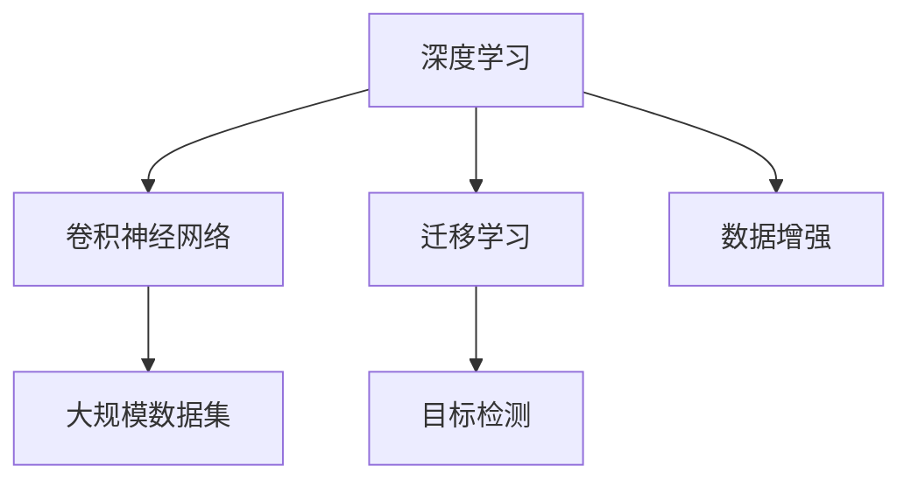

                 

# ImageNet在AI图像识别中的历史

## 1. 背景介绍

### 1.1 问题由来
ImageNet是一个大规模视觉对象识别数据集，是深度学习领域的一个重要里程碑。它最初由斯坦福大学的李飞飞教授和她的团队于2008年提出，旨在创建一个大规模、高精度的图像分类数据库，推动计算机视觉和机器学习的研究。

### 1.2 问题核心关键点
ImageNet的核心贡献在于提供了大规模、高质量的视觉对象识别数据集，推动了深度学习领域中图像分类、目标检测、语义分割等技术的飞速进步。其背后蕴含的技术变革，如卷积神经网络(CNN)、迁移学习、数据增强等，对整个AI领域产生了深远影响。

### 1.3 问题研究意义
ImageNet作为深度学习领域的核心数据集，不仅在学术界引起了广泛关注，也为工业界提供了强大的工具，推动了智能摄像头、自动驾驶、医疗影像分析等领域的创新应用。研究ImageNet的历史，对于理解深度学习的发展脉络，洞察技术变革背后的原理，具有重要意义。

## 2. 核心概念与联系

### 2.1 核心概念概述

为更好地理解ImageNet在AI图像识别中的历史，本节将介绍几个关键概念：

- 深度学习(Deep Learning)：一种模拟人脑神经网络结构的机器学习技术，通过多层非线性变换，从大量数据中自动提取高级特征，实现复杂的任务。
- 卷积神经网络(Convolutional Neural Network, CNN)：一种特殊的深度神经网络，主要用于处理具有网格结构的数据，如图像和视频，通过卷积操作提取局部特征。
- 迁移学习(Transfer Learning)：将一个领域学习到的知识，迁移应用到另一个相关领域的学习范式。ImageNet中预训练的模型可以作为迁移学习的源，用于新的目标任务。
- 数据增强(Data Augmentation)：通过对训练集进行数据增强操作，如旋转、缩放、平移等，丰富训练集多样性，提高模型的泛化能力。
- 大规模数据集(Large-scale Dataset)：ImageNet拥有大规模、高精度的图像数据集，涵盖成千上万个类别，是深度学习模型预训练和微调的重要来源。
- 目标检测(Object Detection)：在图像中检测并定位出感兴趣的对象，并给出其类别标签。ImageNet的预训练模型被广泛应用于目标检测任务中。

这些核心概念通过以下Mermaid流程图来展示：



该流程图展示了深度学习、卷积神经网络、迁移学习、数据增强、大规模数据集和目标检测等概念之间的联系：

- 深度学习通过卷积神经网络处理大规模数据集，并进行迁移学习，实现目标检测等任务。
- 数据增强丰富了训练集的多样性，提升了模型的泛化能力。

## 3. 核心算法原理 & 具体操作步骤
### 3.1 算法原理概述

ImageNet的贡献在于提供了一个大规模的视觉对象识别数据集，通过大规模数据集和深度学习模型相结合，推动了图像识别技术的飞速进步。其核心算法原理包括：

- **大规模数据集构建**：ImageNet包含了超过100万张高质量的图像，涵盖了成千上万个类别，为深度学习模型的预训练提供了丰富且多样化的数据。
- **深度学习模型的预训练**：通过在大规模数据集上进行预训练，学习到图像的高级特征表示，用于后续的微调或迁移学习。
- **迁移学习的实现**：将预训练的模型应用于新的目标任务，利用迁移学习机制提高模型在新任务上的表现。

### 3.2 算法步骤详解

ImageNet的预训练过程主要包括以下几个关键步骤：

1. **数据收集与标注**：ImageNet收集了来自互联网的数百万张图像，并由众包平台进行手工标注。每个图像都标注了至少一个类别，标注数据集分为训练集、验证集和测试集。
2. **模型构建与预训练**：使用深度学习框架，构建卷积神经网络模型，如AlexNet、VGGNet、ResNet等。在ImageNet训练集上对模型进行预训练，学习到图像的高级特征表示。
3. **迁移学习应用**：在新的目标任务上，使用预训练模型进行微调或迁移学习，优化模型在新任务上的性能。

具体步骤如下：

1. **选择合适的预训练模型**：如VGGNet、ResNet等，选择其在ImageNet上训练好的模型作为初始化参数。
2. **数据准备**：将目标任务的图像数据划分为训练集、验证集和测试集，并进行数据增强，如随机旋转、缩放、裁剪等。
3. **微调模型**：在目标任务的训练集上对预训练模型进行微调，使用新的损失函数和优化器进行训练。
4. **验证与测试**：在验证集上评估微调后的模型性能，并进行调整，直到达到最佳性能。在测试集上进一步验证模型的泛化能力。

### 3.3 算法优缺点

ImageNet的预训练和微调方法具有以下优点：

- **性能提升**：通过大规模数据集进行预训练，模型能学习到丰富的图像特征，显著提升在目标任务上的表现。
- **泛化能力强**：大规模数据集提高了模型的泛化能力，使其在新任务上也能表现优异。
- **计算效率高**：通过迁移学习机制，利用预训练模型的特征表示，减少了训练时间，提高了计算效率。

同时，ImageNet的方法也存在一些局限性：

- **标注成本高**：ImageNet的标注数据集构建成本高，需要大量的人力物力。
- **过拟合风险**：大规模数据集容易导致模型过拟合，需要更多的正则化技术来缓解。
- **通用性有限**：ImageNet的预训练模型在特定领域的微调效果可能有限，需要针对特定任务进行微调。
- **数据隐私问题**：ImageNet的标注数据集来源于互联网，可能存在隐私泄露的风险。

尽管存在这些局限性，但ImageNet的预训练和微调方法仍然是深度学习领域的重要范式，推动了图像识别技术的快速发展。

### 3.4 算法应用领域

ImageNet的预训练和微调方法在深度学习领域得到了广泛应用，涵盖了许多重要的应用场景：

- **计算机视觉**：ImageNet的预训练模型被广泛应用于目标检测、图像分类、语义分割等计算机视觉任务中。
- **自动驾驶**：在自动驾驶领域，ImageNet的预训练模型用于提取道路标志、车辆等关键信息，辅助自动驾驶决策。
- **医疗影像分析**：在医疗影像分析领域，ImageNet的预训练模型用于识别病变区域、判断疾病等，提高疾病诊断的准确性。
- **安防监控**：在安防监控领域，ImageNet的预训练模型用于识别人脸、车辆等关键对象，提升安全防范能力。
- **智能家居**：在智能家居领域，ImageNet的预训练模型用于识别物品、人脸等，实现智能家居的自动化控制。

## 4. 数学模型和公式 & 详细讲解 & 举例说明

### 4.1 数学模型构建

ImageNet的预训练和微调过程涉及多个数学模型，包括卷积神经网络、迁移学习、数据增强等。以VGGNet为例，其数学模型构建过程如下：

- **卷积层(Convolutional Layer)**：用于提取图像的局部特征。数学公式如下：
  $$
  y_i = \sigma\left(\sum_{j=1}^n w_{ij} * x_{ij} + b_i\right)
  $$
  其中 $x_{ij}$ 为输入图像的局部特征图，$w_{ij}$ 为卷积核权重，$b_i$ 为偏置项，$\sigma$ 为激活函数。
  
- **池化层(Pooling Layer)**：用于对卷积层的输出进行下采样，减少参数量。数学公式如下：
  $$
  y_i = \max_{j=1}^m x_{ij}
  $$
  其中 $x_{ij}$ 为卷积层的输出，$y_i$ 为池化层的输出。
  
- **全连接层(Fully Connected Layer)**：用于将池化层的输出映射到目标类别上。数学公式如下：
  $$
  y = \sigma\left(\sum_{i=1}^n w_i x_i + b\right)
  $$
  其中 $x_i$ 为池化层的输出，$w_i$ 为权重，$b$ 为偏置项，$\sigma$ 为激活函数。

### 4.2 公式推导过程

以VGGNet为例，其卷积层的输出可以表示为：

$$
y = \sigma\left(\sum_{j=1}^n w_{ij} * x_{ij} + b_i\right)
$$

其中 $x_{ij}$ 为输入图像的局部特征图，$w_{ij}$ 为卷积核权重，$b_i$ 为偏置项，$\sigma$ 为激活函数。

在图像分类任务中，损失函数通常使用交叉熵损失函数，数学公式如下：

$$
L = -\sum_{i=1}^N \sum_{c=1}^C y_{ic} \log p_{ic}
$$

其中 $N$ 为样本数量，$C$ 为类别数量，$y_{ic}$ 为样本 $i$ 属于类别 $c$ 的标签，$p_{ic}$ 为模型对样本 $i$ 属于类别 $c$ 的概率。

在微调过程中，模型参数的更新公式为：

$$
\theta \leftarrow \theta - \eta \nabla_{\theta}L
$$

其中 $\eta$ 为学习率，$\nabla_{\theta}L$ 为损失函数对模型参数的梯度。

### 4.3 案例分析与讲解

以ImageNet上预训练的VGGNet模型为例，我们以数字图像分类为例进行讲解。首先，将ImageNet训练集划分为训练集、验证集和测试集。对每个图像进行预处理，如归一化、裁剪等。

接着，使用VGGNet模型对训练集进行预训练，学习到图像的高级特征表示。在新的目标任务（如手写数字识别）上进行微调，使用交叉熵损失函数进行训练。

在微调过程中，需要注意以下几点：

- **学习率**：微调过程中的学习率通常要比预训练时小1-2个数量级，以免破坏预训练权重。
- **数据增强**：对训练集进行数据增强，如旋转、缩放、平移等，丰富训练集的多样性。
- **正则化**：使用L2正则、Dropout等正则化技术，防止过拟合。
- **迁移学习**：利用预训练模型的特征表示，减少训练时间，提高计算效率。

## 5. 项目实践：代码实例和详细解释说明
### 5.1 开发环境搭建

在进行ImageNet预训练和微调实践前，我们需要准备好开发环境。以下是使用Python进行TensorFlow开发的环境配置流程：

1. 安装Anaconda：从官网下载并安装Anaconda，用于创建独立的Python环境。

2. 创建并激活虚拟环境：
```bash
conda create -n tf-env python=3.8 
conda activate tf-env
```

3. 安装TensorFlow：从官网获取对应的安装命令，如安装2.5.0版本：
```bash
pip install tensorflow==2.5.0
```

4. 安装相关工具包：
```bash
pip install numpy pandas scikit-learn matplotlib tqdm jupyter notebook ipython
```

完成上述步骤后，即可在`tf-env`环境中开始ImageNet预训练和微调实践。

### 5.2 源代码详细实现

下面我们以手写数字识别任务为例，给出使用TensorFlow对VGGNet模型进行预训练和微调的代码实现。

首先，定义手写数字识别任务的数据处理函数：

```python
import tensorflow as tf
from tensorflow.keras.datasets import mnist
from tensorflow.keras.utils import to_categorical

def preprocess_data():
    (x_train, y_train), (x_test, y_test) = mnist.load_data()
    x_train = x_train / 255.0
    x_test = x_test / 255.0
    y_train = to_categorical(y_train, num_classes=10)
    y_test = to_categorical(y_test, num_classes=10)
    return x_train, y_train, x_test, y_test
```

然后，定义VGGNet模型：

```python
from tensorflow.keras.layers import Input, Conv2D, MaxPooling2D, Flatten, Dense, Dropout

def vggnet(input_shape=(28, 28, 1)):
    x = Input(shape=input_shape)
    x = Conv2D(64, 3, activation='relu')(x)
    x = Conv2D(64, 3, activation='relu')(x)
    x = MaxPooling2D(pool_size=(2, 2))(x)
    x = Conv2D(128, 3, activation='relu')(x)
    x = Conv2D(128, 3, activation='relu')(x)
    x = MaxPooling2D(pool_size=(2, 2))(x)
    x = Flatten()(x)
    x = Dense(256, activation='relu')(x)
    x = Dropout(0.5)(x)
    x = Dense(10, activation='softmax')(x)
    return x
```

接着，定义模型训练函数：

```python
def train_model(model, x_train, y_train, x_test, y_test, epochs=10, batch_size=32, learning_rate=1e-4):
    model.compile(optimizer=tf.keras.optimizers.Adam(learning_rate=learning_rate),
                  loss='categorical_crossentropy',
                  metrics=['accuracy'])
    model.fit(x_train, y_train, epochs=epochs, batch_size=batch_size, validation_data=(x_test, y_test))
```

最后，启动训练流程并在测试集上评估：

```python
x_train, y_train, x_test, y_test = preprocess_data()

model = vggnet(input_shape=(28, 28, 1))
train_model(model, x_train, y_train, x_test, y_test, epochs=10, batch_size=32, learning_rate=1e-4)

print('Test accuracy:', model.evaluate(x_test, y_test)[1])
```

以上就是使用TensorFlow对VGGNet进行手写数字识别任务预训练和微调的完整代码实现。可以看到，通过TensorFlow的Keras API，构建和训练VGGNet模型变得相对简单。

### 5.3 代码解读与分析

让我们再详细解读一下关键代码的实现细节：

**preprocess_data函数**：
- 加载MNIST数据集。
- 对图像进行归一化处理。
- 将标签进行独热编码处理。

**vggnet函数**：
- 定义VGGNet模型结构。包括卷积层、池化层、全连接层和Dropout层。

**train_model函数**：
- 定义模型，使用Adam优化器，交叉熵损失函数和准确率指标。
- 在训练集上进行模型训练，并在验证集上评估性能。

**训练流程**：
- 在测试集上评估微调后的模型性能，输出准确率。

可以看到，TensorFlow的Keras API提供了丰富的API和组件，使得构建和训练深度学习模型变得非常简便。开发者可以更多地关注模型的优化和调参。

## 6. 实际应用场景
### 6.1 智能安防系统

ImageNet预训练模型在智能安防系统中得到了广泛应用，可以用于人脸识别、行为分析等任务。通过收集实时监控视频数据，使用ImageNet预训练模型进行目标检测和识别，提升监控系统的智能化水平。

在技术实现上，可以将监控视频帧输入到预训练模型中，获取目标对象的类别和位置信息。结合跟踪算法，可以实现对目标对象的实时监测和预警。对于异常行为，可以进一步使用行为分析模型进行识别，及时发出警报。

### 6.2 医疗影像诊断

在医疗影像诊断领域，ImageNet预训练模型被广泛应用于病变区域检测和疾病诊断。通过将医疗影像数据输入到预训练模型中，模型能够自动提取病变区域的高级特征，辅助医生进行疾病诊断。

在实际应用中，医生可以上传患者的影像数据，使用预训练模型检测出病变区域，并结合医生的临床经验进行诊断。预训练模型的高泛化能力，可以辅助医生识别出一些较为隐蔽的病变，提高诊断的准确性。

### 6.3 自动驾驶系统

在自动驾驶领域，ImageNet预训练模型用于提取道路标志、车辆等关键信息，辅助自动驾驶决策。通过在训练集中添加道路标志、交通信号等样本，进行迁移学习，模型能够快速适应新的环境。

在实际应用中，自动驾驶系统可以实时获取车辆周围环境的数据，如摄像头图像、雷达数据等。使用ImageNet预训练模型进行目标检测和识别，结合导航算法，实现对车辆周围环境的实时监控和决策。

### 6.4 未来应用展望

随着ImageNet预训练模型的不断演进，其在AI图像识别中的应用将更加广泛。未来，预训练模型将逐步引入更多高级特征提取技术，如注意力机制、残差网络等，进一步提升模型的性能和泛化能力。同时，预训练模型将与其他AI技术进行更深层次的融合，如自然语言处理、语音识别等，推动AI技术的进一步发展。

## 7. 工具和资源推荐
### 7.1 学习资源推荐

为了帮助开发者系统掌握ImageNet的历史和应用，这里推荐一些优质的学习资源：

1. **《深度学习》课程**：斯坦福大学开设的深度学习课程，涵盖了卷积神经网络、迁移学习等核心内容，非常适合初学者。

2. **TensorFlow官方文档**：TensorFlow官方文档提供了丰富的教程和示例代码，适合深入学习TensorFlow的使用方法。

3. **Kaggle竞赛**：Kaggle平台上许多与ImageNet相关的竞赛，参与竞赛可以积累实战经验，提升技能水平。

4. **ImageNet论文集**：ImageNet官方提供了丰富的论文集，涵盖从数据集构建到模型训练的各个方面，非常适合深度学习从业者阅读。

5. **GitHub开源项目**：GitHub上许多与ImageNet相关的开源项目，如TensorFlow官方示例、预训练模型等，可以提供丰富的学习资料。

通过对这些资源的学习实践，相信你一定能够全面掌握ImageNet的历史和应用，并用于解决实际的图像识别问题。

### 7.2 开发工具推荐

高效的开发离不开优秀的工具支持。以下是几款用于ImageNet预训练和微调开发的常用工具：

1. **TensorFlow**：由Google主导开发的开源深度学习框架，生产部署方便，适合大规模工程应用。提供了丰富的预训练模型和组件。

2. **Keras**：TensorFlow的高层API，提供了简洁易用的API，适合快速原型开发和模型训练。

3. **PyTorch**：由Facebook开发的开源深度学习框架，动态计算图，适合快速迭代研究。提供了丰富的预训练模型和组件。

4. **Jupyter Notebook**：交互式开发环境，适合进行快速原型开发和模型调试。

5. **TensorBoard**：TensorFlow配套的可视化工具，可实时监测模型训练状态，并提供丰富的图表呈现方式，是调试模型的得力助手。

6. **GitHub**：代码托管平台，适合进行代码管理和版本控制，提供丰富的开源资源和社区支持。

合理利用这些工具，可以显著提升ImageNet预训练和微调任务的开发效率，加快创新迭代的步伐。

### 7.3 相关论文推荐

ImageNet的预训练和微调技术的发展源于学界的持续研究。以下是几篇奠基性的相关论文，推荐阅读：

1. **ImageNet大规模视觉识别挑战**：2010年，ImageNet提出的挑战赛，推动了计算机视觉领域的快速发展。

2. **Very Deep Convolutional Networks for Large-Scale Image Recognition**：AlexNet论文，展示了深度卷积神经网络在图像分类任务上的强大能力。

3. **Rethinking the Inception Architecture for Computer Vision**：Inception系列论文，提出了Inception模块，提升了深度神经网络的计算效率和性能。

4. **GoogleNet**：GoogleNet论文，引入了Inception模块和Global Average Pooling，进一步提升了深度神经网络的性能。

5. **Deep Residual Learning for Image Recognition**：ResNet论文，提出了残差网络，解决了深度神经网络中的梯度消失问题，提升了网络的深度和性能。

这些论文代表了大规模图像识别领域的核心进展，通过学习这些前沿成果，可以帮助研究者把握学科前进方向，激发更多的创新灵感。

## 8. 总结：未来发展趋势与挑战

### 8.1 总结

本文对ImageNet在AI图像识别中的历史进行了全面系统的介绍。首先阐述了ImageNet的构建背景和核心贡献，明确了其在深度学习领域中的重要地位。其次，从原理到实践，详细讲解了ImageNet的预训练和微调过程，给出了ImageNet预训练和微调任务的完整代码实现。同时，本文还广泛探讨了ImageNet在安防、医疗、自动驾驶等多个领域的应用前景，展示了ImageNet预训练和微调方法的强大潜力。

通过本文的系统梳理，可以看到，ImageNet预训练和微调技术推动了深度学习领域的发展，为AI图像识别技术的普及和应用提供了坚实的基础。未来，伴随预训练语言模型和微调方法的持续演进，相信AI图像识别技术必将在更多领域大放异彩，深刻影响人类的生产生活方式。

### 8.2 未来发展趋势

展望未来，ImageNet预训练和微调技术将呈现以下几个发展趋势：

1. **模型规模继续增大**：随着算力成本的下降和数据规模的扩张，预训练模型的参数量还将持续增长。超大规模预训练模型蕴含的丰富特征表示，将推动AI图像识别技术的进一步突破。

2. **迁移学习更加普及**：迁移学习作为预训练-微调的核心范式，将逐步普及到更多领域，推动AI技术的广泛应用。

3. **数据增强技术不断进步**：数据增强技术将不断进步，丰富训练集的多样性，提升模型的泛化能力。

4. **深度学习框架的优化**：TensorFlow、PyTorch等深度学习框架将不断优化，提升计算效率和性能，推动AI技术的普及和应用。

5. **多模态数据融合**：将视觉、语音、文本等多模态数据进行融合，提升AI系统的综合能力，推动AI技术的进一步发展。

以上趋势凸显了ImageNet预训练和微调技术的广阔前景。这些方向的探索发展，必将进一步提升AI图像识别技术的性能和应用范围，为人类认知智能的进化带来深远影响。

### 8.3 面临的挑战

尽管ImageNet预训练和微调技术已经取得了瞩目成就，但在迈向更加智能化、普适化应用的过程中，它仍面临着诸多挑战：

1. **标注成本瓶颈**：ImageNet的标注数据集构建成本高，需要大量的人力物力。对于长尾应用场景，难以获得充足的高质量标注数据，成为制约微调性能的瓶颈。

2. **过拟合风险**：大规模数据集容易导致模型过拟合，需要更多的正则化技术来缓解。

3. **通用性有限**：ImageNet的预训练模型在特定领域的微调效果可能有限，需要针对特定任务进行微调。

4. **数据隐私问题**：ImageNet的标注数据集来源于互联网，可能存在隐私泄露的风险。

尽管存在这些挑战，但ImageNet的预训练和微调方法仍然是深度学习领域的重要范式，推动了图像识别技术的快速发展。

### 8.4 研究展望

面对ImageNet预训练和微调面临的种种挑战，未来的研究需要在以下几个方面寻求新的突破：

1. **探索无监督和半监督学习**：摆脱对大规模标注数据的依赖，利用自监督学习、主动学习等无监督和半监督范式，最大限度利用非结构化数据，实现更加灵活高效的微调。

2. **开发参数高效的微调方法**：开发更加参数高效的微调方法，在固定大部分预训练参数的同时，只更新极少量的任务相关参数。

3. **引入更多先验知识**：将符号化的先验知识，如知识图谱、逻辑规则等，与神经网络模型进行巧妙融合，引导微调过程学习更准确、合理的图像特征表示。

4. **融合因果分析和博弈论工具**：将因果分析方法引入微调模型，识别出模型决策的关键特征，增强输出解释的因果性和逻辑性。借助博弈论工具刻画人机交互过程，主动探索并规避模型的脆弱点，提高系统稳定性。

5. **纳入伦理道德约束**：在模型训练目标中引入伦理导向的评估指标，过滤和惩罚有偏见、有害的输出倾向。同时加强人工干预和审核，建立模型行为的监管机制，确保输出符合人类价值观和伦理道德。

这些研究方向的探索，必将引领ImageNet预训练和微调技术迈向更高的台阶，为构建安全、可靠、可解释、可控的智能系统铺平道路。面向未来，ImageNet预训练和微调技术还需要与其他AI技术进行更深入的融合，如知识表示、因果推理、强化学习等，多路径协同发力，共同推动AI图像识别系统的进步。只有勇于创新、敢于突破，才能不断拓展预训练语言模型的边界，让智能技术更好地造福人类社会。

## 9. 附录：常见问题与解答

**Q1：ImageNet预训练和微调需要大量标注数据，数据获取成本高吗？**

A: ImageNet的标注数据集构建成本确实较高，需要大量的人力物力。但随着深度学习框架和工具的不断优化，以及AI开源社区的壮大，标注数据的获取成本正在逐步降低。同时，对于一些特定领域的长尾任务，也可以通过领域语料和半监督学习等方式进行微调，减少对大规模标注数据的依赖。

**Q2：ImageNet预训练和微调过程中如何进行数据增强？**

A: 数据增强是ImageNet预训练和微调过程中非常重要的技术手段，可以通过以下方式进行：
1. 随机旋转、缩放、平移、翻转等操作。
2. 添加噪声、剪切、插值等操作。
3. 对图像进行随机裁剪、填充等操作。
4. 利用对抗样本进行攻击和防御。

通过这些数据增强操作，可以显著提升模型在各种场景下的泛化能力。

**Q3：ImageNet预训练和微调过程中如何进行模型裁剪？**

A: 模型裁剪是指在不影响模型性能的前提下，去除冗余的模型参数和计算资源，从而实现轻量化和高效推理。常用的模型裁剪方法包括：
1. 剪枝(Pruning)：去除低权重的连接和节点，保留重要的结构。
2. 量化(Quantization)：将高精度的浮点数参数转换为低精度的定点数参数，减小内存占用和计算量。
3. 权重共享(Weight Sharing)：将多个模型层共享相同的权重，减少模型参数。

通过这些技术手段，可以显著提升ImageNet预训练和微调模型的推理效率和资源利用率。

**Q4：ImageNet预训练和微调过程中如何进行迁移学习？**

A: 迁移学习是指将预训练模型应用于新的目标任务，利用已学到的知识进行微调。在ImageNet预训练和微调过程中，迁移学习可以大大减少训练时间和计算资源。具体步骤如下：
1. 选择预训练模型，如VGGNet、ResNet等。
2. 将预训练模型作为初始化参数。
3. 对新的目标任务进行微调，使用新的损失函数和优化器进行训练。
4. 在验证集上评估微调后的模型性能，并进行调整，直到达到最佳性能。

通过迁移学习，可以有效地利用预训练模型的知识，提高微调模型的泛化能力和性能。

**Q5：ImageNet预训练和微调过程中如何进行对抗训练？**

A: 对抗训练是一种通过引入对抗样本进行训练，提高模型鲁棒性的技术手段。在ImageNet预训练和微调过程中，可以通过以下方式进行对抗训练：
1. 收集对抗样本，如输入噪声、扰动图像等。
2. 在训练过程中加入对抗样本，进行对抗训练。
3. 使用对抗性损失函数，如FGM、PGD等，对模型进行对抗训练。

通过对抗训练，可以提高ImageNet预训练和微调模型的鲁棒性和泛化能力，提升模型在各种场景下的表现。

综上所述，ImageNet预训练和微调技术不仅在学术界引起了广泛关注，也为工业界提供了强大的工具，推动了智能摄像头、自动驾驶、医疗影像分析等领域的创新应用。通过学习ImageNet的历史和技术，相信你一定能够全面掌握预训练语言模型的预训练和微调技术，并用于解决实际的图像识别问题。

---

作者：禅与计算机程序设计艺术 / Zen and the Art of Computer Programming

