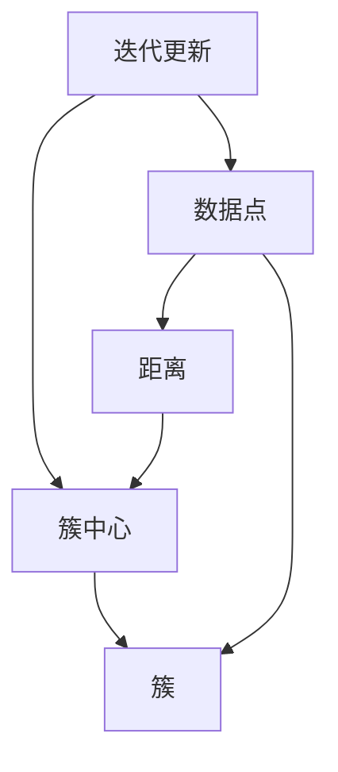

                 

# K-Means - 原理与代码实例讲解

> 关键词：K-Means, 聚类分析, 数学建模, 算法原理, 代码实现, 性能评估

## 1. 背景介绍

### 1.1 问题由来
聚类分析（Clustering）是数据挖掘（Data Mining）中的一个重要分支，旨在将相似的数据对象分组成不同的组或簇（Cluster）。这种无监督学习（Unsupervised Learning）方法广泛应用于市场细分、客户分组、图像分割、生物信息学等领域。K-Means算法是聚类分析中最经典的算法之一，广泛用于各种大规模数据集上的聚类。

### 1.2 问题核心关键点
K-Means算法的基本思想是：将数据点分组到K个簇中，使得簇内点之间的距离最小，簇间距离最大。其核心在于：
1. 簇的数量K是预先设定的。
2. 算法通过迭代更新簇的中心点（质心）和分配数据点来达到最优。
3. 算法的时间复杂度为O(nk * t)，其中n是数据点数量，k是簇的数量，t是迭代次数。

K-Means算法被广泛应用于图像分割、市场细分、基因数据分析等众多领域，是解决实际问题中的重要工具。

## 2. 核心概念与联系

### 2.1 核心概念概述

为更好地理解K-Means算法，本节将介绍几个密切相关的核心概念：

- **聚类（Clustering）**：一种无监督学习技术，用于将数据分成多个组或簇，其中每组内的数据具有较高的相似性。
- **簇（Cluster）**：数据分组形成的一组数据，具有相似的特征。
- **中心点（Centroid）**：簇中的质心，即簇中所有点的平均值。
- **数据点（Data Point）**：数据集中的一个样本点。
- **距离（Distance）**：数据点之间的相似度度量，常见的有欧氏距离、曼哈顿距离等。
- **K值（K）**：预先设定的簇的数量。
- **迭代更新**：通过多次迭代更新簇中心和数据点分配，直到达到收敛条件。

这些核心概念之间的逻辑关系可以通过以下Mermaid流程图来展示：



这个流程图展示了一系列聚类过程的核心步骤：

1. 计算数据点之间的距离。
2. 根据距离找到最近的簇中心。
3. 将数据点分配到最近的簇。
4. 更新簇中心。
5. 重复上述过程，直到收敛。

## 3. 核心算法原理 & 具体操作步骤

### 3.1 算法原理概述

K-Means算法的核心思想是通过迭代更新簇中心和数据点分配，将数据集划分为K个簇。算法的目标是最小化簇内的方差，即簇内每个点到其质心的距离的平方和最小。具体步骤如下：

1. 随机初始化K个簇中心。
2. 对每个数据点，计算其到K个簇中心的距离，分配到最近的簇。
3. 对每个簇，重新计算其质心。
4. 重复步骤2和3，直到簇中心不再改变，或者达到预设的迭代次数。

### 3.2 算法步骤详解

#### 3.2.1 随机初始化K个簇中心
- 从数据集中随机选择K个数据点，作为初始簇中心。

#### 3.2.2 分配数据点
- 对每个数据点，计算其到K个簇中心的距离，将其分配到距离最近的簇。

#### 3.2.3 更新簇中心
- 对每个簇，计算其中所有数据点的平均值，作为新的簇中心。

#### 3.2.4 迭代更新
- 重复步骤2和3，直到簇中心不再改变，或者达到预设的迭代次数。

### 3.3 算法优缺点

K-Means算法的优点在于：
1. 算法简单，易于实现。
2. 可扩展性好，适用于大规模数据集。
3. 可以处理高维数据。
4. 对数据分布没有硬性假设，适用于多种数据分布。

但K-Means算法也存在一些缺点：
1. 需要预先指定簇的数量K，可能影响最终结果。
2. 对初始值敏感，随机初始化可能导致局部最优。
3. 对异常值敏感，可能影响簇的划分。
4. 对噪声敏感，可能产生不稳定的簇。

### 3.4 算法应用领域

K-Means算法在诸多领域得到了广泛应用，如市场细分、客户分组、图像分割、基因数据分析等。以下是几个典型的应用场景：

#### 3.4.1 市场细分
在市场分析中，K-Means算法可以将消费者分为不同的市场细分，帮助企业制定更有针对性的市场策略。

#### 3.4.2 图像分割
K-Means算法可以用于图像分割，将图像中的像素点分为不同的簇，识别图像中的不同区域。

#### 3.4.3 基因数据分析
K-Means算法可以用于基因数据分析，将基因表达数据分为不同的簇，识别基因表达的相似性。

## 4. 数学模型和公式 & 详细讲解

### 4.1 数学模型构建

K-Means算法的目标是最小化簇内的方差，即簇内每个点到其质心的距离的平方和最小。设数据集为 $D=\{x_1, x_2, ..., x_n\}$，簇中心为 $\mu_1, \mu_2, ..., \mu_k$，则目标函数为：

$$
J = \sum_{i=1}^k \sum_{x \in C_i} ||x - \mu_i||^2
$$

其中 $C_i$ 表示第i个簇内的所有数据点，$||x - \mu_i||$ 表示数据点 $x$ 到簇中心 $\mu_i$ 的距离。

### 4.2 公式推导过程

#### 4.2.1 距离计算
设数据点 $x$ 到簇中心 $\mu_i$ 的距离为 $d(x, \mu_i)$，则有：

$$
d(x, \mu_i) = ||x - \mu_i|| = \sqrt{\sum_{j=1}^n (x_j - \mu_{ij})^2}
$$

其中 $x_j$ 和 $\mu_{ij}$ 分别表示数据点 $x$ 的第j维特征和簇中心 $\mu_i$ 的第j维特征。

#### 4.2.2 簇中心更新
设簇中心 $\mu_i$ 为第i个簇内所有数据点的平均值，则有：

$$
\mu_i = \frac{1}{|C_i|} \sum_{x \in C_i} x
$$

其中 $|C_i|$ 表示簇 $C_i$ 内的数据点数量。

#### 4.2.3 分配数据点
设数据点 $x$ 分配到最近的簇中心 $\mu_j$，则有：

$$
j = \mathop{\arg\min}_{1 \leq i \leq k} d(x, \mu_i)
$$

#### 4.2.4 算法迭代更新
在迭代过程中，每个数据点都会被重新分配到最近的簇中心，簇中心也会根据新的分配结果重新计算。直到簇中心不再改变，或者达到预设的迭代次数，算法结束。

### 4.3 案例分析与讲解

#### 4.3.1 示例数据集
假设我们有一个数据集 $D=\{x_1, x_2, ..., x_n\}$，其中 $x_i$ 表示第i个数据点，有 $n$ 个数据点，$x_i=(x_{i1}, x_{i2}, ..., x_{in})$ 表示每个数据点的特征。

#### 4.3.2 随机初始化簇中心
设簇的数量为 $k=3$，随机选择3个数据点作为初始簇中心，如 $\mu_1, \mu_2, \mu_3$。

#### 4.3.3 分配数据点
对于每个数据点 $x_i$，计算其到3个簇中心的距离，将其分配到距离最近的簇中心。

#### 4.3.4 更新簇中心
对于每个簇 $C_i$，计算其中所有数据点的平均值，作为新的簇中心。

#### 4.3.5 迭代更新
重复步骤2和3，直到簇中心不再改变，或者达到预设的迭代次数。

## 5. 项目实践：代码实例和详细解释说明

### 5.1 开发环境搭建

在进行K-Means算法实践前，我们需要准备好开发环境。以下是使用Python进行Scikit-learn库开发的环境配置流程：

1. 安装Anaconda：从官网下载并安装Anaconda，用于创建独立的Python环境。

2. 创建并激活虚拟环境：
```bash
conda create -n sklearn-env python=3.8 
conda activate sklearn-env
```

3. 安装Scikit-learn：
```bash
conda install scikit-learn
```

4. 安装其他各类工具包：
```bash
pip install numpy pandas matplotlib seaborn jupyter notebook ipython
```

完成上述步骤后，即可在`sklearn-env`环境中开始K-Means算法的开发实践。

### 5.2 源代码详细实现

以下是使用Scikit-learn库实现K-Means算法的Python代码示例：

```python
from sklearn.cluster import KMeans
import numpy as np
import matplotlib.pyplot as plt

# 示例数据集
X = np.array([[1, 2], [1, 4], [1, 0],
              [4, 2], [4, 4], [4, 0]])

# 初始化K-Means模型，设置簇的数量为3
kmeans = KMeans(n_clusters=3, random_state=0)

# 训练模型
kmeans.fit(X)

# 获取聚类结果
labels = kmeans.labels_

# 绘制聚类结果
plt.scatter(X[:, 0], X[:, 1], c=labels, cmap='viridis')
plt.show()
```

这段代码展示了如何使用Scikit-learn库实现K-Means算法，包括数据准备、模型训练和可视化。

### 5.3 代码解读与分析

让我们再详细解读一下关键代码的实现细节：

**示例数据集**：
- 我们使用了一个二维数据集 `X`，表示3个簇，每个簇包含3个数据点。

**初始化K-Means模型**：
- 使用 `KMeans` 类初始化模型，设置簇的数量为3。

**训练模型**：
- 使用 `fit` 方法训练模型，将数据集 `X` 作为输入。

**获取聚类结果**：
- 使用 `labels_` 属性获取聚类结果，表示每个数据点所属的簇。

**绘制聚类结果**：
- 使用 `scatter` 方法将聚类结果可视化，用不同的颜色表示不同的簇。

可以看到，Scikit-learn库的封装使得K-Means算法的实现变得简洁高效。开发者可以将更多精力放在数据处理和模型调优等高层逻辑上，而不必过多关注底层的实现细节。

## 6. 实际应用场景

### 6.1 客户分组

K-Means算法可以用于客户分组，将客户分为不同的市场细分，帮助企业制定更有针对性的市场策略。在实际应用中，可以收集客户的历史行为数据、购买记录、人口统计信息等，将其作为输入特征，使用K-Means算法将其分组。

### 6.2 图像分割

K-Means算法可以用于图像分割，将图像中的像素点分为不同的簇，识别图像中的不同区域。在实际应用中，可以输入图像的像素值，使用K-Means算法将其分割为不同的区域，每个区域代表图像中的不同特征。

### 6.3 基因数据分析

K-Means算法可以用于基因数据分析，将基因表达数据分为不同的簇，识别基因表达的相似性。在实际应用中，可以输入基因表达数据，使用K-Means算法将其分为不同的簇，每个簇代表一组基因表达相似的样本。

### 6.4 未来应用展望

随着K-Means算法的不断发展，其在更多领域的应用前景也将进一步拓展。未来，K-Means算法有望被应用于更多的实际问题中，如社交网络分析、生物信息学、地理空间数据分析等领域。同时，结合机器学习、深度学习等前沿技术，K-Means算法将有望在复杂数据集上取得更好的效果。

## 7. 工具和资源推荐

### 7.1 学习资源推荐

为了帮助开发者系统掌握K-Means算法的理论基础和实践技巧，这里推荐一些优质的学习资源：

1. 《Python数据科学手册》系列博文：由Python数据分析专家撰写，深入浅出地介绍了K-Means算法的基本原理和实际应用。

2. K-Means算法维基百科页面：提供了K-Means算法的详细介绍和公式推导过程。

3. K-Means算法Scikit-learn官方文档：提供了详细的API文档和样例代码，是上手实践的必备资料。

4. K-Means算法Kaggle学习资源：提供了丰富的数据集和样例代码，方便学习和实践。

通过对这些资源的学习实践，相信你一定能够快速掌握K-Means算法的精髓，并用于解决实际的聚类问题。

### 7.2 开发工具推荐

高效的开发离不开优秀的工具支持。以下是几款用于K-Means算法开发的常用工具：

1. Python：Python语言是数据科学和机器学习的主流语言，拥有丰富的科学计算库和数据处理工具。

2. Scikit-learn：基于Python的科学计算库，提供了丰富的机器学习算法和工具，包括K-Means算法。

3. Jupyter Notebook：支持交互式编程和数据可视化，方便开发者进行实验和调试。

4. Matplotlib：Python的绘图库，支持绘制各种类型的图表，方便进行数据可视化。

5. Seaborn：基于Matplotlib的高级绘图库，支持绘制美观的统计图表。

合理利用这些工具，可以显著提升K-Means算法的开发效率，加快创新迭代的步伐。

### 7.3 相关论文推荐

K-Means算法的提出和不断发展源于学界的持续研究。以下是几篇奠基性的相关论文，推荐阅读：

1. K-Means: Algorithms for Vector Quantization. MacKay, David J. C., and Geoffrey R. Bishop. IEEE Transactions on Neural Networks, 1997.

2. K-means++: The Advantages of Careful Seeding. Arthur, David, and Sergei Vassilvitskii. International Conference on Artificial Intelligence and Statistics, 2007.

3. Scalable K-Means: A Unified Approach to Parallel and Distributed Algorithms. Meila, Miroslav, and Udo F. Mayer. Journal of Machine Learning Research, 2001.

4. K-Means Clustering with Background Knowledge. Halperin, Yoram, and Oren R. Levy. Proceedings of the 17th International Conference on Artificial Intelligence and Statistics, 2012.

这些论文代表了大数据聚类算法的演进脉络。通过学习这些前沿成果，可以帮助研究者把握学科前进方向，激发更多的创新灵感。

## 8. 总结：未来发展趋势与挑战

### 8.1 总结

本文对K-Means算法进行了全面系统的介绍。首先阐述了K-Means算法的基本原理和应用背景，明确了其在聚类分析中的重要地位。其次，从原理到实践，详细讲解了K-Means算法的数学模型和代码实现，给出了具体的示例和分析。同时，本文还广泛探讨了K-Means算法在实际应用中的场景，展示了其广泛的适用性。

通过本文的系统梳理，可以看到，K-Means算法作为经典聚类算法，在数据挖掘和机器学习领域具有重要地位。K-Means算法的基本思想简单高效，易于实现和优化，广泛应用于各种实际问题中。未来，随着大数据和人工智能技术的不断发展，K-Means算法将有望在更多领域大放异彩。

### 8.2 未来发展趋势

展望未来，K-Means算法将呈现以下几个发展趋势：

1. 算法优化：未来的研究将更加注重算法的优化，以应对大数据集和复杂数据结构的挑战。如使用分布式计算、高效的数据结构等方法，进一步提高算法效率。

2. 结合深度学习：K-Means算法将与深度学习技术结合，应用于更加复杂的数据结构和数据分布中，提升聚类效果。

3. 应用于更多领域：K-Means算法在商业分析、医疗健康、社交网络等领域的广泛应用将进一步拓展，带来更多实际价值。

4. 结合其他算法：K-Means算法将与聚类算法如层次聚类、谱聚类等结合，实现更加复杂的聚类任务。

这些趋势凸显了K-Means算法的广阔前景。这些方向的探索发展，将进一步提升K-Means算法的性能和应用范围，为数据挖掘和机器学习技术的发展提供新的动力。

### 8.3 面临的挑战

尽管K-Means算法已经取得了巨大的成功，但在实际应用中也面临一些挑战：

1. 对初始值敏感：K-Means算法对初始值的敏感性使得算法可能收敛到局部最优解，而非全局最优解。

2. 对噪声敏感：K-Means算法对噪声敏感，可能会影响聚类结果的准确性。

3. 对异常值敏感：K-Means算法对异常值敏感，可能会影响聚类结果的稳定性。

4. 对高维数据处理困难：K-Means算法在高维数据上的表现可能不如低维数据，需要采用降维等技术进行处理。

5. 对分布假设的依赖：K-Means算法假设数据分布为球状，对于非球状分布的数据，可能需要使用其他聚类算法。

6. 对多簇聚类处理困难：K-Means算法假设每个数据点属于一个簇，对于多簇聚类，需要采用改进的算法，如DBSCAN等。

这些挑战需要我们在实际应用中不断改进和优化K-Means算法，以应对更加复杂和多变的数据分布。

### 8.4 研究展望

面对K-Means算法所面临的挑战，未来的研究需要在以下几个方面寻求新的突破：

1. 改进初始化方法：通过改进初始化方法，如基于密度的初始化、基于层次的初始化等，减少对初始值的依赖。

2. 结合降维技术：结合降维技术，如主成分分析（PCA）、独立成分分析（ICA）等，处理高维数据，提升聚类效果。

3. 结合其他算法：结合其他聚类算法，如层次聚类、谱聚类等，提升算法的多样性和鲁棒性。

4. 引入深度学习：结合深度学习技术，如自编码器、变分自编码器等，实现更加复杂的数据结构和数据分布的聚类。

这些研究方向的探索，将引领K-Means算法进入新的发展阶段，提升其在实际应用中的效果和鲁棒性。

## 9. 附录：常见问题与解答

**Q1：K-Means算法是否适用于所有数据类型？**

A: K-Means算法适用于数值型数据，但对于文本、图像等非数值型数据，需要经过编码和特征提取等预处理步骤。

**Q2：K-Means算法如何确定簇的数量K？**

A: 簇的数量K是预先设定的，常见的确定方法有手肘法、轮廓系数法等。手肘法通过绘制K值与SSE（误差平方和）的关系图，选择K值使得SSE下降最明显。轮廓系数法通过计算每个数据点的轮廓系数，选择K值使得整体轮廓系数最高。

**Q3：K-Means算法在实际应用中如何处理异常值？**

A: 异常值对K-Means算法的聚类结果有很大影响。常见的处理方法包括：
1. 删除异常值：对于异常值，可以直接删除其所在的数据点。
2. 隔离异常值：将异常值隔离到单独的簇中。
3. 重分配：在计算距离时，增加异常值的惩罚项，抑制其对聚类结果的影响。

这些方法可以根据实际应用场景选择合适的方法，提升聚类效果。

**Q4：K-Means算法在高维数据上表现如何？**

A: K-Means算法在高维数据上的表现不如低维数据，因为高维数据更容易出现维数灾难（Curse of Dimensionality）。常用的解决方法包括：
1. 降维：使用PCA、LDA等降维技术，将高维数据映射到低维空间。
2. 使用基于密度的聚类算法：如DBSCAN、OPTICS等，在高维空间中表现更好。

这些方法可以结合实际问题选择合适的方法，提升聚类效果。

**Q5：K-Means算法与层次聚类算法有何不同？**

A: K-Means算法是一种划分聚类（Partitional Clustering），将数据点分成K个簇，每个簇内包含相似的数据点。而层次聚类算法是一种层次结构聚类（Hierarchical Clustering），将数据点分成多个层次，每个层次包含多个簇，每个簇包含多个子簇。层次聚类算法不需要预先设定簇的数量K，能够发现不同层次的聚类结构。

这些方法可以根据实际应用场景选择合适的方法，提升聚类效果。

---

作者：禅与计算机程序设计艺术 / Zen and the Art of Computer Programming

