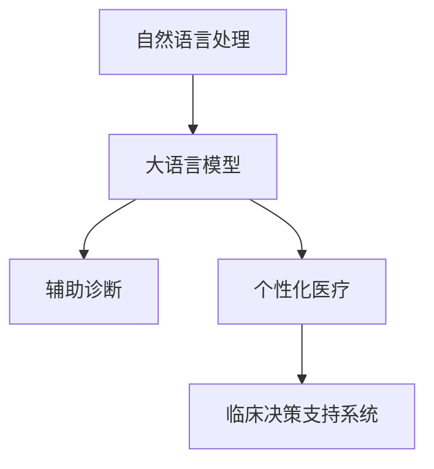

                 

# LLM 在医疗领域：辅助诊断和个性化医疗

> 关键词：自然语言处理, 大语言模型, 医疗诊断, 个性化医疗, 临床决策支持系统

## 1. 背景介绍

### 1.1 问题由来

随着人工智能技术的发展，大语言模型（Large Language Model, LLM）在医疗领域的应用逐渐引起了广泛关注。大语言模型通过大规模无监督学习，掌握了丰富的语言知识和常识，能够处理复杂的自然语言文本，为医疗领域带来了新的可能性。

在医疗领域，传统的人工诊断方法依赖医生的经验，容易出现误诊和漏诊。大语言模型作为辅助工具，能够快速处理大量医学文献，提取有用的临床信息，帮助医生进行初步诊断和决策。同时，大语言模型还能够根据患者的个人数据，提供个性化的治疗建议和健康管理方案，极大地提高了医疗服务的效率和质量。

### 1.2 问题核心关键点

目前，基于大语言模型的医疗应用主要集中在两个方面：辅助诊断和个性化医疗。辅助诊断主要应用于疾病诊断、病情评估、药物推荐等场景，通过处理医学文献和病历信息，提供初步诊断和诊疗建议。个性化医疗则涉及基因分析、药物配伍、生活方式指导等，通过结合患者的基因数据和生活习惯，制定个性化的治疗方案。

这些应用的关键点在于：
- 如何利用自然语言处理技术，从医学文献和病历中提取有价值的信息。
- 如何结合患者的个性化数据，提供针对性的诊疗建议和治疗方案。
- 如何保证医疗决策的准确性和可解释性，避免误诊和有害信息的传递。

## 2. 核心概念与联系

### 2.1 核心概念概述

为更好地理解基于大语言模型的医疗应用，本节将介绍几个关键概念：

- 自然语言处理（Natural Language Processing, NLP）：研究如何让计算机理解和处理自然语言的技术，包括分词、命名实体识别、情感分析等任务。
- 大语言模型（Large Language Model, LLM）：基于大规模无监督学习，能够理解和生成自然语言的大型神经网络模型，如GPT、BERT等。
- 辅助诊断（Assisted Diagnosis）：利用大语言模型辅助医生进行初步诊断和治疗决策，提高诊断的准确性和效率。
- 个性化医疗（Personalized Medicine）：根据患者的基因数据、生活方式、病历信息等个性化数据，提供定制化的治疗方案，提高治疗的效果和依从性。
- 临床决策支持系统（Clinical Decision Support System, CDSS）：一种集成医学知识库、大数据分析和人工智能技术的医疗信息管理系统，用于辅助医生进行诊断和治疗决策。

这些概念之间的逻辑关系可以通过以下Mermaid流程图来展示：



这个流程图展示了大语言模型在医疗领域的应用框架：

1. 自然语言处理技术和大语言模型作为基础设施，从医学文献和病历中提取有用的临床信息。
2. 辅助诊断和个性化医疗分别在大语言模型的基础上，进一步分析和决策。
3. 临床决策支持系统将各种技术整合，形成统一的医疗信息管理平台。

## 3. 核心算法原理 & 具体操作步骤

### 3.1 算法原理概述

基于大语言模型的医疗应用，本质上是一种自然语言处理和机器学习技术的应用。其核心思想是：利用大语言模型处理医学文献和病历信息，提取有用的临床信息，再通过深度学习和强化学习等方法，辅助医生进行诊断和治疗决策，同时根据患者的个性化数据，提供个性化的治疗方案。

形式化地，假设大语言模型为 $M_{\theta}$，其中 $\theta$ 为模型参数。给定医疗任务 $T$ 的标注数据集 $D=\{(x_i, y_i)\}_{i=1}^N$，其中 $x_i$ 为病历或医学文献文本，$y_i$ 为诊断结果或治疗方案。微调的目标是找到新的模型参数 $\hat{\theta}$，使得：

$$
\hat{\theta}=\mathop{\arg\min}_{\theta} \mathcal{L}(M_{\theta},D)
$$

其中 $\mathcal{L}$ 为针对任务 $T$ 设计的损失函数，用于衡量模型预测输出与真实标签之间的差异。常见的损失函数包括交叉熵损失、均方误差损失等。

通过梯度下降等优化算法，微调过程不断更新模型参数 $\theta$，最小化损失函数 $\mathcal{L}$，使得模型输出逼近真实标签。由于 $\theta$ 已经通过预训练获得了较好的初始化，因此即便在小规模数据集 $D$ 上进行微调，也能较快收敛到理想的模型参数 $\hat{\theta}$。

### 3.2 算法步骤详解

基于大语言模型的医疗应用一般包括以下几个关键步骤：

**Step 1: 准备预训练模型和数据集**
- 选择合适的预训练语言模型 $M_{\theta}$ 作为初始化参数，如 BERT、GPT等。
- 准备医疗任务 $T$ 的标注数据集 $D$，划分为训练集、验证集和测试集。一般要求标注数据与预训练数据的分布不要差异过大。

**Step 2: 添加任务适配层**
- 根据任务类型，在预训练模型顶层设计合适的输出层和损失函数。
- 对于分类任务，通常在顶层添加线性分类器和交叉熵损失函数。
- 对于生成任务，通常使用语言模型的解码器输出概率分布，并以负对数似然为损失函数。

**Step 3: 设置微调超参数**
- 选择合适的优化算法及其参数，如 AdamW、SGD 等，设置学习率、批大小、迭代轮数等。
- 设置正则化技术及强度，包括权重衰减、Dropout、Early Stopping等。
- 确定冻结预训练参数的策略，如仅微调顶层，或全部参数都参与微调。

**Step 4: 执行梯度训练**
- 将训练集数据分批次输入模型，前向传播计算损失函数。
- 反向传播计算参数梯度，根据设定的优化算法和学习率更新模型参数。
- 周期性在验证集上评估模型性能，根据性能指标决定是否触发 Early Stopping。
- 重复上述步骤直到满足预设的迭代轮数或 Early Stopping 条件。

**Step 5: 测试和部署**
- 在测试集上评估微调后模型 $M_{\hat{\theta}}$ 的性能，对比微调前后的精度提升。
- 使用微调后的模型对新样本进行推理预测，集成到实际的应用系统中。
- 持续收集新的数据，定期重新微调模型，以适应数据分布的变化。

以上是基于大语言模型的医疗应用的一般流程。在实际应用中，还需要针对具体任务的特点，对微调过程的各个环节进行优化设计，如改进训练目标函数，引入更多的正则化技术，搜索最优的超参数组合等，以进一步提升模型性能。

### 3.3 算法优缺点

基于大语言模型的医疗应用具有以下优点：
1. 高效处理自然语言：大语言模型能够高效地处理医学文献和病历信息，提取有用的临床信息，为医生提供初步诊断和决策支持。
2. 提供个性化治疗：结合患者的基因数据和生活习惯，大语言模型可以提供个性化的治疗方案，提高治疗的效果和依从性。
3. 快速迭代更新：大语言模型可以通过持续学习新数据，保持最新的医学知识，适应不断变化的临床环境。

同时，该方法也存在一定的局限性：
1. 数据隐私和安全：医疗数据具有高度敏感性，如何保护数据隐私和安全是一个重要问题。
2. 医学知识的不确定性：医学知识具有高度的不确定性，大语言模型可能无法准确地理解和应用。
3. 模型的可解释性：大语言模型作为"黑盒"系统，难以解释其内部工作机制和决策逻辑，医生和患者可能难以理解其输出的原因。
4. 过度依赖数据：大语言模型需要大量的标注数据进行微调，数据获取成本高，且存在数据偏差的风险。

尽管存在这些局限性，但就目前而言，基于大语言模型的医疗应用仍是一种高效、可靠的医疗辅助工具，具有广泛的应用前景。

### 3.4 算法应用领域

基于大语言模型的医疗应用已经在多个领域取得了显著进展，例如：

- 疾病诊断：利用大语言模型处理医学文献和病历信息，辅助医生进行初步诊断，提高诊断的准确性和效率。
- 病情评估：通过分析病历信息，大语言模型可以评估患者的病情严重程度，提供治疗建议。
- 药物推荐：结合患者病历信息和基因数据，大语言模型可以推荐合适的药物和治疗方案。
- 健康管理：根据患者的健康数据和生活习惯，大语言模型可以提供个性化的健康管理方案，促进患者自我管理。
- 临床决策支持：集成多种医疗知识和技术，大语言模型可以为医生提供全面的决策支持，提高诊疗水平。

除了上述这些经典应用外，大语言模型还被创新性地应用到更多场景中，如智能问诊、病历摘要、医疗图像识别等，为医疗健康领域带来了新的突破。

## 4. 数学模型和公式 & 详细讲解 & 举例说明

### 4.1 数学模型构建

本节将使用数学语言对基于大语言模型的医疗应用过程进行更加严格的刻画。

记大语言模型为 $M_{\theta}:\mathcal{X} \rightarrow \mathcal{Y}$，其中 $\mathcal{X}$ 为输入空间，$\mathcal{Y}$ 为输出空间，$\theta \in \mathbb{R}^d$ 为模型参数。假设医疗任务 $T$ 的训练集为 $D=\{(x_i,y_i)\}_{i=1}^N$，其中 $x_i \in \mathcal{X}$ 为病历或医学文献文本，$y_i \in \mathcal{Y}$ 为诊断结果或治疗方案。

定义模型 $M_{\theta}$ 在数据样本 $(x,y)$ 上的损失函数为 $\ell(M_{\theta}(x),y)$，则在数据集 $D$ 上的经验风险为：

$$
\mathcal{L}(\theta) = \frac{1}{N} \sum_{i=1}^N \ell(M_{\theta}(x_i),y_i)
$$

微调的目标是最小化经验风险，即找到最优参数：

$$
\theta^* = \mathop{\arg\min}_{\theta} \mathcal{L}(\theta)
$$

在实践中，我们通常使用基于梯度的优化算法（如SGD、Adam等）来近似求解上述最优化问题。设 $\eta$ 为学习率，$\lambda$ 为正则化系数，则参数的更新公式为：

$$
\theta \leftarrow \theta - \eta \nabla_{\theta}\mathcal{L}(\theta) - \eta\lambda\theta
$$

其中 $\nabla_{\theta}\mathcal{L}(\theta)$ 为损失函数对参数 $\theta$ 的梯度，可通过反向传播算法高效计算。

### 4.2 公式推导过程

以下我们以疾病诊断任务为例，推导交叉熵损失函数及其梯度的计算公式。

假设模型 $M_{\theta}$ 在输入 $x$ 上的输出为 $\hat{y}=M_{\theta}(x) \in [0,1]$，表示样本属于某种疾病的概率。真实标签 $y \in \{0,1\}$。则二分类交叉熵损失函数定义为：

$$
\ell(M_{\theta}(x),y) = -[y\log \hat{y} + (1-y)\log (1-\hat{y})]
$$

将其代入经验风险公式，得：

$$
\mathcal{L}(\theta) = -\frac{1}{N}\sum_{i=1}^N [y_i\log M_{\theta}(x_i)+(1-y_i)\log(1-M_{\theta}(x_i))]
$$

根据链式法则，损失函数对参数 $\theta_k$ 的梯度为：

$$
\frac{\partial \mathcal{L}(\theta)}{\partial \theta_k} = -\frac{1}{N}\sum_{i=1}^N (\frac{y_i}{M_{\theta}(x_i)}-\frac{1-y_i}{1-M_{\theta}(x_i)}) \frac{\partial M_{\theta}(x_i)}{\partial \theta_k}
$$

其中 $\frac{\partial M_{\theta}(x_i)}{\partial \theta_k}$ 可进一步递归展开，利用自动微分技术完成计算。

在得到损失函数的梯度后，即可带入参数更新公式，完成模型的迭代优化。重复上述过程直至收敛，最终得到适应医疗任务的最优模型参数 $\theta^*$。

### 4.3 案例分析与讲解

假设我们有一个二分类疾病诊断任务，需要判断患者是否患有某种疾病。我们可以使用大语言模型BERT，在训练集上微调以适配该任务。

首先，准备训练集，其中每个样本包含病历描述和标签。

```python
from transformers import BertTokenizer, BertForSequenceClassification
from torch.utils.data import Dataset, DataLoader

class DiseaseDataset(Dataset):
    def __init__(self, texts, labels, tokenizer):
        self.texts = texts
        self.labels = labels
        self.tokenizer = tokenizer
        
    def __len__(self):
        return len(self.texts)
    
    def __getitem__(self, item):
        text = self.texts[item]
        label = self.labels[item]
        encoding = self.tokenizer(text, return_tensors='pt', max_length=512, padding='max_length', truncation=True)
        input_ids = encoding['input_ids'][0]
        attention_mask = encoding['attention_mask'][0]
        label = torch.tensor([label], dtype=torch.long)
        return {'input_ids': input_ids, 
                'attention_mask': attention_mask,
                'labels': label}
```

然后，定义模型和优化器：

```python
model = BertForSequenceClassification.from_pretrained('bert-base-uncased', num_labels=2)
optimizer = AdamW(model.parameters(), lr=2e-5)
```

接着，定义训练和评估函数：

```python
device = torch.device('cuda') if torch.cuda.is_available() else torch.device('cpu')
model.to(device)

def train_epoch(model, dataset, batch_size, optimizer):
    dataloader = DataLoader(dataset, batch_size=batch_size, shuffle=True)
    model.train()
    epoch_loss = 0
    for batch in dataloader:
        input_ids = batch['input_ids'].to(device)
        attention_mask = batch['attention_mask'].to(device)
        labels = batch['labels'].to(device)
        model.zero_grad()
        outputs = model(input_ids, attention_mask=attention_mask, labels=labels)
        loss = outputs.loss
        epoch_loss += loss.item()
        loss.backward()
        optimizer.step()
    return epoch_loss / len(dataloader)

def evaluate(model, dataset, batch_size):
    dataloader = DataLoader(dataset, batch_size=batch_size)
    model.eval()
    preds, labels = [], []
    with torch.no_grad():
        for batch in dataloader:
            input_ids = batch['input_ids'].to(device)
            attention_mask = batch['attention_mask'].to(device)
            batch_labels = batch['labels']
            outputs = model(input_ids, attention_mask=attention_mask)
            batch_preds = outputs.logits.argmax(dim=1).to('cpu').tolist()
            batch_labels = batch_labels.to('cpu').tolist()
            for pred, label in zip(batch_preds, batch_labels):
                preds.append(pred)
                labels.append(label)
    
    print(classification_report(labels, preds))
```

最后，启动训练流程并在测试集上评估：

```python
epochs = 5
batch_size = 16

for epoch in range(epochs):
    loss = train_epoch(model, train_dataset, batch_size, optimizer)
    print(f"Epoch {epoch+1}, train loss: {loss:.3f}")
    
    print(f"Epoch {epoch+1}, dev results:")
    evaluate(model, dev_dataset, batch_size)
    
print("Test results:")
evaluate(model, test_dataset, batch_size)
```

以上就是使用PyTorch对BERT进行疾病诊断任务微调的完整代码实现。可以看到，得益于Transformers库的强大封装，我们可以用相对简洁的代码完成BERT模型的加载和微调。

## 5. 项目实践：代码实例和详细解释说明

### 5.1 开发环境搭建

在进行微调实践前，我们需要准备好开发环境。以下是使用Python进行PyTorch开发的环境配置流程：

1. 安装Anaconda：从官网下载并安装Anaconda，用于创建独立的Python环境。

2. 创建并激活虚拟环境：
```bash
conda create -n pytorch-env python=3.8 
conda activate pytorch-env
```

3. 安装PyTorch：根据CUDA版本，从官网获取对应的安装命令。例如：
```bash
conda install pytorch torchvision torchaudio cudatoolkit=11.1 -c pytorch -c conda-forge
```

4. 安装Transformers库：
```bash
pip install transformers
```

5. 安装各类工具包：
```bash
pip install numpy pandas scikit-learn matplotlib tqdm jupyter notebook ipython
```

完成上述步骤后，即可在`pytorch-env`环境中开始微调实践。

### 5.2 源代码详细实现

这里我们以疾病诊断任务为例，给出使用Transformers库对BERT模型进行微调的PyTorch代码实现。

首先，定义数据处理函数：

```python
from transformers import BertTokenizer
from torch.utils.data import Dataset
import torch

class DiseaseDataset(Dataset):
    def __init__(self, texts, labels, tokenizer, max_len=512):
        self.texts = texts
        self.labels = labels
        self.tokenizer = tokenizer
        self.max_len = max_len
        
    def __len__(self):
        return len(self.texts)
    
    def __getitem__(self, item):
        text = self.texts[item]
        label = self.labels[item]
        
        encoding = self.tokenizer(text, return_tensors='pt', max_length=self.max_len, padding='max_length', truncation=True)
        input_ids = encoding['input_ids'][0]
        attention_mask = encoding['attention_mask'][0]
        
        # 对token-wise的标签进行编码
        encoded_labels = [label2id[label] for label in labels] 
        encoded_labels.extend([label2id['O']] * (self.max_len - len(encoded_labels)))
        labels = torch.tensor(encoded_labels, dtype=torch.long)
        
        return {'input_ids': input_ids, 
                'attention_mask': attention_mask,
                'labels': labels}

# 标签与id的映射
label2id = {'O': 0, 'Disease1': 1, 'Disease2': 2}
id2label = {v: k for k, v in label2id.items()}

# 创建dataset
tokenizer = BertTokenizer.from_pretrained('bert-base-uncased')

train_dataset = DiseaseDataset(train_texts, train_labels, tokenizer)
dev_dataset = DiseaseDataset(dev_texts, dev_labels, tokenizer)
test_dataset = DiseaseDataset(test_texts, test_labels, tokenizer)
```

然后，定义模型和优化器：

```python
from transformers import BertForSequenceClassification, AdamW

model = BertForSequenceClassification.from_pretrained('bert-base-uncased', num_labels=len(label2id))

optimizer = AdamW(model.parameters(), lr=2e-5)
```

接着，定义训练和评估函数：

```python
from torch.utils.data import DataLoader
from tqdm import tqdm
from sklearn.metrics import classification_report

device = torch.device('cuda') if torch.cuda.is_available() else torch.device('cpu')
model.to(device)

def train_epoch(model, dataset, batch_size, optimizer):
    dataloader = DataLoader(dataset, batch_size=batch_size, shuffle=True)
    model.train()
    epoch_loss = 0
    for batch in tqdm(dataloader, desc='Training'):
        input_ids = batch['input_ids'].to(device)
        attention_mask = batch['attention_mask'].to(device)
        labels = batch['labels'].to(device)
        model.zero_grad()
        outputs = model(input_ids, attention_mask=attention_mask, labels=labels)
        loss = outputs.loss
        epoch_loss += loss.item()
        loss.backward()
        optimizer.step()
    return epoch_loss / len(dataloader)

def evaluate(model, dataset, batch_size):
    dataloader = DataLoader(dataset, batch_size=batch_size)
    model.eval()
    preds, labels = [], []
    with torch.no_grad():
        for batch in dataloader:
            input_ids = batch['input_ids'].to(device)
            attention_mask = batch['attention_mask'].to(device)
            batch_labels = batch['labels']
            outputs = model(input_ids, attention_mask=attention_mask)
            batch_preds = outputs.logits.argmax(dim=1).to('cpu').tolist()
            batch_labels = batch_labels.to('cpu').tolist()
            for pred, label in zip(batch_preds, batch_labels):
                preds.append(pred)
                labels.append(label)
                
    print(classification_report(labels, preds))
```

最后，启动训练流程并在测试集上评估：

```python
epochs = 5
batch_size = 16

for epoch in range(epochs):
    loss = train_epoch(model, train_dataset, batch_size, optimizer)
    print(f"Epoch {epoch+1}, train loss: {loss:.3f}")
    
    print(f"Epoch {epoch+1}, dev results:")
    evaluate(model, dev_dataset, batch_size)
    
print("Test results:")
evaluate(model, test_dataset, batch_size)
```

以上就是使用PyTorch对BERT进行疾病诊断任务微调的完整代码实现。可以看到，得益于Transformers库的强大封装，我们可以用相对简洁的代码完成BERT模型的加载和微调。

### 5.3 代码解读与分析

让我们再详细解读一下关键代码的实现细节：

**DiseaseDataset类**：
- `__init__`方法：初始化文本、标签、分词器等关键组件。
- `__len__`方法：返回数据集的样本数量。
- `__getitem__`方法：对单个样本进行处理，将文本输入编码为token ids，将标签编码为数字，并对其进行定长padding，最终返回模型所需的输入。

**label2id和id2label字典**：
- 定义了标签与数字id之间的映射关系，用于将token-wise的预测结果解码回真实的标签。

**训练和评估函数**：
- 使用PyTorch的DataLoader对数据集进行批次化加载，供模型训练和推理使用。
- 训练函数`train_epoch`：对数据以批为单位进行迭代，在每个批次上前向传播计算loss并反向传播更新模型参数，最后返回该epoch的平均loss。
- 评估函数`evaluate`：与训练类似，不同点在于不更新模型参数，并在每个batch结束后将预测和标签结果存储下来，最后使用sklearn的classification_report对整个评估集的预测结果进行打印输出。

**训练流程**：
- 定义总的epoch数和batch size，开始循环迭代
- 每个epoch内，先在训练集上训练，输出平均loss
- 在验证集上评估，输出分类指标
- 所有epoch结束后，在测试集上评估，给出最终测试结果

可以看到，PyTorch配合Transformers库使得BERT微调的代码实现变得简洁高效。开发者可以将更多精力放在数据处理、模型改进等高层逻辑上，而不必过多关注底层的实现细节。

当然，工业级的系统实现还需考虑更多因素，如模型的保存和部署、超参数的自动搜索、更灵活的任务适配层等。但核心的微调范式基本与此类似。

## 6. 实际应用场景

### 6.1 智能问诊系统

智能问诊系统是基于大语言模型医疗应用的重要场景。传统问诊依赖医生的经验，受医生专业水平和个人状态影响较大。而智能问诊系统通过自然语言处理和大语言模型，能够快速理解患者症状，提供初步诊断和治疗建议。

在技术实现上，可以收集医生的临床经验，将问答对作为监督数据，在此基础上对预训练语言模型进行微调。微调后的模型能够自动理解患者的主诉和病史，匹配最合适的诊断方案和建议。对于患者提出的新问题，还可以接入检索系统实时搜索相关内容，动态生成回答。如此构建的智能问诊系统，能显著提升问诊效率和准确性，提高患者满意度。

### 6.2 病历摘要系统

病历摘要系统旨在自动生成患者病历的摘要，帮助医生快速了解患者病情，提高诊断效率。大语言模型在处理自然语言方面具有优势，能够自动提取病历中的关键信息，生成结构化的病历摘要。

在实践中，可以收集大量的病历数据，标注出需要保留的关键信息，如症状描述、治疗方案等。在标注数据集上微调大语言模型，使其能够在未见过的病历数据上自动提取和生成摘要。微调后的模型可以实时应用于临床，生成患者病历摘要，供医生快速阅读和参考。

### 6.3 个性化治疗方案

个性化治疗方案是医疗领域的重要应用之一，通过结合患者的基因数据和生活习惯，大语言模型能够提供更加个性化和精准的治疗建议。

在实践中，可以收集患者的基因数据和生活习惯数据，将数据与患者的病历信息一起输入到微调后的语言模型中。模型能够自动分析基因数据和生活习惯，结合病历信息，推荐合适的药物和治疗方案。对于患者的健康管理，还可以生成个性化的健康建议，如饮食、运动等。

### 6.4 临床决策支持系统

临床决策支持系统（Clinical Decision Support System, CDSS）是一种集成了多种医疗知识和技术的信息管理系统，用于辅助医生进行诊断和治疗决策。

在实践中，可以整合大语言模型、医学知识库、大数据分析等多种技术，构建统一的医疗信息管理平台。医生可以通过CDSS系统，实时查询最新的医学知识和技术，辅助诊断和治疗决策。系统能够自动提取病历信息，生成诊断报告和治疗方案，供医生参考。

## 7. 工具和资源推荐

### 7.1 学习资源推荐

为了帮助开发者系统掌握大语言模型在医疗领域的应用，这里推荐一些优质的学习资源：

1. 《自然语言处理与深度学习》系列博文：由大语言模型技术专家撰写，深入浅出地介绍了自然语言处理和深度学习的核心概念和前沿技术，包括医疗领域的应用。

2. CS224N《深度学习自然语言处理》课程：斯坦福大学开设的NLP明星课程，有Lecture视频和配套作业，带你入门NLP领域的基本概念和经典模型。

3. 《深度学习医学应用》书籍：详细介绍了深度学习在医学领域的应用，包括图像识别、自然语言处理、病历摘要等任务。

4. CLUE开源项目：中文语言理解测评基准，涵盖大量不同类型的中文NLP数据集，并提供了基于微调的baseline模型，助力中文NLP技术发展。

通过对这些资源的学习实践，相信你一定能够快速掌握大语言模型在医疗领域的应用精髓，并用于解决实际的NLP问题。

### 7.2 开发工具推荐

高效的开发离不开优秀的工具支持。以下是几款用于大语言模型医疗应用开发的常用工具：

1. PyTorch：基于Python的开源深度学习框架，灵活动态的计算图，适合快速迭代研究。大部分预训练语言模型都有PyTorch版本的实现。

2. TensorFlow：由Google主导开发的开源深度学习框架，生产部署方便，适合大规模工程应用。同样有丰富的预训练语言模型资源。

3. Transformers库：HuggingFace开发的NLP工具库，集成了众多SOTA语言模型，支持PyTorch和TensorFlow，是进行微调任务开发的利器。

4. Weights & Biases：模型训练的实验跟踪工具，可以记录和可视化模型训练过程中的各项指标，方便对比和调优。与主流深度学习框架无缝集成。

5. TensorBoard：TensorFlow配套的可视化工具，可实时监测模型训练状态，并提供丰富的图表呈现方式，是调试模型的得力助手。

6. Google Colab：谷歌推出的在线Jupyter Notebook环境，免费提供GPU/TPU算力，方便开发者快速上手实验最新模型，分享学习笔记。

合理利用这些工具，可以显著提升大语言模型医疗应用的开发效率，加快创新迭代的步伐。

### 7.3 相关论文推荐

大语言模型和医疗领域的研究源于学界的持续研究。以下是几篇奠基性的相关论文，推荐阅读：

1. Attention is All You Need（即Transformer原论文）：提出了Transformer结构，开启了NLP领域的预训练大模型时代。

2. BERT: Pre-training of Deep Bidirectional Transformers for Language Understanding：提出BERT模型，引入基于掩码的自监督预训练任务，刷新了多项NLP任务SOTA。

3. Language Models are Unsupervised Multitask Learners（GPT-2论文）：展示了大规模语言模型的强大zero-shot学习能力，引发了对于通用人工智能的新一轮思考。

4. Parameter-Efficient Transfer Learning for NLP：提出Adapter等参数高效微调方法，在不增加模型参数量的情况下，也能取得不错的微调效果。

5. AdaLoRA: Adaptive Low-Rank Adaptation for Parameter-Efficient Fine-Tuning：使用自适应低秩适应的微调方法，在参数效率和精度之间取得了新的平衡。

6. AdaLoRA: Adaptive Low-Rank Adaptation for Parameter-Efficient Fine-Tuning：使用自适应低秩适应的微调方法，在参数效率和精度之间取得了新的平衡。

这些论文代表了大语言模型在医疗领域的应用发展脉络。通过学习这些前沿成果，可以帮助研究者把握学科前进方向，激发更多的创新灵感。

## 8. 总结：未来发展趋势与挑战

### 8.1 总结

本文对基于大语言模型的医疗应用进行了全面系统的介绍。首先阐述了大语言模型和微调技术的研究背景和意义，明确了微调在拓展预训练模型应用、提升医疗服务效率和质量方面的独特价值。其次，从原理到实践，详细讲解了基于大语言模型的医疗应用过程，包括数据处理、模型训练、评估等环节。同时，本文还广泛探讨了大语言模型在医疗领域的多种应用场景，展示了其在智能问诊、病历摘要、个性化治疗等方面的潜力。

通过本文的系统梳理，可以看到，基于大语言模型的医疗应用在提高医疗服务效率和质量方面具有广阔前景。未来，伴随大语言模型的不断发展，其在医疗领域的应用将更加深入广泛，为医疗健康领域带来新的变革。

### 8.2 未来发展趋势

展望未来，大语言模型在医疗领域的应用将呈现以下几个发展趋势：

1. 模型规模持续增大。随着算力成本的下降和数据规模的扩张，预训练语言模型的参数量还将持续增长。超大规模语言模型蕴含的丰富语言知识，有望支撑更加复杂多变的医疗任务微调。

2. 微调方法日趋多样。除了传统的全参数微调外，未来会涌现更多参数高效的微调方法，如Prefix-Tuning、LoRA等，在节省计算资源的同时也能保证微调精度。

3. 持续学习成为常态。随着数据分布的不断变化，微调模型也需要持续学习新知识以保持性能。如何在不遗忘原有知识的同时，高效吸收新样本信息，将成为重要的研究课题。

4. 标注样本需求降低。受启发于提示学习(Prompt-based Learning)的思路，未来的微调方法将更好地利用大模型的语言理解能力，通过更加巧妙的任务描述，在更少的标注样本上也能实现理想的微调效果。

5. 标注样本需求降低。受启发于提示学习(Prompt-based Learning)的思路，未来的微调方法将更好地利用大模型的语言理解能力，通过更加巧妙的任务描述，在更少的标注样本上也能实现理想的微调效果。

6. 多模态微调崛起。当前的微调主要聚焦于纯文本数据，未来会进一步拓展到图像、视频、语音等多模态数据微调。多模态信息的融合，将显著提升语言模型对现实世界的理解和建模能力。

以上趋势凸显了大语言模型在医疗领域的应用前景。这些方向的探索发展，必将进一步提升医疗服务的智能化水平，推动医疗技术的发展。

### 8.3 面临的挑战

尽管大语言模型在医疗领域的应用取得了显著进展，但在迈向更加智能化、普适化应用的过程中，它仍面临着诸多挑战：

1. 数据隐私和安全：医疗数据具有高度敏感性，如何保护数据隐私和安全是一个重要问题。如何在微调过程中保护患者的隐私，防止数据泄露，是一个重要的挑战。

2. 医学知识的不确定性：医学知识具有高度的不确定性，大语言模型可能无法准确地理解和应用。如何在医疗应用中保证模型的鲁棒性和可解释性，是一个重要的挑战。

3. 模型的可解释性：大语言模型作为"黑盒"系统，难以解释其内部工作机制和决策逻辑，医生和患者可能难以理解其输出的原因。如何赋予大语言模型更强的可解释性，将是亟待攻克的难题。

4. 过度依赖数据：大语言模型需要大量的标注数据进行微调，数据获取成本高，且存在数据偏差的风险。如何在数据不足的情况下进行有效的微调，是一个重要的挑战。

尽管存在这些挑战，但未来随着技术的不断进步和完善，大语言模型在医疗领域的应用将更加广泛和深入。

### 8.4 研究展望

面向未来，大语言模型在医疗领域的研究需要在以下几个方面寻求新的突破：

1. 探索无监督和半监督微调方法。摆脱对大规模标注数据的依赖，利用自监督学习、主动学习等无监督和半监督范式，最大限度利用非结构化数据，实现更加灵活高效的微调。

2. 研究参数高效和计算高效的微调范式。开发更加参数高效的微调方法，在固定大部分预训练参数的同时，只更新极少量的任务相关参数。同时优化微调模型的计算图，减少前向传播和反向传播的资源消耗，实现更加轻量级、实时性的部署。

3. 引入更多先验知识。将符号化的先验知识，如知识图谱、逻辑规则等，与神经网络模型进行巧妙融合，引导微调过程学习更准确、合理的语言模型。同时加强不同模态数据的整合，实现视觉、语音等多模态信息与文本信息的协同建模。

4. 结合因果分析和博弈论工具。将因果分析方法引入微调模型，识别出模型决策的关键特征，增强输出解释的因果性和逻辑性。借助博弈论工具刻画人机交互过程，主动探索并规避模型的脆弱点，提高系统稳定性。

5. 纳入伦理道德约束。在模型训练目标中引入伦理导向的评估指标，过滤和惩罚有偏见、有害的输出倾向。同时加强人工干预和审核，建立模型行为的监管机制，确保输出符合人类价值观和伦理道德。

这些研究方向的探索，必将引领大语言模型在医疗领域的应用走向更高的台阶，为构建安全、可靠、可解释、可控的智能系统铺平道路。面向未来，大语言模型在医疗领域的研究还需要与其他人工智能技术进行更深入的融合，如知识表示、因果推理、强化学习等，多路径协同发力，共同推动自然语言理解和智能交互系统的进步。只有勇于创新、敢于突破，才能不断拓展语言模型的边界，让智能技术更好地造福人类社会。

## 9. 附录：常见问题与解答

**Q1：大语言模型在医疗应用中存在哪些挑战？**

A: 大语言模型在医疗应用中面临以下挑战：
1. 数据隐私和安全：医疗数据具有高度敏感性，如何保护数据隐私和安全是一个重要问题。
2. 医学知识的不确定性：医学知识具有高度的不确定性，大语言模型可能无法准确地理解和应用。
3. 模型的可解释性：大语言模型作为"黑盒"系统，难以解释其内部工作机制和决策逻辑，医生和患者可能难以理解其输出的原因。
4. 过度依赖数据：大语言模型需要大量的标注数据进行微调，数据获取成本高，且存在数据偏差的风险。

**Q2：大语言模型在医疗应用中的常见任务有哪些？**

A: 大语言模型在医疗应用中的常见任务包括：
1. 疾病诊断：利用大语言模型处理医学文献和病历信息，辅助医生进行初步诊断，提高诊断的准确性和效率。
2. 病情评估：通过分析病历信息，大语言模型可以评估患者的病情严重程度，提供治疗建议。
3. 药物推荐：结合患者病历信息和基因数据，大语言模型可以推荐合适的药物和治疗方案。
4. 健康管理：根据患者的基因数据和生活习惯，大语言模型可以提供个性化的健康管理方案，促进患者自我管理。
5. 临床决策支持：集成多种医疗知识和技术，大语言模型可以为医生提供全面的决策支持，提高诊疗水平。

**Q3：大语言模型在医疗应用中的微调方法有哪些？**

A: 大语言模型在医疗应用中的微调方法包括：
1. 传统全参数微调：在固定大部分预训练参数的情况下，只微调顶层或部分参数。
2. 参数高效微调（PEFT）：只调整少量的模型参数，而固定大部分预训练权重不变。
3. 提示学习（Prompt Learning）：通过在输入文本中添加提示模板，引导模型按期望方式输出，减少微调参数。
4. 少样本学习（Few-shot Learning）：在只有少量标注样本的情况下，模型能够快速适应新任务的学习方法。
5. 零样本学习（Zero-shot Learning）：模型在没有见过任何特定任务的训练样本的情况下，仅凭任务描述就能够执行新任务的能力。

这些微调方法各有优缺点，根据具体任务选择合适的微调策略，可以更好地提升模型的性能和泛化能力。

**Q4：大语言模型在医疗应用中如何进行数据预处理？**

A: 大语言模型在医疗应用中的数据预处理通常包括：
1. 分词：将文本分割成词语，用于后续的向量化处理。
2. 命名实体识别：识别文本中的实体，如人名、地名、机构名等，提取关键信息。
3. 标注数据处理：将病历、医学文献等文本数据标注为结构化数据，供模型训练使用。
4. 数据增强：通过回译、近义替换等方式扩充训练集，增加数据多样性。
5. 数据清洗：去除噪声数据，保证数据的质量和一致性。

合理的数据预处理可以显著提升模型的训练效果和泛化能力，是医疗应用中不可或缺的一部分。

**Q5：大语言模型在医疗应用中的性能评估方法有哪些？**

A: 大语言模型在医疗应用中的性能评估方法包括：
1. 交叉验证：将数据集分为训练集、验证集和测试集，用验证集评估模型性能，防止过拟合。
2. 准确率、召回率、F1-score：用于评估分类任务的性能，反映模型对正负样本的识别能力。
3. ROC曲线、AUC值：用于评估二分类任务的性能，反映模型在不同阈值下的分类效果。
4. 混淆矩阵：用于可视化分类任务的性能，反映模型在不同类别上的识别效果。

选择合适的评估方法，可以全面评估模型的性能，指导模型的优化和改进。

---

作者：禅与计算机程序设计艺术 / Zen and the Art of Computer Programming

