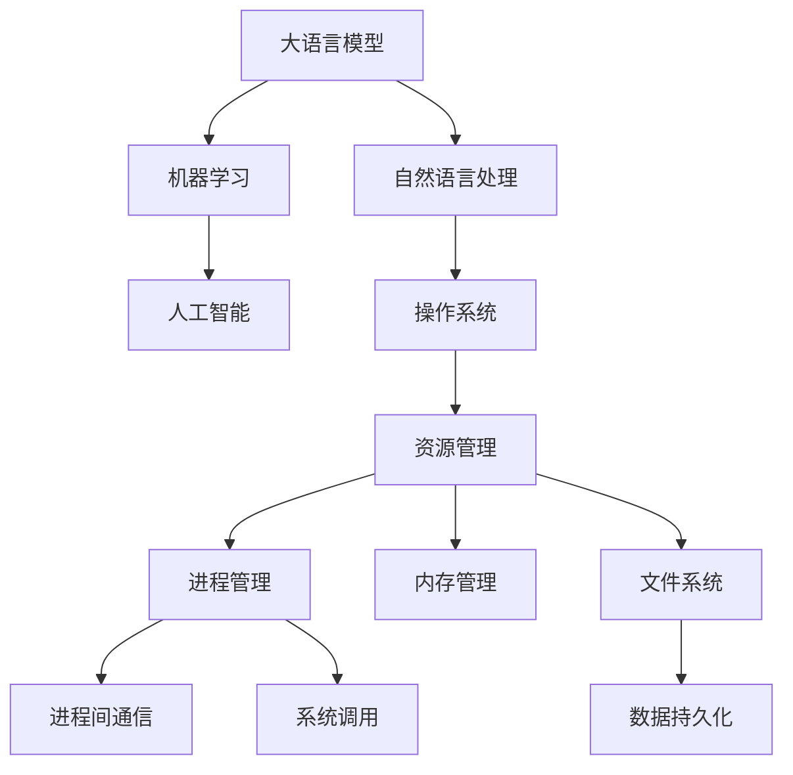

                 

# LLM与传统操作系统的对比

> 关键词：大语言模型,操作系统,人工智能,机器学习,自然语言处理,计算模型

## 1. 背景介绍

### 1.1 问题由来
随着人工智能技术的迅猛发展，特别是自然语言处理（NLP）领域，大规模语言模型（Large Language Model, LLM）在语言理解和生成方面取得了突破性进展。然而，这种新型的计算模型如何与传统操作系统（Operating System, OS）协同工作，成为了一个亟待探讨的问题。

### 1.2 问题核心关键点
传统操作系统主要负责资源管理、进程管理、文件系统等底层系统功能。而大语言模型则更侧重于高层次的认知、理解和生成功能。二者的结合不仅仅是技术层面上的堆叠，更涉及到多层次的协同设计。

### 1.3 问题研究意义
研究LLM与传统操作系统的协同工作，对于实现人工智能技术的系统化、工程化应用，提升NLP技术的实用性和可靠性，具有重要意义。通过深入比较两者在架构、设计、实现等方面的异同，我们可以更好地理解如何利用现有资源，优化大语言模型的性能，同时也为操作系统的智能化升级提供新的思路。

## 2. 核心概念与联系

### 2.1 核心概念概述

- **大语言模型(LLM)**：以Transformer为代表，基于自回归或自编码模型，通过大规模无标签文本数据预训练获得强大语言表示能力的计算模型。
- **操作系统(OS)**：负责管理计算机硬件资源，提供进程管理、内存管理、文件系统等功能，是软件与硬件之间的桥梁。
- **人工智能(AI)**：涵盖机器学习、深度学习、自然语言处理等多种技术，旨在实现机器的智能行为。
- **机器学习(ML)**：通过数据训练模型，使其具备预测、分类、生成等能力。
- **自然语言处理(NLP)**：使计算机能够理解、处理和生成人类语言。
- **计算模型**：指数据处理和计算的程序模型，包括并行计算、分布式计算、图计算等。

### 2.2 核心概念原理和架构的 Mermaid 流程图(Mermaid 流程节点中不要有括号、逗号等特殊字符)


这个流程图展示了LLM与OS在NLP和AI应用中的核心功能联系：

1. LLM通过NLP实现语言理解和生成。
2. 在NLP的基础上，通过机器学习获得预测、分类等高级功能。
3. ML结合NLP，进一步融入AI系统的智能行为。
4. OS提供基础资源管理和系统调用，支持LLM和AI系统的高效运行。

## 3. 核心算法原理 & 具体操作步骤
### 3.1 算法原理概述

大语言模型和传统操作系统在算法原理上有显著区别：

- **LLM算法**：基于Transformer架构，采用自回归或自编码模型，通过大规模预训练获得语言知识。其核心算法包括：
  - 自回归模型：通过历史序列预测后续序列。
  - 自编码模型：通过编码和解码过程学习语言表示。
  - 预训练和微调：在无标签数据上预训练，再通过少量标签数据微调优化。

- **OS算法**：主要涉及资源管理、进程管理、内存管理、文件系统等基础功能。其核心算法包括：
  - 资源分配算法：如首次适应法（First Fit）、最佳适应法（Best Fit）、最差适应法（Worst Fit）等。
  - 调度算法：如轮询（Round Robin）、优先级调度（Priority Scheduling）等。
  - 内存管理算法：如页表机制、虚拟内存技术等。

### 3.2 算法步骤详解

**LLM算法步骤**：

1. **数据预处理**：对大规模无标签文本数据进行预处理，如分词、去停用词、构建词汇表等。
2. **模型构建**：基于Transformer模型架构，构建大语言模型。
3. **预训练**：在无标签数据上训练模型，获得泛化能力。
4. **微调**：在少量标注数据上微调模型，针对特定任务优化性能。
5. **推理预测**：将输入文本输入模型，输出预测结果。

**OS算法步骤**：

1. **硬件初始化**：开机时初始化计算机硬件资源，如CPU、内存、磁盘等。
2. **资源分配**：根据应用程序请求，动态分配计算资源。
3. **进程管理**：管理并发执行的进程，防止死锁和资源竞争。
4. **内存管理**：分配和释放内存，实现虚拟内存、分页等技术。
5. **文件系统管理**：管理文件的存储、读取和删除。
6. **系统调用响应**：响应应用程序的系统调用请求，提供标准API接口。

### 3.3 算法优缺点

**LLM算法优点**：

1. **语言理解和生成能力强大**：能够处理复杂的自然语言任务，如问答、生成文本、翻译等。
2. **可迁移性强**：通过微调，可以适应不同领域和任务的需求。
3. **精度高**：基于深度学习模型，具备较强的预测和分类能力。

**LLM算法缺点**：

1. **数据依赖性强**：需要大量的训练数据，难以在大规模数据上快速训练。
2. **计算资源需求高**：模型参数多，训练和推理过程资源消耗大。
3. **可解释性差**：模型决策过程不透明，难以解释。

**OS算法优点**：

1. **资源管理高效**：能够高效地分配和管理计算资源，确保系统稳定性。
2. **进程间通信安全**：提供了安全、可靠的消息传递机制。
3. **系统稳定性高**：具备故障恢复和数据冗余机制，保障系统可靠运行。

**OS算法缺点**：

1. **功能单一**：主要关注底层系统功能，对高层次认知能力支持有限。
2. **灵活性不足**：难以灵活扩展新功能和算法。
3. **抽象层次低**：主要处理硬件和软件接口，缺乏高级语义理解。

### 3.4 算法应用领域

**LLM应用领域**：

1. **自然语言处理**：文本分类、情感分析、机器翻译、对话系统等。
2. **机器学习**：数据预处理、模型训练、预测和分类等。
3. **人工智能**：智能推荐、自动化决策、智能监控等。

**OS应用领域**：

1. **系统管理**：资源分配、进程管理、内存管理、文件系统等。
2. **设备驱动**：管理硬件设备的访问和控制。
3. **网络通信**：管理网络路由、数据包转发等。

## 4. 数学模型和公式 & 详细讲解 & 举例说明

### 4.1 数学模型构建

**LLM数学模型**：

假设LLM模型为$M_{\theta}:\mathcal{X}\rightarrow\mathcal{Y}$，其中$\mathcal{X}$为输入空间，$\mathcal{Y}$为输出空间，$\theta$为模型参数。对于给定的输入$x$，模型的输出为$y=M_{\theta}(x)$。

**OS数学模型**：

假设OS中的资源为$R$，进程为$P$，内存为$M$，文件系统为$F$。资源分配函数为$A(R,P)$，内存管理函数为$M(M)$，文件系统管理函数为$F(F)$。

### 4.2 公式推导过程

**LLM公式推导**：

- **自回归模型**：$y_t=\sum_{i=1}^{t}\alpha_i y_{t-i}+\epsilon_t$
- **自编码模型**：$y_{enc}=f(x), y_{dec}=g(y_{enc})$
- **预训练损失函数**：$\mathcal{L}_{pretrain}=\frac{1}{N}\sum_{i=1}^{N}||x_i-y_{dec}||^2$

**OS公式推导**：

- **资源分配算法**：$A(R,P)=R-sum(P)$
- **进程管理算法**：$S(P)=\min\{CPU,P_i\}$
- **内存管理算法**：$M(M)=M-\sum_{i=1}^{N}M_i$
- **文件系统管理算法**：$F(F)=F-\sum_{i=1}^{N}F_i$

### 4.3 案例分析与讲解

**LLM案例**：

假设有一个新闻分类任务，我们需要使用BERT模型进行微调。首先，我们需要准备标注数据集，然后对BERT模型进行微调，最后使用微调后的模型对新数据进行分类。具体步骤如下：

1. **数据准备**：收集新闻数据集，标注每个新闻的类别。
2. **模型微调**：将BERT模型加载到GPU上，使用微调脚本进行微调。
3. **模型评估**：在验证集上评估微调后的模型性能，调整参数。
4. **推理预测**：使用微调后的模型对新数据进行分类预测。

**OS案例**：

假设有一个高性能计算任务，我们需要分配和管理计算资源。具体步骤如下：

1. **资源分配**：初始化CPU、内存等资源，分配给计算任务。
2. **进程管理**：管理并发执行的进程，防止死锁。
3. **内存管理**：分配和释放内存，实现虚拟内存。
4. **文件系统管理**：管理数据的存储和读取。
5. **系统调用响应**：响应应用程序的系统调用请求，提供标准API接口。

## 5. 项目实践：代码实例和详细解释说明

### 5.1 开发环境搭建

为了实现LLM与OS的协同工作，我们需要搭建相应的开发环境。以下是使用Python进行PyTorch和TensorFlow开发的环境配置流程：

1. **安装Python和PyTorch**：
   ```bash
   pip install torch torchvision torchaudio
   ```

2. **安装TensorFlow**：
   ```bash
   pip install tensorflow
   ```

3. **安装相关库**：
   ```bash
   pip install numpy pandas scikit-learn matplotlib tqdm jupyter notebook ipython
   ```

### 5.2 源代码详细实现

**LLM代码实现**：

```python
import torch
import torch.nn as nn
import torch.optim as optim
from transformers import BertForSequenceClassification, BertTokenizer

# 初始化模型和tokenizer
model = BertForSequenceClassification.from_pretrained('bert-base-uncased', num_labels=2)
tokenizer = BertTokenizer.from_pretrained('bert-base-uncased')

# 定义损失函数和优化器
criterion = nn.CrossEntropyLoss()
optimizer = optim.Adam(model.parameters(), lr=2e-5)

# 加载数据集
train_dataset = ...
dev_dataset = ...
test_dataset = ...

# 定义训练和评估函数
def train_epoch(model, dataset, batch_size, optimizer):
    ...

def evaluate(model, dataset, batch_size):
    ...

# 启动训练流程并在测试集上评估
epochs = 5
batch_size = 16

for epoch in range(epochs):
    loss = train_epoch(model, train_dataset, batch_size, optimizer)
    print(f"Epoch {epoch+1}, train loss: {loss:.3f}")

    print(f"Epoch {epoch+1}, dev results:")
    evaluate(model, dev_dataset, batch_size)

print("Test results:")
evaluate(model, test_dataset, batch_size)
```

**OS代码实现**：

```python
import os
import time

# 初始化资源和进程
resources = ...
processes = ...

# 资源分配函数
def allocate_resource(resource, process):
    ...

# 进程管理函数
def manage_process(process):
    ...

# 内存管理函数
def manage_memory():
    ...

# 文件系统管理函数
def manage_file_system():
    ...

# 系统调用响应函数
def respond_system_call():
    ...
```

### 5.3 代码解读与分析

**LLM代码解读**：

- **初始化模型和tokenizer**：使用预训练的BERT模型和tokenizer，设定输出类别数为2。
- **定义损失函数和优化器**：使用交叉熵损失函数和Adam优化器。
- **加载数据集**：准备训练集、验证集和测试集。
- **训练和评估函数**：定义训练和评估函数，在每个epoch内更新模型参数，并在验证集和测试集上评估模型性能。
- **训练流程**：设定训练轮数和批量大小，循环执行训练和评估函数。

**OS代码解读**：

- **资源和进程初始化**：初始化CPU、内存等资源，创建进程。
- **资源分配函数**：根据进程需求动态分配计算资源。
- **进程管理函数**：管理并发执行的进程，防止死锁。
- **内存管理函数**：分配和释放内存，实现虚拟内存。
- **文件系统管理函数**：管理数据的存储和读取。
- **系统调用响应函数**：响应应用程序的系统调用请求，提供标准API接口。

## 6. 实际应用场景

### 6.1 智能客服系统

基于大语言模型与传统操作系统的协同工作，可以构建智能客服系统。传统客服系统通常需要大量人力，高峰期响应慢，且难以保证一致性和专业性。而使用微调后的语言模型，可以7x24小时不间断服务，快速响应客户咨询，以自然流畅的语言解答各类常见问题。

具体实现上，可以将客户咨询信息输入微调后的语言模型，模型自动理解意图并生成回复。在回复生成过程中，操作系统负责管理计算资源、进程管理和内存管理，确保系统的稳定性和高效性。

### 6.2 金融舆情监测

金融机构需要实时监测市场舆论动向，以规避金融风险。基于大语言模型与传统操作系统的协同工作，可以构建舆情监测系统。

具体实现上，可以通过网络爬虫收集金融领域相关的新闻、报道、评论等文本数据。将数据输入微调后的语言模型，模型自动判断文本所属主题和情感倾向。在分析过程中，操作系统负责资源管理和系统调用响应，确保系统的稳定性和高效性。

### 6.3 个性化推荐系统

当前的推荐系统通常只依赖用户的历史行为数据进行物品推荐，难以深入理解用户的真实兴趣偏好。基于大语言模型与传统操作系统的协同工作，可以构建个性化推荐系统。

具体实现上，可以收集用户浏览、点击、评论、分享等行为数据，提取和用户交互的物品标题、描述、标签等文本内容。将文本内容输入微调后的语言模型，模型自动分析用户的兴趣点。在推荐过程中，操作系统负责管理计算资源、进程管理和内存管理，确保系统的稳定性和高效性。

### 6.4 未来应用展望

随着大语言模型和微调方法的不断发展，基于大语言模型与传统操作系统的协同工作，将在更多领域得到应用，为传统行业带来变革性影响。

在智慧医疗领域，基于微调的语言模型可以辅助医生诊疗，加速新药开发进程。在智能教育领域，微调技术可应用于作业批改、学情分析、知识推荐等方面，因材施教，促进教育公平，提高教学质量。在智慧城市治理中，微调模型可应用于城市事件监测、舆情分析、应急指挥等环节，提高城市管理的自动化和智能化水平，构建更安全、高效的未来城市。

此外，在企业生产、社会治理、文娱传媒等众多领域，基于大语言模型与传统操作系统的协同工作的人工智能应用也将不断涌现，为经济社会发展注入新的动力。相信随着技术的日益成熟，大语言模型与传统操作系统的协同工作必将成为人工智能落地应用的重要范式，推动人工智能技术向更广阔的领域加速渗透。

## 7. 工具和资源推荐

### 7.1 学习资源推荐

为了帮助开发者系统掌握大语言模型与传统操作系统的协同工作，这里推荐一些优质的学习资源：

1. **《Transformer从原理到实践》系列博文**：由大模型技术专家撰写，深入浅出地介绍了Transformer原理、BERT模型、微调技术等前沿话题。

2. **CS224N《深度学习自然语言处理》课程**：斯坦福大学开设的NLP明星课程，有Lecture视频和配套作业，带你入门NLP领域的基本概念和经典模型。

3. **《Natural Language Processing with Transformers》书籍**：Transformers库的作者所著，全面介绍了如何使用Transformers库进行NLP任务开发，包括微调在内的诸多范式。

4. **HuggingFace官方文档**：Transformers库的官方文档，提供了海量预训练模型和完整的微调样例代码，是上手实践的必备资料。

5. **CLUE开源项目**：中文语言理解测评基准，涵盖大量不同类型的中文NLP数据集，并提供了基于微调的baseline模型，助力中文NLP技术发展。

通过对这些资源的学习实践，相信你一定能够快速掌握大语言模型与传统操作系统的协同工作精髓，并用于解决实际的NLP问题。

### 7.2 开发工具推荐

高效的开发离不开优秀的工具支持。以下是几款用于大语言模型与传统操作系统协同开发的工具：

1. **PyTorch**：基于Python的开源深度学习框架，灵活动态的计算图，适合快速迭代研究。大部分预训练语言模型都有PyTorch版本的实现。

2. **TensorFlow**：由Google主导开发的开源深度学习框架，生产部署方便，适合大规模工程应用。同样有丰富的预训练语言模型资源。

3. **Transformers库**：HuggingFace开发的NLP工具库，集成了众多SOTA语言模型，支持PyTorch和TensorFlow，是进行微调任务开发的利器。

4. **Weights & Biases**：模型训练的实验跟踪工具，可以记录和可视化模型训练过程中的各项指标，方便对比和调优。与主流深度学习框架无缝集成。

5. **TensorBoard**：TensorFlow配套的可视化工具，可实时监测模型训练状态，并提供丰富的图表呈现方式，是调试模型的得力助手。

6. **Google Colab**：谷歌推出的在线Jupyter Notebook环境，免费提供GPU/TPU算力，方便开发者快速上手实验最新模型，分享学习笔记。

合理利用这些工具，可以显著提升大语言模型与传统操作系统的协同工作开发效率，加快创新迭代的步伐。

### 7.3 相关论文推荐

大语言模型和微调技术的发展源于学界的持续研究。以下是几篇奠基性的相关论文，推荐阅读：

1. **Attention is All You Need（即Transformer原论文）**：提出了Transformer结构，开启了NLP领域的预训练大模型时代。

2. **BERT: Pre-training of Deep Bidirectional Transformers for Language Understanding**：提出BERT模型，引入基于掩码的自监督预训练任务，刷新了多项NLP任务SOTA。

3. **Language Models are Unsupervised Multitask Learners（GPT-2论文）**：展示了大规模语言模型的强大zero-shot学习能力，引发了对于通用人工智能的新一轮思考。

4. **Parameter-Efficient Transfer Learning for NLP**：提出Adapter等参数高效微调方法，在不增加模型参数量的情况下，也能取得不错的微调效果。

5. **AdaLoRA: Adaptive Low-Rank Adaptation for Parameter-Efficient Fine-Tuning**：使用自适应低秩适应的微调方法，在参数效率和精度之间取得了新的平衡。

6. **Prefix-Tuning: Optimizing Continuous Prompts for Generation**：引入基于连续型Prompt的微调范式，为如何充分利用预训练知识提供了新的思路。

这些论文代表了大语言模型微调技术的发展脉络。通过学习这些前沿成果，可以帮助研究者把握学科前进方向，激发更多的创新灵感。

## 8. 总结：未来发展趋势与挑战

### 8.1 总结

本文对大语言模型与传统操作系统的协同工作进行了全面系统的介绍。首先阐述了LLM和OS在NLP和AI应用中的核心功能联系，明确了二者的不同之处和协同价值。其次，从原理到实践，详细讲解了LLM和OS在算法、步骤和应用等方面的异同，给出了协同工作的高效实现。最后，探讨了LLM与OS在实际应用中的多样性应用场景，展示了协同工作的广泛潜力。

通过本文的系统梳理，可以看到，大语言模型与传统操作系统的协同工作不仅提升了NLP技术的实用性和可靠性，也拓展了人工智能技术的系统化应用。未来的研究需要在更广的领域和更多层面探索LLM与OS的协同机制，实现智能技术的全面落地。

### 8.2 未来发展趋势

展望未来，LLM与传统操作系统的协同工作将呈现以下几个发展趋势：

1. **系统智能化水平提升**：随着AI技术的进步，LLM将逐步融入OS，使操作系统具备更强的智能行为。
2. **资源管理优化**：通过智能调度、资源预测等技术，提升资源利用率和系统稳定性。
3. **系统调优自动化**：利用机器学习技术自动调优系统参数，提高系统的响应速度和效率。
4. **跨平台协同工作**：在不同操作系统和硬件平台上实现LLM与OS的协同工作，实现跨平台功能统一。
5. **云计算和边缘计算的融合**：在云端和边缘设备上协同工作，实现无缝数据传输和处理。

以上趋势凸显了LLM与传统操作系统的协同工作技术的前景。这些方向的探索发展，将进一步推动智能技术的普及和应用，为人类生产生活带来深远影响。

### 8.3 面临的挑战

尽管大语言模型与传统操作系统的协同工作已经取得了显著进展，但在迈向更加智能化、普适化应用的过程中，它仍面临诸多挑战：

1. **数据依赖性**：大规模预训练和微调需要大量数据，难以在大规模数据上快速训练。
2. **计算资源需求**：模型参数多，训练和推理过程资源消耗大，难以在普通PC上高效运行。
3. **系统稳定性**：智能行为引入系统复杂性，需要进一步优化系统稳定性和鲁棒性。
4. **兼容性问题**：不同模型和系统之间的兼容性问题，需要跨平台、跨框架的协同设计。
5. **可解释性不足**：LLM的决策过程不透明，难以解释，对系统安全性和可信性带来挑战。

### 8.4 研究展望

面对LLM与传统操作系统协同工作所面临的挑战，未来的研究需要在以下几个方面寻求新的突破：

1. **无监督学习和少样本学习**：探索无监督和少样本学习范式，降低数据依赖，提高模型鲁棒性。
2. **高效微调方法**：开发参数高效和计算高效的微调方法，提升模型训练和推理效率。
3. **跨平台协同机制**：研究跨平台、跨框架的协同机制，实现LLM与OS的无缝集成。
4. **系统安全性和可信性**：研究系统的安全性和可信性问题，确保LLM的决策过程透明可解释。
5. **系统优化与调优**：利用机器学习技术自动调优系统参数，提高系统的响应速度和效率。

这些研究方向的探索，将引领LLM与传统操作系统协同工作技术迈向更高的台阶，为构建安全、可靠、可解释、可控的智能系统铺平道路。面向未来，LLM与传统操作系统协同工作技术还需要与其他人工智能技术进行更深入的融合，如知识表示、因果推理、强化学习等，多路径协同发力，共同推动自然语言理解和智能交互系统的进步。只有勇于创新、敢于突破，才能不断拓展LLM与传统操作系统协同工作的边界，让智能技术更好地造福人类社会。

## 9. 附录：常见问题与解答

**Q1：大语言模型与传统操作系统协同工作的必要性是什么？**

A: 大语言模型与传统操作系统的协同工作是实现人工智能技术系统化、工程化应用的重要手段。LLM具备强大的语言理解和生成能力，但缺乏系统层面的资源管理能力。OS具备丰富的系统资源管理经验，但缺乏高层次的认知能力。通过协同工作，两者可以互补不足，提升系统的整体性能和实用性。

**Q2：在协同工作中，大语言模型和传统操作系统各自扮演什么角色？**

A: 在大语言模型与传统操作系统的协同工作中，LLM主要负责高层次的语言理解和生成任务，如文本分类、对话系统等。OS负责底层资源管理、进程管理、内存管理等功能，为LLM提供高效、稳定的运行环境。两者协同工作，可以充分发挥各自优势，提升系统的综合性能。

**Q3：在协同工作过程中，如何选择合适的硬件设备？**

A: 选择合适的硬件设备是协同工作的重要环节。通常，GPU/TPU等高性能设备可以提供更高的计算能力，适合运行大模型和复杂的NLP任务。在资源受限的情况下，可以利用云计算平台或边缘计算设备，确保系统的稳定性和效率。

**Q4：在协同工作中，如何处理系统调用问题？**

A: 在系统调用过程中，操作系统负责提供标准API接口，确保LLM的正常运行。在协同工作中，需要根据具体任务设计合适的系统调用接口，确保数据和参数的正确传输。同时，需要对系统调用过程进行监控和调试，确保系统的稳定性和安全性。

**Q5：在协同工作中，如何处理计算资源瓶颈问题？**

A: 在协同工作中，计算资源瓶颈是一个常见问题。通常，可以通过优化模型结构、降低模型参数量、使用分布式训练等方式来缓解资源瓶颈。同时，利用云计算平台提供的大规模计算资源，可以实现高性能计算和高效模型训练。

---

作者：禅与计算机程序设计艺术 / Zen and the Art of Computer Programming

