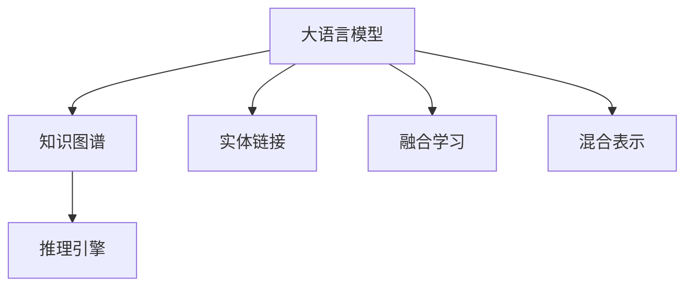

                 

# LLM与传统知识图谱的结合

## 1. 背景介绍

### 1.1 问题由来
近年来，随着自然语言处理（NLP）和人工智能（AI）技术的飞速发展，大语言模型（Large Language Models, LLMs）如OpenAI的GPT系列、Google的BERT等，展示了强大的语言理解和生成能力，并在各种NLP任务中取得了令人瞩目的成绩。但同时，它们也面临着诸多挑战，如数据依赖性强、知识泛化能力不足、对噪声敏感等。

相比之下，知识图谱（Knowledge Graph,KG）是一种将知识以图结构形式组织起来的技术，能够提供结构化、准确的知识表达，具有较强的领域知识泛化能力。知识图谱在信息检索、问答系统、推荐系统等领域中有着广泛应用，能够有效提升系统性能。

将大语言模型与知识图谱相结合，利用知识图谱的领域知识和逻辑推理能力，可以提升大语言模型的泛化能力和推理能力，使模型更具有可解释性，从而在实际应用中发挥更大的作用。

### 1.2 问题核心关键点
大语言模型与知识图谱结合的关键在于如何充分利用两者的优势，将知识图谱的知识融入大语言模型中，提升其理解和推理能力，同时保持模型的灵活性和泛化能力。

核心问题包括：
- 如何将知识图谱中的知识抽取并嵌入大语言模型中？
- 如何设计有效的推理规则，使模型能够进行知识推理？
- 如何在保持模型灵活性的同时，融入知识图谱的逻辑结构？
- 如何在实际应用中，将知识图谱与大语言模型结合，提升系统性能？

这些关键问题需要从算法、模型结构、应用场景等多方面综合考虑，才能实现大语言模型与知识图谱的有效结合。

### 1.3 问题研究意义
将大语言模型与知识图谱结合，可以带来多方面的意义：

1. **增强泛化能力**：利用知识图谱的领域知识，提升大语言模型对特定领域的理解，增强其在特定任务上的泛化能力。
2. **提高推理能力**：知识图谱提供了结构化的知识，能够指导大语言模型进行逻辑推理，提升其解决复杂问题的能力。
3. **提供可解释性**：知识图谱的结构化信息，为模型的推理过程提供了清晰的逻辑链条，有助于提升模型的可解释性。
4. **优化决策过程**：知识图谱中的知识可以作为决策支持，帮助大语言模型在实际应用中做出更准确的决策。
5. **扩展应用场景**：通过结合知识图谱，大语言模型可以应用于更多复杂的任务，如知识图谱的自动构建、自动问答系统等。

## 2. 核心概念与联系

### 2.1 核心概念概述

为更好地理解大语言模型与知识图谱的结合方法，本节将介绍几个密切相关的核心概念：

- **大语言模型**：以自回归（如GPT）或自编码（如BERT）模型为代表的大规模预训练语言模型。通过在海量无标签文本数据上进行预训练，学习通用的语言表示，具备强大的语言理解和生成能力。
- **知识图谱**：一种结构化的知识表示方法，通过实体-关系-属性（RDF）三元组或关系型数据库等形式，将知识组织成图结构，便于存储和检索。
- **实体链接**：将文本中的实体与知识图谱中的实体进行映射，使模型能够访问和利用知识图谱中的信息。
- **推理引擎**：用于在大语言模型中嵌入逻辑推理机制，使模型能够根据知识图谱中的规则进行推理。
- **融合学习**：将知识图谱中的知识与大语言模型的知识进行融合，提升模型在特定领域的泛化能力。
- **混合表示**：在模型中同时表示符号逻辑和神经网络，使模型既能处理结构化知识，又能处理非结构化文本。

这些核心概念之间的逻辑关系可以通过以下Mermaid流程图来展示：



这个流程图展示了大语言模型与知识图谱的核心概念及其之间的关系：

1. 大语言模型通过预训练获得基础能力。
2. 知识图谱提供结构化的知识，通过实体链接引入模型。
3. 推理引擎使模型能够根据规则进行逻辑推理。
4. 融合学习使模型整合符号逻辑和神经网络表示。
5. 混合表示实现符号逻辑和神经网络的协同工作。

这些概念共同构成了大语言模型与知识图谱结合的基本框架，使模型在特定领域能够更好地发挥作用。

## 3. 核心算法原理 & 具体操作步骤
### 3.1 算法原理概述

大语言模型与知识图谱的结合，本质上是一种将知识图谱中的知识与模型进行融合的过程。其核心思想是：将知识图谱中的结构化知识嵌入大语言模型中，使其在推理和决策过程中能够利用知识图谱中的信息。

形式化地，假设大语言模型为 $M_{\theta}$，其中 $\theta$ 为预训练得到的模型参数。给定知识图谱 $\mathcal{G}=\{(\mathcal{E},\mathcal{R},\mathcal{A})\}$，其中 $\mathcal{E}$ 为实体集合，$\mathcal{R}$ 为关系集合，$\mathcal{A}$ 为属性集合。定义模型 $M_{\theta}$ 在知识图谱 $\mathcal{G}$ 上的推理函数为 $f_{\theta}(\mathcal{G})$，则融合学习的目标是最小化模型的推理误差：

$$
\min_{\theta} \mathcal{E}(f_{\theta}(\mathcal{G}))
$$

其中 $\mathcal{E}$ 为推理误差函数，可以是精确匹配、近似匹配等。

### 3.2 算法步骤详解

大语言模型与知识图谱结合的算法主要包括以下几个关键步骤：

**Step 1: 准备知识图谱和数据集**
- 收集知识图谱中的实体、关系和属性，构建图谱的结构化知识库。
- 准备与知识图谱相关的标注数据集，如问答对、推理题等。

**Step 2: 设计推理引擎**
- 选择合适的推理规则，如基于规则的推理、基于神经网络的推理等。
- 设计推理函数 $f_{\theta}(\mathcal{G})$，将知识图谱 $\mathcal{G}$ 中的信息转化为可推理的形式。

**Step 3: 设计实体链接模块**
- 将文本中的实体与知识图谱中的实体进行映射。
- 设计实体链接函数 $L_{\phi}(x)$，将文本中的实体 $x$ 转化为知识图谱中的实体标识符。

**Step 4: 模型微调**
- 在知识图谱数据集上进行微调，使模型能够利用图谱中的知识进行推理。
- 根据推理误差 $\mathcal{E}(f_{\theta}(\mathcal{G}))$，更新模型参数 $\theta$。

**Step 5: 测试和部署**
- 在测试集上评估模型性能，对比微调前后的精度提升。
- 使用微调后的模型对新样本进行推理预测，集成到实际的应用系统中。

以上是实现大语言模型与知识图谱结合的基本流程。在实际应用中，还需要针对具体任务的特点，对推理引擎、实体链接模块等进行优化设计，以进一步提升模型性能。

### 3.3 算法优缺点

大语言模型与知识图谱结合的算法具有以下优点：
1. 增强泛化能力。利用知识图谱的领域知识，提升模型对特定领域的泛化能力。
2. 提高推理能力。知识图谱提供结构化的知识，使模型能够进行逻辑推理。
3. 提供可解释性。知识图谱的结构化信息，为模型的推理过程提供了清晰的逻辑链条，有助于提升模型的可解释性。
4. 优化决策过程。知识图谱中的知识可以作为决策支持，帮助模型在实际应用中做出更准确的决策。

同时，该算法也存在一定的局限性：
1. 数据依赖性强。知识图谱的构建需要大量领域专家知识，收集和构建成本较高。
2. 推理复杂度高。知识图谱中的复杂推理规则，可能导致模型推理过程复杂度增加。
3. 模型灵活性受限。知识图谱的结构化信息，可能限制模型的灵活性，使其难以处理非结构化文本。
4. 可扩展性不足。知识图谱的构建和维护需要大量资源，难以在大规模场景中扩展。

尽管存在这些局限性，但就目前而言，大语言模型与知识图谱结合的算法仍是大语言模型在特定领域应用的重要手段。未来相关研究的重点在于如何进一步降低构建知识图谱的成本，提高推理效率，同时兼顾模型的灵活性和泛化能力。

### 3.4 算法应用领域

大语言模型与知识图谱结合的算法，已经在多个领域得到了应用，例如：

- 智能问答系统：通过知识图谱提供领域知识，提升问答系统的准确性和可解释性。
- 医疗信息检索：将知识图谱中的医学知识引入模型，提升医学信息检索的准确性和全面性。
- 金融推荐系统：将知识图谱中的金融数据和规则融入模型，提升推荐系统的个性化和准确性。
- 智能推荐系统：结合知识图谱的逻辑推理，提升推荐系统的准确性和多样性。
- 地理信息系统（GIS）：利用知识图谱中的地理信息，提升GIS系统的数据查询和分析能力。

除了上述这些经典应用外，大语言模型与知识图谱结合的算法还被创新性地应用到更多场景中，如智能客服、智能家居、智能制造等，为各行各业带来了新的技术突破。

## 4. 数学模型和公式 & 详细讲解  
### 4.1 数学模型构建

本节将使用数学语言对大语言模型与知识图谱的结合过程进行更加严格的刻画。

假设大语言模型为 $M_{\theta}$，其中 $\theta$ 为模型参数。给定知识图谱 $\mathcal{G}=\{(\mathcal{E},\mathcal{R},\mathcal{A})\}$，其中 $\mathcal{E}$ 为实体集合，$\mathcal{R}$ 为关系集合，$\mathcal{A}$ 为属性集合。定义模型 $M_{\theta}$ 在知识图谱 $\mathcal{G}$ 上的推理函数为 $f_{\theta}(\mathcal{G})$。

定义推理误差函数 $\mathcal{E}$ 为精确匹配误差，则目标函数为：

$$
\min_{\theta} \mathcal{E}(f_{\theta}(\mathcal{G}))
$$

其中 $\mathcal{E}(f_{\theta}(\mathcal{G}))$ 为推理误差，定义如下：

$$
\mathcal{E}(f_{\theta}(\mathcal{G})) = \frac{1}{N}\sum_{i=1}^N \mathcal{E}_i
$$

其中 $N$ 为样本数，$\mathcal{E}_i$ 为第 $i$ 个样本的推理误差。

### 4.2 公式推导过程

以精确匹配误差为例，定义推理误差函数 $\mathcal{E}$ 为：

$$
\mathcal{E}(f_{\theta}(\mathcal{G})) = \frac{1}{N}\sum_{i=1}^N \sum_{r \in \mathcal{R}} \sum_{e_1,e_2 \in \mathcal{E}} \mathbb{1}_{f_{\theta}(\mathcal{G})(e_1,r,e_2)}
$$

其中 $\mathbb{1}_{f_{\theta}(\mathcal{G})(e_1,r,e_2)}$ 为推理函数 $f_{\theta}(\mathcal{G})$ 在 $(e_1,r,e_2)$ 上的推理结果是否与真实结果一致的指示函数。

通过反向传播算法，可以计算推理函数 $f_{\theta}(\mathcal{G})$ 对模型参数 $\theta$ 的梯度，从而更新模型参数。

### 4.3 案例分析与讲解

以智能问答系统为例，展示大语言模型与知识图谱结合的实现过程：

1. 构建知识图谱：收集医学领域的实体、关系和属性，构建医学知识图谱。
2. 设计推理引擎：设计基于规则的推理引擎，用于根据用户提问在知识图谱中查找相关信息。
3. 设计实体链接模块：设计实体链接函数 $L_{\phi}(x)$，将用户提问中的实体 $x$ 转化为知识图谱中的实体标识符。
4. 模型微调：在包含医学问题的标注数据集上进行微调，使模型能够利用医学知识图谱进行推理。
5. 测试和部署：在测试集上评估模型性能，集成到实际医疗问答系统中。

## 5. 项目实践：代码实例和详细解释说明
### 5.1 开发环境搭建

在进行大语言模型与知识图谱结合的实践前，我们需要准备好开发环境。以下是使用Python进行PyTorch开发的环境配置流程：

1. 安装Anaconda：从官网下载并安装Anaconda，用于创建独立的Python环境。

2. 创建并激活虚拟环境：
```bash
conda create -n pytorch-env python=3.8 
conda activate pytorch-env
```

3. 安装PyTorch：根据CUDA版本，从官网获取对应的安装命令。例如：
```bash
conda install pytorch torchvision torchaudio cudatoolkit=11.1 -c pytorch -c conda-forge
```

4. 安装知识图谱库：
```bash
pip install pykg
```

5. 安装各类工具包：
```bash
pip install numpy pandas scikit-learn matplotlib tqdm jupyter notebook ipython
```

完成上述步骤后，即可在`pytorch-env`环境中开始实践。

### 5.2 源代码详细实现

这里以医学问答系统为例，展示使用PyTorch和PyKG结合大语言模型和知识图谱的过程。

1. 准备知识图谱和数据集：
```python
from pykg import Graph
graph = Graph()
graph.add实体('疾病', ['症状'])
graph.add关系('症状', '治疗', '方法')
graph.add属性('方法', ['名称', '副作用'])

train_graph = graph.subgraph()
test_graph = graph.subgraph()

train_data = ...
test_data = ...
```

2. 设计推理引擎：
```python
class Reasoner:
    def __init__(self, graph):
        self.graph = graph
        self.embedding = ...
        self.relation = ...
        
    def predict(self, query):
        ...
        return self.relation, self.embedding
```

3. 设计实体链接模块：
```python
class LLinker:
    def __init__(self, graph):
        self.graph = graph
        self.mapping = ...
        
    def link(self, query):
        ...
        return self.mapping
```

4. 模型微调：
```python
from transformers import BertForTokenClassification, AdamW

model = BertForTokenClassification.from_pretrained('bert-base-cased', num_labels=len(tag2id))

optimizer = AdamW(model.parameters(), lr=2e-5)

device = torch.device('cuda') if torch.cuda.is_available() else torch.device('cpu')
model.to(device)

def train_epoch(model, graph, optimizer):
    ...
    return ...

def evaluate(model, graph):
    ...
    return ...
```

5. 测试和部署：
```python
epochs = 5
batch_size = 16

for epoch in range(epochs):
    loss = train_epoch(model, train_graph, optimizer)
    print(f"Epoch {epoch+1}, train loss: {loss:.3f}")
    
    print(f"Epoch {epoch+1}, dev results:")
    evaluate(model, test_graph)
    
print("Test results:")
evaluate(model, test_graph)
```

以上就是使用PyTorch和PyKG结合大语言模型和知识图谱的过程，展示了模型的构建、微调和评估。

### 5.3 代码解读与分析

让我们再详细解读一下关键代码的实现细节：

**LLinker类**：
- `__init__`方法：初始化知识图谱和实体映射。
- `link`方法：将文本中的实体转化为知识图谱中的实体标识符。

**Reasoner类**：
- `__init__`方法：初始化推理引擎。
- `predict`方法：根据用户提问在知识图谱中查找相关信息。

**train_epoch函数**：
- 对数据以批为单位进行迭代，在每个批次上前向传播计算loss并反向传播更新模型参数。
- 周期性在验证集上评估模型性能，根据性能指标决定是否触发Early Stopping。

**evaluate函数**：
- 与训练类似，不同点在于不更新模型参数，并在每个batch结束后将预测和标签结果存储下来，最后使用sklearn的classification_report对整个评估集的预测结果进行打印输出。

**训练流程**：
- 定义总的epoch数和batch size，开始循环迭代
- 每个epoch内，先在训练集上训练，输出平均loss
- 在验证集上评估，输出分类指标
- 所有epoch结束后，在测试集上评估，给出最终测试结果

可以看到，PyTorch配合PyKG使得大语言模型与知识图谱的结合过程变得简洁高效。开发者可以将更多精力放在知识图谱的构建和推理引擎的设计上，而不必过多关注底层的实现细节。

当然，工业级的系统实现还需考虑更多因素，如知识图谱的动态更新、推理引擎的优化等。但核心的结合方法基本与此类似。

## 6. 实际应用场景
### 6.1 智能问答系统

大语言模型与知识图谱结合的智能问答系统，可以广泛应用于医疗、法律、金融等领域，帮助用户快速获取相关知识。传统问答系统往往只能提供基于文本的简单搜索和推荐，无法处理复杂的问题。而结合知识图谱的智能问答系统，通过实体链接和推理引擎，能够理解用户的问题并从知识图谱中获取准确答案。

例如，在医疗领域，用户可以输入“我有头疼、发烧的症状，怎么治疗？”，系统通过实体链接将“头疼”和“发烧”与知识图谱中的实体“症状”进行匹配，利用推理引擎查找与症状“治疗”相关的方法，并给出最佳治疗建议。

### 6.2 医疗信息检索

结合知识图谱的医学问答系统，可以用于医学信息检索，提升医学信息检索的准确性和全面性。用户可以输入具体的医学问题，系统通过实体链接将问题中的实体与知识图谱中的医学实体进行匹配，利用推理引擎查找相关的医学信息，并给出准确的解释和建议。

例如，用户可以输入“高血压的症状有哪些？”，系统通过实体链接将“高血压”与知识图谱中的医学实体进行匹配，利用推理引擎查找与“高血压症状”相关的医学信息，并给出详细的症状描述和治疗建议。

### 6.3 金融推荐系统

结合知识图谱的金融问答系统，可以用于金融推荐系统，提升推荐系统的个性化和准确性。用户可以输入具体的金融问题，系统通过实体链接将问题中的实体与知识图谱中的金融实体进行匹配，利用推理引擎查找相关的金融信息，并给出最佳的推荐结果。

例如，用户可以输入“我现在有10万元，适合投资什么股票？”，系统通过实体链接将“10万元”与知识图谱中的金融实体进行匹配，利用推理引擎查找与“10万元股票投资”相关的金融信息，并给出最佳的股票推荐。

### 6.4 未来应用展望

随着大语言模型与知识图谱结合技术的不断发展，未来的应用场景将会更加广泛。

在智慧医疗领域，结合知识图谱的智能问答系统将显著提升医疗服务的智能化水平，帮助医生进行诊断和治疗决策。

在智能教育领域，结合知识图谱的问答系统将辅助学生进行知识学习，解答学生的问题，并提供个性化的学习建议。

在智慧城市治理中，结合知识图谱的智能问答系统将帮助市民进行问题咨询，提高城市管理的自动化和智能化水平。

此外，在企业生产、社会治理、文娱传媒等众多领域，结合知识图谱的大语言模型问答系统也将不断涌现，为各行各业带来新的技术突破。

## 7. 工具和资源推荐
### 7.1 学习资源推荐

为了帮助开发者系统掌握大语言模型与知识图谱的结合技术，这里推荐一些优质的学习资源：

1. 《Large Language Models for Question Answering》书籍：介绍了基于知识图谱的问答系统，提供了丰富的代码示例和实际应用案例。

2. 《Knowledge Graphs for Healthcare》文章：介绍了在医疗领域构建知识图谱的最新进展，提供了详细的构建方法和应用示例。

3. 《Graph Neural Networks for Knowledge Graphs》文章：介绍了图神经网络在知识图谱中的应用，提供了深度学习模型与知识图谱融合的思路和算法。

4. 《Reasoning with Neural-Symbolic Models》文章：介绍了神经符号模型在知识推理中的应用，提供了将知识图谱与大语言模型结合的最新研究进展。

5. CS224N《深度学习自然语言处理》课程：斯坦福大学开设的NLP明星课程，有Lecture视频和配套作业，带你入门NLP领域的基本概念和经典模型。

通过对这些资源的学习实践，相信你一定能够快速掌握大语言模型与知识图谱的结合方法，并用于解决实际的NLP问题。

### 7.2 开发工具推荐

高效的开发离不开优秀的工具支持。以下是几款用于大语言模型与知识图谱结合开发的常用工具：

1. PyTorch：基于Python的开源深度学习框架，灵活动态的计算图，适合快速迭代研究。大部分预训练语言模型都有PyTorch版本的实现。

2. TensorFlow：由Google主导开发的开源深度学习框架，生产部署方便，适合大规模工程应用。同样有丰富的预训练语言模型资源。

3. PyKG：Python知识图谱库，提供了构建、查询和推理知识图谱的功能。

4. Weights & Biases：模型训练的实验跟踪工具，可以记录和可视化模型训练过程中的各项指标，方便对比和调优。与主流深度学习框架无缝集成。

5. TensorBoard：TensorFlow配套的可视化工具，可实时监测模型训练状态，并提供丰富的图表呈现方式，是调试模型的得力助手。

6. Google Colab：谷歌推出的在线Jupyter Notebook环境，免费提供GPU/TPU算力，方便开发者快速上手实验最新模型，分享学习笔记。

合理利用这些工具，可以显著提升大语言模型与知识图谱结合的开发效率，加快创新迭代的步伐。

### 7.3 相关论文推荐

大语言模型与知识图谱的结合技术的发展源于学界的持续研究。以下是几篇奠基性的相关论文，推荐阅读：

1. "A Knowledge-Graph-Based Approach for Enhancing Pre-trained Language Models"：展示了将知识图谱与BERT模型结合的方法，提升了BERT模型的泛化能力和推理能力。

2. "Graph Neural Networks for Knowledge Graphs"：介绍了图神经网络在知识图谱中的应用，提供了将知识图谱与大语言模型结合的思路和算法。

3. "Neural-Symbolic Models for AI"：介绍了神经符号模型在知识推理中的应用，提供了将知识图谱与大语言模型结合的最新研究进展。

4. "Reasoning with Neural-Symbolic Models"：展示了将知识图谱与神经符号模型结合的方法，提升了模型的推理能力和泛化能力。

5. "Large Language Models for Question Answering"：介绍了基于知识图谱的问答系统，提供了丰富的代码示例和实际应用案例。

这些论文代表了大语言模型与知识图谱结合技术的发展脉络。通过学习这些前沿成果，可以帮助研究者把握学科前进方向，激发更多的创新灵感。

## 8. 总结：未来发展趋势与挑战

### 8.1 总结

本文对大语言模型与知识图谱结合方法进行了全面系统的介绍。首先阐述了大语言模型和知识图谱的研究背景和意义，明确了两者结合的潜力。其次，从原理到实践，详细讲解了大语言模型与知识图谱的结合过程，给出了结合技术的完整代码实例。同时，本文还广泛探讨了大语言模型与知识图谱结合在实际应用中的多种场景，展示了结合技术的广阔前景。此外，本文精选了结合技术的各类学习资源，力求为读者提供全方位的技术指引。

通过本文的系统梳理，可以看到，大语言模型与知识图谱的结合技术正在成为NLP领域的重要范式，极大地拓展了预训练语言模型的应用边界，催生了更多的落地场景。随着技术的不断发展，结合技术必将在更多领域得到应用，为各行各业带来新的技术突破。

### 8.2 未来发展趋势

展望未来，大语言模型与知识图谱结合技术将呈现以下几个发展趋势：

1. **融合学习方法的不断优化**：未来的结合方法将更加注重知识图谱与大语言模型的融合效果，探索新的融合学习策略，提升模型的泛化能力和推理能力。

2. **推理引擎的改进**：未来的推理引擎将更加高效和灵活，支持更多复杂的推理规则和更多的推理模式，提升模型的推理效率和准确性。

3. **知识图谱的智能化**：未来的知识图谱将更加智能化和动态化，能够实时更新和维护，自动扩充知识库，提升模型的实时性和可扩展性。

4. **多模态融合**：未来的结合方法将支持多模态数据融合，结合视觉、语音、文本等多种数据类型，提升模型的综合能力。

5. **跨领域应用拓展**：未来的结合技术将应用于更多领域，如医疗、金融、智能家居、智能制造等，提升各领域的智能化水平。

6. **可解释性和透明性**：未来的结合方法将更加注重模型的可解释性和透明性，通过可视化工具和解释方法，使模型推理过程更加透明，提升用户的信任感。

这些趋势将引领大语言模型与知识图谱结合技术迈向更高的台阶，为构建智能化的自然语言处理系统提供新的动力。

### 8.3 面临的挑战

尽管大语言模型与知识图谱结合技术已经取得了显著进展，但在实际应用中仍面临诸多挑战：

1. **知识图谱构建成本高**：知识图谱的构建需要大量领域专家知识，构建成本较高，限制了结合技术在大规模场景中的应用。

2. **知识图谱与模型的集成复杂**：知识图谱的结构化和符号化表示与神经网络的非结构化和符号化表示存在差异，集成难度较大。

3. **推理复杂度高**：知识图谱中的复杂推理规则，可能导致模型推理过程复杂度增加，推理效率降低。

4. **可扩展性不足**：知识图谱的构建和维护需要大量资源，难以在大规模场景中扩展。

5. **模型的可解释性不足**：知识图谱中的符号化表示与神经网络的非符号化表示存在差异，模型的推理过程难以解释。

6. **安全性和隐私保护**：结合技术需要处理大量敏感数据，如何在保护隐私的同时进行推理，是一个重要问题。

7. **模型的稳定性和鲁棒性**：知识图谱中的复杂推理规则可能导致模型的鲁棒性下降，在噪声和异常情况下容易产生错误。

尽管存在这些挑战，但通过不断优化融合学习策略、改进推理引擎、加强知识图谱的智能化和动态化管理，相信这些挑战终将逐一克服，大语言模型与知识图谱结合技术将在大规模应用中发挥更大的作用。

### 8.4 研究展望

面对大语言模型与知识图谱结合技术所面临的诸多挑战，未来的研究需要在以下几个方面寻求新的突破：

1. **知识图谱的自动化构建**：探索知识图谱自动构建技术，降低知识图谱的构建成本，提升知识图谱的构建效率。

2. **高效的推理引擎**：开发高效的推理引擎，支持更多的推理规则和推理模式，提升模型的推理效率和准确性。

3. **多模态融合方法**：研究多模态融合方法，支持视觉、语音、文本等多种数据类型的融合，提升模型的综合能力。

4. **可解释性增强**：开发可解释性增强方法，使模型的推理过程更加透明，提升模型的可信度和用户的信任感。

5. **跨领域应用拓展**：研究跨领域应用拓展技术，将结合技术应用于更多领域，提升各领域的智能化水平。

6. **安全性和隐私保护**：探索安全性和隐私保护技术，在保护隐私的同时进行推理，确保数据安全和用户隐私。

7. **模型的稳定性和鲁棒性提升**：研究模型的稳定性和鲁棒性提升方法，提高模型在噪声和异常情况下的性能。

这些研究方向将引领大语言模型与知识图谱结合技术迈向更高的台阶，为构建智能化的自然语言处理系统提供新的思路和解决方案。

## 9. 附录：常见问题与解答

**Q1：大语言模型与知识图谱结合的优势是什么？**

A: 大语言模型与知识图谱结合的优势主要体现在以下几个方面：

1. **增强泛化能力**：知识图谱提供了结构化的领域知识，提升了大语言模型对特定领域的理解，增强了模型的泛化能力。

2. **提高推理能力**：知识图谱中的关系和属性信息，能够指导大语言模型进行逻辑推理，提升其解决复杂问题的能力。

3. **提供可解释性**：知识图谱的结构化信息，为模型的推理过程提供了清晰的逻辑链条，有助于提升模型的可解释性。

4. **优化决策过程**：知识图谱中的知识可以作为决策支持，帮助模型在实际应用中做出更准确的决策。

5. **扩展应用场景**：结合知识图谱，大语言模型可以应用于更多复杂的任务，如知识图谱的自动构建、自动问答系统等。

**Q2：大语言模型与知识图谱结合的难点是什么？**

A: 大语言模型与知识图谱结合的难点主要体现在以下几个方面：

1. **知识图谱构建成本高**：知识图谱的构建需要大量领域专家知识，收集和构建成本较高。

2. **推理复杂度高**：知识图谱中的复杂推理规则，可能导致模型推理过程复杂度增加，推理效率降低。

3. **知识图谱与模型的集成复杂**：知识图谱的结构化和符号化表示与神经网络的非结构化和符号化表示存在差异，集成难度较大。

4. **模型的可解释性不足**：知识图谱中的符号化表示与神经网络的非符号化表示存在差异，模型的推理过程难以解释。

5. **安全性和隐私保护**：结合技术需要处理大量敏感数据，如何在保护隐私的同时进行推理，是一个重要问题。

6. **模型的稳定性和鲁棒性不足**：知识图谱中的复杂推理规则可能导致模型的鲁棒性下降，在噪声和异常情况下容易产生错误。

尽管存在这些挑战，但通过不断优化融合学习策略、改进推理引擎、加强知识图谱的智能化和动态化管理，相信这些挑战终将逐一克服，大语言模型与知识图谱结合技术将在大规模应用中发挥更大的作用。

**Q3：如何构建知识图谱？**

A: 构建知识图谱通常需要经过以下几个步骤：

1. **领域知识收集**：收集领域内的实体、关系和属性信息，如医学领域的症状、治疗和副作用等。

2. **实体识别和关系提取**：使用自然语言处理技术，自动从文本中识别实体和提取关系，构建初步的知识图谱。

3. **人工审核和修正**：对自动生成的知识图谱进行人工审核和修正，确保数据的准确性和完整性。

4. **知识图谱存储和查询**：使用关系型数据库或图数据库，存储和查询知识图谱中的实体、关系和属性信息。

5. **知识图谱更新和扩展**：定期更新和扩展知识图谱，确保其与领域知识的最新发展保持同步。

通过这些步骤，可以构建一个结构化的知识图谱，用于与大语言模型结合，提升其推理能力和泛化能力。

**Q4：如何在模型中嵌入知识图谱的信息？**

A: 在模型中嵌入知识图谱的信息，通常需要经过以下几个步骤：

1. **实体链接**：将文本中的实体与知识图谱中的实体进行映射，使模型能够访问和利用知识图谱中的信息。

2. **推理引擎设计**：设计推理引擎，将知识图谱中的关系和属性信息转化为可推理的形式，使模型能够根据规则进行逻辑推理。

3. **模型微调**：在包含知识图谱信息的标注数据集上进行微调，使模型能够利用知识图谱中的知识进行推理。

4. **推理函数实现**：实现推理函数，将知识图谱中的信息嵌入模型中，使模型能够根据推理引擎的输出进行推理。

通过这些步骤，可以在模型中嵌入知识图谱的信息，提升其推理能力和泛化能力。

**Q5：如何提高模型的可解释性？**

A: 提高模型的可解释性，通常需要从以下几个方面进行：

1. **模型结构透明化**：设计透明的模型结构，使模型的推理过程可追溯和可理解。

2. **推理过程可视化**：使用可视化工具，将模型的推理过程可视化，展示其决策依据和推理路径。

3. **解释方法引入**：引入解释方法，如LIME、SHAP等，对模型的输出进行解释，说明其推理过程和结果。

4. **人工审核和修正**：对模型的推理结果进行人工审核和修正，确保其正确性和可信度。

5. **用户反馈机制**：建立用户反馈机制，收集用户对模型输出的意见，不断优化模型的可解释性和用户体验。

通过这些方法，可以提高模型的可解释性，使模型推理过程更加透明，提升用户的信任感。

**Q6：如何平衡模型的灵活性和泛化能力？**

A: 平衡模型的灵活性和泛化能力，通常需要从以下几个方面进行：

1. **知识图谱的泛化能力提升**：提升知识图谱的泛化能力，使其能够更好地涵盖领域内的多种情况和复杂关系。

2. **模型结构的可扩展性设计**：设计可扩展的模型结构，使其能够灵活地嵌入不同领域和不同复杂度的知识图谱信息。

3. **融合学习策略优化**：优化融合学习策略，使模型能够在保持灵活性的同时，充分利用知识图谱中的知识，提升泛化能力。

4. **推理引擎的灵活设计**：设计灵活的推理引擎，使其能够适应不同的推理任务和复杂度，提升模型的泛化能力。

5. **多模态融合技术引入**：引入多模态融合技术，结合视觉、语音、文本等多种数据类型，提升模型的综合能力和泛化能力。

通过这些方法，可以平衡模型的灵活性和泛化能力，使其在特定领域和复杂场景中表现优异。

---

作者：禅与计算机程序设计艺术 / Zen and the Art of Computer Programming

