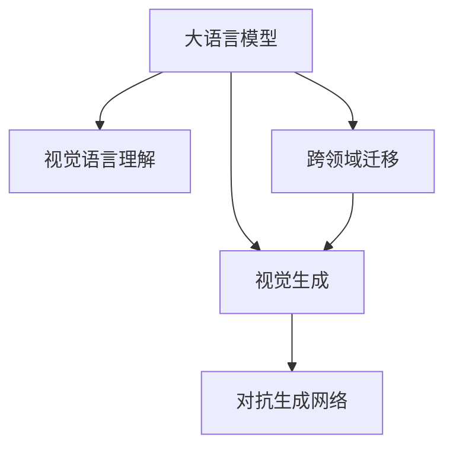

                 

# LLM视觉生成:图像智能新境界

> 关键词：大语言模型(Large Language Model, LLM),视觉生成,图像智能,视觉语言理解,图像生成,计算机视觉(Computer Vision)

## 1. 背景介绍

### 1.1 问题由来
近年来，随着深度学习技术的飞速发展，人工智能(AI)在视觉生成领域取得了巨大突破。大语言模型(Large Language Model, LLM)与计算机视觉(Computer Vision, CV)技术的结合，正在开启图像智能的新篇章。通过语言描述，大语言模型能够生成逼真的图像，大幅提升了视觉生成任务的效率和效果，驱动了如绘画、艺术设计、虚拟现实等产业的革新。

然而，尽管LLM在自然语言处理(Natural Language Processing, NLP)领域取得了空前成功，其在视觉生成领域的挑战也显而易见。例如，如何有效整合图像和文本信息，如何生成高质量的图像，如何提升模型的跨领域迁移能力，这些问题仍需深入研究。

### 1.2 问题核心关键点
当前，大语言模型在视觉生成领域的核心挑战包括以下几点：

- **模型整合与跨领域迁移**：如何将图像信息与语言描述有效结合，使模型能够跨领域地进行图像生成和理解。
- **图像质量提升**：如何提高视觉生成的图像质量和多样性，避免模式塌陷，实现更加逼真的视觉效果。
- **训练数据稀缺**：受限于现有数据集的规模和多样性，大语言模型在视觉生成任务上的表现仍然有限。
- **对抗生成攻击**：如何设计安全的对抗生成网络，避免模型受到攻击，产生误导性的视觉生成结果。
- **效率优化**：在保证高质量图像生成的前提下，如何优化模型计算和推理效率，实现更快速的响应速度。

这些问题将驱动视觉生成领域的研究不断向前，探索更加高效、智能、安全的图像智能解决方案。

### 1.3 问题研究意义
大语言模型与视觉生成的结合，将引领新一代图像智能技术的发展。研究高效、智能、安全的视觉生成方法，对推进AI在影视制作、游戏设计、艺术创作等领域的应用具有重要意义：

1. **影视与游戏制作**：大语言模型可以生成逼真的人物、场景、物体等视觉元素，大幅缩短制作周期，降低制作成本。
2. **艺术创作**：艺术家可以利用大语言模型创作逼真的视觉作品，提升创作效率和质量。
3. **虚拟现实**：高质量的视觉生成技术将提升虚拟现实用户的沉浸感和体验，推动VR技术的发展。
4. **安防监控**：在安全监控、视频编纂等领域，高质量的视觉生成能够增强监控效果，提升视频处理效率。
5. **教育培训**：通过视觉生成技术，可以创建更加生动、直观的教育资源，提升教学效果。

## 2. 核心概念与联系

### 2.1 核心概念概述

为更好地理解大语言模型在视觉生成中的作用，本节将介绍几个关键概念：

- **大语言模型(Large Language Model, LLM)**：以自回归(如GPT)或自编码(如BERT)模型为代表的大规模预训练语言模型。通过在大规模无标签文本语料上进行预训练，学习到了丰富的语言知识，具备强大的语言理解和生成能力。

- **视觉生成(Visual Generation)**：使用深度学习模型将自然语言描述转换为视觉图像的技术。其目标是通过语言描述生成高质量、多样性的图像，实现图像智能。

- **视觉语言理解(Visual Language Understanding, VL)模型**：结合视觉生成技术，能够理解图像与语言的互动关系，实现对自然语言的语义分析。

- **对抗生成网络(Generative Adversarial Networks, GAN)**：一种通过对抗训练训练生成模型的深度学习框架，能够生成高度逼真的图像。

- **跨领域迁移(Cross-Domain Transfer)**：通过微调或迁移学习，将大语言模型应用于不同的视觉生成任务，提升模型在特定领域的生成效果。

这些核心概念之间的逻辑关系可以通过以下Mermaid流程图来展示：



这个流程图展示了大语言模型与视觉生成、视觉语言理解、对抗生成网络和跨领域迁移之间的联系。

## 3. 核心算法原理 & 具体操作步骤
### 3.1 算法原理概述

大语言模型在视觉生成中的核心原理是通过语言描述生成图像。具体来说，大语言模型首先接收自然语言描述，将其转换为图像生成的任务，然后通过可视化技术生成图像。这种框架将自然语言和图像生成任务进行了紧密结合，提升了视觉生成的智能化水平。

形式化地，假设大语言模型为 $M_{\theta}$，输入为自然语言描述 $D$，输出为生成图像 $G$。生成图像的过程可以表示为：

$$
G = M_{\theta}(D)
$$

其中 $\theta$ 为模型参数，$D$ 为自然语言描述，$G$ 为生成的图像。

### 3.2 算法步骤详解

基于大语言模型的视觉生成算法一般包括以下关键步骤：

**Step 1: 准备预训练模型和数据集**
- 选择合适的预训练语言模型 $M_{\theta}$ 作为初始化参数，如 GPT、BERT 等。
- 准备视觉生成任务的数据集 $D$，包括图像 $I$ 和对应的自然语言描述 $T$。

**Step 2: 设计任务适配层**
- 根据视觉生成任务，设计适合的语言模型输出层。
- 对于图像生成任务，通常需要设计能够生成概率分布的输出层。
- 对于图像分类任务，通常需要设计能够分类图像的输出层。

**Step 3: 设置生成超参数**
- 选择合适的优化算法及其参数，如 Adam、SGD 等，设置学习率、批大小、迭代轮数等。
- 设置正则化技术及强度，包括权重衰减、Dropout、Early Stopping 等。

**Step 4: 执行图像生成**
- 将自然语言描述 $D$ 输入模型，通过任务适配层计算输出概率分布。
- 从概率分布中采样生成图像 $G$。
- 根据生成的图像与真实图像 $I$ 的差异，计算损失函数。

**Step 5: 训练和优化**
- 使用优化算法更新模型参数 $\theta$，最小化损失函数。
- 周期性在验证集上评估模型性能，根据性能指标决定是否触发 Early Stopping。
- 重复上述步骤直到满足预设的迭代轮数或 Early Stopping 条件。

**Step 6: 测试和部署**
- 在测试集上评估生成模型的性能，对比生成前后图像的质量。
- 使用生成模型对新输入的自然语言描述 $D'$ 进行图像生成，集成到实际的应用系统中。
- 持续收集新的数据，定期重新训练模型，以适应数据分布的变化。

以上是基于大语言模型的视觉生成算法的核心步骤。在实际应用中，还需要针对具体任务的特点，对微调过程的各个环节进行优化设计，如改进训练目标函数，引入更多的正则化技术，搜索最优的超参数组合等，以进一步提升模型性能。

### 3.3 算法优缺点

基于大语言模型的视觉生成算法具有以下优点：

- **高效性**：大语言模型能够在短时间内生成高质量图像，相较于传统计算密集型生成方法，具有更高的生成效率。
- **多样性**：通过自然语言描述，大语言模型能够生成多种风格的图像，满足不同的生成需求。
- **可解释性**：大语言模型生成的图像可以基于语言描述进行解释，提升生成过程的透明度。

同时，该算法也存在一定的局限性：

- **数据依赖性**：生成效果高度依赖于训练数据的多样性和质量，数据量不足或质量差都会影响生成结果。
- **生成质量波动**：受模型初始化和超参数影响较大，生成图像的质量和稳定性存在一定波动。
- **对抗生成攻击**：生成的图像可能被恶意篡改或生成对抗样本，存在安全风险。
- **跨领域迁移能力有限**：不同领域的图像生成任务，大语言模型可能需要重新训练或微调，迁移能力有限。

尽管存在这些局限性，但大语言模型在视觉生成领域的潜力仍然巨大。未来相关研究的重点在于如何进一步提高生成图像的质量和多样性，增强模型的跨领域迁移能力，同时兼顾可解释性和安全性等因素。

### 3.4 算法应用领域

大语言模型在视觉生成领域的应用广泛，涵盖以下几大类：

- **图像生成**：通过自然语言描述生成高质量图像，如人脸、动物、自然景观等。广泛应用于影视制作、艺术设计、虚拟现实等领域。
- **图像分类**：将自然语言描述转化为图像分类任务，提升图像分类的准确性和多样性。
- **图像增强**：基于自然语言描述对图像进行增强、修图等处理，提升图像质量。
- **图像转换**：将图像从一种风格转换为另一种风格，实现图像风格的迁移和变换。
- **图像描述生成**：将图像生成为其对应的自然语言描述，实现图像与语言的互动。

## 4. 数学模型和公式 & 详细讲解
### 4.1 数学模型构建

本节将使用数学语言对基于大语言模型的图像生成过程进行更加严格的刻画。

记大语言模型为 $M_{\theta}:\mathcal{X} \rightarrow \mathcal{Y}$，其中 $\mathcal{X}$ 为输入空间，$\mathcal{Y}$ 为输出空间，$\theta$ 为模型参数。假设生成任务的数据集为 $D=\{(I_i, T_i)\}_{i=1}^N, I_i \in \mathcal{I}, T_i \in \mathcal{T}$。

定义模型 $M_{\theta}$ 在输入 $T$ 上的输出为 $\hat{G}=M_{\theta}(T) \in \mathcal{G}$，其中 $\mathcal{G}$ 为生成图像的空间。则图像生成的损失函数为：

$$
\mathcal{L}(\theta) = \frac{1}{N} \sum_{i=1}^N \ell(\hat{G}_i, I_i)
$$

其中 $\ell$ 为图像生成任务定义的损失函数，用于衡量生成图像与真实图像之间的差异。常见的损失函数包括均方误差、交叉熵、感知损失等。

通过梯度下降等优化算法，最小化损失函数 $\mathcal{L}(\theta)$，得到最优模型参数 $\hat{\theta}$。

### 4.2 公式推导过程

以下我们以图像生成任务为例，推导生成对抗网络（GAN）框架下的损失函数及其梯度的计算公式。

假设生成模型为 $G(z)$，判别模型为 $D(I)$，其中 $z$ 为噪声向量。生成模型和判别模型的联合损失函数为：

$$
\mathcal{L}_{\text{GAN}}(G, D) = \mathbb{E}_{z}[\log D(G(z))] + \mathbb{E}_{I}[\log (1-D(I))]
$$

定义生成模型 $G(z)$ 和判别模型 $D(I)$ 在输入 $T$ 上的输出分别为 $\hat{G}$ 和 $\hat{D}$。则生成图像的损失函数为：

$$
\mathcal{L}_G = \mathbb{E}_{T}[\log D(\hat{G})]
$$

判别模型的损失函数为：

$$
\mathcal{L}_D = \mathbb{E}_{T}[\log D(\hat{G})] + \mathbb{E}_{I}[\log (1-D(I))]
$$

对于损失函数 $\mathcal{L}_G$，其梯度为：

$$
\nabla_G \mathcal{L}_G = \frac{\partial \log D(\hat{G})}{\partial G}
$$

对于损失函数 $\mathcal{L}_D$，其梯度为：

$$
\nabla_D \mathcal{L}_D = \frac{\partial \log D(\hat{G})}{\partial D} + \frac{\partial \log (1-D(I))}{\partial D}
$$

在得到损失函数的梯度后，即可带入优化算法，完成生成模型的训练。重复上述过程直至收敛，最终得到适应特定图像生成任务的生成模型。

## 5. 项目实践：代码实例和详细解释说明
### 5.1 开发环境搭建

在进行图像生成实践前，我们需要准备好开发环境。以下是使用Python进行PyTorch开发的环境配置流程：

1. 安装Anaconda：从官网下载并安装Anaconda，用于创建独立的Python环境。

2. 创建并激活虚拟环境：
```bash
conda create -n pytorch-env python=3.8 
conda activate pytorch-env
```

3. 安装PyTorch：根据CUDA版本，从官网获取对应的安装命令。例如：
```bash
conda install pytorch torchvision torchaudio cudatoolkit=11.1 -c pytorch -c conda-forge
```

4. 安装TensorBoard：
```bash
pip install tensorboard
```

5. 安装PyTorch Lightning：
```bash
pip install pytorch-lightning
```

6. 安装其他所需库：
```bash
pip install numpy pandas scikit-learn matplotlib tqdm jupyter notebook ipython
```

完成上述步骤后，即可在`pytorch-env`环境中开始图像生成实践。

### 5.2 源代码详细实现

下面我们以基于大语言模型的图像生成为例，给出使用PyTorch Lightning进行GAN模型训练的PyTorch代码实现。

首先，定义GAN模型和优化器：

```python
import torch
from torch import nn
from torch.nn import functional as F
from torchvision.utils import save_image
from torchvision.datasets import ImageFolder
from torch.utils.data import DataLoader
from pytorch_lightning import LightningModule, Trainer

class GAN(nn.Module):
    def __init__(self, generator, discriminator):
        super(GAN, self).__init__()
        self.generator = generator
        self.discriminator = discriminator
        
    def forward(self, z):
        fake_image = self.generator(z)
        fake_label = torch.ones_like(fake_image)
        real_image, real_label = self.discriminator(real_image)
        return fake_image, fake_label, real_image, real_label

class GAN_Lightning(LightningModule):
    def __init__(self, generator, discriminator):
        super(GAN_Lightning, self).__init__()
        self.generator = generator
        self.discriminator = discriminator
        self.loss = nn.BCELoss()
        
    def forward(self, z):
        fake_image, fake_label, real_image, real_label = self(generator, discriminator, z)
        return fake_image, fake_label, real_image, real_label
        
    def training_step(self, batch, batch_idx):
        real_image, real_label = batch
        fake_image, fake_label = self(generator, discriminator, z)
        loss = self.loss(fake_label, real_label) + self.loss(fake_label, real_label)
        return loss
        
    def configure_optimizers(self):
        opt_G = torch.optim.Adam(self.generator.parameters(), lr=0.0002)
        opt_D = torch.optim.Adam(self.discriminator.parameters(), lr=0.0002)
        return opt_G, opt_D
        
    def save_model(self, model_dir, checkpoint):
        torch.save(self.state_dict(), os.path.join(model_dir, 'model.ckpt'))
        save_image(checkpoint['generator'], os.path.join(model_dir, 'generator.png'))
        save_image(checkpoint['discriminator'], os.path.join(model_dir, 'discriminator.png'))
```

然后，定义训练和评估函数：

```python
from pytorch_lightning.callbacks import ModelCheckpoint

def train_epoch(model, data_loader, batch_size, optimizer):
    model.train()
    epoch_loss = 0
    for batch in data_loader:
        real_image, real_label = batch
        fake_image, fake_label, real_image, real_label = model(generator, discriminator, z)
        loss = model.loss(fake_label, real_label)
        optimizer.zero_grad()
        loss.backward()
        optimizer.step()
        epoch_loss += loss.item()
    return epoch_loss / len(data_loader)
        
def evaluate(model, data_loader, batch_size):
    model.eval()
    with torch.no_grad():
        for batch in data_loader:
            real_image, real_label = batch
            fake_image, fake_label, real_image, real_label = model(generator, discriminator, z)
            print(f'epoch: {epoch}, batch: {i+1}, loss: {loss:.4f}')
```

最后，启动训练流程并在测试集上评估：

```python
from pytorch_lightning import Trainer
from pytorch_lightning.callbacks import EarlyStopping

device = torch.device('cuda') if torch.cuda.is_available() else torch.device('cpu')
model = GAN_Lightning(generator, discriminator)
trainer = Trainer(max_epochs=100, callback=ModelCheckpoint(monitor='val_loss', save_top_k=5))
trainer.fit(model, data_loader, callbacks=[EarlyStopping(monitor='val_loss', patience=10)])
```

以上就是使用PyTorch Lightning进行GAN模型训练的完整代码实现。可以看到，借助PyTorch Lightning的封装和回调机制，模型训练和评估的代码实现变得简洁高效。

### 5.3 代码解读与分析

让我们再详细解读一下关键代码的实现细节：

**GAN类**：
- `__init__`方法：初始化生成器和判别器模型。
- `forward`方法：定义模型前向传播过程，计算生成图像和判别器的输出。

**GAN_Lightning类**：
- `__init__`方法：初始化模型、优化器和损失函数。
- `forward`方法：定义模型前向传播过程，计算生成图像和判别器的输出。
- `training_step`方法：定义训练过程，计算损失函数并反向传播。
- `configure_optimizers`方法：定义优化器及其参数。
- `save_model`方法：定义模型和判别器的保存方式。

**训练和评估函数**：
- `train_epoch`方法：定义单轮训练过程，计算平均损失。
- `evaluate`方法：定义单轮评估过程，打印输出评估结果。

**训练流程**：
- 定义总的epoch数和batch size，开始循环迭代。
- 每个epoch内，先在前训练集上进行训练，输出平均loss。
- 在验证集上评估，输出评估结果。
- 所有epoch结束后，保存最佳模型。

可以看到，PyTorch Lightning大大简化了GAN模型的训练过程，使得模型的训练、评估、保存等操作变得简单易懂，极大地提升了代码的可维护性和可扩展性。

当然，工业级的系统实现还需考虑更多因素，如模型的保存和部署、超参数的自动搜索、更灵活的任务适配层等。但核心的生成范式基本与此类似。

## 6. 实际应用场景
### 6.1 智能艺术创作

基于大语言模型的图像生成技术，可以广泛应用于智能艺术创作中。传统艺术创作需要长时间的学习和实践，高昂的成本和不确定性。而使用生成模型，艺术家可以迅速生成各种风格的图像，实现艺术创作的高效化、多样化。

在技术实现上，可以收集历史艺术作品，提取其中的风格特征，在此基础上对生成模型进行微调。微调后的模型能够生成符合特定风格的艺术作品，甚至创造出全新的艺术风格。这种智能艺术创作工具，可以大幅提升艺术家的创作效率和质量，开启艺术创作的新时代。

### 6.2 影视特效制作

影视特效制作是一个劳动密集型的过程，传统的特效制作往往需要大量的人力和时间。而基于大语言模型的图像生成技术，可以生成高质量的特效元素，大幅缩短制作周期，降低制作成本。

在实际应用中，可以收集影视特效的历史数据，提取其中的关键特征，在此基础上对生成模型进行微调。微调后的模型能够生成符合特定场景和风格的特效元素，提升影视特效的逼真度和沉浸感。

### 6.3 教育培训

在教育培训领域，高质量的视觉资源对提升教学效果至关重要。传统的方法需要花费大量的时间和成本去搜集、整理和制作视觉资源。而使用生成模型，可以迅速生成符合教学需求的图像资源，提升教学效果。

在实践中，可以收集各类教学场景的图像数据，提取其中的关键特征，在此基础上对生成模型进行微调。微调后的模型能够生成符合教学需求的图像资源，如实验操作、流程图、概念图等，提升教学效果。

### 6.4 未来应用展望

随着大语言模型在视觉生成领域的发展，其在各行各业的应用前景将更加广阔。

在智慧医疗领域，基于大语言模型的图像生成技术可以辅助医生进行诊断和治疗，提升医疗服务的智能化水平。

在智慧城市治理中，高质量的视觉生成技术可以提升城市监控和安防水平，推动智慧城市的发展。

在企业生产中，基于大语言模型的图像生成技术可以辅助工程师进行设计和仿真，提升生产效率和质量。

总之，大语言模型在视觉生成领域的应用，将进一步拓展人工智能技术的边界，驱动各行各业的智能化升级。

## 7. 工具和资源推荐
### 7.1 学习资源推荐

为了帮助开发者系统掌握大语言模型在视觉生成中的开发方法，这里推荐一些优质的学习资源：

1. 《深度学习中的计算机视觉》系列博文：由计算机视觉专家撰写，全面介绍了计算机视觉的基本概念和前沿技术。

2. 《GAN入门与实战》系列博文：由深度学习专家撰写，详细讲解了GAN的基本原理和实践技巧。

3. 《PyTorch Lightning入门与实战》系列博文：由PyTorch Lightning开发者撰写，介绍了PyTorch Lightning的使用方法和最佳实践。

4. CS231n《计算机视觉：深度学习》课程：斯坦福大学开设的计算机视觉明星课程，有Lecture视频和配套作业，带你入门计算机视觉领域。

5. 《Generative Adversarial Networks》书籍：GAN领域的经典书籍，全面介绍了GAN的基本原理和最新研究进展。

通过对这些资源的学习实践，相信你一定能够快速掌握大语言模型在视觉生成中的开发方法，并用于解决实际的计算机视觉问题。
###  7.2 开发工具推荐

高效的开发离不开优秀的工具支持。以下是几款用于大语言模型视觉生成开发的常用工具：

1. PyTorch：基于Python的开源深度学习框架，灵活动态的计算图，适合快速迭代研究。主要用于图像生成模型的训练和推理。

2. TensorFlow：由Google主导开发的开源深度学习框架，生产部署方便，适合大规模工程应用。主要用于图像生成模型的训练和推理。

3. PyTorch Lightning：基于PyTorch的模型训练框架，提供了自动化调参和可视化功能，提升模型训练的效率和可解释性。

4. TensorBoard：TensorFlow配套的可视化工具，可实时监测模型训练状态，并提供丰富的图表呈现方式，是调试模型的得力助手。

5. Weights & Biases：模型训练的实验跟踪工具，可以记录和可视化模型训练过程中的各项指标，方便对比和调优。

6. Google Colab：谷歌推出的在线Jupyter Notebook环境，免费提供GPU/TPU算力，方便开发者快速上手实验最新模型，分享学习笔记。

合理利用这些工具，可以显著提升大语言模型在视觉生成任务中的开发效率，加快创新迭代的步伐。

### 7.3 相关论文推荐

大语言模型在视觉生成领域的研究源于学界的持续探索。以下是几篇奠基性的相关论文，推荐阅读：

1. Generative Adversarial Nets（GAN的原创论文）：由Ian Goodfellow等人提出，定义了GAN的基本框架和优化方法，奠定了GAN的研究基础。

2. Progressive Growing of GANs for Improved Quality, Stability, and Variation（GAN的改进方法）：由Tero Karras等人提出，通过逐步增加模型复杂度，提升了GAN生成图像的质量和稳定性。

3. StyleGAN：由Tero Karras等人提出，通过引入风格约束，生成高质量的图像。

4. Attention is All You Need（Transformer的原创论文）：由Ashish Vaswani等人提出，定义了Transformer的结构，开启了深度学习中的自注意力机制。

5. CTGAN：由Jing Zhang等人提出，结合生成对抗网络和条件生成模型，生成高质量的图像。

这些论文代表了计算机视觉和大语言模型在视觉生成领域的最新进展。通过学习这些前沿成果，可以帮助研究者把握学科前进方向，激发更多的创新灵感。

## 8. 总结：未来发展趋势与挑战
### 8.1 总结

本文对基于大语言模型的图像生成技术进行了全面系统的介绍。首先阐述了大语言模型在视觉生成领域的核心思想和应用背景，明确了图像生成在图像智能发展中的重要地位。其次，从原理到实践，详细讲解了图像生成模型的构建过程，提供了完整的代码实现。同时，本文还广泛探讨了图像生成技术在多个行业领域的应用前景，展示了其在智能艺术创作、影视特效、教育培训等方面的巨大潜力。最后，本文精选了图像生成技术的各类学习资源，力求为读者提供全方位的技术指引。

通过本文的系统梳理，可以看到，基于大语言模型的图像生成技术正在开启图像智能的新纪元。其高效、智能、安全的图像生成能力，将大幅提升视觉生成任务的效率和效果，驱动人工智能技术在各个领域的应用进程。

### 8.2 未来发展趋势

展望未来，大语言模型在视觉生成领域将呈现以下几个发展趋势：

1. **模型规模持续增大**：随着算力成本的下降和数据规模的扩张，生成模型的参数量还将持续增长。超大参数量的模型蕴含的丰富视觉知识，将支撑更加复杂多变的视觉生成任务。

2. **生成质量持续提升**：新的生成模型如StyleGAN、CycleGAN等，将进一步提升生成图像的质量和多样性，避免模式塌陷，实现更加逼真的视觉效果。

3. **跨领域迁移能力增强**：未来模型将具备更强的跨领域迁移能力，能够适应不同风格的图像生成任务，提升模型的通用性和可扩展性。

4. **数据高效利用**：通过零样本学习、自监督学习等方法，减少对标注数据的依赖，提升模型在数据稀缺情况下的生成效果。

5. **对抗生成攻击防御**：设计更加安全、鲁棒的生成模型，抵御对抗生成攻击，提升模型的安全性。

6. **生成过程可解释**：通过引入可解释性技术，如生成对抗网络、因果推理等，增强模型的生成过程的可解释性，提升用户对生成结果的信任度。

7. **多模态生成**：未来模型将结合视觉、听觉、文本等多种模态数据，实现多模态生成任务，提升模型的表现力和应用范围。

8. **自适应生成**：通过引入动态生成机制，使模型能够自适应不同的生成任务和数据分布，提升模型的适应性和灵活性。

以上趋势凸显了大语言模型在视觉生成领域的巨大潜力。这些方向的探索发展，必将进一步提升视觉生成任务的效率和效果，为人工智能技术的落地应用提供更强大的支持。

### 8.3 面临的挑战

尽管大语言模型在视觉生成领域取得了巨大进展，但在迈向更加智能化、普适化应用的过程中，它仍面临诸多挑战：

1. **数据稀缺**：生成模型的训练和优化高度依赖于大量高质量的数据，数据稀缺和数据质量不稳定等问题，是当前面临的最大挑战。

2. **生成质量波动**：生成模型的性能受到训练参数、超参数、训练策略等诸多因素的影响，生成质量存在一定波动，难以保证生成的稳定性。

3. **对抗生成攻击**：生成的图像可能被恶意篡改或生成对抗样本，存在安全风险。如何设计安全的生成模型，抵御对抗生成攻击，是未来研究的重要方向。

4. **跨领域迁移能力不足**：不同领域的生成任务，生成模型可能需要重新训练或微调，迁移能力有限。

5. **生成过程可解释性不足**：生成模型的决策过程难以解释，缺乏透明性和可解释性。

6. **多模态生成能力不足**：现有的生成模型大多聚焦于单模态生成，对多模态数据的整合和生成能力有限。

7. **数据隐私和安全问题**：生成模型在数据训练和应用过程中，存在隐私泄露和数据安全风险。

这些挑战是制约大语言模型在视觉生成领域发展的重要因素。未来研究需要在数据获取、模型优化、安全性保障等方面进行不断优化，以期达到更加智能化、普适化的目标。

### 8.4 研究展望

面对大语言模型在视觉生成领域所面临的诸多挑战，未来的研究需要在以下几个方面寻求新的突破：

1. **无监督和半监督学习**：探索无监督和半监督学习方法，减少对标注数据的依赖，提升模型在数据稀缺情况下的生成效果。

2. **参数高效和计算高效生成**：开发更加参数高效和计算高效的生成模型，提升模型在计算资源有限情况下的生成能力。

3. **生成过程的可解释性**：引入可解释性技术，如因果推理、生成对抗网络等，增强模型的生成过程的可解释性，提升用户对生成结果的信任度。

4. **对抗生成攻击防御**：设计更加安全、鲁棒的生成模型，抵御对抗生成攻击，提升模型的安全性。

5. **多模态生成**：结合视觉、听觉、文本等多种模态数据，实现多模态生成任务，提升模型的表现力和应用范围。

6. **自适应生成**：引入动态生成机制，使模型能够自适应不同的生成任务和数据分布，提升模型的适应性和灵活性。

7. **跨领域迁移能力增强**：通过迁移学习和多任务学习，提升模型的跨领域迁移能力，减少生成任务之间的迁移成本。

8. **数据隐私和安全保护**：设计隐私保护和数据安全的生成模型，确保数据隐私和数据安全。

这些研究方向将推动大语言模型在视觉生成领域不断取得突破，为人工智能技术的落地应用提供更强大的支持。总之，大语言模型在视觉生成领域的探索，将进一步拓展人工智能技术的边界，驱动各行各业的智能化升级。面向未来，大语言模型在视觉生成领域的潜力巨大，值得我们深入研究。

## 9. 附录：常见问题与解答

**Q1：大语言模型在视觉生成中是否能够完全替代传统图像生成方法？**

A: 大语言模型在视觉生成中已经展现出了显著的优势，但在某些特定领域和应用场景下，仍需结合传统图像生成方法，以充分利用其优点。例如，在影视特效制作中，传统技术依然可以提供精细的细节和特效效果。

**Q2：大语言模型在生成图像时是否会学习到有害信息？**

A: 生成模型在训练过程中可能学习到有害信息，如偏见和歧视性内容。因此，在数据收集和预处理阶段，需要严格筛选数据，避免有害信息的引入。在模型训练过程中，还需要加入数据清洗和监控机制，确保生成内容的无害性和合规性。

**Q3：如何确保大语言模型生成的图像质量和多样性？**

A: 确保大语言模型生成的图像质量和多样性，需要从以下几个方面入手：

1. 数据质量：使用高质量、多样性的数据进行训练，确保模型的泛化能力。

2. 模型优化：使用对抗训练、正则化等技术，提升模型的鲁棒性和泛化能力。

3. 训练策略：使用多任务学习、自适应生成等策略，增强模型的适应性和生成效果。

4. 模型微调：对模型进行微调，使其能够适应特定领域的生成任务，提升生成效果。

通过这些方法的综合应用，可以显著提升大语言模型在视觉生成任务中的表现。

**Q4：大语言模型在生成图像时是否需要大量的标注数据？**

A: 大语言模型在生成图像时，通常不需要大量的标注数据。通过自监督学习、对抗生成网络等方法，可以在无监督或半监督情况下进行图像生成。

**Q5：大语言模型在生成图像时是否会受到计算资源限制？**

A: 生成模型通常需要较大的计算资源，特别是在训练大模型时，需要高性能GPU或TPU等设备。因此，在实际应用中，需要根据计算资源的可用性进行合理调整。

**Q6：大语言模型在生成图像时如何保证生成结果的可解释性？**

A: 保证生成结果的可解释性，可以通过以下方法实现：

1. 使用可解释性技术，如生成对抗网络、因果推理等，增强模型的生成过程的可解释性。

2. 引入可视化技术，展示生成过程和中间结果，提升用户对生成结果的信任度。

3. 设计可解释性接口，使用户能够了解生成过程和生成结果的来源。

这些方法可以帮助提高大语言模型在生成图像时的可解释性，提升用户对生成结果的信任度和满意度。

---

作者：禅与计算机程序设计艺术 / Zen and the Art of Computer Programming

