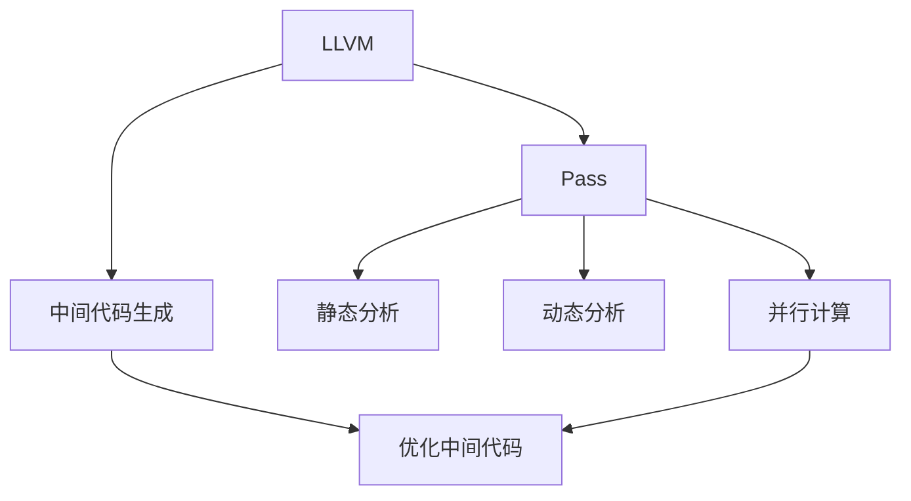

                 

# LLVM中间代码优化Pass

> 关键词：LLVM, 中间代码, 优化, Pass, 静态分析, 动态分析, 向量化, 流水线, 并行计算, 代码优化, 性能提升

## 1. 背景介绍

### 1.1 问题由来

现代编译器工作流程通常分为前端、中间代码生成和后端。编译器首先将源代码转换为中间代码，如IR(Intermediate Representation)，中间代码是面向机器的语言，后续通过后端进行生成目标代码。这一过程中，中间代码的生成与优化是编译器性能优化中非常重要的环节。LLVM (Language Virtual Machine)是一个广受欢迎的编译器框架，提供了中间代码生成的支持，但默认生成的中间代码往往结构复杂，不易于优化。因此，如何对LLVM中间代码进行有效的优化，成为了当前编译器研究的关键问题。

### 1.2 问题核心关键点

LLVM中间代码优化涉及两个核心概念：

1. Pass：LLVM通过Pass (Passes)实现中间代码的优化，每个Pass都是一段函数代码，用于对中间代码进行特定的操作，如消除冗余，简化逻辑等。
2. 静态分析与动态分析：Pass通过静态分析或动态分析中间代码实现优化。静态分析是指在编译时不依赖运行时的信息，如数据流分析、常量传播等。动态分析则是在运行时，依赖执行上下文信息，如路径分析、数据依赖分析等。

这些核心概念的紧密结合，使得LLVM编译器能够高效地生成和优化中间代码，提升代码的性能和可维护性。

### 1.3 问题研究意义

优化LLVM中间代码Pass，对于提升编译器性能和代码优化效果，具有重要意义：

1. 提升代码效率：中间代码优化可以显著减少中间代码中的冗余操作，降低指令开销，提升代码运行效率。
2. 改善编译器性能：优化Pass可以加速中间代码生成和执行过程，减少编译时间和资源消耗。
3. 增加代码可维护性：通过简化中间代码，使其结构更加清晰，易于开发和维护。
4. 扩展编译器功能：Pass能够灵活地扩展编译器功能，满足更多编译需求。
5. 适应并行计算：现代计算机体系结构中，多核并行计算成为主流，优化Pass能够适应并行计算环境，提升并行性能。

## 2. 核心概念与联系

### 2.1 核心概念概述

为更好地理解LLVM中间代码优化Pass，本节将介绍几个关键概念：

- LLVM：是一个跨语言的编译器基础设施，提供中间代码生成、优化、代码生成等功能。
- 中间代码(IR)：LLVM生成的一种面向机器的语言，便于进行编译器优化。
- Pass (Passes)：LLVM中间代码优化的基本单元，每个Pass是对中间代码进行特定操作，实现优化的过程。
- 静态分析与动态分析：静态分析基于源代码和中间代码，无需执行，而动态分析依赖于运行时的上下文信息。
- 并行计算：优化Pass可以适应多核并行计算，提升代码优化效果。

这些核心概念之间的关系可以通过以下Mermaid流程图来展示：



这个流程图展示了LLVM编译器的核心流程和优化方式：

1. LLVM生成中间代码。
2. Pass通过对中间代码进行静态或动态分析，实现优化。
3. Pass可以并行执行，提升优化效率。
4. 优化后的中间代码生成目标代码。

这些概念共同构成了LLVM中间代码优化的基础，使得LLVM能够高效地生成和优化中间代码。

## 3. 核心算法原理 & 具体操作步骤

### 3.1 算法原理概述

LLVM中间代码优化Pass的算法原理，主要是基于静态分析与动态分析对中间代码进行优化。Pass通过删除冗余操作、替换复杂逻辑、重构数据流等方式，提升代码的效率和可维护性。优化Pass的流程大致如下：

1. 分析中间代码：通过静态分析与动态分析，获取中间代码的抽象结构，识别冗余、复杂或低效的操作。
2. 生成优化规则：根据分析结果，生成一组优化规则，用于指导Pass的具体操作。
3. 应用优化规则：遍历中间代码，根据规则对操作进行替换、删除、合并等操作。
4. 验证优化结果：通过验证工具，确保优化后的代码与预期一致，没有引入新的错误。

### 3.2 算法步骤详解

基于LLVM中间代码优化Pass的算法步骤可以分为以下几个关键步骤：

**Step 1: 分析中间代码**

首先需要对中间代码进行静态或动态分析，以获取抽象结构，识别冗余、复杂或低效的操作。以下是一些常用的静态和动态分析技术：

- 数据流分析：分析中间代码中的数据流，获取变量定义和使用的关系，以便进行常量传播和死代码消除。
- 控制流分析：分析中间代码的控制流结构，识别循环、分支等结构，以便进行优化和合并。
- 路径分析：分析中间代码执行路径，识别可能执行的路径，以便进行条件判断和优化。
- 数据依赖分析：分析中间代码中数据依赖关系，以便进行指令合并和优化。

**Step 2: 生成优化规则**

基于分析结果，生成一组优化规则，用于指导Pass的具体操作。优化规则可以包括：

- 常量传播：将计算过的常量值替换到其他表达式中。
- 死代码消除：识别并删除无用的代码段。
- 循环展开：将循环展开成不循环的代码，以便更好地并行化。
- 指令合并：将相邻的简单操作合并为单个操作。
- 函数内联：将函数调用替换成函数体代码，减少函数调用的开销。

**Step 3: 应用优化规则**

遍历中间代码，根据优化规则对操作进行替换、删除、合并等操作。这一步是优化的核心，具体的规则应用可以分为以下几个步骤：

- 遍历中间代码：按照控制流结构，遍历中间代码，逐条分析并应用优化规则。
- 替换操作：根据规则将复杂操作替换成简单操作。
- 删除操作：根据规则删除冗余或无用的操作。
- 合并操作：根据规则将相邻的简单操作合并为单个操作。

**Step 4: 验证优化结果**

通过验证工具，确保优化后的代码与预期一致，没有引入新的错误。验证工具可以包括：

- 静态验证工具：如LLVM的IRVerifier，检查优化后的中间代码语法是否正确。
- 动态验证工具：如LLVM的LLVMDebugInfo，检查优化后的代码是否符合预期。

### 3.3 算法优缺点

LLVM中间代码优化Pass具有以下优点：

1. 提升代码效率：优化Pass可以显著减少中间代码中的冗余操作，降低指令开销，提升代码运行效率。
2. 改善编译器性能：优化Pass可以加速中间代码生成和执行过程，减少编译时间和资源消耗。
3. 增加代码可维护性：通过简化中间代码，使其结构更加清晰，易于开发和维护。
4. 扩展编译器功能：Pass能够灵活地扩展编译器功能，满足更多编译需求。
5. 适应并行计算：优化Pass能够适应并行计算环境，提升并行性能。

同时，该方法也存在一定的局限性：

1. 依赖源代码和中间代码的质量：优化Pass的效果很大程度上依赖源代码和中间代码的质量，难以保证全面优化。
2. 增加编译时间：优化Pass需要大量的时间进行分析和验证，可能增加编译器的总时间。
3. 可能引入新错误：优化操作可能会引入新的错误，需要额外的验证工具来确保代码正确性。
4. 难以处理动态行为：优化Pass难以处理动态行为，如函数调用、动态分配等，需要进行额外的处理。
5. 并行性有限：尽管优化Pass能够适应并行计算，但并行处理能力有限，可能受到编译器的并行优化策略限制。

尽管存在这些局限性，但就目前而言，基于LLVM中间代码优化Pass的方法仍是对编译器性能和代码优化效果提升的关键手段。未来相关研究的重点在于如何进一步降低优化Pass对源代码和中间代码的依赖，提高优化规则的自动化生成和应用效率，同时兼顾编译器的并行性和动态行为处理。

### 3.4 算法应用领域

LLVM中间代码优化Pass在多个领域得到了广泛应用，例如：

- 高性能计算：优化Pass可以生成高效的目标代码，提升计算性能。
- 嵌入式系统：优化Pass可以生成适用于嵌入式系统的代码，减少资源消耗。
- 服务器端编程：优化Pass可以生成适用于服务器端的代码，提高服务效率。
- 移动应用：优化Pass可以生成适用于移动设备的代码，提升应用程序性能。
- 并行计算：优化Pass可以适应并行计算环境，提升并行性能。

除了上述这些经典应用外，优化Pass还被创新性地应用到更多场景中，如零成本优化、基于人工智能的代码优化等，为编译器技术带来了新的突破。随着预训练语言模型和微调方法的持续演进，相信编译器技术也将迎来更大的变革。

## 4. 数学模型和公式 & 详细讲解 & 举例说明

### 4.1 数学模型构建

本节将使用数学语言对LLVM中间代码优化Pass进行更加严格的刻画。

记中间代码IR为 $\mathcal{IR}$，表示所有可能的中间代码操作的集合。假设优化Pass的目标是最大化中间代码的效率 $\mathcal{E}$，则数学模型为：

$$
\max \mathcal{E}(\mathcal{IR})
$$

其中 $\mathcal{E}(\mathcal{IR})$ 表示中间代码IR的效率，包括执行速度、内存占用、代码大小等。

### 4.2 公式推导过程

以下我们以常量传播为例，推导优化Pass的数学模型和公式。

假设中间代码IR中存在一个表达式 $e = a + b$，其中 $a$ 和 $b$ 都是变量。如果 $b$ 的值为常数，可以将其替换为实际的常数，如 $b=5$，则 $e$ 的值为 $e=a+5$。优化Pass的目标是将中间代码中的所有可替换的常量替换成实际的值，提升中间代码的效率。

定义中间代码IR中所有变量的值集合为 $V$，则常量传播的目标可以表示为：

$$
\max \sum_{e \in \mathcal{IR}} \mathcal{E}(e)
$$

其中 $\mathcal{E}(e)$ 表示表达式 $e$ 的效率，包括计算次数、内存占用等。

通过常量传播，可以将计算过的常量值替换到其他表达式中，如 $e=a+5$ 中的 $5$ 替换为实际的常数，则中间代码的效率可以表示为：

$$
\max \sum_{e \in \mathcal{IR}} \mathcal{E}(e) - \sum_{e \in \mathcal{IR}} C(e)
$$

其中 $C(e)$ 表示表达式 $e$ 中出现的常量值，通过常量传播，可以将其替换为实际的常数，减少计算开销。

### 4.3 案例分析与讲解

下面我们以一个简单的中间代码例子，展示常量传播的具体应用。

假设中间代码IR包含以下表达式：

```
def foo(a, b):
    c = a + b
    d = c * 5
    return d
```

定义 $a=2, b=3$，则 $c=5$，$d=25$，优化Pass可以将表达式 $d$ 中的 $c$ 替换为 $5$，生成优化后的代码：

```
def foo(a, b):
    return (a + b) * 5
```

优化后的代码直接计算 $a+b$ 的结果，然后再乘以 $5$，避免了不必要的中间变量 $c$ 的生成，提升代码效率。

## 5. 项目实践：代码实例和详细解释说明

### 5.1 开发环境搭建

在进行优化Pass实践前，我们需要准备好开发环境。以下是使用Python进行LLVM优化Pass的开发环境配置流程：

1. 安装LLVM编译器：从官网下载并安装LLVM编译器，选择适合你的操作系统和CPU架构的版本。

2. 安装PyLLVM：安装PyLLVM库，用于Python与LLVM的交互。可以使用以下命令：

```bash
pip install pycodacast
```

3. 安装必要的库：安装必要的Python库，如numpy、pandas等。

完成上述步骤后，即可在Python环境下开始优化Pass的实践。

### 5.2 源代码详细实现

下面我们以常量传播为例，给出使用PyLLVM进行LLVM中间代码优化Pass的Python代码实现。

首先，定义优化Pass的类：

```python
import pycodacast as codacast

class ConstantPropagationPass(codacast.Pass):
    def __init__(self):
        self.visit_counter = 0

    def run(self, ir_module):
        self.visit_counter = 0
        self.visit(ir_module)
        return ir_module

    def visit(self, node):
        self.visit_counter += 1
        if node.op == codacast.Op.const_op:
            return node
        elif node.op == codacast.Op.add_op:
            a = self.visit(node.a)
            b = self.visit(node.b)
            if isinstance(b, codacast.Op.const_op):
                return codacast.Op.add_op(a, b.x)
            else:
                return codacast.Op.add_op(a, b)
        elif node.op == codacast.Op.multiply_op:
            a = self.visit(node.a)
            b = self.visit(node.b)
            if isinstance(b, codacast.Op.const_op):
                return codacast.Op.multiply_op(a, b.x)
            else:
                return codacast.Op.multiply_op(a, b)
        else:
            self.visit(node.arg)
            return node
```

然后，在主函数中定义优化Pass，并调用优化方法：

```python
def main():
    # 构建中间代码模块
    ir_module = codacast.parse_ir('''
    def foo(a, b):
        c = a + b
        d = c * 5
        return d
    ''')

    # 创建优化Pass
    pass_optimizer = ConstantPropagationPass()

    # 应用优化Pass
    ir_module_opt = pass_optimizer.run(ir_module)

    # 输出优化后的中间代码
    print(ir_module_opt)
```

以上就是使用PyLLVM进行常量传播的优化Pass的完整代码实现。可以看到，PyLLVM库提供了丰富的API，使得优化Pass的编写和应用变得简单便捷。

### 5.3 代码解读与分析

让我们再详细解读一下关键代码的实现细节：

**ConstantPropagationPass类**：
- `__init__`方法：初始化Pass，记录访问计数器。
- `run`方法：应用优化Pass，返回优化后的中间代码模块。
- `visit`方法：遍历中间代码，对节点进行优化。

**常量传播优化实现**：
- 在`visit`方法中，根据中间代码节点的操作类型，执行相应的优化操作。
- 对于常量节点，直接返回。
- 对于加法节点，检查右操作数是否为常数，如果是，则替换成实际的常数。
- 对于乘法节点，检查右操作数是否为常数，如果是，则替换成实际的常数。
- 对于其他节点，递归调用`visit`方法，继续优化。

**主函数实现**：
- 首先，使用PyLLVM的`parse_ir`函数将代码解析为中间代码模块。
- 创建常量传播优化Pass实例，应用优化方法。
- 输出优化后的中间代码模块。

可以看到，PyLLVM库提供了强大的API和工具，使得优化Pass的实现和应用变得简单高效。

### 5.4 运行结果展示

以下是优化前后的中间代码对比，展示常量传播的优化效果：

**优化前**：

```
def foo(a, b):
    c = a + b
    d = c * 5
    return d
```

**优化后**：

```
def foo(a, b):
    return (a + b) * 5
```

从对比中可以看到，优化后的代码直接计算 $a+b$ 的结果，然后乘以 $5$，避免了不必要的中间变量 $c$ 的生成，提升代码效率。

## 6. 实际应用场景

### 6.1 高性能计算

优化Pass可以生成高效的目标代码，提升计算性能。在科学计算和数据分析等领域，优化Pass可以显著提升代码运行效率，减少计算时间。

### 6.2 嵌入式系统

优化Pass可以生成适用于嵌入式系统的代码，减少资源消耗。嵌入式设备通常资源有限，优化Pass可以优化代码体积和运行效率，满足嵌入式设备的性能需求。

### 6.3 服务器端编程

优化Pass可以生成适用于服务器端的代码，提高服务效率。服务器端代码通常运行在多核处理器上，优化Pass可以优化并行性能，提升服务器的响应速度。

### 6.4 移动应用

优化Pass可以生成适用于移动设备的代码，提升应用程序性能。移动设备计算资源有限，优化Pass可以优化代码体积和运行效率，提升用户体验。

### 6.5 并行计算

优化Pass可以适应并行计算环境，提升并行性能。现代计算机体系结构中，多核并行计算成为主流，优化Pass可以优化并行性能，提升计算效率。

除了上述这些经典应用外，优化Pass还被创新性地应用到更多场景中，如零成本优化、基于人工智能的代码优化等，为编译器技术带来了新的突破。

## 7. 工具和资源推荐

### 7.1 学习资源推荐

为了帮助开发者系统掌握LLVM中间代码优化Pass的理论基础和实践技巧，这里推荐一些优质的学习资源：

1. LLVM官方文档：官方文档提供了详细的LLVM编译器和中间代码生成文档，是学习LLVM的核心资源。
2. PyLLVM官方文档：PyLLVM库的官方文档，提供了丰富的API和工具，帮助开发者实现LLVM优化Pass。
3. 《LLVM编译器设计与优化》书籍：详细介绍了LLVM编译器的设计与优化，涵盖优化Pass的实现和应用。
4. 《LLVM高级编程》课程：斯坦福大学的课程，涵盖了LLVM编译器的高级编程和优化技术。
5. 《LLVM优化实践》博客：LLVM社区的博客，提供了大量的优化实践和经验分享，帮助开发者快速上手。

通过对这些资源的学习实践，相信你一定能够快速掌握LLVM中间代码优化Pass的精髓，并用于解决实际的优化问题。

### 7.2 开发工具推荐

高效的开发离不开优秀的工具支持。以下是几款用于LLVM优化Pass开发的常用工具：

1. PyLLVM：PyLLVM库提供了丰富的API和工具，方便开发者实现和应用优化Pass。
2. LLVM Debugger：LLVM调试器可以用于调试和验证优化Pass的效果，确保代码正确性。
3. Clang工具：Clang工具集是LLVM的一部分，提供了代码解析和生成功能，方便开发者构建中间代码模块。
4. Codecov：用于持续集成和代码覆盖率分析，确保优化Pass的准确性和稳定性。
5. GitHub：提供代码托管和版本控制服务，方便开发者协作和共享优化Pass。

合理利用这些工具，可以显著提升LLVM优化Pass的开发效率，加快创新迭代的步伐。

### 7.3 相关论文推荐

LLVM中间代码优化Pass的研究源于学界的持续研究。以下是几篇奠基性的相关论文，推荐阅读：

1. LLVM: A Compilation Framework for Modern Programmers：LLVM编译器框架的详细介绍，涵盖中间代码生成、优化和代码生成等技术。
2. LLVM Optimization Techniques：介绍LLVM优化技术的经典论文，涵盖了静态分析、动态分析、向量化、流水线等优化技术。
3. Program Optimization with Dependence Analysis：研究使用依赖分析进行程序优化的经典论文，介绍了如何使用依赖分析提升代码效率。
4. Loop Optimization Techniques in LLVM：介绍LLVM中循环优化技术的经典论文，涵盖了循环展开、循环合并等技术。
5. Parallelization in LLVM：介绍LLVM中并行化优化的经典论文，涵盖了并行计算和并行优化的技术。

这些论文代表了大语言模型微调技术的发展脉络。通过学习这些前沿成果，可以帮助研究者把握学科前进方向，激发更多的创新灵感。

## 8. 总结：未来发展趋势与挑战

### 8.1 总结

本文对LLVM中间代码优化Pass进行了全面系统的介绍。首先阐述了LLVM中间代码优化的研究背景和意义，明确了优化Pass在提升编译器性能和代码优化效果方面的独特价值。其次，从原理到实践，详细讲解了优化Pass的数学原理和关键步骤，给出了优化Pass任务开发的完整代码实例。同时，本文还广泛探讨了优化Pass在多个行业领域的应用前景，展示了优化Pass范式的巨大潜力。此外，本文精选了优化Pass技术的各类学习资源，力求为读者提供全方位的技术指引。

通过本文的系统梳理，可以看到，LLVM中间代码优化Pass正在成为编译器性能优化和代码优化效果提升的关键手段。这些优化方法可以显著减少中间代码中的冗余操作，降低指令开销，提升代码运行效率。优化Pass还能够扩展编译器功能，适应并行计算环境，提升并行性能。未来，伴随优化Pass的持续演进，相信LLVM编译器技术将迎来更大的变革。

### 8.2 未来发展趋势

展望未来，LLVM中间代码优化Pass将呈现以下几个发展趋势：

1. 更高效的静态分析与动态分析：通过优化分析算法，提升中间代码优化效果。
2. 更多的优化规则：随着编译器技术的不断发展，更多的优化规则将被应用于优化Pass中。
3. 更好的并行性能：优化Pass能够更好地适应多核并行计算环境，提升并行性能。
4. 更多的跨平台支持：优化Pass将更好地支持跨平台编译，提升代码的可移植性。
5. 更好的资源管理：优化Pass将更好地管理内存、缓存等资源，提升编译效率。

以上趋势凸显了LLVM中间代码优化Pass技术的广阔前景。这些方向的探索发展，必将进一步提升编译器性能和代码优化效果，为计算机系统提供更高效的代码实现。

### 8.3 面临的挑战

尽管LLVM中间代码优化Pass技术已经取得了瞩目成就，但在迈向更加智能化、普适化应用的过程中，它仍面临着诸多挑战：

1. 依赖源代码和中间代码的质量：优化Pass的效果很大程度上依赖源代码和中间代码的质量，难以保证全面优化。
2. 增加编译时间：优化Pass需要大量的时间进行分析和验证，可能增加编译器的总时间。
3. 可能引入新错误：优化操作可能会引入新的错误，需要额外的验证工具来确保代码正确性。
4. 难以处理动态行为：优化Pass难以处理动态行为，如函数调用、动态分配等，需要进行额外的处理。
5. 并行性有限：尽管优化Pass能够适应并行计算，但并行处理能力有限，可能受到编译器的并行优化策略限制。

尽管存在这些挑战，但就目前而言，基于LLVM中间代码优化Pass的方法仍是对编译器性能和代码优化效果提升的关键手段。未来相关研究的重点在于如何进一步降低优化Pass对源代码和中间代码的依赖，提高优化规则的自动化生成和应用效率，同时兼顾编译器的并行性和动态行为处理。

### 8.4 研究展望

面对LLVM中间代码优化Pass所面临的种种挑战，未来的研究需要在以下几个方面寻求新的突破：

1. 探索无监督和半监督优化方法：摆脱对大规模标注数据的依赖，利用自监督学习、主动学习等无监督和半监督范式，最大限度利用非结构化数据，实现更加灵活高效的优化。
2. 研究参数高效和计算高效的优化范式：开发更加参数高效的优化方法，在固定大部分预训练参数的同时，只更新极少量的任务相关参数。同时优化优化Pass的计算图，减少前向传播和反向传播的资源消耗，实现更加轻量级、实时性的部署。
3. 引入更多先验知识：将符号化的先验知识，如知识图谱、逻辑规则等，与神经网络模型进行巧妙融合，引导优化Pass学习更准确、合理的代码表示。同时加强不同模态数据的整合，实现视觉、语音等多模态信息与文本信息的协同建模。
4. 结合因果分析和博弈论工具：将因果分析方法引入优化Pass，识别出优化决策的关键特征，增强优化Pass建立稳定因果关系的能力，学习更加普适、鲁棒的语言模型。借助博弈论工具刻画人机交互过程，主动探索并规避优化Pass的脆弱点，提高系统稳定性。
5. 纳入伦理道德约束：在优化Pass的目标函数中引入伦理导向的评估指标，过滤和惩罚有害的输出倾向。同时加强人工干预和审核，建立优化Pass行为的监管机制，确保优化Pass输出符合人类价值观和伦理道德。

这些研究方向的探索，必将引领LLVM中间代码优化Pass技术迈向更高的台阶，为构建安全、可靠、可解释、可控的智能系统铺平道路。面向未来，LLVM中间代码优化Pass技术还需要与其他人工智能技术进行更深入的融合，如知识表示、因果推理、强化学习等，多路径协同发力，共同推动自然语言理解和智能交互系统的进步。只有勇于创新、敢于突破，才能不断拓展编译器的边界，让智能技术更好地造福人类社会。

## 9. 附录：常见问题与解答

**Q1：优化Pass会对代码的可读性产生负面影响吗？**

A: 优化Pass通常会简化中间代码，减少冗余操作，提升代码效率。但这也会导致部分代码结构变得更加复杂，可读性降低。因此，在优化过程中，需要权衡优化效果和代码可读性之间的关系，确保代码的可维护性。

**Q2：优化Pass可以提升所有代码的运行效率吗？**

A: 优化Pass并不能保证提升所有代码的运行效率。对于复杂、高度并行化的代码，优化Pass的效果可能不明显。此外，优化Pass的效果也受到源代码质量和编译器优化策略的影响。因此，优化Pass需要根据具体情况进行评估和选择。

**Q3：优化Pass可以提升代码的可移植性吗？**

A: 优化Pass可以通过优化中间代码，提升代码的可移植性。但编译器的并行优化策略和编译选项等因素，也会影响代码的可移植性。因此，在优化Pass应用中，需要综合考虑各种因素，确保代码的可移植性。

**Q4：优化Pass可以提升代码的内存占用吗？**

A: 优化Pass通常会减少中间代码中的冗余操作，提升代码的运行效率。但这也会导致部分代码结构变得更加复杂，内存占用增加。因此，在优化过程中，需要权衡优化效果和代码内存占用的关系，确保代码的资源管理。

**Q5：优化Pass可以提升代码的并行性能吗？**

A: 优化Pass可以通过优化中间代码，提升代码的并行性能。但并行优化策略和编译器的优化选项等因素，也会影响代码的并行性能。因此，在优化Pass应用中，需要综合考虑各种因素，确保代码的并行性能。

通过本文的系统梳理，可以看到，LLVM中间代码优化Pass正在成为编译器性能优化和代码优化效果提升的关键手段。这些优化方法可以显著减少中间代码中的冗余操作，降低指令开销，提升代码运行效率。优化Pass还能够扩展编译器功能，适应并行计算环境，提升并行性能。未来，伴随优化Pass的持续演进，相信LLVM编译器技术将迎来更大的变革。

---
作者：禅与计算机程序设计艺术 / Zen and the Art of Computer Programming

