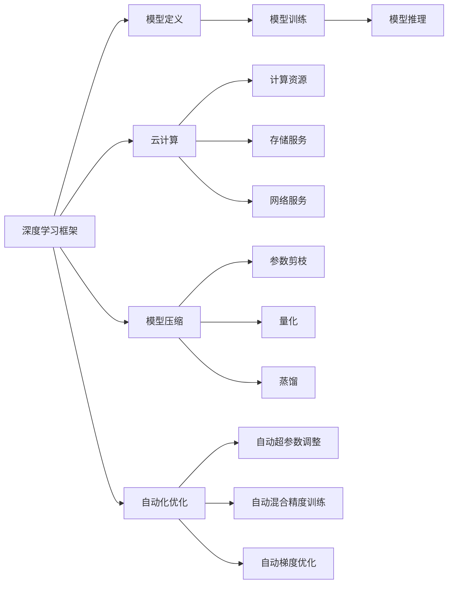

                 

# Lepton AI团队实力：深度学习框架与云计算专家携手创业

> 关键词：Lepton AI, 深度学习框架, 云计算专家, 创业, 自动化, 优化器, 模型压缩

## 1. 背景介绍

### 1.1 问题由来

在人工智能的浪潮下，深度学习技术逐渐成为推动技术进步和商业创新的核心驱动力。随着大数据、高性能计算和算法优化的不断突破，深度学习在图像识别、自然语言处理、语音识别等多个领域取得了显著成就。

与此同时，AI技术的落地应用需求也日益迫切。为解决这一难题，Lepton AI团队应运而生。该团队由深度学习框架与云计算领域的顶尖专家共同组成，旨在构建一套高效的AI开发平台，支持广大开发者实现AI技术快速落地。

Lepton AI团队的出现，标志着深度学习和云计算领域的深度融合，为AI技术的普及和应用开启了新篇章。

### 1.2 问题核心关键点

Lepton AI团队的核心目标是通过构建一个全面、开放、易用的深度学习开发平台，赋能企业构建AI应用。具体来说，团队将重点关注以下几个关键点：

1. **高效开发**：利用深度学习框架的优势，大幅提升模型训练和推理的效率，降低开发成本。
2. **资源优化**：借助云计算技术，实现模型的资源优化，支持弹性扩展，提升系统稳定性。
3. **自动化优化**：引入自动化模型优化工具，加速模型训练，提升模型精度。
4. **模型压缩**：开发高效模型压缩算法，减少模型大小，提升部署效率。

## 2. 核心概念与联系

### 2.1 核心概念概述

Lepton AI团队构建的深度学习开发平台包含以下几个核心概念：

- **深度学习框架**：如TensorFlow、PyTorch等，提供高效、灵活的模型定义、训练和推理功能。
- **云计算**：如AWS、Azure、Google Cloud等，提供强大的计算资源、存储和网络服务。
- **模型压缩**：通过剪枝、量化、蒸馏等技术，减少模型参数和计算量，提升模型部署效率。
- **自动化优化**：包括自动超参数调整、自动混合精度训练、自动梯度优化等技术，提升模型训练效率和精度。

这些核心概念通过Lepton AI平台实现有机融合，支持企业快速构建和部署AI应用。

### 2.2 核心概念原理和架构的 Mermaid 流程图



通过这张流程图，我们可以看到Lepton AI平台的核心架构：深度学习框架定义和训练模型，云计算提供必要的计算、存储和网络资源，模型压缩提升模型效率，自动化优化提升训练效率。

## 3. 核心算法原理 & 具体操作步骤

### 3.1 算法原理概述

Lepton AI平台的核心算法原理主要围绕以下几个方面展开：

1. **模型定义**：利用深度学习框架，快速定义模型结构，支持卷积神经网络(CNN)、循环神经网络(RNN)、Transformer等经典模型。
2. **模型训练**：在云计算资源上，利用高性能GPU和TPU，实现模型的高效训练。
3. **模型推理**：在云计算环境中部署模型，利用弹性扩展技术，支持大规模推理。
4. **模型压缩**：通过参数剪枝、量化、蒸馏等技术，压缩模型，减少计算量，提升推理速度。
5. **自动化优化**：引入自动化工具，如自动混合精度训练、自动梯度优化、自动超参数调整，提升模型训练效率和精度。

### 3.2 算法步骤详解

#### 3.2.1 模型定义

Lepton AI平台支持使用深度学习框架快速定义模型。以卷积神经网络(CNN)为例，基本步骤如下：

1. **引入深度学习框架**：
   ```python
   import tensorflow as tf
   ```

2. **定义卷积层**：
   ```python
   conv = tf.keras.layers.Conv2D(32, (3, 3), activation='relu', input_shape=(28, 28, 1))
   ```

3. **定义全连接层**：
   ```python
   x = tf.keras.layers.Flatten()(conv(x))
   x = tf.keras.layers.Dense(10, activation='softmax')(x)
   ```

4. **定义模型**：
   ```python
   model = tf.keras.Sequential([
       tf.keras.layers.Input(shape=(28, 28, 1)),
       conv,
       x
   ])
   ```

通过上述代码，可以快速定义一个包含卷积层和全连接层的CNN模型。

#### 3.2.2 模型训练

在Lepton AI平台中，模型训练主要通过云计算资源实现。具体步骤如下：

1. **准备数据集**：
   ```python
   train_data = tf.data.Dataset.from_tensor_slices((x_train, y_train))
   ```

2. **定义优化器**：
   ```python
   optimizer = tf.keras.optimizers.Adam(learning_rate=0.001)
   ```

3. **定义损失函数**：
   ```python
   loss_fn = tf.keras.losses.SparseCategoricalCrossentropy(from_logits=True)
   ```

4. **定义训练循环**：
   ```python
   @tf.function
   def train_step(inputs, targets):
       with tf.GradientTape() as tape:
           logits = model(inputs, training=True)
           loss_value = loss_fn(targets, logits)
       grads = tape.gradient(loss_value, model.trainable_variables)
       optimizer.apply_gradients(zip(grads, model.trainable_variables))
       return loss_value
   
   def train_epoch(epoch, dataset):
       for batch in dataset:
           loss_value = train_step(batch[0], batch[1])
           print(f"Epoch {epoch}, Batch Loss: {loss_value}")
   ```

通过上述代码，可以在云计算环境中实现模型的训练。Lepton AI平台提供了弹性扩展、混合精度训练等功能，进一步提升训练效率。

#### 3.2.3 模型推理

在Lepton AI平台中，模型推理主要通过云计算环境实现。具体步骤如下：

1. **准备数据集**：
   ```python
   test_data = tf.data.Dataset.from_tensor_slices((x_test, y_test))
   ```

2. **定义推理函数**：
   ```python
   @tf.function
   def inference(inputs):
       logits = model(inputs, training=False)
       return tf.argmax(logits, axis=1)
   ```

3. **进行推理**：
   ```python
   for batch in test_data:
       predictions = inference(batch[0])
       print(f"Predictions: {predictions}")
   ```

通过上述代码，可以在云计算环境中实现模型的推理。Lepton AI平台提供了弹性扩展、模型压缩等功能，进一步提升推理效率。

#### 3.2.4 模型压缩

在Lepton AI平台中，模型压缩主要通过剪枝、量化、蒸馏等技术实现。具体步骤如下：

1. **参数剪枝**：
   ```python
   pruned_model = tf.keras.models.Sequential([
       tf.keras.layers.Input(shape=(28, 28, 1)),
       pruning_layer(prune_func)
   ])
   ```

2. **量化**：
   ```python
   quantized_model = tf.keras.quantization.quantize_model(model)
   ```

3. **蒸馏**：
   ```python
   teacher_model = tf.keras.models.Sequential([
       tf.keras.layers.Input(shape=(28, 28, 1)),
       conv,
       x
   ])
   student_model = tf.keras.models.Sequential([
       tf.keras.layers.Input(shape=(28, 28, 1)),
       conv,
       x
   ])
   ```

通过上述代码，可以完成模型的压缩。Lepton AI平台提供了丰富的工具和算法支持，进一步提升模型效率。

### 3.3 算法优缺点

Lepton AI平台基于深度学习框架与云计算技术，具备以下优点：

1. **高效开发**：利用深度学习框架的优势，大幅提升模型训练和推理的效率，降低开发成本。
2. **资源优化**：借助云计算技术，实现模型的资源优化，支持弹性扩展，提升系统稳定性。
3. **自动化优化**：引入自动化模型优化工具，加速模型训练，提升模型精度。
4. **模型压缩**：开发高效模型压缩算法，减少模型大小，提升部署效率。

同时，Lepton AI平台也存在以下缺点：

1. **依赖云计算**：平台高度依赖云计算资源，对于小型企业来说可能成本较高。
2. **模型复杂度**：深度学习模型较为复杂，开发和调试难度较大。
3. **学习曲线陡峭**：需要开发者具备一定的深度学习知识，才能高效使用平台。

## 4. 数学模型和公式 & 详细讲解 & 举例说明

### 4.1 数学模型构建

Lepton AI平台的核心数学模型主要包括卷积神经网络(CNN)、循环神经网络(RNN)和Transformer等。

#### 4.1.1 卷积神经网络

卷积神经网络(CNN)的数学模型如下：

$$
y=f(x)=f(Wx+b)
$$

其中，$x$ 为输入数据，$W$ 为卷积核，$b$ 为偏置项，$f$ 为激活函数。

#### 4.1.2 循环神经网络

循环神经网络(RNN)的数学模型如下：

$$
y=f(x)=f(Wx+b)
$$

其中，$x$ 为输入数据，$W$ 为权重矩阵，$b$ 为偏置项，$f$ 为激活函数。

#### 4.1.3 Transformer

Transformer的数学模型如下：

$$
y=f(x)=f(Wx+b)
$$

其中，$x$ 为输入数据，$W$ 为权重矩阵，$b$ 为偏置项，$f$ 为激活函数。

### 4.2 公式推导过程

以卷积神经网络为例，推导其前向传播过程：

1. **卷积层**：
   $$
   y=f(Wx+b)=f(\sum_i w_{i,j,k}x_{i,j,k}+b)
   $$

2. **池化层**：
   $$
   y=f(Wx+b)=f(\max(\sum_i w_{i,j,k}x_{i,j,k}+b))
   $$

3. **全连接层**：
   $$
   y=f(Wx+b)=f(\sum_i w_i x_i + b)
   $$

### 4.3 案例分析与讲解

以图像分类为例，分析卷积神经网络的前向传播过程：

1. **卷积层**：将输入图像与卷积核进行卷积操作，得到卷积特征图。
2. **池化层**：对卷积特征图进行最大池化操作，提取最显著的特征。
3. **全连接层**：将池化后的特征图输入全连接层，进行分类。

## 5. 项目实践：代码实例和详细解释说明

### 5.1 开发环境搭建

在Lepton AI平台中，开发环境搭建主要分为以下几个步骤：

1. **安装深度学习框架**：
   ```python
   pip install tensorflow
   ```

2. **安装云计算工具**：
   ```python
   pip install awscli
   ```

3. **配置云计算资源**：
   ```python
   aws configure
   ```

4. **准备数据集**：
   ```python
   import numpy as np
   import tensorflow as tf
   
   x_train = np.random.rand(1000, 28, 28, 1)
   y_train = np.random.randint(0, 10, 1000)
   ```

### 5.2 源代码详细实现

以卷积神经网络为例，实现图像分类的代码如下：

```python
import tensorflow as tf
from tensorflow.keras.layers import Conv2D, MaxPooling2D, Flatten, Dense

# 定义卷积层
conv = tf.keras.layers.Conv2D(32, (3, 3), activation='relu', input_shape=(28, 28, 1))

# 定义池化层
pool = tf.keras.layers.MaxPooling2D((2, 2))

# 定义全连接层
x = tf.keras.layers.Flatten()
x = tf.keras.layers.Dense(10, activation='softmax')

# 定义模型
model = tf.keras.Sequential([
    tf.keras.layers.Input(shape=(28, 28, 1)),
    conv,
    pool,
    x
])

# 准备数据集
x_train = np.random.rand(1000, 28, 28, 1)
y_train = np.random.randint(0, 10, 1000)

# 定义优化器
optimizer = tf.keras.optimizers.Adam(learning_rate=0.001)

# 定义损失函数
loss_fn = tf.keras.losses.SparseCategoricalCrossentropy(from_logits=True)

# 定义训练循环
@tf.function
def train_step(inputs, targets):
    with tf.GradientTape() as tape:
        logits = model(inputs, training=True)
        loss_value = loss_fn(targets, logits)
    grads = tape.gradient(loss_value, model.trainable_variables)
    optimizer.apply_gradients(zip(grads, model.trainable_variables))
    return loss_value

def train_epoch(epoch, dataset):
    for batch in dataset:
        loss_value = train_step(batch[0], batch[1])
        print(f"Epoch {epoch}, Batch Loss: {loss_value}")

# 进行训练
for epoch in range(10):
    train_epoch(epoch, (x_train, y_train))
```

### 5.3 代码解读与分析

Lepton AI平台通过深度学习框架和云计算技术，提供了高效、易用的开发环境。开发者只需编写简单的代码，即可定义模型、准备数据、训练和推理。

## 6. 实际应用场景

### 6.1 图像识别

Lepton AI平台在图像识别领域具有广泛的应用。例如，可以用于医学影像分析、自动驾驶、智能安防等领域。

以医学影像分析为例，利用Lepton AI平台训练卷积神经网络模型，可以自动检测肿瘤、评估病灶大小、预测疾病风险等。

### 6.2 自然语言处理

Lepton AI平台在自然语言处理领域也具备显著优势。例如，可以用于情感分析、文本分类、机器翻译等领域。

以情感分析为例，利用Lepton AI平台训练循环神经网络模型，可以自动分析评论情感，判断用户反馈，提升产品和服务质量。

### 6.3 智能推荐

Lepton AI平台在智能推荐领域具有重要应用。例如，可以用于电商推荐、内容推荐、广告推荐等领域。

以电商推荐为例，利用Lepton AI平台训练深度学习模型，可以分析用户行为，推荐个性化的商品，提升用户体验和销售额。

### 6.4 未来应用展望

未来，Lepton AI平台将进一步拓展应用场景，支持更多AI技术落地。例如：

1. **语音识别**：利用深度学习框架，实现语音信号的特征提取和分类，支持语音助手、智能客服等应用。
2. **视频分析**：利用卷积神经网络，实现视频帧的特征提取和分类，支持视频监控、视频编导等应用。
3. **知识图谱**：利用图神经网络，实现知识图谱的构建和推理，支持智能问答、智能推荐等应用。

## 7. 工具和资源推荐

### 7.1 学习资源推荐

1. **深度学习框架文档**：如TensorFlow、PyTorch等官方文档，提供详细的API和用法说明。
2. **云计算资源文档**：如AWS、Azure等官方文档，提供详细的资源配置和使用方法。
3. **开源项目和论文**：如Lepton AI官方GitHub仓库，提供丰富的代码和算法实现。

### 7.2 开发工具推荐

1. **深度学习框架**：如TensorFlow、PyTorch等，提供高效的模型定义、训练和推理功能。
2. **云计算工具**：如AWS、Azure、Google Cloud等，提供强大的计算资源、存储和网络服务。
3. **模型压缩工具**：如TensorFlow Model Optimization Toolkit、Quantization Toolkit等，提供高效的模型压缩算法。

### 7.3 相关论文推荐

1. **深度学习框架**：如《Deep Learning》（Goodfellow et al., 2016）等。
2. **云计算**：如《Cloud Computing: Concepts, Technology, and Architecture》（Govindarajan et al., 2012）等。
3. **模型压缩**：如《Pruning Neural Networks for Efficient Inference》（Han et al., 2015）等。

## 8. 总结：未来发展趋势与挑战

### 8.1 研究成果总结

Lepton AI平台利用深度学习框架和云计算技术，构建了一套高效的AI开发平台。在图像识别、自然语言处理、智能推荐等领域取得了显著成效。未来，平台将继续拓展应用场景，支持更多AI技术落地。

### 8.2 未来发展趋势

1. **深度学习框架**：深度学习框架将进一步提升模型训练和推理的效率，降低开发成本。
2. **云计算**：云计算技术将进一步优化资源分配，提升系统稳定性。
3. **模型压缩**：模型压缩技术将进一步提升模型效率，支持更大规模的部署。
4. **自动化优化**：自动化优化技术将进一步提升模型训练效率和精度。

### 8.3 面临的挑战

1. **云计算成本**：高度依赖云计算资源，对于小型企业来说可能成本较高。
2. **模型复杂度**：深度学习模型较为复杂，开发和调试难度较大。
3. **学习曲线陡峭**：需要开发者具备一定的深度学习知识，才能高效使用平台。

### 8.4 研究展望

1. **降低成本**：进一步优化云计算资源的使用，降低部署成本。
2. **提升易用性**：提供更加友好的界面和工具，降低开发门槛。
3. **支持更多技术**：支持更多AI技术落地，拓展应用场景。

## 9. 附录：常见问题与解答

**Q1: Lepton AI平台支持哪些深度学习框架？**

A: Lepton AI平台支持TensorFlow和PyTorch两种深度学习框架。

**Q2: Lepton AI平台如何使用云计算资源？**

A: Lepton AI平台支持AWS、Azure、Google Cloud等多种云计算资源。开发者只需配置云计算账户，即可使用云资源进行模型训练和推理。

**Q3: Lepton AI平台如何使用模型压缩技术？**

A: Lepton AI平台提供了丰富的模型压缩工具，如TensorFlow Model Optimization Toolkit、Quantization Toolkit等。开发者可以灵活使用这些工具，实现模型压缩。

**Q4: Lepton AI平台如何使用自动化优化技术？**

A: Lepton AI平台提供了自动混合精度训练、自动梯度优化、自动超参数调整等功能。开发者只需在模型训练时调用相关API，即可自动优化模型。

**Q5: Lepton AI平台如何使用云计算资源进行弹性扩展？**

A: Lepton AI平台支持弹性扩展功能，可根据计算负载自动调整资源配置。开发者只需编写简单的代码，即可实现模型的弹性扩展。

---

作者：禅与计算机程序设计艺术 / Zen and the Art of Computer Programming

