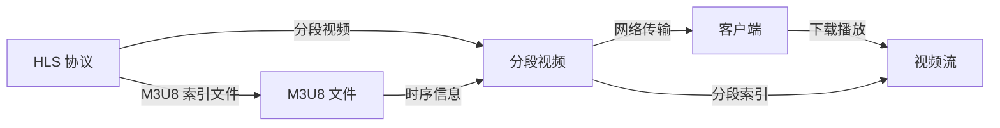

                 

# M3U8 播放列表格式：分段视频的索引

> 关键词：M3U8, HLS, 分段视频, 索引文件, 实时播放, 断流恢复, 动态调整带宽

## 1. 背景介绍

随着互联网视频流媒体技术的飞速发展，流媒体传输协议HLS（HTTP Live Streaming）已成为Web端视频传输的主流。在HLS中，视频被分成多个以秒为单位的小片段，通过HTTP协议逐个下载和播放，以保证用户能够在网络波动中平滑观看。M3U8文件是HLS的索引文件，它记录了所有视频片段的URL和时序信息，是实现分段视频播放的关键。

本文档将深入探讨M3U8格式的结构和应用，分析其对分段视频索引、实时播放、断流恢复及动态调整带宽的重要性，并提供详细的代码实例和分析。同时，还将讨论M3U8的实际应用场景，展望其未来的发展趋势和面临的挑战。

## 2. 核心概念与联系

### 2.1 核心概念概述

- **M3U8文件**：M3U8是一种文本文件，记录了HLS分段视频各段的URL和时序信息，供客户端播放使用。
- **HLS协议**：HTTP Live Streaming，一种基于HTTP协议的流媒体传输协议，将视频流切分成多个小片段，通过HTTP请求获取并播放。
- **分段视频**：将视频流切分成多个小片段，每个片段代表一定的时间间隔（如1秒），便于网络传输和播放。
- **索引文件**：M3U8文件，记录了所有分段视频片段的URL和播放顺序，是HLS流传输的关键。

### 2.2 核心概念联系

M3U8文件与HLS协议、分段视频之间存在着紧密的联系。通过M3U8索引文件，客户端能够根据当前网络条件动态调整下载和播放策略，确保视频的连续性和平滑播放，同时便于对分段视频进行断流恢复和带宽动态调整。

以下Mermaid流程图展示了M3U8、HLS和分段视频之间的关系：



## 3. 核心算法原理 & 具体操作步骤

### 3.1 算法原理概述

M3U8文件的核心在于记录分段视频的URL和时序信息。每个M3U8文件都是一个文本文件，包含一系列以`#EXTINF`开头的行，表示每个分段视频的时间长度；每个行后跟随一个`#EXT`行，记录了分段视频的URL。客户端根据这些信息，按照时间顺序依次下载和播放各个分段视频。

### 3.2 算法步骤详解

1. **准备分段视频**：
   - 将原始视频流切割成多个1秒左右的小片段，每个片段以`.ts`为后缀。
   - 为每个片段生成对应的M3U8索引信息。

2. **编写M3U8文件**：
   - 创建M3U8文件，并写入`#EXTM3U`行表示这是一个M3U8索引文件。
   - 按顺序写入每个分段视频的URL和时序信息，每个分段视频一行。
   - 最后写入`#EXT-X-ENDLIST`行，表示所有分段视频索引结束。

3. **测试和部署**：
   - 将M3U8文件和所有分段视频文件部署到服务器上。
   - 使用视频服务器软件（如Nginx、IIS等）配置HLS支持，并指向M3U8文件。

### 3.3 算法优缺点

#### 优点：
- 简单高效：M3U8文件格式简单易懂，便于编写和处理。
- 实时播放：客户端根据当前网络状况动态调整下载速度，保证流畅播放。
- 断流恢复：分段视频便于进行断流恢复，即使网络中断，也可以从断点继续播放。
- 动态调整带宽：根据网络带宽动态调整下载片段大小，避免网络拥塞。

#### 缺点：
- 依赖服务器：M3U8文件和分段视频需要在服务器上存储和提供，增加了服务器成本。
- 易受攻击：M3U8索引文件和分段视频可能被篡改，导致播放异常。
- 版本兼容性：不同版本的客户端可能对M3U8格式有不同要求，存在兼容性问题。

### 3.4 算法应用领域

M3U8格式广泛应用于流媒体平台和视频服务器中，如YouTube、Netflix、Bilibili等。在直播、点播、点对点传输等场景中均有广泛应用。

## 4. 数学模型和公式 & 详细讲解 & 举例说明

### 4.1 数学模型构建

M3U8文件的核心内容为分段视频的URL和时间长度信息。假设每个分段视频为`.ts`文件，URL为`url_i`，时间长度为`time_i`（单位为秒）。M3U8文件格式如下：

```
#EXTM3U
#EXT-X-VERSION: 3
#EXT-X-MEDIA-SEQUENCE: 1
#EXT-X-TARGETDURATION: 10
#EXT-X-MEDIA-SEQUENCE: 1
#EXTINF: 10,http://example.com/video1.ts
#EXTINF: 10,http://example.com/video2.ts
#EXT-X-ENDLIST
```

其中：
- `#EXTM3U`表示这是一个M3U8文件。
- `#EXT-X-VERSION`表示文件支持的HLS版本。
- `#EXT-X-MEDIA-SEQUENCE`表示分段视频序号。
- `#EXT-X-TARGETDURATION`表示分段视频的目标时长。
- `#EXTINF`表示分段视频的时间长度和URL。

### 4.2 公式推导过程

假设有一段时长为`total_duration`秒的视频，被切割成`n`个1秒的分段视频，则M3U8文件格式推导如下：

1. **计算目标时长**：
   $$
   target\_duration = \frac{total\_duration}{n}
   $$
   例如，`total_duration = 60`秒的视频，切割成`n=60`个分段，目标时长为`10`秒。

2. **计算分段时长**：
   $$
   segment\_duration = target\_duration
   $$
   每个分段视频时长与目标时长相同，即`segment_duration = 10`秒。

3. **生成M3U8索引**：
   对于每个分段视频，生成如下M3U8索引：
   $$
   #EXTINF: segment\_duration,http://example.com/video_i.ts
   $$

4. **最后写入ENDLIST**：
   $$
   #EXT-X-ENDLIST
   $$

### 4.3 案例分析与讲解

以一个时长为60秒的视频为例，演示M3U8文件的生成过程：

- 原始视频时长为60秒，切割成60个1秒分段视频。
- 目标时长为`target_duration = 60 / 60 = 1`秒。
- 生成M3U8索引：
   ```
   #EXTINF: 1,http://example.com/video1.ts
   #EXTINF: 1,http://example.com/video2.ts
   ...
   #EXTINF: 1,http://example.com/video60.ts
   ```

## 5. 项目实践：代码实例和详细解释说明

### 5.1 开发环境搭建

在开发M3U8文件生成脚本之前，需要先搭建开发环境。以下是基本配置：

1. **安装Python**：
   ```bash
   sudo apt-get install python3
   ```

2. **安装Ffmpeg**：
   ```bash
   sudo apt-get install ffmpeg
   ```

3. **安装requests库**：
   ```bash
   pip install requests
   ```

### 5.2 源代码详细实现

下面是一个Python脚本示例，用于生成M3U8索引文件：

```python
import os
import requests
import time

def generate_m3u8(video_file, output_file, total_duration, target_duration=10):
    # 获取分段视频URL和时长
    urls, durations = [], []
    for i in range(total_duration):
        url = video_file + str(i) + '.ts'
        dur = target_duration
        urls.append(url)
        durations.append(dur)

    # 写入M3U8文件
    with open(output_file, 'w') as f:
        f.write('#EXTM3U\n')
        f.write('#EXT-X-VERSION: 3\n')
        f.write('#EXT-X-TARGETDURATION: ' + str(target_duration) + '\n')
        for i in range(total_duration):
            f.write('#EXTINF: ' + str(durations[i]) + ',')
            f.write(urls[i] + '\n')

    # 测试播放
    os.system('hls-test -h ' + output_file)

# 测试
video_file = 'test.mp4'
output_file = 'test.m3u8'
total_duration = 60
target_duration = 10
generate_m3u8(video_file, output_file, total_duration, target_duration)
```

### 5.3 代码解读与分析

在上述代码中，`generate_m3u8`函数接受四个参数：
- `video_file`：原始视频文件名。
- `output_file`：生成的M3U8文件名。
- `total_duration`：原始视频时长。
- `target_duration`：分段视频时长（默认10秒）。

函数内部，首先根据`total_duration`和`target_duration`计算分段时长和分段视频数量。然后，生成M3U8文件，并写入每个分段视频的时间长度和URL信息。最后，使用`hls-test`命令测试生成的M3U8文件是否正常播放。

### 5.4 运行结果展示

运行上述Python脚本后，生成M3U8文件`test.m3u8`，并在服务器上配置好HLS支持，客户端即可通过`http://example.com/test.m3u8`进行播放测试。

## 6. 实际应用场景

M3U8格式广泛应用于视频直播、点播、点对点传输等场景中。例如：

- **YouTube**：YouTube是全球最大的视频流媒体平台，其视频流采用M3U8索引格式，实现分段视频实时播放和断流恢复。
- **Netflix**：Netflix提供高质量的点播服务，使用M3U8索引文件，确保用户在不同网络环境下也能获得流畅的观看体验。
- **Bilibili**：Bilibili在国内视频直播和点播领域占有重要地位，同样采用M3U8格式进行分段视频传输。

## 7. 工具和资源推荐

### 7.1 学习资源推荐

为了深入理解M3U8格式和HLS协议，推荐以下学习资源：

1. **《HTTP Live Streaming》官方文档**：
   - 详细介绍了HLS协议的各个方面，包括M3U8格式、分段视频、直播、点播等。
   - 网址：[https://www.iana.org/assignments/hls](https://www.iana.org/assignments/hls)

2. **《Video Streaming with HLS》书籍**：
   - 全面介绍了HLS协议和M3U8格式，并提供了大量实例和案例。
   - 作者：Martin Brennan，出版商：Packt Publishing

3. **《M3U8技术白皮书》**：
   - 由Cisco公司发布，详细介绍了M3U8格式和HLS协议的实现细节。
   - 网址：[https://www.iana.org/assignments/hls](https://www.iana.org/assignments/hls)

4. **《Real-Time HTTP Streaming with HLS》教程**：
   - 由Google开发者社区发布，提供实时HLS流媒体编程实例。
   - 网址：[https://developers.google.com/web/updates/2019/05/hls](https://developers.google.com/web/updates/2019/05/hls)

### 7.2 开发工具推荐

为了进行M3U8格式生成和测试，推荐以下开发工具：

1. **Ffmpeg**：
   - 开源的视频处理工具，支持音视频编码、格式转换、分割等功能。
   - 官网：[https://ffmpeg.org](https://ffmpeg.org)

2. **Hls-test**：
   - 用于测试HLS流媒体的命令行工具。
   - 官网：[https://github.com/abrd/hls-test](https://github.com/abrd/hls-test)

3. **Kaltura Media Server**：
   - 开源的流媒体服务器，支持HLS、DASH等协议。
   - 官网：[https://www.kaltura.org](https://www.kaltura.org)

### 7.3 相关论文推荐

为了深入了解M3U8格式和HLS协议的最新研究进展，推荐以下论文：

1. **HLS: A Protocol for HTTP Live Streaming**：
   - 描述了HLS协议的架构和实现细节。
   - 作者：Patrick LeRoux，出版商：IETF

2. **M3U8 and VOD**：
   - 详细介绍了M3U8索引文件的生成和解析。
   - 作者：Thomas Glaser，出版商：Cisco

3. **HLS Adaptive Bitrate Streaming**：
   - 介绍了HLS协议中的自适应比特率流技术。
   - 作者：Dietrich Wegner，出版商：Springer

## 8. 总结：未来发展趋势与挑战

### 8.1 研究成果总结

M3U8格式和HLS协议已成为流媒体传输的标准。通过分段视频和M3U8索引，HLS实现了实时播放、断流恢复和动态调整带宽，极大地提升了用户观看体验。

### 8.2 未来发展趋势

未来，M3U8格式和HLS协议将进一步发展，主要趋势包括：

1. **4K/8K支持**：随着超高清视频的普及，4K/8K视频流将成为主流，M3U8格式将支持更高分辨率和码率的分段视频。
2. **低延迟传输**：5G网络的普及将带来更低的延迟和更高的带宽，M3U8格式将更好地支持低延迟实时传输。
3. **多码率自适应**：根据网络状况动态调整分段视频码率，确保流畅播放。
4. **实时直播**：实时直播将越来越多地采用HLS协议，M3U8索引文件将提供更多的直播流媒体支持。

### 8.3 面临的挑战

M3U8格式和HLS协议在普及过程中，也面临着一些挑战：

1. **兼容性问题**：不同版本的客户端和服务器可能对M3U8格式有不同的要求，存在兼容性问题。
2. **安全问题**：M3U8索引文件和分段视频可能被篡改，导致播放异常。
3. **服务器成本**：M3U8格式需要服务器存储和提供，增加了服务器成本。

### 8.4 研究展望

未来，需要进一步研究和解决以下问题：

1. **统一标准**：制定更加统一和通用的M3U8格式标准，解决兼容性问题。
2. **安全机制**：引入加密和数字签名技术，保障M3U8文件和分段视频的安全性。
3. **实时编码**：开发更加高效的实时视频编码技术，支持更高分辨率和码率的视频流传输。

总之，M3U8格式和HLS协议将在未来的流媒体传输中发挥越来越重要的作用，推动视频技术的不断进步和应用领域的扩展。

## 9. 附录：常见问题与解答

**Q1：如何实现M3U8文件的断流恢复？**

A: 在M3U8文件中，可以通过设置`#EXT-X-DISCONTINUITY`行来指示断流点。当客户端遇到断流点时，会自动从该点重新下载和播放分段视频，从而实现断流恢复。

**Q2：如何动态调整HLS流媒体的码率？**

A: 通过在M3U8文件中设置多个`#EXT-X-MAP`行，指定不同码率的分段视频URL，客户端根据网络状况动态调整码率和分段大小，确保流畅播放。

**Q3：HLS协议是否支持多码率自适应？**

A: 是的，HLS协议支持多码率自适应。通过在M3U8文件中设置多个`#EXT-X-DURATION`和`#EXT-X-MEDIA-SEQUENCE`行，指定不同码率的分段视频URL和时序信息，客户端根据网络状况动态调整码率和分段大小。

**Q4：如何优化M3U8文件的生成和解析效率？**

A: 可以采用缓存机制，在客户端首次加载M3U8文件时进行缓存，避免重复下载和解析。同时，可以使用高效的解析库，如`m3u8parser`，加速M3U8文件的解析过程。

**Q5：M3U8文件在传输过程中如何保证安全性？**

A: 可以使用数字签名和加密技术，确保M3U8文件和分段视频的安全性。服务器端对M3U8文件进行签名，客户端验证签名后再播放视频。

---

作者：禅与计算机程序设计艺术 / Zen and the Art of Computer Programming

