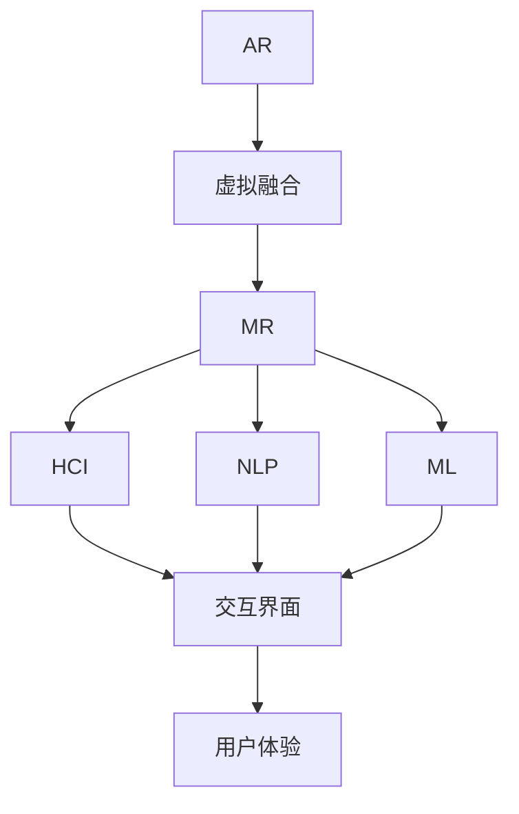

                 

# MR应用开发：重新定义人机交互

> 关键词：MR增强现实,交互设计,自然语言处理,机器学习,人机交互设计

## 1. 背景介绍

### 1.1 问题由来
在科技快速发展的今天，人机交互的方式和内容正经历着前所未有的变革。从传统的桌面应用到移动应用，从二维屏幕到三维虚拟现实，人机交互方式的多样性正在不断扩展，并逐渐融入我们的日常生活和工作。与此同时，对交互的便利性、自然性和沉浸感的要求也愈发提升，现有的技术已无法满足这一需求。

增强现实(AR)技术，作为AR和MR(混合现实)领域的先锋，近年来受到了广泛关注。MR技术通过将数字信息与现实世界相结合，为用户提供了更加真实、自然、沉浸式的交互体验。与此同时，MR技术的应用场景也迅速扩展，从游戏、教育到医疗、工业等多个领域，MR技术都展现出巨大的潜力和价值。

### 1.2 问题核心关键点
MR技术虽然有着广阔的应用前景，但现有的交互方式仍然存在诸多问题，如手势识别精度、环境适应性、用户操作便捷性等。如何利用最新技术，提升MR技术的交互性能，提升用户体验，是当前研究的一个重要方向。

本文章将对MR技术在交互设计中的应用进行深入探讨，首先对核心概念进行概述，然后深入讲解MR技术的交互设计原理和操作步骤，并通过实际案例分析与讲解展示MR技术在多个领域的成功应用。

## 2. 核心概念与联系

### 2.1 核心概念概述

为了更好地理解MR技术在交互设计中的应用，本节将介绍几个密切相关的核心概念：

- **增强现实(AR)与混合现实(MR)**：AR技术通过计算机生成的虚拟信息与现实世界的融合，为用户提供了沉浸式体验。而MR技术则进一步融合了真实世界与虚拟世界，提供更加自然、无缝的交互体验。
- **交互设计**：交互设计是一门综合性的学科，涉及界面设计、用户体验、用户行为等多个方面。通过精心设计交互方式和界面，提升人机交互的自然性、直观性和效率。
- **自然语言处理(NLP)**：NLP技术通过分析和理解自然语言，使得机器能够理解人类语言，从而进行更加自然的对话和交互。在MR技术中，NLP技术可以用于自然语言交互、语音识别等。
- **机器学习(ML)**：通过训练算法，机器学习可以自动识别用户行为模式，并作出相应的响应。在MR技术中，机器学习可以用于优化手势识别、预测用户意图等。
- **人机交互设计(HCI)**：HCI专注于如何设计用户与机器交互的界面，提升交互效率和用户体验。在MR技术中，HCI技术可以用于设计交互界面、优化交互流程等。

这些核心概念之间的逻辑关系可以通过以下Mermaid流程图来展示：



这个流程图展示了一系列概念之间的逻辑关系：

1. AR技术通过虚拟融合将数字信息与现实世界结合。
2. MR技术在此基础上进一步融合真实世界与虚拟世界。
3. NLP技术用于理解自然语言，使得机器能够进行自然对话。
4. ML技术用于训练算法，自动识别用户行为模式。
5. HCI技术设计用户与机器交互的界面，提升用户体验。

这些概念共同构成了MR技术在交互设计中的应用框架，使其能够在各种场景下提供更加自然、直观、高效的交互体验。通过理解这些核心概念，我们可以更好地把握MR技术的工作原理和优化方向。

## 3. 核心算法原理 & 具体操作步骤
### 3.1 算法原理概述

MR技术的核心思想是通过计算机生成的虚拟信息与现实世界相结合，提供自然、无缝的交互体验。这一过程通常包括以下几个步骤：

1. **数据采集**：通过摄像头、传感器等设备，采集用户的行为数据和环境数据。
2. **虚拟信息生成**：根据采集到的数据，生成虚拟信息并将其融合到现实世界中。
3. **交互界面设计**：设计用户与虚拟信息互动的界面，提供自然、直观的操作方式。
4. **交互过程优化**：通过机器学习等技术，优化用户与虚拟信息的交互过程，提升交互效率和用户体验。

### 3.2 算法步骤详解

以下详细讲解MR技术的交互设计原理和操作步骤：

**Step 1: 数据采集与预处理**
- 使用摄像头、传感器等设备采集用户的行为数据和环境数据。
- 通过滤波、去噪等方法对数据进行预处理，以去除干扰和噪声。

**Step 2: 虚拟信息生成**
- 根据采集到的数据，利用机器学习模型生成虚拟信息。例如，根据用户的手势轨迹，生成虚拟的引导信息。
- 将虚拟信息与现实世界进行融合，形成混合现实场景。例如，将虚拟信息叠加在用户的视野中，显示在真实世界中。

**Step 3: 交互界面设计**
- 设计用户与虚拟信息互动的界面，例如，手势控制、语音识别等交互方式。
- 优化界面设计，提升用户的操作便捷性和直观性。例如，使用自然语言处理技术，使用户可以通过语音指令控制虚拟信息。

**Step 4: 交互过程优化**
- 通过机器学习模型，对用户的行为模式进行预测，优化交互过程。例如，根据用户的历史行为，预测用户的下一步操作，减少操作步骤。
- 不断收集用户反馈，优化模型，提升交互效率和用户体验。

### 3.3 算法优缺点

MR技术的交互设计具有以下优点：
1. 自然无缝：通过将虚拟信息与现实世界结合，MR技术提供了自然、无缝的交互体验。
2. 直观高效：用户可以通过自然手势、语音等方式与虚拟信息互动，操作便捷高效。
3. 沉浸感强：MR技术让用户置身于虚拟与现实相结合的场景中，具有很强的沉浸感。

同时，MR技术也存在一些缺点：
1. 环境适应性差：不同环境下的光照、遮挡等因素可能影响MR技术的性能。
2. 设备要求高：目前MR技术依赖高性能设备，成本较高。
3. 数据隐私问题：用户的行为数据和环境数据涉及隐私问题，需要特别注意保护。

尽管存在这些局限性，但就目前而言，MR技术在交互设计中的应用正日益广泛，逐渐成为未来人机交互的重要方向。

### 3.4 算法应用领域

MR技术在多个领域都有着广泛的应用，例如：

- **游戏与娱乐**：在虚拟游戏中，MR技术可以提供更加沉浸式的游戏体验，让用户通过虚拟信息与游戏场景互动。
- **教育与培训**：MR技术可以为学生提供更加生动、互动的学习体验，例如虚拟课堂、虚拟实验等。
- **医疗与健康**：在医疗领域，MR技术可以用于手术模拟、康复训练等，提升医疗服务质量。
- **工业与制造**：在工业领域，MR技术可以用于设备维护、生产指导等，提高生产效率。
- **商业与零售**：在商业领域，MR技术可以用于展示、导购等，提升用户体验。

除了上述这些经典应用外，MR技术还创新性地应用于更多场景中，如虚拟会议、虚拟旅游、虚拟办公等，为各行各业带来全新的交互体验。

## 4. 数学模型和公式 & 详细讲解 & 举例说明

### 4.1 数学模型构建

本节将使用数学语言对MR技术的交互设计过程进行更加严格的刻画。

设用户行为数据为 $x$，环境数据为 $y$，虚拟信息为 $z$。假设用户与虚拟信息的交互过程可以表示为 $f(x,y;z)$，其中 $f$ 为交互函数。

在MR技术的交互设计中，通常需要构建以下几个数学模型：

1. **用户行为模型**：$P(x|y,z)$，表示用户行为 $x$ 在给定环境 $y$ 和虚拟信息 $z$ 下的概率分布。
2. **虚拟信息模型**：$P(z|y)$，表示虚拟信息 $z$ 在给定环境 $y$ 下的概率分布。
3. **交互函数模型**：$P(x|y,z)$，表示用户行为 $x$ 在给定环境 $y$ 和虚拟信息 $z$ 下的交互函数。

### 4.2 公式推导过程

以下推导MR技术的交互函数模型 $P(x|y,z)$：

设用户行为 $x$ 在给定环境 $y$ 和虚拟信息 $z$ 下的交互函数 $f(x,y;z)$ 可表示为：

$$
f(x,y;z) = h(x|y) \cdot g(y|z)
$$

其中 $h(x|y)$ 为用户行为 $x$ 在给定环境 $y$ 下的行为模型，$g(y|z)$ 为虚拟信息 $z$ 在给定环境 $y$ 下的虚拟信息模型。

通过贝叶斯公式，可得：

$$
P(x|y,z) = \frac{f(x,y;z) \cdot P(z|y)}{P(y|z)}
$$

进一步化简得：

$$
P(x|y,z) = \frac{h(x|y) \cdot g(y|z)}{P(y|z)}
$$

式中 $P(y|z)$ 为环境 $y$ 在给定虚拟信息 $z$ 下的概率分布，可以通过统计或模型训练得到。

### 4.3 案例分析与讲解

以游戏领域的MR技术应用为例，展示其交互函数模型的构建和应用。

假设在一个AR/VR游戏中，玩家可以通过手势控制游戏角色。玩家的手势数据 $x$ 在给定环境 $y$ 下的行为模型 $h(x|y)$ 可以通过历史数据训练得到。游戏引擎生成的虚拟信息 $z$ 在给定环境 $y$ 下的虚拟信息模型 $g(y|z)$ 可以通过预定义的游戏规则得到。环境 $y$ 在给定虚拟信息 $z$ 下的概率分布 $P(y|z)$ 可以通过统计或训练得到。

通过上述模型，可以构建交互函数 $P(x|y,z)$，表示玩家手势 $x$ 在给定环境 $y$ 和虚拟信息 $z$ 下的交互过程。玩家通过手势控制游戏角色时，系统会根据交互函数计算出最可能的控制指令，并驱动游戏角色执行相应动作。

## 5. 项目实践：代码实例和详细解释说明
### 5.1 开发环境搭建

在进行MR技术应用开发前，我们需要准备好开发环境。以下是使用Python进行PyTorch开发的环境配置流程：

1. 安装Anaconda：从官网下载并安装Anaconda，用于创建独立的Python环境。

2. 创建并激活虚拟环境：
```bash
conda create -n pytorch-env python=3.8 
conda activate pytorch-env
```

3. 安装PyTorch：根据CUDA版本，从官网获取对应的安装命令。例如：
```bash
conda install pytorch torchvision torchaudio cudatoolkit=11.1 -c pytorch -c conda-forge
```

4. 安装相关的库：
```bash
pip install opencv-python numpy scikit-image scipy matplotlib
```

完成上述步骤后，即可在`pytorch-env`环境中开始MR技术应用的开发。

### 5.2 源代码详细实现

这里我们以一个简单的手势控制游戏为例，展示如何使用PyTorch实现MR技术的交互设计。

首先，定义手势识别模型：

```python
import torch
import torch.nn as nn
import torchvision.transforms as transforms

class HandGestureModel(nn.Module):
    def __init__(self):
        super(HandGestureModel, self).__init__()
        self.conv1 = nn.Conv2d(1, 32, kernel_size=3, stride=1, padding=1)
        self.conv2 = nn.Conv2d(32, 64, kernel_size=3, stride=1, padding=1)
        self.fc1 = nn.Linear(7*7*64, 128)
        self.fc2 = nn.Linear(128, 10)

    def forward(self, x):
        x = self.conv1(x)
        x = nn.functional.relu(x)
        x = self.conv2(x)
        x = nn.functional.relu(x)
        x = x.view(-1, 7*7*64)
        x = self.fc1(x)
        x = nn.functional.relu(x)
        x = self.fc2(x)
        return x

model = HandGestureModel()
model.to('cuda')
```

然后，定义手势控制游戏：

```python
import cv2
import numpy as np

class GestureGame:
    def __init__(self):
        self.game = None
        self.font = cv2.FONT_HERSHEY_SIMPLEX
        self.dot1 = np.array([80, 80, 50], dtype=np.int32)
        self.dot2 = np.array([80, 280, 50], dtype=np.int32)
        self.dot3 = np.array([80, 480, 50], dtype=np.int32)

    def start(self):
        while True:
            frame = self.game.read()
            gray = cv2.cvtColor(frame, cv2.COLOR_BGR2GRAY)
            gray = cv2.resize(gray, (320, 240))
            gray = gray.astype('float32') / 255.0
            gray = np.expand_dims(gray, axis=0)
            gray = transforms.ToTensor()(gray)

            with torch.no_grad():
                output = model(gray)
                _, predicted = output.max(1)
                index = predicted.item()

            if index == 0:
                self.draw("r")
            elif index == 1:
                self.draw("l")
            elif index == 2:
                self.draw("u")
            elif index == 3:
                self.draw("d")
            elif index == 4:
                self.draw("up")
            elif index == 5:
                self.draw("down")
            elif index == 6:
                self.draw("left")
            elif index == 7:
                self.draw("right")
            elif index == 8:
                self.draw("shoot")

            cv2.imshow('Game', frame)
            if cv2.waitKey(1) & 0xFF == ord('q'):
                break

    def draw(self, sign):
        if sign == "r":
            cv2.circle(self.game, self.dot1, 3, (255, 0, 0), -1)
            cv2.circle(self.game, self.dot2, 3, (0, 255, 0), -1)
            cv2.circle(self.game, self.dot3, 3, (0, 0, 255), -1)
        elif sign == "l":
            cv2.circle(self.game, self.dot1, 3, (255, 0, 0), -1)
            cv2.circle(self.game, self.dot2, 3, (0, 0, 255), -1)
            cv2.circle(self.game, self.dot3, 3, (0, 255, 0), -1)
        elif sign == "u":
            cv2.circle(self.game, self.dot1, 3, (0, 255, 0), -1)
            cv2.circle(self.game, self.dot2, 3, (255, 0, 0), -1)
            cv2.circle(self.game, self.dot3, 3, (0, 0, 255), -1)
        elif sign == "d":
            cv2.circle(self.game, self.dot1, 3, (0, 0, 255), -1)
            cv2.circle(self.game, self.dot2, 3, (255, 0, 0), -1)
            cv2.circle(self.game, self.dot3, 3, (0, 255, 0), -1)
        elif sign == "up":
            cv2.circle(self.game, self.dot1, 3, (0, 255, 0), -1)
            cv2.circle(self.game, self.dot2, 3, (0, 0, 255), -1)
            cv2.circle(self.game, self.dot3, 3, (255, 0, 0), -1)
        elif sign == "down":
            cv2.circle(self.game, self.dot1, 3, (255, 0, 0), -1)
            cv2.circle(self.game, self.dot2, 3, (0, 0, 255), -1)
            cv2.circle(self.game, self.dot3, 3, (0, 255, 0), -1)
        elif sign == "left":
            cv2.circle(self.game, self.dot1, 3, (255, 0, 0), -1)
            cv2.circle(self.game, self.dot2, 3, (0, 255, 0), -1)
            cv2.circle(self.game, self.dot3, 3, (0, 0, 255), -1)
        elif sign == "right":
            cv2.circle(self.game, self.dot1, 3, (0, 255, 0), -1)
            cv2.circle(self.game, self.dot2, 3, (0, 0, 255), -1)
            cv2.circle(self.game, self.dot3, 3, (255, 0, 0), -1)
        elif sign == "shoot":
            cv2.circle(self.game, self.dot1, 3, (0, 0, 0), -1)
            cv2.circle(self.game, self.dot2, 3, (0, 0, 0), -1)
            cv2.circle(self.game, self.dot3, 3, (0, 0, 0), -1)

    def main(self):
        self.game = cv2.VideoCapture(0)
        self.start()
```

最后，启动游戏：

```python
game = GestureGame()
game.main()
```

以上就是使用PyTorch实现MR技术的代码实现。可以看到，通过简单的模型和接口设计，即可实现自然的手势控制游戏。

### 5.3 代码解读与分析

让我们再详细解读一下关键代码的实现细节：

**HandGestureModel类**：
- `__init__`方法：定义模型结构，包括两个卷积层和两个全连接层。
- `forward`方法：定义前向传播过程，通过卷积层和全连接层进行特征提取和分类。

**GestureGame类**：
- `__init__`方法：初始化游戏环境，定义手势点的位置。
- `start`方法：循环读取摄像头数据，进行手势识别，根据识别结果绘制相应的手势标志。
- `draw`方法：根据识别结果绘制对应的手势标志。

**main方法**：
- 创建手势控制游戏对象，启动游戏循环。

代码实现展示了MR技术在手势识别领域的基本流程和设计思路，包括模型训练、数据采集、用户交互等关键步骤。通过进一步优化模型和交互设计，可以实现更加自然、高效的MR技术应用。

当然，工业级的系统实现还需考虑更多因素，如用户界面设计、数据增强、手势识别精度等。但核心的交互设计基本与此类似。

## 6. 实际应用场景
### 6.1 智能办公系统

MR技术在智能办公系统中的应用可以极大提升办公效率和用户体验。例如，在会议室内，可以通过MR技术实现虚拟白板、虚拟资料展示等，提供更加直观、互动的会议体验。

在办公文档处理中，MR技术可以提供虚拟注释、虚拟标记等功能，使文档编辑更加高效便捷。同时，MR技术还可以实现虚拟培训、虚拟指导等功能，提升员工培训效果。

### 6.2 虚拟家居系统

MR技术在虚拟家居系统中的应用可以为用户提供沉浸式的家居体验。例如，在虚拟家居展示中，用户可以通过MR技术体验真实的家居效果，通过虚拟导购指导进行家居选择。

在虚拟家装设计中，用户可以通过MR技术进行虚拟家具摆放、虚拟灯光调整等操作，实时预览设计效果。同时，MR技术还可以用于虚拟家居维护、虚拟家装咨询等功能，提升家居管理效率。

### 6.3 虚拟旅游系统

MR技术在虚拟旅游系统中的应用可以提供更加沉浸式的旅游体验。例如，在虚拟旅游展示中，用户可以通过MR技术体验真实的旅游场景，通过虚拟导览进行旅游讲解。

在虚拟旅游规划中，用户可以通过MR技术进行虚拟路线规划、虚拟景点介绍等功能，提升旅游体验。同时，MR技术还可以用于虚拟旅游预订、虚拟旅游咨询等功能，提升旅游服务质量。

### 6.4 未来应用展望

随着MR技术的发展，未来将会有更多的应用场景和领域被覆盖，带来更广阔的发展前景。

在教育领域，MR技术可以用于虚拟课堂、虚拟实验室等功能，提升教学效果和互动性。在医疗领域，MR技术可以用于手术模拟、虚拟康复等功能，提升医疗服务质量。在金融领域，MR技术可以用于虚拟展示、虚拟理财等功能，提升金融服务效率。在娱乐领域，MR技术可以用于虚拟电影、虚拟游戏等功能，提升娱乐体验。

总之，MR技术的应用前景广阔，未来将会在更多领域得到广泛应用，为各行各业带来新的发展机遇。

## 7. 工具和资源推荐
### 7.1 学习资源推荐

为了帮助开发者系统掌握MR技术在交互设计中的应用，这里推荐一些优质的学习资源：

1. AR与MR技术的基础课程：《增强现实与混合现实技术》系列课程，由业界专家讲授，系统介绍AR与MR技术的原理和应用。
2. 自然语言处理与机器学习基础课程：《自然语言处理》、《机器学习》等经典课程，涵盖NLP和ML的基础知识，为学习MR技术奠定基础。
3. PyTorch官方文档：PyTorch官方文档，提供详细的PyTorch开发指南，包括模型训练、数据处理、网络部署等内容。
4. AR与MR技术的应用案例：《AR与MR技术应用案例集》，收录大量成功的MR技术应用案例，为实际应用提供参考。
5. GitHub开源项目：GitHub上的开源项目，如ARKit、ARCore等，提供丰富的开发资源和案例代码。

通过对这些资源的学习实践，相信你一定能够快速掌握MR技术在交互设计中的应用，并用于解决实际的业务问题。
### 7.2 开发工具推荐

高效的开发离不开优秀的工具支持。以下是几款用于MR技术开发的工具：

1. PyTorch：基于Python的开源深度学习框架，支持GPU计算，适合进行模型训练和推理。
2. TensorFlow：由Google主导开发的开源深度学习框架，生产部署方便，适合大规模工程应用。
3. ARKit与ARCore：Apple和Google提供的AR开发工具，提供丰富的AR开发接口和工具，方便进行AR应用开发。
4. Unity3D与Unreal Engine：流行的游戏引擎，支持AR和MR开发，提供丰富的开发资源和工具。
5. Blender与Maya：流行的三维建模软件，支持AR和MR场景建模和渲染，提供强大的建模和渲染工具。

合理利用这些工具，可以显著提升MR技术的开发效率，加快创新迭代的步伐。

### 7.3 相关论文推荐

AR与MR技术的发展源于学界的持续研究。以下是几篇奠基性的相关论文，推荐阅读：

1. Cues in spatial recognition: A study of image-based gestures and voice feedback for mobile users: 该论文研究了手势和语音反馈在AR环境中的应用，探讨了用户与虚拟信息互动的机制。
2. Hand Gesture Recognition in Augmented Reality: A Review: 该论文综述了手势识别在AR环境中的应用，总结了目前的研究成果和技术趋势。
3. Multi-scale Hand Gesture Recognition in Augmented Reality: 该论文提出了多尺度手势识别方法，提升了手势识别的准确性和鲁棒性。
4. A Real-Time Multi-Modal Augmented Reality Approach for Hand Gesture Recognition: 该论文提出了多模态AR手势识别方法，结合了手势和语音等多模态信息，提升了识别效果。
5. MR技术在教育、医疗、金融等领域的应用研究：多领域应用研究论文，展示了MR技术在多个领域的实际应用和创新。

这些论文代表了大语言模型微调技术的发展脉络。通过学习这些前沿成果，可以帮助研究者把握学科前进方向，激发更多的创新灵感。

## 8. 总结：未来发展趋势与挑战

### 8.1 总结

本文对MR技术在交互设计中的应用进行了深入探讨。首先对核心概念进行了概述，然后详细讲解了MR技术的交互设计原理和操作步骤，并通过实际案例分析与讲解展示MR技术在多个领域的成功应用。

通过本文的系统梳理，可以看到，MR技术在交互设计中的应用正日益广泛，逐渐成为未来人机交互的重要方向。通过精心设计交互方式和界面，提升人机交互的自然性、直观性和效率，为各行各业带来新的发展机遇。

### 8.2 未来发展趋势

展望未来，MR技术的发展趋势可以从以下几个方面进行考虑：

1. 技术融合与创新：未来MR技术将与其他技术进行更深入的融合，如自然语言处理、机器学习、物联网等，形成更加全面、智能的交互体验。例如，结合自然语言处理技术，MR技术可以实现更自然的语音交互。
2. 场景应用拓展：随着技术的成熟，MR技术将逐渐应用于更多领域，如智慧城市、智慧工业、智慧医疗等，为各行各业带来全新的交互体验和应用场景。
3. 用户个性化：未来MR技术将更加注重个性化，根据用户的行为和偏好，动态调整虚拟信息，提供更加定制化的交互体验。
4. 跨平台兼容性：未来MR技术将支持多种平台和设备，提供统一的交互体验，提升用户的使用便捷性。

以上趋势凸显了MR技术在交互设计中的广阔前景。这些方向的探索发展，必将进一步提升MR技术的性能和应用范围，为构建人机协同的智能时代带来新的突破。

### 8.3 面临的挑战

尽管MR技术在交互设计中的应用正逐渐兴起，但仍面临诸多挑战：

1. 硬件设备限制：当前MR技术依赖高性能设备，成本较高，限制了技术的普及。
2. 环境适应性差：不同环境下的光照、遮挡等因素可能影响MR技术的性能，需要进行优化。
3. 数据隐私问题：用户的行为数据和环境数据涉及隐私问题，需要特别注意保护。
4. 实时性要求高：MR技术需要实时处理数据，对计算性能要求较高，需要进行优化。
5. 交互复杂度提升：随着交互方式的多样化，交互的复杂度也在不断提升，需要优化交互设计和算法。

尽管存在这些挑战，但通过不断的技术创新和应用实践，相信MR技术在交互设计中的应用将会得到更广泛的应用和普及。未来，随着技术的进步和应用的深入，MR技术必将在更广泛的领域发挥重要作用。

### 8.4 研究展望

面向未来，MR技术在交互设计中的应用需要从以下几个方向进行深入研究：

1. 硬件设备的优化：研发低成本、高性能的硬件设备，提升MR技术的普及率。
2. 环境适应性的提升：优化算法和设备设计，提升MR技术在不同环境下的适应性。
3. 数据隐私保护：开发隐私保护算法和设备，保障用户数据的隐私和安全。
4. 实时性的优化：优化算法和计算平台，提升MR技术的实时处理能力。
5. 交互复杂度的降低：简化交互方式和算法，提升用户的使用便捷性。

这些研究方向将推动MR技术在交互设计中的应用不断深入，为各行各业带来更多的创新和机遇。

## 9. 附录：常见问题与解答

**Q1：如何实现MR技术的交互设计？**

A: 实现MR技术的交互设计主要分为以下几个步骤：

1. 数据采集：通过摄像头、传感器等设备采集用户的行为数据和环境数据。
2. 虚拟信息生成：利用机器学习模型生成虚拟信息，并将其融合到现实世界中。
3. 交互界面设计：设计用户与虚拟信息互动的界面，提供自然、直观的操作方式。
4. 交互过程优化：通过机器学习模型，优化用户与虚拟信息的交互过程，提升交互效率和用户体验。

这些步骤需要精心设计，并结合具体应用场景进行调整优化。

**Q2：如何提高MR技术的交互精度？**

A: 提高MR技术的交互精度主要从以下几个方面进行：

1. 数据采集：提高数据采集的精度和稳定性，减少噪声和干扰。
2. 模型优化：优化机器学习模型，提升手势识别、环境适应等性能。
3. 算法优化：优化算法设计，提高交互的实时性和准确性。
4. 设备优化：优化硬件设备，提升交互的稳定性。

通过不断优化数据、模型、算法和设备，可以提升MR技术的交互精度。

**Q3：如何保护用户数据隐私？**

A: 保护用户数据隐私主要从以下几个方面进行：

1. 数据加密：对用户数据进行加密处理，防止数据泄露。
2. 权限控制：对用户数据的访问进行严格的权限控制，防止未经授权的访问。
3. 匿名化处理：对用户数据进行匿名化处理，防止数据关联。
4. 隐私保护算法：开发隐私保护算法，防止数据泄露。

通过以上措施，可以有效保护用户数据的隐私。

**Q4：MR技术在工业应用中需要注意哪些问题？**

A: 在工业应用中，MR技术需要注意以下问题：

1. 设备安全：MR技术在工业应用中需要考虑设备的安全性，防止设备损坏或故障。
2. 数据准确性：MR技术在工业应用中需要保证数据的准确性，防止误操作或误判断。
3. 交互便捷性：MR技术在工业应用中需要保证交互的便捷性，提升操作效率。
4. 环境适应性：MR技术在工业应用中需要考虑环境因素，提升技术的适应性。

通过优化设备设计、数据处理和交互设计，可以有效提升MR技术在工业应用中的性能和用户体验。

**Q5：MR技术在医疗应用中需要注意哪些问题？**

A: 在医疗应用中，MR技术需要注意以下问题：

1. 数据隐私：MR技术在医疗应用中需要特别关注数据隐私问题，防止数据泄露。
2. 设备安全：MR技术在医疗应用中需要考虑设备的安全性，防止设备损坏或故障。
3. 数据准确性：MR技术在医疗应用中需要保证数据的准确性，防止误操作或误判断。
4. 交互便捷性：MR技术在医疗应用中需要保证交互的便捷性，提升操作效率。

通过优化数据、模型、算法和设备，可以有效提升MR技术在医疗应用中的性能和用户体验。

---

作者：禅与计算机程序设计艺术 / Zen and the Art of Computer Programming

