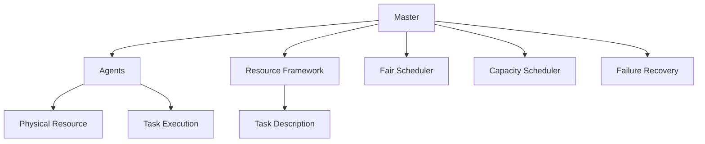

                 

# Mesos原理与代码实例讲解

> 关键词：
- Mesos
- 分布式资源管理器
- 资源分配
- 故障容错
- 集群管理
- 性能优化
- 可扩展性
- 多云资源管理
- 微服务架构

## 1. 背景介绍

### 1.1 问题由来

随着云计算和容器技术的快速发展，越来越多的企业开始依赖云平台来部署和管理其应用。然而，在云平台上运行的应用程序需要面临资源管理、调度、故障恢复、多租户隔离等一系列复杂问题，这对云服务提供商和用户都提出了极大的挑战。

为了解决这些问题，Apache Mesos于2010年被提出。Mesos是一个开源分布式资源管理器，它提供了一种可扩展的、高性能的、容错的分布式资源调度解决方案。通过Mesos，云平台可以自动化管理底层资源，实现任务调度、资源隔离和故障恢复等功能，大大提高了云平台的可靠性和可维护性。

## 2. 核心概念与联系

### 2.1 核心概念概述

Mesos由两个主要组件组成：Master和Agents。Master负责资源管理和调度，接收任务提交请求并根据资源需求进行资源分配。Agents负责物理资源的存储和运行，向Master汇报自身可用资源情况，执行Master下达的任务。

Mesos使用资源框架(RF)来描述不同资源的特性，如CPU、内存、磁盘等。每个任务描述中包含所需资源的需求和优先级，Master根据资源框架和任务需求进行资源分配，确保任务能够在可用资源上高效运行。

Mesos还引入了多种资源分配策略，如公平调度(Fair Scheduler)、容量优化(Capacity Scheduler)和动态容错(Failure Recovery)等，以应对不同场景下的资源管理和调度需求。

### 2.2 核心概念原理和架构的 Mermaid 流程图



该图展示了Mesos的核心组件及其之间的联系：Master负责管理资源和任务调度，Agents提供物理资源和执行任务，Resource Framework描述了不同资源的特性，Task Description描述了任务需求，Master根据不同策略进行资源分配，Agents向Master汇报可用资源并执行任务。

## 3. 核心算法原理 & 具体操作步骤

### 3.1 算法原理概述

Mesos的资源分配算法基于两种基本策略：基于轮询的公平调度和基于容量优化的调度。公平调度算法通过轮流分配资源来确保每个任务都有公平的机会获取所需资源。容量优化算法则根据资源需求和当前可用资源情况，动态调整任务优先级和资源分配策略。

Mesos还引入了动态容错机制，当某个Agent出现故障时，Master会自动将运行在该Agent上的任务迁移到其他健康的Agent上，确保应用的高可用性。

### 3.2 算法步骤详解

Mesos的资源分配步骤如下：

1. **任务提交**：用户或应用程序通过Mesos客户端向Master提交任务。
2. **资源请求**：Master根据任务描述中的资源需求，查询可用资源。
3. **资源分配**：Master根据资源框架和分配策略，分配资源并通知Agents。
4. **任务执行**：Agents在分配到的物理资源上启动任务执行。
5. **资源监控**：Master和Agents持续监控资源使用情况和任务执行状态，进行必要的调整和故障恢复。

Mesos还提供了丰富的扩展机制，支持多种资源框架和调度策略。用户可以通过编写自定义的资源框架和调度策略，灵活应对不同场景下的资源管理和调度需求。

### 3.3 算法优缺点

Mesos的优点在于：

- 高效资源管理：通过基于轮询的公平调度和基于容量优化的调度算法，可以高效地管理底层资源。
- 灵活扩展性：支持多种资源框架和调度策略，满足不同应用场景的需求。
- 动态容错：通过自动任务迁移，实现高可用性。

Mesos的缺点在于：

- 复杂的配置：需要配置多种资源框架和调度策略，增加系统复杂性。
- 较低的吞吐量：在资源需求动态变化的情况下，容错机制和调度算法可能导致较低的资源利用率和吞吐量。

### 3.4 算法应用领域

Mesos广泛应用于云计算、大数据、机器学习等领域的资源管理。它支持多种主流平台，如Amazon Web Services、Microsoft Azure、Google Cloud Platform等，为各种大规模分布式系统的资源管理和调度提供了高效、可靠的解决方案。

## 4. 数学模型和公式 & 详细讲解 & 举例说明

### 4.1 数学模型构建

Mesos的资源分配模型基于资源框架(RF)和任务描述。资源框架描述了不同资源的特性，如CPU、内存、磁盘等，任务描述则描述了任务所需的资源需求和优先级。

Mesos使用向量表示资源需求和优先级，如下所示：

$$
\text{Resource Demand} = \left( \begin{matrix}
C_1 & C_2 & \cdots & C_n \\
p_1 & p_2 & \cdots & p_n \\
\end{matrix} \right)
$$

其中，$C_i$ 表示任务i所需的第i种资源需求，$p_i$ 表示任务i的优先级。

### 4.2 公式推导过程

Mesos的资源分配算法基于以下几个关键公式：

1. **公平调度公式**：

$$
\text{Fair Scheduler} = \frac{\text{Resource Demand}}{\text{Resource Capacity}} \times \text{Reserve}
$$

其中，$\text{Resource Capacity}$ 表示当前可用的资源，$\text{Reserve}$ 表示预留资源。公平调度算法通过轮流分配资源，确保每个任务都有公平的机会获取所需资源。

2. **容量优化公式**：

$$
\text{Capacity Scheduler} = \frac{\text{Resource Demand}}{\text{Resource Capacity}} \times \text{Priority}
$$

其中，$\text{Priority}$ 表示任务的优先级。容量优化算法根据资源需求和当前可用资源情况，动态调整任务优先级和资源分配策略。

3. **故障恢复公式**：

$$
\text{Failure Recovery} = \text{Failover}(\text{Task Failure})
$$

其中，$\text{Failover}$ 表示故障迁移操作，$\text{Task Failure}$ 表示任务失败事件。故障恢复算法通过自动迁移任务到其他健康的Agents上，实现高可用性。

### 4.3 案例分析与讲解

假设某云平台上有三个任务需要执行，每个任务所需的资源需求和优先级如下：

| Task  | CPU | Memory | Disk | Priority |
|-------|-----|--------|------|----------|
| Task1 | 2   | 4      | 0    | 1        |
| Task2 | 1   | 2      | 0    | 2        |
| Task3 | 3   | 3      | 2    | 3        |

资源框架定义如下：

- CPU：4个物理CPU
- Memory：16GB内存
- Disk：10TB硬盘

假设Master采用公平调度算法进行资源分配。首先，Master将资源按比例分配给每个任务，计算结果如下：

- Task1：分配2个CPU、4GB内存、0GB硬盘
- Task2：分配1个CPU、2GB内存、0GB硬盘
- Task3：分配3个CPU、3GB内存、2GB硬盘

在执行过程中，Task1和Task2运行正常，而Task3由于某种原因发生故障。Master检测到故障后，自动将Task3迁移到一个健康的Agents上，确保应用的高可用性。

## 5. 项目实践：代码实例和详细解释说明

### 5.1 开发环境搭建

要使用Mesos进行项目实践，首先需要搭建开发环境。以下是搭建开发环境的详细步骤：

1. 安装Mesos和Zookeeper：从官网下载安装Mesos和Zookeeper软件包，并解压安装。

2. 配置Mesos和Zookeeper：编辑Mesos和Zookeeper的配置文件，修改IP、端口等参数。

3. 启动Mesos和Zookeeper：在终端执行启动命令，启动Mesos和Zookeeper服务。

4. 安装Mesos客户端：在本地机器上安装Mesos客户端，如Mesos CLI或Mesos UI。

### 5.2 源代码详细实现

以下是一个简单的Mesos客户端代码示例，用于提交任务并监控任务状态：

```python
from mesos.proto import task_pb2, mesos_pb2, resource_pb2
from mesos.proto import TaskState

def submit_task(scheduler, num_cpus, num_gpus, num_mbs):
    task = task_pb2.Task()
    task.name = 'My Task'
    task.driver_user_name = 'root'
    task.data = []
    resource = resource_pb2.Resource()
    resource.name = 'cpus'
    resource.num cpus = num_cpus
    task.resources.append(resource)
    resource = resource_pb2.Resource()
    resource.name = 'gpus'
    resource.num cpus = num_gpus
    task.resources.append(resource)
    resource = resource_pb2.Resource()
    resource.name = 'mem'
    resource.bytes = num_mbs * 1024 * 1024
    task.resources.append(resource)
    scheduler.submit(task)

def get_task_state(scheduler, task_id):
    task = scheduler.get_task(task_id)
    state = TaskState(task)
    return state

def monitor_task(scheduler):
    tasks = scheduler.get_tasks()
    for task in tasks:
        state = get_task_state(scheduler, task.task_id)
        print(state.state)

# 创建Mesos客户端
scheduler = MesosClient()

# 提交任务
submit_task(scheduler, 2, 0, 8)

# 监控任务状态
monitor_task(scheduler)
```

### 5.3 代码解读与分析

该代码示例展示了如何通过Mesos客户端提交任务并监控任务状态。具体步骤如下：

1. **创建Mesos客户端**：使用MesosClient类创建Mesos客户端对象。
2. **提交任务**：使用submit_task函数提交任务，指定所需的资源需求。
3. **监控任务状态**：使用monitor_task函数监控任务状态，获取任务状态信息并打印输出。

该代码示例仅为一个简单示例，实际应用中，还需要考虑任务执行情况、资源监控、故障恢复等更多因素。

### 5.4 运行结果展示

运行上述代码，将会看到任务提交后和执行过程中的状态变化。例如，任务提交后，Mesos会返回任务ID和资源ID，表示任务已经提交。执行过程中，可以通过Mesos UI或Mesos CLI获取任务状态，查看任务是否正常执行。

## 6. 实际应用场景

### 6.1 智能运维平台

智能运维平台通过集成Mesos，实现了资源自动化管理和任务调度，大大降低了运维成本。平台支持多种应用程序，如Web服务器、数据库、分布式缓存等，根据不同的资源需求进行资源分配和故障恢复，确保应用的高可用性和稳定性。

### 6.2 大规模数据处理系统

大规模数据处理系统，如Hadoop、Spark等，通过集成Mesos，实现了高效的任务调度和资源管理。Mesos可以自动分配和释放资源，确保数据处理任务能够在可用资源上高效执行，同时支持任务故障恢复，确保数据处理的可靠性。

### 6.3 机器学习平台

机器学习平台通过集成Mesos，实现了机器学习任务的自动化调度和资源管理。Mesos可以根据任务需求动态调整资源分配，确保机器学习模型能够在可用资源上高效运行，同时支持任务故障恢复，确保模型的稳定性和可用性。

### 6.4 未来应用展望

未来，随着云计算和大数据技术的进一步发展，Mesos的应用场景将更加广泛。以下是一些未来应用展望：

1. 多云资源管理：Mesos可以支持多种云平台资源管理，实现跨云平台的资源统一调度和管理。
2. 微服务架构：Mesos可以支持微服务架构的应用部署和管理，实现服务自动化调度和资源优化。
3. 容器化部署：Mesos可以支持容器化应用的管理和调度，提高应用的部署效率和资源利用率。

## 7. 工具和资源推荐

### 7.1 学习资源推荐

为了帮助开发者深入理解Mesos原理和实践，以下是一些推荐的资源：

1. Mesos官方文档：Mesos官方提供的详细文档，包含Mesos的安装、配置、使用等详细信息。

2. Apache Mesos Cookbook：一本介绍Mesos实战应用的书籍，提供丰富的实践案例和最佳实践。

3. Mesos for Production：一本介绍Mesos生产部署的书籍，包含Mesos的架构、性能优化和故障恢复等实战技巧。

4. Mesos大规模分布式系统：一本介绍Mesos架构和实现的书籍，深入讲解Mesos的原理和设计思路。

5. Mesos社区和博客：Mesos社区和开发者博客，提供最新的Mesos动态、案例分享和开发经验。

### 7.2 开发工具推荐

Mesos使用多种工具进行开发和部署，以下是一些推荐的工具：

1. Mesos CLI：Mesos官方提供的命令行工具，支持Mesos的任务提交、状态监控等功能。

2. Mesos UI：Mesos官方提供的Web界面，可以方便地监控Mesos集群状态和任务执行情况。

3. Marathon：Apache Mesos提供的任务调度器，支持多种任务类型和资源需求。

4. Marathon-on-Google：Marathon在Google云上的部署版本，支持自动扩缩容和资源优化。

5. Marathon-on-AWS：Marathon在AWS云上的部署版本，支持自动扩缩容和跨云资源管理。

### 7.3 相关论文推荐

以下是几篇关于Mesos的知名论文，推荐阅读：

1. "Apache Mesos: A Framework for Everyday Generalized Resource Orchestration"：介绍Mesos的基本原理和架构设计。

2. "The Consistent Machine Allocation Problem in Cloud Computing: a MapReduce perspective"：讨论Mesos在MapReduce系统中的优化方案。

3. "An Analysis of Resource Allocation Strategies in Apache Mesos"：分析了Mesos的资源分配策略和性能优化方案。

4. "Modeling and Analysis of resource-allocation algorithms for cloud computing"：介绍资源分配算法的理论模型和性能分析。

5. "A Performance Study of the Fair Scheduler in Apache Mesos"：对Mesos公平调度算法的性能进行评测和优化。

通过学习这些论文，可以深入理解Mesos的原理和实现细节，掌握其核心技术和应用场景。

## 8. 总结：未来发展趋势与挑战

### 8.1 总结

Mesos作为开源分布式资源管理器，提供了一种高效、可扩展的资源管理和调度解决方案，广泛应用于云计算、大数据、机器学习等多个领域。通过Mesos，用户可以自动化管理底层资源，实现任务调度、资源隔离和故障恢复等功能，大大提高了系统的可靠性和可维护性。

本文详细介绍了Mesos的核心概念和实现原理，并给出了代码实例，帮助开发者深入理解Mesos的原理和实践。

### 8.2 未来发展趋势

未来，Mesos将呈现以下几个发展趋势：

1. 更高效的任务调度：随着云计算和大数据技术的进一步发展，Mesos将引入更多的任务调度算法，提高任务调度的效率和资源利用率。
2. 更丰富的资源管理：Mesos将支持更多类型的资源管理，如GPU、TPU、对象存储等，满足更多应用场景的需求。
3. 更强大的故障恢复：Mesos将引入更强大的故障恢复机制，支持更细粒度的任务迁移和资源优化。
4. 更全面的性能监控：Mesos将引入更全面的性能监控工具，帮助用户实时监控系统状态和性能指标，优化系统性能。

### 8.3 面临的挑战

尽管Mesos已经在分布式资源管理和调度领域取得了显著进展，但仍面临一些挑战：

1. 复杂的配置：Mesos需要配置多种资源框架和调度策略，增加了系统复杂性。
2. 较低的吞吐量：在资源需求动态变化的情况下，容错机制和调度算法可能导致较低的资源利用率和吞吐量。
3. 可扩展性限制：Mesos在大规模集群部署时，可能面临扩展性的限制。

### 8.4 研究展望

针对Mesos面临的挑战，未来的研究需要在以下几个方面寻求新的突破：

1. 简化配置和部署：开发更易于配置和部署的工具和框架，降低用户的使用门槛。
2. 优化调度算法：研究更高效的调度算法，提高任务调度和资源分配的效率和性能。
3. 提高资源利用率：研究更优化的资源管理策略，提高资源利用率和系统吞吐量。
4. 增强可扩展性：研究更高效的集群扩展方案，支持更大规模的集群部署和管理。

## 9. 附录：常见问题与解答

**Q1：Mesos如何保证任务的高可用性？**

A: Mesos通过动态容错机制实现任务的高可用性。当某个Agent出现故障时，Master会自动将运行在该Agent上的任务迁移到其他健康的Agent上，确保应用的高可用性。

**Q2：Mesos的资源分配算法有哪些？**

A: Mesos提供了多种资源分配算法，包括公平调度算法和容量优化算法。公平调度算法通过轮流分配资源，确保每个任务都有公平的机会获取所需资源。容量优化算法根据资源需求和当前可用资源情况，动态调整任务优先级和资源分配策略。

**Q3：如何优化Mesos的性能？**

A: 优化Mesos性能的方法包括：
1. 优化配置：合理配置Mesos的资源框架和调度策略，确保资源分配和调度效率。
2. 动态调整：根据任务需求和系统负载动态调整资源分配策略，提高资源利用率。
3. 故障恢复：合理设置故障容错机制，确保任务在故障发生后能够快速恢复。
4. 性能监控：实时监控系统状态和性能指标，及时发现和解决问题。

**Q4：Mesos的扩展性如何？**

A: Mesos在大规模集群部署时，可能面临扩展性的限制。为了提高扩展性，Mesos支持集群扩展方案，支持多节点和多数据中心的资源管理和调度。此外，用户还可以使用多种扩展工具和框架，如Marathon、Hadoop等，增强Mesos的可扩展性。

通过深入理解Mesos的原理和实践，并不断优化配置和算法，可以最大限度地发挥Mesos的性能和可靠性，满足各种应用场景的需求。

---

作者：禅与计算机程序设计艺术 / Zen and the Art of Computer Programming

