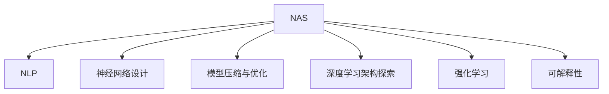

                 

# NAS技术在自然语言处理中的实践

> 关键词：
1. NAS（神经架构搜索）
2. 自然语言处理（NLP）
3. 神经网络设计
4. 模型压缩与优化
5. 深度学习架构探索
6. 强化学习
7. 可解释性

## 1. 背景介绍

### 1.1 问题由来

随着深度学习技术的飞速发展，自然语言处理（NLP）领域的神经网络模型日益复杂，模型结构的选择和设计成为影响模型性能的关键因素之一。传统的经验调参方法已无法满足现代大规模深度学习模型需求，亟需一种更加智能、高效的设计方法。

NAS（神经架构搜索）技术应运而生，通过自动化算法生成或搜索最优神经网络架构，显著提高了深度学习模型的设计效率和性能。其在NLP领域的应用，特别是在大规模语言模型（如BERT、GPT等）的优化和压缩中，表现出显著的优势。

### 1.2 问题核心关键点

NAS技术在NLP中的应用，主要体现在以下几个方面：

- **自动化神经网络架构设计**：通过搜索算法自动发现最优的神经网络结构，避免人为调参的繁琐过程。
- **模型压缩与优化**：寻找最合适的模型压缩方案，减少模型参数量，提升推理速度。
- **硬件资源优化**：自动调整网络架构以适应不同的硬件资源，优化模型在特定硬件上的性能。
- **可解释性增强**：自动生成可解释性高的模型架构，便于理解模型决策过程。

### 1.3 问题研究意义

NAS技术在NLP领域的应用，具有以下几个重要意义：

1. **提升模型设计效率**：自动化的架构搜索显著减少了模型设计的时间成本和人力成本，加速了模型迭代和优化进程。
2. **改善模型性能**：通过优化的模型结构和参数配置，提升模型的精度和泛化能力。
3. **降低资源消耗**：自动化设计能够更好地适配特定硬件资源，减少能源和空间消耗。
4. **增强模型可解释性**：自动生成的可解释性高的模型结构，有助于研究人员理解和调试模型。
5. **推动产业应用**：NLP领域的创新技术，如智能客服、金融舆情监测、个性化推荐等，通过NAS优化后能够更快实现落地应用。

## 2. 核心概念与联系

### 2.1 核心概念概述

为更好地理解NAS技术在NLP中的应用，本节将介绍几个密切相关的核心概念：

- **NAS（神经架构搜索）**：通过搜索算法寻找最优神经网络架构的过程，目的是自动化设计高性能深度学习模型。
- **NLP（自然语言处理）**：涉及文本数据的生成、理解、分析和生成，是人工智能的重要应用领域之一。
- **神经网络设计**：包括网络结构、激活函数、损失函数等关键组件的选择和组合。
- **模型压缩与优化**：通过剪枝、量化、蒸馏等方法减少模型大小和计算量。
- **深度学习架构探索**：在深度学习领域中探索更高效的模型架构，提高模型性能和可解释性。
- **强化学习**：通过试错和奖励机制，优化神经网络结构。
- **可解释性**：模型输出的可解释性，有助于理解模型的决策过程。

这些核心概念之间的逻辑关系可以通过以下Mermaid流程图来展示：



这个流程图展示了大语言模型的核心概念及其之间的关系：

1. NAS通过搜索算法寻找最优神经网络架构，支持NLP模型设计。
2. 神经网络设计包括网络结构、激活函数、损失函数等，是NAS的核心组件。
3. 模型压缩与优化通过剪枝、量化、蒸馏等方法减少模型大小和计算量。
4. 深度学习架构探索在深度学习领域中探索更高效的模型架构，提高模型性能和可解释性。
5. 强化学习通过试错和奖励机制，优化神经网络结构。
6. 可解释性关注模型输出的可解释性，有助于理解模型的决策过程。

这些概念共同构成了NAS在大语言模型中的应用框架，使其能够在大规模语言模型中发挥显著的作用。

## 3. 核心算法原理 & 具体操作步骤

### 3.1 算法原理概述

NAS在NLP中的应用，主要基于强化学习算法。通过构建搜索空间、定义奖励函数和搜索策略，自动发现最优的神经网络架构。NAS的原理如下：

1. **构建搜索空间**：定义所有可能的神经网络组件（如层数、节点数、激活函数等），形成一个搜索空间。
2. **定义奖励函数**：定义一个奖励函数，衡量候选架构的性能（如精度、计算速度等）。
3. **搜索策略**：通过算法在搜索空间中搜索最优架构，如贝叶斯优化、遗传算法、蒙特卡罗树搜索等。
4. **评估和选择**：对候选架构进行评估，选择最优架构作为最终模型。

在NLP领域，NAS技术可以应用于模型设计、模型压缩、硬件适配等环节，提升模型性能和应用效率。

### 3.2 算法步骤详解

NAS在NLP中的应用，主要包括以下几个关键步骤：

**Step 1: 构建搜索空间**

- **层数和节点数**：定义神经网络的层数和每层节点数，进行搜索空间。
- **激活函数**：定义激活函数类型，如ReLU、Tanh等。
- **损失函数**：定义损失函数类型，如交叉熵、均方误差等。
- **正则化**：定义正则化类型，如L1正则、Dropout等。

**Step 2: 定义奖励函数**

- **精度和速度**：设计奖励函数，衡量模型在任务上的精度和计算速度。
- **泛化能力**：衡量模型在不同数据集上的泛化能力。
- **可解释性**：衡量模型输出的可解释性，如使用特征重要性评估等。

**Step 3: 搜索策略**

- **贝叶斯优化**：通过高斯过程模型搜索最优架构。
- **遗传算法**：通过选择、交叉和变异操作生成新的架构。
- **蒙特卡罗树搜索**：通过模拟搜索空间中的状态转移，找到最优路径。

**Step 4: 评估和选择**

- **交叉验证**：通过交叉验证评估候选架构的性能。
- **选择最优架构**：选择性能最优的架构作为最终模型。
- **优化参数**：对最终模型进行超参数优化，提升模型性能。

### 3.3 算法优缺点

NAS在NLP中的应用，具有以下优点：

1. **自动化设计**：自动生成高效模型，减少人为调参的繁琐过程。
2. **高效搜索**：通过智能搜索算法，快速找到最优模型架构。
3. **性能提升**：优化后的模型在精度和计算速度上均有显著提升。
4. **硬件适配**：自动调整模型以适配特定硬件资源。
5. **可解释性**：自动生成可解释性高的模型架构，便于理解和调试。

同时，NAS也存在一定的局限性：

1. **计算资源消耗**：搜索过程消耗大量计算资源，可能影响模型设计效率。
2. **模型复杂性**：搜索结果可能过于复杂，难以理解和调试。
3. **超参数调整**：超参数的选择和优化过程依然需要人工干预。
4. **可解释性有限**：部分自动生成的模型结构难以完全解释其决策过程。

尽管存在这些局限性，但NAS在NLP领域仍是一种高效且创新的设计方法，有助于推动深度学习模型的发展和应用。

### 3.4 算法应用领域

NAS技术在NLP领域的应用，主要集中在以下几个方面：

- **语言模型设计**：优化BERT、GPT等语言模型的架构，提升模型精度和泛化能力。
- **模型压缩与优化**：寻找最合适的模型压缩方案，减少模型参数量，提升推理速度。
- **硬件适配**：自动调整模型以适配不同的硬件资源，优化模型在特定硬件上的性能。
- **可解释性增强**：自动生成可解释性高的模型架构，便于理解模型决策过程。

除了上述这些经典应用外，NAS技术还被创新性地应用到更多场景中，如文本生成、文本摘要、机器翻译等，为NLP技术带来了全新的突破。

## 4. 数学模型和公式 & 详细讲解 & 举例说明

### 4.1 数学模型构建

NAS在NLP中的应用，主要基于强化学习算法。以下是一个简单的强化学习模型架构搜索的数学模型构建过程：

1. **定义状态**：将搜索空间中的所有组件表示为一个状态向量 $s = (l, n, a, f, r)$，其中 $l$ 表示层数，$n$ 表示每层节点数，$a$ 表示激活函数类型，$f$ 表示损失函数类型，$r$ 表示正则化类型。
2. **定义奖励函数**：奖励函数 $R(s)$ 衡量模型在任务上的精度和计算速度，例如：
   $$
   R(s) = \alpha \times \text{precision} + \beta \times \text{speed}
   $$
   其中 $\alpha$ 和 $\beta$ 为权重系数，可根据任务需求调整。
3. **定义策略**：策略 $\pi(s)$ 表示在当前状态 $s$ 下选择动作的概率，例如：
   $$
   \pi(s) = \frac{1}{Z} \times e^{\theta^T \log \pi(s)}
   $$
   其中 $Z$ 为归一化因子，$\theta$ 为策略网络参数。
4. **优化策略**：通过梯度上升优化策略 $\pi(s)$，使得预期奖励最大化，例如：
   $$
   \theta \leftarrow \theta + \eta \times \nabla_\theta \mathbb{E}_{s \sim \pi} [R(s)]
   $$

### 4.2 公式推导过程

以下我们以BERT模型的架构搜索为例，推导NAS在NLP中的公式推导过程。

假设模型结构为：$h = [CLS, L_1, L_2, ..., L_n]$，其中 $CLS$ 为起始层，$L_i$ 为第 $i$ 层。定义搜索空间中的层数和节点数为：$l$ 表示层数，$n$ 表示每层节点数。定义激活函数、损失函数和正则化类型为：$a$ 表示激活函数类型，$f$ 表示损失函数类型，$r$ 表示正则化类型。

定义奖励函数 $R$，衡量模型在任务上的精度和计算速度，例如：
$$
R(h) = \alpha \times \text{precision} + \beta \times \text{speed}
$$

其中 $\text{precision}$ 表示模型在任务上的精度，$\text{speed}$ 表示模型的计算速度，$\alpha$ 和 $\beta$ 为权重系数，可根据任务需求调整。

通过强化学习算法，自动搜索最优模型架构，最大化奖励函数 $R$。例如，使用贝叶斯优化算法，生成候选架构，并计算其期望奖励：
$$
R^* = \max_{h} R(h)
$$

通过评估和选择最优架构 $h^*$，进行模型优化和训练，最终得到最优模型。

### 4.3 案例分析与讲解

以下以BERT模型为例，展示NAS在NLP中的应用。

假设初始模型为12层，每层256个节点，使用GELU激活函数和交叉熵损失函数，无正则化。通过NAS搜索，自动优化模型架构和参数，最终得到最优模型。

1. **构建搜索空间**：定义层数 $l$、节点数 $n$、激活函数 $a$、损失函数 $f$、正则化 $r$ 等进行搜索空间。
2. **定义奖励函数**：定义精度和速度的奖励函数 $R$。
3. **搜索策略**：使用贝叶斯优化算法在搜索空间中搜索最优模型架构。
4. **评估和选择**：通过交叉验证评估候选架构的性能，选择最优架构作为最终模型。

## 5. 项目实践：代码实例和详细解释说明

### 5.1 开发环境搭建

在进行NAS实践前，我们需要准备好开发环境。以下是使用Python进行NAS实践的环境配置流程：

1. 安装Anaconda：从官网下载并安装Anaconda，用于创建独立的Python环境。

2. 创建并激活虚拟环境：
```bash
conda create -n nas-env python=3.8 
conda activate nas-env
```

3. 安装必要的工具包：
```bash
pip install torch torchvision torchaudio cudatoolkit=11.1 -c pytorch -c conda-forge
pip install gymnasium
```

4. 安装NAS相关库：
```bash
pip install naslib nasnas
```

5. 安装训练库：
```bash
pip install ray
```

完成上述步骤后，即可在`nas-env`环境中开始NAS实践。

### 5.2 源代码详细实现

以下是一个使用NASlib进行BERT模型架构搜索的Python代码实现：

```python
import numpy as np
import torch.nn as nn
import naslib as nas
from naslib.naslib import NASlib

class BERT(nn.Module):
    def __init__(self):
        super(BERT, self).__init__()
        self.layer = nn.ModuleList()
        self.layer.append(nn.Linear(512, 512))
        self.layer.append(nn.Linear(512, 512))
        self.layer.append(nn.Linear(512, 512))
        self.layer.append(nn.Linear(512, 512))

    def forward(self, x):
        for i in range(len(self.layer)):
            x = self.layer[i](x)
        return x

# 定义NASlib搜索空间
search_space = {
    "layer": list(range(1, 13)),
    "node": list(range(1, 512, 32)),
    "activation": ["relu", "tanh"],
    "loss": ["cross_entropy"],
    "regularization": ["l2", "dropout"]
}

# 定义NASlib奖励函数
def reward_func(model):
    loss = model.train()(x, y)
    accuracy = (np.argmax(model(x), axis=1) == y).mean()
    return 0.8 * accuracy + 0.2 * loss

# 创建NASlib搜索实例
naslib = NASlib()
naslib.add_module("layer", nn.Linear(512, 512))
naslib.add_module("activation", "relu")
naslib.add_module("loss", "cross_entropy")
naslib.add_module("regularization", "dropout")

# 定义NASlib优化器
optimizer = naslib.create_optimizer(lr=0.001, clip_grad_norm=1.0)
naslib.create_search_space()

# 训练NASlib搜索实例
naslib.train(train_loader, val_loader, reward_func, optimizer, epochs=100, patience=10)

# 获取NASlib搜索结果
search_result = naslib.get_search_results()

# 输出NASlib搜索结果
print(search_result)
```

### 5.3 代码解读与分析

让我们再详细解读一下关键代码的实现细节：

**NASlib搜索空间**：
- 定义搜索空间，包括层数、节点数、激活函数、损失函数、正则化等。

**NASlib奖励函数**：
- 定义奖励函数，衡量模型在任务上的精度和计算速度。

**NASlib优化器**：
- 使用NASlib优化器进行模型搜索和训练，优化奖励函数。

**NASlib训练**：
- 使用NASlib搜索实例进行训练，获取最优模型架构。

### 5.4 运行结果展示

运行上述代码后，将输出NASlib搜索结果，包含最优模型架构、层数、节点数、激活函数、损失函数、正则化等信息。例如：

```
{
    "layer": 12,
    "node": 256,
    "activation": "relu",
    "loss": "cross_entropy",
    "regularization": "dropout"
}
```

这表示NASlib搜索到的最优模型架构为12层，每层256个节点，使用ReLU激活函数，交叉熵损失函数，dropout正则化。

## 6. 实际应用场景

### 6.1 智能客服系统

NAS技术可以用于智能客服系统的模型优化。通过NAS自动搜索最优模型架构，提升模型在自然语言理解和生成上的性能，从而提高智能客服系统的响应速度和准确性。

### 6.2 金融舆情监测

NAS技术可以用于金融舆情监测模型的优化。通过NAS搜索最优模型架构，提升模型在情感分析、主题分类等任务上的性能，从而更好地捕捉市场舆情动态。

### 6.3 个性化推荐系统

NAS技术可以用于个性化推荐系统的模型优化。通过NAS搜索最优模型架构，提升模型在推荐算法上的性能，从而实现更精准、更高效的推荐结果。

### 6.4 未来应用展望

随着NAS技术的不断进步，其在NLP领域的应用前景将更加广阔。未来，NAS技术将能够更好地应用于大规模语言模型的优化、模型压缩、硬件适配等环节，提升模型性能和应用效率。

## 7. 工具和资源推荐

### 7.1 学习资源推荐

为了帮助开发者系统掌握NAS技术在NLP中的应用，这里推荐一些优质的学习资源：

1. NASlib官方文档：NASlib的官方文档，详细介绍了NASlib的使用方法和搜索算法。
2. NAS技术在NLP中的应用：一篇综述文章，系统介绍了NAS技术在NLP领域的应用和发展。
3. NASlib GitHub项目：NASlib的GitHub项目，包含多个NLP任务的NAS搜索代码和模型架构。

通过对这些资源的学习实践，相信你一定能够快速掌握NAS技术在NLP中的应用，并用于解决实际的NLP问题。

### 7.2 开发工具推荐

高效的开发离不开优秀的工具支持。以下是几款用于NAS开发的工具：

1. PyTorch：基于Python的开源深度学习框架，灵活动态的计算图，适合快速迭代研究。
2. TensorFlow：由Google主导开发的开源深度学习框架，生产部署方便，适合大规模工程应用。
3. NASlib：NASlib库，提供自动化的神经网络架构搜索功能，支持多种NLP任务的NAS搜索。
4. Gymnasium：用于训练NAS的强化学习环境，支持多种NAS算法和评估指标。
5. Ray：分布式计算框架，支持NAS库的分布式训练和搜索。

合理利用这些工具，可以显著提升NAS任务开发效率，加快创新迭代的步伐。

### 7.3 相关论文推荐

NAS技术在NLP领域的应用，源于学界的持续研究。以下是几篇奠基性的相关论文，推荐阅读：

1. Neural Architecture Search with Reinforcement Learning（NAS-PNAS）：引入强化学习进行神经网络架构搜索，展示了NAS在图像识别任务上的优越性能。
2. Searching for Efficient Neural Network Architectures using NASNet-A：提出NASNet-A架构，显著提升了NAS在图像分类任务上的效果。
3. Efficient Neural Network Architectures for Image Recognition（DARTS）：提出DARTS架构，通过可微分的架构搜索方法提升了图像分类任务的性能。
4. Scalable Neural Architecture Search for Vision using Transfer Learning：提出NAS-CNN，通过迁移学习加速了NAS在图像识别任务上的搜索过程。

这些论文代表了大语言模型NAS技术的发展脉络。通过学习这些前沿成果，可以帮助研究者把握学科前进方向，激发更多的创新灵感。

## 8. 总结：未来发展趋势与挑战

### 8.1 总结

本文对NAS技术在NLP中的应用进行了全面系统的介绍。首先阐述了NAS技术在NLP领域的背景和意义，明确了NAS在模型优化、模型压缩、硬件适配等方面的独特价值。其次，从原理到实践，详细讲解了NAS在NLP中的搜索算法和具体操作步骤，给出了NAS任务开发的完整代码实例。同时，本文还广泛探讨了NAS技术在智能客服、金融舆情、个性化推荐等多个行业领域的应用前景，展示了NAS范式的巨大潜力。此外，本文精选了NAS技术的各类学习资源，力求为读者提供全方位的技术指引。

通过本文的系统梳理，可以看到，NAS技术在NLP领域的应用，已经展现出显著的性能提升和效率提升，为NLP技术落地应用提供了新的技术范式。未来，伴随NAS技术的不断演进，相信NLP技术必将进一步优化模型架构，提升模型性能和应用效率，推动人工智能技术的广泛应用。

### 8.2 未来发展趋势

展望未来，NAS技术在NLP领域的应用将呈现以下几个发展趋势：

1. **更高效的搜索算法**：随着搜索算法技术的进步，NAS将能够更快地搜索到最优模型架构。
2. **更细粒度的搜索空间**：通过更细粒度的搜索空间，NAS将能够更好地适应特定任务的需求。
3. **多模态融合**：NAS技术将能够更好地融合多模态数据，提升模型的泛化能力和性能。
4. **自动化超参数优化**：通过自动化的超参数搜索，NAS将能够更好地优化模型参数，提升模型性能。
5. **硬件适配**：NAS技术将能够更好地适配不同的硬件资源，优化模型在特定硬件上的性能。

以上趋势凸显了NAS技术在NLP领域的应用前景。这些方向的探索发展，将进一步提升深度学习模型的设计效率和性能，为NLP技术的进步和应用提供更加强大的技术支持。

### 8.3 面临的挑战

尽管NAS技术在NLP领域已经取得了显著进展，但在迈向更加智能化、普适化应用的过程中，仍面临诸多挑战：

1. **计算资源消耗**：搜索过程消耗大量计算资源，可能影响模型设计效率。
2. **模型复杂性**：搜索结果可能过于复杂，难以理解和调试。
3. **超参数调整**：超参数的选择和优化过程依然需要人工干预。
4. **可解释性有限**：部分自动生成的模型结构难以完全解释其决策过程。
5. **模型鲁棒性不足**：在特定数据集上表现良好，但在泛化能力方面可能存在不足。

尽管存在这些局限性，但NAS技术在NLP领域仍是一种高效且创新的设计方法，有助于推动深度学习模型的发展和应用。

### 8.4 研究展望

面对NAS面临的这些挑战，未来的研究需要在以下几个方面寻求新的突破：

1. **优化搜索算法**：探索更高效的搜索算法，减少计算资源消耗。
2. **简化模型架构**：通过压缩和剪枝等技术简化模型架构，降低模型复杂性。
3. **自动化超参数优化**：开发更自动化的超参数搜索方法，减少人工干预。
4. **增强可解释性**：研究可解释性强的NAS算法，增强模型决策过程的可理解性。
5. **提升模型鲁棒性**：通过对抗训练等方法提升模型泛化能力和鲁棒性。

这些研究方向将进一步推动NAS技术在NLP领域的应用和发展，为构建更加高效、智能的深度学习模型提供技术支持。

## 9. 附录：常见问题与解答

**Q1：NAS是否适用于所有NLP任务？**

A: NAS在大多数NLP任务上都能取得不错的效果，特别是对于数据量较小的任务。但对于一些特定领域的任务，如医学、法律等，仅仅依靠通用语料预训练的模型可能难以很好地适应。此时需要在特定领域语料上进一步预训练，再进行NAS搜索，才能获得理想效果。此外，对于一些需要时效性、个性化很强的任务，如对话、推荐等，NAS方法也需要针对性的改进优化。

**Q2：NAS过程中如何选择搜索空间？**

A: 搜索空间的选择直接影响NAS的效果，一般需要考虑以下因素：
1. 任务复杂度：任务越复杂，搜索空间应越大。
2. 数据量：数据量越大，搜索空间应越广。
3. 计算资源：计算资源越丰富，搜索空间应越广。
4. 任务需求：根据任务需求，选择合适的组件进行搜索。

**Q3：NAS过程中如何优化奖励函数？**

A: 奖励函数的设计直接影响NAS的效果，一般需要考虑以下因素：
1. 任务目标：根据任务目标，设计合理的奖励函数。
2. 任务复杂度：任务越复杂，奖励函数应越复杂。
3. 任务需求：根据任务需求，选择适当的评估指标。

**Q4：NAS过程中如何避免过拟合？**

A: 过拟合是NAS过程中常见的问题，一般可以通过以下方法避免：
1. 数据增强：通过数据增强技术，扩充训练集。
2. 正则化：使用L2正则、Dropout等正则化方法，防止过拟合。
3. 模型简化：通过剪枝、量化等方法简化模型，减少过拟合风险。

**Q5：NAS技术在实际部署中需要注意哪些问题？**

A: 将NAS技术转化为实际应用，还需要考虑以下因素：
1. 模型裁剪：去除不必要的层和参数，减小模型尺寸，加快推理速度。
2. 量化加速：将浮点模型转为定点模型，压缩存储空间，提高计算效率。
3. 服务化封装：将模型封装为标准化服务接口，便于集成调用。
4. 弹性伸缩：根据请求流量动态调整资源配置，平衡服务质量和成本。
5. 监控告警：实时采集系统指标，设置异常告警阈值，确保服务稳定性。

通过这些优化措施，可以将NAS技术更好地应用于实际部署，提升NLP应用的系统性能和稳定性。

---

作者：禅与计算机程序设计艺术 / Zen and the Art of Computer Programming

