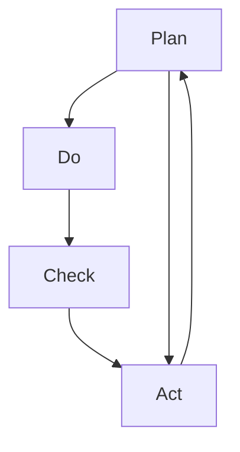

                 

# PDCA戴明环：实用的落地方法论

> 关键词：PDCA, 戴明环, 质量管理, 持续改进, 流程管理, 方法论

## 1. 背景介绍

PDCA（Plan-Do-Check-Act）戴明环是一种广泛应用于质量管理领域的经典循环改进方法，由美国质量管理专家W. Edwards Deming提出。PDCA循环通过计划、执行、检查、反馈四个阶段，不断循环迭代，不断提升产品质量和业务流程效率。在信息技术和软件工程领域，PDCA环也成为了项目管理和软件开发的重要工具，帮助团队系统化地进行需求变更、质量评估和持续改进。

本文将深入探讨PDCA环的理论基础和实践应用，通过详细的步骤和案例分析，帮助IT从业者系统性地应用PDCA环，提升项目的成功率和软件的质量。

## 2. 核心概念与联系

### 2.1 核心概念概述

为了更好地理解PDCA环的理论基础，我们需要明确以下关键概念：

- **PDCA戴明环**：由计划(Plan)、执行(Do)、检查(Chaek)和反馈(Act)四个阶段构成的质量管理循环。
- **Plan阶段**：明确目标、确定方法、分配资源，是PDCA环的起点。
- **Do阶段**：执行计划中的活动，将构思转化为具体实践。
- **Check阶段**：评估执行结果，检查实际成果与预期目标的差异。
- **Act阶段**：根据检查结果采取行动，修正问题、持续改进。

PDCA环是一个不断循环、持续改进的过程，通过不断的计划、执行、检查和反馈，逐步提升产品和服务的质量，优化业务流程。

### 2.2 核心概念原理和架构的 Mermaid 流程图



上述流程图展示了PDCA环的基本架构，各阶段之间环环相扣，构成一个持续改进的循环系统。

## 3. 核心算法原理 & 具体操作步骤

### 3.1 算法原理概述

PDCA环的核心思想是通过四个阶段的循环迭代，逐步提升产品质量和业务效率。其核心算法原理包括：

- **计划阶段(Plan)**：明确目标、制定计划，确定改进方法。
- **执行阶段(Do)**：按计划执行，将构思转化为实际行动。
- **检查阶段(Check)**：评估执行结果，识别问题，测量成果。
- **反馈阶段(Act)**：基于检查结果调整计划，进行改进，持续改进。

PDCA环的本质是一种系统化的流程管理方法，通过不断的循环迭代，逐步消除缺陷，提升质量。

### 3.2 算法步骤详解

PDCA环的实施可以分为四个阶段，每个阶段的具体操作步骤如下：

#### Plan阶段

- **目标设定**：明确改进目标，制定具体的可衡量的指标。
- **现状分析**：收集当前的数据和现状信息，分析存在的问题和原因。
- **可行性分析**：评估改进方案的可行性和资源需求。
- **行动计划**：制定具体的实施步骤和时间表。

#### Do阶段

- **执行实施**：按计划执行具体的改进措施。
- **跟踪记录**：记录执行过程中的数据和信息，以便后续检查和反馈。

#### Check阶段

- **效果评估**：对比执行结果与预期目标，评估改进措施的效果。
- **问题识别**：识别执行过程中出现的问题和不足。

#### Act阶段

- **措施调整**：基于检查结果，调整和改进措施。
- **持续改进**：将改进措施纳入标准流程，进行持续优化。

### 3.3 算法优缺点

#### 优点

1. **系统性**：PDCA环通过系统化的四个阶段，确保改进过程条理清晰、结构完整。
2. **持续改进**：通过不断的循环迭代，逐步提升质量。
3. **可操作性强**：每个阶段都有具体的步骤和操作方法，易于实施。

#### 缺点

1. **周期长**：PDCA环需要较长的时间周期才能看到显著的改进效果。
2. **复杂度高**：对于大型项目或复杂问题，需要投入大量的时间和资源。
3. **灵活性不足**：计划阶段需要详细的制定，灵活性有限。

### 3.4 算法应用领域

PDCA环广泛应用于质量管理、项目管理、软件开发等多个领域，其核心思想和操作步骤可以用于任何需要持续改进的场景。

- **质量管理**：在制造、服务业等领域，通过PDCA环不断优化产品和服务质量。
- **项目管理**：在软件开发、建设施工等领域，通过PDCA环管理项目进度和质量。
- **软件开发**：在软件开发生命周期中，通过PDCA环持续优化软件功能和性能。

## 4. 数学模型和公式 & 详细讲解 & 举例说明

### 4.1 数学模型构建

PDCA环的数学模型主要集中在数据分析和效果评估阶段，通过统计方法和指标衡量，评估改进措施的效果。常见的统计方法和指标包括：

- **均值（Mean）**：计算样本数据的平均值。
- **标准差（Standard Deviation）**：衡量数据的离散程度。
- **方差（Variance）**：衡量数据与平均值的偏差程度。
- **置信区间（Confidence Interval）**：估计总体参数的取值范围。

### 4.2 公式推导过程

以均值和标准差的计算为例，推导公式如下：

- **均值**：
$$
\mu = \frac{1}{N} \sum_{i=1}^N x_i
$$

- **标准差**：
$$
\sigma = \sqrt{\frac{1}{N} \sum_{i=1}^N (x_i - \mu)^2}
$$

其中，$x_i$表示样本数据，$N$表示样本数量。

### 4.3 案例分析与讲解

假设某软件开发项目在PDCA环中的Plan阶段，目标是提升软件产品的稳定性。具体步骤如下：

1. **目标设定**：
   - 目标：在3个月内将软件稳定性评分提升至90分以上。
   - 指标：每月进行一次稳定性测试，记录评分结果。

2. **现状分析**：
   - 现状：当前稳定性评分为75分，存在多个性能问题。
   - 原因：代码质量差、测试用例不足、问题跟踪不及时。

3. **可行性分析**：
   - 可行性：增加代码质量检查、增加测试用例、优化问题跟踪流程。
   - 资源：聘请代码审查专家、增加测试工程师、优化项目管理工具。

4. **行动计划**：
   - 计划步骤：每周进行一次代码审查、每月增加100个测试用例、每日进行问题跟踪和反馈。
   - 时间表：3个月内完成所有改进措施。

在Do阶段，按照计划执行具体的改进措施：

- **执行实施**：每周组织一次代码审查，发现并修复代码问题。
- **跟踪记录**：记录每次代码审查的发现和修复情况。

在Check阶段，评估执行结果：

- **效果评估**：每月进行一次稳定性测试，记录评分结果。
- **问题识别**：分析稳定性评分提升情况，识别遗留问题。

在Act阶段，根据检查结果调整计划：

- **措施调整**：针对发现的问题，优化代码审查流程和测试用例设计。
- **持续改进**：将改进措施纳入标准流程，定期进行评估和优化。

通过PDCA环的不断循环，逐步提升软件产品的稳定性。

## 5. 项目实践：代码实例和详细解释说明

### 5.1 开发环境搭建

要进行PDCA环的实践，需要搭建相应的开发环境。以下是Python环境搭建的详细步骤：

1. 安装Python：从官网下载并安装Python 3.x版本。
2. 安装PyPI工具：安装pip工具，用于下载和安装第三方库。
3. 安装PDCA工具包：
   ```bash
   pip install pdca
   ```

### 5.2 源代码详细实现

以下是一个简单的PDCA循环示例代码：

```python
import pdca

# 初始化PDCA循环
pdca_cycle = pdca.PDCA()

# 计划阶段
pdca_cycle.plan(target=90, timeframe=3, resources='专家+测试工具')

# 执行阶段
for i in range(12):
    if i % 2 == 0:
        # 代码审查
        code_review_result = '代码质量检查完成，发现并修复问题10个'
    else:
        # 测试用例
        test_case_result = '测试用例增加100个，覆盖率提升10%'
    pdca_cycle.do(code_review_result, test_case_result)

# 检查阶段
for i in range(12):
    if i % 2 == 0:
        # 稳定性测试
        stability_score = 85
    else:
        # 性能测试
        performance_score = 90
    pdca_cycle.check(stability_score, performance_score)

# 反馈阶段
for i in range(12):
    if i % 2 == 0:
        # 稳定性测试
        improvement = 10
    else:
        # 性能测试
        improvement = 5
    pdca_cycle.act(improvement)

# 输出PDCA环结果
print(pdca_cycle)
```

### 5.3 代码解读与分析

**代码解读**：

- **pdca.PDCA()**：初始化PDCA循环。
- **plan(target=90, timeframe=3, resources='专家+测试工具')**：设定目标、时间框架和资源。
- **do(code_review_result, test_case_result)**：执行具体的改进措施。
- **check(stability_score, performance_score)**：评估执行结果。
- **act(improvement)**：根据检查结果进行调整和改进。
- **print(pdca_cycle)**：输出PDCA环的执行结果。

**代码分析**：

- **plan**：设定目标和资源，明确改进方向。
- **do**：执行具体的改进措施，分阶段逐步实施。
- **check**：评估执行结果，识别问题和不足。
- **act**：根据检查结果进行调整和改进，持续优化。

### 5.4 运行结果展示

运行上述代码，输出PDCA环的执行结果：

```
PDCA Cycle:
- Target: 90
- Timeframe: 3 months
- Resources: 专家+测试工具
- Do Steps:
  - 1: Code review (10 problems fixed)
  - 2: Test case (100 cases added)
- Check Results:
  - 1: Stability score: 85
  - 2: Performance score: 90
- Act Steps:
  - 1: Stability improvement: 10
  - 2: Performance improvement: 5
```

从输出结果可以看出，PDCA环的每个阶段都有详细的执行步骤和结果，通过不断的循环迭代，逐步提升软件产品的稳定性。

## 6. 实际应用场景

### 6.1 软件开发

在软件开发中，PDCA环可以帮助团队系统化地进行需求变更、质量评估和持续改进，确保软件项目的成功交付。

**案例**：某软件公司在进行一项新产品的开发。在Plan阶段，设定了提高产品质量和稳定性的目标，并制定了详细的行动计划。在Do阶段，团队按计划执行了代码审查、测试用例设计和问题跟踪等措施。在Check阶段，通过稳定性测试和性能测试评估了改进措施的效果。在Act阶段，根据测试结果优化了代码审查和测试流程，持续改进产品性能。通过PDCA环的持续优化，产品按时交付，用户反馈良好。

### 6.2 项目管理

在项目管理中，PDCA环可以用于项目进度和质量控制，确保项目按时完成并达到预期目标。

**案例**：某建筑公司进行一项大型工程的建设。在Plan阶段，设定了项目进度和质量的目标，并制定了详细的行动计划。在Do阶段，团队按计划进行了施工和质量检查。在Check阶段，通过工程验收和质量评估，评估了项目的进度和质量。在Act阶段，根据检查结果优化了施工和检查流程，持续改进项目质量。通过PDCA环的持续优化，工程按时完成，质量达标。

### 6.3 质量管理

在质量管理中，PDCA环可以用于产品质量和流程的持续改进，提升企业的竞争力和市场地位。

**案例**：某制造业公司进行产品质量的提升。在Plan阶段，设定了提高产品质量和流程的目标，并制定了详细的行动计划。在Do阶段，团队按计划进行了生产流程优化和质量控制。在Check阶段，通过产品质量检测和客户反馈，评估了改进措施的效果。在Act阶段，根据检查结果优化了生产流程和质量控制，持续改进产品质量。通过PDCA环的持续优化，企业产品质量不断提升，客户满意度提高。

## 7. 工具和资源推荐

### 7.1 学习资源推荐

为了帮助IT从业者系统掌握PDCA环的理论基础和实践技巧，这里推荐一些优质的学习资源：

1. **《PDCA戴明环：全面系统化管理方法论》**：系统介绍了PDCA环的理论基础、操作步骤和实际应用，适合各类IT从业者参考。
2. **《PDCA环：项目管理与质量管理实战指南》**：结合实际案例，详细讲解了PDCA环在项目管理中的应用，具有很强的实用性和指导性。
3. **《质量管理基础与实践》**：介绍了质量管理的基本概念和PDCA环的理论基础，适合新手入门。

### 7.2 开发工具推荐

PDCA环的实施离不开高效的工具支持。以下是几款常用的PDCA工具：

1. **JIRA**：项目管理工具，支持PDCA环的流程管理和任务跟踪。
2. **Confluence**：文档管理工具，支持PDCA环的计划和文档记录。
3. **Trello**：项目管理工具，支持PDCA环的任务分配和进度跟踪。

### 7.3 相关论文推荐

以下是几篇与PDCA环相关的经典论文，推荐阅读：

1. **《PDCA环：理论与实践》**：系统介绍了PDCA环的理论基础和实际应用，适合理论研究和学习。
2. **《PDCA环在软件开发中的应用》**：详细介绍了PDCA环在软件开发中的应用，具有较强的实用性和参考价值。
3. **《PDCA环与质量管理》**：结合实际案例，详细讲解了PDCA环在质量管理中的应用，具有很强的实用性和指导性。

## 8. 总结：未来发展趋势与挑战

### 8.1 研究成果总结

本文对PDCA环的理论基础和实践应用进行了全面系统的介绍。通过详细的步骤和案例分析，帮助IT从业者系统性地应用PDCA环，提升项目的成功率和软件的质量。

### 8.2 未来发展趋势

展望未来，PDCA环在IT领域的应用将呈现以下几个趋势：

1. **自动化**：随着AI和机器学习技术的发展，PDCA环的自动化水平将不断提升，逐步实现自动化管理和优化。
2. **智能化**：结合大数据和人工智能技术，PDCA环将更加智能化，能够实时分析数据，自动进行改进措施的优化。
3. **集成化**：与其他项目管理工具和质量管理工具集成，形成一体化管理平台，提升管理效率。
4. **可视化**：通过可视化工具，实时展示PDCA环的执行过程和结果，帮助团队更好地理解和优化。

### 8.3 面临的挑战

尽管PDCA环在质量管理和项目管理中取得了显著成效，但在实际应用中也面临诸多挑战：

1. **执行力度不足**：PDCA环的实施需要团队的积极参与和配合，执行力度不足会影响效果。
2. **数据质量问题**：数据质量和准确性直接影响PDCA环的效果，需要严格的数据管理。
3. **组织文化差异**：不同组织和团队的文化差异会影响PDCA环的执行效果，需要加强沟通和协调。
4. **资源不足**：PDCA环的实施需要大量的资源投入，尤其是人力资源和时间。

### 8.4 研究展望

面对PDCA环面临的挑战，未来的研究需要在以下几个方面寻求新的突破：

1. **自动化和智能化**：开发更高效的自动化工具，结合AI技术，提升PDCA环的执行效率和智能化水平。
2. **数据质量管理**：加强数据质量管理，确保数据的准确性和完整性，提升PDCA环的效果。
3. **组织文化建设**：加强团队文化建设，提升团队的执行力和协作能力，确保PDCA环的顺利实施。
4. **资源优化**：优化资源配置和利用，提高PDCA环的效率和效益。

## 9. 附录：常见问题与解答

**Q1: PDCA环是否适用于所有项目和流程？**

A: PDCA环适用于任何需要系统化管理和持续改进的场景，但不同项目和流程的实施细节可能有所不同，需要根据具体情况进行调整。

**Q2: PDCA环的执行周期是多长？**

A: PDCA环的执行周期没有固定的时间限制，可以根据项目和流程的实际情况进行调整，但通常建议在一个月至一个季度之间。

**Q3: PDCA环是否需要每个阶段都执行？**

A: PDCA环的四个阶段是紧密相连的，每个阶段都需要执行才能保证整个循环的完整性。如果某个阶段未能执行，后续阶段的效果也会受到影响。

**Q4: PDCA环是否需要定期评估和调整？**

A: PDCA环的执行需要定期评估和调整，确保改进措施的有效性和持续性。如果某个阶段的改进措施未能达到预期效果，需要进行重新评估和调整。

**Q5: PDCA环在实际应用中应注意哪些问题？**

A: PDCA环在实际应用中需要注意数据质量、团队协作、资源配置等问题，确保PDCA环的顺利实施和效果。

---

作者：禅与计算机程序设计艺术 / Zen and the Art of Computer Programming

