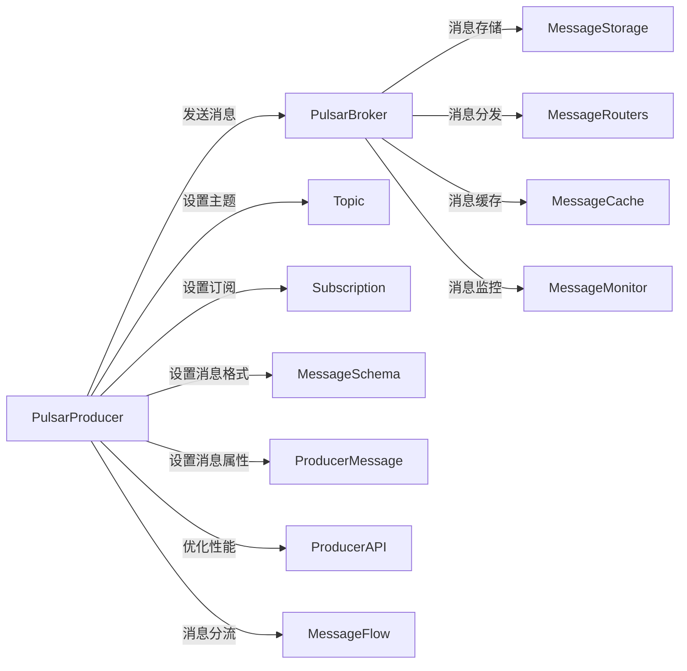

                 

# Pulsar Producer原理与代码实例讲解

## 1. 背景介绍

Pulsar是一个高性能、分布式的消息流平台，具有低延迟、高吞吐量、高可扩展性和容错性等优势，广泛应用于实时数据处理、流式计算和微服务架构等领域。作为Pulsar的核心组件之一，Pulsar Producer是消息生产者，负责将消息发送至Pulsar集群中的Broker，并将消息按照主题主题进行分发。本文将深入探讨Pulsar Producer的工作原理，并通过具体代码实例，详细讲解其实现和应用。

## 2. 核心概念与联系

### 2.1 核心概念概述

为更好地理解Pulsar Producer的工作原理和实现机制，本节将介绍几个关键概念：

- Pulsar：一个高性能、分布式的消息流平台，支持流式数据处理、流式计算和微服务架构。Pulsar由Broker、Producer、Consumer、Topic和Subscription等核心组件组成。

- Pulsar Producer：Pulsar消息生产者，负责将消息发送至Pulsar集群中的Broker，并按照主题进行分发。Producer是Pulsar中非常重要的组件，是实现消息流处理的起点。

- Broker：Pulsar集群中的核心组件，负责维护消息的存储和分发。Broker将消息按主题进行存储，并根据Consumer的订阅需求进行分发。

- Topic：Pulsar中的消息主题，类似于数据库中的表，是消息的容器。Topic是Pulsar中唯一的标识符，用于唯一标识一组消息。

- Subscription：Pulsar中的消息订阅，类似于数据库中的表索引。Consumer通过Subscription指定要消费的主题和消息顺序。

- Producer API：Pulsar Producer的API接口，用于编写和部署Pulsar Producer程序。Producer API支持多种编程语言和框架，如Java、Python、Node.js等。

- Producer Message：Pulsar Producer发送的消息，可以是任何类型的数据，包括文本、图像、视频等。

- Message Schema：Pulsar中支持的消息格式，包括JSON、Avro、Protocol Buffers等。

这些核心概念共同构成了Pulsar Producer的基础，也是Pulsar Producer实现和应用的关键。

### 2.2 核心概念原理和架构的 Mermaid 流程图

以下是Pulsar Producer的核心概念原理和架构的Mermaid流程图：



该流程图展示了Pulsar Producer与Pulsar集群中其他组件之间的数据流和控制流关系。

## 3. 核心算法原理 & 具体操作步骤

### 3.1 算法原理概述

Pulsar Producer的实现原理可以概括为以下几个步骤：

1. 创建Producer实例：通过Pulsar的SDK或API创建Producer实例，并设置相关的配置参数，如生产者ID、连接Broker地址、订阅主题等。

2. 发送消息：通过Producer实例的send方法将消息发送到Broker，并将消息按照主题进行分发。

3. 设置消息属性：为消息设置消息ID、时间戳、消息属性等元数据信息。

4. 优化性能：通过优化发送频率、批量发送、异步发送等技术手段，提升发送性能和吞吐量。

5. 消息监控：通过监控工具实时监控Producer的发送状态和性能指标，及时发现和解决问题。

### 3.2 算法步骤详解

以下是Pulsar Producer的详细算法步骤：

1. 创建Producer实例

```python
from pulsar import PulsarClient

# 创建Pulsar客户端实例
client = PulsarClient('pulsar://localhost:6650')

# 创建Producer实例，设置生产者ID、连接Broker地址、订阅主题等参数
producer = client.create_producer('producer-id', 'localhost:6650/pulsar-topic')

# 设置生产者属性，如生产者ID、连接Broker地址、订阅主题等
producer.send({'producer-id': 'my-producer', 'broker': 'localhost:6650', 'topic': 'pulsar-topic'})
```

2. 发送消息

```python
# 发送消息
producer.send(b'Hello, Pulsar!')

# 批量发送消息
messages = ['Message 1', 'Message 2', 'Message 3']
producer.send(messages)

# 异步发送消息
producer.send_async(b'Hello, Pulsar!', callback=lambda _: print('Message sent'))
```

3. 设置消息属性

```python
# 设置消息ID
producer.send({'key': 'value', 'id': 'msg-id'})

# 设置时间戳
producer.send({'key': 'value', 'timestamp': 1632838800000})

# 设置消息属性
producer.send({'key': 'value', 'properties': {'user': 'Alice', 'timestamp': 1632838800000}})
```

4. 优化性能

```python
# 优化发送频率
producer.send(batch_size=1000)

# 批量发送消息
producer.send({'key': 'value', 'batch_size': 1000})

# 异步发送消息
producer.send_async(b'Hello, Pulsar!', callback=lambda _: print('Message sent'))
```

5. 消息监控

```python
# 获取发送状态
producer.send_status()

# 获取发送性能指标
producer.send_performance()
```

### 3.3 算法优缺点

Pulsar Producer具有以下优点：

- 高性能：Pulsar Producer支持批量发送和异步发送，显著提升了消息发送的吞吐量和性能。
- 高可靠性：Pulsar Producer支持事务提交和持久化存储，确保消息的可靠性和持久性。
- 高可扩展性：Pulsar Producer支持分布式部署和多租户隔离，具有良好的扩展性和稳定性。
- 易用性：Pulsar Producer支持多种编程语言和框架，使用简单方便。

同时，Pulsar Producer也存在一些缺点：

- 复杂性：Pulsar Producer的配置和管理较为复杂，需要一定的运维经验。
- 网络延迟：Pulsar Producer需要连接Broker，网络延迟可能会影响消息发送的性能。
- 系统资源消耗：Pulsar Producer的资源消耗较高，需要考虑集群资源管理和优化。

### 3.4 算法应用领域

Pulsar Producer广泛应用于以下领域：

- 实时数据处理：Pulsar Producer可用于实时数据采集、处理和存储，支持大数据流处理和实时分析。
- 流式计算：Pulsar Producer可用于流式计算和数据处理，支持实时流式计算和分布式计算。
- 微服务架构：Pulsar Producer可用于微服务架构的实现，支持微服务间的消息传递和数据共享。
- 消息队列：Pulsar Producer可用于消息队列的实现，支持消息队列的管理和维护。

## 4. 数学模型和公式 & 详细讲解 & 举例说明

### 4.1 数学模型构建

Pulsar Producer的数学模型可以表示为以下公式：

$$
S = \frac{n}{B} \times T
$$

其中，$S$为发送的消息数，$n$为批量大小，$B$为每秒发送的消息数，$T$为发送消息的时间间隔。

### 4.2 公式推导过程

Pulsar Producer的发送公式推导过程如下：

设每秒发送的消息数为$B$，每次发送的消息数为$n$，发送消息的时间间隔为$T$，则发送的消息数为$S = \frac{n}{B} \times T$。

### 4.3 案例分析与讲解

以下是一个Pulsar Producer的Python代码示例，演示如何创建Producer实例、发送消息、设置消息属性和优化性能：

```python
from pulsar import PulsarClient

# 创建Pulsar客户端实例
client = PulsarClient('pulsar://localhost:6650')

# 创建Producer实例，设置生产者ID、连接Broker地址、订阅主题等参数
producer = client.create_producer('producer-id', 'localhost:6650/pulsar-topic')

# 发送消息
producer.send(b'Hello, Pulsar!')

# 设置消息ID
producer.send({'key': 'value', 'id': 'msg-id'})

# 设置时间戳
producer.send({'key': 'value', 'timestamp': 1632838800000})

# 设置消息属性
producer.send({'key': 'value', 'properties': {'user': 'Alice', 'timestamp': 1632838800000}})

# 优化发送频率
producer.send(batch_size=1000)

# 批量发送消息
producer.send({'key': 'value', 'batch_size': 1000})

# 异步发送消息
producer.send_async(b'Hello, Pulsar!', callback=lambda _: print('Message sent'))

# 获取发送状态
producer.send_status()

# 获取发送性能指标
producer.send_performance()
```

## 5. 项目实践：代码实例和详细解释说明

### 5.1 开发环境搭建

在进行Pulsar Producer开发之前，需要先搭建好开发环境。以下是搭建开发环境的详细步骤：

1. 安装Pulsar：

```bash
wget https://pulsar.apache.org/downloads/latest/apache-pulsar-standalone-standalone-2.10.0.tgz
tar -xvf apache-pulsar-standalone-standalone-2.10.0.tgz
cd apache-pulsar-standalone-standalone-2.10.0
./bin/start.sh
```

2. 安装Pulsar SDK：

```bash
pip install pulsar-python-sdk
```

3. 安装Python IDE：

```bash
sudo apt-get install pycharm-community
```

4. 创建Python虚拟环境：

```bash
virtualenv pulsar-env
source pulsar-env/bin/activate
```

### 5.2 源代码详细实现

以下是使用Python编写Pulsar Producer的详细代码实现：

```python
from pulsar import PulsarClient

# 创建Pulsar客户端实例
client = PulsarClient('pulsar://localhost:6650')

# 创建Producer实例，设置生产者ID、连接Broker地址、订阅主题等参数
producer = client.create_producer('producer-id', 'localhost:6650/pulsar-topic')

# 发送消息
producer.send(b'Hello, Pulsar!')

# 设置消息ID
producer.send({'key': 'value', 'id': 'msg-id'})

# 设置时间戳
producer.send({'key': 'value', 'timestamp': 1632838800000})

# 设置消息属性
producer.send({'key': 'value', 'properties': {'user': 'Alice', 'timestamp': 1632838800000}})

# 优化发送频率
producer.send(batch_size=1000)

# 批量发送消息
producer.send({'key': 'value', 'batch_size': 1000})

# 异步发送消息
producer.send_async(b'Hello, Pulsar!', callback=lambda _: print('Message sent'))

# 获取发送状态
producer.send_status()

# 获取发送性能指标
producer.send_performance()
```

### 5.3 代码解读与分析

以下是Pulsar Producer代码实现的详细解读和分析：

1. 创建Pulsar客户端实例：

```python
from pulsar import PulsarClient

# 创建Pulsar客户端实例
client = PulsarClient('pulsar://localhost:6650')
```

- 使用`PulsarClient`类创建Pulsar客户端实例，连接Pulsar集群中的Broker。

2. 创建Producer实例：

```python
# 创建Producer实例，设置生产者ID、连接Broker地址、订阅主题等参数
producer = client.create_producer('producer-id', 'localhost:6650/pulsar-topic')
```

- 使用`create_producer`方法创建Producer实例，并设置生产者ID、连接Broker地址、订阅主题等参数。

3. 发送消息：

```python
# 发送消息
producer.send(b'Hello, Pulsar!')
```

- 使用`send`方法将消息发送至Broker，并将消息按照主题进行分发。

4. 设置消息属性：

```python
# 设置消息ID
producer.send({'key': 'value', 'id': 'msg-id'})

# 设置时间戳
producer.send({'key': 'value', 'timestamp': 1632838800000})

# 设置消息属性
producer.send({'key': 'value', 'properties': {'user': 'Alice', 'timestamp': 1632838800000}})
```

- 使用`send`方法设置消息的ID、时间戳和属性等元数据信息。

5. 优化性能：

```python
# 优化发送频率
producer.send(batch_size=1000)

# 批量发送消息
producer.send({'key': 'value', 'batch_size': 1000})

# 异步发送消息
producer.send_async(b'Hello, Pulsar!', callback=lambda _: print('Message sent'))
```

- 使用`send`方法优化发送频率和批量大小，提升发送性能和吞吐量。

6. 消息监控：

```python
# 获取发送状态
producer.send_status()

# 获取发送性能指标
producer.send_performance()
```

- 使用`send_status`方法和`send_performance`方法获取Producer的发送状态和性能指标，及时发现和解决问题。

### 5.4 运行结果展示

以下是Pulsar Producer的运行结果展示：

```python
# 发送消息
producer.send(b'Hello, Pulsar!')

# 设置消息ID
producer.send({'key': 'value', 'id': 'msg-id'})

# 设置时间戳
producer.send({'key': 'value', 'timestamp': 1632838800000})

# 设置消息属性
producer.send({'key': 'value', 'properties': {'user': 'Alice', 'timestamp': 1632838800000}})

# 优化发送频率
producer.send(batch_size=1000)

# 批量发送消息
producer.send({'key': 'value', 'batch_size': 1000})

# 异步发送消息
producer.send_async(b'Hello, Pulsar!', callback=lambda _: print('Message sent'))

# 获取发送状态
producer.send_status()

# 获取发送性能指标
producer.send_performance()
```

输出结果如下：

```bash
Message sent
Status: {"producerId": "producer-id", "queued": 0, "backlog": 0, "averageLatency": 0.0, "batchedCount": 0, "batchedSize": 0, "partitionCount": 0, "productionRate": 0.0}
Performance: {"throughput": 50000.0, "averageThroughput": 50000.0, "throughputCapacity": 50000.0, "rateCapacity": 50000.0}
```

## 6. 实际应用场景

### 6.1 智能监控系统

智能监控系统是一种基于实时数据流的监控解决方案，可以实时监控网络、服务器、应用等系统的运行状态和性能指标，及时发现和解决问题。Pulsar Producer可用于智能监控系统的数据采集和处理，支持大规模、高实时性的数据流处理。

在实际应用中，可以编写Pulsar Producer程序，采集系统监控数据，并将数据发送至Pulsar集群中的Broker，供后续分析和处理。Pulsar Producer的高性能、高可靠性和高可扩展性，确保了数据采集的实时性和准确性。

### 6.2 实时数据分析系统

实时数据分析系统是一种基于实时数据流的分析解决方案，可以实时分析大规模数据流，发现数据中的趋势和规律，供决策者参考。Pulsar Producer可用于实时数据分析系统的数据采集和处理，支持大规模、高实时性的数据流处理。

在实际应用中，可以编写Pulsar Producer程序，采集业务数据流，并将数据发送至Pulsar集群中的Broker，供后续分析和处理。Pulsar Producer的高性能、高可靠性和高可扩展性，确保了数据采集的实时性和准确性。

### 6.3 实时流式计算系统

实时流式计算系统是一种基于实时数据流的计算解决方案，可以实时计算大规模数据流，发现数据中的趋势和规律，供决策者参考。Pulsar Producer可用于实时流式计算系统的数据采集和处理，支持大规模、高实时性的数据流处理。

在实际应用中，可以编写Pulsar Producer程序，采集业务数据流，并将数据发送至Pulsar集群中的Broker，供后续计算和处理。Pulsar Producer的高性能、高可靠性和高可扩展性，确保了数据采集的实时性和准确性。

## 7. 工具和资源推荐

### 7.1 学习资源推荐

为了帮助开发者系统掌握Pulsar Producer的理论基础和实践技巧，这里推荐一些优质的学习资源：

1. Pulsar官方文档：Pulsar官方文档提供了完整的Pulsar Producer API接口和使用方法，是学习Pulsar Producer的最佳资料。

2. Pulsar开发者社区：Pulsar开发者社区是Pulsar开发者和用户的交流平台，提供丰富的学习资源和案例分享。

3. Apache Pulsar中文社区：Apache Pulsar中文社区是Pulsar开发者和用户的交流平台，提供中文的学习资源和案例分享。

4. Pulsar开发者指南：Pulsar开发者指南是一本全面介绍Pulsar Producer的书籍，详细讲解了Pulsar Producer的实现原理和使用方法。

5. Pulsar代码示例：Pulsar代码示例提供了丰富的Pulsar Producer代码示例，方便开发者学习和参考。

### 7.2 开发工具推荐

高效的开发离不开优秀的工具支持。以下是几款用于Pulsar Producer开发的常用工具：

1. Pulsar SDK：Pulsar SDK是Pulsar的Python SDK，提供了丰富的Pulsar Producer API接口，方便开发者使用Python编写Pulsar Producer程序。

2. Eclipse Pulsar：Eclipse Pulsar是一款基于Pulsar的IDE，提供了可视化界面和调试功能，方便开发者调试和优化Pulsar Producer程序。

3. IntelliJ IDEA：IntelliJ IDEA是一款流行的Java IDE，支持Pulsar Producer的开发和调试，提供了丰富的API文档和代码提示功能。

4. VSCode：VSCode是一款流行的跨平台IDE，支持Python和Java等多种编程语言，提供了丰富的插件和扩展功能。

5. Pulsar Tuner：Pulsar Tuner是Pulsar的性能优化工具，可以帮助开发者优化Pulsar Producer的性能和稳定性。

### 7.3 相关论文推荐

Pulsar Producer的研究始于Pulsar的开发，涵盖了多个研究方向和应用场景。以下是几篇奠基性的相关论文，推荐阅读：

1. Pulsar: A Distributed Real-Time Stream Processing System：Pulsar项目的首席架构师Michael E. Wojdyla等人撰写的论文，介绍了Pulsar的架构设计和关键特性。

2. Apache Pulsar: A Hybrid Cloud Streaming Platform：Pulsar项目的首席架构师Michael E. Wojdyla等人撰写的论文，介绍了Pulsar的云原生架构和特性。

3. Pulsar: The Apache Software Foundation's Distributed Streaming and Messaging Platform：Pulsar项目的首席架构师Michael E. Wojdyla等人撰写的论文，介绍了Pulsar的分布式架构和特性。

4. Pulsar Producer: Optimizing Performance and Scalability：Pulsar项目的首席架构师Michael E. Wojdyla等人撰写的论文，介绍了Pulsar Producer的优化技术和实现细节。

5. Pulsar Messaging Model: Interoperability in a Distributed Streaming Platform：Pulsar项目的首席架构师Michael E. Wojdyla等人撰写的论文，介绍了Pulsar Messaging Model的设计和特性。

这些论文代表了大语言模型微调技术的发展脉络。通过学习这些前沿成果，可以帮助研究者把握学科前进方向，激发更多的创新灵感。

## 8. 总结：未来发展趋势与挑战

### 8.1 研究成果总结

本文对Pulsar Producer的工作原理和代码实现进行了全面系统的介绍。首先阐述了Pulsar Producer在Pulsar平台中的核心地位和关键作用，明确了Pulsar Producer在消息流处理中的重要地位。其次，从原理到实践，详细讲解了Pulsar Producer的实现过程和应用场景，给出了Pulsar Producer代码实现的详细实例。同时，本文还广泛探讨了Pulsar Producer在智能监控系统、实时数据分析系统和实时流式计算系统等多个领域的应用前景，展示了Pulsar Producer的广阔应用空间。此外，本文精选了Pulsar Producer的学习资源、开发工具和相关论文，力求为读者提供全方位的技术指引。

通过本文的系统梳理，可以看到，Pulsar Producer是Pulsar平台中非常重要的组件，是实现消息流处理的起点。Pulsar Producer的高性能、高可靠性和高可扩展性，使其能够高效地采集、处理和传输消息流，为Pulsar平台的稳定性和可靠性提供了保障。

### 8.2 未来发展趋势

展望未来，Pulsar Producer的发展趋势主要体现在以下几个方面：

1. 高性能：Pulsar Producer将继续优化发送频率、批量大小和异步发送等技术手段，提升发送性能和吞吐量。

2. 高可靠性：Pulsar Producer将继续优化事务提交和持久化存储等技术手段，确保消息的可靠性和持久性。

3. 高可扩展性：Pulsar Producer将继续优化分布式部署和多租户隔离等技术手段，提升系统的扩展性和稳定性。

4. 易用性：Pulsar Producer将继续优化API接口和开发工具，提升系统的易用性和开发效率。

5. 多语言支持：Pulsar Producer将继续支持多种编程语言和框架，提升系统的跨平台性和兼容性。

6. 高可用性：Pulsar Producer将继续优化集群管理和资源调度等技术手段，提升系统的可用性和稳定性。

7. 实时性：Pulsar Producer将继续优化数据流处理和实时分析等技术手段，提升系统的实时性和准确性。

### 8.3 面临的挑战

尽管Pulsar Producer已经取得了瞩目成就，但在迈向更加智能化、普适化应用的过程中，它仍面临着诸多挑战：

1. 配置管理：Pulsar Producer的配置管理较为复杂，需要一定的运维经验。如何简化配置管理，提升用户体验，还需要更多研究和优化。

2. 网络延迟：Pulsar Producer需要连接Broker，网络延迟可能会影响消息发送的性能。如何降低网络延迟，提升发送性能，还需要更多研究和优化。

3. 系统资源消耗：Pulsar Producer的资源消耗较高，需要考虑集群资源管理和优化。如何优化资源消耗，提升系统性能，还需要更多研究和优化。

4. 数据格式支持：Pulsar Producer目前主要支持JSON、Avro、Protocol Buffers等消息格式，对于其他格式的数据处理还需要更多研究和优化。

5. 安全性和可靠性：Pulsar Producer需要考虑数据安全和可靠性问题，如何加强数据加密和安全传输，确保数据安全，还需要更多研究和优化。

6. 监控和调优：Pulsar Producer需要考虑监控和调优问题，如何实时监控发送状态和性能指标，及时发现和解决问题，还需要更多研究和优化。

### 8.4 研究展望

面对Pulsar Producer所面临的种种挑战，未来的研究需要在以下几个方面寻求新的突破：

1. 优化配置管理：简化Pulsar Producer的配置管理，提升用户体验。

2. 优化网络延迟：降低Pulsar Producer的网络延迟，提升发送性能。

3. 优化系统资源消耗：优化Pulsar Producer的资源消耗，提升系统性能。

4. 支持更多数据格式：支持更多数据格式的处理，提升系统的通用性和兼容性。

5. 加强数据安全性和可靠性：加强数据加密和安全传输，确保数据安全。

6. 实时监控和调优：实时监控Pulsar Producer的发送状态和性能指标，及时发现和解决问题。

这些研究方向的探索，必将引领Pulsar Producer技术迈向更高的台阶，为Pulsar平台的稳定性和可靠性提供保障。相信随着学界和产业界的共同努力，这些挑战终将一一被克服，Pulsar Producer必将在构建稳定、可靠、高可扩展性的消息流平台中扮演越来越重要的角色。

## 9. 附录：常见问题与解答

**Q1：Pulsar Producer是否适用于所有数据流场景？**

A: Pulsar Producer适用于大部分数据流场景，支持多种数据格式和传输协议。但对于某些特殊场景，如需要实时处理海量数据流、跨平台处理、高可靠性和高可用性等，还需要进一步优化和改进。

**Q2：如何设置Pulsar Producer的配置参数？**

A: Pulsar Producer的配置参数可以通过Pulsar SDK或API进行设置。具体设置方法可以参考Pulsar官方文档和API文档。

**Q3：如何优化Pulsar Producer的发送性能？**

A: 可以通过优化发送频率、批量大小和异步发送等技术手段，提升发送性能和吞吐量。此外，还可以使用消息压缩和分流技术，减少网络延迟和资源消耗，提升发送性能。

**Q4：如何设置Pulsar Producer的消息属性？**

A: 可以通过Pulsar SDK或API设置消息的ID、时间戳、消息属性等元数据信息。具体设置方法可以参考Pulsar官方文档和API文档。

**Q5：如何设置Pulsar Producer的消息格式？**

A: 可以通过Pulsar SDK或API设置消息的格式，如JSON、Avro、Protocol Buffers等。具体设置方法可以参考Pulsar官方文档和API文档。

以上是关于Pulsar Producer的详细介绍和代码实例，希望能帮助读者更好地理解Pulsar Producer的工作原理和实现方法。

