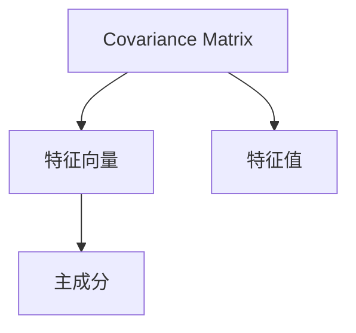

                 

# Python机器学习实战：主成分分析(PCA)的原理和实战操作

> 关键词：主成分分析, PCA, 降维, 特征提取, 机器学习, Python, scikit-learn, 数据分析

## 1. 背景介绍

### 1.1 问题由来

在数据科学和机器学习领域，数据降维是一个永恒的课题。降维技术可以在不丢失关键信息的前提下，将高维数据压缩到低维空间，使得数据更易于处理和分析。主成分分析(Principal Component Analysis, PCA)是一种经典的降维方法，广泛应用于特征提取、数据压缩、模式识别等领域。通过PCA，我们可以找到数据的主要成分(即主成分)，并将其作为新的低维特征向量，从而简化模型，提高计算效率，增强数据的可解释性。

本文将详细探讨PCA的原理，并通过Python的scikit-learn库，展示其在使用过程中的具体操作步骤和代码实现，最后总结其优缺点和应用领域。希望通过这篇文章，读者能够更好地理解PCA，并在实际项目中灵活运用其思想和算法。

### 1.2 问题核心关键点

PCA的核心思想是将原始数据投影到低维空间，使得新数据能够最大限度地保留原始数据的信息。具体而言，PCA通过计算数据集的协方差矩阵，找到与之对应的特征向量，从而实现降维。

PCA的实现步骤如下：
1. 计算数据集的协方差矩阵。
2. 分解协方差矩阵，得到特征向量和特征值。
3. 根据特征值的大小，选取k个最大的特征向量，构成投影矩阵。
4. 将原始数据投影到由这k个特征向量构成的低维空间，得到新的低维特征向量。

PCA的优点包括：
- 计算简单，易于实现。
- 不需要对数据进行归一化，适用于各类数据类型。
- 能够解释数据的主成分，提供数据的直观理解。

PCA的缺点包括：
- 对数据有分布假设，即数据应为多变量正态分布。
- 特征值排序结果不稳定，不同运行结果可能不同。
- 可能会丢失小特征值对应的信息，需要进行阈值处理。

## 2. 核心概念与联系

### 2.1 核心概念概述

为了更好地理解PCA的原理，本节将介绍几个密切相关的核心概念：

- 协方差矩阵(Covariance Matrix)：用于衡量数据各变量之间的相关性，是PCA的数学基础。
- 特征向量(Eigenvector)：协方差矩阵的特征向量，用于表示数据的分布方向。
- 特征值(Eigenvalue)：协方差矩阵的特征值，用于表示特征向量的重要性。
- 主成分(Principal Component)：选取k个最大的特征向量构成的投影矩阵，用于表示数据的低维投影。

这些核心概念之间的逻辑关系可以通过以下Mermaid流程图来展示：



这个流程图展示了协方差矩阵、特征向量、特征值和主成分之间的联系。协方差矩阵的特征向量代表了数据的分布方向，特征值则表示了特征向量的重要性。主成分是选取k个最重要的特征向量，用于投影数据，实现降维。

## 3. 核心算法原理 & 具体操作步骤

### 3.1 算法原理概述

PCA的数学原理涉及线性代数中的特征值分解和矩阵计算。其核心思想是通过特征值分解，找到与数据最相关的特征向量，从而实现数据的低维投影。

形式化地，设 $X$ 为原始数据矩阵，其协方差矩阵为 $S$。则 $S$ 的特征向量 $\phi_i$ 和特征值 $\lambda_i$ 满足：

$$
\begin{cases}
S\phi_i = \lambda_i \phi_i \\
\sum_{i=1}^n \phi_i\phi_i^T = I
\end{cases}
$$

其中 $I$ 为单位矩阵，$n$ 为数据维度。选取 $k$ 个最大的特征值对应的特征向量，构成投影矩阵 $P$，则 $P$ 为：

$$
P = \left[\phi_1, \phi_2, \dots, \phi_k\right]
$$

将原始数据矩阵 $X$ 投影到 $P$ 构成的低维空间，得到新的低维特征向量 $Y$：

$$
Y = X \cdot P
$$

最终，$Y$ 的每一行代表原始数据在高维空间中的投影，每一列代表投影矩阵 $P$ 中的一个特征向量。

### 3.2 算法步骤详解

以下是使用Python的scikit-learn库，对PCA进行实现的详细步骤：

**Step 1: 准备数据集**

首先，我们需要准备一个二维数据集，假设为 $X$。在实际应用中，$X$ 可以是各类数据类型，如文本、图像、时间序列等。

```python
import numpy as np
from sklearn.datasets import make_blobs

# 生成一个二维数据集
X, _ = make_blobs(n_samples=100, centers=3, random_state=42)
```

**Step 2: 创建PCA对象**

接下来，创建一个PCA对象，并指定降维的维度数 $k$。

```python
from sklearn.decomposition import PCA

# 创建PCA对象，并设置降维维度数
pca = PCA(n_components=2)
```

**Step 3: 执行降维**

使用PCA对象的 `fit_transform` 方法，对数据集 $X$ 进行降维。

```python
# 对数据集X进行降维
Y = pca.fit_transform(X)
```

**Step 4: 评估结果**

通过计算新数据集 $Y$ 的特征值和特征向量，评估PCA的效果。

```python
# 计算特征值和特征向量
eigenvalues = pca.explained_variance_
eigenvectors = pca.components_
```

完整的代码实现如下：

```python
import numpy as np
from sklearn.datasets import make_blobs
from sklearn.decomposition import PCA

# 生成一个二维数据集
X, _ = make_blobs(n_samples=100, centers=3, random_state=42)

# 创建PCA对象，并设置降维维度数
pca = PCA(n_components=2)

# 对数据集X进行降维
Y = pca.fit_transform(X)

# 计算特征值和特征向量
eigenvalues = pca.explained_variance_
eigenvectors = pca.components_

# 输出前两个主成分的特征向量
print("前两个主成分的特征向量：")
print(eigenvectors[:2])
```

### 3.3 算法优缺点

PCA的优点包括：
- 计算简单，易于实现。
- 不需要对数据进行归一化，适用于各类数据类型。
- 能够解释数据的主成分，提供数据的直观理解。

PCA的缺点包括：
- 对数据有分布假设，即数据应为多变量正态分布。
- 特征值排序结果不稳定，不同运行结果可能不同。
- 可能会丢失小特征值对应的信息，需要进行阈值处理。

## 4. 数学模型和公式 & 详细讲解 & 举例说明

### 4.1 数学模型构建

PCA的数学模型构建主要涉及协方差矩阵的特征值分解。设 $X \in \mathbb{R}^{n \times m}$ 为原始数据矩阵，其中 $n$ 为样本数，$m$ 为特征维度。$X$ 的协方差矩阵 $S$ 为：

$$
S = \frac{1}{m}XX^T
$$

其中 $X^T$ 为 $X$ 的转置矩阵。$S$ 的特征向量 $\phi_i$ 和特征值 $\lambda_i$ 满足：

$$
S\phi_i = \lambda_i \phi_i
$$

选取 $k$ 个最大的特征值对应的特征向量，构成投影矩阵 $P$：

$$
P = \left[\phi_1, \phi_2, \dots, \phi_k\right]
$$

将原始数据矩阵 $X$ 投影到 $P$ 构成的低维空间，得到新的低维特征向量 $Y$：

$$
Y = X \cdot P
$$

### 4.2 公式推导过程

以下是对PCA公式的详细推导过程：

**Step 1: 计算协方差矩阵**

$$
S = \frac{1}{m}XX^T
$$

**Step 2: 特征值分解**

将协方差矩阵 $S$ 进行特征值分解，得到特征值 $\lambda_i$ 和特征向量 $\phi_i$：

$$
S = V\Lambda V^T
$$

其中 $V$ 为特征向量矩阵，$\Lambda$ 为特征值对角矩阵。

**Step 3: 选择主成分**

根据特征值的大小，选择 $k$ 个最大的特征值 $\lambda_i$，并计算对应的特征向量 $\phi_i$。

**Step 4: 构造投影矩阵**

将选定的特征向量 $\phi_i$ 构成投影矩阵 $P$：

$$
P = \left[\phi_1, \phi_2, \dots, \phi_k\right]
$$

**Step 5: 数据投影**

将原始数据矩阵 $X$ 投影到投影矩阵 $P$ 构成的低维空间，得到新的低维特征向量 $Y$：

$$
Y = X \cdot P
$$

### 4.3 案例分析与讲解

假设原始数据集为 $X$，我们选取前两个主成分作为新的低维特征向量。

首先，计算协方差矩阵 $S$：

$$
S = \frac{1}{m}XX^T
$$

然后，对协方差矩阵 $S$ 进行特征值分解，得到特征向量 $\phi_i$ 和特征值 $\lambda_i$。

最后，选取前两个最大的特征值对应的特征向量 $\phi_1$ 和 $\phi_2$，构成投影矩阵 $P$：

$$
P = \left[\phi_1, \phi_2\right]
$$

将原始数据矩阵 $X$ 投影到 $P$ 构成的低维空间，得到新的低维特征向量 $Y$：

$$
Y = X \cdot P
$$

通过计算，可以发现 $Y$ 的每一行代表原始数据在高维空间中的投影，每一列代表投影矩阵 $P$ 中的一个特征向量。

## 5. 项目实践：代码实例和详细解释说明

### 5.1 开发环境搭建

在进行PCA实践前，我们需要准备好开发环境。以下是使用Python进行scikit-learn库开发的环境配置流程：

1. 安装Anaconda：从官网下载并安装Anaconda，用于创建独立的Python环境。

2. 创建并激活虚拟环境：
```bash
conda create -n sklearn-env python=3.8 
conda activate sklearn-env
```

3. 安装scikit-learn：使用pip安装scikit-learn库。
```bash
pip install -U scikit-learn
```

完成上述步骤后，即可在`sklearn-env`环境中开始PCA实践。

### 5.2 源代码详细实现

下面我们以二维数据集为例，展示使用scikit-learn对PCA进行实践的完整代码实现。

```python
import numpy as np
from sklearn.datasets import make_blobs
from sklearn.decomposition import PCA

# 生成一个二维数据集
X, _ = make_blobs(n_samples=100, centers=3, random_state=42)

# 创建PCA对象，并设置降维维度数
pca = PCA(n_components=2)

# 对数据集X进行降维
Y = pca.fit_transform(X)

# 输出前两个主成分的特征向量
print("前两个主成分的特征向量：")
print(pca.components_[:2])
```

### 5.3 代码解读与分析

让我们再详细解读一下关键代码的实现细节：

**make_blobs函数**：
- 用于生成二维数据集，其中 `n_samples` 表示样本数，`centers` 表示数据中心的数量，`random_state` 用于设置随机种子，保证结果的可重复性。

**PCA对象创建**：
- `n_components` 参数用于设置降维后的维度数，即选择主成分的数量。

**fit_transform方法**：
- 使用PCA对象的 `fit_transform` 方法，对数据集 $X$ 进行降维，并返回新的低维特征向量 $Y$。

**组件获取**：
- `components_` 属性用于获取PCA对象的特征向量矩阵，即主成分。

## 6. 实际应用场景

### 6.1 数据压缩与可视化

PCA最常见的应用场景之一是对高维数据进行压缩与可视化。通过PCA，可以将高维数据投影到二维或三维空间，使得数据更易于观察和分析。例如，在数据可视化中，PCA可以将二维平面上的数据点投影，展示数据的分布特征。

### 6.2 特征提取

PCA还可以用于特征提取，将原始数据投影到低维空间，从而简化模型的输入特征。例如，在图像处理中，PCA可以将彩色图像的RGB三个通道投影到一个新的低维空间，从而提取出图像的主要特征。

### 6.3 去除噪声

PCA可以用于去除数据中的噪声，提高数据质量。例如，在信号处理中，PCA可以将噪声信号投影到低维空间，使得信号特征更加明显。

### 6.4 未来应用展望

随着PCA技术的不断进步，其在更多领域的应用前景将更加广阔。例如：

- 在金融领域，PCA可以用于风险管理，通过分析历史数据，预测未来的市场变化。
- 在生物医学领域，PCA可以用于基因表达数据的分析，识别出关键基因。
- 在自然语言处理领域，PCA可以用于文本数据的降维，提取文本的语义特征。

## 7. 工具和资源推荐

### 7.1 学习资源推荐

为了帮助读者系统掌握PCA的理论基础和实践技巧，这里推荐一些优质的学习资源：

1. 《Python数据科学手册》：这本书全面介绍了Python在数据科学中的应用，包括PCA的实现和优化。

2. 《机器学习实战》：这本书以实战为出发点，通过大量代码实例，讲解了PCA的原理和应用。

3. 《统计学习方法》：这是一本经典的机器学习教材，详细介绍了PCA的理论基础和实现方法。

4. 《PCA入门教程》：这是一个免费的在线教程，讲解了PCA的原理和实现步骤，适合初学者学习。

5. 《深度学习入门》：这本书介绍了深度学习的基本概念和算法，包括PCA的应用。

通过对这些资源的学习实践，相信读者一定能够快速掌握PCA，并用于解决实际的机器学习问题。

### 7.2 开发工具推荐

高效的开发离不开优秀的工具支持。以下是几款用于PCA开发的常用工具：

1. Jupyter Notebook：一个免费的交互式开发环境，支持Python、R等语言，方便编写和测试代码。

2. PyCharm：一个流行的Python IDE，提供丰富的开发工具和插件，支持PCA的实现和调试。

3. Anaconda：一个科学计算和数据分析的集成环境，包含大量科学计算库和工具，支持PCA的实现。

4. TensorBoard：TensorFlow配套的可视化工具，可实时监测模型的训练状态，方便调试PCA的参数。

5. Weights & Biases：一个模型训练的实验跟踪工具，可以记录和可视化PCA的训练过程，帮助优化参数。

合理利用这些工具，可以显著提升PCA任务的开发效率，加快创新迭代的步伐。

### 7.3 相关论文推荐

PCA作为一种经典的降维方法，其研究和应用已经非常广泛。以下是几篇奠基性的相关论文，推荐阅读：

1. "The Use of Principal Component Analysis in Industrial Quality Control"：这本文献详细介绍了PCA的基本原理和应用，是PCA研究的奠基之作。

2. "Principal Component Analysis"：这本文献总结了PCA的理论基础和实现方法，是PCA研究的经典教材。

3. "The Other PCA"：这本文献从不同角度讲解了PCA的实现和优化，提供了更多实用的技巧和建议。

4. "PCA-based Image Denoising"：这本文献介绍了PCA在图像去噪中的应用，提供了多种算法和实现方法。

5. "Sparse Principal Component Analysis"：这本文献讲解了稀疏PCA的实现和优化，提供了更多实用的技巧和建议。

这些论文代表了大规模数据处理和降维技术的最新进展，通过学习这些前沿成果，可以帮助读者更好地掌握PCA，并应用于更多领域。

## 8. 总结：未来发展趋势与挑战

### 8.1 总结

本文对PCA的原理和实践进行了详细讲解，介绍了其应用场景和工具推荐，希望通过这篇文章，读者能够更好地理解PCA，并在实际项目中灵活运用其思想和算法。

### 8.2 未来发展趋势

展望未来，PCA技术将呈现以下几个发展趋势：

1. 计算效率提升：随着计算资源的丰富和算法的优化，PCA的计算效率将不断提高，降低对高计算资源的依赖。

2. 多模态融合：PCA可以与其他降维技术（如t-SNE、LDA等）结合，实现多模态数据的降维和融合，提升数据的可视化效果。

3. 深度学习应用：PCA可以与深度学习算法结合，实现更复杂的模型，提高数据的表示能力。

4. 自适应算法：开发更灵活的PCA算法，能够根据数据的特点自动调整参数，提升算法的鲁棒性和适应性。

5. 分布式计算：开发分布式PCA算法，支持大规模数据的处理和计算。

6. 特征选择：将PCA与特征选择算法结合，选择关键特征进行降维，提高数据处理的速度和精度。

### 8.3 面临的挑战

尽管PCA已经取得了一系列成功应用，但在迈向更加智能化、普适化应用的过程中，它仍面临着诸多挑战：

1. 对数据的分布假设：PCA假设数据为多变量正态分布，而实际应用中数据往往不符合这一假设。

2. 参数敏感性：PCA的参数选择和调优需要大量实验，增加了实现难度和调试成本。

3. 特征值排序：PCA的特征值排序结果不稳定，不同运行结果可能不同，难以保证算法的稳定性。

4. 计算复杂度：PCA的计算复杂度较高，对于大规模数据集，计算时间较长，需要优化算法以提高效率。

5. 实时处理：PCA的计算过程需要大量内存，难以实现实时处理和在线分析。

### 8.4 研究展望

面对PCA面临的这些挑战，未来的研究需要在以下几个方面寻求新的突破：

1. 开发更加鲁棒和稳定的PCA算法，提高其适应性和可解释性。

2. 探索新的PCA变体，如稀疏PCA、增量PCA等，提升算法的灵活性和效率。

3. 将PCA与其他算法结合，如深度学习、自编码器等，实现更复杂的模型和算法。

4. 开发PCA的应用工具，支持多模态数据的处理和分析，提升数据的利用率。

5. 引入更多的先验知识和规则，提高PCA的鲁棒性和稳定性。

6. 实现PCA的分布式和并行化，支持大规模数据的处理和计算。

通过这些研究方向的探索，相信PCA技术将能够更好地适应复杂的数据场景，提升数据处理和分析的效率，推动机器学习和数据科学的发展。

