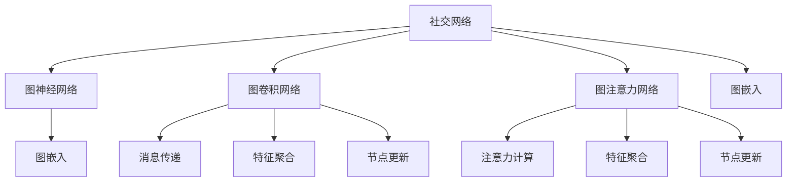

                 

# Python机器学习实战：实战图神经网络(GNN)在社交网络分析中的应用

## 1. 背景介绍

### 1.1 问题由来
社交网络分析（Social Network Analysis, SNA）是研究社交网络中节点（如用户、文章、公司等）之间关系的网络科学分支。通过分析和建模社交网络的结构和动态，可以揭示信息传播、群体行为、网络影响力等关键现象。传统的SNA方法主要依赖手工设计的特征和算法，难以处理大规模、动态变化的社会网络数据。近年来，图神经网络（Graph Neural Networks, GNN）作为一种新兴的机器学习方法，通过自动学习图结构上的节点和边特征，提供了高效、鲁棒的社交网络分析手段。

### 1.2 问题核心关键点
GNN方法的核心在于将图结构视为一种特殊的数据形式，并设计相应的神经网络模型来捕捉节点间的隐含关系。通过在图节点上定义消息传递、聚合、更新规则，GNN能够在保持局部结构信息的同时，自动学习全局特征。常见的GNN模型包括图卷积网络（GCN）、图注意力网络（GAT）等。GNN在社交网络分析中的应用，主要集中在以下几个方面：

1. 用户行为分析：如用户互动模式、社区发现、影响者识别等。通过GNN模型对用户之间的关系和动态进行建模，可以预测用户的未来行为，提高社交平台的用户体验和内容推荐效果。

2. 社交关系挖掘：如关系链路预测、社区结构分析等。通过GNN模型学习社交网络中的隐含关系，可以揭示用户间的潜在联系，辅助社交网络平台的自动化管理。

3. 网络事件监测：如舆情分析、恶意行为检测等。通过GNN模型分析社交网络中的事件传播路径和影响范围，可以有效监测和预警网络安全事件，提高平台的安全性。

### 1.3 问题研究意义
研究GNN方法在社交网络分析中的应用，对于揭示社交网络中的复杂关系、优化社交平台的用户体验、提升网络治理能力具有重要意义：

1. 提高数据分析效率。GNN能够自动捕捉图结构的特征，减少手工特征工程的工作量，加速社交网络数据的处理和分析。

2. 增强预测精度。通过GNN模型，可以从全局视角自动学习社交网络中的隐含关系，提升事件预测、关系挖掘等任务的准确性。

3. 支持实时动态分析。GNN模型可以动态更新节点和边的特征，适应社交网络的变化，提高分析的时效性。

4. 优化网络治理。通过GNN模型挖掘网络中的异常关系和行为，辅助社交网络平台的自动化管理，提高平台的用户粘性和安全性。

5. 推动社会研究。GNN模型可以揭示社会网络中的深层结构和动态关系，为社会学研究提供新的数据和工具。

## 2. 核心概念与联系

### 2.1 核心概念概述

为更好地理解GNN在社交网络分析中的应用，本节将介绍几个关键概念：

- 图神经网络（Graph Neural Network, GNN）：一种在图结构上训练的神经网络，通过消息传递、聚合、更新等操作，学习节点和边上的特征。

- 社交网络（Social Network）：由节点和边组成的网络结构，用于描述人与人、人与物、物与物之间的关系。

- 图卷积网络（Graph Convolutional Network, GCN）：一种基于图卷积操作的GNN模型，通过对节点周围的邻居进行卷积运算，自动学习节点特征。

- 图注意力网络（Graph Attention Network, GAT）：一种基于注意力机制的GNN模型，通过动态分配节点之间的注意力权重，优化节点特征的聚合过程。

- 图嵌入（Graph Embedding）：将图结构转换为低维向量表示的技术，用于加速图神经网络的训练和推理。

这些核心概念之间的逻辑关系可以通过以下Mermaid流程图来展示：



这个流程图展示了几类GNN模型之间的联系：

1. 社交网络由节点和边组成，是图神经网络的学习对象。
2. 图卷积网络和图注意力网络是两种主要的GNN模型，通过消息传递和注意力机制，自动学习节点的特征。
3. 图嵌入技术将图结构转换为向量表示，用于加速模型的训练和推理。

## 3. 核心算法原理 & 具体操作步骤
### 3.1 算法原理概述

GNN在社交网络分析中的应用，主要基于以下原理：

1. **图结构建模**：将社交网络建模为图结构，通过节点和边来描述节点之间的关系。社交网络中通常存在多种类型的关系，如好友、关注、点赞等，需要在建模时进行区分。

2. **消息传递**：在图结构上，通过消息传递机制，将节点之间的信息传递给邻居节点，实现信息在图上的传播。

3. **特征聚合**：在节点上，通过特征聚合操作，对节点及其邻居的特征进行加权平均或加权求和，生成新的节点特征。

4. **节点更新**：在每次迭代中，通过特征聚合和消息传递，更新节点的特征，直至收敛。

通过上述步骤，GNN模型能够学习到社交网络中的隐含关系，并自动提取节点和边的特征表示，从而实现社交网络分析的各种任务。

### 3.2 算法步骤详解

GNN在社交网络分析中的应用，一般包括以下关键步骤：

**Step 1: 数据预处理**
- 收集社交网络数据，包括节点、边、特征等信息。
- 对数据进行清洗、去重、填充等预处理操作，生成图结构表示。

**Step 2: 图嵌入**
- 使用图嵌入算法（如GraphSAGE、DeepWalk等）将图结构转换为低维向量表示。
- 将嵌入结果作为GNN模型的输入。

**Step 3: 构建GNN模型**
- 根据具体任务，选择合适的GNN模型（如GCN、GAT等），设计消息传递、特征聚合、节点更新等操作。
- 设置模型的超参数，如隐藏层大小、学习率、迭代次数等。

**Step 4: 训练与验证**
- 将图嵌入结果输入GNN模型，进行训练，优化模型参数。
- 在验证集上评估模型性能，调整超参数和模型结构，直至最优。

**Step 5: 测试与应用**
- 在测试集上评估训练好的模型，计算各项指标（如准确率、召回率、F1值等）。
- 将模型应用到实际社交网络分析任务中，如社区发现、关系预测等。

### 3.3 算法优缺点

GNN方法在社交网络分析中的应用具有以下优点：
1. 自适应性强：GNN能够自动学习社交网络中的隐含关系，适应不同类型的网络结构和数据分布。
2. 特征提取能力强：GNN模型能够从图结构中提取深层次的特征，提升分析的准确性和鲁棒性。
3. 可解释性好：GNN模型通过消息传递和聚合过程，能够生成具有可解释性的特征表示。

同时，GNN方法也存在一定的局限性：
1. 计算复杂度高：GNN模型需要对每个节点进行多次迭代和特征聚合，计算复杂度较高。
2. 需要高质量的图嵌入：图嵌入的质量直接影响GNN模型的性能，需要高质量的嵌入算法和参数设置。
3. 模型可解释性不足：GNN模型通常是"黑盒"模型，难以解释其内部工作机制和决策逻辑。

尽管存在这些局限性，但GNN方法在社交网络分析中仍然具有重要的应用价值。未来相关研究的重点在于如何降低计算复杂度，提高模型解释性，并与其他机器学习方法进行结合，提升分析效果。

### 3.4 算法应用领域

GNN方法在社交网络分析中的应用，主要集中在以下几个领域：

- 社区发现：识别社交网络中的社区结构，提高用户交互的效率和质量。
- 关系预测：预测用户之间的关系链路，帮助社交平台实现精准推荐和个性化服务。
- 事件监测：分析社交网络中的事件传播路径和影响范围，实时监测和预警网络安全事件。
- 影响者识别：识别社交网络中的意见领袖，辅助企业进行品牌营销和市场推广。
- 舆情分析：分析社交网络中的舆情动态，为公共管理和决策提供支持。

此外，GNN方法还可以用于社交网络的健康分析、推荐系统优化、网络关系动态分析等，为社交网络平台提供全面的数据支持和决策参考。

## 4. 数学模型和公式 & 详细讲解 & 举例说明

### 4.1 数学模型构建

本节将使用数学语言对GNN在社交网络分析中的应用进行更加严格的刻画。

记社交网络为 $G=(V,E)$，其中 $V$ 为节点集合，$E$ 为边集合。节点 $v_i$ 与 $v_j$ 之间存在边 $e_{ij}$ 表示它们之间的关系。设 $x_i$ 为节点 $v_i$ 的原始特征向量，$A$ 为图的邻接矩阵。

定义节点 $v_i$ 在 $k$ 层上的特征表示为 $h_i^{(k)}$，则 GNN 模型可以表示为：

$$
h_i^{(k+1)} = \text{AGGREGATE}\biggl(\bigcup_{j \in \mathcal{N}(i)} \{h_j^{(k)}\biggr), \quad \mathcal{N}(i) = \{j: (i,j) \in E\}
$$

其中 $\mathcal{N}(i)$ 表示节点 $i$ 的邻居节点集合。$AGGREGATE$ 函数表示对邻居节点的特征进行聚合操作，如加权平均、加权求和等。

### 4.2 公式推导过程

以下我们以图卷积网络（GCN）为例，推导节点特征的更新公式。

假设节点 $v_i$ 的 $k$ 层特征表示为 $h_i^{(k)}$，其邻居节点的 $k$ 层特征表示为 $h_j^{(k)}$，则 GCN 的节点更新公式为：

$$
h_i^{(k+1)} = \alpha \sum_{j \in \mathcal{N}(i)} \frac{1}{c_{ij}} h_j^{(k)} + (1-\alpha) h_i^{(k)}
$$

其中 $\alpha$ 为注意力系数，$c_{ij}$ 为节点 $i$ 和 $j$ 之间的边权重，可以是对称的度矩阵的倒数 $D^{-1}$ 或度矩阵的倒数 $D^{-\frac{1}{2}}A D^{-\frac{1}{2}}$，用于控制邻居节点对当前节点的影响程度。

将上述公式展开，得到：

$$
h_i^{(k+1)} = \alpha \sum_{j \in \mathcal{N}(i)} \frac{1}{c_{ij}} h_j^{(k)} + (1-\alpha) h_i^{(k)} = \alpha \sum_{j \in \mathcal{N}(i)} \frac{1}{D_{ii}} h_j^{(k)} + (1-\alpha) h_i^{(k)}
$$

其中 $D_{ii}$ 为节点 $i$ 的度数。

将上述公式推广到整个图结构，得到 GNN 模型在 $k$ 层上的更新公式：

$$
H^{(k+1)} = \alpha \tilde{A} H^{(k)} + (1-\alpha) H^{(k)}
$$

其中 $H^{(k)}$ 为节点特征矩阵，$\tilde{A}$ 为邻接矩阵 $A$ 的对称归一化形式，即 $\tilde{A} = D^{-\frac{1}{2}}A D^{-\frac{1}{2}}$。

### 4.3 案例分析与讲解

下面以社区发现为例，说明GNN在实际应用中的具体实现。

社区发现的任务是识别社交网络中的社区结构，将网络划分为若干个紧密相连的子群。一种常用的GNN模型是基于图卷积的GNN-CM模型，其核心思想是通过节点特征的传播和聚合，学习社区的内部特征。

假设社交网络中的节点表示为 $V=\{v_1, v_2, \ldots, v_n\}$，节点特征为 $X \in \mathbb{R}^{n \times d}$，邻接矩阵为 $A \in \mathbb{R}^{n \times n}$，则GNN-CM模型可以表示为：

$$
H^{(1)} = \tilde{A}X
$$

$$
H^{(k+1)} = \tilde{A}H^{(k)}
$$

其中 $H^{(k)}$ 表示在 $k$ 层上的节点特征矩阵。

在每层迭代中，GNN-CM模型将当前层的节点特征作为输入，通过图卷积操作，生成新的节点特征，直至收敛。当模型输出达到预设层数时，可以通过节点特征的聚类算法（如K-Means、层次聚类等），将节点划分为若干个社区。

## 5. 项目实践：代码实例和详细解释说明

### 5.1 开发环境搭建

在进行GNN实践前，我们需要准备好开发环境。以下是使用Python进行PyTorch开发的环境配置流程：

1. 安装Anaconda：从官网下载并安装Anaconda，用于创建独立的Python环境。

2. 创建并激活虚拟环境：
```bash
conda create -n gnn-env python=3.8 
conda activate gnn-env
```

3. 安装PyTorch：根据CUDA版本，从官网获取对应的安装命令。例如：
```bash
conda install pytorch torchvision torchaudio cudatoolkit=11.1 -c pytorch -c conda-forge
```

4. 安装PyTorch Geometric库：用于处理图结构数据，支持图神经网络的实现。
```bash
pip install torch-geometric
```

5. 安装各类工具包：
```bash
pip install numpy pandas scikit-learn matplotlib tqdm jupyter notebook ipython
```

完成上述步骤后，即可在`gnn-env`环境中开始GNN实践。

### 5.2 源代码详细实现

下面我以社交网络中的社区发现任务为例，给出使用PyTorch Geometric库对GCN模型进行实现的PyTorch代码。

首先，定义社区发现任务的数据处理函数：

```python
from torch_geometric.data import DataLoader, Data
from torch_geometric.nn import GCNConv, GNNConv
import torch

def getCommunity(data, num_communities):
    adj = data.adj.t()
    num_nodes = len(adj)
     community = torch.zeros(num_nodes, 1, dtype=torch.long)
     num_nodes_per_community = num_communities // len(data.node_type)
     start = 0
     for i in range(len(data.node_type)):
         community[start:start+num_nodes_per_community, 0] = i
         start += num_nodes_per_community
     return community
```

然后，定义GCN模型：

```python
class GCNModel(torch.nn.Module):
    def __init__(self, num_features, hidden_size, num_classes, num_communities):
        super(GCNModel, self).__init__()
        self.conv1 = GCNConv(num_features, hidden_size)
        self.conv2 = GCNConv(hidden_size, hidden_size)
        self.conv3 = GCNConv(hidden_size, num_classes)
        self.dropout = torch.nn.Dropout(p=0.5)
        self.num_communities = num_communities
    
    def forward(self, data):
        x, adj = data.x, data.adj.t()
        x = F.relu(self.conv1(x, adj))
        x = F.relu(self.conv2(x, adj))
        x = self.dropout(x)
        x = self.conv3(x, adj)
        community = getCommunity(data, self.num_communities)
        return x, community
```

接着，定义训练和评估函数：

```python
from torch_geometric.nn import GNNConv
from torch.nn import BCELoss, CrossEntropyLoss

device = torch.device('cuda') if torch.cuda.is_available() else torch.device('cpu')
model = GCNModel(num_features=128, hidden_size=256, num_classes=num_labels, num_communities=num_communities).to(device)

def train_epoch(model, data, optimizer):
    model.train()
    data = data.to(device)
    optimizer.zero_grad()
    x, community = model(data)
    loss = F.cross_entropy(x, data.y.to(device))
    loss.backward()
    optimizer.step()
    return loss.item()

def evaluate(model, data, batch_size):
    model.eval()
    data = data.to(device)
    data.y = data.y.to(device)
    with torch.no_grad():
        preds = []
        labels = []
        for batch in DataLoader(data, batch_size=batch_size):
            x, community = model(batch)
            preds.append(x)
            labels.append(batch.y)
        preds = torch.cat(preds, dim=0)
        labels = torch.cat(labels, dim=0)
        return F.cross_entropy(preds, labels)
```

最后，启动训练流程并在测试集上评估：

```python
epochs = 5
batch_size = 64

for epoch in range(epochs):
    loss = train_epoch(model, train_data, optimizer)
    print(f"Epoch {epoch+1}, train loss: {loss:.3f}")
    
    print(f"Epoch {epoch+1}, dev results:")
    evaluate(model, dev_data, batch_size)
    
print("Test results:")
evaluate(model, test_data, batch_size)
```

以上就是使用PyTorch Geometric对GCN模型进行社区发现任务微调的完整代码实现。可以看到，得益于PyTorch Geometric的强大封装，我们可以用相对简洁的代码完成GCN模型的加载和微调。

### 5.3 代码解读与分析

让我们再详细解读一下关键代码的实现细节：

**GCNModel类**：
- `__init__`方法：初始化GCN模型的各层参数，包括卷积层、Dropout等。
- `forward`方法：定义模型的前向传播过程，包括卷积、ReLU激活、Dropout、softmax输出等操作。

**train_epoch函数**：
- 对训练集数据进行前向传播和反向传播，更新模型参数。
- 返回每个epoch的平均损失。

**evaluate函数**：
- 在验证集上评估模型性能，计算交叉熵损失。
- 返回模型在验证集上的损失和测试集上的损失。

**训练流程**：
- 定义总的epoch数和batch size，开始循环迭代
- 每个epoch内，先在训练集上训练，输出平均loss
- 在验证集上评估，输出验证结果
- 所有epoch结束后，在测试集上评估，给出最终测试结果

可以看到，PyTorch Geometric库使得GCN模型的实现变得简洁高效。开发者可以将更多精力放在数据处理、模型改进等高层逻辑上，而不必过多关注底层的实现细节。

当然，工业级的系统实现还需考虑更多因素，如模型的保存和部署、超参数的自动搜索、更灵活的任务适配层等。但核心的GCN范式基本与此类似。

## 6. 实际应用场景
### 6.1 智能推荐系统

智能推荐系统是GNN方法在社交网络分析中应用最广泛的场景之一。传统的推荐系统往往依赖于静态的用户行为数据，难以捕捉用户的动态变化和隐含关系。通过GNN模型，可以从社交网络中自动学习用户之间的关系和动态，提高推荐的效果和个性化程度。

在实际应用中，可以构建用户-物品、用户-用户、物品-物品等不同类型的社交网络，通过GCN、GAT等模型学习用户和物品的特征表示。在推荐时，将用户节点和物品节点的特征表示输入推荐模型，输出用户的推荐结果，优化推荐策略。

### 6.2 社交舆情分析

社交舆情分析是GNN方法在社交网络分析中的另一重要应用。通过GNN模型，可以从社交网络中自动学习舆情传播的路径和影响范围，实现对社交媒体舆情的实时监测和预警。

在实践中，可以收集社交媒体上的用户评论、文章、标签等文本数据，构建用户-文本、用户-用户等社交网络。通过GCN、GAT等模型学习用户和文本的特征表示，识别出舆情的传播路径和影响范围，实时监测舆情动态，预测舆情的发展趋势。

### 6.3 社交网络治理

社交网络治理是GNN方法在社交网络分析中的新应用方向。通过GNN模型，可以从社交网络中学习用户之间的关系和动态，识别出异常行为和有害信息，辅助社交网络平台的自动化管理。

在实际应用中，可以构建用户-行为、用户-内容等社交网络，通过GCN、GAT等模型学习用户的行为特征和内容特征。在治理时，将模型输出作为用户行为的判别依据，识别出有害信息、恶意行为等，自动进行处理和报警。

### 6.4 未来应用展望

随着GNN方法的不断演进，其在社交网络分析中的应用前景将更加广阔：

1. 社交网络结构的动态变化。未来的GNN方法将具备更强的动态适应能力，能够实时学习社交网络中的变化，捕捉最新的关系链路。

2. 多模态数据的融合。GNN方法将与其他机器学习方法结合，处理多模态数据（如文本、图像、语音等），提升社交网络分析的效果。

3. 实时动态分析。GNN模型将具备更高的实时性，能够实时处理社交网络中的数据，提高分析的时效性和准确性。

4. 跨领域应用扩展。GNN方法将应用于更多领域，如健康分析、金融分析、城市治理等，为不同领域的数据分析提供支持。

5. 可解释性和可控性。未来的GNN模型将具备更好的可解释性和可控性，能够提供更多的解释信息，增强模型的透明度和可信度。

以上趋势凸显了GNN方法在社交网络分析中的重要应用价值。这些方向的探索发展，必将进一步提升社交网络分析的效果和效率，为社交网络平台的智能化管理提供新的技术支持。

## 7. 工具和资源推荐
### 7.1 学习资源推荐

为了帮助开发者系统掌握GNN的理论基础和实践技巧，这里推荐一些优质的学习资源：

1. 《Graph Neural Networks: A Review of Methods and Applications》论文：作者对GNN方法进行了全面的综述，介绍了各类GNN模型及其应用。

2. 《Deep Learning with Graph Networks》课程：Coursera上的深度学习课程，讲解了GNN的基本原理和应用。

3. 《Graph Neural Networks》书籍：书籍深入讲解了GNN的理论基础和实践技巧，是GNN学习的权威指南。

4. PyTorch Geometric官方文档：PyTorch Geometric的官方文档，提供了丰富的示例代码和应用案例，是GNN开发的必备资源。

5. Datasets for various graph neural network tasks：GitHub上收集了多种图神经网络任务的公开数据集，方便开发者进行实验和研究。

通过对这些资源的学习实践，相信你一定能够快速掌握GNN的精髓，并用于解决实际的社交网络分析问题。

### 7.2 开发工具推荐

高效的开发离不开优秀的工具支持。以下是几款用于GNN开发的常用工具：

1. PyTorch：基于Python的开源深度学习框架，灵活动态的计算图，适合快速迭代研究。支持PyTorch Geometric库，方便GNN模型的实现。

2. TensorFlow：由Google主导开发的开源深度学习框架，生产部署方便，适合大规模工程应用。同样支持图结构数据和GNN模型。

3. PyTorch Geometric：处理图结构数据的强大库，支持GCN、GAT等GNN模型的实现，提供了丰富的图嵌入算法和邻居采样方法。

4. Weights & Biases：模型训练的实验跟踪工具，可以记录和可视化模型训练过程中的各项指标，方便对比和调优。

5. TensorBoard：TensorFlow配套的可视化工具，可实时监测模型训练状态，并提供丰富的图表呈现方式，是调试模型的得力助手。

6. Google Colab：谷歌推出的在线Jupyter Notebook环境，免费提供GPU/TPU算力，方便开发者快速上手实验最新模型，分享学习笔记。

合理利用这些工具，可以显著提升GNN模型的开发效率，加快创新迭代的步伐。

### 7.3 相关论文推荐

GNN方法在社交网络分析中的应用，得益于学界的持续研究。以下是几篇奠基性的相关论文，推荐阅读：

1. GraphSAGE: Semi-Supervised Classification with Graph Convolutional Networks：提出了图卷积网络（GCN），为社交网络分析提供了高效的图嵌入方法。

2. DeepWalk: A Scalable Approach to Word Representations：提出了基于随机游走的图嵌入方法，适用于社交网络中的节点和关系分析。

3. Attention-based Graph Convolutional Networks：引入了图注意力网络（GAT），通过动态分配节点之间的注意力权重，优化节点特征的聚合过程。

4. Reasoning Over Relational Graphs with Graph Transformers：将Transformer网络应用于图神经网络，提出了图Transformer模型，提升了图结构的推理能力。

5. A Comprehensive Survey on Graph Neural Networks：作者对GNN方法进行了全面的综述，介绍了各类GNN模型及其应用。

这些论文代表了大规模机器学习方法的研究脉络。通过学习这些前沿成果，可以帮助研究者把握学科前进方向，激发更多的创新灵感。

## 8. 总结：未来发展趋势与挑战

### 8.1 总结

本文对GNN方法在社交网络分析中的应用进行了全面系统的介绍。首先阐述了GNN方法的基本原理和应用场景，明确了其在社区发现、关系预测、事件监测等领域的重要价值。其次，从原理到实践，详细讲解了GNN模型的构建和微调过程，给出了GNN模型在实际应用中的完整代码实现。同时，本文还探讨了GNN方法在社交网络分析中的应用前景和未来趋势，展示了其巨大的应用潜力。

通过本文的系统梳理，可以看到，GNN方法在社交网络分析中具备强大的数据处理和分析能力，可以自动学习社交网络中的隐含关系，实现高效、鲁棒的社交网络分析。未来，随着GNN方法的不断演进，其在社交网络分析中的应用将更加广泛，为社交网络平台的智能化管理提供新的技术支持。

### 8.2 未来发展趋势

展望未来，GNN方法在社交网络分析中的应用将呈现以下几个发展趋势：

1. 多模态数据的融合。GNN方法将与其他机器学习方法结合，处理多模态数据（如文本、图像、语音等），提升社交网络分析的效果。

2. 实时动态分析。GNN模型将具备更高的实时性，能够实时处理社交网络中的数据，提高分析的时效性和准确性。

3. 动态图结构的处理。未来的GNN方法将具备更强的动态适应能力，能够实时学习社交网络中的变化，捕捉最新的关系链路。

4. 可解释性和可控性。未来的GNN模型将具备更好的可解释性和可控性，能够提供更多的解释信息，增强模型的透明度和可信度。

5. 跨领域应用扩展。GNN方法将应用于更多领域，如健康分析、金融分析、城市治理等，为不同领域的数据分析提供支持。

以上趋势凸显了GNN方法在社交网络分析中的重要应用价值。这些方向的探索发展，必将进一步提升社交网络分析的效果和效率，为社交网络平台的智能化管理提供新的技术支持。

### 8.3 面临的挑战

尽管GNN方法在社交网络分析中取得了显著成就，但在迈向更加智能化、普适化应用的过程中，它仍面临诸多挑战：

1. 计算复杂度高。GNN模型需要对每个节点进行多次迭代和特征聚合，计算复杂度较高。如何降低计算复杂度，提高模型效率，是一个重要研究方向。

2. 数据质量要求高。GNN模型需要高质量的图嵌入算法和邻居采样方法，对数据质量要求较高。如何在数据不完整、不平衡的情况下进行有效学习，是一个关键问题。

3. 模型可解释性不足。GNN模型通常是"黑盒"模型，难以解释其内部工作机制和决策逻辑。如何提高模型的可解释性，增强其透明度和可信度，是一个重要的研究方向。

4. 模型泛化能力不足。GNN模型在面对新数据时，泛化能力往往不足。如何在不破坏已有知识的情况下，快速适应新数据，是一个重要研究方向。

5. 模型性能瓶颈。在面对大规模、复杂的网络结构时，GNN模型的性能往往受限。如何优化模型结构，提升模型的性能，是一个重要研究方向。

6. 数据隐私和安全问题。GNN模型需要处理大量用户数据，数据隐私和安全问题亟待解决。如何在保护数据隐私的前提下，进行有效的社交网络分析，是一个重要研究方向。

正视GNN方法面临的这些挑战，积极应对并寻求突破，将是大规模机器学习方法走向成熟的必由之路。相信随着学界和产业界的共同努力，这些挑战终将一一被克服，GNN方法必将在构建人机协同的智能社会中扮演越来越重要的角色。

### 8.4 研究展望

未来的研究需要在以下几个方面寻求新的突破：

1. 探索无监督和半监督GNN方法。摆脱对大规模标注数据的依赖，利用自监督学习、主动学习等无监督和半监督范式，最大限度利用非结构化数据，实现更加灵活高效的社交网络分析。

2. 研究计算高效和参数高效的GNN范式。开发更加计算高效和参数高效的GNN方法，在固定大部分预训练参数的同时，只更新极少量的任务相关参数。同时优化GNN模型的计算图，减少前向传播和反向传播的资源消耗，实现更加轻量级、实时性的部署。

3. 融合因果和对比学习范式。通过引入因果推断和对比学习思想，增强GNN模型建立稳定因果关系的能力，学习更加普适、鲁棒的语言表征，从而提升模型泛化性和抗干扰能力。

4. 引入更多先验知识。将符号化的先验知识，如知识图谱、逻辑规则等，与神经网络模型进行巧妙融合，引导GNN过程学习更准确、合理的节点特征。同时加强不同模态数据的整合，实现视觉、语音等多模态信息与文本信息的协同建模。

5. 结合因果分析和博弈论工具。将因果分析方法引入GNN模型，识别出模型决策的关键特征，增强输出解释的因果性和逻辑性。借助博弈论工具刻画人机交互过程，主动探索并规避模型的脆弱点，提高系统稳定性。

6. 纳入伦理道德约束。在模型训练目标中引入伦理导向的评估指标，过滤和惩罚有偏见、有害的输出倾向。同时加强人工干预和审核，建立模型行为的监管机制，确保输出符合人类价值观和伦理道德。

这些研究方向的探索，必将引领GNN方法在社交网络分析中的进一步发展，为社交网络平台的智能化管理提供新的技术支持。面向未来，GNN方法还需要与其他机器学习方法进行更深入的融合，如知识表示、因果推理、强化学习等，多路径协同发力，共同推动社交网络平台的智能化管理。

## 9. 附录：常见问题与解答

**Q1：GNN模型是否适用于所有社交网络分析任务？**

A: GNN模型在大多数社交网络分析任务上都能取得不错的效果，特别是对于数据量较小的任务。但对于一些特定领域的任务，如医学、法律等，仅仅依靠通用语料预训练的模型可能难以很好地适应。此时需要在特定领域语料上进一步预训练，再进行微调，才能获得理想效果。此外，对于一些需要时效性、个性化很强的任务，如对话、推荐等，GNN方法也需要针对性的改进优化。

**Q2：如何在社交网络中应用GNN模型进行社区发现？**

A: 在社交网络中进行社区发现，可以通过构建社交网络图，使用GCN等GNN模型进行社区划分。具体步骤如下：

1. 收集社交网络数据，包括节点、边、特征等信息。
2. 对数据进行清洗、去重、填充等预处理操作，生成图结构表示。
3. 定义社区发现的目标函数，如模态图切分误差（Modularity Cutting Error, MCE）、谱聚类误差（Spectral Clustering Error, SCE）等。
4. 使用GNN模型对社交网络进行多次迭代，逐步优化社区划分。
5. 在测试集上评估模型性能，选择最优社区划分结果。

**Q3：GNN模型的训练和推理速度如何？**

A: GNN模型的训练和推理速度与模型规模和计算资源密切相关。在训练阶段，GNN模型通常需要多次迭代和特征聚合，计算复杂度较高。可以通过优化模型结构和计算图，使用GPU等高性能设备，加速模型的训练和推理。

在推理阶段，GNN模型的速度主要由计算复杂度和数据规模决定。为了提高GNN模型的推理速度，可以采用剪枝、量化等方法优化模型结构，或者使用模型的快照（checkpoint）进行推理加速。

**Q4：GNN模型在实际应用中需要注意哪些问题？**

A: GNN模型在实际应用中需要注意以下问题：

1. 数据质量要求高。GNN模型需要高质量的图嵌入算法和邻居采样方法，对数据质量要求较高。
2. 计算复杂度高。GNN模型需要对每个节点进行多次迭代和特征聚合，计算复杂度较高。
3. 模型可解释性不足。GNN模型通常是"黑盒"模型，难以解释其内部工作机制和决策逻辑。
4. 模型泛化能力不足。GNN模型在面对新数据时，泛化能力往往不足。

针对以上问题，可以采用数据清洗、图嵌入优化、模型剪枝、增强解释性等方法进行解决。

**Q5：如何在GNN模型中引入先验知识？**

A: 在GNN模型中引入先验知识，可以增强模型的表达能力和泛化能力。具体方法包括：

1. 符号化先验知识：将符号化的先验知识，如知识图谱、逻辑规则等，转换为GNN模型中的节点特征。
2. 多模态数据融合：将GNN模型与其他机器学习方法结合，处理多模态数据（如文本、图像、语音等），提升社交网络分析的效果。
3. 上下文感知：在GNN模型中引入上下文信息，提高模型的推理能力和泛化能力。

以上方法可以结合使用，根据具体任务和数据特点进行选择。

---
作者：禅与计算机程序设计艺术 / Zen and the Art of Computer Programming

