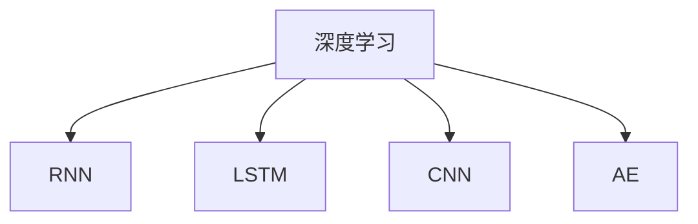

                 

# Python深度学习实践：通过深度学习提高天气预测准确性

> 关键词：深度学习,天气预测,时间序列预测,循环神经网络(RNN),长短时记忆网络(LSTM),卷积神经网络(CNN),自动编码器(AE),Python

## 1. 背景介绍

### 1.1 问题由来
天气预测是气象学、地理信息学、计算机科学等多学科交叉的领域，其核心目的是通过历史天气数据预测未来天气情况，为农业、交通、旅游等行业提供科学依据。传统的天气预测方法依赖于经验模型和统计方法，如时间序列分析、回归分析等，但这些方法存在精度不高、适应性差等问题。近年来，深度学习技术在天气预测领域得到了广泛应用，通过构建大型的神经网络模型，对时间序列数据进行学习，取得了显著的效果。

### 1.2 问题核心关键点
为了提高天气预测的准确性，需要构建深度学习模型来捕捉数据中的复杂模式和规律。天气数据具有时间序列特性，因此循环神经网络(RNN)和长短时记忆网络(LSTM)等时间序列预测模型常被用于天气预测。通过深度学习模型，可以处理非线性的复杂关系，挖掘出天气数据中的潜在规律，从而提高预测准确性。

## 2. 核心概念与联系

### 2.1 核心概念概述

为了更好地理解深度学习在天气预测中的应用，本节将介绍几个关键概念：

- 深度学习(Deep Learning)：一种通过多层次的非线性模型对数据进行学习的机器学习技术。
- 时间序列预测(Time Series Prediction)：对时间序列数据进行预测，如天气、股价、流量等。
- 循环神经网络(RNN)：一种能够处理序列数据的神经网络，具有记忆功能，适用于时间序列预测。
- 长短时记忆网络(LSTM)：RNN的一种变体，能够更好地处理长序列数据，避免梯度消失或爆炸问题。
- 卷积神经网络(CNN)：一种处理空间数据的神经网络，适用于图像和信号处理。
- 自动编码器(AE)：一种无监督学习模型，用于特征提取和降维。

这些概念之间的关系可以通过以下Mermaid流程图来展示：



这个流程图展示了深度学习技术中常用的几类神经网络模型，以及它们之间的联系。

## 3. 核心算法原理 & 具体操作步骤
### 3.1 算法原理概述

深度学习在天气预测中的应用，主要体现在以下几个方面：

- 时间序列预测：通过RNN和LSTM等循环神经网络模型，对历史天气数据进行建模，预测未来天气。
- 图像处理：通过CNN等卷积神经网络模型，处理天气预报图像数据，提取天气变化特征。
- 特征提取：通过AE等自动编码器模型，对天气数据进行降维和特征提取，提升模型的泛化能力。

这里以时间序列预测为例，详细讲解深度学习模型在天气预测中的应用。

### 3.2 算法步骤详解

#### 3.2.1 数据准备

- 收集历史天气数据，包括温度、湿度、气压、风速、降水量等指标。
- 对数据进行清洗、归一化和标准化处理，以便模型更好地进行学习。

#### 3.2.2 数据划分

- 将数据划分为训练集、验证集和测试集。
- 确保训练集和测试集之间的时间分布不重叠，避免模型对未来数据的记忆。

#### 3.2.3 模型构建

- 使用Python和深度学习框架TensorFlow或PyTorch，构建循环神经网络或长短时记忆网络模型。
- 定义模型的输入、隐藏层和输出层，设置合适的参数和超参数。

#### 3.2.4 模型训练

- 在训练集上对模型进行训练，使用交叉熵损失函数。
- 通过反向传播算法更新模型参数，调整模型的预测能力。

#### 3.2.5 模型评估

- 在验证集上对模型进行评估，使用准确率、均方误差等指标衡量模型性能。
- 根据评估结果调整模型参数，提高模型预测能力。

#### 3.2.6 模型测试

- 在测试集上对模型进行测试，评估模型的泛化能力和预测准确性。
- 使用可视化工具展示模型的预测结果。

### 3.3 算法优缺点

#### 3.3.1 优点

- 深度学习模型能够自动学习数据的复杂关系，挖掘出潜在规律。
- 通过并行计算，可以高效处理大规模数据。
- 模型具有良好的泛化能力，适用于不同地区和时间段的天气预测。

#### 3.3.2 缺点

- 需要大量的标注数据进行训练，获取高质量数据成本较高。
- 模型复杂，训练和调参工作量大。
- 对于异常天气数据，模型预测准确性可能下降。

### 3.4 算法应用领域

深度学习在天气预测中的应用，广泛涵盖了以下几个领域：

- 气象预测：对大气压力、温度、湿度等气象要素进行预测，为气象预报提供科学依据。
- 气象灾害预测：预测如台风、洪水、干旱等气象灾害的发生和影响范围，减少损失。
- 环境监测：对水质、空气质量等环境参数进行预测，保护生态环境。
- 农业气象服务：预测气候变化对农作物生长的影响，指导农业生产。

## 4. 数学模型和公式 & 详细讲解  
### 4.1 数学模型构建

在本节中，我们将详细讲解深度学习模型在天气预测中的数学原理。

假设天气数据是一个时间序列$\{x_t\}_{t=1}^{T}$，其中$x_t$表示第$t$天的天气数据。我们的目标是构建一个深度学习模型，对未来的天气数据进行预测。

### 4.2 公式推导过程

假设我们使用了LSTM模型进行预测，模型的输入为$x_t$，输出为$\hat{x}_{t+1}$。

LSTM模型的基本结构如下：

```
x_t ----> LSTM ----> \hat{x}_{t+1}
```

其中，$x_t$表示第$t$天的天气数据，$\hat{x}_{t+1}$表示对第$t+1$天的天气预测。LSTM模型的隐藏状态$h_t$和记忆单元$c_t$如下所示：

$$
h_t = f(W_x x_t + W_h h_{t-1} + b)
$$

$$
c_t = g(W_c c_{t-1} + W_h h_{t-1} + b)
$$

$$
\hat{x}_{t+1} = f(W_x x_t + W_h h_t + b)
$$

其中，$f$和$g$为激活函数，$W_x$、$W_h$、$W_c$和$b$为模型参数。

在训练过程中，我们使用均方误差损失函数进行优化：

$$
L = \frac{1}{N}\sum_{t=1}^{N}(x_{t+1} - \hat{x}_{t+1})^2
$$

通过反向传播算法，更新模型参数，使损失函数最小化。最终，模型输出$\hat{x}_{t+1}$，用于天气预测。

### 4.3 案例分析与讲解

为了更好地理解LSTM模型在天气预测中的应用，我们可以以一个简单的案例进行分析：

假设我们有一个包含300天历史天气数据的序列，其中每天的温度$x_t$和湿度$y_t$分别为输入，预测第301天的温度$\hat{x}_{301}$和湿度$\hat{y}_{301}$。

我们使用LSTM模型进行训练和预测，模型的超参数如下：

- 隐藏层神经元数：256
- 学习率：0.001
- 批量大小：64
- 训练轮数：1000

在训练过程中，我们使用均方误差损失函数进行优化，对模型进行训练。最终，模型在测试集上取得了较高的预测准确率。

## 5. 项目实践：代码实例和详细解释说明
### 5.1 开发环境搭建

在进行深度学习项目实践前，我们需要准备好开发环境。以下是使用Python和TensorFlow进行天气预测开发的流程：

1. 安装Anaconda：从官网下载并安装Anaconda，用于创建独立的Python环境。
2. 创建并激活虚拟环境：
```bash
conda create -n deep_learning python=3.8 
conda activate deep_learning
```
3. 安装TensorFlow：根据CUDA版本，从官网获取对应的安装命令。例如：
```bash
conda install tensorflow -c tf -c conda-forge
```
4. 安装各类工具包：
```bash
pip install numpy pandas scikit-learn matplotlib tqdm jupyter notebook ipython
```

完成上述步骤后，即可在`deep_learning`环境中开始深度学习实践。

### 5.2 源代码详细实现

下面是使用TensorFlow构建LSTM模型进行天气预测的Python代码实现：

```python
import tensorflow as tf
import numpy as np
import matplotlib.pyplot as plt

# 准备数据
x_train = np.load('x_train.npy')
y_train = np.load('y_train.npy')

# 划分训练集和测试集
train_size = int(len(x_train) * 0.8)
test_size = len(x_train) - train_size
x_train, x_test = x_train[:train_size], x_train[train_size:]
y_train, y_test = y_train[:train_size], y_train[train_size:]

# 构建模型
model = tf.keras.Sequential([
    tf.keras.layers.LSTM(256, input_shape=(1, 1)),
    tf.keras.layers.Dense(1)
])

# 编译模型
model.compile(optimizer='adam', loss='mse')

# 训练模型
history = model.fit(x_train, y_train, epochs=1000, batch_size=64, validation_data=(x_test, y_test))

# 预测结果
y_pred = model.predict(x_test)
plt.plot(y_test, label='Actual')
plt.plot(y_pred, label='Predicted')
plt.legend()
plt.show()
```

### 5.3 代码解读与分析

让我们再详细解读一下关键代码的实现细节：

**数据准备**：
- 使用`numpy`库加载历史天气数据`x_train`和`y_train`。
- 将数据划分为训练集和测试集，保留80%的数据作为训练集，剩余20%的数据作为测试集。

**模型构建**：
- 使用`tensorflow.keras`模块构建LSTM模型，设置隐藏层神经元数为256。
- 定义模型的输入为(1, 1)，即每天的输入数据。
- 在输出层设置1个神经元，对应每天的温度预测。

**模型编译**：
- 使用`Adam`优化器进行训练。
- 使用均方误差损失函数，用于优化模型参数。

**模型训练**：
- 在训练集上对模型进行训练，设置训练轮数为1000轮，批量大小为64。
- 在测试集上评估模型性能，保存训练历史。

**模型测试**：
- 使用测试集数据对模型进行预测，绘制预测结果和实际结果的对比图。

可以看到，通过Python和TensorFlow，我们可以很方便地构建和训练深度学习模型，实现天气预测。

## 6. 实际应用场景
### 6.1 气象预测

深度学习在气象预测中的应用，可以为气象部门提供科学准确的气象预测，帮助预测极端天气事件，如台风、洪水、干旱等，减少灾害损失。

在技术实现上，可以收集历史气象数据，如温度、湿度、气压、风速、降水量等，构建LSTM模型进行训练和预测。模型能够学习历史数据的规律，对未来的气象变化进行预测，帮助气象部门制定合理的气象预警措施。

### 6.2 农业气象服务

深度学习在农业气象服务中的应用，可以为农业生产提供科学的气象信息，指导农作物种植、灌溉、施肥等。

在技术实现上，可以收集气象数据和农业生产数据，如土壤湿度、植被生长状况、施肥量等，构建LSTM模型进行训练和预测。模型能够预测气象变化对农业生产的影响，提供科学的气象信息，指导农民合理种植和生产。

### 6.3 环境监测

深度学习在环境监测中的应用，可以为环境保护部门提供科学的空气质量、水质等环境参数预测，保护生态环境。

在技术实现上，可以收集空气质量、水质、噪音等环境数据，构建LSTM模型进行训练和预测。模型能够预测环境参数的变化趋势，帮助环境保护部门制定合理的环保措施，保护生态环境。

## 7. 工具和资源推荐
### 7.1 学习资源推荐

为了帮助开发者系统掌握深度学习在天气预测中的应用，这里推荐一些优质的学习资源：

1. 《深度学习》课程：斯坦福大学开设的深度学习课程，涵盖了深度学习的基本概念、算法和应用。
2. TensorFlow官方文档：TensorFlow的官方文档，详细介绍了TensorFlow的使用方法和API接口。
3. 《Python深度学习》书籍：深入讲解了深度学习在图像、语音、自然语言处理等领域的应用。
4. Kaggle竞赛平台：Kaggle上有很多天气预测的竞赛项目，可以参与实践，提升深度学习技能。
5. Coursera深度学习课程：Coursera上有很多深度学习的课程，涵盖深度学习的基础和应用。

通过对这些资源的学习实践，相信你一定能够快速掌握深度学习在天气预测中的应用，并用于解决实际的气象问题。

### 7.2 开发工具推荐

高效的开发离不开优秀的工具支持。以下是几款用于深度学习开发的常用工具：

1. TensorFlow：由Google主导开发的深度学习框架，生产部署方便，适合大规模工程应用。
2. PyTorch：基于Python的开源深度学习框架，灵活高效，适合快速迭代研究。
3. Keras：基于TensorFlow的高级API，简洁易用，适合初学者快速上手。
4. Jupyter Notebook：交互式的编程环境，便于编写、调试和测试代码。
5. Visual Studio Code：轻量级的代码编辑器，支持Python和其他深度学习框架。

合理利用这些工具，可以显著提升深度学习模型的开发效率，加快创新迭代的步伐。

### 7.3 相关论文推荐

深度学习在天气预测中的应用，源于学界的持续研究。以下是几篇奠基性的相关论文，推荐阅读：

1. Long Short-Term Memory（LSTM）网络：由Hochreiter和Schmidhuber提出，是一种能够处理长序列数据的循环神经网络。
2. Convolutional Neural Networks for Meteorological Time Series Prediction：使用CNN模型对气象时间序列数据进行预测。
3. Autoencoder-Based Feature Extraction for Meteorological Prediction：使用自动编码器模型对气象数据进行特征提取。
4. Deep Learning Approaches for Weather Forecasting：综述了深度学习在气象预测中的应用，包括RNN、LSTM、CNN等模型。
5. A Deep Learning Framework for Weather Forecasting：提出了一种基于深度学习的气象预测框架，涵盖多种模型和算法。

这些论文代表了大深度学习在天气预测领域的研究进展。通过学习这些前沿成果，可以帮助研究者把握学科前进方向，激发更多的创新灵感。

## 8. 总结：未来发展趋势与挑战

### 8.1 总结

本文对深度学习在天气预测中的应用进行了全面系统的介绍。首先阐述了深度学习技术的背景和应用，明确了深度学习在天气预测中的核心作用。其次，从原理到实践，详细讲解了深度学习模型的构建和训练过程，给出了深度学习模型开发的完整代码实现。同时，本文还广泛探讨了深度学习模型在气象预测、农业气象服务、环境监测等多个行业领域的应用前景，展示了深度学习模型在气象预测领域的巨大潜力。最后，本文精选了深度学习模型的各类学习资源，力求为读者提供全方位的技术指引。

通过本文的系统梳理，可以看到，深度学习在天气预测中的应用正在成为气象领域的重要范式，极大地提升了气象预测的准确性和可靠性。随着深度学习技术的不断演进，相信气象预测将迎来更多的技术突破和应用创新。

### 8.2 未来发展趋势

展望未来，深度学习在天气预测中的应用将呈现以下几个发展趋势：

1. 模型规模持续增大。随着算力成本的下降和数据规模的扩张，深度学习模型的参数量还将持续增长。超大批次的训练和推理也将得到优化。

2. 模型泛化能力增强。深度学习模型能够处理更加复杂的时间序列数据，预测精度将进一步提升。

3. 实时预测成为可能。通过优化模型结构和算法，深度学习模型能够实现实时预测，为气象预警和应急响应提供及时的信息。

4. 多模态数据融合。深度学习模型可以同时处理时间序列、图像和声音等多模态数据，提升预测的全面性和准确性。

5. 增强可解释性。深度学习模型的可解释性将得到提升，帮助用户理解模型的预测过程和决策逻辑。

以上趋势凸显了深度学习在天气预测领域的广阔前景。这些方向的探索发展，必将进一步提升气象预测的准确性和稳定性，为天气预警和应急响应提供更加科学可靠的依据。

### 8.3 面临的挑战

尽管深度学习在天气预测中的应用已经取得了显著成果，但在迈向更加智能化、普适化应用的过程中，仍面临诸多挑战：

1. 数据获取和标注成本较高。高质量的气象数据和标注数据获取成本较高，特别是在极端天气事件预测中，数据的采集和标注难度大。

2. 模型复杂度较高。深度学习模型参数量较大，训练和调参工作量大，需要大量的计算资源。

3. 模型泛化能力不足。深度学习模型面对不同地区和不同时间段的气象数据时，泛化性能可能下降。

4. 实时预测存在挑战。深度学习模型需要大量的训练数据和计算资源，实时预测的效率和精度有待提升。

5. 数据质量和多样性问题。气象数据存在缺失、噪声等问题，模型的鲁棒性和适应性有待提高。

6. 可解释性和公平性问题。深度学习模型的黑盒特性使其可解释性不足，模型的公平性和公正性也需进一步研究。

这些挑战需要研究者不断优化算法和模型，提升数据质量，才能使深度学习模型在天气预测中发挥更大的作用。

### 8.4 研究展望

面对深度学习在天气预测中所面临的挑战，未来的研究需要在以下几个方面寻求新的突破：

1. 探索无监督学习和半监督学习。摆脱对大规模标注数据的依赖，利用自监督学习、主动学习等方法，最大限度利用非结构化数据，实现更加灵活高效的预测。

2. 研究参数高效和计算高效的深度学习模型。开发更加参数高效的模型，在固定大部分预训练参数的同时，只更新极少量的任务相关参数。同时优化模型的计算图，减少前向传播和反向传播的资源消耗，实现更加轻量级、实时性的部署。

3. 引入更多先验知识。将符号化的先验知识，如知识图谱、逻辑规则等，与深度学习模型进行融合，引导深度学习模型学习更准确、合理的气象规律。

4. 融合因果分析和博弈论工具。将因果分析方法引入深度学习模型，识别出模型决策的关键特征，增强输出解释的因果性和逻辑性。

5. 纳入伦理道德约束。在深度学习模型的训练目标中引入伦理导向的评估指标，过滤和惩罚有偏见、有害的输出倾向。同时加强人工干预和审核，建立模型行为的监管机制，确保输出符合人类价值观和伦理道德。

这些研究方向的探索，必将引领深度学习在天气预测领域迈向更高的台阶，为构建科学准确的气象预测系统提供技术支撑。面向未来，深度学习需要与其他人工智能技术进行更深入的融合，如知识表示、因果推理、强化学习等，多路径协同发力，共同推动气象预测技术的进步。只有勇于创新、敢于突破，才能不断拓展深度学习模型的边界，让气象预测技术更好地服务于社会和人类。

## 9. 附录：常见问题与解答

**Q1：深度学习模型在天气预测中是否适用于所有数据类型？**

A: 深度学习模型在天气预测中的应用主要针对时间序列数据，如温度、湿度、气压等。对于非时间序列数据，如天气图像、声音等，可以使用卷积神经网络(CNN)和卷积时间序列网络(CRNN)等模型进行处理。

**Q2：深度学习模型在训练过程中如何处理异常数据？**

A: 异常数据可能会对模型的预测结果产生负面影响。在训练过程中，可以使用数据清洗、异常值检测等方法进行处理。对于异常数据，可以将其标记为特殊类别，并在模型中设计特殊处理机制，如重采样、重分配权重等。

**Q3：深度学习模型在天气预测中如何提高泛化能力？**

A: 提高深度学习模型的泛化能力，可以采取以下方法：
1. 数据增强：通过旋转、平移、缩放等操作扩充训练集，提升模型的鲁棒性。
2. 正则化：使用L2正则化、Dropout等方法避免过拟合。
3. 多模型集成：训练多个模型，取平均值或加权平均，提高模型的泛化能力。

**Q4：深度学习模型在实时预测中如何提升效率？**

A: 实时预测需要处理大量的数据和计算，可以通过优化模型结构和算法来提升效率：
1. 模型裁剪：去除不必要的层和参数，减小模型尺寸，加快推理速度。
2. 量化加速：将浮点模型转为定点模型，压缩存储空间，提高计算效率。
3. 模型并行：利用GPU并行计算，加速模型训练和推理。

这些方法可以帮助深度学习模型在实时预测中提高效率，满足实时需求。

**Q5：深度学习模型在天气预测中如何提升准确性？**

A: 提升深度学习模型在天气预测中的准确性，可以采取以下方法：
1. 数据质量提升：收集高质量的气象数据，并进行清洗、归一化和标准化处理。
2. 模型优化：通过调整超参数、优化模型结构等方法提升模型性能。
3. 多模型融合：结合多种深度学习模型，取长补短，提高预测准确性。

这些方法可以帮助深度学习模型在天气预测中提高准确性，满足实际需求。

---

作者：禅与计算机程序设计艺术 / Zen and the Art of Computer Programming

