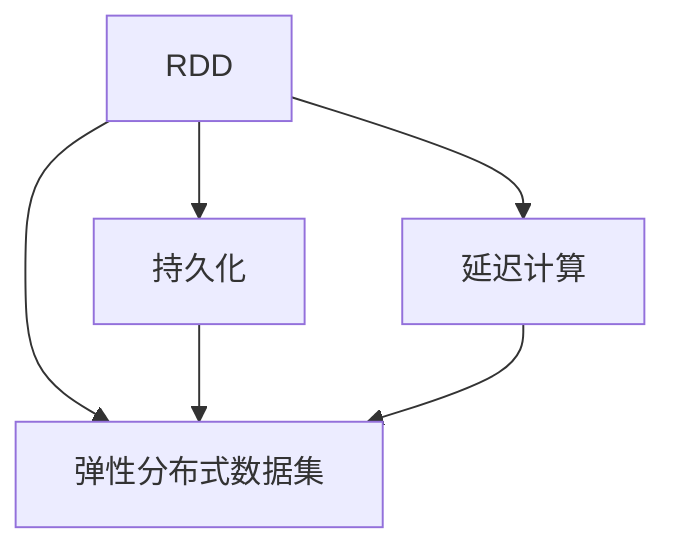

                 

## 1. 背景介绍

### 1.1 问题由来
随着大数据时代的到来，分布式计算系统逐渐成为主流，大数据处理的复杂性和挑战性随之提升。如何在分布式环境下高效处理海量数据，成为数据科学和工程领域亟待解决的问题。

### 1.2 问题核心关键点
分布式数据处理的核心挑战在于：
1. 高效处理大规模数据集
2. 保证数据处理的正确性和一致性
3. 实现高效的资源管理和调度

RDD（Resilient Distributed Datasets）是Apache Spark的一个核心概念，它提供了一种高效、可扩展的数据处理框架，能够有效应对这些挑战。

### 1.3 问题研究意义
了解RDD的原理和实践，对于构建高性能分布式计算系统、提升数据处理效率、优化资源使用有着重要的意义。同时，RDD的广泛应用也为大数据处理、机器学习、数据分析等领域提供了强有力的技术支撑。

## 2. 核心概念与联系

### 2.1 核心概念概述

为更好地理解RDD，本节将介绍几个关键概念：

- RDD（Resilient Distributed Datasets）：是Apache Spark的基础数据结构，提供了一种分布式内存计算模型，能够高效处理大规模数据集。
- 弹性分布式数据集：RDD的底层实现，具有容错性、可并行处理等特点。
- 持久化（Persistence）：将RDD数据缓存到内存或磁盘，提升计算速度。
- 延迟计算（Lazy Evaluation）：只有在数据被查询时才执行计算，避免不必要的资源浪费。

这些概念之间存在紧密联系，共同构成了RDD的基本计算模型。

### 2.2 核心概念原理和架构的 Mermaid 流程图



这个流程图展示了RDD的架构：

1. RDD建立在弹性分布式数据集之上，通过内存或磁盘存储数据，具有弹性分布的特点。
2. RDD支持持久化和延迟计算，提升数据访问速度和计算效率。
3. 持久化和延迟计算使得RDD能够高效地进行大规模数据处理，同时保证了数据处理的一致性和正确性。

## 3. 核心算法原理 & 具体操作步骤

### 3.1 算法原理概述

RDD的核心思想是将大规模数据集切分成多个小数据集，并行处理每个小数据集，最后合并结果。这种分而治之的策略，使得RDD能够高效处理大规模数据集，同时保证数据处理的正确性和一致性。

RDD支持两种数据转换操作：
- Transformation（转换）：对数据进行转换操作，如过滤、分组、排序等。
- Action（动作）：对数据进行操作，如计算、输出等，最终返回计算结果。

在RDD中，所有操作都具有延迟计算的特性，只有在Action操作触发时才真正执行计算，大大提高了计算效率。

### 3.2 算法步骤详解

RDD的算法步骤主要包括数据划分、任务调度、数据处理和结果合并：

**Step 1: 数据划分**
将大规模数据集划分为多个小数据集，称为分区（Partition）。每个分区可以被并行处理，提升处理效率。

**Step 2: 任务调度**
根据数据划分的分区，将计算任务分配给各个计算节点，并行执行。

**Step 3: 数据处理**
在每个计算节点上，对本地数据进行处理，产生中间结果。

**Step 4: 结果合并**
将所有计算节点的中间结果合并，最终得到计算结果。

### 3.3 算法优缺点

RDD算法具有以下优点：
1. 高效处理大规模数据集。通过分而治之的策略，能够高效地处理海量数据。
2. 具有容错性。每个分区的数据都保存了多个副本，一旦某个分区出现问题，可以从副本中恢复。
3. 支持弹性扩展。RDD能够动态扩展计算资源，适应大规模数据处理需求。

同时，RDD算法也存在一些缺点：
1. 延迟计算可能导致资源浪费。延迟计算使得部分计算任务可能长时间等待，浪费计算资源。
2. 内存占用较大。RDD通常将数据存储在内存中，对于大规模数据集，内存消耗可能较大。
3. 不适合迭代计算。由于延迟计算的特性，RDD不适合迭代计算，一旦数据被查询后，不能再次进行修改。

### 3.4 算法应用领域

RDD算法在分布式计算和数据分析领域有广泛应用，例如：

- 数据处理：处理大规模数据集，如日志分析、数据清洗等。
- 机器学习：进行大规模机器学习模型的训练和推理。
- 图形计算：处理大规模图数据，如社交网络分析、路径推荐等。
- 实时计算：处理实时数据流，如实时日志分析、流计算等。

这些领域都是大数据处理的典型场景，RDD能够高效地处理大规模数据，同时保证数据处理的一致性和正确性。

## 4. 数学模型和公式 & 详细讲解

### 4.1 数学模型构建

RDD的数学模型基于分布式计算，将大规模数据集划分为多个分区，每个分区可以进行并行处理。

假设有一个大规模数据集 $D$，分为 $n$ 个分区，每个分区的数据量为 $P_i$。在RDD中，数据转换操作 $f$ 可以表示为：

$$
RDD_{i+1} = f(RDD_i)
$$

其中 $RDD_i$ 为第 $i$ 个分区，$RDD_{i+1}$ 为转换后的分区。

### 4.2 公式推导过程

在RDD中，数据转换操作和计算操作可以表示为以下公式：

$$
\text{map}(D) = \{f(x) | x \in D\}
$$

$$
\text{filter}(D) = \{x | f(x) \text{为True}, x \in D\}
$$

$$
\text{reduce}(D) = \bigoplus_{x \in D} f(x)
$$

其中 $\oplus$ 为计算操作，$\text{reduce}$ 操作可以将所有分区数据合并为单个结果。

### 4.3 案例分析与讲解

以一个简单的例子来说明RDD的工作原理：

假设有一个大规模数据集 $D$，包含多个分区。我们希望对每个分区中的数据进行过滤操作，保留大于5的数据。

1. 将数据集 $D$ 划分为多个分区，每个分区 $P_i$ 包含若干数据。
2. 对每个分区 $P_i$ 进行过滤操作，保留大于5的数据。
3. 将每个分区过滤后的结果合并，得到最终结果。

## 5. 项目实践：代码实例和详细解释说明

### 5.1 开发环境搭建

在进行RDD开发前，我们需要准备好开发环境。以下是使用Scala进行Apache Spark开发的环境配置流程：

1. 安装Apache Spark：从官网下载并安装Apache Spark，选择适合分布式计算环境的版本。
2. 安装Scala：安装Scala开发环境，Scala作为Apache Spark的主要开发语言。
3. 配置环境变量：将Apache Spark和Scala的配置文件加入系统环境变量。

完成上述步骤后，即可在Spark集群上开始RDD开发。

### 5.2 源代码详细实现

这里我们以一个简单的单词计数程序为例，展示如何使用RDD进行数据处理。

```scala
import org.apache.spark.{SparkConf, SparkContext}

object WordCount {
  def main(args: Array[String]) {
    val conf = new SparkConf().setAppName("Word Count")
    val sc = new SparkContext(conf)

    // 读取文件
    val lines = sc.textFile("input.txt")

    // 分词操作
    val words = lines.flatMap(line => line.split(" "))

    // 过滤操作
    val filteredWords = words.filter(word => word.length > 5)

    // 计数操作
    val counts = filteredWords.map(word => (word, 1)).reduceByKey(_ + _)

    // 输出结果
    counts.foreach println

    sc.stop()
  }
}
```

以上代码展示了RDD的基本操作流程：

1. 使用 `textFile` 函数读取文件。
2. 使用 `flatMap` 函数将文件中的每行分割成单词。
3. 使用 `filter` 函数过滤出长度大于5的单词。
4. 使用 `map` 函数将单词和计数1组成键值对。
5. 使用 `reduceByKey` 函数对相同单词进行累加计数。
6. 使用 `foreach` 函数输出结果。

### 5.3 代码解读与分析

让我们再详细解读一下关键代码的实现细节：

**代码实现过程**：
1. 创建Spark上下文 `sc`，并设置应用程序名称。
2. 使用 `textFile` 函数读取文件，返回一个RDD对象。
3. 使用 `flatMap` 函数对RDD中的每个元素进行操作，将字符串分割成单词，返回一个包含所有单词的RDD。
4. 使用 `filter` 函数对单词进行过滤，保留长度大于5的单词，返回一个包含过滤后的单词的RDD。
5. 使用 `map` 函数对单词进行操作，将单词和计数1组成键值对，返回一个包含所有单词和计数的RDD。
6. 使用 `reduceByKey` 函数对RDD进行计数，返回一个包含每个单词及其计数的结果RDD。
7. 使用 `foreach` 函数输出结果。

**代码功能**：
- 读取文件：使用 `textFile` 函数从本地或HDFS读取文件，返回一个包含所有行的RDD。
- 分词操作：使用 `flatMap` 函数将字符串分割成单词，返回一个包含所有单词的RDD。
- 过滤操作：使用 `filter` 函数过滤出长度大于5的单词，返回一个包含过滤后的单词的RDD。
- 计数操作：使用 `map` 函数将单词和计数1组成键值对，使用 `reduceByKey` 函数对相同单词进行累加计数，返回一个包含每个单词及其计数的结果RDD。
- 输出结果：使用 `foreach` 函数输出结果。

**代码性能优化**：
- 使用 `filter` 函数过滤出长度大于5的单词，可以减少后续操作的计算量，提高效率。
- 使用 `reduceByKey` 函数对单词进行计数，可以并行处理多个分区，提高处理速度。
- 使用 `foreach` 函数输出结果，可以避免不必要的缓存，减少内存消耗。

## 6. 实际应用场景

### 6.1 大数据处理

RDD在处理大规模数据集方面具有天然优势。无论是日志分析、数据清洗，还是数据挖掘、机器学习，RDD都能提供高效、可靠的解决方案。

在日志分析中，RDD可以将海量日志数据进行分布式处理，快速提取有用信息，提升数据分析效率。

在数据清洗中，RDD可以对大规模数据集进行过滤、去重、格式化等操作，确保数据质量。

在数据挖掘中，RDD可以进行聚类、分类、关联分析等操作，挖掘数据背后的规律和趋势。

在机器学习中，RDD可以高效地进行大规模模型训练和推理，提升模型性能。

### 6.2 实时计算

RDD还适用于实时计算场景，如实时日志分析、流计算等。通过Spark Streaming，RDD能够处理实时数据流，实现高效的实时计算。

在实时日志分析中，RDD可以对实时日志进行过滤、去重、统计等操作，实时输出分析结果。

在流计算中，RDD可以对实时数据流进行计算、聚合等操作，实时生成计算结果。

### 6.3 图形计算

RDD还可以用于图形计算，如社交网络分析、路径推荐等。通过Spark GraphX，RDD可以高效地处理大规模图数据，进行图形计算和分析。

在社交网络分析中，RDD可以对大规模社交网络数据进行去重、聚合、分析等操作，发现社交网络中的关键节点和关系。

在路径推荐中，RDD可以对大规模图数据进行查询、优化等操作，生成最优路径推荐。

## 7. 工具和资源推荐

### 7.1 学习资源推荐

为了帮助开发者系统掌握RDD的原理和实践，这里推荐一些优质的学习资源：

1. Apache Spark官方文档：详细介绍了RDD的API、配置、优化等，是学习RDD的权威资料。
2. 《Spark: The Definitive Guide》书籍：系统介绍了Spark和RDD的基本概念和高级特性，适合深入学习。
3. Spark API教程：官方提供的RDD和Spark API教程，提供丰富的示例代码和详细解释。
4. Spark Summit会议视频：Apache Spark官方组织的会议视频，涵盖RDD和Spark的最新进展和最佳实践。
5. Udemy课程：提供从基础到高级的Spark和RDD课程，适合不同层次的学习者。

通过对这些资源的学习实践，相信你一定能够快速掌握RDD的精髓，并用于解决实际的分布式计算问题。

### 7.2 开发工具推荐

高效的开发离不开优秀的工具支持。以下是几款用于RDD开发的常用工具：

1. IntelliJ IDEA：Apache Spark官方提供的IDEA插件，支持Spark和RDD的开发和调试。
2. PySpark：Python语言下的Spark API，提供简单易用的接口，适合Python开发者使用。
3. Scala IDE：用于Scala开发和调试的IDE，支持Spark和RDD的开发。
4. DataGrip：JetBrains公司提供的DB/SQL开发工具，支持Spark和RDD的数据可视化。

合理利用这些工具，可以显著提升RDD开发的效率，加快创新迭代的步伐。

### 7.3 相关论文推荐

RDD算法和Spark系统的发展源于学界的持续研究。以下是几篇奠基性的相关论文，推荐阅读：

1. Resilient Distributed Datasets: A Fault-Tolerant Abstraction for In-Memory Cluster Computing：介绍RDD的基本原理和实现机制。
2. Spark: Cluster Computing with Fault Tolerance：介绍Spark的基本概念和架构。
3. Spark's Scalable Distributed Dataset, Resilient Distributed Datasets（RDD）：介绍RDD的API和用法。
4. Spark: Fast and Distributed Data Processing：介绍Spark和RDD的高性能特性。
5. Speed and Automation: A New Day for Machine Learning：介绍Spark MLlib库的基本概念和应用场景。

这些论文代表了大数据处理和分布式计算的发展脉络。通过学习这些前沿成果，可以帮助研究者把握学科前进方向，激发更多的创新灵感。

## 8. 总结：未来发展趋势与挑战

### 8.1 总结

本文对RDD的原理和实践进行了全面系统的介绍。首先阐述了RDD的发展背景和重要性，明确了RDD在分布式计算中的核心地位。其次，从原理到实践，详细讲解了RDD的数学模型和核心算法，给出了RDD任务开发的完整代码实例。同时，本文还广泛探讨了RDD在各种应用场景中的实际应用，展示了RDD的强大能力。

通过本文的系统梳理，可以看到，RDD作为一种高效、可靠的分布式计算框架，已经广泛应用于大数据处理、实时计算、图形计算等多个领域。RDD的广泛应用为大数据处理和分布式计算提供了强有力的技术支撑，显著提升了数据处理效率和系统稳定性。未来，伴随Spark和RDD的持续演进，相信其将在更广阔的应用领域大放异彩，为大数据处理技术带来新的突破。

### 8.2 未来发展趋势

展望未来，RDD和Spark的发展趋势如下：

1. 性能提升：通过优化计算图、改进内存管理、引入向量运算等技术，进一步提升RDD和Spark的计算性能，支持更大规模的数据处理。
2. 生态系统完善：完善RDD和Spark的生态系统，提供更多组件和工具，支持更广泛的场景。
3. 社区活跃：加强Apache Spark社区的活跃度，吸引更多开发者和企业加入，共同推动Spark和RDD的进步。
4. 多元化支持：支持更多编程语言和数据源，拓展RDD和Spark的应用范围。
5. 微服务化：通过微服务化的设计，提升RDD和Spark的可伸缩性和可管理性。

以上趋势凸显了RDD和Spark的广阔前景。这些方向的探索发展，必将进一步提升RDD和Spark的性能和应用范围，为大数据处理和分布式计算提供更强大的技术支持。

### 8.3 面临的挑战

尽管RDD和Spark已经取得了瞩目成就，但在迈向更加智能化、普适化应用的过程中，仍面临以下挑战：

1. 资源消耗：RDD和Spark对计算资源和内存的需求较大，如何高效利用资源，降低成本，是一个重要课题。
2. 数据迁移：在大规模数据迁移过程中，如何保证数据的一致性和完整性，是一个关键问题。
3. 延迟计算：延迟计算可能导致资源浪费，如何优化延迟计算，提高计算效率，是一个重要研究方向。
4. 版本兼容性：不同版本的Spark和RDD之间存在兼容性问题，如何保证兼容性和升级平滑，是一个挑战。
5. 算法优化：如何优化算法，提升RDD和Spark的性能和效率，是一个重要研究课题。

### 8.4 研究展望

面对RDD和Spark面临的挑战，未来的研究需要在以下几个方面寻求新的突破：

1. 优化资源管理：通过优化内存管理、改进计算图、引入向量运算等技术，进一步提升RDD和Spark的计算性能，支持更大规模的数据处理。
2. 数据一致性：通过一致性哈希、副本机制等技术，保证数据的一致性和完整性。
3. 延迟计算优化：通过引入延迟计算优化算法，提高计算效率，减少资源浪费。
4. 版本兼容性：通过引入版本管理机制，确保不同版本的Spark和RDD之间能够平滑升级和兼容。
5. 算法优化：通过优化算法，提升RDD和Spark的性能和效率。

这些研究方向的探索，必将引领RDD和Spark技术迈向更高的台阶，为大数据处理和分布式计算带来新的突破。

## 9. 附录：常见问题与解答

**Q1：什么是RDD？**

A: RDD（Resilient Distributed Datasets）是Apache Spark的基础数据结构，提供了一种分布式内存计算模型，能够高效处理大规模数据集。

**Q2：RDD和Hadoop的HDFS有什么区别？**

A: RDD和Hadoop的HDFS都是分布式存储系统，但RDD是一种分布式内存计算模型，能够高效地处理大规模数据集。HDFS是一种分布式文件系统，主要用于大规模数据的存储和读写。

**Q3：RDD和Hadoop的MapReduce有什么区别？**

A: RDD和Hadoop的MapReduce都是分布式计算框架，但RDD具有延迟计算的特性，能够高效地处理大规模数据集。MapReduce是一种迭代计算模型，需要多次计算才能得到最终结果。

**Q4：RDD有哪些优点？**

A: RDD具有以下优点：
1. 高效处理大规模数据集。
2. 具有容错性。
3. 支持弹性扩展。
4. 支持持久化和延迟计算。

**Q5：RDD有哪些缺点？**

A: RDD有以下缺点：
1. 内存占用较大。
2. 不适合迭代计算。
3. 延迟计算可能导致资源浪费。

通过本文的系统梳理，可以看到，RDD作为一种高效、可靠的分布式计算框架，已经广泛应用于大数据处理、实时计算、图形计算等多个领域。RDD的广泛应用为大数据处理和分布式计算提供了强有力的技术支撑，显著提升了数据处理效率和系统稳定性。未来，伴随Spark和RDD的持续演进，相信其将在更广阔的应用领域大放异彩，为大数据处理技术带来新的突破。

