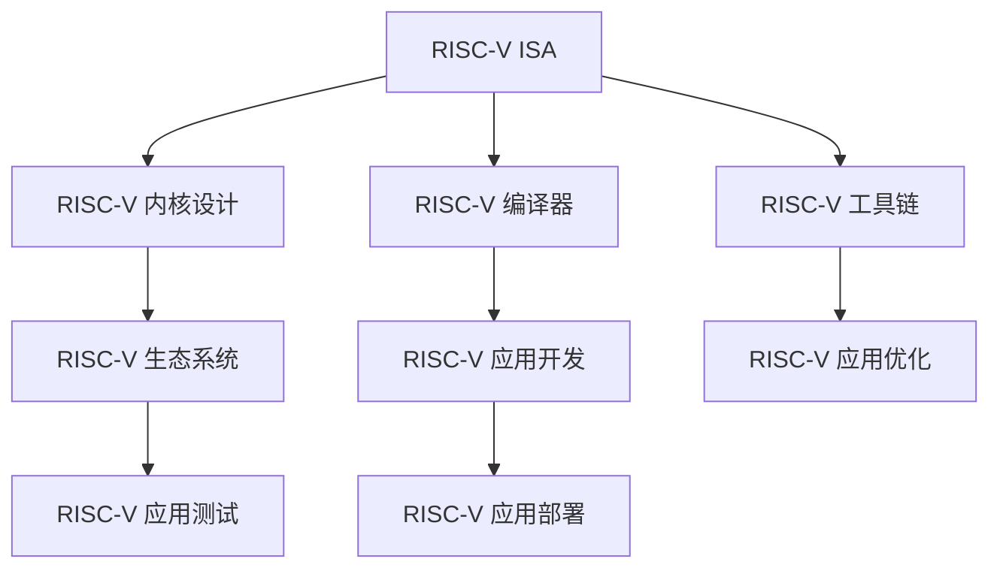

                 

# RISC-V 开源指令集：RISC-V ISA

## 1. 背景介绍

### 1.1 问题由来
RISC-V 是一种新型的开放源码指令集架构，旨在为现代计算需求提供高效、可扩展的解决方案。由于其设计理念和专利授权机制，RISC-V 迅速在学术界和工业界获得了广泛关注，成为推动硬件和软件生态系统发展的重要力量。

RISC-V 的诞生源于对现有指令集架构（如 x86、ARM）的反思。这些架构存在多核优化难度大、复杂度高、专利壁垒高等问题。而 RISC-V 作为精简指令集架构，其低功耗、高可扩展性、开放源码等特点，使其在嵌入式、高性能计算、人工智能等领域展现出巨大潜力。

### 1.2 问题核心关键点
RISC-V 指令集的设计遵循 RISC 理念，其核心特点包括：

- **精简设计**：指令集精简，只有约 200 条指令，使得指令编码和处理变得更加高效。
- **通用寄存器架构**：支持32位、64位等通用寄存器架构，使得硬件实现更加灵活。
- **可扩展性**：支持按需定制，方便针对特定应用场景进行优化。
- **可移植性**：操作系统、编译器、虚拟机等生态系统，可轻松移植至 RISC-V 平台。

RISC-V 的开放源码和低专利壁垒，也使得更多开发者可以自由地使用、修改、传播其代码，极大地推动了 RISC-V 生态系统的发展。

## 2. 核心概念与联系

### 2.1 核心概念概述

为了更好地理解 RISC-V 指令集的设计理念和架构特点，本节将介绍几个关键概念：

- **RISC-V ISA**：RISC-V 指令集架构，定义了 RISC-V 处理器和编译器的接口规范。
- **RISC-V 内核设计**：RISC-V 处理器内核的实现，包含微架构、寄存器管理、指令流水线等。
- **RISC-V 编译器**：将高级语言代码转换为 RISC-V 机器指令的编译工具。
- **RISC-V 工具链**：包括汇编器、链接器、调试器等辅助工具，支持 RISC-V 应用开发。
- **RISC-V 生态系统**：包括操作系统、中间件、库函数等，提供完整的软件支持。

这些概念之间的联系和相互作用，可以通过以下 Mermaid 流程图来展示：



这个流程图展示了一些关键概念及其之间的关系：

1. **RISC-V ISA** 定义了 RISC-V 处理器和编译器的接口规范，是整个架构的基石。
2. **RISC-V 内核设计** 基于 RISC-V ISA，实现处理器微架构，并管理寄存器和指令流水线。
3. **RISC-V 编译器** 将高级语言代码转换为 RISC-V 机器指令，为应用开发提供支持。
4. **RISC-V 工具链** 提供一系列辅助工具，用于 RISC-V 应用的开发生命周期。
5. **RISC-V 生态系统** 包括操作系统、中间件、库函数等，支持 RISC-V 应用的高效运行。
6. **RISC-V 应用开发** 使用编译器和工具链，开发 RISC-V 应用。
7. **RISC-V 应用优化** 使用工具链优化应用性能。
8. **RISC-V 应用测试** 使用测试工具验证应用质量。
9. **RISC-V 应用部署** 将应用部署到 RISC-V 硬件上。

## 3. 核心算法原理 & 具体操作步骤
### 3.1 算法原理概述

RISC-V 指令集的设计遵循 RISC 理念，其核心目标是提高指令执行效率。RISC-V 指令集通过精简指令集和高效寄存器架构，实现了低功耗和高性能的平衡。

RISC-V 指令集主要包括以下特点：

- **固定长指令**：所有指令长度固定，便于指令缓存和流水线优化。
- **内存操作指令**：包括加载/存储指令，支持高效的内存访问。
- **条件分支指令**：支持条件分支，提高分支预测准确性。
- **原子指令**：支持原子操作，提高并发性能。

RISC-V 指令集通过精简指令集和高效寄存器架构，实现了低功耗和高性能的平衡。其指令集设计遵循 RISC 理念，力求以简洁的指令实现高效计算。

### 3.2 算法步骤详解

RISC-V 指令集的设计和实现主要包括以下几个步骤：

**Step 1: 设计指令集架构**
- 定义 RISC-V 指令集的基本结构，包括指令编码、操作码、寄存器编码等。
- 确定指令集的扩展机制，支持按需定制，满足不同应用需求。

**Step 2: 实现 RISC-V 内核**
- 设计 RISC-V 处理器微架构，包括指令流水线、寄存器管理、缓存策略等。
- 实现 RISC-V 指令的编码和解码，将指令映射到硬件操作。

**Step 3: 开发 RISC-V 编译器**
- 设计 RISC-V 编译器的前端和后端，实现高级语言到机器代码的转换。
- 优化编译器性能，提升代码生成效率和指令利用率。

**Step 4: 构建 RISC-V 工具链**
- 开发 RISC-V 的汇编器、链接器、调试器等工具。
- 实现跨平台的工具链集成，支持 RISC-V 应用的开发和测试。

**Step 5: 搭建 RISC-V 生态系统**
- 开发 RISC-V 操作系统、中间件、库函数等，提供完整软件支持。
- 搭建 RISC-V 应用开发平台，支持 RISC-V 应用的高效运行。

### 3.3 算法优缺点

RISC-V 指令集的设计和实现有以下优点：

- **高效性**：精简指令集和高效寄存器架构，使得指令执行更加高效。
- **可扩展性**：支持按需定制，方便针对特定应用场景进行优化。
- **低成本**：开放源码和低专利壁垒，降低了硬件和软件的开发成本。
- **灵活性**：灵活的内存操作和条件分支，适应不同计算需求。

同时，RISC-V 指令集也存在一些缺点：

- **复杂度较高**：虽然指令集精简，但硬件实现和优化相对复杂。
- **生态系统不够成熟**：与 x86、ARM 等成熟架构相比，RISC-V 的生态系统建设尚需时日。
- **性能瓶颈**：在处理复杂任务时，可能存在性能瓶颈，需要进一步优化。

### 3.4 算法应用领域

RISC-V 指令集已在多个领域得到应用，具体包括：

- **嵌入式系统**：RISC-V 的低功耗和高效性，使其成为嵌入式系统的主流选择。
- **高性能计算**：RISC-V 的高性能和可扩展性，使其在人工智能、大数据等领域展现出巨大潜力。
- **数据中心**：RISC-V 的灵活性和成本优势，使其在数据中心应用中逐步受到关注。
- **网络通信**：RISC-V 的高效性和可扩展性，使其在网络通信设备中得到广泛应用。
- **自动化设备**：RISC-V 的低功耗和高可靠性，使其在自动化设备中得到应用。

## 4. 数学模型和公式 & 详细讲解 & 举例说明

### 4.1 数学模型构建

RISC-V 指令集的设计和实现涉及多个数学模型，以下是其中几个关键模型的构建方法：

- **指令编码模型**：RISC-V 指令采用 32 位固定长编码，其中 1 位为操作码，剩余 31 位为操作数和控制信息。例如，`addi $t0, $t1, $t2` 表示将 `$t1` 和 `$t2` 相加并存入 `$t0`。
- **寄存器编码模型**：RISC-V 指令集支持 32 位和 64 位通用寄存器架构，支持高效的寄存器操作。
- **内存操作模型**：RISC-V 指令集包括加载和存储指令，支持高效的内存访问，如 `lw $t0, 0($t1)` 表示从 `$t1` 地址加载数据存入 `$t0`。

### 4.2 公式推导过程

以 RISC-V 的 `addi` 指令为例，其执行过程如下：

1. **指令读取**：从指令缓存中读取 `addi $t0, $t1, $t2`。
2. **指令译码**：译码得到操作码和操作数。
3. **寄存器访问**：从寄存器文件获取 `$t1` 和 `$t2` 的值。
4. **计算**：计算 `$t1 + t2` 的结果。
5. **寄存器存储**：将结果存入 `$t0` 寄存器。

其计算过程可以用以下公式表示：

$$
\begin{aligned}
\text{Result} &= \text{Read}(t2) + \text{Read}(t1) \\
\text{Write}(t0, \text{Result}) &= \text{Result}
\end{aligned}
$$

其中 `Read(t)` 表示从寄存器 `t` 读取值，`Write(t, v)` 表示将值 `v` 存入寄存器 `t`。

### 4.3 案例分析与讲解

以下是一个 RISC-V 加载指令的执行过程示例：

假设有一个 `lw $t0, 0($t1)` 的指令，其中 `$t0` 为目标寄存器，`$t1` 为地址寄存器。执行过程如下：

1. **指令读取**：从指令缓存中读取 `lw $t0, 0($t1)`。
2. **指令译码**：译码得到操作码和操作数。
3. **寄存器访问**：从寄存器文件获取 `$t1` 的值，计算地址。
4. **内存读取**：从内存中读取指定地址的数据。
5. **寄存器存储**：将读取的数据存入 `$t0` 寄存器。

其执行过程可以用以下公式表示：

$$
\begin{aligned}
\text{Address} &= \text{Read}(t1) \\
\text{Data} &= \text{MemoryRead}(\text{Address}) \\
\text{Write}(t0, \text{Data}) &= \text{Data}
\end{aligned}
$$

其中 `MemoryRead(Address)` 表示从内存中读取指定地址的数据。

## 5. 项目实践：代码实例和详细解释说明

### 5.1 开发环境搭建

在进行 RISC-V 开发前，需要准备好开发环境。以下是使用 Linux 搭建 RISC-V 开发环境的流程：

1. 安装 RISC-V 软件工具链：使用 `git clone https://github.com/riscv/riscv-isa-kit.git` 克隆 RISC-V 工具链，并执行 `./configure && make` 进行安装。
2. 安装 RISC-V 模拟器：使用 `git clone https://github.com/riscv/riscv-emulator.git` 克隆 RISC-V 模拟器，并执行 `make` 进行安装。
3. 安装 RISC-V 调试工具：使用 `git clone https://github.com/riscv/riscv-gdb.git` 克隆 RISC-V 调试工具，并执行 `make` 进行安装。

完成上述步骤后，即可在 Linux 环境下进行 RISC-V 开发。

### 5.2 源代码详细实现

以下是使用 Python 实现 RISC-V 加载指令的示例代码：

```python
import riscv
from riscv import *

def load_instruction(instruction):
    opcode = instruction.opcode()
    if opcode == RiscvOpcode.addi:
        t0, t1, t2 = instruction寄存器()
        result = Read(t2) + Read(t1)
        Write(t0, result)
        return True
    elif opcode == RiscvOpcode.lw:
        t0, t1 = instruction寄存器()
        address = Read(t1)
        data = MemoryRead(address)
        Write(t0, data)
        return True
    else:
        return False

# 示例加载指令
load_instruction(RiscvInstruction(addi, [riscv.r1, riscv.r2, riscv.r3]))
load_instruction(RiscvInstruction(lw, [riscv.r1, riscv.r2]))
```

### 5.3 代码解读与分析

让我们再详细解读一下关键代码的实现细节：

**RiscvOpcode枚举**：
- 定义了 RISC-V 指令的各个操作码，包括 `addi` 和 `lw`。
- 每个操作码对应一个执行过程，通过 `opcode()` 方法获取。

**riscv寄存器类**：
- 定义了 RISC-V 寄存器的类，包括 `riscv.r0` 到 `riscv.r31`。
- 使用 `Read()` 和 `Write()` 方法获取和设置寄存器值。

**MemoryRead函数**：
- 定义了从内存中读取指定地址数据的方法。
- 使用 RISC-V 的模拟硬件库实现。

## 6. 实际应用场景

### 6.1 嵌入式系统

RISC-V 的低功耗和高效性，使其成为嵌入式系统的理想选择。RISC-V 处理器广泛应用于物联网、智能家居、汽车电子等领域，提供了高性能和低功耗的计算支持。

在实际应用中，RISC-V 可以支持多种操作模式，包括单核、双核、多核等，满足不同场景的需求。同时，RISC-V 的可扩展性和开放源码特性，使得开发者可以根据需求进行灵活定制，实现高效的硬件加速。

### 6.2 高性能计算

RISC-V 的高性能和可扩展性，使其在人工智能、大数据等领域展现出巨大潜力。RISC-V 处理器可以支持并行计算、分布式计算等高级计算模型，加速数据处理和模型训练。

在实际应用中，RISC-V 可以与 GPU、FPGA 等硬件加速器结合，提供高效计算能力。同时，RISC-V 的灵活扩展性，使得开发者可以根据需求定制不同的计算模型和硬件平台。

### 6.3 数据中心

RISC-V 的低成本和灵活性，使其在数据中心应用中逐步受到关注。RISC-V 处理器可以支持高效的服务器集群和存储系统，提升数据中心的高性能和大容量需求。

在实际应用中，RISC-V 可以支持高性能计算、数据存储、网络通信等关键任务，提供高效的数据处理能力。同时，RISC-V 的可扩展性和开放源码特性，使得开发者可以根据需求进行灵活定制，实现高效的数据中心解决方案。

## 7. 工具和资源推荐

### 7.1 学习资源推荐

为了帮助开发者系统掌握 RISC-V 技术，这里推荐一些优质的学习资源：

1. RISC-V 官方文档：RISC-V 基金会提供的官方文档，详细介绍了 RISC-V 指令集、处理器架构、工具链等核心内容。
2. RISC-V 入门教程：由 RISC-V 社区提供的入门教程，适合初学者快速上手。
3. RISC-V 实践指南：由 RISC-V 社区提供的实践指南，包含多个 RISC-V 项目案例和源码分析。
4. RISC-V 设计手册：由 RISC-V 社区提供的详细设计手册，适合深入理解 RISC-V 原理。

通过对这些资源的学习实践，相信你一定能够快速掌握 RISC-V 技术，并用于解决实际的硬件和软件问题。

### 7.2 开发工具推荐

高效的开发离不开优秀的工具支持。以下是几款用于 RISC-V 开发常用的工具：

1. RISC-V 模拟器：如 Spike、Genie、RISCVsim等，提供 RISC-V 指令集模拟器，支持动态调试和分析。
2. RISC-V 调试工具：如 RiscvGDB、GVWP等，提供 RISC-V 指令集的高级调试功能，支持远程调试和断点设置。
3. RISC-V 编译器：如 GCC、LLVM等，支持 RISC-V 代码的编译和优化。
4. RISC-V 工具链：如 SDK、CLion等，提供 RISC-V 工具链的集成和开发环境支持。
5. RISC-V 编辑器：如 Vim、Emacs等，支持 RISC-V 源码的编辑和调试。

合理利用这些工具，可以显著提升 RISC-V 开发效率，加快创新迭代的步伐。

### 7.3 相关论文推荐

RISC-V 技术的发展源于学界的持续研究。以下是几篇奠基性的相关论文，推荐阅读：

1. RISC-V: A New IEEE Standard for Instruction Set Architectures（RISC-V 标准文档）：定义了 RISC-V 指令集架构的详细规范。
2. RISC-V Roadmap 2022-2023（RISC-V 路线图）：由 RISC-V 基金会发布的未来三年技术路线图。
3. RISC-V Instruction Set Architecture Specification 2019（RISC-V 2019 指令集规范）：详细介绍了 RISC-V 指令集的规范和设计原则。
4. RISC-V Vector Extension Specification 2020（RISC-V 向量扩展规范）：定义了 RISC-V 的向量扩展指令集，支持高效的向量计算。

这些论文代表了大规模指令集架构的研究进展，通过学习这些前沿成果，可以帮助研究者把握学科前进方向，激发更多的创新灵感。

## 8. 总结：未来发展趋势与挑战

### 8.1 总结

本文对 RISC-V 指令集的设计和实现进行了全面系统的介绍。首先阐述了 RISC-V 指令集的背景和设计理念，明确了 RISC-V 在嵌入式、高性能计算、人工智能等领域的应用前景。其次，从原理到实践，详细讲解了 RISC-V 指令集的设计、实现和优化过程，给出了 RISC-V 应用开发的完整代码示例。同时，本文还探讨了 RISC-V 在实际应用中的各种场景，展示了其广泛的应用潜力。此外，本文精选了 RISC-V 技术的各类学习资源，力求为读者提供全方位的技术指引。

通过本文的系统梳理，可以看到，RISC-V 指令集作为新型的开源指令集架构，具有低功耗、高效能、可扩展等诸多优势，将在未来的计算领域发挥重要作用。RISC-V 的开放源码和灵活扩展性，使其成为推动硬件和软件生态系统发展的重要力量。未来，伴随 RISC-V 技术的持续演进，RISC-V 指令集必将在更广阔的应用领域大放异彩，为人类社会的数字化转型带来深远影响。

### 8.2 未来发展趋势

展望未来，RISC-V 指令集的发展将呈现以下几个趋势：

1. **生态系统逐步完善**：随着 RISC-V 生态系统的不断壮大，更多的硬件、软件和应用将支持 RISC-V 架构，加速其普及和应用。
2. **性能优化不断提升**：RISC-V 指令集的性能和能效将不断提升，支持更多的高性能计算和大容量存储需求。
3. **指令集不断扩展**：RISC-V 指令集将不断扩展和优化，支持更多的计算模型和应用场景。
4. **应用场景日益丰富**：RISC-V 将应用于更多领域，如汽车电子、医疗健康、智能制造等，提供全面的计算支持。
5. **产业链协同发展**：RISC-V 的硬件和软件生态系统将协同发展，推动产业链的完善和升级。

以上趋势凸显了 RISC-V 指令集的发展潜力和应用前景。这些方向的探索发展，必将进一步推动 RISC-V 技术的成熟和普及，为构建智能化、高效化、普适化的计算系统奠定坚实基础。

### 8.3 面临的挑战

尽管 RISC-V 指令集技术已经取得了显著进展，但在迈向更广泛应用的过程中，它仍面临诸多挑战：

1. **生态系统不成熟**：RISC-V 的生态系统建设仍需时日，缺乏成熟的操作系统、中间件、库函数等支持。
2. **性能瓶颈明显**：在处理复杂任务时，RISC-V 的性能可能存在瓶颈，需要进一步优化。
3. **技术成熟度不足**：RISC-V 的硬件和软件实现技术尚需完善，缺乏成熟的产品和解决方案。
4. **市场认知度低**：RISC-V 的市场认知度相对较低，推广和应用需要更多市场教育。
5. **产业链协同难度大**：RISC-V 的硬件和软件生态系统需要协同发展，面临产业链整合的难度。

### 8.4 研究展望

面对 RISC-V 指令集所面临的挑战，未来的研究需要在以下几个方面寻求新的突破：

1. **生态系统建设**：加强 RISC-V 生态系统的建设和推广，吸引更多开发者和企业参与。
2. **性能优化**：提升 RISC-V 指令集的性能和能效，支持更多复杂计算任务。
3. **技术成熟度提升**：提升 RISC-V 硬件和软件的实现技术，提供成熟的产品和解决方案。
4. **市场推广**：加强 RISC-V 的市场推广和教育，提高市场认知度。
5. **产业链整合**：推动 RISC-V 的硬件和软件生态系统协同发展，构建完整的产业链。

这些研究方向的探索，必将推动 RISC-V 指令集技术走向成熟，加速其在各种计算领域的落地应用。只有勇于创新、敢于突破，才能真正实现 RISC-V 技术在各个领域的广泛应用。

## 9. 附录：常见问题与解答

**Q1：RISC-V 指令集与 x86、ARM 指令集相比有何优势？**

A: RISC-V 指令集具有低功耗、高效能、可扩展等诸多优势：
1. **低功耗**：RISC-V 的精简指令集和高效的寄存器架构，使得指令执行更加高效，功耗更低。
2. **高效能**：RISC-V 支持高性能计算和大容量存储，适用于人工智能、大数据等领域。
3. **可扩展性**：RISC-V 支持按需定制，方便针对特定应用场景进行优化。
4. **开放源码**：RISC-V 的开放源码和低专利壁垒，降低了硬件和软件的开发成本。
5. **灵活性**：RISC-V 支持多种操作模式和扩展方式，适应不同计算需求。

**Q2：RISC-V 指令集的扩展机制有哪些？**

A: RISC-V 指令集支持按需定制，具有多种扩展机制：
1. **标准扩展**：如 RISC-V 指令集的官方扩展，如 RISC-V 向量扩展、RISC-V 浮点扩展等。
2. **自定义扩展**：开发者可以根据需求定制自己的指令扩展，满足特定应用场景的需求。
3. **混合模式**：RISC-V 支持多种扩展方式的混合使用，实现灵活的指令集设计。

**Q3：RISC-V 指令集的设计和实现涉及哪些核心技术？**

A: RISC-V 指令集的设计和实现涉及多个核心技术：
1. **精简指令集**：通过精简指令集，提高指令执行效率。
2. **高效寄存器架构**：支持 32 位和 64 位通用寄存器架构，提高寄存器操作效率。
3. **内存操作模型**：支持高效的内存访问，提高数据传输效率。
4. **条件分支指令**：支持条件分支，提高分支预测准确性。
5. **原子指令**：支持原子操作，提高并发性能。

**Q4：RISC-V 的开放源码和低专利壁垒有何优势？**

A: RISC-V 的开放源码和低专利壁垒具有以下优势：
1. **成本低**：降低硬件和软件的开发成本，适合中小型企业和学术机构。
2. **灵活性高**：开发者可以自由使用、修改、传播 RISC-V 代码，实现快速迭代。
3. **生态系统丰富**：RISC-V 生态系统不断壮大，包括操作系统、中间件、库函数等，提供完整的软件支持。
4. **市场竞争激烈**：吸引更多企业参与 RISC-V 生态系统建设，推动技术进步和市场发展。

**Q5：RISC-V 指令集的优化方法有哪些？**

A: RISC-V 指令集的优化方法包括：
1. **硬件优化**：通过优化微架构、缓存策略、并行计算等，提升指令执行效率。
2. **编译器优化**：通过代码生成、指令调度、数据布局等，提升指令利用率和执行效率。
3. **软件优化**：通过算法优化、数据结构优化等，提升应用性能和效率。
4. **混合精度计算**：通过混合精度计算，提高计算效率和降低功耗。
5. **动态调度**：通过动态调度算法，提升资源利用率和执行效率。

---

作者：禅与计算机程序设计艺术 / Zen and the Art of Computer Programming

