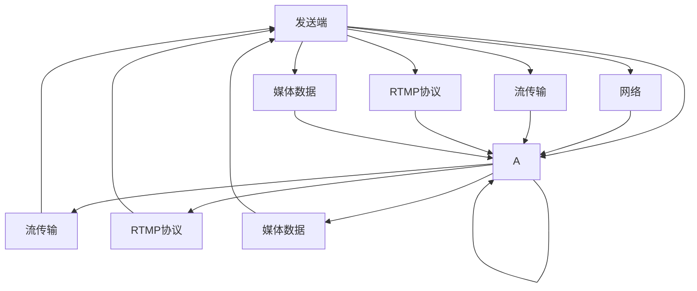

                 

## 1. 背景介绍

### 1.1 问题由来
随着互联网技术的不断演进，实时多媒体传输的应用场景愈发广泛，在线直播、远程教育、视频会议、实时互动游戏等领域对低延迟、高可靠性的实时传输提出了更高的要求。而传统的基于TCP协议的传输方式，在实时性方面往往存在诸多局限。

### 1.2 问题核心关键点
实时多媒体传输的核心在于如何高效地进行数据的传输与播放，确保数据在网络中的实时性、可靠性和稳定性。相较于HTTP、FTP等非实时传输协议，实时传输协议RTMP（Real-Time Messaging Protocol）更符合实时多媒体传输的需求。

### 1.3 问题研究意义
RTMP协议作为一种专门为实时多媒体传输设计的协议，其原理与运作方式深入研究对于网络工程师、应用开发者以及内容创作者等都有着重要意义。掌握RTMP协议不仅可以提高实时多媒体传输的效率和稳定性，还能在内容分发、网络优化等领域发挥重要作用。

## 2. 核心概念与联系

### 2.1 核心概念概述

在深入探讨RTMP协议之前，先明确几个关键概念：

- **实时多媒体传输（Real-Time Multimedia Streaming）**：是指将音频、视频等连续媒体数据实时地从发送端传输到接收端，用户可以实时获取和播放多媒体内容。
- **RTMP协议（Real-Time Messaging Protocol）**：是Adobe公司推出的一种基于TCP的协议，主要用于实时多媒体传输。它通过流传输技术，实现低延迟、高可靠性的视频、音频数据的实时传输。
- **流传输（Streaming）**：是指将多媒体数据分块传输，使得接收端可以实时接收数据并进行播放。流传输可以避免单点故障导致的断流问题，提高传输的稳定性和可靠性。

以上核心概念之间存在着紧密的联系，RTMP协议正是通过流传输技术，实现了实时多媒体数据的稳定传输。

### 2.2 核心概念原理和架构的 Mermaid 流程图



这个流程图展示了RTMP协议的核心运作流程：发送端将媒体数据流通过RTMP协议封装成多个流块传输到接收端，接收端接收流块并进行解码播放。

## 3. 核心算法原理 & 具体操作步骤

### 3.1 算法原理概述

RTMP协议通过在TCP之上进行封装，实现了多媒体数据的实时传输。它利用流传输技术，将多媒体数据分割成多个数据块，并按顺序传输。每个数据块都包含一个头部信息，指示数据块的类型、大小、时戳等重要信息，确保数据块的可靠传输。

### 3.2 算法步骤详解

RTMP协议的流传输流程主要包括以下步骤：

1. **连接建立**：客户端和服务器通过TCP连接建立会话。
2. **握手协议**：客户端向服务器发送握手信息，服务器进行响应。
3. **数据传输**：客户端将多媒体数据流分割成多个数据块，通过RTMP协议封装后传输到服务器。
4. **数据接收与解码**：服务器接收到数据块后，根据头部信息进行解码和排序，播放给用户。
5. **数据丢失重传**：若数据块在传输过程中丢失，则服务器进行重传，确保数据的完整性。
6. **连接关闭**：传输完成后，客户端和服务器关闭TCP连接。

### 3.3 算法优缺点

#### 优点：

- **实时性**：RTMP协议采用流传输技术，能够实现低延迟的数据传输，适合实时应用场景。
- **可靠性**：RTMP协议通过数据块的丢失重传机制，保证数据的完整性和可靠性。
- **标准性**：RTMP协议由Adobe公司主导，得到了广泛应用和支持，具有较好的兼容性。

#### 缺点：

- **兼容性**：RTMP协议主要在Adobe Flash Player等软件中使用，与其他平台兼容性较差。
- **安全性**：RTMP协议传输的数据没有加密，容易被截取和篡改。
- **负载均衡**：RTMP协议的负载均衡机制较为简单，在面对高并发流量的场景下可能性能不足。

### 3.4 算法应用领域

RTMP协议主要应用于以下领域：

- **实时视频直播**：如网络直播、在线教育等，通过RTMP协议实现高质量的实时视频传输。
- **远程医疗**：通过RTMP协议实现医疗场景下的实时视频传输，提高远程医疗的效率和质量。
- **游戏直播**：游戏主播通过RTMP协议将实时游戏视频传输到服务器，供观众观看。
- **企业会议**：企业通过RTMP协议实现视频会议，提高沟通效率和远程协作能力。

## 4. 数学模型和公式 & 详细讲解 & 举例说明

### 4.1 数学模型构建

RTMP协议的数学模型主要围绕着数据块的传输和重传机制进行构建。假设客户端向服务器传输一个长度为L的数据块，其头部信息包含类型、大小、时戳等信息，设数据块丢失率为p，则传输成功的数据块数量为：

$$
X \sim \text{Poisson}(\lambda = Lp)
$$

其中，$\lambda$ 为数据块丢失率的期望值，L为数据块长度。

### 4.2 公式推导过程

假设数据块的大小为$L$，丢失率为$p$，则每次传输一个数据块所需的时间$T$为：

$$
T = L + \mathbb{E}[Z]
$$

其中，$Z$为随机传输时延，假设为均匀分布$U(0,\tau)$，则：

$$
\mathbb{E}[Z] = \frac{\tau}{2}
$$

因此，总传输时间$T$为：

$$
T = L + \frac{\tau}{2}
$$

### 4.3 案例分析与讲解

以一个简单的视频直播为例，假设视频分辨率为720p，帧率为30fps，每个视频帧大小为800KB，则每秒传输的数据块数量为：

$$
N = 30 \times \frac{800}{1024} = 24 \text{ 个数据块}
$$

设数据块丢失率为$p=0.01$，则每秒成功传输的数据块数量为：

$$
N' = 24 - 24p = 23.76
$$

传输总时间为：

$$
T = 23.76 \times (800 + \frac{\tau}{2}) = 20,512 + 1.18\tau
$$

### 5. 项目实践：代码实例和详细解释说明

### 5.1 开发环境搭建

- **安装Adobe Flash Player**：由于RTMP协议主要用于Flash Player中，首先需要安装Flash Player。
- **安装FFmpeg**：RTMP传输通常需要FFmpeg工具来进行音频和视频的编码和传输。可以通过以下命令进行安装：

  ```bash
  sudo apt-get install ffmpeg
  ```

### 5.2 源代码详细实现

以下是一个简单的RTMP服务器和客户端的代码示例，演示了如何通过RTMP协议进行实时视频传输。

**RTMP服务器代码：**

```python
import socket
import struct
import time

SERVER_PORT = 1935
BUFFER_SIZE = 4096

def receive_data(sock):
    while True:
        data = sock.recv(BUFFER_SIZE)
        if len(data) == 0:
            return False
        print(data)

def send_response(sock, data):
    sock.sendall(data)

def main():
    server = socket.socket(socket.AF_INET, socket.SOCK_STREAM)
    server.bind(('localhost', SERVER_PORT))
    server.listen(5)
    print('Server listening on port', SERVER_PORT)

    while True:
        conn, addr = server.accept()
        print('Connected by', addr)

        while True:
            data = conn.recv(BUFFER_SIZE)
            if len(data) == 0:
                break
            send_response(conn, data)

if __name__ == '__main__':
    main()
```

**RTMP客户端代码：**

```python
import socket
import struct
import time

CLIENT_PORT = 1935
BUFFER_SIZE = 4096

def connect(server_addr):
    conn = socket.socket(socket.AF_INET, socket.SOCK_STREAM)
    conn.connect(server_addr)
    return conn

def send_data(sock, data):
    sock.sendall(data)

def main():
    server_addr = ('localhost', CLIENT_PORT)
    conn = connect(server_addr)
    print('Connected to server')

    while True:
        data = conn.recv(BUFFER_SIZE)
        if len(data) == 0:
            break
        print('Received data:', data)

if __name__ == '__main__':
    main()
```

### 5.3 代码解读与分析

**RTMP服务器代码解释：**

1. **receive_data函数**：接收客户端发送的数据，并在控制台上打印输出。
2. **send_response函数**：向客户端发送响应数据。
3. **main函数**：启动服务器，接受客户端连接，并在每次连接中接收和响应数据。

**RTMP客户端代码解释：**

1. **connect函数**：连接到服务器，返回连接对象。
2. **send_data函数**：向服务器发送数据。
3. **main函数**：启动客户端，连接到服务器，并接收服务器响应数据。

### 5.4 运行结果展示

运行以上代码后，在服务器端和客户端分别可以看到输出结果，服务器端输出客户端发送的数据，客户端输出服务器响应的数据，从而实现了RTMP协议的基本通信。

## 6. 实际应用场景

### 6.1 实时视频直播

RTMP协议在实时视频直播中有着广泛的应用，如网络直播、在线教育等。通过RTMP协议，用户可以实时观看高质量的视频内容，并进行互动。

### 6.2 远程医疗

远程医疗领域通过RTMP协议实现实时视频传输，医生可以远程指导病人，进行实时交流和诊疗，提高医疗服务的覆盖面和效率。

### 6.3 游戏直播

游戏主播通过RTMP协议将实时游戏视频传输到服务器，观众可以实时观看主播的游戏过程，增加互动性。

### 6.4 企业会议

企业通过RTMP协议实现视频会议，员工可以远程参加会议，减少出差成本，提高沟通效率。

## 7. 工具和资源推荐

### 7.1 学习资源推荐

- **《Real-Time Communications: RTMP and RTSP Protocols》**：一本详细介绍RTMP和RTSP协议的书籍，适合入门学习。
- **Adobe RTMP官方文档**：Adobe官方提供的RTMP协议文档，包含详细的协议规范和使用示例。
- **YouTube上的RTMP教程**：YouTube上有许多关于RTMP协议的教程视频，可以帮助初学者快速上手。

### 7.2 开发工具推荐

- **Adobe Flash Player**：RTMP协议的客户端主要运行在Flash Player中，因此需要安装并配置Flash Player。
- **FFmpeg**：RTMP协议的流传输需要FFmpeg进行编码和传输，适用于音频和视频的编码和转换。
- **TencentRTMP SDK**：腾讯提供的RTMP协议SDK，可以用于开发RTMP流媒体应用。

### 7.3 相关论文推荐

- **Real-Time Streaming Protocol (RTSP) over UDP**：详细介绍了RTSP协议和其在UDP上的实现，适用于网络流媒体传输。
- **Real-Time Streaming Protocol (RTMP)**：Adobe公司推出的RTMP协议详细规范，包含协议的各个部分和应用场景。
- **RTMP over HTTPS**：介绍了在HTTPS上实现RTMP协议的方法，提高传输的安全性。

## 8. 总结：未来发展趋势与挑战

### 8.1 研究成果总结

RTMP协议作为一种专门为实时多媒体传输设计的协议，已经在视频直播、远程医疗、企业会议等场景中得到了广泛应用。其高效的数据传输和低延迟的特点，使其成为实时视频传输的首选协议之一。

### 8.2 未来发展趋势

未来，RTMP协议有望在以下几个方向进一步发展：

- **增强安全性**：随着网络攻击的日益频繁，RTMP协议的安全性将得到更多关注。加密技术、认证机制的引入将进一步提高RTMP协议的安全性。
- **优化负载均衡**：在面对高并发流量的场景下，RTMP协议的负载均衡机制需要进一步优化，以支持更多的用户同时进行实时传输。
- **支持多平台**：当前RTMP协议主要在Adobe Flash Player中运行，未来将支持更多的平台和设备，实现更广泛的跨平台应用。
- **扩展应用场景**：除了传统的实时视频传输，RTMP协议还可以应用于游戏直播、远程教育、智能家居等更多场景中。

### 8.3 面临的挑战

尽管RTMP协议在实时多媒体传输中表现优异，但仍面临以下挑战：

- **兼容性**：RTMP协议主要在Adobe Flash Player中运行，与其他平台兼容性较差。
- **安全性**：RTMP协议传输的数据没有加密，容易被截取和篡改。
- **负载均衡**：在面对高并发流量的场景下，RTMP协议的负载均衡机制可能性能不足。

### 8.4 研究展望

未来，RTMP协议的研究方向将集中在以下几个方面：

- **安全性提升**：通过引入加密技术和认证机制，提高RTMP协议的安全性。
- **跨平台支持**：支持更多平台和设备，实现更广泛的跨平台应用。
- **负载均衡优化**：优化RTMP协议的负载均衡机制，支持高并发流量的场景。
- **协议扩展**：根据应用场景的实际需求，对RTMP协议进行扩展和优化。

## 9. 附录：常见问题与解答

**Q1：RTMP协议和HTTP协议有什么区别？**

A: RTMP协议是一种专门为实时多媒体传输设计的协议，主要应用于视频直播、远程医疗等场景。它通过流传输技术，实现低延迟、高可靠性的视频、音频数据的实时传输。而HTTP协议主要用于非实时数据的传输，如网页、图片、视频等。HTTP协议适合传输静态数据，而RTMP协议适合传输实时数据。

**Q2：RTMP协议和WebRTC协议有什么区别？**

A: RTMP协议主要用于Adobe Flash Player中，而WebRTC协议是一种基于Web技术的实时通信协议，主要用于浏览器和移动端设备之间的实时通信。WebRTC协议支持点对点通信，不需要服务器转发，适合Web应用中的实时通信场景。而RTMP协议需要经过服务器的转发，适合网络流媒体传输。

**Q3：RTMP协议的优点是什么？**

A: RTMP协议的主要优点在于其低延迟、高可靠性的实时传输特性。它采用流传输技术，能够实现实时视频、音频的传输，适合直播、教育、会议等实时应用场景。此外，RTMP协议在数据丢失重传和流量控制方面也做了优化，提高了传输的稳定性和效率。

**Q4：RTMP协议的缺点是什么？**

A: RTMP协议的主要缺点在于其兼容性差，主要在Adobe Flash Player中运行，与其他平台兼容性较差。此外，RTMP协议传输的数据没有加密，容易被截取和篡改，安全性较低。在面对高并发流量的场景下，RTMP协议的负载均衡机制可能性能不足。

**Q5：如何优化RTMP协议的性能？**

A: 优化RTMP协议的性能可以从以下几个方面入手：
1. **数据块大小优化**：合理设置数据块大小，既能保证传输效率，又能降低丢失率。
2. **网络延迟优化**：优化网络延迟，减少数据块传输时间，提高实时性。
3. **负载均衡优化**：优化负载均衡机制，提高高并发流量的处理能力。
4. **数据加密**：引入数据加密技术，提高传输安全性。
5. **跨平台支持**：支持更多平台和设备，实现更广泛的跨平台应用。

通过以上措施，可以进一步提升RTMP协议的性能和稳定性，满足不同场景下的实时多媒体传输需求。

---

作者：禅与计算机程序设计艺术 / Zen and the Art of Computer Programming

