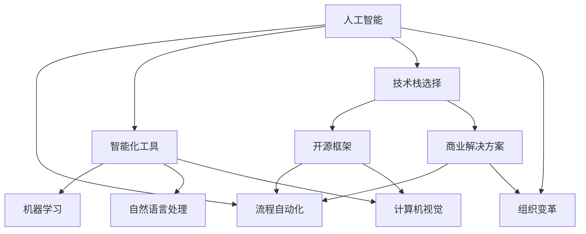

                 

# Reshape your workflow with AI?

> 关键词：人工智能,流程自动化,智能化工具,技术栈,组织变革

## 1. 背景介绍

### 1.1 问题由来

在过去的几十年中，技术的进步极大地推动了全球生产力的提升，人工智能（AI）技术尤为突出。AI技术不仅在图像识别、自然语言处理、语音识别等领域取得突破，更在企业运营、财务管理、供应链管理、市场营销等多个行业实现了落地应用。然而，尽管AI技术发展迅速，其在提升企业效率、优化决策、提高客户体验等方面的潜力仍未完全释放。企业亟需一种系统性、全面性的方法来重塑其业务流程和工作流程，以充分激发AI技术的潜力。

### 1.2 问题核心关键点

为了有效利用AI技术重塑工作流程，企业需要：

1. **评估现有工作流程**：分析哪些环节可以借助AI自动化或优化。
2. **选择合适的AI工具和框架**：根据业务需求，选择适合的AI技术栈。
3. **培训员工**：提升员工对AI工具的熟练程度。
4. **整合已有系统和数据**：确保AI工具可以无缝集成到现有业务系统中。
5. **持续优化和迭代**：根据实际使用反馈，不断调整和优化AI应用。

本文将深入探讨如何使用AI重塑企业的工作流程，详细分析AI技术在流程自动化、智能化工具、技术栈选择、组织变革等方面的应用和挑战，帮助企业实现智能化转型。

## 2. 核心概念与联系

### 2.1 核心概念概述

以下是几个与使用AI重塑工作流程密切相关的核心概念：

- **人工智能（AI）**：利用计算机算法和统计模型模拟人类智能的技术。
- **流程自动化**：利用AI技术自动执行重复性高、规则明确的任务，提升工作效率。
- **智能化工具**：集成AI技术的工具和平台，如机器学习、自然语言处理、计算机视觉等。
- **技术栈选择**：根据业务需求和现有资源，选择合适的技术栈。
- **组织变革**：企业内部结构和职能的调整，以适应智能化转型。

这些核心概念之间的逻辑关系可以通过以下Mermaid流程图来展示：



这个流程图展示了AI技术如何在流程自动化、智能化工具、技术栈选择和组织变革之间发挥作用。

## 3. 核心算法原理 & 具体操作步骤

### 3.1 算法原理概述

基于AI的工作流程重塑，通常涉及以下几个步骤：

1. **流程分析与映射**：通过业务流程分析和数据流映射，识别出可自动化的环节。
2. **数据预处理**：清洗、整理和标注数据，确保其可用性。
3. **模型选择与训练**：根据业务需求选择合适的AI模型，并在现有数据集上训练。
4. **模型部署与应用**：将训练好的模型部署到实际环境中，进行实时应用。
5. **监控与优化**：持续监控模型性能，根据实际反馈进行优化。

### 3.2 算法步骤详解

#### 3.2.1 流程分析与映射

- **业务流程建模**：使用工具（如BPMN、UML）对现有业务流程进行建模。
- **任务分解**：将流程分解为独立的、可自动化的任务单元。
- **识别机会**：根据业务流程图，识别出可自动化的环节。

#### 3.2.2 数据预处理

- **数据清洗**：处理缺失值、异常值，确保数据质量。
- **数据标注**：为AI模型提供训练数据。
- **数据增强**：通过数据扩充和增强技术提升模型性能。

#### 3.2.3 模型选择与训练

- **算法选择**：根据任务类型（如分类、回归、聚类等）选择适合的算法。
- **模型训练**：使用现有数据集训练模型。
- **超参数调优**：调整模型超参数以提升性能。

#### 3.2.4 模型部署与应用

- **模型集成**：将模型集成到现有系统中。
- **API开发**：开发API供其他系统调用。
- **用户培训**：对相关人员进行培训，确保模型正确使用。

#### 3.2.5 监控与优化

- **性能监控**：实时监控模型性能指标。
- **反馈收集**：收集用户反馈，评估模型效果。
- **持续优化**：根据反馈对模型进行优化。

### 3.3 算法优缺点

#### 3.3.1 优点

- **效率提升**：自动化和智能化工具可以大幅提升工作效率。
- **决策支持**：AI模型提供的数据分析和决策建议，提升决策质量。
- **适应性强**：AI系统可以根据新数据进行自我优化。

#### 3.3.2 缺点

- **成本高**：初始投资大，包括硬件、软件和人力成本。
- **技术复杂**：需要专业知识和技能。
- **数据依赖**：AI系统依赖高质量的数据，数据质量不足会影响效果。

### 3.4 算法应用领域

AI技术在工作流程重塑中的应用广泛，以下是几个典型应用领域：

- **制造业**：自动化生产线、质量检测、供应链管理等。
- **金融服务**：风险评估、欺诈检测、客户服务自动化等。
- **医疗保健**：病患诊断、药物研发、健康监测等。
- **零售电商**：个性化推荐、库存管理、客户服务自动化等。
- **物流配送**：路径优化、配送调度、订单处理等。
- **能源行业**：智能电网、能源消耗优化、安全监控等。

## 4. 数学模型和公式 & 详细讲解 & 举例说明

### 4.1 数学模型构建

在流程自动化和智能化工具的开发过程中，常见的数学模型包括线性回归、决策树、支持向量机、神经网络等。以线性回归模型为例，其数学模型构建如下：

$$
y = \theta_0 + \theta_1 x_1 + \theta_2 x_2 + ... + \theta_n x_n + \epsilon
$$

其中，$y$ 为输出变量，$x_1, x_2, ..., x_n$ 为输入变量，$\theta_0, \theta_1, \theta_2, ..., \theta_n$ 为模型参数，$\epsilon$ 为误差项。

### 4.2 公式推导过程

线性回归模型的最小二乘法目标函数为：

$$
\min_{\theta} \sum_{i=1}^n (y_i - (\theta_0 + \theta_1 x_{i1} + \theta_2 x_{i2} + ... + \theta_n x_{in}))^2
$$

通过对目标函数求偏导，可以解出最优参数 $\theta$。

### 4.3 案例分析与讲解

以一家制造企业的生产流程自动化为例，其需求为预测生产线的故障概率。通过收集历史生产数据，建立线性回归模型，预测未来可能的故障情况。模型训练步骤如下：

1. **数据收集**：收集过去一年的生产线数据，包括生产时间、设备状态、环境温度等。
2. **数据清洗**：处理缺失值，确保数据完整。
3. **模型训练**：使用线性回归模型训练，优化模型参数。
4. **模型评估**：在测试数据集上评估模型性能。
5. **模型应用**：将模型集成到生产系统中，实时预测故障概率。

## 5. 项目实践：代码实例和详细解释说明

### 5.1 开发环境搭建

在开始项目实践前，需要搭建开发环境。以下是一个典型的Python开发环境搭建流程：

1. **安装Python**：确保系统上安装了最新版本的Python。
2. **安装pip**：确保pip版本最新。
3. **安装虚拟环境**：使用pip安装virtualenv或conda，创建虚拟环境。
4. **安装依赖**：根据项目需求，安装所需的Python库和依赖。

### 5.2 源代码详细实现

以下是一个使用Python实现线性回归模型的代码示例：

```python
import numpy as np
from sklearn.linear_model import LinearRegression

# 准备数据
X = np.array([[1, 2, 3], [4, 5, 6], [7, 8, 9]])
y = np.array([3, 7, 11])

# 创建模型
model = LinearRegression()

# 训练模型
model.fit(X, y)

# 预测
x_test = np.array([[1, 2, 3]])
y_pred = model.predict(x_test)
```

### 5.3 代码解读与分析

以上代码实现了线性回归模型的基本功能。首先，准备数据集 $X$ 和输出变量 $y$。然后，使用 `LinearRegression` 类创建模型，调用 `fit` 方法训练模型，最后使用 `predict` 方法进行预测。

## 6. 实际应用场景

### 6.1 智能制造

在智能制造领域，AI技术可以用于生产线自动化、设备预测性维护、生产调度和质量控制等。例如，使用机器学习模型分析设备运行数据，预测设备故障和维护需求，优化生产调度，提升生产效率和质量。

### 6.2 金融风控

在金融行业，AI技术可以用于风险评估、欺诈检测、信用评分等。通过机器学习模型分析客户数据，识别潜在的风险和欺诈行为，及时预警并采取措施，降低风险损失。

### 6.3 医疗诊断

在医疗领域，AI技术可以用于病患诊断、医学影像分析、药物研发等。使用深度学习模型分析医学影像，识别病患病变区域，辅助医生诊断；利用自然语言处理技术，分析患者病历和医生记录，提供个性化的治疗建议。

### 6.4 智能客服

在零售电商行业，AI技术可以用于智能客服、个性化推荐、库存管理等。通过自然语言处理技术，实现客户自动回答，提升客户体验；利用推荐算法，提供个性化的商品推荐，提升销售转化率。

### 6.5 物流配送

在物流配送行业，AI技术可以用于路径优化、配送调度、订单处理等。通过优化算法，确定最佳配送路径和运输方案，提高配送效率和降低成本。

### 6.6 智能电网

在能源行业，AI技术可以用于智能电网、能源消耗优化、安全监控等。使用机器学习模型分析能源消耗数据，预测能源需求，优化能源分配；利用图像识别技术，实时监测电网运行状态，及时发现和处理异常情况。

## 7. 工具和资源推荐

### 7.1 学习资源推荐

以下是一些优秀的学习资源，可以帮助开发者系统掌握AI技术：

1. **Coursera《机器学习》课程**：由斯坦福大学教授Andrew Ng主讲，系统讲解机器学习基础和经典算法。
2. **Kaggle数据科学竞赛平台**：提供大量实际数据集和竞赛，提升实践能力。
3. **Google AI开发者文档**：涵盖机器学习、自然语言处理、计算机视觉等领域的详细信息。
4. **TensorFlow官方文档**：提供详细的API文档和示例代码，帮助开发者快速上手TensorFlow。
5. **PyTorch官方文档**：提供详细的API文档和示例代码，帮助开发者快速上手PyTorch。

### 7.2 开发工具推荐

以下是一些常用的开发工具，可以帮助开发者提升开发效率：

1. **Jupyter Notebook**：支持Python和R等语言，提供交互式开发环境。
2. **Visual Studio Code**：强大的代码编辑器，支持多种语言和插件。
3. **Git**：版本控制系统，帮助开发者协作开发和版本管理。
4. **Docker**：容器化技术，帮助开发者快速部署和测试应用。
5. **Kubernetes**：容器编排技术，帮助开发者实现大规模分布式部署。

### 7.3 相关论文推荐

以下是一些经典的AI相关论文，推荐阅读：

1. **《神经网络与深度学习》**：Michael Nielsen著，系统讲解神经网络和深度学习的基础知识。
2. **《深度学习》**：Ian Goodfellow著，深入探讨深度学习的原理和应用。
3. **《强化学习》**：Richard S. Sutton和Andrew G. Barto著，全面介绍强化学习的基本概念和算法。
4. **《机器学习实战》**：Peter Harrington著，提供大量实用的机器学习项目案例。
5. **《自然语言处理综论》**：Daniel Jurafsky和James H. Martin著，系统讲解自然语言处理的基本概念和技术。

## 8. 总结：未来发展趋势与挑战

### 8.1 研究成果总结

本文详细探讨了使用AI技术重塑工作流程的方法和步骤，介绍了AI技术在各个行业的应用案例，并推荐了相关的学习资源和工具。通过这些内容，读者可以系统了解AI技术在流程自动化、智能化工具、技术栈选择和组织变革中的应用，并为实际项目提供参考。

### 8.2 未来发展趋势

未来的AI技术将继续发展，推动更多行业的智能化转型。以下是一些未来趋势：

1. **多模态学习**：AI技术将能够处理多种数据类型（如图像、文本、语音等），提升系统综合能力。
2. **边缘计算**：AI技术将能够在边缘设备上进行计算和推理，提升响应速度和系统稳定性。
3. **自适应学习**：AI系统能够根据环境变化进行自我调整，提升适应性。
4. **联邦学习**：多个设备或服务器共享数据和模型，保护数据隐私的同时，提升模型效果。
5. **量子计算**：量子计算技术的发展将极大地提升AI模型的计算能力和效率。

### 8.3 面临的挑战

尽管AI技术发展迅速，但仍面临一些挑战：

1. **数据隐私和安全**：如何保护数据隐私和安全，避免数据泄露和滥用。
2. **算法透明和可解释性**：如何提高算法的透明性和可解释性，确保系统公平和可信。
3. **计算资源限制**：如何降低计算成本，提升AI模型的部署效率。
4. **人才缺口**：如何培养更多具备AI知识和技能的工程师和科学家。
5. **伦理和法律问题**：如何制定AI伦理和法律规范，确保AI技术的健康发展。

### 8.4 研究展望

未来的AI研究将需要从多个维度进行探索和突破：

1. **跨领域融合**：将AI技术与其它领域技术（如物联网、区块链等）进行融合，推动新的应用场景。
2. **持续学习和自适应**：研究如何使AI系统具备持续学习和自适应的能力，提升系统适应性。
3. **自动化和智能运维**：研究如何通过AI技术进行自动化运维，提升系统稳定性和可靠性。
4. **人机协作**：研究人机协作机制，提升AI系统在复杂任务中的表现。

## 9. 附录：常见问题与解答

**Q1：如何评估AI模型的性能？**

A: AI模型的性能评估通常通过以下几个指标进行：

1. **准确率（Accuracy）**：模型正确预测的样本占总样本数的比例。
2. **召回率（Recall）**：模型正确预测的正样本占实际正样本数的比例。
3. **精确率（Precision）**：模型正确预测的正样本占预测为正样本的样本数的比例。
4. **F1 Score**：综合准确率和召回率的指标，反映模型整体的性能。
5. **ROC曲线和AUC值**：通过绘制ROC曲线和计算AUC值，评估模型在不同阈值下的性能。

**Q2：AI模型的超参数调优有哪些方法？**

A: AI模型的超参数调优通常包括以下几种方法：

1. **网格搜索（Grid Search）**：通过遍历超参数组合，寻找最优参数。
2. **随机搜索（Random Search）**：在超参数空间中随机采样，寻找最优参数。
3. **贝叶斯优化（Bayesian Optimization）**：通过构建高斯过程模型，寻找最优参数。
4. **集成方法（Ensemble）**：结合多个模型进行投票或加权平均，提升模型性能。

**Q3：如何应对AI模型的过拟合问题？**

A: 应对AI模型的过拟合问题，通常采用以下几种方法：

1. **数据增强**：通过数据扩充和增强技术提升模型性能。
2. **正则化**：使用L1、L2正则化，防止模型过拟合。
3. **Dropout**：在训练过程中随机丢弃部分神经元，防止模型过拟合。
4. **早停法**：在验证集上监控模型性能，及时停止训练。

**Q4：AI模型在部署过程中需要注意哪些问题？**

A: AI模型在部署过程中需要注意以下几个问题：

1. **模型压缩和优化**：通过模型剪枝、量化等方法，减小模型体积，提升推理速度。
2. **模型监控和评估**：实时监控模型性能，根据反馈进行调整。
3. **数据安全和隐私**：保护数据安全和隐私，防止数据泄露。
4. **模型版本管理和更新**：确保模型版本管理有序，及时更新模型。

---

作者：禅与计算机程序设计艺术 / Zen and the Art of Computer Programming

