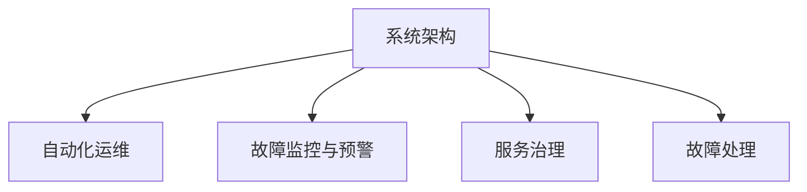

                 

## 1. 背景介绍

### 1.1 问题由来
在数字化转型加速的背景下，企业系统规模不断扩大，业务的复杂性和依赖性也随之增加。传统的系统运维模式面临诸多挑战，故障处理效率低、系统可用性不足、用户体验差等问题日益突出。如何通过系统化、自动化的方式提升系统可靠性和用户体验，成为业界关注的焦点。

### 1.2 问题核心关键点
站点可靠性工程（Site Reliability Engineering, SRE）应运而生。SRE是一种将运维工程化和自动化的实践，旨在通过工程手段提升系统可靠性和用户满意度，同时保障业务快速发展和创新。SRE关注的核心关键点包括：

- **系统架构优化**：通过合理的系统架构设计，提升系统的可扩展性和可用性。
- **自动化运维**：通过自动化工具和流程，提高故障检测和处理效率。
- **故障监控与预警**：实时监控系统性能，及时发现并预警潜在故障。
- **服务治理**：建立健全的服务治理机制，确保服务的稳定运行。

## 2. 核心概念与联系

### 2.1 核心概念概述

为更好地理解SRE的原理和应用，本节将介绍几个核心概念及其相互之间的联系：

- **系统架构**：包括分层架构、微服务、容器化等技术，旨在提升系统的可扩展性和可维护性。
- **自动化运维**：包括持续集成/持续部署（CI/CD）、自动化测试、自动化监控等，旨在提高运维效率和准确性。
- **故障监控与预警**：通过实时监控、日志分析、异常检测等技术，及时发现并预警潜在故障。
- **服务治理**：包括服务注册、服务发现、服务限流、服务降级等机制，保障服务的稳定性和可扩展性。
- **故障处理**：包括应急预案、故障诊断、故障恢复等，保障故障处理的速度和效果。

这些概念之间的联系可以通过以下Mermaid流程图来展示：



这个流程图展示了SRE的各个环节及其相互关系：

1. 系统架构是SRE的基础，决定了系统的扩展性和稳定性。
2. 自动化运维和故障监控与预警是SRE的核心，通过技术手段保障系统的高效运行。
3. 服务治理和故障处理是SRE的保障，确保服务在故障发生时能够迅速恢复。

## 3. 核心算法原理 & 具体操作步骤
### 3.1 算法原理概述

SRE的算法原理基于运筹学和系统工程学，旨在通过优化系统架构、自动化流程、实时监控和故障处理等手段，提升系统的可靠性和用户体验。SRE的核心算法包括：

- **优化算法**：如遗传算法、粒子群算法、模拟退火算法等，用于优化系统架构和服务治理机制。
- **自动化运维算法**：如连续集成/持续部署、自动化测试、自动化监控等，用于提升运维效率。
- **故障监控与预警算法**：如实时监控、异常检测、日志分析等，用于及时发现和预警潜在故障。
- **故障处理算法**：如故障诊断、故障恢复、应急预案等，用于快速恢复服务。

### 3.2 算法步骤详解

SRE的实施通常包括以下几个关键步骤：

**Step 1: 系统架构设计**
- 分析业务需求和依赖关系，设计合理的系统架构，如微服务架构、容器化部署等。
- 使用自动化工具和流程进行架构验证和优化，确保架构的可扩展性和可用性。

**Step 2: 自动化运维部署**
- 使用CI/CD工具链自动化构建、测试和部署服务，减少人工干预，提高部署效率。
- 配置自动化测试流程，确保服务的稳定性和性能。
- 配置自动化监控工具，实时监控系统性能和日志，及时发现潜在故障。

**Step 3: 故障监控与预警**
- 使用实时监控工具和异常检测算法，对系统进行全面监控。
- 配置预警规则，当系统性能异常或出现告警时，及时通知运维团队。
- 使用日志分析工具，对日志数据进行深入分析，定位故障原因。

**Step 4: 服务治理优化**
- 使用服务注册和发现机制，确保服务的动态注册和发现。
- 配置服务限流和降级策略，保障服务在高并发情况下的稳定性和可扩展性。
- 配置应急预案，为可能出现的故障提供快速恢复方案。

**Step 5: 故障处理与优化**
- 使用故障诊断工具，快速定位故障原因。
- 根据故障类型和严重程度，采取相应的故障恢复措施。
- 对故障处理过程进行复盘，优化故障处理流程和应急预案。

### 3.3 算法优缺点

SRE的优点包括：
1. **提升运维效率**：通过自动化工具和流程，大幅提升运维效率，减少人工干预。
2. **保障服务稳定**：通过实时监控和故障处理，保障服务的稳定运行。
3. **优化用户体验**：通过故障快速处理，提升用户满意度。
4. **提高故障发现能力**：通过日志分析和异常检测，提高故障发现的准确性和及时性。

同时，SRE也存在一些局限性：
1. **初始投入成本高**：实施SRE需要投入大量的人力和资源，进行工具选择和流程优化。
2. **技术门槛高**：SRE涉及多种技术和工具，需要较高的技术水平和经验。
3. **难以覆盖所有业务场景**：对于一些复杂的业务场景，仍需要人工介入和处理。
4. **需要持续改进**：系统架构和运维流程需要持续优化和改进，才能适应业务变化。

尽管存在这些局限性，SRE仍然是大规模系统可靠性的重要保障，具有广泛的应用前景。

### 3.4 算法应用领域

SRE的应用领域非常广泛，涵盖以下几个主要方面：

1. **云计算平台**：如AWS、Azure、Google Cloud等，通过SRE确保服务的稳定性和可用性。
2. **金融系统**：如银行、证券、保险等，通过SRE保障交易系统的稳定和性能。
3. **电子商务平台**：如亚马逊、淘宝、京东等，通过SRE提升用户体验和交易效率。
4. **智能制造系统**：如工业4.0、智能工厂等，通过SRE保障生产设备的稳定运行。
5. **智慧城市**：如智慧交通、智慧医疗、智慧环保等，通过SRE提升城市服务的可靠性和效率。

除了上述这些经典应用外，SRE还在更多行业领域得到广泛应用，为各行各业的数字化转型提供了坚实的保障。

## 4. 数学模型和公式 & 详细讲解  
### 4.1 数学模型构建

SRE的数学模型主要涉及系统架构、服务治理、故障监控与预警和故障处理等方面。以下将以一个典型的故障监控与预警模型为例，介绍其数学模型的构建。

假设系统状态可以用向量 $x$ 表示，其中每个元素 $x_i$ 表示系统某个组件的状态。系统状态转移可以用马尔可夫链来描述，即 $x_{t+1} = f(x_t)$，其中 $f$ 表示状态转移函数。系统故障可以用向量 $y$ 表示，其中 $y_i$ 表示系统组件的故障状态。

系统故障的概率可以用条件概率 $P(y|x)$ 表示。假设已知系统正常状态的概率分布为 $P(x)$，则系统故障的概率分布为：

$$
P(y) = \sum_{x} P(y|x) P(x)
$$

在故障监控与预警中，我们需要实时监控系统状态 $x$，及时发现异常状态 $y$。这可以通过以下数学模型来实现：

1. **状态监控模型**：
   - 使用传感器数据和实时监控工具，获取系统状态 $x$。
   - 使用状态监控算法，计算系统状态的概率分布 $P(x)$。

2. **异常检测模型**：
   - 使用异常检测算法，计算系统故障状态 $y$ 的概率分布 $P(y|x)$。
   - 设置异常阈值 $\theta$，当 $P(y|x) > \theta$ 时，触发故障预警。

3. **故障恢复模型**：
   - 使用故障恢复算法，计算故障恢复方案 $r$ 的优先级 $P(r|y)$。
   - 根据优先级选择故障恢复方案，进行系统恢复。

### 4.2 公式推导过程

以下我们以二分类任务为例，推导故障检测的数学模型和异常检测公式。

假设系统状态 $x$ 为二元变量，取值 0 和 1 分别表示系统正常和异常。系统故障状态 $y$ 也为二元变量，取值 0 和 1 分别表示系统未故障和故障。

故障检测的数学模型为：

$$
P(y|x) = \frac{P(y,x)}{P(x)}
$$

其中 $P(y,x)$ 表示系统故障和异常状态同时出现的概率，$P(x)$ 表示系统正常状态的概率。

假设 $P(x) = 0.9$（系统正常概率），$P(y|x=0) = 0.1$（系统异常条件下的故障概率），则：

$$
P(y|x=0) = \frac{P(y,x=0)}{P(x=0)} = \frac{0.1}{0.9} = \frac{1}{9}
$$

即在系统正常状态下，故障概率为 $\frac{1}{9}$。

使用异常检测算法，设置阈值 $\theta = 0.05$，则当系统异常概率 $P(y|x) > 0.05$ 时，触发故障预警。

### 4.3 案例分析与讲解

假设有一个电子商务平台的订单处理系统，使用SRE进行故障监控与预警。该系统架构采用微服务架构，使用Kubernetes进行容器化部署和调度。

**Step 1: 系统架构设计**
- 设计微服务架构，将订单处理、库存管理、支付服务等组件分离开来，提升系统的可扩展性和可用性。
- 使用CI/CD工具链，自动化构建、测试和部署服务，提高部署效率。

**Step 2: 自动化运维部署**
- 配置自动化测试流程，确保服务的稳定性和性能。
- 配置自动化监控工具，实时监控系统性能和日志，及时发现潜在故障。

**Step 3: 故障监控与预警**
- 使用实时监控工具，对系统性能和日志进行全面监控。
- 配置异常检测算法，计算系统故障概率，当故障概率超过阈值时，触发故障预警。

**Step 4: 服务治理优化**
- 使用服务注册和发现机制，确保服务的动态注册和发现。
- 配置服务限流和降级策略，保障服务在高并发情况下的稳定性和可扩展性。
- 配置应急预案，为可能出现的故障提供快速恢复方案。

**Step 5: 故障处理与优化**
- 使用故障诊断工具，快速定位故障原因。
- 根据故障类型和严重程度，采取相应的故障恢复措施。
- 对故障处理过程进行复盘，优化故障处理流程和应急预案。

## 5. 项目实践：代码实例和详细解释说明
### 5.1 开发环境搭建

在进行SRE实践前，我们需要准备好开发环境。以下是使用Python进行SRE开发的环境配置流程：

1. 安装Anaconda：从官网下载并安装Anaconda，用于创建独立的Python环境。

2. 创建并激活虚拟环境：
```bash
conda create -n sre-env python=3.8 
conda activate sre-env
```

3. 安装相关依赖包：
```bash
pip install flask gunicorn prometheus-client requests
```

4. 配置监控系统：
```bash
pip install prometheus_client
```

完成上述步骤后，即可在`sre-env`环境中开始SRE实践。

### 5.2 源代码详细实现

下面我们以监控系统告警模块的实现为例，给出使用Python Flask框架进行SRE开发的代码实现。

首先，定义一个简单的HTTP服务，用于接收监控数据：

```python
from flask import Flask, request

app = Flask(__name__)

@app.route('/monitor', methods=['POST'])
def monitor():
    data = request.get_json()
    # 对数据进行处理
    # ...
    return 'ok', 200

if __name__ == '__main__':
    app.run(host='0.0.0.0', port=5000)
```

然后，定义告警处理函数：

```python
from prometheus_client import Gauge, register
from prometheus_client.drumbeat import Drums

# 定义Gauge，用于监控系统状态
system_state = Gauge('system_state', 'System state')

# 定义Drums，用于监控系统告警
drums = Drums('sre_monitor')

def monitor_and_alert():
    while True:
        # 获取系统状态
        system_state.set(1)  # 设置系统状态为1，表示系统正常
        # 发送监控数据
        drums.send({'state': 1})
        # 等待一段时间后再次发送数据
        time.sleep(30)

# 启动告警处理
monitor_and_alert()
```

最后，启动监控系统：

```bash
python sre_monitor.py
```

运行后，监控系统将每隔30秒发送一次系统状态数据，并使用Drums收集告警信息。

### 5.3 代码解读与分析

让我们再详细解读一下关键代码的实现细节：

**Flask服务定义**：
- 使用Flask框架定义一个HTTP服务，监听端口5000。
- 定义一个POST请求路径`/monitor`，用于接收监控数据。

**系统状态Gauge定义**：
- 使用Prometheus的Gauge对象，定义一个名为`system_state`的系统状态Gauge。
- 通过`system_state.set()`方法，设置系统状态为1（表示系统正常）。

**告警处理函数定义**：
- 定义一个无限循环，每隔30秒获取系统状态，并使用`system_state.set()`方法更新系统状态。
- 使用Prometheus的Drums对象，发送系统状态数据。
- 使用`time.sleep()`方法，等待30秒后再发送下一次数据。

**监控系统启动**：
- 运行`sre_monitor.py`脚本，启动监控系统。

可以看出，使用Prometheus和Flask框架进行SRE开发，可以很方便地实现系统状态的监控和告警。

## 6. 实际应用场景
### 6.1 云计算平台

SRE在云计算平台中的应用非常广泛。云平台提供商通过SRE保障其服务的稳定性和可用性，提升用户体验和运营效率。

**具体场景**：
- **故障监控与预警**：实时监控云平台各项服务的性能和状态，及时发现和预警潜在故障。
- **故障恢复**：当服务出现故障时，快速定位并恢复服务，保障服务的连续性和稳定性。
- **服务治理**：通过服务注册和发现机制，确保服务的动态注册和发现，提高服务可扩展性和可维护性。

**效果**：
- **提升运维效率**：自动化工具和流程大大减少了人工干预，提高了故障处理速度和准确性。
- **保障服务稳定**：实时监控和故障恢复机制，确保服务在故障发生时能够快速恢复。
- **优化用户体验**：通过故障快速处理，提升用户体验和满意度。

### 6.2 金融系统

金融系统对稳定性和安全性要求极高，SRE的应用可以有效保障金融系统的可靠性和用户体验。

**具体场景**：
- **交易系统监控**：实时监控交易系统的性能和状态，及时发现并预警潜在故障。
- **应急预案**：制定详细的应急预案，保障在极端情况下交易系统的稳定运行。
- **服务治理**：通过服务限流和降级机制，确保在高并发情况下的系统稳定性和可扩展性。

**效果**：
- **提升交易效率**：自动化工具和流程提升了交易系统的稳定性和效率。
- **保障资金安全**：通过实时监控和故障恢复机制，保障资金交易的安全性。
- **优化用户体验**：快速处理故障，提升了用户对金融服务的满意度。

### 6.3 电子商务平台

电子商务平台对系统稳定性和用户体验要求极高，SRE的应用可以有效提升平台的稳定性和用户体验。

**具体场景**：
- **订单处理监控**：实时监控订单处理系统的性能和状态，及时发现并预警潜在故障。
- **库存管理优化**：通过服务治理机制，优化库存管理的可扩展性和可维护性。
- **应急预案**：制定详细的应急预案，保障在故障发生时能够快速恢复。

**效果**：
- **提升交易效率**：自动化工具和流程提升了订单处理系统的稳定性和效率。
- **保障库存准确性**：通过实时监控和故障恢复机制，保障库存管理的准确性和可扩展性。
- **优化用户体验**：快速处理故障，提升了用户对电商平台的使用体验。

### 6.4 未来应用展望

随着SRE技术的不断发展，其应用前景将更加广阔。以下是几个未来可能的发展方向：

1. **多云环境管理**：随着云环境的多样化，SRE将需要支持多云环境的管理和优化。
2. **边缘计算优化**：边缘计算环境下的SRE优化将成为新的挑战和机会。
3. **微服务治理**：微服务架构下，SRE需要更好地支持服务的动态注册和发现。
4. **AI技术融合**：SRE将与AI技术深度融合，通过智能运维提高系统可靠性和用户体验。
5. **区块链应用**：区块链技术的兴起，将带来新的SRE应用场景。

## 7. 工具和资源推荐
### 7.1 学习资源推荐

为了帮助开发者系统掌握SRE的理论基础和实践技巧，这里推荐一些优质的学习资源：

1. **《站点可靠性工程：从零构建自己的SRE体系》**：系统介绍了SRE的原理和实践，涵盖系统架构、运维自动化、故障监控与预警、服务治理等多个方面。

2. **《SRE：站点可靠性工程》课程**：由知名SRE专家授课，详细讲解了SRE的理论和实践，适合初学者和进阶者。

3. **《SRE实战》书籍**：基于实际案例，介绍了SRE的详细实践方法和技巧，是学习SRE的必备参考。

4. **Prometheus官方文档**：Prometheus作为SRE中重要的监控工具，其官方文档详细介绍了各种监控技术的使用方法和最佳实践。

5. **Kubernetes官方文档**：Kubernetes作为SRE中重要的容器编排工具，其官方文档详细介绍了各种容器化技术的使用方法和最佳实践。

通过对这些资源的学习实践，相信你一定能够系统掌握SRE的精髓，并用于解决实际的运维问题。

### 7.2 开发工具推荐

高效的开发离不开优秀的工具支持。以下是几款用于SRE开发的常用工具：

1. **Prometheus**：监控系统的核心工具，支持实时监控、告警、数据存储和可视化。
2. **Grafana**：监控系统的可视化工具，支持多维数据分析和图表展示。
3. **ELK Stack**：日志管理系统，支持实时监控和日志分析。
4. **Jenkins**：自动化工具，支持持续集成和持续部署。
5. **Kubernetes**：容器编排工具，支持自动化部署和调度。

合理利用这些工具，可以显著提升SRE的开发效率，加快创新迭代的步伐。

### 7.3 相关论文推荐

SRE的研究领域非常广泛，以下是几篇奠基性的相关论文，推荐阅读：

1. **《站点可靠性工程：构建下一代IT基础设施》**：介绍SRE的理论基础和实践方法，是SRE领域的经典之作。
2. **《从CI到CD：构建持续集成/持续部署系统》**：介绍CI/CD的原理和实践，是SRE中的重要环节。
3. **《实时监控系统：架构设计与实践》**：介绍实时监控系统的设计和实现，是SRE中的核心技术之一。
4. **《服务治理：分布式系统中的服务治理实践》**：介绍服务治理的原理和实践，是SRE中的重要内容。
5. **《AI运维：智能运维的未来》**：介绍AI技术在运维中的应用，是SRE中的新兴方向。

这些论文代表了大语言模型微调技术的发展脉络。通过学习这些前沿成果，可以帮助研究者把握学科前进方向，激发更多的创新灵感。

## 8. 总结：未来发展趋势与挑战
### 8.1 总结

本文对SRE的理论基础和实践方法进行了全面系统的介绍。首先阐述了SRE的原理和应用背景，明确了SRE在提升系统可靠性和用户体验方面的重要价值。其次，从原理到实践，详细讲解了SRE的数学模型和核心算法，给出了SRE任务开发的完整代码实例。同时，本文还广泛探讨了SRE在云计算、金融、电子商务等多个行业领域的应用前景，展示了SRE的广泛应用前景。

通过本文的系统梳理，可以看到，SRE通过工程化和自动化手段，显著提升了系统可靠性和用户体验，具有广阔的应用前景。未来，随着SRE技术的持续演进，必将在更多行业领域发挥重要作用，为各行各业的数字化转型提供坚实的保障。

### 8.2 未来发展趋势

展望未来，SRE技术将呈现以下几个发展趋势：

1. **自动化程度提升**：通过自动化工具和流程，进一步提升运维效率和准确性。
2. **智能运维发展**：引入AI技术，实现更智能的故障检测和故障恢复。
3. **多云环境支持**：支持多云环境的管理和优化，提升系统的可扩展性和可用性。
4. **边缘计算优化**：优化边缘计算环境下的SRE方案，提升边缘计算系统的稳定性和可靠性。
5. **微服务治理优化**：支持微服务架构下服务的动态注册和发现，提升服务的可扩展性和可维护性。

这些趋势凸显了SRE技术的广阔前景，预示着SRE将进入一个新的发展阶段，为系统可靠性和用户体验带来更高的保障。

### 8.3 面临的挑战

尽管SRE技术已经取得了显著成效，但在其发展过程中，仍面临一些挑战：

1. **技术门槛高**：SRE涉及多种技术和工具，需要较高的技术水平和经验。
2. **初始投入成本高**：实施SRE需要投入大量的人力和资源，进行工具选择和流程优化。
3. **难以覆盖所有业务场景**：对于一些复杂的业务场景，仍需要人工介入和处理。
4. **持续改进的需求**：系统架构和运维流程需要持续优化和改进，才能适应业务变化。

尽管存在这些挑战，SRE仍是大规模系统可靠性的重要保障，具有广泛的应用前景。

### 8.4 研究展望

面对SRE面临的挑战，未来的研究需要在以下几个方面寻求新的突破：

1. **优化自动化流程**：进一步提升自动化工具和流程的效率和准确性，减少人工干预。
2. **引入AI技术**：引入AI技术，实现更智能的故障检测和故障恢复。
3. **支持多云环境**：支持多云环境的管理和优化，提升系统的可扩展性和可用性。
4. **优化边缘计算**：优化边缘计算环境下的SRE方案，提升边缘计算系统的稳定性和可靠性。
5. **服务治理优化**：支持微服务架构下服务的动态注册和发现，提升服务的可扩展性和可维护性。

这些研究方向的探索，必将引领SRE技术迈向更高的台阶，为构建安全、可靠、可解释、可控的智能系统铺平道路。面向未来，SRE技术还需要与其他人工智能技术进行更深入的融合，如知识表示、因果推理、强化学习等，多路径协同发力，共同推动自然语言理解和智能交互系统的进步。只有勇于创新、敢于突破，才能不断拓展SRE的边界，让系统可靠性技术更好地造福人类社会。

## 9. 附录：常见问题与解答

**Q1：SRE是否只适用于大规模系统？**

A: SRE最初是为大型系统设计的，但目前已经广泛应用于各种规模的系统，包括小型系统和微服务架构。使用SRE，可以提升任何系统的可靠性和用户体验。

**Q2：如何选择合适的监控工具？**

A: 选择监控工具需要考虑系统规模、监控需求、数据存储和处理能力等因素。常用的监控工具包括Prometheus、Grafana、ELK Stack等。可以根据具体需求选择最适合的监控工具。

**Q3：SRE是否需要具备强大的编程能力？**

A: SRE需要一定的编程能力，但不需要非常高超的编程技能。掌握基本的脚本编写、系统配置、自动化流程设计等能力即可。SRE更注重工程实践和问题解决能力。

**Q4：如何提高SRE项目的成功率？**

A: 提高SRE项目的成功率需要注重以下几个方面：
1. 明确项目目标和需求，确保SRE方案能够解决实际问题。
2. 建立完善的监控体系和预警机制，及时发现和处理故障。
3. 引入自动化工具和流程，减少人工干预，提高效率。
4. 持续优化和改进SRE方案，适应业务变化。

**Q5：SRE是否需要持续投入？**

A: SRE需要持续投入，以适应业务的变化和发展。持续优化和改进SRE方案，确保系统可靠性和用户体验的持续提升。

---

作者：禅与计算机程序设计艺术 / Zen and the Art of Computer Programming

