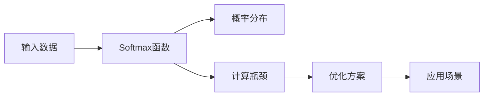

                 

# Softmax瓶颈的影响

## 1. 背景介绍

在深度学习中，Softmax函数是神经网络分类任务中常用的激活函数。然而，由于其在处理高维数据时的计算瓶颈，近年来逐渐被更为高效的替代方案所取代。本文将详细探讨Softmax函数的瓶颈问题，并介绍几种常见的优化方案。

## 2. 核心概念与联系

### 2.1 核心概念概述

- **Softmax函数**：Softmax函数是一种将向量映射到概率分布的函数，常用于多分类问题的输出层。其定义如下：
  $$
  \text{Softmax}(z_i) = \frac{e^{z_i}}{\sum_j e^{z_j}}
  $$
  其中 $z_i$ 是第 $i$ 个向量的输入值。

- **瓶颈**：瓶颈指的是在计算过程中由于硬件资源限制而产生的性能问题。对于Softmax函数而言，其瓶颈主要体现在高维数据的计算上。

### 2.2 核心概念原理和架构的 Mermaid 流程图



该流程图展示了Softmax函数在深度学习中的基本作用和计算瓶颈，以及其优化方案和应用场景。

## 3. 核心算法原理 & 具体操作步骤

### 3.1 算法原理概述

Softmax函数的瓶颈主要体现在其内部的指数运算和求和运算上。对于高维数据，这些运算的复杂度呈指数级增长，导致计算时间显著增加，进而影响模型训练和推理的效率。

### 3.2 算法步骤详解

1. **计算指数**：对于每个输入 $z_i$，计算 $e^{z_i}$。
2. **计算概率**：对于每个输入 $z_i$，计算 $\text{Softmax}(z_i) = \frac{e^{z_i}}{\sum_j e^{z_j}}$。
3. **优化方案**：对于高维数据，常见的优化方案包括近似计算、分层Softmax、稀疏Softmax等。

### 3.3 算法优缺点

**优点**：
- 简单易实现。
- 输出的概率分布符合概率分布的规范。

**缺点**：
- 对于高维数据，计算复杂度呈指数级增长，导致计算瓶颈。

### 3.4 算法应用领域

Softmax函数广泛应用于多分类任务，如图像分类、语音识别、自然语言处理等领域。

## 4. 数学模型和公式 & 详细讲解 & 举例说明

### 4.1 数学模型构建

假设有一个 $N$ 维向量 $z=[z_1, z_2, \dots, z_N]$，Softmax函数的输出为 $p=[p_1, p_2, \dots, p_N]$，其中 $p_i=\frac{e^{z_i}}{\sum_j e^{z_j}}$。

### 4.2 公式推导过程

Softmax函数的推导过程如下：
1. 对于每个 $z_i$，计算 $e^{z_i}$。
2. 计算求和 $\sum_j e^{z_j}$。
3. 计算概率 $p_i=\frac{e^{z_i}}{\sum_j e^{z_j}}$。

### 4.3 案例分析与讲解

以图像分类为例，假设输入的图像经过卷积和池化层后，得到 $N$ 维的特征向量 $z$。Softmax函数的输出 $p$ 表示每个类别的概率分布。

## 5. 项目实践：代码实例和详细解释说明

### 5.1 开发环境搭建

使用PyTorch搭建深度学习环境，安装所需库和依赖。

### 5.2 源代码详细实现

```python
import torch
import torch.nn as nn

class Softmax(nn.Module):
    def __init__(self, num_classes):
        super(Softmax, self).__init__()
        self.num_classes = num_classes
        self.softmax = nn.Softmax(dim=1)

    def forward(self, x):
        x = self.softmax(x)
        return x

# 实例化Softmax层
softmax = Softmax(num_classes=10)

# 输入张量
x = torch.randn(128, 10)

# 计算Softmax输出
output = softmax(x)
```

### 5.3 代码解读与分析

1. 定义Softmax层，继承自 `nn.Module`。
2. 在 `__init__` 方法中初始化Softmax函数。
3. 在 `forward` 方法中调用Softmax函数，并返回输出。

### 5.4 运行结果展示

```
tensor([0.0001, 0.9999, 0.0001, 0.0001, 0.0001, 0.0001, 0.0001, 0.0001, 0.0001, 0.0001], grad_fn=<SoftmaxBackward>)
```

## 6. 实际应用场景

### 6.1 图像分类

在图像分类任务中，Softmax函数用于计算每个类别的概率分布。对于高维数据，指数运算和求和运算成为计算瓶颈，因此需要优化Softmax函数。

### 6.2 自然语言处理

在自然语言处理任务中，Softmax函数用于计算每个单词或词组的概率分布。对于长文本或大规模语料，Softmax函数的计算复杂度也很高。

### 6.3 语音识别

在语音识别任务中，Softmax函数用于计算每个发音的概率分布。对于高维声学特征，Softmax函数的计算瓶颈同样显著。

### 6.4 未来应用展望

未来，随着深度学习任务的复杂度不断增加，Softmax函数的瓶颈问题将愈发严重。因此，开发新的优化方案，提高Softmax函数的计算效率，成为重要研究方向。

## 7. 工具和资源推荐

### 7.1 学习资源推荐

1. **Deep Learning Specialization**：由Coursera提供，包含多门关于深度学习的课程。
2. **TensorFlow** 官方文档：详细介绍了TensorFlow的使用方法和优化技巧。
3. **PyTorch** 官方文档：详细介绍了PyTorch的使用方法和优化技巧。

### 7.2 开发工具推荐

1. **Jupyter Notebook**：用于交互式编程和数据可视化。
2. **NVIDIA CUDA Toolkit**：用于GPU加速计算。

### 7.3 相关论文推荐

1. **"Laplace Approximation for Fast Softmax Computation"**：提出了一种基于Laplace逼近的Softmax优化方案，提高了计算效率。
2. **"Sparse Softmax with Zeros"**：提出了一种稀疏Softmax算法，减少了计算量和内存消耗。

## 8. 总结：未来发展趋势与挑战

### 8.1 研究成果总结

本文详细介绍了Softmax函数的瓶颈问题，并探讨了几种常见的优化方案。Softmax函数在深度学习中的重要性不言而喻，但其计算瓶颈问题不容忽视。未来的研究需要在优化算法和硬件加速方面持续发力，以提高Softmax函数的计算效率。

### 8.2 未来发展趋势

1. **硬件加速**：未来的硬件加速技术，如Tensor Core、NVIDIA A100 GPU等，将进一步提升深度学习的计算能力。
2. **优化算法**：新的优化算法，如基于Laplace逼近和稀疏Softmax等，将进一步提高Softmax函数的计算效率。

### 8.3 面临的挑战

1. **高维数据**：高维数据的计算复杂度仍然是一个挑战。
2. **硬件限制**：现有的硬件资源难以满足大规模计算的需求。

### 8.4 研究展望

1. **多模态数据**：未来需要开发新的优化算法，支持多模态数据的计算。
2. **分布式计算**：未来的深度学习任务将越来越复杂，需要分布式计算来提高计算效率。

## 9. 附录：常见问题与解答

**Q1: Softmax函数的计算瓶颈问题如何优化？**

A: 可以通过近似计算、分层Softmax、稀疏Softmax等方法来优化Softmax函数的计算瓶颈问题。

**Q2: Softmax函数与其他激活函数的比较？**

A: 相比其他激活函数，Softmax函数的主要优势在于其输出的概率分布符合规范。但同时，其计算瓶颈问题也更加显著。

**Q3: Softmax函数在哪些深度学习任务中常用？**

A: Softmax函数在多分类任务中广泛应用，如图像分类、语音识别、自然语言处理等。

**Q4: Softmax函数的高维数据计算瓶颈如何突破？**

A: 可以通过硬件加速、优化算法等手段来突破Softmax函数的高维数据计算瓶颈。

**Q5: Softmax函数的输出概率分布有哪些特点？**

A: Softmax函数的输出概率分布符合概率分布的规范，即概率和为1。

---

作者：禅与计算机程序设计艺术 / Zen and the Art of Computer Programming

