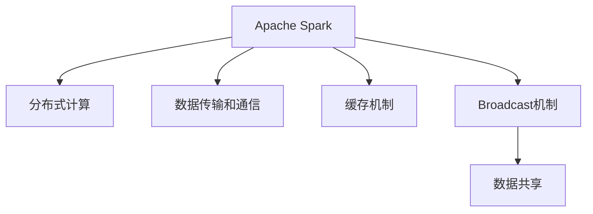

                 

# Spark Broadcast原理与代码实例讲解

> 关键词：Spark Broadcast, 大数据, 分布式计算, 内存缓存, 数据共享, 缓存机制, 数据通信, 编程模型, 数据科学

## 1. 背景介绍

### 1.1 问题由来

随着大数据时代的到来，数据量的爆炸性增长使得传统的数据处理技术难以应对。为了提升数据处理效率，需要一种全新的数据处理框架，以支持分布式计算和海量数据的实时处理。Apache Spark应运而生，成为了大数据处理的主流技术之一。

然而，Spark的分布式计算模型需要频繁地进行数据传输和通信，这大大增加了网络延迟和系统开销，严重影响了整个系统的性能。为了解决这个问题，Spark引入了广播(Broadcast)机制，允许某一节点缓存数据并让所有节点共享，从而大大减少了数据传输次数，提高了数据处理的效率。

### 1.2 问题核心关键点

Spark Broadcast机制的核心思想是：在一个集群中，某节点缓存一份数据，其他节点共享这份数据，以减少数据传输和通信成本。Broadcast机制的主要应用场景包括：

- 在MapReduce任务中，一些需要多次使用的参数，如字典、常量等，可以缓存一份并进行广播，避免重复传输。
- 在Spark SQL查询中，一些需要多次使用的常量表，如时间窗口、区间等，可以广播到所有执行节点，减少数据传输。
- 在机器学习任务中，一些需要多次使用的权重矩阵、模型参数等，可以广播以提高训练速度。

这些应用场景共同构成了Spark Broadcast机制的核心价值，通过减少数据传输，显著提升了大数据处理的速度和效率。

## 2. 核心概念与联系

### 2.1 核心概念概述

为更好地理解Spark Broadcast机制，本节将介绍几个密切相关的核心概念：

- **Apache Spark**：Apache Spark是一个快速、通用的大数据处理框架，支持分布式计算和内存计算，提供了丰富的API，适用于各种数据处理任务。
- **分布式计算**：分布式计算是指将计算任务拆分成多个子任务，分别在不同的计算节点上并行执行，以加速计算过程。
- **数据传输和通信**：在大数据处理中，数据需要在不同的计算节点之间进行传输和通信，以支持分布式计算。
- **缓存机制**：缓存机制是指将数据临时存储在内存中，供多个节点共享，以减少数据传输次数，提高数据处理效率。
- **Broadcast机制**：Spark Broadcast机制是一种特殊的缓存机制，允许某节点缓存数据并让所有节点共享，以减少数据传输和通信成本。

这些核心概念之间的逻辑关系可以通过以下Mermaid流程图来展示：



这个流程图展示了大数据处理的基本框架和Spark Broadcast机制的作用：

1. 大数据处理框架Apache Spark通过分布式计算进行大规模数据处理。
2. 在分布式计算过程中，数据需要在不同的计算节点之间进行传输和通信。
3. 为了减少数据传输，Spark引入了缓存机制，将数据临时存储在内存中。
4. Broadcast机制是一种特殊的缓存机制，允许某节点缓存数据并让所有节点共享，进一步减少数据传输次数。

## 3. 核心算法原理 & 具体操作步骤
### 3.1 算法原理概述

Spark Broadcast机制的核心思想是在某节点缓存一份数据，并通过RDD或DataFrame API将这份数据广播到所有执行节点。Broadcast机制的原理可以简单概括为以下几个步骤：

1. 客户端节点向Spark集群提交Broadcast变量的请求，Spark集群将广播变量缓存到某个节点。
2. 其他节点在计算过程中如果需要访问广播变量，Spark集群会将广播变量复制到该节点的内存中。
3. 多个计算节点共享这份广播变量，减少数据传输和通信成本，提高数据处理效率。

### 3.2 算法步骤详解

Spark Broadcast机制的操作过程相对简单，但需要理解其核心思想和使用方法。下面是Broadcast机制的具体操作步骤：

1. 创建一个RDD或DataFrame，并将其转换为Broadcast变量。例如，使用`bc = sc.broadcast(rdd)`将RDD `rdd`转换为Broadcast变量。
2. 在计算任务中使用Broadcast变量，例如在Map函数中访问Broadcast变量。
3. 执行计算任务，Spark集群会自动将Broadcast变量复制到所有计算节点的内存中。

### 3.3 算法优缺点

Spark Broadcast机制具有以下优点：

1. **减少数据传输**：通过缓存一份数据，并让所有节点共享，减少了数据传输和通信成本，显著提升了数据处理效率。
2. **提高性能**：由于不需要重复传输数据，计算任务执行速度更快，系统负载更轻。
3. **支持多种数据类型**：Broadcast机制支持多种数据类型，包括数组、字典、元组等，适用范围广泛。

同时，Broadcast机制也存在一些缺点：

1. **内存占用**：如果Broadcast变量过大，将占用大量的内存，导致系统性能下降。
2. **不适合大集群**：Broadcast机制在大集群中的应用效果可能不如预期，因为它需要传输的数据量较大。
3. **缓存机制复杂**：Broadcast机制的实现需要缓存一份数据，并将其复制到所有节点的内存中，这对系统的内存管理提出了更高的要求。

### 3.4 算法应用领域

Spark Broadcast机制广泛应用于各种大数据处理任务中，例如：

1. 文本处理：在文本处理任务中，需要多次使用的字典、词表等，可以通过Broadcast机制进行缓存，减少数据传输。
2. 机器学习：在机器学习任务中，需要多次使用的权重矩阵、模型参数等，可以通过Broadcast机制进行共享，提高训练速度。
3. 数据聚合：在数据聚合任务中，需要多次使用的常量表、时间窗口等，可以通过Broadcast机制进行共享，减少数据传输。
4. 分布式计算：在分布式计算任务中，需要多次使用的参数、配置等，可以通过Broadcast机制进行缓存，提高计算效率。

## 4. 数学模型和公式 & 详细讲解 & 举例说明（备注：数学公式请使用latex格式，latex嵌入文中独立段落使用 $$，段落内使用 $)
### 4.1 数学模型构建

Spark Broadcast机制的数学模型相对简单，主要涉及数据传输和缓存两个方面。假设在一个集群中，有 $n$ 个计算节点，每个节点的内存大小为 $m$ 字节。如果Broadcast变量的数据大小为 $d$ 字节，那么Broadcast机制的效率可以表示为：

$$
\text{效率} = \frac{d}{n \times m}
$$

其中 $d$ 为Broadcast变量的数据大小，$n$ 为计算节点的数量，$m$ 为每个节点的内存大小。

### 4.2 公式推导过程

Broadcast机制的效率可以进一步推导为：

$$
\text{效率} = \frac{d}{n \times m} = \frac{d}{n} \times \frac{1}{m}
$$

从公式可以看出，Broadcast机制的效率与Broadcast变量的数据大小、集群节点的数量和每个节点的内存大小有关。在数据大小和集群规模固定的情况下，Broadcast机制的效率与每个节点的内存大小成反比。

### 4.3 案例分析与讲解

假设在一个有10个节点的集群中，每个节点的内存大小为1GB，Broadcast变量的数据大小为1MB。那么Broadcast机制的效率可以计算如下：

$$
\text{效率} = \frac{1MB}{10} \times \frac{1}{1GB} = \frac{1MB}{10GB} = \frac{1}{10000}
$$

即Broadcast机制的效率为每1MB数据占用10000个节点内存大小。这表示，在每个节点内存大小固定的情况下，Broadcast机制的效率与Broadcast变量的数据大小成反比。

## 5. 项目实践：代码实例和详细解释说明
### 5.1 开发环境搭建

在进行Broadcast机制的实践前，我们需要准备好开发环境。以下是使用Python进行Spark开发的环境配置流程：

1. 安装Anaconda：从官网下载并安装Anaconda，用于创建独立的Python环境。

2. 创建并激活虚拟环境：
```bash
conda create -n spark-env python=3.8 
conda activate spark-env
```

3. 安装PySpark：从官网获取对应的安装命令，并按照指示进行安装。

4. 安装相关依赖库：
```bash
pip install numpy pandas scikit-learn pyspark
```

完成上述步骤后，即可在`spark-env`环境中开始Broadcast机制的实践。

### 5.2 源代码详细实现

下面是使用PySpark实现Broadcast机制的代码示例，包含一个简单的Map函数：

```python
from pyspark import SparkContext, SparkConf

conf = SparkConf().setAppName("Broadcast Example").setMaster("local[2]")
sc = SparkContext(conf=conf)

# 创建一个RDD，并将其中一部分数据转换为Broadcast变量
rdd = sc.parallelize([1, 2, 3, 4, 5])
bc = sc.broadcast(rdd)

# 定义一个Map函数，访问Broadcast变量
def map_func(x):
    return x + bc.value[0]

# 应用Map函数
result = rdd.map(map_func)

# 输出结果
print(result.collect())
```

### 5.3 代码解读与分析

让我们再详细解读一下关键代码的实现细节：

**SparkContext和Broadcast变量**：
- `SparkContext`：Spark的入口点，负责初始化Spark环境，并管理计算节点。
- `Broadcast变量`：Broadcast变量是将数据缓存到某个节点，并让所有节点共享的机制。

**Map函数**：
- `map_func`：定义了一个简单的Map函数，访问Broadcast变量。在函数中，我们使用`bc.value`访问Broadcast变量，并在返回值上加上变量值。

**应用Map函数**：
- `rdd.map(map_func)`：对RDD `rdd`应用Map函数，所有节点共享Broadcast变量。

**输出结果**：
- `result.collect()`：获取计算结果，并输出到控制台。

## 6. 实际应用场景

### 6.1 大数据处理

在大数据处理中，数据量通常很大，需要进行多次计算和分析。Spark Broadcast机制可以在多次计算中使用相同的参数，显著减少数据传输和通信成本，提高计算效率。例如，在计算集群中，需要对每个数据记录进行多次操作，可以将操作参数存储在Broadcast变量中，避免重复传输，提高计算速度。

### 6.2 机器学习

在机器学习任务中，需要多次使用的参数如权重矩阵、模型参数等，可以通过Broadcast机制进行共享，提高训练速度。例如，在Spark MLlib库中，可以使用Broadcast变量存储线性回归模型参数，在每个计算节点上共享使用，避免重复训练模型。

### 6.3 分布式计算

在分布式计算任务中，需要多次使用的参数如时间窗口、常量表等，可以通过Broadcast机制进行共享，减少数据传输。例如，在Spark Streaming库中，可以使用Broadcast变量存储时间窗口大小，在每个计算节点上共享使用，减少数据传输和通信成本。

### 6.4 未来应用展望

随着大数据和机器学习技术的不断进步，Spark Broadcast机制的应用也将更加广泛。未来，Broadcast机制可能会在以下几个方向上继续发展：

1. 支持更复杂的数据类型：Broadcast机制可以支持更复杂的数据类型，如稀疏矩阵、图结构等，进一步拓展其应用范围。
2. 优化内存管理：Broadcast机制的效率与内存大小有关，未来可能会引入更高效的内存管理策略，进一步优化Broadcast机制的性能。
3. 支持大规模集群：Broadcast机制在大规模集群中的应用效果可能不如预期，未来可能会引入更高效的通信和数据传输策略，支持大规模集群的应用。

## 7. 工具和资源推荐
### 7.1 学习资源推荐

为了帮助开发者系统掌握Spark Broadcast机制的理论基础和实践技巧，这里推荐一些优质的学习资源：

1. **Apache Spark官方文档**：Spark官方文档详细介绍了Broadcast机制的工作原理、使用方法和最佳实践。
2. **《Spark: The Definitive Guide》书籍**：由Spark社区成员撰写，全面介绍了Spark的核心功能和API，包括Broadcast机制的应用。
3. **Coursera上的“Apache Spark”课程**：由Spark社区提供，涵盖了Spark的核心概念和使用方法，包括Broadcast机制的详细讲解。
4. **GitHub上的Spark示例代码**：GitHub上有很多Spark示例代码，可以供开发者参考和学习。

通过对这些资源的学习实践，相信你一定能够快速掌握Spark Broadcast机制的精髓，并用于解决实际的Spark任务。

### 7.2 开发工具推荐

高效的开发离不开优秀的工具支持。以下是几款用于Spark Broadcast机制开发的常用工具：

1. PySpark：Python语言的Spark API，提供了丰富的数据处理和计算功能，适用于各种Spark应用开发。
2. Hadoop：Spark的底层框架，提供了分布式文件系统、数据处理等功能，适用于大规模数据的存储和处理。
3. Zeppelin：Spark的笔记本界面，支持编写和运行Spark任务，方便开发和调试。
4. Jupyter Notebook：一种轻量级的交互式编程环境，支持Python、R等多种语言，适用于快速开发和测试Spark任务。
5. Spark UI：Spark的Web界面，用于监控Spark任务的执行情况，分析任务性能和瓶颈。

合理利用这些工具，可以显著提升Spark Broadcast机制的开发效率，加快创新迭代的步伐。

### 7.3 相关论文推荐

Spark Broadcast机制的发展源于学界的持续研究。以下是几篇奠基性的相关论文，推荐阅读：

1. **"Spark: Cluster Computing with Fault Tolerance"**：Apache Spark的创始论文，介绍了Spark的架构和基本概念，包括Broadcast机制。
2. **"SPARK: Rethinking Distributed Computing for Machine Learning"**：Spark机器学习库的介绍论文，详细讲解了Broadcast机制在机器学习中的应用。
3. **"Improved Resilience for Fault Tolerant Spark"**：Spark社区发布的改进论文，介绍了Spark在容错和可靠性方面的改进，包括Broadcast机制的优化。

这些论文代表了大数据处理和Spark技术的发展脉络。通过学习这些前沿成果，可以帮助研究者把握学科前进方向，激发更多的创新灵感。

## 8. 总结：未来发展趋势与挑战

### 8.1 总结

本文对Spark Broadcast机制进行了全面系统的介绍。首先阐述了Spark Broadcast机制的背景和核心思想，明确了Broadcast机制在减少数据传输和通信成本方面的重要价值。其次，从原理到实践，详细讲解了Broadcast机制的工作流程，给出了Broadcast机制的代码实例。同时，本文还探讨了Broadcast机制在实际应用中的多种场景和未来发展方向，展示了Broadcast机制的广阔应用前景。

通过本文的系统梳理，可以看到，Spark Broadcast机制在大数据处理和分布式计算中起到了重要的作用，极大地提升了数据处理的效率和性能。未来，随着Spark技术的不断演进，Broadcast机制也将成为Spark生态系统的重要组成部分，进一步推动大数据处理的智能化和自动化。

### 8.2 未来发展趋势

展望未来，Spark Broadcast机制将呈现以下几个发展趋势：

1. **支持更复杂的数据类型**：Broadcast机制可以支持更复杂的数据类型，如稀疏矩阵、图结构等，进一步拓展其应用范围。
2. **优化内存管理**：Broadcast机制的效率与内存大小有关，未来可能会引入更高效的内存管理策略，进一步优化Broadcast机制的性能。
3. **支持大规模集群**：Broadcast机制在大规模集群中的应用效果可能不如预期，未来可能会引入更高效的通信和数据传输策略，支持大规模集群的应用。
4. **结合新兴技术**：Broadcast机制可以与其他新兴技术结合，如人工智能、机器学习等，进一步提升数据处理的智能化水平。

这些趋势凸显了Spark Broadcast机制的强大生命力和广阔应用前景，随着技术的不断进步，Broadcast机制必将在大数据处理中扮演越来越重要的角色。

### 8.3 面临的挑战

尽管Spark Broadcast机制已经取得了显著的成果，但在迈向更加智能化、普适化应用的过程中，它仍面临着诸多挑战：

1. **内存占用**：如果Broadcast变量过大，将占用大量的内存，导致系统性能下降。
2. **缓存机制复杂**：Broadcast机制的实现需要缓存一份数据，并将其复制到所有节点的内存中，这对系统的内存管理提出了更高的要求。
3. **不适合大集群**：Broadcast机制在大集群中的应用效果可能不如预期，因为它需要传输的数据量较大。
4. **数据同步问题**：在集群中，数据同步和通信可能会成为性能瓶颈，需要在设计时充分考虑。

### 8.4 研究展望

面对Spark Broadcast机制所面临的种种挑战，未来的研究需要在以下几个方面寻求新的突破：

1. **优化内存管理**：开发更高效的内存管理策略，减少Broadcast变量的内存占用，提高系统性能。
2. **优化数据传输**：引入更高效的数据传输和通信策略，减少数据同步时间和开销，提高系统效率。
3. **支持更多数据类型**：支持更复杂的数据类型，如稀疏矩阵、图结构等，进一步拓展Broadcast机制的应用范围。
4. **结合新兴技术**：与其他新兴技术如人工智能、机器学习等结合，提升Broadcast机制的智能化水平，解决数据处理中的复杂问题。

这些研究方向将引领Spark Broadcast机制走向更高的台阶，为大数据处理和分布式计算提供更加高效、智能的解决方案。

## 9. 附录：常见问题与解答

**Q1：Spark Broadcast机制是否适用于所有大数据处理任务？**

A: Spark Broadcast机制在大数据处理中具有广泛的应用前景，但并不适用于所有任务。Broadcast机制适用于需要多次使用的参数和常量，如字典、权重矩阵、时间窗口等。如果数据量很大，但不需要多次使用，或者每次计算的数据不同，那么Broadcast机制可能不适用。

**Q2：Spark Broadcast机制如何与大数据处理框架如Hadoop结合使用？**

A: Spark Broadcast机制可以与Hadoop结合使用，但需要在Spark集群中配置Hadoop相关的参数，并确保Hadoop和Spark之间的数据传输和通信顺畅。具体而言，需要在Spark集群中配置Hadoop的路径和配置信息，以确保Spark可以访问Hadoop存储的数据。

**Q3：Spark Broadcast机制如何优化内存使用？**

A: 在使用Broadcast机制时，可以通过以下方式优化内存使用：
1. 缩小Broadcast变量的数据大小，避免不必要的数据传输。
2. 使用压缩算法对Broadcast变量进行压缩，减少内存占用。
3. 设置合适的分片大小，避免内存不足或内存浪费。

**Q4：Spark Broadcast机制在处理大规模数据时需要注意哪些问题？**

A: 在使用Spark Broadcast机制处理大规模数据时，需要注意以下问题：
1. 内存占用：Broadcast变量的数据大小不能超过集群的内存限制，否则会导致内存不足。
2. 数据同步：在集群中，数据同步和通信可能会成为性能瓶颈，需要优化数据传输策略。
3. 分布式计算：在大规模集群中，Broadcast机制的效果可能不如预期，需要引入更高效的通信和数据传输策略。

---

作者：禅与计算机程序设计艺术 / Zen and the Art of Computer Programming

