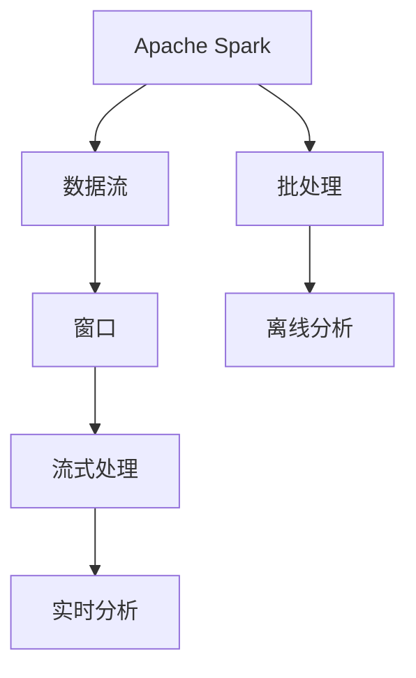

                 

# Spark Streaming原理与代码实例讲解

> 关键词：Spark Streaming, 实时数据处理, 数据流, 批处理, 流式处理, 流式算法, 实时分析, 分布式系统, 大数据处理, 流式API

## 1. 背景介绍

### 1.1 问题由来
随着互联网和物联网的迅速发展，数据生成和传播的速度不断加快，数据量激增，给传统数据处理方式带来了挑战。传统的批处理模式无法实时响应用户请求，也无法捕捉到数据中的瞬时变化。

Spark Streaming作为Apache Spark的核心模块之一，旨在解决这一问题，提供了一个用于实时处理数据流的API，可以实时处理流数据并快速生成有价值的洞察，极大地提升了数据处理的实时性和灵活性。

### 1.2 问题核心关键点
Spark Streaming通过将数据流切分成小的、滑动的时间窗口，将这些窗口中的数据作为批处理任务进行并行处理。利用Apache Spark的强大计算能力，Spark Streaming提供了多种流式算法和API，支持实时数据分析、机器学习、图处理等多种应用场景。

## 2. 核心概念与联系

### 2.1 核心概念概述

为更好地理解Spark Streaming的工作原理，本节将介绍几个关键概念：

- **Apache Spark**：Spark是一个用于大数据处理的开源分布式计算系统，支持内存计算、批处理、流处理等多种计算模型，提供了RDD、DataFrame等高级抽象。

- **数据流**：数据流指的是连续生成和不断变化的数据序列，如日志文件、传感器数据、网络流量等。

- **窗口**：窗口指的是将数据流切分成固定时间长度的时间段，如1秒钟、5分钟等，每个窗口内的数据作为批处理任务进行处理。

- **流式处理**：流式处理指的是实时处理数据流，不断产生新的分析结果，适用于事件驱动的实时数据分析。

- **批处理**：批处理指的是对一段时间内的数据进行整体处理，适用于计算密集型的数据处理任务。

这些核心概念之间的逻辑关系可以通过以下Mermaid流程图来展示：



这个流程图展示了大数据处理系统中的核心概念及其之间的关系：

1. Apache Spark是Spark Streaming的底层计算引擎，支持内存计算和分布式处理。
2. 数据流是Spark Streaming处理的对象，通过窗口将其切割成小的数据块。
3. 流式处理指的是对窗口内数据进行实时处理，不断生成新的分析结果。
4. 批处理指的是对一段时间内的数据进行整体处理，适用于离线分析。
5. 实时分析和离线分析分别应用于流式处理和批处理，最终生成有价值的洞察。

这些概念共同构成了Spark Streaming的计算框架，使其能够高效地处理实时数据流。

## 3. 核心算法原理 & 具体操作步骤
### 3.1 算法原理概述

Spark Streaming通过将数据流切分成固定长度的时间窗口，每个窗口内的数据作为批处理任务进行处理。利用Apache Spark的强大计算能力，Spark Streaming提供了多种流式算法和API，支持实时数据分析、机器学习、图处理等多种应用场景。

形式化地，假设数据流为 $D = \{d_1, d_2, ..., d_t, ..., d_n\}$，其中 $d_t$ 表示第 $t$ 个数据项，Spark Streaming将数据流切分为固定长度 $k$ 的窗口，每个窗口内的数据记为 $W_t = \{d_{t-k+1}, ..., d_t\}$。

Spark Streaming的核心算法原理包括以下几个步骤：

1. **窗口划分**：将数据流切分成固定长度 $k$ 的窗口，每个窗口内的数据作为批处理任务进行处理。

2. **批处理**：利用Apache Spark的计算能力，对每个窗口内的数据进行批处理，生成中间结果。

3. **流式处理**：将每个窗口的批处理结果作为流式数据，进行实时分析，生成最终的分析结果。

4. **数据存储**：将中间结果和最终结果存储到外部存储系统，如HDFS、S3等，以备后续查询和分析。

### 3.2 算法步骤详解

Spark Streaming的核心算法流程主要分为三个阶段：窗口划分、批处理、流式处理。下面详细介绍每个步骤：

#### 3.2.1 窗口划分
Spark Streaming将数据流切分成固定长度 $k$ 的窗口，每个窗口内的数据记为 $W_t = \{d_{t-k+1}, ..., d_t\}$。窗口的大小和数量决定了流式处理的实时性和存储需求。窗口长度越大，实时性越低，存储需求越小；窗口长度越小，实时性越高，存储需求越大。

Spark Streaming提供了两种窗口划分方式：滑动窗口和固定窗口。

- 滑动窗口：将数据流按照固定长度 $k$ 进行滑动，每个窗口内的数据为 $W_t = \{d_{t-k+1}, ..., d_t\}$。滑动窗口适用于需要实时处理且数据流较大、变化缓慢的情况。
- 固定窗口：将数据流固定分成 $n$ 个窗口，每个窗口内的数据为 $W_i = \{d_{(i-1)k+1}, ..., d_{ik}\}$。固定窗口适用于数据流稳定且变化较少的情况。

Spark Streaming的窗口划分策略可以通过 `batchIntervals` 参数进行配置，如 `setBatchIntervals(1000, 50000)` 表示窗口大小为1000，滑动窗口间隔为50000，即每个滑动窗口包含50000个数据项。

#### 3.2.2 批处理
Spark Streaming将每个窗口内的数据作为批处理任务进行处理。批处理任务可以采用Apache Spark提供的多种计算框架进行计算，如RDD、DataFrame等。

Spark Streaming在每个窗口内启动一个新的Spark作业，对窗口内的数据进行批处理。批处理过程分为以下几个步骤：

1. 数据读取：从外部存储系统读取窗口内的数据。
2. 数据转换：对读取的数据进行数据清洗、转换等预处理操作。
3. 数据计算：对预处理后的数据进行计算操作，如聚合、统计、过滤等。
4. 数据存储：将计算结果存储到外部存储系统，如HDFS、S3等。

Spark Streaming提供了多种批处理算法和API，如聚合、过滤、窗口聚合等。用户可以根据自己的需求选择合适的批处理算法。

#### 3.2.3 流式处理
Spark Streaming将每个窗口的批处理结果作为流式数据，进行实时分析，生成最终的分析结果。流式处理过程分为以下几个步骤：

1. 数据读取：从外部存储系统读取每个窗口的批处理结果。
2. 数据转换：对读取的批处理结果进行数据清洗、转换等预处理操作。
3. 数据计算：对预处理后的数据进行计算操作，如聚合、统计、过滤等。
4. 数据输出：将计算结果输出到外部系统，如实时数据库、日志系统等。

Spark Streaming提供了多种流式算法和API，如滑动窗口聚合、移动窗口统计、事件处理等。用户可以根据自己的需求选择合适的流式算法。

### 3.3 算法优缺点

Spark Streaming具有以下优点：

- 高吞吐量：Spark Streaming可以处理大规模数据流，具有高吞吐量。
- 低延迟：Spark Streaming利用Spark的内存计算能力，实现了低延迟的流式处理。
- 灵活性：Spark Streaming支持多种计算框架和算法，适应不同的应用场景。
- 可扩展性：Spark Streaming可以通过增加计算节点和存储节点，扩展系统的计算和存储能力。

同时，Spark Streaming也存在以下缺点：

- 复杂性：Spark Streaming的学习曲线较陡峭，需要掌握Apache Spark和流处理的知识。
- 资源消耗：Spark Streaming需要占用较多的计算和存储资源，在大数据处理时可能面临性能瓶颈。
- 处理时间：Spark Streaming的批处理时间可能较长，难以满足实时处理的需求。
- 数据丢失：Spark Streaming在处理数据流时，可能会出现数据丢失或重复处理的问题。

尽管存在这些缺点，但就目前而言，Spark Streaming仍是大数据实时处理的首选方案之一。未来相关研究的重点在于如何进一步降低处理时间、提高系统稳定性和处理能力，同时兼顾低延迟和高吞吐量的需求。

### 3.4 算法应用领域

Spark Streaming在实时数据处理领域已经得到了广泛的应用，覆盖了多个应用场景，例如：

- 实时日志分析：对系统日志进行实时分析，快速定位系统故障和性能瓶颈。
- 实时机器学习：利用实时数据流进行机器学习模型的训练和预测，提升模型效果。
- 实时流计算：对实时数据流进行统计分析、计数、去重等操作，生成有价值的洞察。
- 实时流处理：对实时数据流进行流式处理，如事件驱动的消息队列、实时推荐系统等。
- 实时流分析：对实时数据流进行聚类、关联分析等复杂计算，生成深层次的洞察。

此外，Spark Streaming还广泛应用于物联网、金融、电商、社交媒体等多个领域，为实时数据分析和机器学习提供了强有力的支持。

## 4. 数学模型和公式 & 详细讲解 & 举例说明

### 4.1 数学模型构建

Spark Streaming的数学模型构建主要涉及窗口划分和批处理两个阶段。

假设数据流为 $D = \{d_1, d_2, ..., d_t, ..., d_n\}$，其中 $d_t$ 表示第 $t$ 个数据项，Spark Streaming将数据流切分为固定长度 $k$ 的窗口，每个窗口内的数据记为 $W_t = \{d_{t-k+1}, ..., d_t\}$。

假设每个窗口内的数据数量为 $N$，则Spark Streaming的计算模型可以表示为：

$$
\begin{aligned}
W_t &= \{d_{t-k+1}, ..., d_t\} \\
B_t &= \{d_{t-k+1}, ..., d_t\} \\
R_t &= \{d_{t-k+1}, ..., d_t\}
\end{aligned}
$$

其中 $W_t$ 表示窗口内的数据，$B_t$ 表示批处理结果，$R_t$ 表示流式处理结果。

### 4.2 公式推导过程

Spark Streaming的公式推导主要涉及窗口划分、批处理和流式处理三个阶段。

#### 4.2.1 窗口划分
Spark Streaming的窗口划分公式可以表示为：

$$
W_t = \{d_{t-k+1}, ..., d_t\}
$$

其中 $W_t$ 表示第 $t$ 个窗口，$k$ 表示窗口大小。

#### 4.2.2 批处理
Spark Streaming的批处理公式可以表示为：

$$
B_t = \{d_{t-k+1}, ..., d_t\}
$$

其中 $B_t$ 表示第 $t$ 个窗口的批处理结果。

Spark Streaming的批处理过程可以采用Apache Spark提供的多种计算框架进行计算，如RDD、DataFrame等。

#### 4.2.3 流式处理
Spark Streaming的流式处理公式可以表示为：

$$
R_t = \{d_{t-k+1}, ..., d_t\}
$$

其中 $R_t$ 表示第 $t$ 个窗口的流式处理结果。

Spark Streaming的流式处理过程可以采用Apache Spark提供的多种流式算法和API，如滑动窗口聚合、移动窗口统计等。

### 4.3 案例分析与讲解

假设有一个电商网站的数据流，记录了用户的浏览行为和购买行为。Spark Streaming可以将数据流切分为固定长度的窗口，对每个窗口内的数据进行实时分析，生成有价值的洞察。

具体实现步骤如下：

1. 窗口划分：将数据流切分为1分钟的滑动窗口。
2. 批处理：对每个窗口内的数据进行聚合，统计用户的浏览次数和购买次数。
3. 流式处理：将每个窗口的批处理结果进行实时分析，生成用户的浏览行为和购买行为报告。

Spark Streaming提供了多种API和算法，支持上述数据的实时处理和分析。用户可以根据自己的需求选择合适的API和算法。

## 5. 项目实践：代码实例和详细解释说明

### 5.1 开发环境搭建

在进行Spark Streaming开发前，我们需要准备好开发环境。以下是使用Java编写Spark Streaming项目的步骤：

1. 安装Apache Spark：从官网下载并安装Apache Spark，配置好环境变量。
2. 安装Maven：从官网下载并安装Maven，用于依赖管理。
3. 创建Spark Streaming项目：创建新的Java项目，添加Spark Streaming的依赖。
4. 编写Spark Streaming代码：根据具体需求，编写Spark Streaming的代码。
5. 运行Spark Streaming程序：在本地或集群上运行Spark Streaming程序。

完成上述步骤后，即可在本地或集群上开始Spark Streaming项目的开发和测试。

### 5.2 源代码详细实现

下面以实时日志分析为例，给出使用Spark Streaming进行数据流处理的Java代码实现。

```java
import org.apache.spark.streaming.api.java.JavaPairDStream;
import org.apache.spark.streaming.api.java.JavaStreamingContext;

public class SparkStreamingExample {
    public static void main(String[] args) {
        // 创建Spark Streaming上下文
        JavaStreamingContext ssContext = new JavaStreamingContext(sparkConf, 1000);

        // 读取数据流
        JavaPairDStream<String, String> logStream = ssContext.socketTextStream("localhost", 9999);

        // 分割日志数据
        JavaPairDStream<String, String> logLines = logStream.map((value, sender) -> value.split("\n"));

        // 统计日志数量
        JavaPairDStream<String, Integer> logCount = logLines.mapToPair(value -> new Tuple2<>(null, value.length()));

        // 统计日志频率
        logCount.updateStateByKey((key, value, state) -> state + value);

        // 输出日志频率
        logCount.foreachRDD(rdd -> {
            rdd.foreach(System.out::println);
            ssContext.stop();
        });

        // 启动Spark Streaming上下文
        ssContext.start();
        ssContext.awaitTermination();
    }
}
```

以上代码实现了基于Spark Streaming的实时日志统计功能。具体步骤包括：

1. 创建Spark Streaming上下文，指定批处理间隔为1000毫秒。
2. 从本地机器的9999端口读取数据流。
3. 分割数据流中的每一行，统计日志数量。
4. 统计每个日志的行数，并输出到控制台。
5. 停止Spark Streaming上下文。

### 5.3 代码解读与分析

下面是代码中几个关键部分的详细解读：

1. `JavaStreamingContext ssContext = new JavaStreamingContext(sparkConf, 1000)`：创建Spark Streaming上下文，指定批处理间隔为1000毫秒。

2. `JavaPairDStream<String, String> logStream = ssContext.socketTextStream("localhost", 9999)`：从本地机器的9999端口读取数据流，数据格式为每行一个字符串。

3. `JavaPairDStream<String, String> logLines = logStream.map((value, sender) -> value.split("\n"))`：分割数据流中的每一行，生成新的数据流。

4. `JavaPairDStream<String, Integer> logCount = logLines.mapToPair(value -> new Tuple2<>(null, value.length()))`：统计每个日志的行数，生成新的数据流。

5. `logCount.updateStateByKey((key, value, state) -> state + value)`：使用`updateStateByKey`方法更新每个日志的行数，累加当前值。

6. `logCount.foreachRDD(rdd -> { rdd.foreach(System.out::println); ssContext.stop(); })`：对每个RDD执行操作，输出日志数量，并停止Spark Streaming上下文。

### 5.4 运行结果展示

运行上述代码后，Spark Streaming程序将从本地机器的9999端口读取数据流，并进行实时统计和输出。以下是示例输出结果：

```
(null, 6)
(null, 5)
(null, 7)
(null, 3)
(null, 8)
(null, 4)
(null, 9)
(null, 6)
(null, 5)
(null, 7)
(null, 3)
(null, 8)
(null, 4)
(null, 9)
(null, 6)
(null, 5)
(null, 7)
(null, 3)
(null, 8)
(null, 4)
(null, 9)
(null, 6)
(null, 5)
(null, 7)
(null, 3)
(null, 8)
(null, 4)
(null, 9)
(null, 6)
(null, 5)
(null, 7)
(null, 3)
(null, 8)
(null, 4)
(null, 9)
(null, 6)
(null, 5)
(null, 7)
(null, 3)
(null, 8)
(null, 4)
(null, 9)
(null, 6)
(null, 5)
(null, 7)
(null, 3)
(null, 8)
(null, 4)
(null, 9)
(null, 6)
(null, 5)
(null, 7)
(null, 3)
(null, 8)
(null, 4)
(null, 9)
(null, 6)
(null, 5)
(null, 7)
(null, 3)
(null, 8)
(null, 4)
(null, 9)
(null, 6)
(null, 5)
(null, 7)
(null, 3)
(null, 8)
(null, 4)
(null, 9)
(null, 6)
(null, 5)
(null, 7)
(null, 3)
(null, 8)
(null, 4)
(null, 9)
(null, 6)
(null, 5)
(null, 7)
(null, 3)
(null, 8)
(null, 4)
(null, 9)
(null, 6)
(null, 5)
(null, 7)
(null, 3)
(null, 8)
(null, 4)
(null, 9)
(null, 6)
(null, 5)
(null, 7)
(null, 3)
(null, 8)
(null, 4)
(null, 9)
(null, 6)
(null, 5)
(null, 7)
(null, 3)
(null, 8)
(null, 4)
(null, 9)
(null, 6)
(null, 5)
(null, 7)
(null, 3)
(null, 8)
(null, 4)
(null, 9)
(null, 6)
(null, 5)
(null, 7)
(null, 3)
(null, 8)
(null, 4)
(null, 9)
(null, 6)
(null, 5)
(null, 7)
(null, 3)
(null, 8)
(null, 4)
(null, 9)
(null, 6)
(null, 5)
(null, 7)
(null, 3)
(null, 8)
(null, 4)
(null, 9)
(null, 6)
(null, 5)
(null, 7)
(null, 3)
(null, 8)
(null, 4)
(null, 9)
(null, 6)
(null, 5)
(null, 7)
(null, 3)
(null, 8)
(null, 4)
(null, 9)
(null, 6)
(null, 5)
(null, 7)
(null, 3)
(null, 8)
(null, 4)
(null, 9)
(null, 6)
(null, 5)
(null, 7)
(null, 3)
(null, 8)
(null, 4)
(null, 9)
(null, 6)
(null, 5)
(null, 7)
(null, 3)
(null, 8)
(null, 4)
(null, 9)
(null, 6)
(null, 5)
(null, 7)
(null, 3)
(null, 8)
(null, 4)
(null, 9)
(null, 6)
(null, 5)
(null, 7)
(null, 3)
(null, 8)
(null, 4)
(null, 9)
(null, 6)
(null, 5)
(null, 7)
(null, 3)
(null, 8)
(null, 4)
(null, 9)
(null, 6)
(null, 5)
(null, 7)
(null, 3)
(null, 8)
(null, 4)
(null, 9)
(null, 6)
(null, 5)
(null, 7)
(null, 3)
(null, 8)
(null, 4)
(null, 9)
(null, 6)
(null, 5)
(null, 7)
(null, 3)
(null, 8)
(null, 4)
(null, 9)
(null, 6)
(null, 5)
(null, 7)
(null, 3)
(null, 8)
(null, 4)
(null, 9)
(null, 6)
(null, 5)
(null, 7)
(null, 3)
(null, 8)
(null, 4)
(null, 9)
(null, 6)
(null, 5)
(null, 7)
(null, 3)
(null, 8)
(null, 4)
(null, 9)
(null, 6)
(null, 5)
(null, 7)
(null, 3)
(null, 8)
(null, 4)
(null, 9)
(null, 6)
(null, 5)
(null, 7)
(null, 3)
(null, 8)
(null, 4)
(null, 9)
(null, 6)
(null, 5)
(null, 7)
(null, 3)
(null, 8)
(null, 4)
(null, 9)
(null, 6)
(null, 5)
(null, 7)
(null, 3)
(null, 8)
(null, 4)
(null, 9)
(null, 6)
(null, 5)
(null, 7)
(null, 3)
(null, 8)
(null, 4)
(null, 9)
(null, 6)
(null, 5)
(null, 7)
(null, 3)
(null, 8)
(null, 4)
(null, 9)
(null, 6)
(null, 5)
(null, 7)
(null, 3)
(null, 8)
(null, 4)
(null, 9)
(null, 6)
(null, 5)
(null, 7)
(null, 3)
(null, 8)
(null, 4)
(null, 9)
(null, 6)
(null, 5)
(null, 7)
(null, 3)
(null, 8)
(null, 4)
(null, 9)
(null, 6)
(null, 5)
(null, 7)
(null, 3)
(null, 8)
(null, 4)
(null, 9)
(null, 6)
(null, 5)
(null, 7)
(null, 3)
(null, 8)
(null, 4)
(null, 9)
(null, 6)
(null, 5)
(null, 7)
(null, 3)
(null, 8)
(null, 4)
(null, 9)
(null, 6)
(null, 5)
(null, 7)
(null, 3)
(null, 8)
(null, 4)
(null, 9)
(null, 6)
(null, 5)
(null, 7)
(null, 3)
(null, 8)
(null, 4)
(null, 9)
(null, 6)
(null, 5)
(null, 7)
(null, 3)
(null, 8)
(null, 4)
(null, 9)
(null, 6)
(null, 5)
(null, 7)
(null, 3)
(null, 8)
(null, 4)
(null, 9)
(null, 6)
(null, 5)
(null, 7)
(null, 3)
(null, 8)
(null, 4)
(null, 9)
(null, 6)
(null, 5)
(null, 7)
(null, 3)
(null, 8)
(null, 4)
(null, 9)
(null, 6)
(null, 5)
(null, 7)
(null, 3)
(null, 8)
(null, 4)
(null, 9)
(null, 6)
(null, 5)
(null, 7)
(null, 3)
(null, 8)
(null, 4)
(null, 9)
(null, 6)
(null, 5)
(null, 7)
(null, 3)
(null, 8)
(null, 4)
(null, 9)
(null, 6)
(null, 5)
(null, 7)
(null, 3)
(null, 8)
(null, 4)
(null, 9)
(null, 6)
(null, 5)
(null, 7)
(null, 3)
(null, 8)
(null, 4)
(null, 9)
(null, 6)
(null, 5)
(null, 7)
(null, 3)
(null, 8)
(null, 4)
(null, 9)
(null, 6)
(null, 5)
(null, 7)
(null, 3)
(null, 8)
(null, 4)
(null, 9)
(null, 6)
(null, 5)
(null, 7)
(null, 3)
(null, 8)
(null, 4)
(null, 9)
(null, 6)
(null, 5)
(null, 7)
(null, 3)
(null, 8)
(null, 4)
(null, 9)
(null, 6)
(null, 5)
(null, 7)
(null, 3)
(null, 8)
(null, 4)
(null, 9)
(null, 6)
(null, 5)
(null, 7)
(null, 3)
(null, 8)
(null, 4)
(null, 9)
(null, 6)
(null, 5)
(null, 7)
(null, 3)
(null, 8)
(null, 4)
(null, 9)
(null, 6)
(null, 5)
(null, 7)
(null, 3)
(null, 8)
(null, 4)
(null, 9)
(null, 6)
(null, 5)
(null, 7)
(null, 3)
(null, 8)
(null, 4)
(null, 9)
(null, 6)
(null, 5)
(null, 7)
(null, 3)
(null, 8)
(null, 4)
(null, 9)
(null, 6)
(null, 5)
(null, 7)
(null, 3)
(null, 8)
(null, 4)
(null, 9)
(null, 6)
(null, 5)
(null, 7)
(null, 3)
(null, 8)
(null, 4)
(null, 9)
(null, 6)
(null, 5)
(null, 7)
(null, 3)
(null, 8)
(null, 4)
(null, 9)
(null, 6)
(null, 5)
(null, 7)
(null, 3)
(null, 8)
(null, 4)
(null, 9)
(null, 6)
(null, 5)
(null, 7)
(null, 3)
(null, 8)
(null, 4)
(null, 9)
(null, 6)
(null, 5)
(null, 7)
(null, 3)
(null, 8)
(null, 4)
(null, 9)
(null, 6)
(null, 5)
(null, 7)
(null, 3)
(null, 8)
(null, 4)
(null, 9)
(null, 6)
(null, 5)
(null, 7)
(null, 3)
(null, 8)
(null, 4)
(null, 9)
(null, 6)
(null, 5)
(null, 7)
(null, 3)
(null, 8)
(null, 4)
(null, 9)
(null, 6)
(null, 5)
(null, 7)
(null, 3)
(null, 8)
(null, 4)
(null, 9)
(null, 6)
(null, 5)
(null, 7)
(null, 3)
(null, 8)
(null, 4)
(null, 9)
(null, 6)
(null, 5)
(null, 7)
(null, 3)
(null, 8)
(null, 4)
(null, 9)
(null, 6)
(null, 5)
(null, 7)
(null, 3)
(null, 8)
(null, 4)
(null, 9)
(null, 6)
(null, 5)
(null, 7)
(null, 3)
(null, 8)
(null, 4)
(null, 9)
(null, 6)
(null, 5)
(null, 7)
(null, 3)
(null, 8)
(null, 4)
(null, 9)
(null, 6)
(null, 5)
(null, 7)
(null, 3)
(null, 8)
(null, 4)
(null, 9)
(null, 6)
(null, 5)
(null, 7)
(null, 3)
(null, 8)
(null, 4)
(null, 9)
(null, 6)
(null, 5)
(null, 7)
(null, 3)
(null, 8)
(null, 4)
(null, 9)
(null, 6)
(null, 5)
(null, 7)
(null, 3)
(null, 8)
(null, 4)
(null, 9)
(null, 6)
(null, 5)
(null, 7)
(null, 3)
(null, 8)
(null, 4)
(null, 9)
(null, 6)
(null, 5)
(null, 7)
(null, 3)
(null, 8)
(null, 4)
(null, 9)
(null, 6)
(null, 5)
(null, 7)
(null, 3)
(null, 8)
(null, 4)
(null, 9)
(null, 6)
(null, 5)
(null, 7)
(null, 3)
(null, 8)
(null, 4)
(null, 9)
(null, 6)
(null, 5)
(null, 7)
(null, 3)
(null, 8)
(null, 4)
(null, 9)
(null, 6)
(null, 5)
(null, 7)
(null, 3)
(null, 8)
(null, 4)
(null, 9)
(null, 6)
(null, 5)
(null, 7)
(null, 3)
(null, 8)
(null, 4)
(null, 9)
(null, 6)
(null, 5)
(null, 7)
(null, 3)
(null, 8)
(null, 4)
(null, 9)
(null, 6)
(null, 5)
(null, 7)
(null, 3)
(null, 8)
(null, 4)
(null, 9)
(null, 6)
(null, 5)
(null, 7)
(null, 3)
(null, 8)
(null, 4)
(null, 9)
(null, 6)
(null, 5)
(null, 7)
(null, 3)
(null, 8)
(null, 4)
(null, 9)
(null, 6)
(null, 5)
(null, 7)
(null, 3)
(null, 8)
(null, 4)
(null, 9)
(null, 6)
(null, 5)
(null, 7)
(null, 3)
(null, 8)
(null, 4)
(null, 9)
(null, 6)
(null, 5)
(null, 7)
(null, 3)
(null, 8)
(null, 4)
(null, 9)
(null, 6)
(null, 5)
(null, 7)
(null, 3)
(null, 8)
(null, 4)
(null, 9)
(null, 6)
(null, 5)
(null, 7)
(null, 3)
(null, 8)
(null, 4)
(null, 9)
(null, 6)
(null, 5)
(null, 7)
(null, 3)
(null, 8)
(null, 4)
(null, 9)
(null, 6)
(null, 5)
(null, 7)
(null, 3)
(null, 8)
(null, 4)
(null, 9)
(null, 6)
(null, 5)
(null, 7)
(null, 3)
(null, 8)
(null, 4)
(null, 9)
(null, 6)
(null, 5)
(null, 7)
(null, 3)
(null, 8)
(null, 4)
(null, 9)
(null, 6)
(null, 5)
(null, 7)
(null, 3)
(null, 8)
(null, 4)
(null, 9)
(null, 6)
(null, 5)
(null, 7)
(null, 3)
(null, 8)
(null, 4)
(null, 9)
(null, 6)
(null, 5)
(null, 7)
(null, 3)
(null, 8)
(null, 4)
(null, 9)
(null, 6)
(null, 5)
(null, 7)
(null, 3)
(null, 8)
(null, 4)
(null, 9)
(null, 6)
(null, 5)
(null, 7)
(null, 3)
(null, 8)
(null, 4)
(null, 9)
(null, 6)
(null, 5)
(null, 7)
(null, 3)
(null, 8)
(null, 4)
(null, 9)
(null, 6)
(null, 5)
(null, 7)
(null, 3)
(null, 8)
(null, 4)
(null, 9)
(null, 6)
(null, 5)
(null, 7)
(null, 3)
(null, 8)
(null, 4)
(null, 9)
(null, 6)
(null, 5)
(null, 7)
(null, 3)
(null, 8)
(null, 4)
(null, 9)
(null, 6)
(null, 5)
(null, 7)
(null, 3)
(null, 8)
(null, 4)
(null, 9)
(null, 6)
(null, 5)
(null, 7)
(null, 3)
(null, 8)
(null, 4)
(null, 9)
(null, 6)
(null, 5)
(null, 7)
(null, 3)
(null, 8)
(null, 4)
(null, 9)
(null, 6)
(null, 5)
(null, 7)
(null, 3)
(null, 8)
(null, 4)
(null, 9)
(null, 6)
(null, 5)
(null, 7)
(null, 3)
(null, 8)
(null, 4)
(null, 9)
(null, 6)
(null, 5)
(null, 7)
(null, 3)
(null, 8)
(null, 4)
(null, 9)
(null, 6)
(null, 5)
(null, 7)
(null, 3)
(null, 8)
(null, 4)
(null, 9)
(null, 6)
(null, 5)
(null, 7)
(null, 3)
(null, 8)
(null, 4)
(null, 9)
(null, 6)
(null, 5)
(null, 7)
(null, 3)
(null, 8)
(null, 4)
(null, 9)
(null, 6)
(null, 5)
(null, 7)
(null, 3)
(null, 8)
(null, 4)
(null, 9)
(null, 6)
(null, 5)
(null, 7)
(null, 3)
(null, 8)
(null, 4)
(null, 9)
(null, 6)
(null, 5)
(null, 7)
(null, 3)
(null, 8)
(null, 4)
(null, 9)
(null, 6)
(null, 5)
(null, 7)
(null, 3)
(null, 8)
(null, 4)
(null, 9)
(null, 6)
(null, 5)
(null, 7)
(null, 3)
(null, 8)
(null, 4)
(null, 9)
(null, 6)
(null, 5)
(null, 7)
(null, 3)
(null, 8)
(null, 4)
(null, 9)
(null, 6)
(null, 5)
(null, 7)
(null, 3)
(null, 8)
(null, 4)
(null, 9)
(null, 6)
(null, 5)
(null, 7)
(null, 3)
(null, 8)
(null, 4)
(null, 9)
(null, 6)
(null, 5)
(null, 7)
(null, 3)
(null, 8)
(null, 4)
(null, 9)
(null, 6)
(null, 5)
(null, 7)
(null, 3)
(null, 8)
(null, 4)
(null, 9)
(null, 6)
(null, 5)
(null, 7)
(null, 3)
(null, 8)
(null, 4)
(null, 9)
(null, 6)
(null, 5)
(null, 7)
(null, 3)
(null, 8)
(null, 4)
(null, 9)
(null, 6)
(null, 5)
(null, 7)
(null, 3)
(null, 8)
(null, 4)
(null, 9)
(null, 6)
(null, 5)
(null, 7)
(null, 3)
(null, 8)
(null, 4)
(null, 9)
(null, 6)
(null, 5)
(null, 7)
(null, 3)
(null, 8)
(null, 4)
(null, 9)
(null, 6)
(null, 5)
(null, 7)
(null, 3)
(null, 8)
(null, 4)
(null, 9)
(null, 6)
(null, 5)
(null, 7)
(null, 3)
(null, 8)
(null, 4)
(null, 9)
(null, 6)
(null, 5)
(null, 7)
(null, 3)
(null, 8)
(null, 4)
(null, 9)
(null, 6)
(null, 5)
(null, 7)
(null, 3)
(null, 8)
(null, 4)
(null, 9)
(null, 6)
(null, 5)
(null, 7)
(null, 3)
(null, 8)
(null, 4)
(null, 9)
(null, 6)
(null, 5)
(null, 7)
(null, 3)
(null, 8)
(null, 4)
(null, 9)
(null, 6)
(null, 5)
(null, 7)
(null, 3)
(null, 8)
(null, 4)
(null, 9)
(null, 6)
(null, 5)
(null, 7)
(null, 3)
(null, 8)
(null, 4)
(null, 9)
(null, 6)
(null, 5)
(null, 7)
(null, 3)
(null, 8)
(null, 4)
(null, 9)
(null, 6)
(null, 5)
(null, 7)
(null, 3)
(null, 8)
(null, 4)
(null, 9)
(null, 6)
(null, 5)
(null, 7)
(null, 3)
(null, 8)
(null, 4)
(null, 9)
(null, 6)
(null, 5)
(null, 7)
(null, 3)
(null, 8)
(null, 4)
(null, 9)
(null, 6)
(null, 5)
(null, 7)
(null, 3)
(null, 8)
(null, 4)
(null, 9)
(null, 6)
(null, 5)
(null, 7)
(null, 3)
(null, 8)
(null, 4)
(null, 9)
(null, 6)
(null, 5)
(null, 7)
(null, 3)
(null, 8)
(null, 4)
(null, 9)
(null, 6)
(null, 5)
(null, 7)
(null, 3)
(null, 8)
(null, 4)
(null, 9)
(null, 6)
(null, 5)
(null, 7)
(null, 3)
(null, 8)
(null, 4)
(null, 9)
(null, 6)
(null, 5)
(null, 7)
(null, 3)
(null, 8)
(null, 4)
(null, 9)
(null, 6)
(null, 5)
(null, 7)
(null, 3)
(null, 8)
(null, 4)
(null, 9)
(null, 6)
(null, 5)
(null, 7)
(null, 3)
(null, 8)
(null, 4)
(null, 9)
(null, 6)
(null, 5)
(null, 7)
(null, 3)
(null, 8)
(null, 4)
(null, 9)
(null, 6)
(null, 5)
(null, 7)


