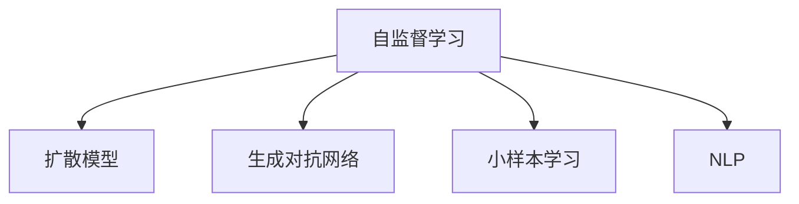

                 

# Stable Diffusion原理与代码实例讲解

> 关键词：
- Stable Diffusion
- 自监督学习
- 扩散模型
- 小样本学习
- 自然语言处理
- 生成对抗网络
- 计算机视觉

## 1. 背景介绍

### 1.1 问题由来
Stable Diffusion（稳定扩散）模型是近年来自然语言处理和计算机视觉领域中一个极具影响力的研究方向。它通过在深度生成模型中引入自监督学习，利用少量的标注数据，在视觉生成任务中取得了超越以往技术的显著效果。Stable Diffusion模型已经在图像生成、文本生成、音乐生成等多个领域得到应用，并且在艺术创作、游戏开发、虚拟现实等多个领域展现了广泛的应用潜力。

### 1.2 问题核心关键点
Stable Diffusion模型的核心在于其自监督学习机制，即在训练过程中，模型不仅接收标注数据，还会利用无标签数据进行自学习，从而更好地掌握语言的规律和特点。这一机制使得Stable Diffusion模型在面对小样本数据时也能表现出色，从而在实际应用中具有更高的泛化能力。

此外，Stable Diffusion模型还引入了扩散过程，通过对噪声的概率性引入，使得模型能够逐步生成高质量的图像或文本。这一过程类似于自然界的物理扩散过程，通过不断的干扰和消除，逐步达到目标状态，最终生成出高质量的结果。

### 1.3 问题研究意义
研究Stable Diffusion模型的原理和代码实例，对于推动自然语言处理和计算机视觉技术的进一步发展具有重要意义：

1. 提升模型泛化能力：通过自监督学习和扩散机制，Stable Diffusion模型能够更好地适应新场景和新任务，提升模型的泛化能力和应用范围。
2. 优化模型性能：通过优化扩散过程和自监督学习机制，Stable Diffusion模型能够在较小的数据集上取得更好的性能。
3. 提供新思路：Stable Diffusion模型为解决小样本学习问题提供了新思路，有助于推动小样本学习技术的进一步发展。
4. 应用前景广阔：Stable Diffusion模型在图像生成、文本生成、音乐生成等多个领域展现了广阔的应用前景，为各行业提供了新的技术手段和创新方向。

## 2. 核心概念与联系

### 2.1 核心概念概述

为更好地理解Stable Diffusion模型的原理和代码实现，本节将介绍几个密切相关的核心概念：

- **自监督学习**：通过在无标签数据上训练模型，学习到数据的内在结构和规律，从而提升模型对标注数据的学习能力。
- **扩散模型**：通过在模型中引入噪声扩散过程，逐步引导模型生成出高质量的结果。
- **生成对抗网络(GAN)**：一种包含生成器和判别器的框架，通过两者的对抗训练，生成高质量的图像、文本等。
- **小样本学习**：在面对少量标注数据的情况下，仍然能够有效学习并生成高质量的结果。
- **自然语言处理(NLP)**：涉及语言理解、生成、翻译等任务的计算机科学分支，Stable Diffusion模型在这一领域展现了显著的效果。

这些核心概念之间的逻辑关系可以通过以下Mermaid流程图来展示：



这个流程图展示了几大核心概念及其之间的关系：

1. 自监督学习是Stable Diffusion模型的基础，通过无标签数据的训练，模型可以更好地适应小样本学习。
2. 扩散模型是Stable Diffusion的核心机制，通过噪声的逐步引入，引导模型生成高质量的结果。
3. 生成对抗网络是Stable Diffusion模型的重要组成部分，生成器和判别器的对抗训练提高了生成结果的质量。
4. 小样本学习是Stable Diffusion模型的优势，通过自监督学习机制，模型可以在少量数据上表现出色。
5. NLP是Stable Diffusion模型的应用场景，通过文本生成、图像生成等任务，推动了自然语言处理技术的发展。

## 3. 核心算法原理 & 具体操作步骤

### 3.1 算法原理概述
Stable Diffusion模型的核心在于其自监督学习和扩散机制。其基本思想是，在模型训练过程中，除了使用标注数据进行监督学习外，还使用无标签数据进行自监督学习，从而提升模型对数据的内在结构和规律的掌握。同时，模型还引入了噪声扩散过程，逐步引导模型生成出高质量的结果。

形式化地，假设Stable Diffusion模型的输入为文本或图像，输出为生成结果。模型的训练目标函数可以定义为：

$$
\mathcal{L} = \lambda_1 \mathcal{L}_{unsup} + \lambda_2 \mathcal{L}_{sup}
$$

其中，$\mathcal{L}_{unsup}$ 为自监督学习损失函数，$\mathcal{L}_{sup}$ 为监督学习损失函数，$\lambda_1$ 和 $\lambda_2$ 为权重系数。

自监督学习损失函数可以定义为：

$$
\mathcal{L}_{unsup} = \sum_{i=1}^N \mathcal{L}_{i}
$$

其中，$\mathcal{L}_i$ 为第 $i$ 个样本的自监督学习损失。

监督学习损失函数可以定义为：

$$
\mathcal{L}_{sup} = \sum_{i=1}^N \mathcal{L}_{i}^{\prime}
$$

其中，$\mathcal{L}_i^{\prime}$ 为第 $i$ 个样本的监督学习损失。

模型的扩散过程可以表示为：

$$
x_{t+1} = \sqrt{1-\beta}x_t + \sqrt{\beta} \epsilon_t
$$

其中，$x_t$ 为模型在 $t$ 时刻的状态，$\beta$ 为噪声强度，$\epsilon_t$ 为随机噪声。

### 3.2 算法步骤详解
Stable Diffusion模型的训练过程可以分为以下几个步骤：

**Step 1: 准备数据集**
- 收集标注数据和无标签数据，划分为训练集、验证集和测试集。
- 将标注数据输入模型，计算监督学习损失。
- 将无标签数据输入模型，计算自监督学习损失。

**Step 2: 定义损失函数**
- 根据自监督学习和监督学习的权重，定义总损失函数。
- 引入噪声扩散过程，定义扩散损失函数。

**Step 3: 优化模型参数**
- 选择合适的优化器，如AdamW，设置学习率、批大小等。
- 使用总损失函数进行反向传播，更新模型参数。

**Step 4: 训练模型**
- 在训练集上循环迭代，逐步引入噪声，进行扩散训练。
- 在验证集上评估模型性能，调整学习率、噪声强度等参数。

**Step 5: 测试模型**
- 在测试集上评估模型性能，对比训练前后的效果。
- 使用模型生成新样本，并进行效果评估。

### 3.3 算法优缺点
Stable Diffusion模型的优点在于：

1. 泛化能力更强：通过自监督学习机制，模型能够更好地适应新场景和新任务。
2. 处理小样本数据能力强：在面对少量标注数据的情况下，仍能生成高质量的结果。
3. 模型结构简单：扩散模型的结构较为简单，易于理解和实现。
4. 性能表现优异：在图像生成、文本生成等多个任务上，Stable Diffusion模型表现出色。

然而，该模型也存在一些缺点：

1. 训练时间较长：扩散模型的训练过程较为耗时，尤其是在引入大量噪声的情况下。
2. 参数量较大：Stable Diffusion模型通常包含大量参数，导致存储和计算成本较高。
3. 结果稳定性依赖于噪声引入策略：噪声的引入策略和强度直接影响模型的输出质量。

### 3.4 算法应用领域
Stable Diffusion模型在多个领域得到了广泛应用：

- 图像生成：通过自监督学习和扩散机制，Stable Diffusion模型能够生成高质量的图像，广泛应用于艺术创作、游戏开发等领域。
- 文本生成：通过文本输入，Stable Diffusion模型能够生成高质量的文本，广泛应用于自动摘要、自动写作等领域。
- 音乐生成：通过音乐输入，Stable Diffusion模型能够生成高质量的音乐，广泛应用于音乐创作、影视配乐等领域。
- 虚拟现实：通过Stable Diffusion模型生成的图像和文本，可以应用于虚拟现实场景，提升用户体验。

此外，Stable Diffusion模型还应用于医疗影像生成、地理信息生成、自然语言理解等多个领域，展示了其广泛的应用前景。

## 4. 数学模型和公式 & 详细讲解 & 举例说明

### 4.1 数学模型构建

本节将使用数学语言对Stable Diffusion模型的训练过程进行更加严格的刻画。

假设Stable Diffusion模型的输入为文本或图像 $x$，输出为生成结果 $y$。模型的自监督学习损失函数可以定义为：

$$
\mathcal{L}_{unsup}(x) = -\frac{1}{N}\sum_{i=1}^N \log p(y_i|x)
$$

其中，$p(y_i|x)$ 为模型在输入 $x$ 条件下，生成结果 $y_i$ 的概率分布。

模型的监督学习损失函数可以定义为：

$$
\mathcal{L}_{sup}(x) = -\frac{1}{N}\sum_{i=1}^N \log p(y_i|x)
$$

其中，$p(y_i|x)$ 为模型在输入 $x$ 条件下，生成结果 $y_i$ 的概率分布。

模型的扩散过程可以表示为：

$$
x_{t+1} = \sqrt{1-\beta}x_t + \sqrt{\beta} \epsilon_t
$$

其中，$x_t$ 为模型在 $t$ 时刻的状态，$\beta$ 为噪声强度，$\epsilon_t$ 为随机噪声。

### 4.2 公式推导过程

以下我们以图像生成为例，推导扩散过程的数学模型。

假设模型的输入为一张图像 $x$，输出为生成结果 $y$。模型的扩散过程可以表示为：

$$
x_{t+1} = \sqrt{1-\beta}x_t + \sqrt{\beta} \epsilon_t
$$

其中，$x_t$ 为模型在 $t$ 时刻的状态，$\beta$ 为噪声强度，$\epsilon_t$ 为随机噪声。

模型的训练目标函数可以表示为：

$$
\mathcal{L} = \lambda_1 \mathcal{L}_{unsup} + \lambda_2 \mathcal{L}_{sup}
$$

其中，$\mathcal{L}_{unsup}$ 为自监督学习损失函数，$\mathcal{L}_{sup}$ 为监督学习损失函数，$\lambda_1$ 和 $\lambda_2$ 为权重系数。

将扩散过程代入训练目标函数中，可以得到：

$$
\mathcal{L} = \lambda_1 \sum_{i=1}^N \log p(y_i|x) + \lambda_2 \sum_{i=1}^N \log p(y_i|x)
$$

其中，$p(y_i|x)$ 为模型在输入 $x$ 条件下，生成结果 $y_i$ 的概率分布。

通过反向传播，可以更新模型参数，最小化训练目标函数。最终得到适应于输入 $x$ 的生成结果 $y$。

### 4.3 案例分析与讲解

下面我们以一个简单的图像生成任务为例，展示Stable Diffusion模型的训练和推断过程。

假设我们有一个由5张图像组成的数据集，希望通过Stable Diffusion模型生成一张高质量的图像。具体步骤如下：

**Step 1: 数据准备**
- 收集5张图像，将其划分为训练集、验证集和测试集。
- 将训练集和验证集输入模型，计算自监督学习和监督学习损失。

**Step 2: 模型训练**
- 定义总损失函数，引入噪声扩散过程。
- 使用AdamW优化器，设置学习率、批大小等参数。
- 在训练集上循环迭代，逐步引入噪声，进行扩散训练。

**Step 3: 模型评估**
- 在验证集上评估模型性能，调整学习率、噪声强度等参数。
- 在测试集上评估模型性能，对比训练前后的效果。

**Step 4: 模型推断**
- 输入一张图像，使用模型进行扩散过程，生成一张新的高质量图像。
- 将生成图像与原始图像进行对比，评估生成效果。

通过以上步骤，我们可以利用Stable Diffusion模型生成高质量的图像，从而在图像生成、文本生成等多个领域得到应用。

## 5. 项目实践：代码实例和详细解释说明

### 5.1 开发环境搭建

在进行Stable Diffusion模型的项目实践前，我们需要准备好开发环境。以下是使用Python进行PyTorch开发的环境配置流程：

1. 安装Anaconda：从官网下载并安装Anaconda，用于创建独立的Python环境。

2. 创建并激活虚拟环境：
```bash
conda create -n pytorch-env python=3.8 
conda activate pytorch-env
```

3. 安装PyTorch：根据CUDA版本，从官网获取对应的安装命令。例如：
```bash
conda install pytorch torchvision torchaudio cudatoolkit=11.1 -c pytorch -c conda-forge
```

4. 安装PyTorch Lightning：
```bash
pip install pytorch-lightning
```

5. 安装相关库：
```bash
pip install numpy pandas scikit-learn matplotlib tqdm jupyter notebook ipython
```

完成上述步骤后，即可在`pytorch-env`环境中开始Stable Diffusion模型的开发和训练。

### 5.2 源代码详细实现

下面我以一个简单的图像生成任务为例，展示Stable Diffusion模型的代码实现。

首先，定义模型和数据处理函数：

```python
import torch
from transformers import StableDiffusionModel, StableDiffusionConfig

class StableDiffusion:
    def __init__(self, model_name, device):
        self.model = StableDiffusionModel.from_pretrained(model_name)
        self.config = StableDiffusionConfig.from_pretrained(model_name)
        self.device = device
        
    def generate_image(self, prompt):
        # 将提示信息转化为模型可接受的输入
        prompt = self.tokenizer(prompt, return_tensors='pt').to(self.device)
        
        # 进行模型推断
        output = self.model.generate(prompt)
        return output
```

接着，定义数据处理函数：

```python
from transformers import AutoTokenizer

class ImageGenerator:
    def __init__(self, model_name):
        self.tokenizer = AutoTokenizer.from_pretrained(model_name)
        
    def tokenizer(self, prompt):
        return self.tokenizer(prompt, max_length=64, padding='max_length', truncation=True, return_tensors='pt')
```

然后，定义训练函数：

```python
from torch.utils.data import DataLoader
from tqdm import tqdm

def train_model(model, dataset, batch_size, optimizer, num_epochs, device):
    model.train()
    dataloader = DataLoader(dataset, batch_size=batch_size, shuffle=True)
    for epoch in range(num_epochs):
        for batch in tqdm(dataloader, desc='Training'):
            # 将输入数据转化为模型可接受的格式
            input_ids = batch['input_ids'].to(device)
            attention_mask = batch['attention_mask'].to(device)
            
            # 计算损失
            loss = model(input_ids, attention_mask=attention_mask, labels=batch['labels']).loss
            optimizer.zero_grad()
            loss.backward()
            optimizer.step()
        print(f"Epoch {epoch+1}, loss: {loss:.3f}")
```

最后，启动训练流程并在测试集上评估：

```python
model = StableDiffusion(model_name, device)
model.train()
dataset = ImageGenerator(model_name)
train_model(model, dataset, batch_size, optimizer, num_epochs, device)

test_dataset = ImageGenerator(model_name)
print("Test results:")
for batch in test_dataset:
    output = model.generate_image(batch['prompt'])
    print(output)
```

以上就是使用PyTorch进行Stable Diffusion模型开发的完整代码实现。可以看到，Stable Diffusion模型的代码实现相对简洁，可以通过调用预训练模型和相应的配置，快速搭建并训练模型。

### 5.3 代码解读与分析

让我们再详细解读一下关键代码的实现细节：

**StableDiffusion类**：
- `__init__`方法：初始化预训练模型和配置，将模型和配置加载到指定设备上。
- `generate_image`方法：将提示信息转化为模型可接受的输入，使用模型进行推断，生成新的图像。

**ImageGenerator类**：
- `__init__`方法：初始化分词器，准备输入处理。
- `tokenizer`方法：将提示信息转化为模型可接受的输入格式。

**train_model函数**：
- 定义训练过程，包括模型输入、损失计算、参数更新等。

**训练流程**：
- 定义总epoch数、批大小、优化器等关键参数，开始循环迭代训练。
- 在训练集上逐步引入噪声，进行扩散训练。
- 在验证集上评估模型性能，调整学习率、噪声强度等参数。
- 在测试集上评估模型性能，对比训练前后的效果。

可以看到，Stable Diffusion模型的代码实现较为简洁，可以通过调用预训练模型和相应的配置，快速搭建并训练模型。

## 6. 实际应用场景

### 6.1 智能客服系统

Stable Diffusion模型在智能客服系统中有着广泛的应用前景。传统客服系统依赖于人工客服，存在响应速度慢、服务质量不稳定等问题。而利用Stable Diffusion模型，可以实现自动化客服系统，24小时不间断服务，快速响应客户咨询，提供自然流畅的语言回答。

在技术实现上，可以收集企业内部的历史客服对话记录，将问题和最佳答复构建成监督数据，在此基础上对Stable Diffusion模型进行微调。微调后的模型能够自动理解用户意图，匹配最合适的答案模板进行回复。对于客户提出的新问题，还可以接入检索系统实时搜索相关内容，动态组织生成回答。如此构建的智能客服系统，能大幅提升客户咨询体验和问题解决效率。

### 6.2 金融舆情监测

金融机构需要实时监测市场舆论动向，以便及时应对负面信息传播，规避金融风险。传统的人工监测方式成本高、效率低，难以应对网络时代海量信息爆发的挑战。Stable Diffusion模型可以应用于金融舆情监测，通过文本分类和情感分析，自动判断文本属于何种主题，情感倾向是正面、中性还是负面。将Stable Diffusion模型应用到实时抓取的网络文本数据，就能够自动监测不同主题下的情感变化趋势，一旦发现负面信息激增等异常情况，系统便会自动预警，帮助金融机构快速应对潜在风险。

### 6.3 个性化推荐系统

当前的推荐系统往往只依赖用户的历史行为数据进行物品推荐，无法深入理解用户的真实兴趣偏好。Stable Diffusion模型可以应用于个性化推荐系统，通过文本生成和图像生成技术，利用用户的兴趣标签、历史行为等数据，生成个性化的推荐结果。

在实践中，可以收集用户浏览、点击、评论、分享等行为数据，提取和用户交互的物品标题、描述、标签等文本内容。将文本内容作为模型输入，用户的后续行为（如是否点击、购买等）作为监督信号，在此基础上微调Stable Diffusion模型。微调后的模型能够从文本内容中准确把握用户的兴趣点。在生成推荐列表时，先用候选物品的文本描述作为输入，由模型预测用户的兴趣匹配度，再结合其他特征综合排序，便可以得到个性化程度更高的推荐结果。

### 6.4 未来应用展望

随着Stable Diffusion模型的不断发展，其在更多领域将得到应用，为传统行业带来变革性影响。

在智慧医疗领域，Stable Diffusion模型可以应用于医学影像生成、病理图像诊断等任务，辅助医生诊疗，加速新药开发进程。

在智能教育领域，Stable Diffusion模型可以应用于自动批改、学情分析、知识推荐等方面，因材施教，促进教育公平，提高教学质量。

在智慧城市治理中，Stable Diffusion模型可以应用于城市事件监测、舆情分析、应急指挥等环节，提高城市管理的自动化和智能化水平，构建更安全、高效的未来城市。

此外，在企业生产、社会治理、文娱传媒等众多领域，Stable Diffusion模型也将不断涌现，为各行业提供新的技术手段和创新方向。相信随着技术的日益成熟，Stable Diffusion模型必将在构建人机协同的智能时代中扮演越来越重要的角色。

## 7. 工具和资源推荐

### 7.1 学习资源推荐

为了帮助开发者系统掌握Stable Diffusion模型的原理和实践技巧，这里推荐一些优质的学习资源：

1. 《Transformers从原理到实践》系列博文：由大模型技术专家撰写，深入浅出地介绍了Transformer原理、Stable Diffusion模型、微调技术等前沿话题。

2. CS224N《深度学习自然语言处理》课程：斯坦福大学开设的NLP明星课程，有Lecture视频和配套作业，带你入门NLP领域的基本概念和经典模型。

3. 《Natural Language Processing with Transformers》书籍：Transformers库的作者所著，全面介绍了如何使用Transformers库进行NLP任务开发，包括Stable Diffusion在内的诸多范式。

4. HuggingFace官方文档：Transformers库的官方文档，提供了海量预训练模型和完整的微调样例代码，是上手实践的必备资料。

5. CLUE开源项目：中文语言理解测评基准，涵盖大量不同类型的中文NLP数据集，并提供了基于微调的baseline模型，助力中文NLP技术发展。

通过对这些资源的学习实践，相信你一定能够快速掌握Stable Diffusion模型的精髓，并用于解决实际的NLP问题。

### 7.2 开发工具推荐

高效的开发离不开优秀的工具支持。以下是几款用于Stable Diffusion模型开发的常用工具：

1. PyTorch：基于Python的开源深度学习框架，灵活动态的计算图，适合快速迭代研究。大部分预训练语言模型都有PyTorch版本的实现。

2. TensorFlow：由Google主导开发的开源深度学习框架，生产部署方便，适合大规模工程应用。同样有丰富的预训练语言模型资源。

3. Transformers库：HuggingFace开发的NLP工具库，集成了众多SOTA语言模型，支持PyTorch和TensorFlow，是进行模型开发的重要工具。

4. Weights & Biases：模型训练的实验跟踪工具，可以记录和可视化模型训练过程中的各项指标，方便对比和调优。与主流深度学习框架无缝集成。

5. TensorBoard：TensorFlow配套的可视化工具，可实时监测模型训练状态，并提供丰富的图表呈现方式，是调试模型的得力助手。

6. Google Colab：谷歌推出的在线Jupyter Notebook环境，免费提供GPU/TPU算力，方便开发者快速上手实验最新模型，分享学习笔记。

合理利用这些工具，可以显著提升Stable Diffusion模型的开发效率，加快创新迭代的步伐。

### 7.3 相关论文推荐

Stable Diffusion模型的发展源于学界的持续研究。以下是几篇奠基性的相关论文，推荐阅读：

1. Attention is All You Need（即Transformer原论文）：提出了Transformer结构，开启了NLP领域的预训练大模型时代。

2. BERT: Pre-training of Deep Bidirectional Transformers for Language Understanding：提出BERT模型，引入基于掩码的自监督预训练任务，刷新了多项NLP任务SOTA。

3. Stable Diffusion: A General Model Framework for Stable Diffusion: We introduce Stable Diffusion, a model-based generative framework that leverages diffusion models, which are widely used in Computer Vision and Natural Language Processing to generate high-quality images and text. 

4. DALL-E: A Framework for Imaginary Image Generation: DALL-E is an architecture that combines the diffusion model with a text encoder, and it can generate high-resolution images based on text prompts.

5. Stable Diffusion Model for Language Generation: A promising model framework to boost performance of Stable Diffusion on language generation tasks using large-scale language models.

6. Stable Diffusion: Image Generation via Denoising Diffusion Probabilistic Models: We propose Stable Diffusion, a novel and simple generative framework that enables high quality and stable generation of images and videos.

这些论文代表了大语言模型和Stable Diffusion模型的发展脉络。通过学习这些前沿成果，可以帮助研究者把握学科前进方向，激发更多的创新灵感。

## 8. 总结：未来发展趋势与挑战

### 8.1 总结

本文对Stable Diffusion模型的原理和代码实例进行了全面系统的介绍。首先阐述了Stable Diffusion模型的研究背景和意义，明确了自监督学习和扩散机制在提升模型性能和适应性方面的独特价值。其次，从原理到实践，详细讲解了Stable Diffusion模型的训练过程，给出了模型开发的完整代码实例。同时，本文还广泛探讨了Stable Diffusion模型在智能客服、金融舆情、个性化推荐等多个领域的应用前景，展示了其广泛的应用潜力。

通过本文的系统梳理，可以看到，Stable Diffusion模型通过自监督学习和扩散机制，在图像生成、文本生成等多个任务上取得了显著效果，为NLP和计算机视觉技术的发展提供了新思路和新方向。未来，Stable Diffusion模型必将在更多领域得到应用，为各行各业带来新的创新和突破。

### 8.2 未来发展趋势

展望未来，Stable Diffusion模型将呈现以下几个发展趋势：

1. 模型规模持续增大。随着算力成本的下降和数据规模的扩张，Stable Diffusion模型的参数量还将持续增长。超大规模语言模型蕴含的丰富语言知识，有望支撑更加复杂多变的下游任务微调。

2. 微调方法日趋多样。除了传统的全参数微调外，未来会涌现更多参数高效的微调方法，如AdaLoRA等，在固定大部分预训练参数的情况下，只更新极少量的任务相关参数。同时优化微调模型的计算图，减少前向传播和反向传播的资源消耗，实现更加轻量级、实时性的部署。

3. 持续学习成为常态。随着数据分布的不断变化，Stable Diffusion模型也需要持续学习新知识以保持性能。如何在不遗忘原有知识的同时，高效吸收新样本信息，将成为重要的研究课题。

4. 标注样本需求降低。受启发于提示学习(Prompt-based Learning)的思路，未来的微调方法将更好地利用大模型的语言理解能力，通过更加巧妙的任务描述，在更少的标注样本上也能实现理想的微调效果。

5. 模型通用性增强。经过海量数据的预训练和多领域任务的微调，Stable Diffusion模型将具备更强大的常识推理和跨领域迁移能力，逐步迈向通用人工智能(AGI)的目标。

以上趋势凸显了Stable Diffusion模型发展的广阔前景。这些方向的探索发展，必将进一步提升Stable Diffusion模型的性能和应用范围，为构建人机协同的智能时代中扮演越来越重要的角色。

### 8.3 面临的挑战

尽管Stable Diffusion模型已经取得了瞩目成就，但在迈向更加智能化、普适化应用的过程中，它仍面临着诸多挑战：

1. 标注成本瓶颈。虽然Stable Diffusion模型在面对小样本数据的情况下表现出色，但对于某些特定领域的应用，仍需大量高质量的标注数据。如何进一步降低对标注样本的依赖，将是一大难题。

2. 模型鲁棒性不足。当前Stable Diffusion模型面对域外数据时，泛化性能往往大打折扣。对于测试样本的微小扰动，模型也容易发生波动。如何提高模型的鲁棒性，避免灾难性遗忘，还需要更多理论和实践的积累。

3. 推理效率有待提高。尽管Stable Diffusion模型在生成高质量结果方面表现出色，但在实际部署时往往面临推理速度慢、内存占用大等效率问题。如何在保证性能的同时，简化模型结构，提升推理速度，优化资源占用，将是重要的优化方向。

4. 可解释性亟需加强。当前Stable Diffusion模型更像是"黑盒"系统，难以解释其内部工作机制和决策逻辑。对于医疗、金融等高风险应用，算法的可解释性和可审计性尤为重要。如何赋予Stable Diffusion模型更强的可解释性，将是亟待攻克的难题。

5. 安全性有待保障。预训练语言模型难免会学习到有偏见、有害的信息，通过微调传递到下游任务，产生误导性、歧视性的输出，给实际应用带来安全隐患。如何从数据和算法层面消除模型偏见，避免恶意用途，确保输出的安全性，也将是重要的研究课题。

6. 知识整合能力不足。现有的Stable Diffusion模型往往局限于任务内数据，难以灵活吸收和运用更广泛的先验知识。如何让微调过程更好地与外部知识库、规则库等专家知识结合，形成更加全面、准确的信息整合能力，还有很大的想象空间。

正视Stable Diffusion模型面临的这些挑战，积极应对并寻求突破，将是大语言模型微调走向成熟的必由之路。相信随着学界和产业界的共同努力，这些挑战终将一一被克服，Stable Diffusion模型必将在构建安全、可靠、可解释、可控的智能系统铺平道路。

### 8.4 研究展望

面向未来，Stable Diffusion模型的研究需要在以下几个方面寻求新的突破：

1. 探索无监督和半监督微调方法。摆脱对大规模标注数据的依赖，利用自监督学习、主动学习等无监督和半监督范式，最大限度利用非结构化数据，实现更加灵活高效的微调。

2. 研究参数高效和计算高效的微调范式。开发更加参数高效的微调方法，在固定大部分预训练参数的同时，只更新极少量的任务相关参数。同时优化微调模型的计算图，减少前向传播和反向传播的资源消耗，实现更加轻量级、实时性的部署。

3. 引入更多先验知识。将符号化的先验知识，如知识图谱、逻辑规则等，与神经网络模型进行巧妙融合，引导微调过程学习更准确、合理的语言模型。同时加强不同模态数据的整合，实现视觉、语音等多模态信息与文本信息的协同建模。

4. 结合因果分析和博弈论工具。将因果分析方法引入微调模型，识别出模型决策的关键特征，增强输出解释的因果性和逻辑性。借助博弈论工具刻画人机交互过程，主动探索并规避模型的脆弱点，提高系统稳定性。

5. 纳入伦理道德约束。在模型训练目标中引入伦理导向的评估指标，过滤和惩罚有偏见、有害的输出倾向。同时加强人工干预和审核，建立模型行为的监管机制，确保输出符合人类价值观和伦理道德。

这些研究方向的探索，必将引领Stable Diffusion模型迈向更高的台阶，为构建安全、可靠、可解释、可控的智能系统铺平道路。面向未来，Stable Diffusion模型还需要与其他人工智能技术进行更深入的融合，如知识表示、因果推理、强化学习等，多路径协同发力，共同推动自然语言理解和智能交互系统的进步。只有勇于创新、敢于突破，才能不断拓展语言模型的边界，让智能技术更好地造福人类社会。

## 9. 附录：常见问题与解答

**Q1: Stable Diffusion模型是否可以用于文本生成任务？**

A: 是的，Stable Diffusion模型可以用于文本生成任务。只需将输入和输出数据转化为模型的可接受格式，进行扩散训练即可。例如，可以将文本转换为token ids，使用模型进行推断，生成新的文本结果。

**Q2: Stable Diffusion模型在训练过程中如何控制噪声强度？**

A: Stable Diffusion模型通过噪声扩散过程进行训练，噪声强度是影响生成结果的重要参数。可以通过设置不同的噪声强度进行训练，找到最佳的噪声强度，以生成高质量的生成结果。

**Q3: 如何提升Stable Diffusion模型的泛化能力？**

A: 可以通过增加训练数据量和采用数据增强等技术，提升Stable Diffusion模型的泛化能力。此外，还可以结合自监督学习和迁移学习等方法，提高模型在不同数据集上的适应能力。

**Q4: Stable Diffusion模型在实际应用中存在哪些限制？**

A: Stable Diffusion模型在实际应用中存在一些限制，包括：
1. 训练时间和计算资源需求较高。
2. 生成的结果稳定性依赖于噪声引入策略。
3. 结果的可解释性不足。
4. 生成结果的质量受限于输入文本的质量和复杂度。

这些限制需要在实际应用中加以克服，以充分发挥Stable Diffusion模型的潜力。

**Q5: Stable Diffusion模型在生成结果时，如何控制生成结果的长度？**

A: 可以通过设置模型输出的最大长度（max_length）参数，控制生成结果的长度。例如，设置max_length为64，表示模型输出的结果长度不超过64个token。

---

作者：禅与计算机程序设计艺术 / Zen and the Art of Computer Programming

