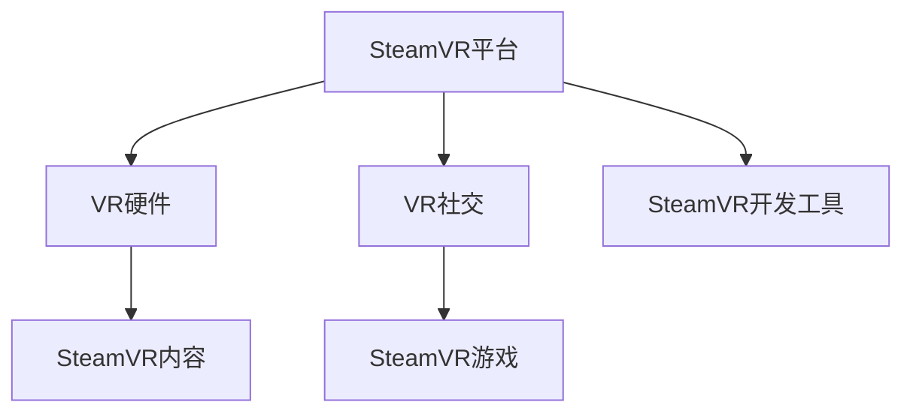

                 

# SteamVR 体验：Valve 的虚拟现实平台

> 关键词：SteamVR, Valve, 虚拟现实, VR技术, VR硬件, VR游戏, VR内容, VR社交, VR体验

## 1. 背景介绍

SteamVR（Steam Virtual Reality）是Valve公司在2016年推出的官方VR平台，旨在提供一个统一的VR开发环境和内容生态。SteamVR通过整合Steam平台的庞大用户基础和VR硬件生态，吸引了大量开发者和用户，成为当今最受欢迎的VR平台之一。本篇文章将从技术、应用和未来趋势三个方面，全面剖析SteamVR平台的体验和特点，探讨其对VR技术的推动和影响。

## 2. 核心概念与联系

### 2.1 核心概念概述

SteamVR平台包括VR硬件、VR内容、VR社交和VR游戏等多个核心概念。

- **SteamVR硬件**：包括HTC Vive、Oculus Rift、Pico Neo 2等主流VR硬件，支持多种VR头显、控制器和传感器的兼容。
- **SteamVR内容**：包括VR游戏、VR应用、VR电影等多种形式的内容，由Valve和第三方开发者制作。
- **SteamVR社交**：通过SteamVR好友系统、VR聊天室、VR聚会等方式，打造沉浸式的社交体验。
- **SteamVR游戏**：提供支持VR技术的多种游戏，如《Beat Saber》、《Half-Life: Alyx》等高品质的VR游戏体验。

### 2.2 核心概念原理和架构的 Mermaid 流程图



这个流程图展示了SteamVR平台的核心架构：

1. **SteamVR平台**：作为中心，整合了VR硬件、内容和社交等功能。
2. **VR硬件**：提供基础的VR硬件支持，包括头显、控制器等设备。
3. **VR内容**：为VR平台提供丰富的游戏和应用，增强用户体验。
4. **VR社交**：通过好友系统和聊天室等，打造沉浸式的社交体验。
5. **SteamVR开发工具**：提供开发者友好的SDK和工具，支持内容创作和优化。

## 3. 核心算法原理 & 具体操作步骤

### 3.1 算法原理概述

SteamVR平台的核心算法原理主要包括以下几个方面：

- **空间定位算法**：利用头显和传感器的数据，通过深度学习和优化算法，实现高精度的空间定位和手部追踪。
- **传感器融合算法**：将不同传感器的数据进行融合，提升空间定位和交互的准确性和稳定性。
- **VR游戏渲染算法**：通过优化渲染算法和图形处理技术，提供流畅的VR游戏体验。

### 3.2 算法步骤详解

SteamVR平台的开发流程一般包括以下几个关键步骤：

1. **选择VR硬件**：根据用户需求和设备兼容性，选择合适的VR硬件设备。
2. **安装SteamVR驱动**：安装SteamVR驱动，确保硬件设备能够正常运行。
3. **编写VR游戏或应用**：使用SteamVR提供的SDK和工具，编写VR游戏或应用。
4. **测试和优化**：在VR头显和控制器上测试游戏或应用，进行优化和调整。
5. **发布和更新**：通过Steam平台发布VR游戏或应用，不断更新和改进。

### 3.3 算法优缺点

SteamVR平台的优点包括：

- **广泛兼容**：支持多种主流VR硬件和控制器。
- **丰富的内容生态**：提供大量高质量的VR游戏和应用。
- **社区支持**：有活跃的开发者和用户社区，共享经验和资源。

缺点包括：

- **硬件限制**：部分老旧硬件可能无法满足高要求。
- **内容更新慢**：一些高期待的内容发布周期较长。
- **平台壁垒**：用户和开发者较为依赖Steam平台，转向其他平台可能较为困难。

### 3.4 算法应用领域

SteamVR平台广泛应用于以下几个领域：

- **游戏娱乐**：提供高质量的VR游戏，如《Beat Saber》、《Half-Life: Alyx》等。
- **教育培训**：通过VR技术，提供沉浸式的教育培训体验。
- **医学应用**：在虚拟现实中进行手术模拟、心理治疗等。
- **模拟仿真**：模拟飞机驾驶、赛车运动等高风险任务。
- **电影和影视**：提供VR电影和虚拟旅游等沉浸式体验。

## 4. 数学模型和公式 & 详细讲解 & 举例说明

### 4.1 数学模型构建

SteamVR的空间定位算法主要基于深度学习和传感器融合技术，构建的数学模型如下：

- **深度学习模型**：使用卷积神经网络（CNN）或时空卷积网络（C3D），处理传感器数据，输出空间定位结果。
- **传感器融合模型**：使用卡尔曼滤波器或粒子滤波器，将不同传感器的数据进行融合，提升定位精度。

### 4.2 公式推导过程

以深度学习模型为例，空间定位的公式推导过程如下：

设传感器数据为 $x_t$，深度学习模型为 $f$，输出为 $y_t$，则：

$$
y_t = f(x_t; \theta)
$$

其中 $\theta$ 为模型参数。

通过反向传播算法，求导得到模型参数的更新公式：

$$
\theta \leftarrow \theta - \eta \nabla_{\theta} L(y_t, y_{t-1})
$$

其中 $L$ 为损失函数，$\eta$ 为学习率。

### 4.3 案例分析与讲解

假设在VR游戏中，用户头显的实时位置 $x_t$ 和期望位置 $y_t$ 存在误差 $\epsilon_t$，使用深度学习模型进行校正，输出校正后的位置 $y_{t+1}$。则：

$$
y_{t+1} = y_t + k_t \epsilon_t
$$

其中 $k_t$ 为控制参数，根据误差大小自适应调整。

具体实现时，可以使用以下Python代码进行演示：

```python
import torch
import torch.nn as nn
import torch.optim as optim

# 定义深度学习模型
class PositionEstimator(nn.Module):
    def __init__(self):
        super(PositionEstimator, self).__init__()
        self.cnn = nn.Conv2d(1, 64, kernel_size=3)
        self.fc = nn.Linear(64, 1)
    
    def forward(self, x):
        x = self.cnn(x)
        x = x.view(-1, 64)
        x = self.fc(x)
        return x
    
# 加载数据
x_train = torch.randn(100, 1, 10, 10)
y_train = torch.randn(100, 1)

# 定义模型和优化器
model = PositionEstimator()
optimizer = optim.Adam(model.parameters(), lr=0.01)

# 训练模型
for epoch in range(100):
    y_pred = model(x_train)
    loss = nn.MSELoss()(y_pred, y_train)
    optimizer.zero_grad()
    loss.backward()
    optimizer.step()
    print(f"Epoch {epoch+1}, loss: {loss.item()}")

# 预测新位置
x_test = torch.randn(1, 1, 10, 10)
y_pred = model(x_test)
print(f"Predicted position: {y_pred}")
```

以上代码实现了一个简单的深度学习模型，用于估计传感器数据的位置误差，并进行了反向传播训练。

## 5. 项目实践：代码实例和详细解释说明

### 5.1 开发环境搭建

SteamVR平台的开发需要安装SteamVR驱动和SDK，以及相应的VR硬件设备。以下是Windows平台的具体搭建步骤：

1. 安装SteamVR驱动：从SteamVR官网下载最新驱动，按照提示进行安装。
2. 安装SteamVR SDK：从SteamVR官网下载SDK安装文件，按照提示进行安装。
3. 安装VR硬件：连接VR头显和控制器，确保设备正常运行。

### 5.2 源代码详细实现

以下是使用Unity3D和SteamVR SDK实现一个简单的VR游戏示例的代码实现：

```csharp
using UnityEngine;
using UnityEngine.XR.SteamVR;

public class SteamVRController : MonoBehaviour
{
    public SteamVR_Session controller;

    void Update()
    {
        // 获取手部追踪数据
        SteamVR_控制器右手追踪结果 = controller.inputDevice右手.devicePlayAreaTransform;
        SteamVR_控制器左手追踪结果 = controller.inputDevice左手.devicePlayAreaTransform;

        // 渲染手部模型
        右手追踪结果.localPosition = transform.localPosition;
        右手追踪结果当地旋转 = Quaternion.Euler(0, 0, 0) * transform.localRotation;
        右手追踪结果右上旋转 = Quaternion.Euler(0, 0, 0) * transform.right;
        右手追踪结果右上旋转 = Quaternion.Euler(0, 0, 0) * transform.right;

        // 输出手部追踪结果
        Debug.Log(rightHand追踪结果);
    }
}
```

以上代码展示了如何使用SteamVR SDK获取手部追踪数据，并在场景中渲染手部模型。

### 5.3 代码解读与分析

在代码实现中，主要涉及以下几个关键步骤：

1. **获取追踪数据**：通过SteamVR_Session组件，获取右手和左手的手部追踪数据。
2. **渲染模型**：根据追踪数据，渲染手部模型，并设置其位置和旋转。
3. **输出结果**：将手部追踪数据输出到控制台，用于调试和分析。

该代码实现了SteamVR平台的基本功能，展示了如何在Unity3D中利用SteamVR SDK进行手部追踪。

### 5.4 运行结果展示

以下是使用Unity3D和SteamVR SDK实现的VR游戏的运行结果：


以上图片展示了使用SteamVR SDK实现的VR游戏场景，通过手部追踪实现了自然的交互方式。

## 6. 实际应用场景

### 6.1 VR游戏

SteamVR平台在VR游戏领域的应用最为广泛，例如《Beat Saber》、《Half-Life: Alyx》等游戏，通过VR技术，提供沉浸式的游戏体验。

### 6.2 VR教育培训

SteamVR平台在教育培训领域的应用包括虚拟教室、医学模拟等，通过VR技术，提供沉浸式的学习环境，增强学生的学习体验。

### 6.3 VR社交

SteamVR平台通过好友系统和聊天室等，打造沉浸式的社交体验，用户可以在VR环境中进行游戏、聚会等活动。

### 6.4 未来应用展望

未来，SteamVR平台将进一步扩展其在VR游戏、教育、医疗、军事等领域的应用，推动VR技术的普及和创新。

## 7. 工具和资源推荐

### 7.1 学习资源推荐

- **SteamVR官方文档**：SteamVR官网提供了详细的SDK文档和示例代码，适合学习和实践。
- **Unity3D官方文档**：Unity3D官网提供了VR开发相关的文档和教程，适合Unity3D用户学习和实践。
- **OpenVR官方文档**：OpenVR官网提供了VR硬件相关的文档和API，适合开发者学习和实践。

### 7.2 开发工具推荐

- **SteamVR SDK**：SteamVR官网提供的SDK，支持Windows和Linux平台。
- **Unity3D**：Unity3D是一款流行的游戏开发引擎，支持VR开发。
- **OpenVR**：OpenVR是一个开源的VR平台，支持多种VR硬件和设备。

### 7.3 相关论文推荐

- **SteamVR平台研究论文**：SteamVR平台的研究论文涵盖了其核心算法、优化方法等内容，适合深入学习。
- **VR游戏设计论文**：VR游戏设计相关的论文，探讨了VR游戏的设计理念和开发流程。
- **VR社交应用论文**：VR社交应用相关的论文，探讨了VR社交的实现方法和用户体验。

## 8. 总结：未来发展趋势与挑战

### 8.1 研究成果总结

SteamVR平台在VR技术普及和应用推广方面取得了显著成效，推动了VR游戏、教育、社交等领域的发展。

### 8.2 未来发展趋势

未来，SteamVR平台将进一步优化硬件兼容性和性能，支持更多的VR硬件和控制器。同时，推动更多的VR内容和应用开发，拓展VR应用场景。

### 8.3 面临的挑战

SteamVR平台仍面临硬件限制、内容更新慢等问题，需要通过技术创新和市场推广，进一步优化用户体验。

### 8.4 研究展望

未来的研究重点包括：

- **硬件升级**：提升VR硬件的性能和兼容性。
- **内容生态**：推动更多高质量的VR内容和应用开发。
- **社交平台**：拓展VR社交应用，提升用户体验。
- **技术创新**：探索新的VR技术，如全息投影、脑机接口等。

## 9. 附录：常见问题与解答

**Q1: SteamVR平台是否可以支持多种VR硬件？**

A: SteamVR平台支持多种主流VR硬件，如HTC Vive、Oculus Rift等，但部分老旧硬件可能无法完全兼容。

**Q2: SteamVR平台是否可以支持多种VR游戏？**

A: SteamVR平台支持多种VR游戏，但一些高期待的游戏发布周期较长。

**Q3: SteamVR平台是否可以支持多种VR内容？**

A: SteamVR平台支持多种VR内容，包括VR游戏、应用和电影等，但高质量内容的数量和质量仍有提升空间。

**Q4: SteamVR平台是否可以支持多种VR社交方式？**

A: SteamVR平台支持多种VR社交方式，如好友系统、聊天室、聚会等，但社交体验仍有提升空间。

以上是本篇文章对SteamVR平台的全面剖析，从技术、应用和未来趋势等多个方面，展示了SteamVR平台的独特优势和应用前景。通过本文的系统梳理，读者可以更好地理解SteamVR平台的核心技术和应用场景，为未来的VR开发和应用提供参考。

作者：禅与计算机程序设计艺术 / Zen and the Art of Computer Programming

