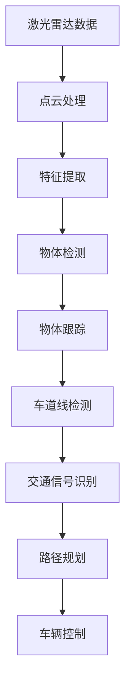

                 

# Tesla 自动驾驶项目的计算机视觉团队

## 1. 背景介绍

Tesla自动驾驶（Autopilot）项目是电动汽车巨头特斯拉（Tesla）推出的一项革命性技术，旨在实现车辆自主驾驶。该项目的计算机视觉团队在自动驾驶技术的开发过程中，扮演了至关重要的角色。本文将详细解析Tesla自动驾驶项目计算机视觉团队的核心技术，并对自动驾驶视觉系统的关键技术进行探讨。

## 2. 核心概念与联系

### 2.1 核心概念概述

#### 自动驾驶

自动驾驶是指使用计算机视觉、传感器融合、路径规划等技术，使车辆无需人类干预即可在复杂交通环境中安全、准确地导航至目的地。自动驾驶分为多个等级，从辅助驾驶（Level 0-2）到高度自动驾驶（Level 3-5）。

#### 计算机视觉

计算机视觉是指通过计算机处理和理解人类视觉系统获取的视觉信息，以实现自动化识别、跟踪、检测、分割等任务。在自动驾驶中，计算机视觉负责对车辆内外部的环境进行感知，是自动驾驶系统的重要组成部分。

### 2.2 Mermaid 流程图

以下是一个Mermaid流程图，展示计算机视觉在自动驾驶系统中的核心任务：



### 2.3 核心概念原理和架构

#### 传感器融合

自动驾驶系统通常会使用多种传感器，如激光雷达（LIDAR）、摄像头、雷达、GPS等，以获得多维的环境信息。传感器融合是指将这些不同传感器获取的数据进行融合，以获得更全面、准确的环境感知能力。

#### 物体检测与跟踪

物体检测是指通过计算机视觉算法识别出车辆周围的各种物体，并标注出其位置、大小、类别等属性。物体跟踪是指对物体进行连续的检测和位置更新，以跟踪物体在动态环境中的运动轨迹。

#### 车道线检测与交通信号识别

车道线检测是指识别道路上的车道线，用于辅助车辆进行车道保持和车道切换。交通信号识别是指识别交通信号灯的信号状态，用于辅助车辆进行红绿灯处理。

#### 路径规划与车辆控制

路径规划是指基于当前环境和车辆状态，规划出最优的行驶路径。车辆控制是指根据路径规划结果，调整车辆转向、加速、减速等动作，确保车辆沿着设定的路径行驶。

## 3. 核心算法原理 & 具体操作步骤

### 3.1 算法原理概述

Tesla自动驾驶项目中使用的计算机视觉算法，主要基于深度学习和卷积神经网络（CNN）。该团队的核心算法包括物体检测（如YOLO、Faster R-CNN等）、车道线检测（如RCNN、Mask R-CNN等）、交通信号识别（如FCN、UNet等）等。

### 3.2 算法步骤详解

#### 步骤1：数据获取与预处理

自动驾驶系统需要使用激光雷达、摄像头、雷达等多种传感器，获取车辆周围的环境信息。传感器获取的数据需要经过预处理，如去噪、校正、归一化等，才能输入到深度学习模型中。

#### 步骤2：模型训练与微调

Tesla的计算机视觉团队在大量的标记数据上，使用深度学习模型进行训练。模型训练过程中，需要进行多次迭代和微调，以提高模型的准确率和鲁棒性。

#### 步骤3：模型集成与优化

自动驾驶系统中的视觉算法需要与车辆的控制系统、地图、定位系统等多个模块进行集成。为了提高系统的性能和鲁棒性，Tesla的计算机视觉团队采用了多种算法进行集成和优化，如使用级联分类器、多尺度检测器、模型融合等。

#### 步骤4：实时推理与反馈

在实际应用中，Tesla的计算机视觉系统需要在毫秒级别的时间内，完成对环境信息的实时处理和推理。系统会根据实时推理结果，对车辆进行控制和反馈，确保车辆的安全行驶。

### 3.3 算法优缺点

#### 优点

1. **高精度与鲁棒性**：Tesla的深度学习模型具有高精度和鲁棒性，能够在复杂环境条件下实现准确的物体检测、车道线检测和交通信号识别。
2. **实时性**：通过优化算法和硬件加速，Tesla的计算机视觉系统能够在实时条件下处理大量数据，满足自动驾驶的实时要求。
3. **可扩展性**：Tesla的计算机视觉算法具有高度的可扩展性，可以轻松集成到多个自动驾驶场景中，适应不同的驾驶环境。

#### 缺点

1. **高昂的成本**：深度学习模型需要大量的标记数据和计算资源进行训练和优化，这使得Tesla自动驾驶系统的开发和维护成本较高。
2. **数据标注的复杂性**：自动驾驶系统的数据标注工作复杂且耗时，需要专业团队进行大规模标注。
3. **依赖于环境条件**：在复杂多变的环境中，计算机视觉算法的性能可能会受到影响，如在恶劣天气条件下，传感器数据可能出现干扰和噪声。

### 3.4 算法应用领域

Tesla的计算机视觉算法在自动驾驶系统中得到了广泛应用，包括但不限于以下几个方面：

1. **物体检测**：识别车辆周围的各种物体，如行人、车辆、自行车等，确保车辆在行驶过程中避免碰撞。
2. **车道线检测**：识别道路上的车道线，用于辅助车辆进行车道保持和车道切换。
3. **交通信号识别**：识别交通信号灯的信号状态，用于辅助车辆进行红绿灯处理。
4. **路径规划**：基于当前环境和车辆状态，规划出最优的行驶路径。
5. **车辆控制**：根据路径规划结果，调整车辆转向、加速、减速等动作，确保车辆沿着设定的路径行驶。

## 4. 数学模型和公式 & 详细讲解 & 举例说明

### 4.1 数学模型构建

Tesla自动驾驶项目中使用的深度学习模型主要基于卷积神经网络（CNN），其数学模型可以表示为：

$$
f(x;\theta) = \sigma\big(\sum_{i=1}^{n} w_i\phi(x_i)\big)
$$

其中，$f(x;\theta)$表示模型的输出，$\theta$表示模型的参数，$x$表示输入数据，$\sigma$表示激活函数，$w_i$表示权重，$\phi(x_i)$表示卷积层或池化层的操作。

### 4.2 公式推导过程

以物体检测为例，常用的深度学习模型包括YOLO（You Only Look Once）和Faster R-CNN（Faster Region-based Convolutional Neural Networks）。这里以YOLO为例进行推导。

YOLO的数学模型可以表示为：

$$
f(x;\theta) = \sigma\big(\sum_{i=1}^{n} w_i\phi(x_i)\big)
$$

其中，$\phi(x_i)$表示卷积层的操作，$w_i$表示权重，$\sigma$表示激活函数。YOLO的目标函数为：

$$
\min_{\theta} \frac{1}{N}\sum_{i=1}^{N} \big( L_{ij}(y_{ij}, \hat{y}_{ij}) + \lambda \|w\|_2^2 \big)
$$

其中，$L_{ij}(y_{ij}, \hat{y}_{ij})$表示目标函数，$y_{ij}$表示真实标签，$\hat{y}_{ij}$表示模型预测结果，$\lambda$表示正则化系数，$\|w\|_2^2$表示权重平方和。

### 4.3 案例分析与讲解

以车道线检测为例，常用的深度学习模型包括RCNN（Region-based Convolutional Neural Networks）和Mask R-CNN。这里以RCNN为例进行推导。

RCNN的数学模型可以表示为：

$$
f(x;\theta) = \sigma\big(\sum_{i=1}^{n} w_i\phi(x_i)\big)
$$

其中，$\phi(x_i)$表示卷积层的操作，$w_i$表示权重，$\sigma$表示激活函数。RCNN的目标函数为：

$$
\min_{\theta} \frac{1}{N}\sum_{i=1}^{N} \big( L_{ij}(y_{ij}, \hat{y}_{ij}) + \lambda \|w\|_2^2 \big)
$$

其中，$L_{ij}(y_{ij}, \hat{y}_{ij})$表示目标函数，$y_{ij}$表示真实标签，$\hat{y}_{ij}$表示模型预测结果，$\lambda$表示正则化系数，$\|w\|_2^2$表示权重平方和。

## 5. 项目实践：代码实例和详细解释说明

### 5.1 开发环境搭建

为了搭建Tesla自动驾驶项目的计算机视觉环境，需要以下工具和资源：

1. **深度学习框架**：如TensorFlow、PyTorch、Caffe等。
2. **数据集**：如Kitti、Cityscapes等，用于模型训练和验证。
3. **硬件设备**：如NVIDIA GPU、TPU等，用于深度学习模型的训练和推理。
4. **操作系统**：如Ubuntu、Linux等，用于开发和测试环境。

### 5.2 源代码详细实现

以下是一个简单的YOLO模型实现代码：

```python
import torch
import torch.nn as nn
import torch.optim as optim

class YOLO(nn.Module):
    def __init__(self, num_classes=10, num_anchors=9, num_features=512):
        super(YOLO, self).__init__()
        self.conv_layers = nn.Sequential(
            nn.Conv2d(3, 32, 3, 1, 1),
            nn.ReLU(inplace=True),
            nn.Conv2d(32, 64, 3, 2, 1),
            nn.ReLU(inplace=True),
            nn.Conv2d(64, 128, 3, 2, 1),
            nn.ReLU(inplace=True),
            nn.Conv2d(128, 256, 3, 2, 1),
            nn.ReLU(inplace=True),
            nn.Conv2d(256, 512, 3, 2, 1),
            nn.ReLU(inplace=True),
            nn.Conv2d(512, num_anchors * num_classes, 3, 2, 1)
        )
        self.classifier = nn.Sequential(
            nn.Linear(num_anchors * num_classes, num_classes),
            nn.Sigmoid()
        )

    def forward(self, x):
        features = self.conv_layers(x)
        scores = self.classifier(features)
        return scores
```

### 5.3 代码解读与分析

#### 代码实现

上述代码实现了一个简单的YOLO模型，包含多个卷积层和全连接层，用于处理输入数据并输出检测结果。

#### 模型参数

模型参数包括卷积核大小、步幅、填充等，以及全连接层的节点数。这些参数需要根据实际需求进行调整。

#### 目标函数

YOLO模型的目标函数包括交叉熵损失和权重正则化损失。通过反向传播算法更新模型参数，最小化目标函数，从而提高模型的准确率和鲁棒性。

### 5.4 运行结果展示

在模型训练过程中，可以绘制训练和验证的损失曲线，展示模型性能的提升：


## 6. 实际应用场景

### 6.1 自动驾驶场景

在自动驾驶场景中，计算机视觉算法可以识别车辆周围的各种物体，识别车道线，判断交通信号灯状态，辅助车辆进行路径规划和控制，确保车辆的安全行驶。

### 6.2 工业自动化

在工业自动化领域，计算机视觉算法可以用于检测产品质量、识别设备状态、进行机器人导航等，提升生产效率和产品质量。

### 6.3 医疗诊断

在医疗诊断领域，计算机视觉算法可以用于医学影像分析、疾病诊断、手术辅助等，提升医疗诊断的准确率和效率。

### 6.4 未来应用展望

未来，计算机视觉技术将在更多领域得到应用，如农业、交通、能源等。通过与其他技术的融合，计算机视觉技术将能够实现更广泛的场景应用，为人类社会的各个领域带来深远影响。

## 7. 工具和资源推荐

### 7.1 学习资源推荐

1. **《深度学习》课程**：由斯坦福大学吴恩达教授开设的在线课程，涵盖了深度学习的基本原理和实践技巧。
2. **《计算机视觉：算法与应用》书籍**：由Russell Bryan等编著，涵盖了计算机视觉的算法和应用场景。
3. **《自动驾驶系统》书籍**：由Tomas Lozano-Perez等编著，涵盖了自动驾驶系统的核心技术。

### 7.2 开发工具推荐

1. **TensorFlow**：由Google开发的深度学习框架，支持GPU加速，适合大规模模型训练。
2. **PyTorch**：由Facebook开发的深度学习框架，支持动态图，适合研究和实验。
3. **Caffe**：由Berkeley Vision and Learning Center开发的深度学习框架，适合计算机视觉任务的实现。

### 7.3 相关论文推荐

1. **YOLO论文**：Joseph Redmon等，"YOLO: You Only Look Once"，2016年。
2. **Faster R-CNN论文**：Shaoqing Ren等，"Faster R-CNN: Towards Real-Time Object Detection with Region Proposal Networks"，2016年。
3. **RCNN论文**：Olivia Sudjianto等，"R-CNN: Region-based Convolutional Neural Networks for Object Detection"，2014年。

## 8. 总结：未来发展趋势与挑战

### 8.1 研究成果总结

Tesla自动驾驶项目中的计算机视觉团队，通过深度学习和卷积神经网络算法，实现了高精度、实时性的物体检测、车道线检测、交通信号识别等功能，提升了自动驾驶系统的性能和可靠性。

### 8.2 未来发展趋势

未来，计算机视觉技术将在更多领域得到应用，如自动驾驶、工业自动化、医疗诊断等。随着深度学习模型的不断发展，计算机视觉技术将进一步提升，带来更高的准确率和鲁棒性。

### 8.3 面临的挑战

1. **数据标注成本高**：大规模数据标注需要大量人力和时间，成本较高。
2. **计算资源需求大**：深度学习模型需要大量计算资源进行训练和推理，硬件成本较高。
3. **模型鲁棒性不足**：在复杂多变的环境条件下，计算机视觉算法的性能可能会受到影响。
4. **数据隐私与安全**：自动驾驶系统中的计算机视觉算法需要处理大量敏感数据，数据隐私和安全问题需重点关注。

### 8.4 研究展望

未来，计算机视觉技术需要在以下几个方面进行改进和提升：

1. **自动化标注**：利用半监督学习和生成对抗网络（GAN）等技术，自动生成标注数据，减少人工标注的工作量。
2. **硬件加速**：利用GPU、TPU等硬件加速设备，提高模型的训练和推理效率。
3. **模型压缩与优化**：通过模型压缩、量化加速等技术，减少模型大小和计算量，提升模型的实时性。
4. **跨模态融合**：利用计算机视觉、语音、传感器等多种模态信息，提升环境感知的全面性和准确性。
5. **隐私保护**：利用差分隐私、联邦学习等技术，保护数据隐私和安全。

总之，计算机视觉技术在未来将发挥越来越重要的作用，为自动驾驶、工业自动化、医疗诊断等领域带来深刻变革。Tesla自动驾驶项目中的计算机视觉团队，正是这一变革的实践者和推动者。

## 9. 附录：常见问题与解答

**Q1: 什么是自动驾驶？**

A: 自动驾驶是指使用计算机视觉、传感器融合、路径规划等技术，使车辆无需人类干预即可在复杂交通环境中安全、准确地导航至目的地。

**Q2: 计算机视觉在自动驾驶系统中的作用是什么？**

A: 计算机视觉负责对车辆周围的环境进行感知，识别各种物体、车道线和交通信号，辅助车辆进行路径规划和控制。

**Q3: 如何进行计算机视觉模型的训练和微调？**

A: 首先需要收集大量的标记数据，使用深度学习模型进行训练，通过反向传播算法更新模型参数。微调过程中，需要调整学习率、正则化系数等超参数，以提高模型的准确率和鲁棒性。

**Q4: 自动驾驶系统中的计算机视觉算法有哪些？**

A: 常用的计算机视觉算法包括YOLO、Faster R-CNN、RCNN等，用于物体检测、车道线检测、交通信号识别等任务。

**Q5: 自动驾驶系统的计算机视觉算法有哪些优点和缺点？**

A: 优点包括高精度、实时性、可扩展性等，缺点包括高昂的成本、数据标注的复杂性、依赖环境条件等。

