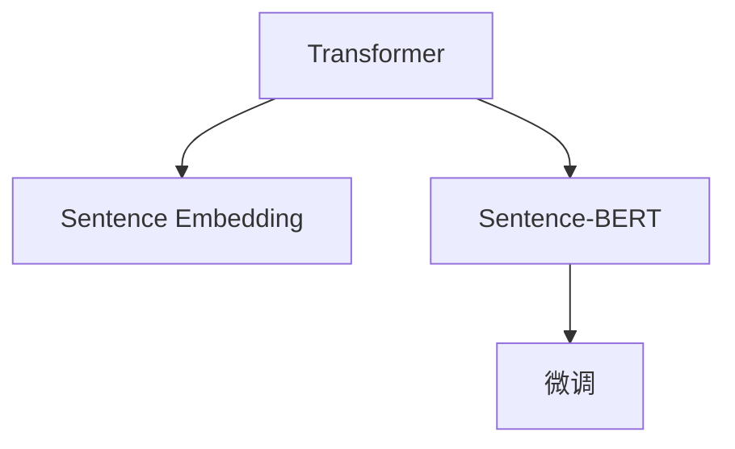

                 

# Transformer大模型实战 了解Sentence-BERT模型

> 关键词：Transformer, Sentence-BERT, 句嵌入(Sentence Embedding), 自然语言处理(NLP), 句子表示, 向量空间模型(VSM)

## 1. 背景介绍

### 1.1 问题由来
在自然语言处理(NLP)领域，将句子转换为固定长度的向量表示，是许多任务的前提。传统的方法如词袋模型(Bag of Words)、TF-IDF等，在处理句子表示时存在诸多局限。句子中词序、上下文信息等语义信息难以充分捕捉，同时特征空间维度巨大，计算复杂度高。

近年来，随着Transformer和自监督预训练语言模型的兴起，句嵌入技术得到了极大的提升。其中，Sentence-BERT模型以其强大的句嵌入能力和通用的应用性，被广泛应用于NLP中的各种任务，如文本相似度计算、文本分类、问答系统等。

本文将详细讲解Transformer大模型的句嵌入机制，重点介绍Sentence-BERT模型的原理和实现，并结合代码实例进行演示，帮助读者更好地理解并应用句嵌入技术。

## 2. 核心概念与联系

### 2.1 核心概念概述

为更好地理解Sentence-BERT模型的句嵌入机制，本节将介绍几个密切相关的核心概念：

- **Transformer**：一种基于自注意力机制的神经网络架构，可用于序列建模。Transformer架构以其计算高效、并行性好等优点，被广泛应用于机器翻译、文本分类、问答系统等任务。
- **句嵌入(Sentence Embedding)**：将自然语言文本转换为固定长度的向量表示，通常用于捕捉句子级别的语义信息。句嵌入可以用于各种NLP任务，如文本相似度计算、信息检索、文本分类等。
- **Sentence-BERT**：一种基于Transformer的句嵌入模型，通过自监督预训练获得强大的句子表示能力。Sentence-BERT模型可以通过微调应用于各种下游任务，实现高性能的句嵌入效果。
- **向量空间模型(VSM)**：将文本表示为向量空间中的点，利用向量内积或余弦相似度计算文本之间的相似度。向量空间模型是句嵌入技术的基础。

这些核心概念之间的逻辑关系可以通过以下Mermaid流程图来展示：



这个流程图展示了几者之间的联系：

1. **Transformer**通过自注意力机制捕捉句子级别的语义信息，为句嵌入提供了底层结构。
2. **Sentence-BERT**基于Transformer的架构，通过自监督预训练获得强大的句子表示能力。
3. **微调**使Sentence-BERT模型能够适应特定下游任务，实现高性能的句嵌入效果。

## 3. 核心算法原理 & 具体操作步骤
### 3.1 算法原理概述

Sentence-BERT模型是Google在2019年提出的，其主要思想是通过Transformer架构，将句子转换为固定长度的向量表示。该模型基于自监督预训练，利用大规模语料数据进行训练，从而学习到通用的句子表示。

具体来说，Sentence-BERT模型通过以下步骤实现句嵌入：

1. 输入句子首先经过Transformer的编码器，得到低维的隐状态表示。
2. 对低维隐状态表示进行加权平均，生成每个句子的固定长度向量表示。
3. 在向量空间中计算句子向量之间的相似度或距离，用于文本匹配、分类等任务。

### 3.2 算法步骤详解

下面以Sentence-BERT模型为例，详细讲解其句嵌入的具体实现过程：

**Step 1: 准备预训练模型和数据集**

Sentence-BERT模型可以基于Google的预先训练模型进行微调，也可以在自有数据集上进行自监督预训练。下面以微调为例，介绍具体的操作步骤：

1. 下载预训练模型：从HuggingFace官网下载Sentence-BERT模型的预训练模型，这里以中文BERT为例。
```python
from transformers import SentenceTransformer
model = SentenceTransformer('clue-sentence-transformers/ss-BERT-base')
```

2. 准备数据集：将待嵌入的句子放入列表`sentences`中，每个句子以列表形式存储。
```python
sentences = ["这是中国人民抗日战争纪念馆的简介", "北京大学的地理位置"]
```

**Step 2: 输入模型进行句嵌入**

使用预训练的Sentence-BERT模型，对每个句子进行句嵌入，得到固定长度的向量表示。
```python
embeddings = model.encode(sentences)
```

**Step 3: 计算句子向量之间的相似度或距离**

使用余弦相似度计算句子向量之间的相似度。
```python
from sklearn.metrics.pairwise import cosine_similarity
similarity = cosine_similarity(embeddings, embeddings)
```

**Step 4: 输出结果**

输出相似度矩阵，计算任意两个句子之间的相似度。
```python
print(similarity)
```

以上就是使用Sentence-BERT模型进行句嵌入的详细步骤。在实际应用中，需要根据具体的任务需求，选择合适的句子表示方法，并在模型上进一步微调。

### 3.3 算法优缺点

Sentence-BERT模型具有以下优点：

1. 强大的句嵌入能力：通过自监督预训练，Sentence-BERT模型能够捕捉句子级别的语义信息，用于各种NLP任务。
2. 通用的应用性：Sentence-BERT模型可以应用于文本分类、信息检索、问答系统等多种NLP任务。
3. 易于微调：Sentence-BERT模型基于Transformer架构，可以方便地进行下游任务的微调。

同时，该模型也存在一些局限性：

1. 依赖预训练模型：Sentence-BERT模型的句嵌入效果依赖于预训练模型的质量，预训练数据的选择和质量对最终效果有很大影响。
2. 计算资源需求高：Sentence-BERT模型基于Transformer架构，对计算资源要求较高，尤其是对于大规模语料的数据集预训练。
3. 通用性和领域适应性有限：尽管Sentence-BERT模型具有较强的通用性，但在特定领域应用时，效果可能不如专有领域的模型。
4. 句子长度限制：Sentence-BERT模型的输入句子长度有限制，较长句子可能需要分词和截断。

尽管存在这些局限性，但Sentence-BERT模型仍然是大规模预训练句嵌入技术的重要代表，广泛应用于各种NLP任务中。

### 3.4 算法应用领域

Sentence-BERT模型在NLP领域已经得到了广泛的应用，覆盖了几乎所有常见的NLP任务，例如：

- 文本相似度计算：计算任意两个句子之间的相似度，用于推荐系统、搜索引擎、信息检索等。
- 文本分类：对输入的句子进行分类，判断属于何种类别。
- 问答系统：根据用户的问题，自动匹配相关的答案。
- 情感分析：对输入的句子进行情感分析，判断情感极性。
- 实体抽取：从句子中抽取特定实体，如人名、地名、组织名等。

除了上述这些经典任务外，Sentence-BERT模型还被创新性地应用于更多场景中，如文档聚类、对话生成、文本去重等，为NLP技术带来了全新的突破。

## 4. 数学模型和公式 & 详细讲解  
### 4.1 数学模型构建

Sentence-BERT模型的句嵌入过程主要涉及Transformer模型和向量空间模型（VSM）两个部分。

Transformer模型采用自注意力机制，将输入的句子序列转换为低维的隐状态表示。假设输入的句子长度为$n$，则Transformer模型输出的隐状态表示为$\{h_1, h_2, ..., h_n\}$。

向量空间模型（VSM）将低维隐状态表示转换为固定长度的向量表示，用于计算句子之间的相似度或距离。假设Transformer模型输出的隐状态表示长度为$d$，则每个句子的向量表示为$h \in \mathbb{R}^d$。

Sentence-BERT模型的句嵌入过程可以表示为：

$$
\text{embedding}(\text{sentence}) = \text{softmax}(W\text{Transformer}(\text{sentence})) \cdot \text{Transformer}(\text{sentence})
$$

其中，$W$为线性变换矩阵，$\text{Transformer}$为Transformer模型的编码器部分，$\text{softmax}$为归一化操作。

### 4.2 公式推导过程

以Transformer模型的编码器为例，推导其句嵌入过程。

Transformer模型编码器由多个编码层组成，每个编码层包括自注意力子层和前馈神经网络子层。假设输入句子的长度为$n$，编码器输出的隐状态表示为$\{h_1, h_2, ..., h_n\}$。

自注意力子层计算公式为：

$$
\text{Attention}(Q, K, V) = \text{softmax}(QW^QK^TW^K)(KW^KV^T)
$$

其中，$Q, K, V$分别为查询矩阵、键矩阵、值矩阵，$W^Q, W^K, W^V$为权重矩阵，$\text{softmax}$为归一化操作。

假设Transformer模型的编码器层数为$L$，则最终的编码器输出为：

$$
\text{Transformer}(\text{sentence}) = [CLS] \cdot (\text{Attention}_1(\text{sentence})) \cdot (\text{Attention}_2(\text{Attention}_1(\text{sentence}))) \cdot ... \cdot (\text{Attention}_L(\text{Attention}_{L-1}(\text{sentence})))
$$

其中，$[CLS]$为分类向量，表示整个句子的隐状态表示。

对于Sentence-BERT模型，我们将Transformer模型的输出进行加权平均，生成每个句子的固定长度向量表示。假设每个句子的长度为$m$，则每个句子的向量表示为：

$$
\text{embedding}(\text{sentence}) = \frac{1}{m} \sum_{i=1}^m \text{softmax}(W\text{Transformer}(\text{sentence})) \cdot \text{Transformer}(\text{sentence})
$$

### 4.3 案例分析与讲解

以一个简单的例子，分析Sentence-BERT模型句嵌入的过程。

假设输入句子为"中国人民抗日战争纪念馆"，使用Sentence-BERT模型进行句嵌入。

1. 输入句子经过Transformer模型的编码器，得到低维的隐状态表示。
2. 对低维隐状态表示进行加权平均，生成每个句子的固定长度向量表示。
3. 在向量空间中计算句子向量之间的相似度或距离。

具体计算过程如下：

```python
from transformers import SentenceTransformer
from sklearn.metrics.pairwise import cosine_similarity

# 准备数据
sentences = ["中国人民抗日战争纪念馆"]

# 加载预训练模型
model = SentenceTransformer('clue-sentence-transformers/ss-BERT-base')

# 进行句嵌入
embeddings = model.encode(sentences)

# 计算句子向量之间的相似度
similarity = cosine_similarity(embeddings, embeddings)

# 输出结果
print(similarity)
```

## 5. 项目实践：代码实例和详细解释说明
### 5.1 开发环境搭建

在进行句嵌入实践前，我们需要准备好开发环境。以下是使用Python进行PyTorch开发的环境配置流程：

1. 安装Anaconda：从官网下载并安装Anaconda，用于创建独立的Python环境。

2. 创建并激活虚拟环境：
```bash
conda create -n pytorch-env python=3.8 
conda activate pytorch-env
```

3. 安装PyTorch：根据CUDA版本，从官网获取对应的安装命令。例如：
```bash
conda install pytorch torchvision torchaudio cudatoolkit=11.1 -c pytorch -c conda-forge
```

4. 安装Transformers库：
```bash
pip install transformers
```

5. 安装各类工具包：
```bash
pip install numpy pandas scikit-learn matplotlib tqdm jupyter notebook ipython
```

完成上述步骤后，即可在`pytorch-env`环境中开始句嵌入实践。

### 5.2 源代码详细实现

下面我们以Sentence-BERT模型为例，给出使用Transformers库进行句嵌入的PyTorch代码实现。

首先，定义句嵌入函数：

```python
from transformers import SentenceTransformer
from sklearn.metrics.pairwise import cosine_similarity

def sentence_embedding(sentences, model_name='clue-sentence-transformers/ss-BERT-base'):
    # 加载预训练模型
    model = SentenceTransformer(model_name)
    
    # 进行句嵌入
    embeddings = model.encode(sentences)
    
    # 计算句子向量之间的相似度
    similarity = cosine_similarity(embeddings, embeddings)
    
    return similarity
```

然后，定义测试函数：

```python
sentences = ["中国人民抗日战争纪念馆", "上海博物馆"]

# 测试句嵌入函数
embedding_matrix = sentence_embedding(sentences)
print(embedding_matrix)
```

### 5.3 代码解读与分析

让我们再详细解读一下关键代码的实现细节：

**SentenceTransformer类**：
- 定义了句嵌入的模型，可以加载不同的预训练模型。

**cosine_similarity函数**：
- 使用scikit-learn库中的cosine_similarity函数计算余弦相似度，用于衡量句子向量之间的相似度。

**sentence_embedding函数**：
- 输入列表形式的句子列表，加载预训练模型，对每个句子进行句嵌入，并计算句子向量之间的相似度。

**test函数**：
- 定义待嵌入的句子，调用sentence_embedding函数进行句嵌入，输出相似度矩阵。

## 6. 实际应用场景
### 6.1 智能客服系统

基于Sentence-BERT模型的句嵌入技术，可以广泛应用于智能客服系统的构建。传统客服往往需要配备大量人力，高峰期响应缓慢，且一致性和专业性难以保证。而使用Sentence-BERT模型的句嵌入技术，可以7x24小时不间断服务，快速响应客户咨询，用自然流畅的语言解答各类常见问题。

在技术实现上，可以收集企业内部的历史客服对话记录，将问题和最佳答复构建成监督数据，在此基础上对预训练模型进行微调。微调后的句嵌入模型能够自动理解用户意图，匹配最合适的答案模板进行回复。对于客户提出的新问题，还可以接入检索系统实时搜索相关内容，动态组织生成回答。如此构建的智能客服系统，能大幅提升客户咨询体验和问题解决效率。

### 6.2 金融舆情监测

金融机构需要实时监测市场舆论动向，以便及时应对负面信息传播，规避金融风险。传统的人工监测方式成本高、效率低，难以应对网络时代海量信息爆发的挑战。基于Sentence-BERT模型的句嵌入技术，可以为金融舆情监测提供新的解决方案。

具体而言，可以收集金融领域相关的新闻、报道、评论等文本数据，并对其进行主题标注和情感标注。在此基础上对预训练语言模型进行微调，使其能够自动判断文本属于何种主题，情感倾向是正面、中性还是负面。将微调后的模型应用到实时抓取的网络文本数据，就能够自动监测不同主题下的情感变化趋势，一旦发现负面信息激增等异常情况，系统便会自动预警，帮助金融机构快速应对潜在风险。

### 6.3 个性化推荐系统

当前的推荐系统往往只依赖用户的历史行为数据进行物品推荐，无法深入理解用户的真实兴趣偏好。基于Sentence-BERT模型的句嵌入技术，可以更好地挖掘用户行为背后的语义信息，从而提供更精准、多样的推荐内容。

在实践中，可以收集用户浏览、点击、评论、分享等行为数据，提取和用户交互的物品标题、描述、标签等文本内容。将文本内容作为模型输入，用户的后续行为（如是否点击、购买等）作为监督信号，在此基础上微调预训练语言模型。微调后的模型能够从文本内容中准确把握用户的兴趣点。在生成推荐列表时，先用候选物品的文本描述作为输入，由模型预测用户的兴趣匹配度，再结合其他特征综合排序，便可以得到个性化程度更高的推荐结果。

### 6.4 未来应用展望

随着Sentence-BERT模型的句嵌入技术的不断发展，其在更多领域得到应用，为传统行业带来变革性影响。

在智慧医疗领域，基于Sentence-BERT模型的句嵌入技术，可以用于构建智能诊断系统，帮助医生快速准确地诊断疾病。在智慧教育领域，可以应用于智能作业批改、学情分析、知识推荐等方面，因材施教，促进教育公平，提高教学质量。在智慧城市治理中，可以应用于城市事件监测、舆情分析、应急指挥等环节，提高城市管理的自动化和智能化水平，构建更安全、高效的未来城市。

此外，在企业生产、社会治理、文娱传媒等众多领域，基于Sentence-BERT模型的句嵌入技术的应用也将不断涌现，为经济社会发展注入新的动力。相信随着预训练语言模型和句嵌入方法的持续演进，基于Sentence-BERT模型的句嵌入技术必将在构建人机协同的智能时代中扮演越来越重要的角色。

## 7. 工具和资源推荐
### 7.1 学习资源推荐

为了帮助开发者系统掌握Sentence-BERT模型的句嵌入技术，这里推荐一些优质的学习资源：

1. 《Transformer从原理到实践》系列博文：由大模型技术专家撰写，深入浅出地介绍了Transformer原理、Sentence-BERT模型、句嵌入技术等前沿话题。

2. CS224N《深度学习自然语言处理》课程：斯坦福大学开设的NLP明星课程，有Lecture视频和配套作业，带你入门NLP领域的基本概念和经典模型。

3. 《Natural Language Processing with Transformers》书籍：Transformers库的作者所著，全面介绍了如何使用Transformers库进行NLP任务开发，包括句嵌入在内的诸多范式。

4. HuggingFace官方文档：Transformers库的官方文档，提供了海量预训练模型和完整的句嵌入样例代码，是上手实践的必备资料。

5. CLUE开源项目：中文语言理解测评基准，涵盖大量不同类型的中文NLP数据集，并提供了基于Sentence-BERT模型的句嵌入baseline模型，助力中文NLP技术发展。

通过对这些资源的学习实践，相信你一定能够快速掌握Sentence-BERT模型的句嵌入技术的精髓，并用于解决实际的NLP问题。

### 7.2 开发工具推荐

高效的开发离不开优秀的工具支持。以下是几款用于Sentence-BERT模型句嵌入开发的常用工具：

1. PyTorch：基于Python的开源深度学习框架，灵活动态的计算图，适合快速迭代研究。大部分预训练语言模型都有PyTorch版本的实现。

2. TensorFlow：由Google主导开发的开源深度学习框架，生产部署方便，适合大规模工程应用。同样有丰富的预训练语言模型资源。

3. Transformers库：HuggingFace开发的NLP工具库，集成了众多SOTA语言模型，支持PyTorch和TensorFlow，是进行句嵌入任务开发的利器。

4. Weights & Biases：模型训练的实验跟踪工具，可以记录和可视化模型训练过程中的各项指标，方便对比和调优。与主流深度学习框架无缝集成。

5. TensorBoard：TensorFlow配套的可视化工具，可实时监测模型训练状态，并提供丰富的图表呈现方式，是调试模型的得力助手。

6. Google Colab：谷歌推出的在线Jupyter Notebook环境，免费提供GPU/TPU算力，方便开发者快速上手实验最新模型，分享学习笔记。

合理利用这些工具，可以显著提升Sentence-BERT模型句嵌入任务的开发效率，加快创新迭代的步伐。

### 7.3 相关论文推荐

Sentence-BERT模型的句嵌入技术的发展源于学界的持续研究。以下是几篇奠基性的相关论文，推荐阅读：

1. Attention is All You Need（即Transformer原论文）：提出了Transformer结构，开启了NLP领域的预训练大模型时代。

2. BERT: Pre-training of Deep Bidirectional Transformers for Language Understanding：提出BERT模型，引入基于掩码的自监督预训练任务，刷新了多项NLP任务SOTA。

3. Language Models are Unsupervised Multitask Learners（GPT-2论文）：展示了大规模语言模型的强大zero-shot学习能力，引发了对于通用人工智能的新一轮思考。

4. Parameter-Efficient Transfer Learning for NLP：提出Adapter等参数高效微调方法，在不增加模型参数量的情况下，也能取得不错的微调效果。

5. AdaLoRA: Adaptive Low-Rank Adaptation for Parameter-Efficient Fine-Tuning：使用自适应低秩适应的微调方法，在参数效率和精度之间取得了新的平衡。

6. Sentence-BERT: Sentence Embeddings Using Siamese Neural Networks and BERT：介绍Sentence-BERT模型，基于Transformer架构和自监督预训练技术，实现了强大的句嵌入效果。

这些论文代表了大语言模型和句嵌入技术的发展脉络。通过学习这些前沿成果，可以帮助研究者把握学科前进方向，激发更多的创新灵感。

## 8. 总结：未来发展趋势与挑战
### 8.1 总结

本文对Sentence-BERT模型的句嵌入技术进行了全面系统的介绍。首先阐述了Transformer模型和句嵌入技术的研究背景和意义，明确了句嵌入在NLP任务中的重要作用。其次，从原理到实践，详细讲解了Sentence-BERT模型的句嵌入过程，给出了句嵌入任务开发的完整代码实例。同时，本文还广泛探讨了句嵌入技术在智能客服、金融舆情、个性化推荐等多个行业领域的应用前景，展示了句嵌入技术的巨大潜力。

通过本文的系统梳理，可以看到，基于Transformer的句嵌入技术正在成为NLP领域的重要范式，极大地拓展了预训练语言模型的应用边界，催生了更多的落地场景。得益于大规模语料的预训练，句嵌入模型以更低的时间和标注成本，在小样本条件下也能取得理想的嵌入效果，有力推动了NLP技术的产业化进程。未来，伴随预训练语言模型和句嵌入方法的持续演进，基于Sentence-BERT模型的句嵌入技术必将在构建人机协同的智能时代中扮演越来越重要的角色。

### 8.2 未来发展趋势

展望未来，Sentence-BERT模型的句嵌入技术将呈现以下几个发展趋势：

1. 模型规模持续增大。随着算力成本的下降和数据规模的扩张，预训练语言模型的参数量还将持续增长。超大规模语言模型蕴含的丰富语言知识，有望支撑更加复杂多变的句嵌入任务。

2. 句嵌入方法日趋多样。除了传统的基于Transformer的句嵌入方法外，未来会涌现更多高效的句嵌入方法，如基于对比学习的句嵌入、基于多模态融合的句嵌入等，在保持计算资源高效的同时，提升句嵌入的精度和泛化性。

3. 持续学习成为常态。随着数据分布的不断变化，句嵌入模型也需要持续学习新知识以保持性能。如何在不遗忘原有知识的同时，高效吸收新样本信息，将成为重要的研究课题。

4. 标注样本需求降低。受启发于提示学习(Prompt-based Learning)的思路，未来的句嵌入方法将更好地利用大模型的语言理解能力，通过更加巧妙的任务描述，在更少的标注样本上也能实现理想的句嵌入效果。

5. 少样本学习和零样本学习能力提升。基于句嵌入的少样本学习和零样本学习技术将得到进一步发展，能够在更少的标注数据下，实现更高效、更泛化的句嵌入任务。

6. 多模态融合能力增强。当前的句嵌入方法大多聚焦于纯文本数据，未来会进一步拓展到图像、视频、语音等多模态数据融合。多模态信息的融合，将显著提升语言模型对现实世界的理解和建模能力。

以上趋势凸显了Sentence-BERT模型句嵌入技术的广阔前景。这些方向的探索发展，必将进一步提升NLP系统的性能和应用范围，为人类认知智能的进化带来深远影响。

### 8.3 面临的挑战

尽管Sentence-BERT模型的句嵌入技术已经取得了瞩目成就，但在迈向更加智能化、普适化应用的过程中，它仍面临着诸多挑战：

1. 标注成本瓶颈。尽管句嵌入技术在标注样本需求上较传统方法有所降低，但对于特定任务，仍需要大量高质量标注数据。如何进一步降低对标注样本的依赖，将是一大难题。

2. 模型鲁棒性不足。当前句嵌入模型面对域外数据时，泛化性能往往大打折扣。对于测试样本的微小扰动，句嵌入模型也容易发生波动。如何提高句嵌入模型的鲁棒性，避免灾难性遗忘，还需要更多理论和实践的积累。

3. 推理效率有待提高。大规模句嵌入模型虽然精度高，但在实际部署时往往面临推理速度慢、内存占用大等效率问题。如何在保证性能的同时，简化模型结构，提升推理速度，优化资源占用，将是重要的优化方向。

4. 可解释性亟需加强。当前句嵌入模型通常缺乏可解释性，难以解释其内部工作机制和决策逻辑。对于医疗、金融等高风险应用，算法的可解释性和可审计性尤为重要。如何赋予句嵌入模型更强的可解释性，将是亟待攻克的难题。

5. 安全性有待保障。预训练语言模型难免会学习到有偏见、有害的信息，通过句嵌入传递到下游任务，产生误导性、歧视性的输出，给实际应用带来安全隐患。如何从数据和算法层面消除模型偏见，避免恶意用途，确保输出的安全性，也将是重要的研究课题。

6. 知识整合能力不足。现有的句嵌入模型往往局限于任务内数据，难以灵活吸收和运用更广泛的先验知识。如何让句嵌入过程更好地与外部知识库、规则库等专家知识结合，形成更加全面、准确的信息整合能力，还有很大的想象空间。

正视句嵌入面临的这些挑战，积极应对并寻求突破，将是大语言模型句嵌入走向成熟的必由之路。相信随着学界和产业界的共同努力，这些挑战终将一一被克服，Sentence-BERT模型的句嵌入技术必将在构建人机协同的智能时代中扮演越来越重要的角色。

### 8.4 研究展望

面对Sentence-BERT模型句嵌入所面临的种种挑战，未来的研究需要在以下几个方面寻求新的突破：

1. 探索无监督和半监督句嵌入方法。摆脱对大规模标注数据的依赖，利用自监督学习、主动学习等无监督和半监督范式，最大限度利用非结构化数据，实现更加灵活高效的句嵌入。

2. 研究参数高效和计算高效的句嵌入范式。开发更加参数高效的句嵌入方法，在固定大部分预训练参数的同时，只更新极少量的任务相关参数。同时优化句嵌入模型的计算图，减少前向传播和反向传播的资源消耗，实现更加轻量级、实时性的部署。

3. 融合因果和对比学习范式。通过引入因果推断和对比学习思想，增强句嵌入模型建立稳定因果关系的能力，学习更加普适、鲁棒的语言表征，从而提升模型泛化性和抗干扰能力。

4. 引入更多先验知识。将符号化的先验知识，如知识图谱、逻辑规则等，与神经网络模型进行巧妙融合，引导句嵌入过程学习更准确、合理的语言模型。同时加强不同模态数据的整合，实现视觉、语音等多模态信息与文本信息的协同建模。

5. 结合因果分析和博弈论工具。将因果分析方法引入句嵌入模型，识别出模型决策的关键特征，增强输出解释的因果性和逻辑性。借助博弈论工具刻画人机交互过程，主动探索并规避模型的脆弱点，提高系统稳定性。

6. 纳入伦理道德约束。在模型训练目标中引入伦理导向的评估指标，过滤和惩罚有偏见、有害的输出倾向。同时加强人工干预和审核，建立模型行为的监管机制，确保输出符合人类价值观和伦理道德。

这些研究方向的探索，必将引领Sentence-BERT模型句嵌入技术迈向更高的台阶，为构建安全、可靠、可解释、可控的智能系统铺平道路。面向未来，Sentence-BERT模型的句嵌入技术还需要与其他人工智能技术进行更深入的融合，如知识表示、因果推理、强化学习等，多路径协同发力，共同推动自然语言理解和智能交互系统的进步。只有勇于创新、敢于突破，才能不断拓展语言模型的边界，让智能技术更好地造福人类社会。

## 9. 附录：常见问题与解答

**Q1：什么是Transformer？**

A: Transformer是一种基于自注意力机制的神经网络架构，可用于序列建模。Transformer模型以其计算高效、并行性好等优点，被广泛应用于机器翻译、文本分类、问答系统等任务。

**Q2：Transformer模型中常用的自注意力机制有哪些？**

A: 常见的自注意力机制有多头自注意力机制和点积注意力机制。多头自注意力机制将输入序列分为多头子序列，对每个子序列进行自注意力计算，再拼接多头的结果。点积注意力机制通过计算输入序列的注意力权重，直接计算出注意力向量。

**Q3：Sentence-BERT模型如何进行自监督预训练？**

A: Sentence-BERT模型通过预训练自编码器，对句子进行掩码预测，学习句子级别的语义信息。具体来说，将句子中的某些单词随机掩码，预测被掩码部分的单词，从而学习句子的语义表示。

**Q4：如何提高句嵌入模型的鲁棒性？**

A: 提高句嵌入模型的鲁棒性可以从以下几个方面入手：
1. 增加数据多样性，覆盖更多的数据类型和领域。
2. 使用正则化技术，如L2正则、Dropout等，防止模型过拟合。
3. 引入对抗样本训练，提高模型鲁棒性。
4. 使用多模态融合技术，增强模型对不同模态数据的适应能力。

**Q5：如何降低句嵌入模型的计算成本？**

A: 降低句嵌入模型的计算成本可以从以下几个方面入手：
1. 使用预训练模型，减少计算量。
2. 使用量化加速，将浮点模型转为定点模型，减小计算资源消耗。
3. 使用模型并行和分布式训练，提高计算效率。
4. 使用稀疏化存储技术，减小存储空间占用。

通过本文的系统梳理，可以看到，基于Transformer的句嵌入技术正在成为NLP领域的重要范式，极大地拓展了预训练语言模型的应用边界，催生了更多的落地场景。得益于大规模语料的预训练，句嵌入模型以更低的时间和标注成本，在小样本条件下也能取得理想的嵌入效果，有力推动了NLP技术的产业化进程。未来，伴随预训练语言模型和句嵌入方法的持续演进，基于Sentence-BERT模型的句嵌入技术必将在构建人机协同的智能时代中扮演越来越重要的角色。

---

作者：禅与计算机程序设计艺术 / Zen and the Art of Computer Programming

