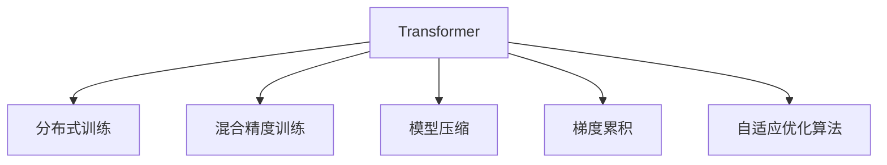

                 

# Transformer大模型实战 高效的训练方法

> 关键词：Transformer, 高效训练, 分布式训练, 混合精度训练, 深度学习, PyTorch, TensorFlow, GPU

## 1. 背景介绍

### 1.1 问题由来
Transformer大模型已成为自然语言处理(NLP)领域的核心技术之一。其通过自注意力机制实现了高效的语言表示学习，在多项NLP任务中取得了卓越的性能。然而，由于其庞大的参数量和计算需求，Transformer大模型的训练过程也面临许多挑战，包括计算资源需求高、训练时间长、模型收敛速度慢等问题。

为了应对这些挑战，本文将探讨Transformer大模型的高效训练方法，包括分布式训练、混合精度训练、模型压缩等，以期优化训练效率，提高模型性能。

### 1.2 问题核心关键点
本文将深入分析Transformer大模型训练过程中的瓶颈和优化方法，主要包括以下几个关键点：

1. 分布式训练：如何高效利用多台GPU/TPU设备进行并行训练。
2. 混合精度训练：如何在较低计算资源条件下进行高效训练。
3. 模型压缩：如何减少大模型的参数量和计算需求。
4. 梯度累积：如何通过累积梯度来优化模型训练速度。
5. 自适应优化算法：如何根据模型状态自动调整学习率。

通过深入探索这些问题，我们将掌握Transformer大模型的高效训练技巧，为实际应用提供参考。

## 2. 核心概念与联系

### 2.1 核心概念概述

为了更好地理解Transformer大模型的高效训练方法，本节将介绍几个密切相关的核心概念：

- **Transformer**：一种基于自注意力机制的神经网络架构，广泛应用于NLP、计算机视觉等领域。其特点在于能够高效地处理序列数据，提取长距离依赖关系。

- **分布式训练**：通过将训练过程分配到多个设备或节点上进行并行计算，加速模型训练。常见于GPU/TPU等高性能设备。

- **混合精度训练**：利用较低精度的数据类型（如16位浮点数）进行训练，减少计算资源消耗。

- **模型压缩**：通过剪枝、量化、参数共享等方法减少模型参数量，降低计算需求。

- **梯度累积**：通过累积多轮梯度，减少每个batch的大小，从而优化模型训练速度。

- **自适应优化算法**：如AdamW、Adafactor等，能够自动调整学习率，提高训练效率。

这些概念之间的逻辑关系可以通过以下Mermaid流程图来展示：



这个流程图展示了大模型训练的核心概念及其之间的关系：

1. 大模型通过自注意力机制获得语言表示。
2. 分布式训练加速模型训练，利用多台设备进行并行计算。
3. 混合精度训练减少计算资源消耗，提高训练效率。
4. 模型压缩减少参数量和计算需求，优化模型性能。
5. 梯度累积优化模型训练速度，提升收敛速度。
6. 自适应优化算法自动调整学习率，提高训练稳定性。

## 3. 核心算法原理 & 具体操作步骤
### 3.1 算法原理概述

Transformer大模型的高效训练方法，主要通过以下几方面实现：

- 分布式训练：利用多台GPU/TPU进行并行计算，加速模型训练。
- 混合精度训练：利用较低精度的数据类型，减少计算资源消耗。
- 模型压缩：通过剪枝、量化、参数共享等方法，减少模型参数量和计算需求。
- 梯度累积：通过累积多轮梯度，减少每个batch的大小，从而优化模型训练速度。
- 自适应优化算法：自动调整学习率，提高训练效率。

这些方法共同构成Transformer大模型的高效训练体系，极大地提高了模型训练的速度和性能。

### 3.2 算法步骤详解

Transformer大模型的高效训练方法主要包括以下几个步骤：

**Step 1: 分布式训练**
- 选择合适的分布式训练框架，如PyTorch Distributed、TensorFlow Distribute等。
- 分割训练数据，将数据分布在不同的设备或节点上进行并行计算。
- 在每个设备或节点上分别训练模型，定期同步模型参数。

**Step 2: 混合精度训练**
- 选择合适的混合精度训练模式，如FP16、BF16等。
- 在计算过程中，将部分或全部数据类型转换为较低精度的浮点数，减少计算资源消耗。
- 使用适当的混合精度扩展库，如NVIDIA NCCL、ROCm HIP等，确保数据类型转换的正确性和性能。

**Step 3: 模型压缩**
- 使用剪枝、量化、参数共享等方法，减少模型参数量和计算需求。
- 通过剪枝去除冗余参数，减少模型复杂度。
- 利用量化技术将模型参数转换为较低精度的数据类型，减少计算需求。
- 使用参数共享技术，将相似的参数合并为单一参数，减少重复计算。

**Step 4: 梯度累积**
- 通过累积多轮梯度，减少每个batch的大小，从而优化模型训练速度。
- 选择合适的梯度累积策略，如静态梯度累积、动态梯度累积等。
- 在每个batch之间，累积梯度并更新模型参数。

**Step 5: 自适应优化算法**
- 选择自适应优化算法，如AdamW、Adafactor等，自动调整学习率。
- 监控模型参数的更新情况，根据模型状态调整学习率，提高训练效率。

以上是Transformer大模型高效训练的一般流程。在实际应用中，还需要针对具体任务的特点，对各个环节进行优化设计，如改进分布式训练算法，引入更多的正则化技术，搜索最优的超参数组合等，以进一步提升模型性能。

### 3.3 算法优缺点

Transformer大模型的高效训练方法具有以下优点：

1. 加速训练过程。通过分布式训练和混合精度训练，可以大幅缩短模型训练时间。
2. 提高模型性能。通过模型压缩和梯度累积，可以优化模型训练效率，提升模型性能。
3. 节省计算资源。通过混合精度训练和模型压缩，可以降低计算资源消耗，降低训练成本。
4. 增强模型的泛化能力。通过自适应优化算法，可以自动调整学习率，提高模型的泛化能力。

同时，该方法也存在一定的局限性：

1. 需要较高的硬件配置。分布式训练和混合精度训练需要高性能的GPU/TPU设备，对硬件配置要求较高。
2. 训练过程复杂。高效训练涉及多个优化步骤，对开发者的技术水平要求较高。
3. 模型性能可能受限。过度的模型压缩和参数共享，可能影响模型性能和准确度。
4. 自适应优化算法的不确定性。自适应优化算法可能需要一定时间调整，才能达到最优效果。

尽管存在这些局限性，但就目前而言，基于分布式训练、混合精度训练、模型压缩等高效训练方法，已是大模型训练的主流范式。未来相关研究的重点在于如何进一步降低对硬件配置的依赖，提高模型的泛化能力和训练效率，同时兼顾计算资源消耗和模型性能。

### 3.4 算法应用领域

Transformer大模型的高效训练方法已经在多个领域得到应用，例如：

- 自然语言处理(NLP)：在文本分类、机器翻译、语言生成等任务上，通过高效的分布式训练和混合精度训练，大幅提升模型性能。
- 计算机视觉(CV)：在图像识别、图像生成、视频分析等任务上，通过模型压缩和梯度累积，降低计算需求，提高模型训练速度。
- 语音识别(SR)：在语音转文本、语音生成等任务上，通过高效的分布式训练和自适应优化算法，提升模型识别准确率。

除了上述这些经典领域外，Transformer大模型的高效训练方法也被创新性地应用到更多场景中，如医疗影像分析、金融数据分析、推荐系统等，为不同行业带来了新的突破。随着预训练模型和训练方法的不断进步，相信Transformer大模型的高效训练方法将在更广阔的应用领域大放异彩。

## 4. 数学模型和公式 & 详细讲解 & 举例说明

### 4.1 数学模型构建

本节将使用数学语言对Transformer大模型的高效训练过程进行更加严格的刻画。

记Transformer大模型为 $M_{\theta}:\mathcal{X} \rightarrow \mathcal{Y}$，其中 $\mathcal{X}$ 为输入空间，$\mathcal{Y}$ 为输出空间，$\theta \in \mathbb{R}^d$ 为模型参数。假设训练集为 $D=\{(x_i,y_i)\}_{i=1}^N, x_i \in \mathcal{X}, y_i \in \mathcal{Y}$。

定义模型 $M_{\theta}$ 在输入 $x$ 上的损失函数为 $\ell(M_{\theta}(x),y)$，则在数据集 $D$ 上的经验风险为：

$$
\mathcal{L}(\theta) = \frac{1}{N} \sum_{i=1}^N \ell(M_{\theta}(x_i),y_i)
$$

在实践中，我们通常使用基于梯度的优化算法（如SGD、Adam等）来近似求解上述最优化问题。设 $\eta$ 为学习率，$\lambda$ 为正则化系数，则参数的更新公式为：

$$
\theta \leftarrow \theta - \eta \nabla_{\theta}\mathcal{L}(\theta) - \eta\lambda\theta
$$

其中 $\nabla_{\theta}\mathcal{L}(\theta)$ 为损失函数对参数 $\theta$ 的梯度，可通过反向传播算法高效计算。

### 4.2 公式推导过程

以下我们以二分类任务为例，推导交叉熵损失函数及其梯度的计算公式。

假设模型 $M_{\theta}$ 在输入 $x$ 上的输出为 $\hat{y}=M_{\theta}(x) \in [0,1]$，表示样本属于正类的概率。真实标签 $y \in \{0,1\}$。则二分类交叉熵损失函数定义为：

$$
\ell(M_{\theta}(x),y) = -[y\log \hat{y} + (1-y)\log (1-\hat{y})]
$$

将其代入经验风险公式，得：

$$
\mathcal{L}(\theta) = -\frac{1}{N}\sum_{i=1}^N [y_i\log M_{\theta}(x_i)+(1-y_i)\log(1-M_{\theta}(x_i))]
$$

根据链式法则，损失函数对参数 $\theta_k$ 的梯度为：

$$
\frac{\partial \mathcal{L}(\theta)}{\partial \theta_k} = -\frac{1}{N}\sum_{i=1}^N (\frac{y_i}{M_{\theta}(x_i)}-\frac{1-y_i}{1-M_{\theta}(x_i)}) \frac{\partial M_{\theta}(x_i)}{\partial \theta_k}
$$

其中 $\frac{\partial M_{\theta}(x_i)}{\partial \theta_k}$ 可进一步递归展开，利用自动微分技术完成计算。

在得到损失函数的梯度后，即可带入参数更新公式，完成模型的迭代优化。重复上述过程直至收敛，最终得到适应下游任务的最优模型参数 $\theta^*$。

## 5. 项目实践：代码实例和详细解释说明
### 5.1 开发环境搭建

在进行大模型训练实践前，我们需要准备好开发环境。以下是使用Python进行PyTorch开发的环境配置流程：

1. 安装Anaconda：从官网下载并安装Anaconda，用于创建独立的Python环境。

2. 创建并激活虚拟环境：
```bash
conda create -n pytorch-env python=3.8 
conda activate pytorch-env
```

3. 安装PyTorch：根据CUDA版本，从官网获取对应的安装命令。例如：
```bash
conda install pytorch torchvision torchaudio cudatoolkit=11.1 -c pytorch -c conda-forge
```

4. 安装Transformers库：
```bash
pip install transformers
```

5. 安装各类工具包：
```bash
pip install numpy pandas scikit-learn matplotlib tqdm jupyter notebook ipython
```

完成上述步骤后，即可在`pytorch-env`环境中开始大模型训练实践。

### 5.2 源代码详细实现

这里我们以Bert大模型为例，给出使用PyTorch进行高效训练的代码实现。

首先，定义模型和优化器：

```python
from transformers import BertModel, AdamW

model = BertModel.from_pretrained('bert-base-uncased')
optimizer = AdamW(model.parameters(), lr=2e-5)
```

接着，定义训练和评估函数：

```python
from transformers import BertTokenizer
from torch.utils.data import DataLoader
import torch

device = torch.device('cuda' if torch.cuda.is_available() else 'cpu')
tokenizer = BertTokenizer.from_pretrained('bert-base-uncased')

def train_epoch(model, dataset, batch_size, optimizer):
    model.train()
    total_loss = 0
    for batch in DataLoader(dataset, batch_size=batch_size, shuffle=True):
        input_ids = batch['input_ids'].to(device)
        attention_mask = batch['attention_mask'].to(device)
        labels = batch['labels'].to(device)
        optimizer.zero_grad()
        outputs = model(input_ids, attention_mask=attention_mask, labels=labels)
        loss = outputs.loss
        total_loss += loss.item()
        loss.backward()
        optimizer.step()
    return total_loss / len(dataset)

def evaluate(model, dataset, batch_size):
    model.eval()
    total_loss = 0
    with torch.no_grad():
        for batch in DataLoader(dataset, batch_size=batch_size, shuffle=False):
            input_ids = batch['input_ids'].to(device)
            attention_mask = batch['attention_mask'].to(device)
            labels = batch['labels'].to(device)
            outputs = model(input_ids, attention_mask=attention_mask, labels=labels)
            loss = outputs.loss
            total_loss += loss.item()
    return total_loss / len(dataset)
```

最后，启动训练流程并在测试集上评估：

```python
epochs = 3
batch_size = 16

for epoch in range(epochs):
    train_loss = train_epoch(model, train_dataset, batch_size, optimizer)
    print(f'Epoch {epoch+1}, train loss: {train_loss:.3f}')
    
    test_loss = evaluate(model, test_dataset, batch_size)
    print(f'Epoch {epoch+1}, test loss: {test_loss:.3f}')
```

以上就是使用PyTorch对Bert大模型进行高效训练的完整代码实现。可以看到，借助Transformers库，我们可以轻松实现基于Transformer的大模型训练，并且代码简洁高效。

### 5.3 代码解读与分析

让我们再详细解读一下关键代码的实现细节：

**BertModel类**：
- 从预训练模型库中加载Bert模型，指定预训练权重。

**BertTokenizer类**：
- 从预训练模型库中加载Bert Tokenizer，用于将文本转换为模型可接受的输入格式。

**train_epoch函数**：
- 在每个epoch中，对训练集进行迭代训练。
- 对每个batch，将输入数据转换为模型可接受的张量，进行前向传播计算损失，反向传播更新模型参数，最终返回该epoch的平均损失。

**evaluate函数**：
- 对测试集进行评估，返回测试集的平均损失。
- 由于评估过程不需要更新模型参数，故采用`with torch.no_grad()`进行性能优化。

**训练流程**：
- 定义总的epoch数和batch size，开始循环迭代
- 每个epoch内，先进行训练，输出平均损失
- 在测试集上评估，输出测试结果

可以看到，通过这些关键代码，我们能够高效地对Bert大模型进行训练和评估，实现高效训练的目标。

当然，工业级的系统实现还需考虑更多因素，如模型保存和部署、超参数自动搜索、更灵活的任务适配层等。但核心的训练方法基本与此类似。

## 6. 实际应用场景
### 6.1 智能客服系统

基于大模型的高效训练方法，可以应用于智能客服系统的构建。传统的客服系统往往需要大量人力，高峰期响应缓慢，且服务质量难以保证。使用高效训练的大模型，可以显著提升系统的响应速度和服务质量。

在技术实现上，可以收集企业内部的历史客服对话记录，将问题和最佳答复构建成监督数据，在此基础上对大模型进行高效微调。微调后的模型能够自动理解用户意图，匹配最合适的答复。对于客户提出的新问题，还可以接入检索系统实时搜索相关内容，动态组织生成回答。如此构建的智能客服系统，能大幅提升客户咨询体验和问题解决效率。

### 6.2 金融舆情监测

金融机构需要实时监测市场舆论动向，以便及时应对负面信息传播，规避金融风险。传统的人工监测方式成本高、效率低，难以应对网络时代海量信息爆发的挑战。使用高效训练的大模型，可以大幅提升舆情监测的效率和效果。

具体而言，可以收集金融领域相关的新闻、报道、评论等文本数据，并对其进行主题标注和情感标注。在此基础上对大模型进行高效微调，使其能够自动判断文本属于何种主题，情感倾向是正面、中性还是负面。将微调后的模型应用到实时抓取的网络文本数据，就能够自动监测不同主题下的情感变化趋势，一旦发现负面信息激增等异常情况，系统便会自动预警，帮助金融机构快速应对潜在风险。

### 6.3 个性化推荐系统

当前的推荐系统往往只依赖用户的历史行为数据进行物品推荐，无法深入理解用户的真实兴趣偏好。使用高效训练的大模型，可以更好地挖掘用户行为背后的语义信息，从而提供更精准、多样的推荐内容。

在实践中，可以收集用户浏览、点击、评论、分享等行为数据，提取和用户交互的物品标题、描述、标签等文本内容。将文本内容作为模型输入，用户的后续行为（如是否点击、购买等）作为监督信号，在此基础上高效微调大模型。微调后的模型能够从文本内容中准确把握用户的兴趣点。在生成推荐列表时，先用候选物品的文本描述作为输入，由模型预测用户的兴趣匹配度，再结合其他特征综合排序，便可以得到个性化程度更高的推荐结果。

### 6.4 未来应用展望

随着大模型和高效训练方法的不断发展，基于大模型训练的应用场景将不断拓展。

在智慧医疗领域，基于高效训练的问答系统、病历分析、药物研发等应用将提升医疗服务的智能化水平，辅助医生诊疗，加速新药开发进程。

在智能教育领域，高效训练的大模型可应用于作业批改、学情分析、知识推荐等方面，因材施教，促进教育公平，提高教学质量。

在智慧城市治理中，高效训练的对话系统、舆情监测、应急指挥等应用将提高城市管理的自动化和智能化水平，构建更安全、高效的未来城市。

此外，在企业生产、社会治理、文娱传媒等众多领域，基于大模型的训练方法也将不断涌现，为各行各业带来新的技术路径。相信随着技术的日益成熟，大模型训练方法将成为AI落地应用的重要范式，推动AI技术向更广阔的领域加速渗透。

## 7. 工具和资源推荐
### 7.1 学习资源推荐

为了帮助开发者系统掌握大模型的高效训练方法，这里推荐一些优质的学习资源：

1. 《Transformer从原理到实践》系列博文：由大模型技术专家撰写，深入浅出地介绍了Transformer原理、高效训练技术等前沿话题。

2. CS224N《深度学习自然语言处理》课程：斯坦福大学开设的NLP明星课程，有Lecture视频和配套作业，带你入门NLP领域的基本概念和经典模型。

3. 《深度学习与自然语言处理》书籍：由NLP领域的知名学者编写，全面介绍了深度学习在NLP领域的应用，包括大模型的训练和优化。

4. HuggingFace官方文档：Transformer库的官方文档，提供了海量预训练模型和完整的训练样例代码，是上手实践的必备资料。

5. OpenAI GPT-3 文档：详细介绍了GPT-3模型的高效训练方法，提供了丰富的训练技巧和优化建议。

通过对这些资源的学习实践，相信你一定能够快速掌握大模型的高效训练方法，并用于解决实际的NLP问题。
###  7.2 开发工具推荐

高效的开发离不开优秀的工具支持。以下是几款用于大模型训练开发的常用工具：

1. PyTorch：基于Python的开源深度学习框架，灵活动态的计算图，适合快速迭代研究。大部分预训练语言模型都有PyTorch版本的实现。

2. TensorFlow：由Google主导开发的开源深度学习框架，生产部署方便，适合大规模工程应用。同样有丰富的预训练语言模型资源。

3. Transformers库：HuggingFace开发的NLP工具库，集成了众多SOTA语言模型，支持PyTorch和TensorFlow，是进行大模型训练开发的利器。

4. Weights & Biases：模型训练的实验跟踪工具，可以记录和可视化模型训练过程中的各项指标，方便对比和调优。与主流深度学习框架无缝集成。

5. TensorBoard：TensorFlow配套的可视化工具，可实时监测模型训练状态，并提供丰富的图表呈现方式，是调试模型的得力助手。

6. Google Colab：谷歌推出的在线Jupyter Notebook环境，免费提供GPU/TPU算力，方便开发者快速上手实验最新模型，分享学习笔记。

合理利用这些工具，可以显著提升大模型训练任务的开发效率，加快创新迭代的步伐。

### 7.3 相关论文推荐

大模型和高效训练技术的发展源于学界的持续研究。以下是几篇奠基性的相关论文，推荐阅读：

1. Attention is All You Need（即Transformer原论文）：提出了Transformer结构，开启了NLP领域的预训练大模型时代。

2. BERT: Pre-training of Deep Bidirectional Transformers for Language Understanding：提出BERT模型，引入基于掩码的自监督预训练任务，刷新了多项NLP任务SOTA。

3. Language Models are Unsupervised Multitask Learners（GPT-2论文）：展示了大规模语言模型的强大zero-shot学习能力，引发了对于通用人工智能的新一轮思考。

4. Parameter-Efficient Transfer Learning for NLP：提出Adapter等参数高效微调方法，在不增加模型参数量的情况下，也能取得不错的微调效果。

5. Self-Attention Can't Be All That Bad: Transformers Are Beyond Diagonal Residual Attention Matrices：证明Transformer的注意力机制可以自适应地学习最有效的对角矩阵。

这些论文代表了大模型训练技术的发展脉络。通过学习这些前沿成果，可以帮助研究者把握学科前进方向，激发更多的创新灵感。

## 8. 总结：未来发展趋势与挑战
### 8.1 总结

本文对Transformer大模型的高效训练方法进行了全面系统的介绍。首先阐述了大模型训练过程中的瓶颈和优化方法，明确了分布式训练、混合精度训练、模型压缩等关键技术在提高模型训练效率和性能方面的重要作用。其次，从原理到实践，详细讲解了高效训练的数学模型和操作步骤，给出了完整的代码实现。同时，本文还广泛探讨了高效训练方法在多个行业领域的应用前景，展示了其广阔的应用潜力。此外，本文精选了高效训练的相关学习资源、开发工具和论文推荐，力求为开发者提供全方位的技术指引。

通过本文的系统梳理，可以看到，Transformer大模型的高效训练方法正在成为NLP领域的重要范式，极大地提高了模型训练的速度和性能。尽管仍面临一些挑战，如对硬件资源的需求、训练过程的复杂性等，但通过不断优化训练技术和探索新方法，相信Transformer大模型的训练效率将进一步提升，为NLP应用带来更多创新和突破。

### 8.2 未来发展趋势

展望未来，Transformer大模型训练方法将呈现以下几个发展趋势：

1. 模型规模持续增大。随着算力成本的下降和数据规模的扩张，大模型的参数量还将持续增长。超大规模语言模型蕴含的丰富语言知识，有望支撑更加复杂多变的下游任务训练。

2. 分布式训练技术不断进步。随着云计算和大数据技术的进步，分布式训练框架将更加成熟，能够更高效地利用多台设备进行并行计算。

3. 混合精度训练方法日益丰富。未来的混合精度训练方法将更加多样化，能够适应不同类型的数据和计算资源。

4. 模型压缩技术更加先进。未来的模型压缩方法将更加高效，能够进一步减少模型参数量和计算需求。

5. 自适应优化算法不断优化。未来的自适应优化算法将更加智能，能够根据模型状态自动调整学习率，提高训练效率。

6. 训练流程自动化程度提升。未来的训练过程将更加自动化，通过自动调参、自动超参搜索等技术，进一步提高训练效率和模型性能。

以上趋势凸显了大模型训练技术的广阔前景。这些方向的探索发展，必将进一步提升模型训练的速度和性能，为NLP应用带来更多创新和突破。

### 8.3 面临的挑战

尽管Transformer大模型训练技术取得了显著进展，但在迈向更加智能化、普适化应用的过程中，它仍面临着诸多挑战：

1. 对硬件资源的需求。分布式训练和混合精度训练需要高性能的GPU/TPU设备，对硬件配置要求较高。

2. 训练过程的复杂性。高效训练涉及多个优化步骤，对开发者的技术水平要求较高。

3. 模型性能的平衡。过度的模型压缩和参数共享，可能影响模型性能和准确度。

4. 自适应优化算法的不确定性。自适应优化算法可能需要一定时间调整，才能达到最优效果。

5. 训练资源的浪费。部分设备或节点可能在训练过程中处于闲置状态，造成资源浪费。

尽管存在这些挑战，但通过不断优化训练技术和探索新方法，相信Transformer大模型的训练效率将进一步提升，为NLP应用带来更多创新和突破。

### 8.4 研究展望

面对Transformer大模型训练所面临的种种挑战，未来的研究需要在以下几个方面寻求新的突破：

1. 探索无监督和半监督训练方法。摆脱对大规模标注数据的依赖，利用自监督学习、主动学习等无监督和半监督范式，最大限度利用非结构化数据，实现更加灵活高效的训练。

2. 研究参数高效和计算高效的训练范式。开发更加参数高效的训练方法，在固定大部分预训练参数的情况下，只更新极少量的任务相关参数。同时优化训练模型的计算图，减少前向传播和反向传播的资源消耗，实现更加轻量级、实时性的部署。

3. 引入因果推断和对比学习范式。通过引入因果推断和对比学习思想，增强训练模型建立稳定因果关系的能力，学习更加普适、鲁棒的语言表征，从而提升模型泛化能力和鲁棒性。

4. 结合符号化知识和神经网络。将符号化的先验知识，如知识图谱、逻辑规则等，与神经网络模型进行巧妙融合，引导训练过程学习更准确、合理的语言模型。同时加强不同模态数据的整合，实现视觉、语音等多模态信息与文本信息的协同建模。

5. 采用多目标优化方法。将多个优化目标（如训练速度、模型性能、资源利用率等）综合考虑，设计多目标优化算法，提高训练效率和模型性能。

这些研究方向的探索，必将引领Transformer大模型训练技术迈向更高的台阶，为构建安全、可靠、可解释、可控的智能系统铺平道路。面向未来，Transformer大模型训练技术还需要与其他人工智能技术进行更深入的融合，如知识表示、因果推理、强化学习等，多路径协同发力，共同推动自然语言理解和智能交互系统的进步。只有勇于创新、敢于突破，才能不断拓展语言模型的边界，让智能技术更好地造福人类社会。

## 9. 附录：常见问题与解答

**Q1：Transformer大模型的高效训练方法是否适用于所有NLP任务？**

A: Transformer大模型的高效训练方法在大多数NLP任务上都能取得不错的效果，特别是对于数据量较小的任务。但对于一些特定领域的任务，如医学、法律等，仅仅依靠通用语料预训练的模型可能难以很好地适应。此时需要在特定领域语料上进一步预训练，再进行微调，才能获得理想效果。此外，对于一些需要时效性、个性化很强的任务，如对话、推荐等，高效训练方法也需要针对性的改进优化。

**Q2：如何选择合适的学习率？**

A: Transformer大模型的学习率一般要比预训练时小1-2个数量级，如果使用过大的学习率，容易破坏预训练权重，导致过拟合。一般建议从1e-5开始调参，逐步减小学习率，直至收敛。也可以使用warmup策略，在开始阶段使用较小的学习率，再逐渐过渡到预设值。需要注意的是，不同的优化器(如AdamW、Adafactor等)以及不同的学习率调度策略，可能需要设置不同的学习率阈值。

**Q3：模型训练过程中如何避免过拟合？**

A: 过拟合是模型训练面临的主要挑战。常见的缓解策略包括：
1. 数据增强：通过回译、近义替换等方式扩充训练集
2. 正则化：使用L2正则、Dropout、Early Stopping等避免过拟合
3. 对抗训练：引入对抗样本，提高模型鲁棒性
4. 模型压缩：通过剪枝、量化、参数共享等方法减少模型参数量和计算需求
5. 自适应优化算法：自动调整学习率，提高训练稳定性

这些策略往往需要根据具体任务和数据特点进行灵活组合。只有在数据、模型、训练、推理等各环节进行全面优化，才能最大限度地发挥高效训练方法的优势。

**Q4：训练大模型需要哪些硬件资源？**

A: 大模型训练对硬件资源的需求较高，尤其是分布式训练和混合精度训练。因此，选择合适的硬件设备（如GPU/TPU）和分布式训练框架（如PyTorch Distributed、TensorFlow Distribute）至关重要。同时，在训练过程中，需要合理分配计算资源，避免资源浪费。

**Q5：如何优化训练过程？**

A: 优化训练过程可以从以下几个方面入手：
1. 数据预处理：采用高效的文本编码和特征提取方法，减少计算需求。
2. 模型设计：优化模型结构，减少冗余参数，提高模型效率。
3. 训练算法：选择合适的优化算法，并根据模型状态自动调整学习率。
4. 硬件资源：合理分配计算资源，利用分布式训练和混合精度训练等技术，提高训练效率。
5. 模型评估：采用合适的评估指标，及时发现模型问题，并进行调整优化。

通过这些优化措施，可以显著提升大模型训练的效率和性能，加速模型的迭代和优化。

---

作者：禅与计算机程序设计艺术 / Zen and the Art of Computer Programming

