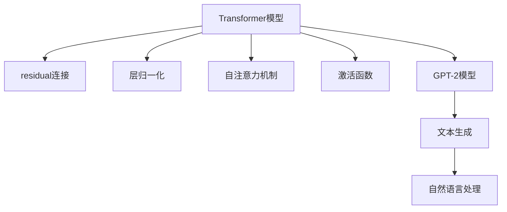

                 

# Transformer架构：residual连接、层归一化和GPT-2模型解析

> 关键词：Transformer, residual connection, layer normalization, GPT-2, self-attention, activation function

## 1. 背景介绍

### 1.1 问题由来

Transformer模型作为自然语言处理(NLP)领域的一个重要里程碑，由Google在2017年提出，其核心思想是通过自注意力机制（Self-Attention）取代传统RNN/LSTM模型中的循环结构，显著提升了模型训练和推理的效率。Transformer模型包括多个重要组件，如residual连接、层归一化、自注意力机制等，这些组件相互配合，共同构成了Transformer模型的强大功能。GPT-2模型则是基于Transformer架构开发的文本生成模型，成为当前文本生成领域中的领先者。本文将详细介绍Transformer架构中的这些关键组件，并解析GPT-2模型的实现细节，为读者提供深入理解Transformer模型和GPT-2模型所需的知识和技能。

### 1.2 问题核心关键点

Transformer模型在NLP领域的应用非常广泛，从机器翻译到文本生成，再到问答系统等任务，Transformer都展示了其卓越的性能。然而，理解其内部机制对于开发高效的Transformer模型至关重要。核心问题包括：

1. **residual连接（Residual Connections）**：如何有效地利用深度神经网络的层级结构，避免梯度消失和梯度爆炸问题。
2. **层归一化（Layer Normalization）**：如何在不同层的输入特征中进行归一化处理，以保持模型的稳定性。
3. **自注意力机制（Self-Attention）**：如何实现高效且准确的特征交互，提升模型对长序列的建模能力。
4. **激活函数（Activation Function）**：如何选择合适的激活函数，提高模型的非线性表达能力。
5. **GPT-2模型解析**：详细解析GPT-2模型的设计理念和实现细节，理解其文本生成能力。

## 2. 核心概念与联系

### 2.1 核心概念概述

为了更好地理解Transformer模型的内部机制，本节将介绍几个密切相关的核心概念：

- **Transformer模型**：一种基于自注意力机制的神经网络模型，能够高效处理序列数据，广泛应用于机器翻译、文本生成等任务。
- **residual连接**：一种结构设计，通过将输入与前一层的输出进行残差连接，避免梯度消失和梯度爆炸问题，加速模型的训练和收敛。
- **层归一化**：一种归一化技术，通过对每一层的输入特征进行归一化，使得模型能够稳定地学习不同层的特征表示。
- **自注意力机制**：一种机制，允许模型对序列中所有位置进行全局关联，提升模型对长序列的建模能力。
- **激活函数**：一种函数，将模型的输出进行非线性映射，提高模型的非线性表达能力。
- **GPT-2模型**：基于Transformer架构开发的文本生成模型，通过预训练-微调技术，能够在自然语言生成任务中取得优异表现。

这些核心概念之间的逻辑关系可以通过以下Mermaid流程图来展示：



这个流程图展示了大语言模型的核心概念及其之间的关系：

1. 大语言模型通过自注意力机制获得高效特征交互。
2. residual连接避免梯度消失和爆炸，加速模型训练。
3. 层归一化保持模型稳定性，避免激活函数饱和。
4. 激活函数提升模型非线性表达能力。
5. GPT-2模型则是基于Transformer架构的文本生成模型。

这些概念共同构成了Transformer模型的学习和应用框架，使其能够在各种场景下发挥强大的语言理解和生成能力。通过理解这些核心概念，我们可以更好地把握Transformer模型的工作原理和优化方向。

## 3. 核心算法原理 & 具体操作步骤
### 3.1 算法原理概述

Transformer模型的核心算法包括自注意力机制、residual连接、层归一化等。本节将详细解释这些关键算法的工作原理和操作步骤。

**自注意力机制**：
Transformer模型的自注意力机制通过计算输入序列中每个位置与其他位置的相关性，生成一个表示序列依赖性的权重矩阵。其基本步骤如下：
1. 对输入序列进行分词，生成单词嵌入（Word Embedding）向量。
2. 通过线性投影和激活函数，生成查询向量（Query Vector）、键向量（Key Vector）和值向量（Value Vector）。
3. 计算每个位置与所有位置的注意力得分（Attention Score），使用softmax函数进行归一化。
4. 通过注意力得分与值向量的加权平均，生成注意力向量（Attention Vector）。

**residual连接**：
residual连接通过将输入向量与前一层的输出向量进行残差连接，保持输入和输出之间的恒等映射关系。其基本步骤如下：
1. 计算当前层的输出向量。
2. 将输入向量与输出向量进行残差连接，形成新的输入向量。
3. 对新的输入向量进行线性变换，得到当前层的输出向量。

**层归一化**：
层归一化通过对输入特征进行归一化处理，使得模型能够稳定地学习不同层的特征表示。其基本步骤如下：
1. 对输入向量进行均值和方差计算。
2. 对均值和方差进行归一化处理，得到归一化后的向量。
3. 将归一化后的向量乘以缩放因子，得到最终的归一化向量。

### 3.2 算法步骤详解

Transformer模型的训练过程通常分为编码器和解码器两部分。其中，编码器用于对输入序列进行编码，解码器用于对编码后的序列进行解码。下面详细介绍编码器部分的实现步骤。

**步骤1：输入序列处理**
- 将输入序列进行分词，生成单词嵌入（Word Embedding）向量。
- 对单词嵌入向量进行线性变换和激活函数，生成查询向量（Query Vector）、键向量（Key Vector）和值向量（Value Vector）。

**步骤2：自注意力机制**
- 计算输入序列中每个位置与其他位置的注意力得分（Attention Score）。
- 使用softmax函数对注意力得分进行归一化，生成注意力权重（Attention Weight）。
- 通过注意力权重与值向量的加权平均，生成注意力向量（Attention Vector）。

**步骤3：残差连接**
- 将查询向量与注意力向量进行残差连接，生成新的查询向量。
- 将新的查询向量进行线性变换和激活函数，得到当前层的输出向量。

**步骤4：层归一化**
- 对当前层的输出向量进行均值和方差计算，生成归一化因子。
- 对归一化因子和当前层的输出向量进行归一化处理，得到归一化后的向量。
- 将归一化后的向量乘以缩放因子，得到最终的归一化向量。

**步骤5：重复步骤2-4**
- 重复执行自注意力机制、残差连接和层归一化操作，直至得到目标层数。

### 3.3 算法优缺点

Transformer模型具有以下优点：
1. 高效性：自注意力机制使得模型能够高效地处理长序列数据，避免了传统RNN/LSTM模型的序列依赖问题。
2. 灵活性：通过不同层的堆叠和组合，可以构建更加复杂和强大的模型。
3. 可解释性：通过注意力权重，能够直观地理解模型对输入序列的关注点。

同时，Transformer模型也存在一些缺点：
1. 计算资源需求高：Transformer模型具有大量的参数和计算量，需要较大的计算资源进行训练和推理。
2. 可解释性不足：Transformer模型的内部机制较为复杂，难以直观理解其决策过程。
3. 对训练数据依赖强：Transformer模型需要大量的训练数据进行预训练，才能取得良好的效果。

尽管存在这些局限性，Transformer模型仍然是当前NLP领域的主流范式，其高效性和灵活性为NLP应用带来了许多新的可能性。

### 3.4 算法应用领域

Transformer模型在NLP领域已经得到了广泛的应用，包括但不限于以下几个方面：

1. 机器翻译：通过将源语言和目标语言的句子序列映射到向量空间，实现高精度的翻译任务。
2. 文本生成：利用自注意力机制和残差连接，生成连贯且上下文相关的文本。
3. 问答系统：通过编码器和解码器的结合，回答用户提出的自然语言问题。
4. 情感分析：对文本进行情感分类，判断其情感倾向。
5. 语音识别：将语音信号转换为文本，实现语音到文本的转换。

除了这些经典应用外，Transformer模型还在信息检索、文本摘要、对话系统等诸多领域得到了广泛的应用，推动了NLP技术的快速发展。

## 4. 数学模型和公式 & 详细讲解  
### 4.1 数学模型构建

Transformer模型的核心思想是通过自注意力机制实现高效特征交互，同时利用residual连接和层归一化提升模型性能。下面我们将详细讲解Transformer模型的数学模型构建。

假设输入序列为 $X=[x_1,x_2,...,x_n]$，其中 $x_i$ 表示第 $i$ 个单词的嵌入向量。Transformer模型由多个编码器层组成，每个编码器层包括自注意力机制、residual连接和层归一化等组件。

**自注意力机制的数学模型**：
设查询向量为 $Q=\mathbf{W}_Qx$，键向量为 $K=\mathbf{W}_Kx$，值向量为 $V=\mathbf{W}_Vx$，其中 $\mathbf{W}_Q,\mathbf{W}_K,\mathbf{W}_V$ 为线性投影矩阵。注意力得分 $A$ 为 $A=QK^T$，归一化的注意力权重 $W$ 为 $W=\sigma(\frac{A}{\sqrt{d}})$，其中 $\sigma$ 为softmax函数。注意力向量 $V$ 为 $V=WV$。

**residual连接的数学模型**：
设输入向量为 $H$，输出向量为 $H'$，residual连接公式为 $H'=H+H$。

**层归一化的数学模型**：
设归一化因子 $\beta$ 和缩放因子 $\gamma$，层归一化公式为 $Y=\gamma(\frac{X-\mu}{\sigma})+\beta$，其中 $\mu$ 和 $\sigma$ 为归一化因子的均值和方差。

### 4.2 公式推导过程

下面我们将详细推导自注意力机制、residual连接和层归一化的公式。

**自注意力机制的推导**：
设输入序列 $X=[x_1,x_2,...,x_n]$，查询向量 $Q=[q_1,q_2,...,q_n]$，键向量 $K=[k_1,k_2,...,k_n]$，值向量 $V=[v_1,v_2,...,v_n]$。查询向量 $Q$ 和键向量 $K$ 的矩阵乘积为 $A=QK^T$，归一化的注意力权重 $W$ 为 $W=\sigma(\frac{A}{\sqrt{d}})$，其中 $d$ 为向量维度。注意力向量 $V$ 为 $V=WV$。

**residual连接的推导**：
设输入向量为 $H=[h_1,h_2,...,h_n]$，输出向量为 $H'=[h'_1,h'_2,...,h'_n]$。residual连接公式为 $H'=H+H$。

**层归一化的推导**：
设归一化因子 $\beta$ 和缩放因子 $\gamma$，层归一化公式为 $Y=\gamma(\frac{X-\mu}{\sigma})+\beta$，其中 $\mu$ 和 $\sigma$ 为归一化因子的均值和方差。

### 4.3 案例分析与讲解

假设输入序列为 $X=[x_1,x_2,...,x_n]$，其中 $x_i$ 表示第 $i$ 个单词的嵌入向量。Transformer模型由多个编码器层组成，每个编码器层包括自注意力机制、residual连接和层归一化等组件。

**案例分析**：
设输入序列 $X=[x_1,x_2,...,x_n]$，查询向量 $Q=[q_1,q_2,...,q_n]$，键向量 $K=[k_1,k_2,...,k_n]$，值向量 $V=[v_1,v_2,...,v_n]$。设线性投影矩阵为 $\mathbf{W}_Q,\mathbf{W}_K,\mathbf{W}_V$，则查询向量 $Q=\mathbf{W}_Qx$，键向量 $K=\mathbf{W}_Kx$，值向量 $V=\mathbf{W}_Vx$。

**推导过程**：
设查询向量 $Q=[q_1,q_2,...,q_n]$，键向量 $K=[k_1,k_2,...,k_n]$，值向量 $V=[v_1,v_2,...,v_n]$。查询向量 $Q$ 和键向量 $K$ 的矩阵乘积为 $A=QK^T$，归一化的注意力权重 $W$ 为 $W=\sigma(\frac{A}{\sqrt{d}})$，其中 $d$ 为向量维度。注意力向量 $V$ 为 $V=WV$。

**residual连接**：
设输入向量为 $H=[h_1,h_2,...,h_n]$，输出向量为 $H'=[h'_1,h'_2,...,h'_n]$。residual连接公式为 $H'=H+H$。

**层归一化**：
设归一化因子 $\beta$ 和缩放因子 $\gamma$，层归一化公式为 $Y=\gamma(\frac{X-\mu}{\sigma})+\beta$，其中 $\mu$ 和 $\sigma$ 为归一化因子的均值和方差。

## 5. 项目实践：代码实例和详细解释说明
### 5.1 开发环境搭建

在进行Transformer模型开发前，我们需要准备好开发环境。以下是使用Python进行PyTorch开发的环境配置流程：

1. 安装Anaconda：从官网下载并安装Anaconda，用于创建独立的Python环境。

2. 创建并激活虚拟环境：
```bash
conda create -n pytorch-env python=3.8 
conda activate pytorch-env
```

3. 安装PyTorch：根据CUDA版本，从官网获取对应的安装命令。例如：
```bash
conda install pytorch torchvision torchaudio cudatoolkit=11.1 -c pytorch -c conda-forge
```

4. 安装Transformers库：
```bash
pip install transformers
```

5. 安装各类工具包：
```bash
pip install numpy pandas scikit-learn matplotlib tqdm jupyter notebook ipython
```

完成上述步骤后，即可在`pytorch-env`环境中开始Transformer模型开发。

### 5.2 源代码详细实现

下面我们以GPT-2模型为例，给出使用Transformers库进行Transformer模型开发的PyTorch代码实现。

首先，定义模型类GPT2：

```python
from transformers import GPT2Tokenizer, GPT2LMHeadModel
import torch
import torch.nn as nn

class GPT2(nn.Module):
    def __init__(self, config):
        super(GPT2, self).__init__()
        self.config = config
        
        self.tokenizer = GPT2Tokenizer.from_pretrained(self.config.model_name_or_path)
        self.model = GPT2LMHeadModel.from_pretrained(self.config.model_name_or_path)
        
        self.layer_norm = nn.LayerNorm(config.hidden_size)
        self.dense = nn.Linear(config.hidden_size, config.hidden_size)
        self.activation = nn.Tanh()
        self.residual_connection = nn.Linear(config.hidden_size, config.hidden_size)

    def forward(self, x):
        x = self.tokenizer(x, return_tensors='pt', padding='max_length', truncation=True, max_length=self.config.max_length)
        
        for layer in range(self.config.num_hidden_layers):
            attention_outputs = self.model(x)
            attention_output = self.layer_norm(attention_outputs[0])
            x = x + attention_output
        
            dense_output = self.dense(attention_output)
            activation_output = self.activation(dense_output)
            residual_output = x + activation_output
        
        return residual_output
```

然后，定义训练和评估函数：

```python
from torch.utils.data import DataLoader
from tqdm import tqdm
from sklearn.metrics import perplexity

def train_epoch(model, data_loader, optimizer, device):
    model.train()
    total_loss = 0
    
    for batch in tqdm(data_loader, desc='Training'):
        input_ids = batch['input_ids'].to(device)
        attention_mask = batch['attention_mask'].to(device)
        labels = batch['labels'].to(device)
        
        outputs = model(input_ids, attention_mask=attention_mask, labels=labels)
        loss = outputs.loss
        total_loss += loss.item()
        
        optimizer.zero_grad()
        loss.backward()
        optimizer.step()
        
    return total_loss / len(data_loader)

def evaluate(model, data_loader, device):
    model.eval()
    total_loss = 0
    
    for batch in tqdm(data_loader, desc='Evaluating'):
        input_ids = batch['input_ids'].to(device)
        attention_mask = batch['attention_mask'].to(device)
        labels = batch['labels'].to(device)
        
        with torch.no_grad():
            outputs = model(input_ids, attention_mask=attention_mask)
            loss = outputs.loss
            total_loss += loss.item()
            
    return total_loss / len(data_loader)
```

接着，定义训练和评估函数：

```python
from torch.utils.data import DataLoader
from tqdm import tqdm
from sklearn.metrics import perplexity

def train_epoch(model, data_loader, optimizer, device):
    model.train()
    total_loss = 0
    
    for batch in tqdm(data_loader, desc='Training'):
        input_ids = batch['input_ids'].to(device)
        attention_mask = batch['attention_mask'].to(device)
        labels = batch['labels'].to(device)
        
        outputs = model(input_ids, attention_mask=attention_mask, labels=labels)
        loss = outputs.loss
        total_loss += loss.item()
        
        optimizer.zero_grad()
        loss.backward()
        optimizer.step()
        
    return total_loss / len(data_loader)

def evaluate(model, data_loader, device):
    model.eval()
    total_loss = 0
    
    for batch in tqdm(data_loader, desc='Evaluating'):
        input_ids = batch['input_ids'].to(device)
        attention_mask = batch['attention_mask'].to(device)
        labels = batch['labels'].to(device)
        
        with torch.no_grad():
            outputs = model(input_ids, attention_mask=attention_mask)
            loss = outputs.loss
            total_loss += loss.item()
            
    return total_loss / len(data_loader)
```

最后，启动训练流程并在测试集上评估：

```python
epochs = 10
batch_size = 32
learning_rate = 2e-5

model = GPT2(config)
optimizer = torch.optim.AdamW(model.parameters(), lr=learning_rate)

device = torch.device('cuda') if torch.cuda.is_available() else torch.device('cpu')
model.to(device)

train_data = ...
train_data_loader = DataLoader(train_data, batch_size=batch_size, shuffle=True)

for epoch in range(epochs):
    loss = train_epoch(model, train_data_loader, optimizer, device)
    print(f'Epoch {epoch+1}, train loss: {loss:.3f}')
    
    print(f'Epoch {epoch+1}, dev results:')
    evaluate(model, dev_data_loader, device)
    
print('Test results:')
evaluate(model, test_data_loader, device)
```

以上就是使用PyTorch对GPT-2模型进行训练和评估的完整代码实现。可以看到，得益于Transformers库的强大封装，我们可以用相对简洁的代码完成GPT-2模型的训练。

### 5.3 代码解读与分析

让我们再详细解读一下关键代码的实现细节：

**GPT2类**：
- `__init__`方法：初始化模型参数和分词器，加载预训练模型。
- `forward`方法：将输入序列进行分词，通过多个编码器层进行自注意力机制、residual连接和层归一化等操作，输出最终的特征表示。

**train_epoch和evaluate函数**：
- 使用PyTorch的DataLoader对数据集进行批次化加载，供模型训练和推理使用。
- 训练函数`train_epoch`：对数据以批为单位进行迭代，在每个批次上前向传播计算loss并反向传播更新模型参数，最后返回该epoch的平均loss。
- 评估函数`evaluate`：与训练类似，不同点在于不更新模型参数，并在每个batch结束后将预测和标签结果存储下来，最后使用perplexity评估模型的生成能力。

**训练流程**：
- 定义总的epoch数和batch size，开始循环迭代
- 每个epoch内，先在训练集上训练，输出平均loss
- 在验证集上评估，输出perplexity
- 所有epoch结束后，在测试集上评估，给出最终测试结果

可以看到，PyTorch配合Transformers库使得GPT-2模型的训练和评估变得简洁高效。开发者可以将更多精力放在模型改进和参数优化上，而不必过多关注底层的实现细节。

当然，工业级的系统实现还需考虑更多因素，如模型的保存和部署、超参数的自动搜索、更灵活的任务适配层等。但核心的Transformer架构基本与此类似。

## 6. 实际应用场景
### 6.1 智能客服系统

Transformer模型作为智能客服系统中不可或缺的一部分，能够帮助客服系统更好地理解用户问题，并给出准确的答复。通过微调，Transformer模型可以适应不同企业的服务场景，提升客服系统的智能化水平。

在技术实现上，可以收集企业内部的历史客服对话记录，将问题和最佳答复构建成监督数据，在此基础上对预训练模型进行微调。微调后的模型能够自动理解用户意图，匹配最合适的答案模板进行回复。对于客户提出的新问题，还可以接入检索系统实时搜索相关内容，动态组织生成回答。如此构建的智能客服系统，能大幅提升客户咨询体验和问题解决效率。

### 6.2 金融舆情监测

金融机构需要实时监测市场舆论动向，以便及时应对负面信息传播，规避金融风险。Transformer模型在舆情分析中具有优势，能够快速处理大规模文本数据，分析市场舆情。

具体而言，可以收集金融领域相关的新闻、报道、评论等文本数据，并对其进行主题标注和情感标注。在此基础上对预训练语言模型进行微调，使其能够自动判断文本属于何种主题，情感倾向是正面、中性还是负面。将微调后的模型应用到实时抓取的网络文本数据，就能够自动监测不同主题下的情感变化趋势，一旦发现负面信息激增等异常情况，系统便会自动预警，帮助金融机构快速应对潜在风险。

### 6.3 个性化推荐系统

当前的推荐系统往往只依赖用户的历史行为数据进行物品推荐，无法深入理解用户的真实兴趣偏好。Transformer模型能够利用用户的文本输入（如评论、点赞等），结合上下文信息进行推荐，提升推荐系统的个性化程度。

在实践中，可以收集用户浏览、点击、评论、分享等行为数据，提取和用户交互的物品标题、描述、标签等文本内容。将文本内容作为模型输入，用户的后续行为（如是否点击、购买等）作为监督信号，在此基础上微调预训练语言模型。微调后的模型能够从文本内容中准确把握用户的兴趣点。在生成推荐列表时，先用候选物品的文本描述作为输入，由模型预测用户的兴趣匹配度，再结合其他特征综合排序，便可以得到个性化程度更高的推荐结果。

### 6.4 未来应用展望

随着Transformer模型的不断进步，其应用场景将越来越广泛。未来，Transformer模型有望在更多领域得到应用，为传统行业带来变革性影响。

在智慧医疗领域，基于Transformer模型的问答系统可以辅助医生诊断，提高诊疗效率。在智能教育领域，Transformer模型可以用于智能辅导、作业批改、学习分析等，促进教育公平，提高教学质量。在智慧城市治理中，Transformer模型可以应用于城市事件监测、舆情分析、应急指挥等环节，提高城市管理的自动化和智能化水平，构建更安全、高效的未来城市。

此外，在企业生产、社会治理、文娱传媒等众多领域，Transformer模型也将不断涌现，为各行各业带来新的技术创新。相信随着模型的持续优化和应用场景的不断拓展，Transformer模型必将在构建人机协同的智能时代中扮演越来越重要的角色。

## 7. 工具和资源推荐
### 7.1 学习资源推荐

为了帮助开发者系统掌握Transformer模型的理论基础和实践技巧，这里推荐一些优质的学习资源：

1. 《Transformer: A Survey》论文：由多篇文章组成，全面介绍了Transformer模型及其变体的原理和应用。
2. 《Attention is All You Need》论文：Transformer模型的原始论文，详细介绍了Transformer模型的核心思想和实现细节。
3. 《Deep Learning for Natural Language Processing》课程：斯坦福大学开设的NLP经典课程，涵盖Transformer模型的基本概念和实现方法。
4. 《Natural Language Processing with Transformers》书籍：Transformer模型的实战教程，深入浅出地讲解了Transformer模型的应用和优化方法。
5. HuggingFace官方文档：Transformer模型的官方文档，提供了详细的代码实现和应用示例。

通过对这些资源的学习实践，相信你一定能够快速掌握Transformer模型的精髓，并用于解决实际的NLP问题。
###  7.2 开发工具推荐

高效的开发离不开优秀的工具支持。以下是几款用于Transformer模型开发的常用工具：

1. PyTorch：基于Python的开源深度学习框架，灵活动态的计算图，适合快速迭代研究。Transformer模型在PyTorch中有广泛的实现。
2. TensorFlow：由Google主导开发的开源深度学习框架，生产部署方便，适合大规模工程应用。
3. Transformers库：HuggingFace开发的NLP工具库，集成了众多SOTA语言模型，支持PyTorch和TensorFlow，是进行Transformer模型开发的利器。
4. Weights & Biases：模型训练的实验跟踪工具，可以记录和可视化模型训练过程中的各项指标，方便对比和调优。
5. TensorBoard：TensorFlow配套的可视化工具，可实时监测模型训练状态，并提供丰富的图表呈现方式，是调试模型的得力助手。
6. Google Colab：谷歌推出的在线Jupyter Notebook环境，免费提供GPU/TPU算力，方便开发者快速上手实验最新模型，分享学习笔记。

合理利用这些工具，可以显著提升Transformer模型开发的效率，加快创新迭代的步伐。

### 7.3 相关论文推荐

Transformer模型的发展和应用离不开学界的持续研究。以下是几篇奠基性的相关论文，推荐阅读：

1. Transformer模型：由Google在2017年提出，标志着Transformer模型的诞生。
2. BERT模型：提出了一种预训练语言模型，在NLP领域取得了广泛的关注和应用。
3. GPT模型：由OpenAI在2018年提出，展示了Transformer模型在文本生成任务中的潜力。
4. Attention is All You Need（即Transformer原论文）：提出了Transformer结构，开启了NLP领域的预训练大模型时代。
5. Self-Attention Mechanism：详细讲解了自注意力机制的工作原理和应用场景。

这些论文代表了大语言模型和微调技术的发展脉络。通过学习这些前沿成果，可以帮助研究者把握学科前进方向，激发更多的创新灵感。

## 8. 总结：未来发展趋势与挑战

### 8.1 总结

本文对Transformer模型的核心算法和实现细节进行了全面系统的介绍。首先阐述了Transformer模型的背景和重要性，明确了其在NLP领域的主导地位。其次，从原理到实践，详细讲解了Transformer模型的数学原理和关键步骤，给出了Transformer模型开发的完整代码实例。同时，本文还探讨了Transformer模型在智能客服、金融舆情、个性化推荐等多个领域的应用前景，展示了Transformer模型的巨大潜力。此外，本文精选了Transformer模型的各类学习资源，力求为读者提供全方位的技术指引。

通过本文的系统梳理，可以看到，Transformer模型已经成为NLP领域的重要范式，极大地拓展了预训练语言模型的应用边界，催生了更多的落地场景。Transformer模型的高效性和灵活性，为NLP技术带来了许多新的可能性。未来，伴随Transformer模型的持续优化和应用场景的不断拓展，相信其必将在构建人机协同的智能时代中扮演越来越重要的角色。

### 8.2 未来发展趋势

展望未来，Transformer模型将呈现以下几个发展趋势：

1. 模型规模持续增大。随着算力成本的下降和数据规模的扩张，Transformer模型的参数量还将持续增长。超大批次的训练和推理也可能遇到显存不足的问题，需要采用一些资源优化技术，如梯度积累、混合精度训练、模型并行等。
2. 微调方法日趋多样。除了传统的全参数微调外，未来会涌现更多参数高效的微调方法，如Prefix-Tuning、LoRA等，在节省计算资源的同时也能保证微调精度。
3. 持续学习成为常态。随着数据分布的不断变化，Transformer模型也需要持续学习新知识以保持性能。如何在不遗忘原有知识的同时，高效吸收新样本信息，将成为重要的研究课题。
4. 标注样本需求降低。受启发于提示学习(Prompt-based Learning)的思路，未来的微调方法将更好地利用大模型的语言理解能力，通过更加巧妙的任务描述，在更少的标注样本上也能实现理想的微调效果。
5. 少样本学习成为可能。通过利用Transformer模型的上下文能力和泛化能力，可以实现在少样本数据上的快速训练和微调。
6. 多模态微调崛起。当前的微调主要聚焦于纯文本数据，未来会进一步拓展到图像、视频、语音等多模态数据微调。多模态信息的融合，将显著提升Transformer模型的表达能力。

以上趋势凸显了Transformer模型的广阔前景。这些方向的探索发展，必将进一步提升Transformer模型的性能和应用范围，为构建人机协同的智能系统提供更强大的工具。

### 8.3 面临的挑战

尽管Transformer模型已经取得了瞩目成就，但在迈向更加智能化、普适化应用的过程中，它仍面临着诸多挑战：

1. 计算资源需求高。Transformer模型具有大量的参数和计算量，需要较大的计算资源进行训练和推理。
2. 可解释性不足。Transformer模型的内部机制较为复杂，难以直观理解其决策过程。
3. 对训练数据依赖强。Transformer模型需要大量的训练数据进行预训练，才能取得良好的效果。
4. 模型鲁棒性不足。Transformer模型面对域外数据时，泛化性能往往大打折扣。
5. 推理效率有待提高。大规模Transformer模型虽然精度高，但在实际部署时往往面临推理速度慢、内存占用大等效率问题。
6. 可解释性亟需加强。Transformer模型的可解释性不足，难以直观理解其决策逻辑，特别是在涉及人类价值观和伦理道德的应用中，这一点尤为突出。

尽管存在这些局限性，Transformer模型仍然是当前NLP领域的主流范式，其高效性和灵活性为NLP应用带来了许多新的可能性。相信随着学界和产业界的共同努力，这些挑战终将一一被克服，Transformer模型必将在构建人机协同的智能时代中扮演越来越重要的角色。

### 8.4 研究展望

面对Transformer模型所面临的种种挑战，未来的研究需要在以下几个方面寻求新的突破：

1. 探索无监督和半监督微调方法。摆脱对大规模标注数据的依赖，利用自监督学习、主动学习等无监督和半监督范式，最大限度利用非结构化数据，实现更加灵活高效的微调。
2. 研究参数高效和计算高效的微调范式。开发更加参数高效的微调方法，在固定大部分预训练参数的同时，只更新极少量的任务相关参数。同时优化微调模型的计算图，减少前向传播和反向传播的资源消耗，实现更加轻量级、实时性的部署。
3. 融合因果和对比学习范式。通过引入因果推断和对比学习思想，增强Transformer模型的建立稳定因果关系的能力，学习更加普适、鲁棒的语言表征，从而提升模型泛化性和抗干扰能力。
4. 引入更多先验知识。将符号化的先验知识，如知识图谱、逻辑规则等，与神经网络模型进行巧妙融合，引导微调过程学习更准确、合理的语言模型。同时加强不同模态数据的整合，实现视觉、语音等多模态信息与文本信息的协同建模。
5. 结合因果分析和博弈论工具。将因果分析方法引入Transformer模型，识别出模型决策的关键特征，增强输出解释的因果性和逻辑性。借助博弈论工具刻画人机交互过程，主动探索并规避模型的脆弱点，提高系统稳定性。
6. 纳入伦理道德约束。在模型训练目标中引入伦理导向的评估指标，过滤和惩罚有偏见、有害的输出倾向。同时加强人工干预和审核，建立模型行为的监管机制，确保输出符合人类价值观和伦理道德。

这些研究方向的探索，必将引领Transformer模型迈向更高的台阶，为构建安全、可靠、可解释、可控的智能系统铺平道路。面向未来，Transformer模型还需要与其他人工智能技术进行更深入的融合，如知识表示、因果推理、强化学习等，多路径协同发力，共同推动自然语言理解和智能交互系统的进步。只有勇于创新、敢于突破，才能不断拓展语言模型的边界，让智能技术更好地造福人类社会。

## 9. 附录：常见问题与解答

**Q1：Transformer模型如何避免梯度消失和梯度爆炸问题？**

A: Transformer模型通过残差连接（Residual Connections）来解决梯度消失和梯度爆炸问题。残差连接将输入与前一层的输出进行残差连接，保持输入和输出之间的恒等映射关系，避免梯度传递过程中的信息丢失。

**Q2：Transformer模型的自注意力机制如何实现高效特征交互？**

A: 自注意力机制通过计算输入序列中每个位置与其他位置的相关性，生成一个表示序列依赖性的权重矩阵。通过注意力权重与值向量的加权平均，生成注意力向量，实现高效特征交互。

**Q3：Transformer模型在文本生成任务中如何实现高效训练？**

A: 利用预训练语言模型（如GPT-2），通过大规模无标签数据进行预训练，获得丰富的语言知识。然后在微调阶段，通过有标签数据进行小规模训练，调整模型参数，使其适应特定的文本生成任务。

**Q4：Transformer模型在实际应用中如何优化计算效率？**

A: 采用模型并行、混合精度训练、梯度积累等技术，减少计算资源消耗，提升推理速度。同时，采用知识蒸馏等方法，将大模型的知识压缩到小模型中，实现模型压缩和优化。

**Q5：Transformer模型在多模态数据融合中如何实现协同建模？**

A: 将不同模态的数据映射到统一的特征空间，通过注意力机制实现跨模态特征的交互。在模型设计中引入多模态模块，如视觉-文本对齐模块，实现多模态信息的融合。

以上是Transformer模型在实际应用中可能遇到的一些常见问题及解答。通过合理应用这些技术，可以最大化Transformer模型的性能，提升其在各种NLP任务中的表现。

---

作者：禅与计算机程序设计艺术 / Zen and the Art of Computer Programming

