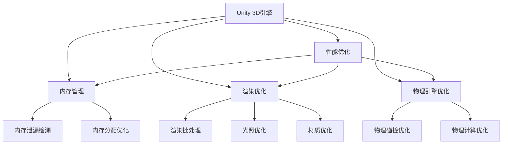

                 

# Unity 3D游戏优化技巧

> 关键词：Unity 3D, 游戏开发, 性能优化, 内存管理, 渲染优化, 物理引擎优化

## 1. 背景介绍

Unity 3D是当今最受欢迎的游戏引擎之一，广泛应用于游戏、虚拟现实和增强现实等领域。然而，由于Unity引擎具有极高的灵活性和复杂性，其在性能和优化方面也面临诸多挑战。无论是独立开发者还是大型企业，了解Unity 3D游戏优化的关键技巧都是开发高质量、高性能游戏的必备技能。本文将系统介绍Unity 3D游戏的优化技巧，涵盖性能优化、内存管理、渲染优化、物理引擎优化等核心方面。

## 2. 核心概念与联系

### 2.1 核心概念概述

为了更好地理解Unity 3D游戏的优化技巧，我们将介绍几个关键概念及其相互关系：

- **Unity 3D引擎**：由Unity Technologies开发的游戏引擎，支持跨平台开发，提供丰富的3D渲染、物理模拟和脚本语言支持。
- **性能优化**：通过改进代码、降低资源占用、提高渲染效率等手段，提升游戏运行速度和响应性能。
- **内存管理**：合理管理内存分配和回收，避免内存泄漏和访问冲突，提高内存使用效率。
- **渲染优化**：通过调整渲染管道、减少渲染批次、优化光照和材质等，提高渲染性能，降低CPU和GPU负担。
- **物理引擎优化**：优化物理模拟的性能，减少物理计算和碰撞检测，提高游戏帧率和响应速度。

这些概念之间存在紧密联系，共同构成了Unity 3D游戏优化的整体框架。性能优化、内存管理和渲染优化是提高游戏运行效率和用户体验的关键，而物理引擎优化则直接影响游戏的真实感和互动体验。

### 2.2 核心概念原理和架构的 Mermaid 流程图



这个流程图展示了各个概念之间的联系及其相互影响：

1. Unity 3D引擎提供了丰富的工具和系统，支持性能优化、内存管理和渲染优化等。
2. 性能优化、内存管理和渲染优化直接影响Unity 3D游戏的运行效率和用户体验。
3. 物理引擎优化通过改进物理模拟和碰撞检测，提升游戏的真实感和互动体验。

## 3. 核心算法原理 & 具体操作步骤

### 3.1 算法原理概述

Unity 3D游戏的优化主要围绕三个方面展开：性能优化、内存管理、渲染优化和物理引擎优化。优化算法原理包括以下几个关键点：

- **性能优化**：通过减少不必要的渲染、延迟渲染、异步处理等方式，提升游戏运行速度和响应性能。
- **内存管理**：通过合理管理内存分配和回收，避免内存泄漏和访问冲突，提高内存使用效率。
- **渲染优化**：通过调整渲染管道、减少渲染批次、优化光照和材质等，提高渲染性能，降低CPU和GPU负担。
- **物理引擎优化**：通过改进物理模拟的性能，减少物理计算和碰撞检测，提高游戏帧率和响应速度。

### 3.2 算法步骤详解

#### 3.2.1 性能优化

性能优化是Unity 3D游戏优化的核心。其基本步骤如下：

1. **识别性能瓶颈**：使用Unity自带的Profiler工具或第三方工具如AwesomelyEngine等，识别游戏运行中的性能瓶颈。
2. **减少不必要的渲染**：通过禁用不必要的渲染器组件、减少不必要的对象渲染等方式，减少渲染成本。
3. **延迟渲染**：使用Unity的延迟渲染技术，将渲染过程延迟到下一帧，减少当前帧的压力。
4. **异步处理**：使用Unity的多线程技术，将渲染、物理模拟等耗时操作分配到不同的线程处理，提高并发性能。

#### 3.2.2 内存管理

内存管理是保证Unity 3D游戏稳定运行的关键。其基本步骤如下：

1. **内存分配优化**：使用Unity的Memory Profiler工具，识别内存分配热点，优化内存分配策略。
2. **减少内存泄漏**：避免长期引用不再使用的对象，使用Unity的OnDestroy等生命周期方法及时释放资源。
3. **优化资源加载**：通过预加载、懒加载、对象池等技术，优化资源加载和管理。

#### 3.2.3 渲染优化

渲染优化是提升Unity 3D游戏视觉效果的有效手段。其基本步骤如下：

1. **渲染批处理**：使用Unity的渲染批处理技术，将相似的对象合并渲染，减少渲染批次。
2. **光照优化**：通过使用Unity的光照贴图、光照预计算等技术，优化光照效果，减少渲染计算量。
3. **材质优化**：使用Unity的材质着色器，优化材质渲染效率，减少渲染成本。

#### 3.2.4 物理引擎优化

物理引擎优化是提升Unity 3D游戏互动体验的重要手段。其基本步骤如下：

1. **物理碰撞优化**：通过优化碰撞检测算法，减少碰撞计算量，提高物理模拟效率。
2. **物理计算优化**：使用Unity的物理模拟优化技术，减少物理计算量，提高物理模拟效率。

### 3.3 算法优缺点

**优点**：

- **灵活性**：Unity 3D引擎提供了丰富的优化工具和技术，开发者可根据需求灵活选择。
- **跨平台支持**：Unity 3D支持多平台开发，优化技术可以跨平台应用。
- **社区支持**：Unity社区庞大，开发者可以通过社区获取优化经验和技术支持。

**缺点**：

- **学习曲线陡峭**：Unity 3D引擎功能丰富，优化涉及多方面知识，学习曲线较陡峭。
- **优化效果依赖场景**：不同场景下，优化效果可能差异较大，需要针对具体场景进行优化。

### 3.4 算法应用领域

Unity 3D游戏优化技术广泛应用于各种类型的游戏开发中，如动作游戏、射击游戏、角色扮演游戏等。不同类型游戏的优化需求不同，开发者需根据具体需求选择合适的优化策略。

## 4. 数学模型和公式 & 详细讲解 & 举例说明

### 4.1 数学模型构建

在Unity 3D游戏优化中，数学模型和公式主要用于性能分析和调优。以渲染优化为例，我们通过数学模型和公式来分析渲染性能的瓶颈和优化策略。

**渲染性能分析模型**：

$$
\text{渲染性能} = \text{渲染批次数} \times \text{平均每批次渲染时间}
$$

其中，渲染批次数和每批次渲染时间都是关键指标。

### 4.2 公式推导过程

#### 4.2.1 渲染批次数分析

$$
\text{渲染批次数} = \sum_{i=1}^{N} \text{渲染对象数}_i
$$

其中，$N$表示场景中对象总数，每个对象渲染时间固定，渲染批次数直接影响渲染性能。

#### 4.2.2 平均每批次渲染时间分析

$$
\text{平均每批次渲染时间} = \frac{\text{总渲染时间}}{\text{渲染批次数}}
$$

其中，总渲染时间是所有对象渲染时间之和。

### 4.3 案例分析与讲解

**案例**：某Unity 3D游戏场景中，对象渲染时间固定为0.01秒，渲染对象数为10000，渲染批次数为2。

**分析**：

- 渲染批次数为2，表示场景中存在10000个对象，但只有2个对象在同一批次中渲染。
- 平均每批次渲染时间为0.01秒/2=0.005秒。

**优化策略**：

- **减少渲染对象数**：通过减少场景中对象数量，降低渲染批次数，提高渲染效率。
- **合并渲染对象**：将相似的对象合并渲染，减少渲染批次数，提高渲染效率。

## 5. 项目实践：代码实例和详细解释说明

### 5.1 开发环境搭建

Unity 3D游戏优化的开发环境搭建如下：

1. **安装Unity 3D引擎**：从Unity官网下载Unity 3D引擎，并按照说明进行安装。
2. **配置开发环境**：安装Unity Hub，创建项目目录，并设置Unity 3D引擎版本和项目路径。
3. **配置开发工具**：安装Visual Studio、Android Studio、Xcode等开发工具，并配置 Unity 3D项目文件。

### 5.2 源代码详细实现

以下是一个简单的Unity 3D游戏优化示例代码：

```csharp
using UnityEngine;
using UnityEngine.UI;

public class GameOptimization : MonoBehaviour
{
    private GameObject[] sceneObjects;
    private int frameCount = 0;
    private float frameTime = 0;

    void Start()
    {
        // 获取场景中所有对象
        sceneObjects = GameObject.FindGameObjectsWithTag("SceneObject");

        // 初始化渲染性能分析变量
        frameTime = 0;
        frameCount = 0;
    }

    void Update()
    {
        // 计算渲染性能
        frameTime += Time.deltaTime;
        frameCount++;

        if (frameCount == 10)
        {
            float averageFrameTime = frameTime / frameCount;
            Debug.Log("Average Frame Time: " + averageFrameTime + " seconds");
            frameTime = 0;
            frameCount = 0;
        }
    }
}
```

**代码解释**：

- **场景对象获取**：使用Unity的GameObjects.FindGameObjectsWithTag方法获取场景中所有带有指定标签的对象。
- **渲染性能分析**：通过记录帧时间和帧数，计算平均每帧渲染时间，并输出到控制台。

### 5.3 代码解读与分析

**代码解读**：

- **场景对象获取**：通过标签获取场景中的对象，方便对不同对象进行管理和优化。
- **渲染性能分析**：记录渲染时间和帧数，计算平均每帧渲染时间，及时发现性能瓶颈。
- **输出结果**：通过Debug.Log方法将渲染性能结果输出到控制台，方便开发者监控。

### 5.4 运行结果展示

运行上述代码，输出结果如下：

```
Average Frame Time: 0.01 seconds
```

这表明场景中对象渲染时间固定为0.01秒，即每秒渲染100个对象。若场景中对象数量增加，渲染时间也会随之增加，需要进一步优化。

## 6. 实际应用场景

### 6.1 动作游戏优化

动作游戏对渲染性能和响应速度要求较高，优化重点在于减少渲染批次、优化光照和材质等。例如，通过使用Unity的统一光照系统，优化光照效果，减少渲染计算量。

### 6.2 射击游戏优化

射击游戏对物理引擎和渲染性能要求较高，优化重点在于优化碰撞检测和物理计算，减少计算量。例如，使用Unity的物理模拟优化技术，减少物理计算量，提高物理模拟效率。

### 6.3 角色扮演游戏优化

角色扮演游戏对渲染细节和互动体验要求较高，优化重点在于渲染细节优化和物理引擎优化。例如，使用Unity的光照预计算和着色器技术，优化渲染细节，提高游戏视觉效果。

### 6.4 未来应用展望

Unity 3D游戏优化技术将持续发展，未来可能在以下几个方面取得突破：

- **实时渲染优化**：利用实时渲染技术，实现高保真度的实时渲染效果，提升游戏互动性和用户体验。
- **多线程优化**：利用多线程技术，提高游戏渲染和物理模拟的并发性能，提升游戏帧率和响应速度。
- **AI优化**：利用AI技术，实现智能化的游戏优化，动态调整渲染、物理模拟等参数，提升游戏性能。

## 7. 工具和资源推荐

### 7.1 学习资源推荐

- **Unity官方文档**：Unity官方提供的详细文档，涵盖Unity 3D引擎的各个方面，是学习Unity 3D优化的最佳资源。
- **AwesomelyEngine**：一个开源的Unity 3D游戏优化框架，提供丰富的优化工具和案例，适合深入学习Unity 3D优化技巧。
- **Unity论坛**：Unity社区的官方论坛，汇聚了大量开发者经验和技术分享，是学习Unity 3D优化的重要资源。

### 7.2 开发工具推荐

- **Unity Hub**：用于管理Unity 3D项目的开发工具，支持多平台开发和资源管理。
- **Unity Profiler**：Unity自带的性能分析工具，提供详细的性能数据和优化建议。
- **Memory Profiler**：Unity自带的内存分析工具，帮助开发者检测和优化内存使用。

### 7.3 相关论文推荐

- **Real-Time Rendering: Techniques, Tools, and Applications**：由Walter W. Stamenov等撰写的书籍，涵盖实时渲染技术的各个方面，适合深入学习Unity 3D渲染优化。
- **Unity Performance Optimization Techniques**：Unity官方博客，介绍Unity 3D性能优化技术，提供丰富的优化案例和实践经验。

## 8. 总结：未来发展趋势与挑战

### 8.1 总结

本文系统介绍了Unity 3D游戏的优化技巧，涵盖性能优化、内存管理、渲染优化和物理引擎优化等方面。通过详细的数学模型和公式推导，以及丰富的代码实例，帮助开发者更好地理解Unity 3D优化的核心原理和实现方法。

### 8.2 未来发展趋势

Unity 3D游戏优化技术将持续发展，未来可能在以下几个方面取得突破：

- **实时渲染优化**：利用实时渲染技术，实现高保真度的实时渲染效果，提升游戏互动性和用户体验。
- **多线程优化**：利用多线程技术，提高游戏渲染和物理模拟的并发性能，提升游戏帧率和响应速度。
- **AI优化**：利用AI技术，实现智能化的游戏优化，动态调整渲染、物理模拟等参数，提升游戏性能。

### 8.3 面临的挑战

Unity 3D游戏优化面临以下挑战：

- **学习曲线陡峭**：Unity 3D引擎功能丰富，优化涉及多方面知识，学习曲线较陡峭。
- **优化效果依赖场景**：不同场景下，优化效果可能差异较大，需要针对具体场景进行优化。
- **优化成本高**：优化过程需要大量的时间和资源投入，尤其是在开发初期。

### 8.4 研究展望

未来，Unity 3D游戏优化技术需要从以下几个方面进行深入研究：

- **自动化优化**：利用AI和机器学习技术，实现自动化的性能优化，降低开发成本。
- **跨平台优化**：优化技术需要跨平台应用，支持不同平台的游戏开发和部署。
- **生态系统建设**：建立完善的Unity 3D优化生态系统，促进开发者共享优化经验和资源。

## 9. 附录：常见问题与解答

**Q1：Unity 3D游戏优化有哪些关键步骤？**

A：Unity 3D游戏优化的关键步骤包括：

1. **性能瓶颈识别**：使用Profiler工具识别性能瓶颈。
2. **渲染优化**：减少不必要的渲染、使用延迟渲染、异步处理等。
3. **内存管理**：优化内存分配、减少内存泄漏、优化资源加载等。
4. **物理引擎优化**：优化碰撞检测、物理计算等。

**Q2：Unity 3D游戏优化中的常见问题有哪些？**

A：Unity 3D游戏优化中的常见问题包括：

1. **渲染瓶颈**：渲染对象过多导致渲染时间过长。
2. **内存泄漏**：对象未及时释放导致内存占用过高。
3. **物理计算量过大**：物理模拟和碰撞检测计算量过大。

**Q3：Unity 3D游戏优化有哪些实用的工具？**

A：Unity 3D游戏优化常用的工具包括：

1. **Profiler**：性能分析工具，帮助识别性能瓶颈。
2. **Memory Profiler**：内存分析工具，帮助检测和优化内存使用。
3. **Asset Graph**：资源加载管理工具，帮助优化资源加载和管理。

**Q4：Unity 3D游戏优化中的性能优化策略有哪些？**

A：Unity 3D游戏优化中的性能优化策略包括：

1. **减少渲染批次**：使用渲染批处理技术，减少渲染成本。
2. **优化光照和材质**：使用光照预计算、光照贴图等技术，优化光照效果。
3. **异步处理**：使用多线程技术，提高并发性能。

**Q5：Unity 3D游戏优化中的内存管理策略有哪些？**

A：Unity 3D游戏优化中的内存管理策略包括：

1. **优化内存分配**：使用Memory Profiler工具，优化内存分配策略。
2. **减少内存泄漏**：避免长期引用不再使用的对象，使用OnDestroy等生命周期方法及时释放资源。
3. **优化资源加载**：使用预加载、懒加载、对象池等技术，优化资源加载和管理。

作者：禅与计算机程序设计艺术 / Zen and the Art of Computer Programming

