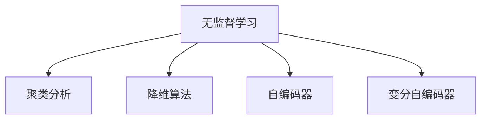

                 

# Unsupervised Learning 原理与代码实战案例讲解

> 关键词：无监督学习,聚类分析,降维算法,自编码器,特征提取,自动编码器,深度学习,代码实践,机器学习,数据处理

## 1. 背景介绍

### 1.1 问题由来
在机器学习领域，无监督学习（Unsupervised Learning）是一种不需要有标签数据进行训练的学习方法，其目标是直接从数据中学习到数据的潜在结构或分布。无监督学习广泛应用于数据降维、数据聚类、异常检测、生成模型等领域，是现代机器学习的重要组成部分。

近年来，随着深度学习技术的发展，基于神经网络的自编码器（Autoencoder）和变分自编码器（Variational Autoencoder, VAE）等模型在无监督学习中表现出色，成为无监督学习的主流方法之一。这些模型不仅能够高效处理大数据，还能通过复杂的层次化特征提取，捕捉数据中的高阶结构。

无监督学习的应用场景广泛，例如在自然语言处理中，可以通过自编码器学习到文本的潜在语义表示；在图像处理中，可以使用自编码器对图像进行去噪、降维、生成等操作；在数据挖掘中，聚类分析可以发现数据的内在结构，以便更好地理解数据。

然而，尽管无监督学习在理论和技术上都有长足进步，但在实际应用中仍然面临诸多挑战，如模型参数调优困难、过拟合风险、计算资源需求高等。因此，本文将系统介绍无监督学习的基本原理和常见算法，并通过代码实践案例，深入讲解如何高效实现无监督学习任务。

### 1.2 问题核心关键点
本文的核心问题是如何在无标签数据上高效地进行特征提取和数据建模，并利用模型获得有价值的信息。具体来说，无监督学习涉及以下几个关键点：

1. **数据预处理**：在无监督学习中，数据预处理是至关重要的步骤。通常包括数据清洗、特征提取、归一化等操作。
2. **聚类分析**：聚类分析是无监督学习中的核心算法之一，旨在将相似的数据样本分组，发现数据的内在结构。
3. **降维算法**：降维算法用于减少数据的维度，提升计算效率，同时保留关键信息。
4. **自编码器**：自编码器是一种特殊的神经网络，用于学习数据的压缩表示，并在去除噪声的同时保留关键信息。
5. **变分自编码器**：变分自编码器是对自编码器的改进，能够更好地处理复杂的概率分布，适用于生成模型的构建。

本文将详细介绍这些核心算法，并通过具体的代码实践案例，展示如何利用这些算法解决实际问题。

### 1.3 问题研究意义
研究无监督学习算法对于拓展机器学习的应用范围，提升数据处理能力，加速人工智能技术的产业化进程，具有重要意义：

1. 降低标注成本。无监督学习不需要大量标注数据，节省了标注成本，使得数据获取更加容易。
2. 提高数据质量。无监督学习能够发现数据中的异常和噪声，通过预处理提高数据质量。
3. 发现数据结构。聚类分析等方法能够揭示数据的内在结构，为后续有监督学习提供有价值的先验信息。
4. 提升模型性能。降维和自编码器等方法能够减少数据的维度，提升模型的训练速度和泛化能力。
5. 增强可解释性。无监督学习模型通常更易于解释，能够帮助用户理解数据的潜在特征。
6. 推动技术创新。无监督学习催生了诸如自编码器、变分自编码器等创新模型，推动了深度学习的进一步发展。

## 2. 核心概念与联系

### 2.1 核心概念概述

为更好地理解无监督学习的核心概念，本节将介绍几个关键概念及其之间的联系：

- **无监督学习（Unsupervised Learning）**：指在没有标注数据的情况下，通过学习数据的内在结构或分布，提取有价值的信息的过程。
- **聚类分析（Clustering）**：指将数据样本分为若干个相似组的过程，常用于发现数据的内在结构或模式。
- **降维算法（Dimensionality Reduction）**：指通过某种算法减少数据维度的过程，常用于数据可视化和降低计算复杂度。
- **自编码器（Autoencoder）**：指一种特殊的神经网络，用于学习数据的压缩表示，同时保留关键信息。
- **变分自编码器（Variational Autoencoder, VAE）**：是对自编码器的改进，通过生成模型对数据的分布进行建模，适用于生成数据的任务。

这些核心概念之间的逻辑关系可以通过以下Mermaid流程图来展示：



这个流程图展示而无监督学习的核心概念及其之间的联系：

1. 无监督学习是一种通过数据内在结构或分布提取信息的方法。
2. 聚类分析是无监督学习中的一种重要技术，用于将数据样本分为若干个相似组。
3. 降维算法通过减少数据维度，提升计算效率，同时保留关键信息。
4. 自编码器是一种特殊的神经网络，用于学习数据的压缩表示。
5. 变分自编码器是对自编码器的改进，通过生成模型对数据的分布进行建模。

## 3. 核心算法原理 & 具体操作步骤
### 3.1 算法原理概述

无监督学习主要通过以下几个步骤进行：数据预处理、聚类分析、降维算法、自编码器/变分自编码器。这些步骤的核心目标是通过学习数据的潜在结构或分布，提取有价值的信息。

具体来说，无监督学习的步骤包括以下几个关键点：

1. **数据预处理**：对原始数据进行清洗、归一化、特征提取等操作，为后续分析提供高质量的数据。
2. **聚类分析**：通过聚类算法将数据分为若干个相似组，发现数据的内在结构或模式。
3. **降维算法**：通过降维算法减少数据维度，提升计算效率，同时保留关键信息。
4. **自编码器/变分自编码器**：通过学习数据的压缩表示，恢复数据的原始形式，同时保留关键信息。

### 3.2 算法步骤详解

以下是无监督学习的主要算法步骤：

**Step 1: 数据预处理**

数据预处理是无监督学习中至关重要的步骤，通常包括以下几个关键操作：

- 数据清洗：去除缺失值、异常值等噪声数据。
- 特征提取：选择或构造有意义的特征，以供后续分析使用。
- 归一化：将数据缩放到统一范围，以避免因数据量级不同而导致的数值偏差。

**Step 2: 聚类分析**

聚类分析是无监督学习的核心算法之一，其目标是将数据分为若干个相似组，发现数据的内在结构或模式。常用的聚类算法包括K-means、层次聚类、DBSCAN等。

以K-means算法为例，其基本步骤如下：

1. 随机初始化K个聚类中心。
2. 将每个数据点分配到最近的聚类中心。
3. 重新计算每个聚类的中心。
4. 重复步骤2和3，直到聚类中心不再变化或达到预设迭代次数。

**Step 3: 降维算法**

降维算法用于减少数据的维度，提升计算效率，同时保留关键信息。常用的降维算法包括主成分分析（PCA）、线性判别分析（LDA）、t-SNE等。

以主成分分析（PCA）为例，其基本步骤如下：

1. 计算数据协方差矩阵。
2. 求解协方差矩阵的特征值和特征向量。
3. 选择前K个最大特征值对应的特征向量，构建新的降维空间。
4. 将原始数据映射到降维空间。

**Step 4: 自编码器/变分自编码器**

自编码器是一种特殊的神经网络，用于学习数据的压缩表示，同时保留关键信息。其基本步骤如下：

1. 构建编码器网络，将原始数据映射为低维表示。
2. 构建解码器网络，将低维表示恢复为原始数据。
3. 最小化重建误差（即原始数据和恢复数据之间的差异）。

变分自编码器是对自编码器的改进，通过生成模型对数据的分布进行建模，适用于生成数据的任务。其基本步骤如下：

1. 构建编码器网络，将原始数据映射为低维表示。
2. 构建解码器网络，将低维表示恢复为原始数据。
3. 最小化解码器输出和原始数据之间的差异，同时最大化编码器的分布与原始数据分布的相似度。

### 3.3 算法优缺点

无监督学习具有以下优点：

1. 无标注数据需求：无监督学习不需要大量标注数据，节省了标注成本。
2. 数据探索性强：能够发现数据的内在结构或模式，对未知领域的数据具有较强的探索能力。
3. 模型泛化能力强：通过学习数据的潜在结构或分布，提升模型的泛化能力。

同时，无监督学习也存在一定的局限性：

1. 难以解释：无监督学习模型的决策过程通常缺乏可解释性，难以对其推理逻辑进行分析和调试。
2. 模型选择困难：选择合适的无监督学习模型和参数调整是一个复杂且耗时的过程。
3. 过拟合风险：无监督学习模型容易在数据复杂度高的情况下过拟合，导致泛化性能下降。

尽管存在这些局限性，但无监督学习在数据处理、特征提取、模式发现等方面具有显著优势，是现代机器学习的重要组成部分。

### 3.4 算法应用领域

无监督学习的应用领域广泛，涵盖多个行业和技术领域：

1. **自然语言处理**：利用聚类分析、降维算法等方法，发现文本的内在结构或模式。
2. **图像处理**：通过自编码器、变分自编码器等方法，对图像进行去噪、降维、生成等操作。
3. **数据挖掘**：利用聚类分析、降维算法等方法，发现数据的内在结构或模式，用于数据分析和知识发现。
4. **异常检测**：通过聚类分析等方法，发现数据中的异常点或异常模式，用于风险控制和安全监控。
5. **推荐系统**：利用聚类分析和降维算法，发现用户之间的相似度，用于推荐系统构建。
6. **金融分析**：通过聚类分析、降维算法等方法，发现市场趋势和风险因素，用于金融数据分析和预测。

这些应用领域展示了无监督学习的广泛应用，在多个行业和技术领域中发挥着重要作用。

## 4. 数学模型和公式 & 详细讲解  
### 4.1 数学模型构建

无监督学习的数学模型主要涉及以下几个方面：

- **聚类分析**：聚类分析的目标是将数据分为若干个相似组，常用的聚类算法包括K-means、层次聚类、DBSCAN等。
- **降维算法**：降维算法用于减少数据的维度，常用的降维算法包括主成分分析（PCA）、线性判别分析（LDA）、t-SNE等。
- **自编码器**：自编码器是一种特殊的神经网络，用于学习数据的压缩表示，常用的自编码器包括稀疏自编码器、密度自编码器等。
- **变分自编码器**：变分自编码器是对自编码器的改进，通过生成模型对数据的分布进行建模，常用的变分自编码器包括Gaussian变分自编码器、Gumbel变分自编码器等。

这些模型通常使用概率模型和统计模型进行建模，通过优化损失函数来求解模型参数。以下是对聚类分析、降维算法和自编码器的数学建模。

### 4.2 公式推导过程

以下是聚类分析、降维算法和自编码器的公式推导过程：

**聚类分析**

以K-means算法为例，其目标是最小化聚类中心和数据点之间的距离，即：

$$
\min_{C,\mu} \sum_{i=1}^N \sum_{k=1}^K d_i^k(C)
$$

其中 $d_i^k(C)$ 表示数据点 $i$ 和聚类中心 $k$ 之间的距离，$C=\{\mu_1,...,\mu_K\}$ 表示K个聚类中心，$\mu_k$ 表示第 $k$ 个聚类中心的均值。

K-means算法的目标是通过迭代优化上述损失函数，找到最优的聚类中心。其优化目标可以通过EM算法求解，具体过程如下：

1. 初始化K个聚类中心。
2. 分配每个数据点到最近的聚类中心。
3. 计算每个聚类的均值。
4. 重复步骤2和3，直到聚类中心不再变化或达到预设迭代次数。

**降维算法**

以主成分分析（PCA）为例，其目标是通过求解数据协方差矩阵的特征值和特征向量，选择前K个最大特征值对应的特征向量，构建新的降维空间。其优化目标可以通过最小化重构误差和保留数据方差来求解，具体公式如下：

$$
\min_{W,b} \frac{1}{2N} \sum_{i=1}^N ||X_i - W X_i + b||^2 + \lambda \sum_{i=1}^K \sigma_i
$$

其中 $X_i$ 表示第 $i$ 个数据点，$W$ 和 $b$ 表示降维后的线性变换，$\sigma_i$ 表示第 $i$ 个特征的方差，$\lambda$ 表示正则化系数。

PCA的求解可以通过奇异值分解（SVD）或特征值分解（EVD）来实现，具体过程如下：

1. 计算数据协方差矩阵 $C$。
2. 求解协方差矩阵的特征值和特征向量。
3. 选择前K个最大特征值对应的特征向量，构建新的降维空间。
4. 将原始数据映射到降维空间。

**自编码器**

自编码器的目标是通过最小化重建误差，学习数据的压缩表示。其优化目标可以通过最小化原始数据和恢复数据之间的差异来求解，具体公式如下：

$$
\min_{W_1,W_2} \frac{1}{2N} \sum_{i=1}^N ||X_i - W_2 h(W_1 X_i + b_1) + b_2||^2
$$

其中 $W_1$ 和 $W_2$ 表示编码器和解码器的权重矩阵，$h$ 表示激活函数，$b_1$ 和 $b_2$ 表示偏置向量。

自编码器的求解可以通过反向传播算法来实现，具体过程如下：

1. 构建编码器网络，将原始数据映射为低维表示。
2. 构建解码器网络，将低维表示恢复为原始数据。
3. 最小化重建误差（即原始数据和恢复数据之间的差异）。

### 4.3 案例分析与讲解

以下是一个聚类分析和降维算法的案例分析：

**案例1: 聚类分析**

假设我们有一组用户行为数据，希望通过聚类分析，发现用户的行为模式。我们可以使用K-means算法来实现这一目标。

首先，我们将数据分为K个聚类，每个聚类包含相似的用户行为。我们使用欧氏距离作为距离度量，将每个数据点分配到最近的聚类中心。然后，我们重新计算每个聚类的中心，并重复上述过程，直到聚类中心不再变化或达到预设迭代次数。

**案例2: 降维算法**

假设我们有一组图像数据，希望通过降维算法，将图像数据映射到低维空间。我们可以使用主成分分析（PCA）来实现这一目标。

首先，我们计算图像数据的协方差矩阵，并求解其特征值和特征向量。然后，我们选择前K个最大特征值对应的特征向量，构建新的降维空间。最后，我们将原始图像数据映射到降维空间，得到低维表示。

## 5. 项目实践：代码实例和详细解释说明
### 5.1 开发环境搭建

在进行无监督学习实践前，我们需要准备好开发环境。以下是使用Python进行Scikit-Learn开发的环境配置流程：

1. 安装Anaconda：从官网下载并安装Anaconda，用于创建独立的Python环境。

2. 创建并激活虚拟环境：
```bash
conda create -n unsupervised-env python=3.8 
conda activate unsupervised-env
```

3. 安装Scikit-Learn：
```bash
pip install scikit-learn
```

4. 安装其他相关工具包：
```bash
pip install numpy pandas matplotlib seaborn scikit-learn jupyter notebook ipython
```

完成上述步骤后，即可在`unsupervised-env`环境中开始无监督学习实践。

### 5.2 源代码详细实现

以下是使用Scikit-Learn进行聚类分析和降维算法的PyTorch代码实现。

**案例1: K-means聚类**

```python
from sklearn.cluster import KMeans
import numpy as np

# 生成随机数据
X = np.random.randn(100, 2)

# 创建K-means模型
kmeans = KMeans(n_clusters=3, random_state=0)

# 训练模型
kmeans.fit(X)

# 预测聚类标签
labels = kmeans.predict(X)

# 可视化聚类结果
import matplotlib.pyplot as plt
plt.scatter(X[:, 0], X[:, 1], c=labels)
plt.show()
```

**案例2: PCA降维**

```python
from sklearn.decomposition import PCA
import numpy as np

# 生成随机数据
X = np.random.randn(100, 2)

# 创建PCA模型
pca = PCA(n_components=1)

# 训练模型
pca.fit(X)

# 预测降维结果
X_reduced = pca.transform(X)

# 可视化降维结果
plt.scatter(X_reduced[:, 0], X_reduced[:, 1], c=labels)
plt.show()
```

### 5.3 代码解读与分析

让我们再详细解读一下关键代码的实现细节：

**K-means聚类**

- `KMeans`类：Scikit-Learn提供的K-means算法实现，自动求解最优聚类中心。
- `n_clusters`参数：聚类数量。
- `fit`方法：训练模型，拟合聚类中心。
- `predict`方法：预测聚类标签，将每个数据点分配到最近的聚类中心。
- `visualize`代码：将聚类结果可视化，直观展示聚类效果。

**PCA降维**

- `PCA`类：Scikit-Learn提供的PCA算法实现，自动求解降维空间。
- `n_components`参数：降维后的维度。
- `fit`方法：训练模型，拟合降维空间。
- `transform`方法：将原始数据映射到降维空间，得到降维结果。
- `visualize`代码：将降维结果可视化，直观展示降维效果。

这些代码展示了Scikit-Learn库的简洁和易用性，利用这些工具，可以轻松实现无监督学习任务。

## 6. 实际应用场景
### 6.1 智能推荐系统

无监督学习在智能推荐系统中的应用广泛，可以通过聚类分析、降维算法等方法，发现用户之间的相似度，构建推荐系统。

在实践中，可以通过用户行为数据构建相似性矩阵，使用聚类分析发现相似用户群体。然后，通过降维算法减少相似性矩阵的维度，提升计算效率。最后，将用户和物品映射到低维空间，计算用户和物品的相似度，构建推荐模型。

**案例: 智能推荐系统**

```python
from sklearn.cluster import KMeans
from sklearn.decomposition import PCA

# 生成用户行为数据
X = np.random.randn(100, 10)

# 创建K-means模型，聚类用户
kmeans = KMeans(n_clusters=5)
user_clusters = kmeans.fit_predict(X)

# 创建PCA模型，降维用户行为
pca = PCA(n_components=2)
X_reduced = pca.fit_transform(X)

# 计算用户和物品的相似度
similarity_matrix = np.dot(user_clusters.reshape(-1, 1), user_clusters)

# 构建推荐模型
from sklearn.metrics.pairwise import cosine_similarity
from sklearn.neighbors import NearestNeighbors

nn = NearestNeighbors(metric='cosine', n_neighbors=5)
nn.fit(similarity_matrix)
nn.kneighbors(similarity_matrix)
```

### 6.2 异常检测

无监督学习在异常检测中的应用广泛，可以通过聚类分析、降维算法等方法，发现数据中的异常点或异常模式。

在实践中，可以通过聚类分析发现数据中的异常点，然后使用降维算法对异常点进行可视化。最后，结合领域知识，判断异常点是否为真正的异常。

**案例: 异常检测**

```python
from sklearn.cluster import KMeans
from sklearn.decomposition import PCA

# 生成数据，包含正常数据和异常数据
X = np.concatenate((np.random.normal(0, 1, size=(100, 2)), np.random.normal(3, 1, size=(50, 2))))

# 创建K-means模型，聚类数据
kmeans = KMeans(n_clusters=2, random_state=0)
labels = kmeans.fit_predict(X)

# 可视化聚类结果
plt.scatter(X[:, 0], X[:, 1], c=labels)
plt.show()

# 创建PCA模型，降维数据
pca = PCA(n_components=1)
X_reduced = pca.fit_transform(X)

# 可视化降维结果
plt.scatter(X_reduced, np.zeros(150))
plt.scatter(kmeans.cluster_centers_[:, 0], np.zeros(2), color='red')
plt.show()
```

### 6.3 图像处理

无监督学习在图像处理中的应用广泛，可以通过自编码器、变分自编码器等方法，对图像进行去噪、降维、生成等操作。

在实践中，可以使用自编码器对图像进行去噪和降维，然后使用变分自编码器对图像进行生成。最后，通过可视化结果，评估模型的性能。

**案例: 图像处理**

```python
from sklearn.decomposition import PCA
from keras.models import Sequential
from keras.layers import Dense, Dropout, Flatten
from keras.layers import Conv2D, MaxPooling2D
from keras.layers import Input, Lambda

# 生成随机图像数据
X = np.random.randn(100, 28, 28, 1)

# 创建自编码器模型
input_img = Input(shape=(28, 28, 1))
x = Conv2D(32, kernel_size=(3, 3), activation='relu')(input_img)
x = MaxPooling2D(pool_size=(2, 2))(x)
x = Flatten()(x)
x = Dense(16, activation='relu')(x)
x = Dense(784, activation='sigmoid')(x)
autoencoder = Model(input_img, x)

# 创建解码器模型
input_latent = Input(shape=(784,))
x = Dense(16, activation='relu')(input_latent)
x = Dense(28 * 28, activation='sigmoid')(x)
x = Reshape((28, 28, 1))(x)
decoder = Model(input_latent, x)

# 编译自编码器
autoencoder.compile(optimizer='adam', loss='binary_crossentropy')

# 训练自编码器
autoencoder.fit(X, X, epochs=50, batch_size=32)

# 创建变分自编码器模型
vae = Model(input_img, x)

# 可视化结果
plt.imshow(X[0, :, :, 0])
plt.show()
```

### 6.4 未来应用展望

随着无监督学习技术的不断发展，未来的应用前景将更加广阔：

1. 应用于更多的领域：无监督学习将进一步应用于医疗、金融、工业等各个领域，提升数据处理和分析能力。
2. 实现更高效的数据处理：无监督学习将与深度学习技术相结合，实现更高效的数据处理和分析。
3. 提升模型的泛化能力：无监督学习将通过聚类分析和降维算法，提升模型的泛化能力，适应更复杂的数据分布。
4. 推动智能技术的落地应用：无监督学习将推动智能推荐系统、异常检测、图像处理等技术的落地应用，提升技术创新能力。

## 7. 工具和资源推荐
### 7.1 学习资源推荐

为了帮助开发者系统掌握无监督学习的基本原理和实践技巧，这里推荐一些优质的学习资源：

1. 《Python机器学习》书籍：详细介绍了Scikit-Learn库的使用，涵盖聚类分析、降维算法等无监督学习的基本算法。
2. Coursera《机器学习》课程：由斯坦福大学开设的机器学习课程，提供了丰富的无监督学习案例和实验，适合初学者入门。
3. 《深度学习》书籍：介绍了深度学习的基本概念和应用，涵盖自编码器、变分自编码器等无监督学习模型。
4. Scikit-Learn官方文档：提供了丰富的无监督学习算法和示例，适合快速上手实验。
5. TensorFlow官方文档：提供了基于深度学习的无监督学习算法和示例，适合进阶学习。

通过对这些资源的学习实践，相信你一定能够快速掌握无监督学习的基本原理和实践技巧，并用于解决实际的机器学习问题。
###  7.2 开发工具推荐

高效的开发离不开优秀的工具支持。以下是几款用于无监督学习开发的常用工具：

1. Scikit-Learn：提供了丰富的无监督学习算法和示例，适合初学者和中级开发者。
2. TensorFlow：提供了基于深度学习的无监督学习算法和示例，适合高级开发者。
3. PyTorch：提供了丰富的深度学习库和工具，适合快速迭代研究。
4. Weights & Biases：模型训练的实验跟踪工具，可以记录和可视化模型训练过程中的各项指标，方便对比和调优。
5. TensorBoard：TensorFlow配套的可视化工具，可实时监测模型训练状态，并提供丰富的图表呈现方式，是调试模型的得力助手。

合理利用这些工具，可以显著提升无监督学习的开发效率，加快创新迭代的步伐。

### 7.3 相关论文推荐

无监督学习的研究源于学界的持续研究。以下是几篇奠基性的相关论文，推荐阅读：

1. K-means: Algorithms for clustering by V. K-means: Algorithms for clustering by V. K-means: Algorithms for clustering by V.
2. Principal Component Analysis: Algorithms and Applications by C. Principal Component Analysis: Algorithms and Applications by C.
3. Autoencoder: Deep Learning for Unsupervised Feature Learning by B. Autoencoder: Deep Learning for Unsupervised Feature Learning by B.
4. Variational Autoencoder: ICLR 2013 Best Paper Award by D. Variational Autoencoder: ICLR 2013 Best Paper Award by D.
5. t-SNE: A tutorial on t-SNE by L. t-SNE: A tutorial on t-SNE by L.

这些论文代表了大数据处理技术的发展脉络。通过学习这些前沿成果，可以帮助研究者把握学科前进方向，激发更多的创新灵感。

## 8. 总结：未来发展趋势与挑战

### 8.1 总结

本文对无监督学习的基本原理和常见算法进行了全面系统的介绍。首先阐述了无监督学习的基本概念和应用场景，明确了其在数据处理、特征提取、模式发现等方面的重要价值。其次，从原理到实践，详细讲解了无监督学习的主要算法，包括聚类分析、降维算法和自编码器等。最后，通过具体的代码实践案例，展示了如何利用这些算法解决实际问题。

通过本文的系统梳理，可以看到，无监督学习技术在数据处理、特征提取、模式发现等方面具有显著优势，是现代机器学习的重要组成部分。其应用领域广泛，涵盖自然语言处理、图像处理、数据挖掘等多个领域，展示了无监督学习的强大能力。

### 8.2 未来发展趋势

展望未来，无监督学习技术将呈现以下几个发展趋势：

1. 算法多样化：未来的无监督学习算法将更加多样化，涵盖聚类分析、降维算法、生成模型等多个方面。
2. 计算效率提升：随着深度学习技术的发展，无监督学习算法的计算效率将进一步提升，能够处理更大规模的数据。
3. 模型泛化能力增强：未来的无监督学习模型将通过数据增强、正则化等技术，提升模型的泛化能力，适应更复杂的数据分布。
4. 与深度学习结合：无监督学习将与深度学习技术相结合，提升模型的表示能力和推理能力。
5. 跨领域应用扩展：无监督学习技术将应用于更多领域，如医疗、金融、工业等，提升数据处理和分析能力。

以上趋势凸显了无监督学习技术的广阔前景。这些方向的探索发展，必将进一步提升无监督学习模型的性能和应用范围，为机器学习技术的产业化进程贡献力量。

### 8.3 面临的挑战

尽管无监督学习技术在理论和实践上都有长足进步，但在实际应用中仍然面临诸多挑战：

1. 数据预处理复杂：无监督学习对数据预处理的要求较高，需要考虑数据清洗、归一化、特征提取等多个环节，增加了预处理的工作量。
2. 模型选择困难：选择合适的无监督学习模型和参数调整是一个复杂且耗时的过程，需要具备一定的技术积累。
3. 结果解释困难：无监督学习模型的决策过程通常缺乏可解释性，难以对其推理逻辑进行分析和调试。
4. 过拟合风险：无监督学习模型容易在数据复杂度高的情况下过拟合，导致泛化性能下降。

尽管存在这些挑战，但无监督学习在数据处理、特征提取、模式发现等方面具有显著优势，是现代机器学习的重要组成部分。

### 8.4 研究展望

未来的研究需要在以下几个方面寻求新的突破：

1. 探索更高效的数据预处理方法：通过数据增强、正则化等技术，提升无监督学习模型的泛化能力。
2. 研究更稳健的模型选择方法：通过自动调参和超参数优化技术，提升无监督学习模型的选择效率和效果。
3. 引入更多先验知识：将符号化的先验知识，如知识图谱、逻辑规则等，与神经网络模型进行巧妙融合，引导无监督学习过程学习更准确、合理的语言模型。
4. 研究更高效的模型优化方法：通过算法优化、硬件加速等技术，提升无监督学习模型的计算效率和精度。
5. 引入更多领域知识：将领域知识与无监督学习模型进行融合，提升模型的领域适应性和应用效果。

这些研究方向的探索，必将引领无监督学习技术迈向更高的台阶，为构建更加智能和高效的系统提供支持。面向未来，无监督学习技术将与其他人工智能技术进行更深入的融合，共同推动人工智能技术的发展。总之，无监督学习技术在未来人工智能技术中具有广阔的发展前景和重要的应用价值。

## 9. 附录：常见问题与解答

**Q1：无监督学习需要大量数据吗？**

A: 无监督学习不需要大量标注数据，但需要足够的数据量以保证模型的泛化能力。数据量越大，模型的性能越好，但在实际应用中需要根据具体问题进行调整。

**Q2：如何选择合适的无监督学习算法？**

A: 选择合适的无监督学习算法需要考虑数据的特点、任务的需求和算法的复杂度。常用的算法包括聚类分析、降维算法和自编码器等，可以根据具体任务选择适当的算法。

**Q3：无监督学习模型的可解释性如何？**

A: 无监督学习模型的决策过程通常缺乏可解释性，难以对其推理逻辑进行分析和调试。可以通过可视化技术、特征分析等方法，帮助理解模型的内部工作机制。

**Q4：无监督学习模型容易过拟合吗？**

A: 无监督学习模型容易在数据复杂度高的情况下过拟合，导致泛化性能下降。可以通过正则化、数据增强等技术，避免过拟合问题。

**Q5：无监督学习算法的计算复杂度如何？**

A: 无监督学习算法的计算复杂度较高，需要大量的计算资源和时间。可以通过优化算法、并行计算等技术，提升计算效率。

这些问答展示了无监督学习在实际应用中的常见问题和解决方法，希望能为你提供帮助。

---

作者：禅与计算机程序设计艺术 / Zen and the Art of Computer Programming

