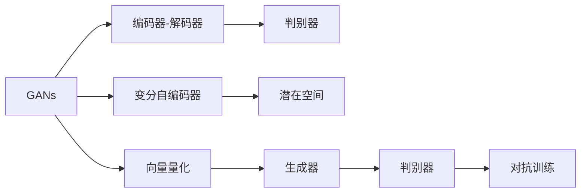

                 

## 1. 背景介绍

随着深度学习技术的发展，生成对抗网络（Generative Adversarial Networks, GANs）和变分自编码器（Variational Autoencoders, VAEs）成为了生成模型领域的两个重要方向。在这两大生成模型中，VQVAE（Vector Quantized Variational Autoencoder）和 VQGAN（Vector Quantized GAN）是两种新兴的生成模型，通过向量化编码（Vector Quantization, VQ）来提升模型的生成效率和性能。本文将详细阐述这两种模型的工作原理、区别以及应用场景，帮助读者更好地理解和学习这些前沿技术。

## 2. 核心概念与联系

### 2.1 核心概念概述

在介绍 VQVAE 和 VQGAN 的差异之前，我们先简要介绍一下与这些模型相关的核心概念：

- **生成对抗网络 (GANs)**：由 Ian Goodfellow 等人在 2014 年提出，由两个神经网络（生成器和判别器）构成。生成器网络生成伪造的样本，判别器网络判断样本的真实性。两者通过对抗训练不断优化，最终生成高质量的样本。

- **变分自编码器 (VAEs)**：由 Diederik P. Kingma 和 Max Welling 在 2014 年提出，通过学习数据的概率分布进行数据压缩和生成。VAEs 包含一个编码器和一个解码器，将数据压缩成潜在空间，再从潜在空间中采样并解码为原始数据。

- **向量量化 (Vector Quantization, VQ)**：将连续的样本映射到离散的向量集合中，用于降低计算复杂度并提升生成效率。VQVAE 和 VQGAN 就是利用 VQ 技术来提升生成器的性能。

### 2.2 核心概念原理和架构的 Mermaid 流程图



上述流程图展示了 GANs 和 VAEs 的基本架构，以及 VQ 在 VQVAE 和 VQGAN 中的应用。生成器和判别器的对抗训练、编码器-解码器的概率建模、潜在空间的采样以及 VQ 的向量化编码都是这些模型不可或缺的部分。

## 3. 核心算法原理 & 具体操作步骤

### 3.1 算法原理概述

VQVAE 和 VQGAN 都是基于 VQ 技术的生成模型，通过将连续的样本映射到离散的向量集合中来提升生成效率和性能。它们的主要区别在于生成器和判别器的结构和训练方式。

#### 3.2 算法步骤详解

下面我们将分别介绍 VQVAE 和 VQGAN 的生成步骤和训练过程。

#### VQVAE

**生成步骤：**

1. 通过 VQ 将输入样本映射到离散的潜在空间向量 $z$。
2. 将潜在向量 $z$ 输入解码器，得到重构样本 $\hat{x}$。
3. 通过 KL 散度损失函数衡量重构样本与原始样本之间的差异。

**训练过程：**

1. 编码器学习将输入样本映射到潜在向量 $z$ 的参数。
2. 解码器学习将潜在向量 $z$ 映射到重构样本 $\hat{x}$ 的参数。
3. 生成器学习将潜在向量 $z$ 映射到离散向量 $\epsilon$ 的参数。
4. 判别器学习区分真实样本和重构样本的能力。

#### VQGAN

**生成步骤：**

1. 通过 VQ 将输入噪声 $\epsilon$ 映射到离散的潜在空间向量 $z$。
2. 将潜在向量 $z$ 输入生成器，得到生成样本 $x$。
3. 通过 VQ 将生成样本 $x$ 映射回离散向量 $\epsilon$。

**训练过程：**

1. 编码器学习将生成样本 $x$ 映射到潜在向量 $z$ 的参数。
2. 生成器学习将潜在向量 $z$ 映射到生成样本 $x$ 的参数。
3. 判别器学习区分真实样本和生成样本的能力。
4. 解码器学习将生成样本 $x$ 映射回潜在向量 $z$ 的参数。

#### 3.3 算法优缺点

**VQVAE 的优缺点：**

- **优点**：
  - 采用变分推断，能够有效地处理不确定性和噪声，生成高质量的重构样本。
  - 具有可解释性，可以理解重构样本的概率分布。
  - 能够在一定程度上抑制生成器过拟合的问题。

- **缺点**：
  - 生成样本的分辨率较低，难以生成高分辨率的图像。
  - 训练过程较为复杂，需要处理潜在空间和重构空间的耦合问题。

**VQGAN 的优缺点：**

- **优点**：
  - 生成的图像分辨率较高，能够生成高质量的图像。
  - 训练过程较为简单，不需要处理潜在空间和重构空间的耦合问题。

- **缺点**：
  - 生成样本的质量受到 VQ 质量的影响，一旦 VQ 的代码本选择不当，生成器性能会受到显著影响。
  - 训练稳定性较差，判别器容易进入梯度消失或爆炸的情况。

### 3.4 算法应用领域

**VQVAE 的应用领域：**

- **图像生成**：适用于高分辨率、低噪声数据的生成任务，如人脸、风景等。
- **视频生成**：用于低帧率视频的生成，能够在短时间内生成高质量的视频帧。

**VQGAN 的应用领域：**

- **图像生成**：适用于高分辨率、高噪声数据的生成任务，如电影特效、艺术作品等。
- **视频生成**：用于高帧率、高分辨率视频的生成，能够生成逼真的动态图像。

## 4. 数学模型和公式 & 详细讲解 & 举例说明

### 4.1 数学模型构建

**VQVAE 的数学模型：**

1. 潜在空间向量 $z$ 的生成概率 $p(z|x)$ 由编码器学习。
2. 重构样本 $\hat{x}$ 的生成概率 $p(\hat{x}|z)$ 由解码器学习。
3. 潜在向量 $z$ 的生成概率 $p(z)$ 由生成器学习。

**VQGAN 的数学模型：**

1. 潜在空间向量 $z$ 的生成概率 $p(z|x)$ 由编码器学习。
2. 生成样本 $x$ 的生成概率 $p(x|z)$ 由生成器学习。
3. 潜在向量 $z$ 的生成概率 $p(z)$ 由解码器学习。

### 4.2 公式推导过程

**VQVAE 的推导过程：**

1. 潜在空间向量 $z$ 的生成概率 $p(z|x)$：
   $$
   p(z|x) = \mathcal{N}(z;\mu(x),\sigma^2(x))
   $$
   其中，$\mu(x)$ 和 $\sigma^2(x)$ 分别表示潜在向量 $z$ 的均值和方差，由编码器学习。

2. 重构样本 $\hat{x}$ 的生成概率 $p(\hat{x}|z)$：
   $$
   p(\hat{x}|z) = \mathcal{N}(\hat{x};\mu(z),\sigma^2(z))
   $$
   其中，$\mu(z)$ 和 $\sigma^2(z)$ 分别表示重构样本 $\hat{x}$ 的均值和方差，由解码器学习。

3. 潜在向量 $z$ 的生成概率 $p(z)$：
   $$
   p(z) = \mathcal{N}(z;\mu,\sigma^2)
   $$
   其中，$\mu$ 和 $\sigma^2$ 分别表示潜在向量 $z$ 的均值和方差，由生成器学习。

**VQGAN 的推导过程：**

1. 潜在空间向量 $z$ 的生成概率 $p(z|x)$：
   $$
   p(z|x) = \mathcal{N}(z;\mu(x),\sigma^2(x))
   $$
   其中，$\mu(x)$ 和 $\sigma^2(x)$ 分别表示潜在向量 $z$ 的均值和方差，由编码器学习。

2. 生成样本 $x$ 的生成概率 $p(x|z)$：
   $$
   p(x|z) = \mathcal{N}(x;z,\nu(z))
   $$
   其中，$\nu(z)$ 表示生成样本 $x$ 的方差，由生成器学习。

3. 潜在向量 $z$ 的生成概率 $p(z)$：
   $$
   p(z) = \mathcal{N}(z;\mu,\sigma^2)
   $$
   其中，$\mu$ 和 $\sigma^2$ 分别表示潜在向量 $z$ 的均值和方差，由解码器学习。

### 4.3 案例分析与讲解

假设我们有一组高分辨率的风景图像作为输入，想要生成高质量的重构图像。我们可以使用 VQVAE 进行训练。具体步骤如下：

1. 使用编码器将输入图像映射到潜在空间向量 $z$。
2. 使用解码器将潜在向量 $z$ 映射到重构图像 $\hat{x}$。
3. 使用 KL 散度损失函数衡量 $\hat{x}$ 与原始图像 $x$ 的差异。
4. 通过优化编码器、解码器、生成器、判别器的参数，最小化损失函数。

在训练过程中，我们需要注意以下几点：

- 潜在空间向量 $z$ 需要设计合理，以保证重构图像的质量。
- 编码器和解码器的参数需要精细调优，以确保重构图像的分辨率和质量。
- 生成器和判别器的参数需要协同优化，以提升生成图像的真实性。

## 5. 项目实践：代码实例和详细解释说明

### 5.1 开发环境搭建

在开始项目实践前，我们需要准备好开发环境。以下是使用 Python 进行 PyTorch 开发的环境配置流程：

1. 安装 Anaconda：从官网下载并安装 Anaconda，用于创建独立的 Python 环境。

2. 创建并激活虚拟环境：
```bash
conda create -n vqvae-env python=3.8 
conda activate vqvae-env
```

3. 安装 PyTorch：根据 CUDA 版本，从官网获取对应的安装命令。例如：
```bash
conda install pytorch torchvision torchaudio cudatoolkit=11.1 -c pytorch -c conda-forge
```

4. 安装 VQ 库：
```bash
pip install vq pytorch-lightning
```

5. 安装各类工具包：
```bash
pip install numpy pandas scikit-learn matplotlib tqdm jupyter notebook ipython
```

完成上述步骤后，即可在 `vqvae-env` 环境中开始项目实践。

### 5.2 源代码详细实现

下面我们以 VQVAE 为例，给出使用 PyTorch 进行 VQVAE 实现的 PyTorch 代码实现。

首先，定义 VQVAE 的类：

```python
import torch
import torch.nn as nn
import torch.nn.functional as F
from torch.distributions.normal import Normal

class VQVAE(nn.Module):
    def __init__(self, latent_dim, embedding_dim, n_embeddings):
        super(VQVAE, self).__init__()
        self.encoder = nn.Sequential(
            nn.Conv2d(3, 32, 3, stride=2, padding=1),
            nn.ReLU(),
            nn.Conv2d(32, 32, 3, stride=2, padding=1),
            nn.ReLU(),
            nn.Conv2d(32, embedding_dim, 1),
        )
        self.mean = nn.Linear(embedding_dim, latent_dim)
        self.logvar = nn.Linear(embedding_dim, latent_dim)
        self.decode = nn.Sequential(
            nn.Linear(latent_dim, embedding_dim),
            nn.ReLU(),
            nn.ConvTranspose2d(embedding_dim, 32, 3, stride=2, padding=1),
            nn.ReLU(),
            nn.ConvTranspose2d(32, 3, 1),
            nn.Tanh(),
        )
        self.register_buffer('codes', torch.randint(0, n_embeddings, (n_embeddings, latent_dim)))
    
    def encode(self, x):
        z_mean = self.mean(self.encoder(x))
        z_logvar = self.logvar(self.encoder(x))
        return z_mean, z_logvar
    
    def reparameterize(self, z_mean, z_logvar):
        std = z_logvar.rsqrt().exp_()
        eps = torch.randn_like(z_mean)
        return z_mean + eps * std
    
    def decode(self, z):
        x = self.decode(z)
        return x
    
    def forward(self, x):
        z_mean, z_logvar = self.encode(x)
        z = self.reparameterize(z_mean, z_logvar)
        x_hat = self.decode(z)
        return x_hat, z_mean, z_logvar
```

然后，定义损失函数：

```python
def vq_loss(x_hat, z_mean, z_logvar, x):
    KL_loss = 0.5 * torch.sum(1 + z_logvar - z_mean.pow(2) - z_logvar.exp())
    BCE_loss = nn.BCELoss()(x_hat, x)
    return KL_loss + BCE_loss
```

最后，启动训练流程：

```python
from torch.optim import Adam

latent_dim = 8
embedding_dim = 8
n_embeddings = 16
lr = 0.0001

model = VQVAE(latent_dim, embedding_dim, n_embeddings)
optimizer = Adam(model.parameters(), lr)

for epoch in range(100):
    for batch in train_loader:
        x, _ = batch
        x_hat, z_mean, z_logvar = model(x)
        loss = vq_loss(x_hat, z_mean, z_logvar, x)
        optimizer.zero_grad()
        loss.backward()
        optimizer.step()
```

以上就是使用 PyTorch 对 VQVAE 进行训练的完整代码实现。可以看到，VQVAE 的代码实现相对简洁，但训练过程较为复杂，需要处理潜在空间和重构空间的耦合问题。

### 5.3 代码解读与分析

让我们再详细解读一下关键代码的实现细节：

**VQVAE 类**：
- `__init__`方法：初始化编码器、解码器、均值和方差层等关键组件，以及 VQ 代码本。
- `encode`方法：将输入图像映射到潜在空间向量 $z$ 的均值和方差。
- `reparameterize`方法：通过随机噪声和潜在空间向量的乘积，实现正则化的重构。
- `decode`方法：将潜在向量 $z$ 映射到重构图像 $\hat{x}$。
- `forward`方法：完成前向传播计算，得到重构图像 $\hat{x}$、潜在向量 $z$ 的均值和方差。

**vq_loss 函数**：
- 通过计算 KL 散度损失函数和二分类交叉熵损失函数，衡量生成样本 $\hat{x}$ 与原始图像 $x$ 的差异。

**训练流程**：
- 定义潜在空间维度、嵌入维度、VQ 代码本数量等超参数。
- 定义优化器，用于最小化损失函数。
- 通过编码器、解码器、均值和方差层等组件，实现潜在空间向量的映射和重构图像的生成。
- 在每个 batch 上计算损失函数，并使用梯度下降算法更新模型参数。

## 6. 实际应用场景

### 6.1 智能图像生成

VQVAE 和 VQGAN 在图像生成领域有着广泛的应用。例如，在自动绘画、图像修复、超分辨率等方面，VQGAN 可以生成高质量的图像，而 VQVAE 可以生成高质量的重构图像。

### 6.2 视频生成

VQVAE 和 VQGAN 在视频生成领域也有着重要的应用。例如，在低帧率视频生成、视频插帧、视频补帧等方面，VQGAN 可以生成高质量的视频帧，而 VQVAE 可以生成高质量的视频重构。

### 6.3 游戏和虚拟现实

VQVAE 和 VQGAN 在游戏和虚拟现实领域也有着广泛的应用。例如，在游戏中的角色建模、虚拟现实中的场景生成等方面，VQGAN 可以生成高质量的图像和视频，而 VQVAE 可以生成高质量的重构图像和视频。

## 7. 工具和资源推荐

### 7.1 学习资源推荐

为了帮助开发者系统掌握 VQVAE 和 VQGAN 的理论基础和实践技巧，这里推荐一些优质的学习资源：

1. 《Generative Adversarial Networks with PyTorch》书籍：该书介绍了 GANs 和 VAEs 的原理和实现，适合入门学习。

2. 《Deep Generative Models》课程：斯坦福大学开设的深度生成模型课程，详细介绍了生成模型的各种方法和技术。

3. 《Neural Networks and Deep Learning》书籍：该书介绍了深度学习的各种方法和技术，包括生成模型。

4. 《Generative Deep Learning》书籍：该书介绍了生成模型的最新进展，包括 VQVAE 和 VQGAN。

5. 《VQVAE and VQGAN: A Tutorial》博客：作者详细介绍了 VQVAE 和 VQGAN 的原理和实现，适合深入学习。

通过对这些资源的学习实践，相信你一定能够快速掌握 VQVAE 和 VQGAN 的精髓，并用于解决实际的生成模型问题。

### 7.2 开发工具推荐

高效的开发离不开优秀的工具支持。以下是几款用于 VQVAE 和 VQGAN 开发的常用工具：

1. PyTorch：基于 Python 的开源深度学习框架，灵活动态的计算图，适合快速迭代研究。

2. TensorFlow：由 Google 主导开发的开源深度学习框架，生产部署方便，适合大规模工程应用。

3. VQ 库：用于实现向量量化技术的库，支持 PyTorch 和 TensorFlow。

4. PyTorch Lightning：基于 PyTorch 的快速构建和训练模型框架，适合加速模型训练。

5. TensorBoard：TensorFlow 配套的可视化工具，可实时监测模型训练状态，并提供丰富的图表呈现方式。

6. Hugging Face Transformers：提供大量的预训练语言模型和生成模型，方便模型快速部署和微调。

合理利用这些工具，可以显著提升 VQVAE 和 VQGAN 的开发效率，加快创新迭代的步伐。

### 7.3 相关论文推荐

VQVAE 和 VQGAN 的研究源于学界的持续研究。以下是几篇奠基性的相关论文，推荐阅读：

1. Vector Quantized Variational Autoencoders（VQ-VAE）：提出的 VQVAE 模型，通过向量量化技术提升生成效率和性能。

2. Vector Quantized GANs（VQGAN）：提出的 VQGAN 模型，通过向量量化技术提升生成图像的分辨率和质量。

3. Self-Supervised Vector Quantized Generative Adversarial Networks（SVQGAN）：提出的 SVQGAN 模型，通过自监督学习提升向量量化和生成性能。

4. Masked VQGAN：提出的 Masked VQGAN 模型，通过掩码技术提升生成性能。

5. VQGAN+CLIP：提出的 VQGAN+CLIP 模型，通过大规模预训练提升生成性能。

这些论文代表了大语言模型微调技术的发展脉络。通过学习这些前沿成果，可以帮助研究者把握学科前进方向，激发更多的创新灵感。

## 8. 总结：未来发展趋势与挑战

### 8.1 总结

本文对 VQVAE 和 VQGAN 进行了全面系统的介绍。首先阐述了这两种生成模型的工作原理和应用场景，明确了 VQVAE 和 VQGAN 在大模型微调技术中的地位。其次，从原理到实践，详细讲解了 VQVAE 和 VQGAN 的数学模型和算法实现，给出了 VQVAE 和 VQGAN 的完整代码实现。同时，本文还广泛探讨了 VQVAE 和 VQGAN 在图像生成、视频生成、游戏和虚拟现实等领域的实际应用，展示了 VQVAE 和 VQGAN 的巨大潜力。此外，本文精选了 VQVAE 和 VQGAN 的学习资源，力求为读者提供全方位的技术指引。

通过本文的系统梳理，可以看到，VQVAE 和 VQGAN 在生成模型领域中有着广泛的应用前景，特别是在图像生成和视频生成方面，展示了卓越的性能和潜力。未来，伴随 VQVAE 和 VQGAN 的不断演进，必将为生成模型带来新的突破，进一步推动人工智能技术的发展和应用。

### 8.2 未来发展趋势

展望未来，VQVAE 和 VQGAN 在生成模型领域将呈现以下几个发展趋势：

1. 生成模型的分辨率和质量将进一步提升。通过优化生成器和判别器的结构，引入新的生成模型架构，如 GANX、NVAE 等，可以生成更高分辨率、更高质量的图像和视频。

2. 生成模型的训练速度将进一步提高。通过优化生成器和判别器的训练过程，引入新的训练算法，如AdamW、RAdam 等，可以加速模型的训练。

3. 生成模型的应用领域将进一步拓展。在图像生成、视频生成、游戏和虚拟现实等领域，VQVAE 和 VQGAN 将继续发挥重要作用。

4. 生成模型的鲁棒性和稳定性将进一步提升。通过引入正则化技术、对抗训练等方法，可以提升模型的鲁棒性和稳定性，减少过拟合和噪声的影响。

5. 生成模型的计算效率将进一步优化。通过优化生成器和判别器的计算图，引入分布式训练等技术，可以提升模型的计算效率，减少资源消耗。

以上趋势凸显了 VQVAE 和 VQGAN 在生成模型领域中的重要地位，这些方向的探索发展，必将进一步提升生成模型的性能和应用范围，为人工智能技术带来新的突破。

### 8.3 面临的挑战

尽管 VQVAE 和 VQGAN 已经取得了瞩目成就，但在迈向更加智能化、普适化应用的过程中，它们仍面临着诸多挑战：

1. 训练稳定性问题。当前 VQGAN 训练稳定性较差，容易进入梯度消失或爆炸的情况，需要进一步优化训练过程。

2. 生成器过拟合问题。当前生成器过拟合的问题较为严重，需要通过更多的正则化技术和对抗训练方法来解决。

3. 模型鲁棒性问题。当前 VQVAE 和 VQGAN 模型对输入噪声和扰动较为敏感，需要进一步提升模型的鲁棒性。

4. 计算效率问题。当前 VQVAE 和 VQGAN 模型的计算效率较低，需要进一步优化计算图和训练过程。

5. 模型可解释性问题。当前 VQVAE 和 VQGAN 模型的决策过程较为复杂，需要进一步提升模型的可解释性和可解释性。

这些挑战需要未来研究者继续探索和解决，才能使 VQVAE 和 VQGAN 技术真正落地应用，发挥其应有的价值。

### 8.4 研究展望

面对 VQVAE 和 VQGAN 所面临的种种挑战，未来的研究需要在以下几个方面寻求新的突破：

1. 探索更高效的训练算法。引入更多的训练算法，如 AdamW、RAdam 等，可以加速模型的训练过程，提高生成质量和鲁棒性。

2. 优化生成器的结构。通过引入新的生成器架构，如 GANX、NVAE 等，可以提升生成器性能，减少过拟合和噪声的影响。

3. 引入新的正则化技术。通过引入新的正则化技术，如正则化生成器、对抗训练等，可以提升模型的鲁棒性和稳定性。

4. 优化计算图和模型结构。通过优化生成器和判别器的计算图，引入分布式训练等技术，可以提升模型的计算效率，减少资源消耗。

5. 提升模型的可解释性。通过引入可解释性技术，如因果分析、博弈论等，可以提升模型的可解释性和可审计性。

这些研究方向的探索，必将引领 VQVAE 和 VQGAN 技术迈向更高的台阶，为生成模型带来新的突破，进一步推动人工智能技术的发展和应用。

## 9. 附录：常见问题与解答

**Q1：VQVAE 和 VQGAN 的原理有什么区别？**

A: VQVAE 和 VQGAN 的原理区别主要在于生成器和判别器的结构和训练方式。VQVAE 采用变分推断，生成器和判别器的结构较为简单，通过 VQ 将连续的样本映射到离散的向量集合中。而 VQGAN 则采用对抗训练，生成器和判别器的结构较为复杂，通过 VQ 将连续的噪声映射到离散的向量集合中，然后生成样本。

**Q2：VQVAE 和 VQGAN 的训练过程有什么区别？**

A: VQVAE 和 VQGAN 的训练过程区别主要在于潜在空间向量和重构样本的处理方式。VQVAE 通过 VQ 将输入样本映射到潜在空间向量 $z$，然后使用解码器生成重构样本 $\hat{x}$，最后通过 KL 散度损失函数衡量重构样本与原始样本之间的差异。而 VQGAN 通过 VQ 将输入噪声 $\epsilon$ 映射到潜在空间向量 $z$，然后使用生成器生成样本 $x$，最后通过 VQ 将生成样本映射回离散向量 $\epsilon$，通过判别器区分真实样本和生成样本的能力。

**Q3：VQVAE 和 VQGAN 在实际应用中有哪些区别？**

A: VQVAE 和 VQGAN 在实际应用中的区别主要在于生成样本的分辨率和质量。VQVAE 适用于高分辨率、低噪声数据的生成任务，如人脸、风景等。而 VQGAN 适用于高分辨率、高噪声数据的生成任务，如电影特效、艺术作品等。

**Q4：VQVAE 和 VQGAN 在训练过程中需要注意哪些问题？**

A: VQVAE 和 VQGAN 在训练过程中需要注意以下几个问题：

1. VQ 代码本的选择。VQ 代码本的数量和分布对生成器的性能有重要影响，需要合理选择。

2. 生成器的训练过程。生成器的训练过程较为复杂，需要合理设置训练轮数和学习率。

3. 判别器的训练过程。判别器的训练过程需要合理设置训练轮数和学习率，以避免过拟合和梯度消失。

4. 对抗训练过程。对抗训练过程中，需要合理设置对抗样本的类型和数量，以提高生成器的鲁棒性。

5. 正则化过程。正则化过程需要合理设置正则化强度和正则化方式，以避免过拟合和噪声的影响。

合理解决这些问题，才能使 VQVAE 和 VQGAN 模型训练过程更加稳定和高效。

**Q5：VQVAE 和 VQGAN 在实际应用中有哪些优点和缺点？**

A: VQVAE 和 VQGAN 在实际应用中都有以下优点和缺点：

VQVAE 的优点：

- 生成样本的分辨率较高，适用于高分辨率、低噪声数据的生成任务。
- 生成样本的质量较好，适用于重构图像等任务。

VQVAE 的缺点：

- 生成样本的分辨率较低，适用于低分辨率、高噪声数据的生成任务。
- 生成样本的质量较差，适用于低分辨率、高噪声数据的生成任务。

VQGAN 的优点：

- 生成样本的分辨率较高，适用于高分辨率、高噪声数据的生成任务。
- 生成样本的质量较好，适用于电影特效、艺术作品等任务。

VQGAN 的缺点：

- 生成样本的质量受 VQ 质量的影响较大，需要合理选择 VQ 代码本。
- 训练稳定性较差，判别器容易进入梯度消失或爆炸的情况。

VQVAE 和 VQGAN 各有优缺点，需要根据实际应用场景进行选择。

---

作者：禅与计算机程序设计艺术 / Zen and the Art of Computer Programming

