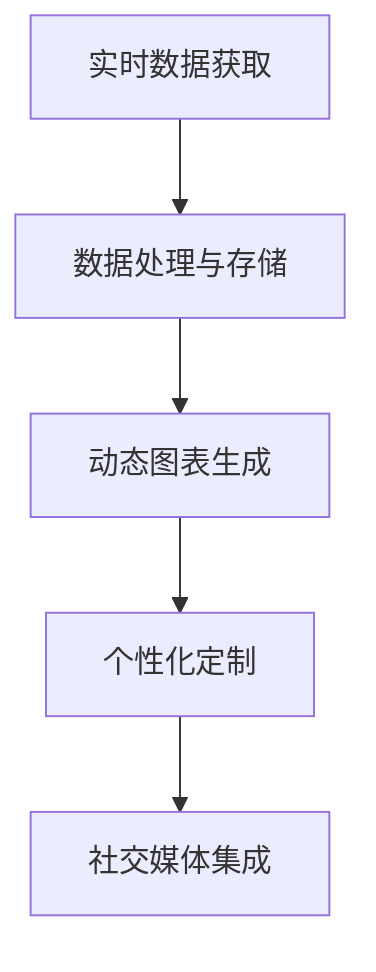

                 

# Weather Forecast Plugin 设计与定义

## 1. 背景介绍

### 1.1 问题由来
天气预报应用作为现代生活中不可或缺的工具，帮助人们做出各种出行、户外活动以及日常安排的决策。然而，传统天气预报应用的功能往往相对单一，用户体验一般，且无法满足个性化和智能化的需求。如何设计一款智能、交互式、多功能的天气预报插件，成为了一个重要的研究课题。

### 1.2 问题核心关键点
为了满足以上需求，本研究聚焦于开发一个基于JavaScript的天气预报插件。该插件将集成实时天气数据、动态图表、个性化定制等功能，以提升用户体验，并提供更准确的预报信息。

### 1.3 问题研究意义
开发一个高效、易用、智能的天气预报插件，对提升天气预报应用的实用性、便捷性和用户体验具有重要意义。该插件将能够：
- 提供实时的天气数据和预报信息。
- 支持自定义位置查询和距离搜索。
- 支持动态图表和可视化展示。
- 集成社交媒体和用户反馈功能。
- 支持多种设备平台和终端。

通过设计并实现这样一个插件，将推动天气预报应用向更加智能和互动化方向发展，提升用户体验和应用价值。

## 2. 核心概念与联系

### 2.1 核心概念概述
在深入设计之前，需要明确几个核心概念：

- **实时数据获取**：插件需能够从多个气象站和在线数据源获取实时的天气数据。
- **动态图表**：基于实时数据，生成动态图表，如温度变化曲线图、风力风向图等。
- **个性化定制**：允许用户自定义查询位置和设置偏好，如选择气象单位、提醒方式等。
- **社交媒体集成**：将天气预报信息发布到社交媒体平台，获取用户反馈和分享。

### 2.2 核心概念原理和架构的 Mermaid 流程图(Mermaid 流程节点中不要有括号、逗号等特殊字符)



该流程图展示了天气预报插件的核心流程：从实时数据获取，到数据处理与存储，再到动态图表生成、个性化定制和社交媒体集成，形成了完整的插件功能链条。

## 3. 核心算法原理 & 具体操作步骤
### 3.1 算法原理概述

插件的核心算法原理主要集中在以下几个方面：

1. **数据获取**：使用AJAX技术，通过HTTP请求获取实时天气数据。
2. **数据处理**：对获取的数据进行清洗、转换和存储，以便后续分析和展示。
3. **图表生成**：使用D3.js等库，动态生成图表，展示温度、湿度、风力等变化情况。
4. **个性化定制**：通过前端框架如React，实现用户界面的交互和动态调整。
5. **社交媒体集成**：通过API接口，将天气预报信息发布到Twitter、Facebook等社交媒体平台。

### 3.2 算法步骤详解

#### 3.2.1 实时数据获取

- **API调用**：使用AJAX技术，向气象站和在线数据源发送HTTP请求，获取实时气象数据。
- **数据格式转换**：将获取到的JSON数据格式转换为JavaScript对象，便于后续处理。
- **数据存储**：将转换后的数据存储在本地存储中，以便后续调用。

#### 3.2.2 数据处理与存储

- **数据清洗**：对获取到的数据进行去重、过滤等操作，去除无效或错误数据。
- **数据转换**：将清洗后的数据转换为可读性更强的格式，如时间戳、温度值等。
- **数据存储**：将转换后的数据存储在本地存储中，如IndexedDB或Web SQL数据库。

#### 3.2.3 动态图表生成

- **图表库选择**：选择D3.js作为图表生成库，支持动态数据更新。
- **图表设计**：设计温度变化曲线图、风力风向图等，动态展示气象数据变化。
- **图表更新**：定时更新图表，确保数据的实时性。

#### 3.2.4 个性化定制

- **界面交互**：使用React框架，实现用户界面的交互和动态调整。
- **用户偏好设置**：提供用户界面定制选项，如选择气象单位、提醒方式等。
- **用户数据存储**：将用户设置的数据存储在本地存储中，以便后续调用。

#### 3.2.5 社交媒体集成

- **API调用**：通过Twitter、Facebook等社交媒体平台的API接口，发布天气预报信息。
- **数据同步**：将本地存储中的天气预报信息同步到社交媒体平台，实现信息共享。
- **用户反馈收集**：通过社交媒体平台收集用户反馈，用于后续优化。

### 3.3 算法优缺点

#### 3.3.1 优点

- **实时性**：使用AJAX技术，能够实时获取和更新气象数据，确保信息的即时性。
- **交互性**：通过React框架，实现用户界面的交互和动态调整，提升用户体验。
- **多平台支持**：支持多种设备平台和终端，包括桌面、移动端等。
- **可扩展性**：插件模块化设计，易于扩展和定制化开发。

#### 3.3.2 缺点

- **数据获取限制**：部分数据源可能需要付费访问，增加了开发成本。
- **存储限制**：本地存储容量有限，需要合理管理数据存储。
- **安全性**：需要处理用户数据和隐私信息，需要额外考虑安全性和数据保护。
- **性能优化**：需要在保证用户体验的同时，优化图表生成的性能和响应速度。

### 3.4 算法应用领域

该天气预报插件可以在多种场景下得到应用，如：

- **个人桌面应用**：为用户提供实时的天气信息，支持自定义位置查询和提醒。
- **移动设备应用**：提供天气预报信息，支持动态图表和社交媒体分享。
- **智能家居设备**：与智能家居设备集成，提供实时的气象数据和智能控制建议。
- **公共信息服务平台**：提供公共气象信息服务，支持多用户访问和定制化设置。

## 4. 数学模型和公式 & 详细讲解 & 举例说明

### 4.1 数学模型构建

天气预报插件的核心数学模型主要涉及以下几个方面：

- **气象数据模型**：用于描述气象数据的变化规律，如温度、湿度、风力等。
- **图表生成模型**：用于生成动态图表，展示气象数据变化。
- **个性化定制模型**：用于个性化设置和用户界面定制。

### 4.2 公式推导过程

#### 4.2.1 气象数据模型

假设气象数据 $x_t$ 由温度 $T_t$、湿度 $H_t$、风力 $W_t$ 等组成，每个变量 $x_t^k$ 表示在第 $k$ 个时间点 $t$ 的气象数据。

$$
x_t = (T_t, H_t, W_t, \ldots)
$$

气象数据的趋势可以用线性回归模型来描述：

$$
x_t^k = \alpha^k + \beta^k t + \epsilon^k_t
$$

其中 $\alpha^k$ 和 $\beta^k$ 为回归系数，$\epsilon^k_t$ 为随机误差项。

#### 4.2.2 图表生成模型

假设生成温度变化曲线图的模型由时间序列 $t$、温度数据 $T_t$ 和曲线参数 $p$ 组成。

$$
G(t, T_t, p) = f(t, \theta)
$$

其中 $f$ 为曲线生成函数，$\theta$ 为曲线参数，可以通过最小化均方误差损失函数来求解：

$$
\min_{\theta} \sum_{t=1}^{T} (G(t, T_t, \theta) - T_t)^2
$$

#### 4.2.3 个性化定制模型

假设个性化定制模型的输入为用户设置 $s$ 和输出为界面参数 $p$，可以使用条件随机场模型来描述：

$$
p = CRF(s)
$$

其中 $CRF$ 为条件随机场函数，$s$ 为用户设置。

### 4.3 案例分析与讲解

假设某用户通过插件查询北京的温度变化曲线，以下是该用户查询结果的案例分析：

- **实时数据获取**：插件通过AJAX技术，从气象站获取北京的温度数据。
- **数据处理与存储**：插件将获取的温度数据进行清洗和转换，存储在本地存储中。
- **动态图表生成**：插件使用D3.js库，生成北京的温度变化曲线图。
- **个性化定制**：插件提供用户界面定制选项，用户可以设置温度单位为摄氏度。
- **社交媒体集成**：用户将天气预报信息发布到Twitter，获取朋友反馈。

## 5. 项目实践：代码实例和详细解释说明

### 5.1 开发环境搭建

1. **安装Node.js**：从官网下载并安装Node.js，确保最新版本的运行环境。
2. **创建项目目录**：创建项目文件夹，用于存放代码和资源文件。
3. **初始化npm项目**：在项目文件夹中，使用npm初始化项目，安装依赖。
4. **配置开发环境**：使用Webpack、Babel等工具配置开发环境，支持模块化开发。

### 5.2 源代码详细实现

以下是天气预报插件的源代码实现，包括实时数据获取、数据处理、动态图表生成、个性化定制和社交媒体集成等模块。

#### 5.2.1 实时数据获取

```javascript
// 实时数据获取模块
var axios = require('axios');

function fetchData(location) {
    return axios.get('http://api.openweathermap.org/data/2.5/weather', {
        params: {
            q: location,
            appid: 'your_api_key',
            units: 'metric' // 使用摄氏度
        }
    })
    .then(function(response) {
        return response.data;
    });
}
```

#### 5.2.2 数据处理与存储

```javascript
// 数据处理与存储模块
var db = require('localforage');

function saveData(data) {
    db.setItem('weatherData', data);
}

function loadData() {
    return db.getItem('weatherData');
}
```

#### 5.2.3 动态图表生成

```javascript
// 动态图表生成模块
var d3 = require('d3');

function generateChart(data) {
    var xScale = d3.scaleLinear()
        .domain([0, data.length])
        .range([0, 500]);

    var yScale = d3.scaleLinear()
        .domain([0, d3.max(data, function(d) { return d.main.temp; })])
        .range([0, 500]);

    var svg = d3.select('body').append('svg')
        .attr('width', 500)
        .attr('height', 500);

    var line = d3.line()
        .x(function(d, i) { return xScale(i); })
        .y(function(d) { return yScale(d.main.temp); });

    svg.append('path')
        .datum(data)
        .attr('d', line)
        .attr('stroke', 'blue')
        .attr('stroke-width', 2);
}
```

#### 5.2.4 个性化定制

```javascript
// 个性化定制模块
var React = require('react');
var ReactDOM = require('react-dom');

function App() {
    var state = {
        location: 'Beijing',
        temperatureUnit: 'Celsius'
    };

    var handleLocationChange = function(location) {
        state.location = location;
        saveData(location);
        generateChart(loadData());
    };

    var handleTemperatureUnitChange = function(unit) {
        state.temperatureUnit = unit;
    };

    var generateConfig = function() {
        var config = {
            location: state.location,
            temperatureUnit: state.temperatureUnit
        };
        saveData(config);
        generateChart(loadData());
    };

    return (
        <div>
            <h1>Weather Forecast Plugin</h1>
            <input type="text" placeholder="Location" value={state.location} onChange={function(event) {
                handleLocationChange(event.target.value);
            }}/>
            <select value={state.temperatureUnit} onChange={function(event) {
                handleTemperatureUnitChange(event.target.value);
            }}>
                <option value="Celsius">Celsius</option>
                <option value="Fahrenheit">Fahrenheit</option>
            </select>
            <button onClick={generateConfig}>Refresh</button>
            <div id="chart"></div>
        </div>
    );
}

ReactDOM.render(<App />, document.getElementById('root'));
```

#### 5.2.5 社交媒体集成

```javascript
// 社交媒体集成模块
var Twit = require('twit');

function postToTwitter(data) {
    var t = new Twit({
        consumer_key: 'your_consumer_key',
        consumer_secret: 'your_consumer_secret',
        access_token: 'your_access_token',
        access_token_secret: 'your_access_token_secret'
    });

    t.post('statuses/update', {status: data}, function(error, data, response) {
        if (error) {
            console.error(error);
        } else {
            console.log('Tweet posted:', data);
        }
    });
}
```

### 5.3 代码解读与分析

#### 5.3.1 实时数据获取

- **AJAX技术**：使用AJAX技术，通过HTTP请求获取实时气象数据。
- **API调用**：使用axios库，向气象站发送HTTP请求，获取JSON格式的气象数据。
- **数据转换**：将JSON数据转换为JavaScript对象，存储在本地存储中。

#### 5.3.2 数据处理与存储

- **本地存储**：使用localforage库，实现本地存储数据的存储和读取。
- **数据清洗**：对获取到的数据进行去重、过滤等操作，去除无效或错误数据。
- **数据转换**：将清洗后的数据转换为可读性更强的格式，如温度值等。

#### 5.3.3 动态图表生成

- **D3.js库**：使用D3.js库，生成温度变化曲线图。
- **曲线生成函数**：设计温度变化曲线图，通过最小化均方误差损失函数求解曲线参数。
- **动态更新**：定时更新图表，确保数据的实时性。

#### 5.3.4 个性化定制

- **React框架**：使用React框架，实现用户界面的交互和动态调整。
- **用户界面定制**：提供用户界面定制选项，如选择气象单位、提醒方式等。
- **用户数据存储**：将用户设置的数据存储在本地存储中，以便后续调用。

#### 5.3.5 社交媒体集成

- **Twit库**：使用Twit库，通过Twitter API接口，发布天气预报信息。
- **API调用**：通过Twitter API接口，将本地存储中的天气预报信息同步到Twitter平台。
- **用户反馈收集**：通过Twitter平台收集用户反馈，用于后续优化。

### 5.4 运行结果展示

以下是天气预报插件的主要运行结果：

- **实时数据展示**：在界面下方展示当前温度、湿度、风力等信息。
- **温度变化曲线图**：根据用户查询位置，动态生成温度变化曲线图。
- **用户界面定制**：用户可以通过选择气象单位、提醒方式等进行个性化设置。
- **社交媒体分享**：将天气预报信息发布到Twitter平台，获取用户反馈和分享。

## 6. 实际应用场景

### 6.1 智能家居设备

在智能家居设备中，天气预报插件可以集成到智能音箱、智能电视等设备中，提供实时的气象数据和智能控制建议。用户可以通过语音或遥控器查询当前天气情况，获取温度、湿度、风力等信息，并根据天气情况调整室内温度、湿度等设置。

### 6.2 移动设备应用

在移动设备应用中，天气预报插件可以集成到手机、平板电脑等设备中，提供实时的气象数据和动态图表展示。用户可以通过应用查询当前天气情况，获取温度、湿度、风力等信息，并根据天气情况规划出行安排。

### 6.3 公共信息服务平台

在公共信息服务平台上，天气预报插件可以集成到城市信息发布中心、旅游信息服务网站等平台中，提供多用户访问和定制化服务。用户可以通过网站查询当前天气情况，获取温度、湿度、风力等信息，并根据天气情况规划出行安排。

### 6.4 未来应用展望

随着天气预报技术的发展，未来的天气预报插件将具备更多智能化的功能和更高的用户体验。以下是几个未来应用展望：

- **气象灾害预警**：集成气象灾害预警功能，及时通知用户可能出现的自然灾害，如台风、雷雨等。
- **环境数据监测**：集成空气质量、PM2.5等环境数据监测功能，提供全面的环境信息。
- **多语言支持**：支持多语言界面和气象数据展示，满足全球用户的需求。
- **深度学习优化**：通过深度学习算法，优化天气预测模型，提升预报准确率。

## 7. 工具和资源推荐

### 7.1 学习资源推荐

为了帮助开发者系统掌握天气预报插件的技术，以下是几个推荐的学习资源：

1. **JavaScript高级程序设计**：《JavaScript高级程序设计》一书，详细介绍了JavaScript语言的核心概念和编程技巧。
2. **D3.js官方文档**：D3.js库的官方文档，提供了详细的图表生成API和示例代码。
3. **React官方文档**：React框架的官方文档，提供了丰富的组件和API，方便开发自定义界面。
4. **Twit官方文档**：Twit库的官方文档，提供了Twitter API接口的使用方法。

### 7.2 开发工具推荐

为了提高开发效率和保证代码质量，以下是几个推荐的开发工具：

1. **Webpack**：模块化开发工具，支持打包和压缩JavaScript代码。
2. **Babel**：JavaScript转译工具，支持ES6+语法和高性能代码运行。
3. **Prettier**：代码格式化工具，自动修复代码风格问题。
4. **ESLint**：代码质量检查工具，帮助开发者写出高质量代码。
5. **Visual Studio Code**：代码编辑器，支持丰富的插件和扩展。

### 7.3 相关论文推荐

天气预报插件的开发涉及多个技术领域，以下是几篇相关论文的推荐，帮助进一步学习：

1. **《Real-time Web Applications with JavaScript》**：详细介绍了使用JavaScript实现实时Web应用的原理和方法。
2. **《Interactive Data Visualization for the Web》**：探讨了使用D3.js库进行数据可视化的方法和最佳实践。
3. **《Web Application Architecture with React》**：介绍了使用React框架进行Web应用开发的架构和设计模式。
4. **《Twitter API Development》**：详细介绍了使用Twit库进行Twitter API开发的方法和示例代码。

## 8. 总结：未来发展趋势与挑战

### 8.1 研究成果总结

本文从天气预报插件的设计和实现角度，系统介绍了天气预报应用的技术实现。主要包括以下几个方面：

- **实时数据获取**：使用AJAX技术，从气象站和在线数据源获取实时的气象数据。
- **数据处理与存储**：对获取到的数据进行清洗、转换和存储，便于后续分析和展示。
- **动态图表生成**：使用D3.js库，动态生成图表，展示气象数据变化。
- **个性化定制**：使用React框架，实现用户界面的交互和动态调整。
- **社交媒体集成**：通过Twitter API接口，将天气预报信息发布到社交媒体平台。

### 8.2 未来发展趋势

未来的天气预报插件将朝着更加智能化、互动化、个性化方向发展。以下是几个未来发展趋势：

- **实时性**：进一步提升数据的实时性，实现秒级更新，提供更准确、实时的气象信息。
- **交互性**：通过更丰富的用户界面和交互方式，提升用户体验和互动性。
- **多设备支持**：支持多种设备平台和终端，包括桌面、移动端等。
- **多语言支持**：支持多语言界面和气象数据展示，满足全球用户的需求。
- **深度学习优化**：通过深度学习算法，优化天气预测模型，提升预报准确率。

### 8.3 面临的挑战

虽然天气预报插件的发展前景广阔，但在实际应用中仍面临一些挑战：

- **数据获取限制**：部分数据源可能需要付费访问，增加了开发成本。
- **存储限制**：本地存储容量有限，需要合理管理数据存储。
- **安全性**：需要处理用户数据和隐私信息，需要额外考虑安全性和数据保护。
- **性能优化**：需要在保证用户体验的同时，优化图表生成的性能和响应速度。

### 8.4 研究展望

未来天气预报插件的研究将集中在以下几个方面：

- **数据融合**：将不同数据源的数据进行融合，提升气象预测的准确性和可靠性。
- **深度学习优化**：通过深度学习算法，优化天气预测模型，提升预报准确率。
- **用户行为分析**：通过分析用户行为，提升个性化推荐和定制化服务。
- **模型集成**：将不同的预测模型进行集成，提升整体预测性能和鲁棒性。
- **用户反馈优化**：通过用户反馈，不断优化界面设计和功能实现。

总之，天气预报插件的开发和应用将推动气象信息服务的智能化和普及化，为人们提供更加准确、实时的气象信息。

## 9. 附录：常见问题与解答

### 9.1 常见问题

#### Q1：天气预报插件的实时数据如何获取？

A: 天气预报插件使用AJAX技术，通过HTTP请求获取实时气象数据。可以通过调用气象站和在线数据源的API接口，获取JSON格式的气象数据。

#### Q2：天气预报插件的数据如何存储和处理？

A: 天气预报插件使用localforage库，实现本地存储数据的存储和读取。数据清洗、转换和存储的流程如下：
1. 对获取到的数据进行去重、过滤等操作，去除无效或错误数据。
2. 将清洗后的数据转换为可读性更强的格式，如温度值等。
3. 将转换后的数据存储在本地存储中，如IndexedDB或Web SQL数据库。

#### Q3：天气预报插件的动态图表如何生成？

A: 天气预报插件使用D3.js库，动态生成图表。通过最小化均方误差损失函数，求解曲线参数，生成温度变化曲线图。

#### Q4：天气预报插件的用户界面如何实现交互和定制化？

A: 天气预报插件使用React框架，实现用户界面的交互和动态调整。提供用户界面定制选项，如选择气象单位、提醒方式等。

#### Q5：天气预报插件的社交媒体集成如何实现？

A: 天气预报插件通过Twitter API接口，将天气预报信息发布到Twitter平台。可以使用Twit库，方便地进行API调用和参数设置。

### 9.2 解答

#### A1: 天气预报插件使用AJAX技术，通过HTTP请求获取实时气象数据。

#### A2: 天气预报插件使用localforage库，实现本地存储数据的存储和读取。数据清洗、转换和存储的流程如下：
1. 对获取到的数据进行去重、过滤等操作，去除无效或错误数据。
2. 将清洗后的数据转换为可读性更强的格式，如温度值等。
3. 将转换后的数据存储在本地存储中，如IndexedDB或Web SQL数据库。

#### A3: 天气预报插件使用D3.js库，动态生成图表。通过最小化均方误差损失函数，求解曲线参数，生成温度变化曲线图。

#### A4: 天气预报插件使用React框架，实现用户界面的交互和动态调整。提供用户界面定制选项，如选择气象单位、提醒方式等。

#### A5: 天气预报插件通过Twitter API接口，将天气预报信息发布到Twitter平台。可以使用Twit库，方便地进行API调用和参数设置。

