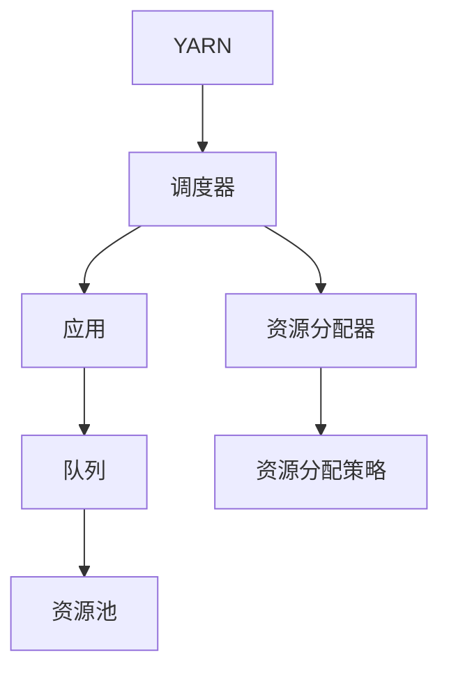

                 

# YARN Capacity Scheduler原理与代码实例讲解

> 关键词：YARN, Capacity Scheduler, 资源调度, Hadoop, MapReduce, 集群管理, 调度算法

## 1. 背景介绍

### 1.1 问题由来
随着大数据和云计算的快速发展，分布式计算框架如Apache Hadoop和Apache Spark等被广泛采用，以支持海量数据的处理和分析。在这些框架中，资源管理层扮演着至关重要的角色，负责高效地分配和调度计算资源，以确保作业能够在合理的时间内完成。Hadoop的资源管理器YARN（Yet Another Resource Negotiator）是一个典型的例子，它提供了一种分布式资源的调度和管理机制，支持多种类型的作业（如MapReduce、Spark、Storm等）在集群上运行。

YARN的调度算法是其核心组件之一，它负责根据作业的需求和集群资源的可用性，动态地分配计算资源。YARN的调度算法主要分为两种：Capacity Scheduler和Fractional Scheduler。Capacity Scheduler是目前Hadoop社区的主流调度算法，它采用简单的优先级队列机制，确保各个队列中的作业能够公平地使用集群资源。本文将重点介绍Capacity Scheduler的原理、实现机制和代码实例，以期为读者提供深入理解和使用YARN的能力。

### 1.2 问题核心关键点
Capacity Scheduler是YARN中的基础调度算法，旨在根据作业的需求和集群的资源状况，公平地分配资源，确保各个队列中的作业能够得到平等的处理机会。其核心关键点包括：

1. **资源分配策略**：Capacity Scheduler根据各个队列中作业的优先级和资源需求，按照一定的策略分配计算资源。
2. **优先级队列**：所有作业被分入不同的优先级队列中，每个队列中的作业按优先级顺序执行。
3. **资源分配策略**：通过调整各个队列之间的资源分配比例，确保资源的公平分配。
4. **队列管理**：支持创建、删除和重命名队列，以及动态调整队列资源分配。

## 2. 核心概念与联系

### 2.1 核心概念概述

在深入介绍Capacity Scheduler之前，我们需要先理解一些相关概念：

- **YARN**：是Hadoop的资源管理器，负责调度集群中的计算资源。
- **调度器(Scheduler)**：负责根据作业的需求和资源的可用性，动态地分配计算资源。
- **应用(Applications)**：指Hadoop集群上的作业（如MapReduce、Spark等）。
- **队列(Queues)**：将应用分组，每个队列中的应用按优先级顺序执行。
- **资源池(Resource Pools)**：YARN中用于分配资源的基本单元，每个队列对应一个资源池。

这些概念之间的逻辑关系可以通过以下Mermaid流程图来展示：



这个流程图展示了一个典型YARN架构中各个组件之间的逻辑关系：

1. YARN作为资源管理器，负责管理集群资源。
2. 调度器负责根据作业需求和资源可用性，动态分配计算资源。
3. 应用是集群上的作业，被调度器分配到队列中。
4. 队列用于分组管理应用，每个队列中的应用按优先级顺序执行。
5. 资源池是资源分配的基本单元，每个队列对应一个资源池。
6. 资源分配器根据调度器的策略分配资源。

### 2.2 核心概念原理和架构的 Mermaid 流程图

为了更好地理解Capacity Scheduler的原理和架构，我们将其拆分为三个主要部分：

1. **队列管理**：定义和创建队列，并动态调整资源分配。
2. **资源分配**：根据作业需求和资源可用性，动态分配计算资源。
3. **优先级策略**：根据作业的优先级，公平地分配资源。

以下是一个简单的Mermaid流程图，展示这三个部分的逻辑关系：


这个流程图展示了队列管理、资源分配和优先级策略之间的关系：

1. 队列管理负责定义和创建队列，并动态调整资源分配。
2. 资源分配根据作业需求和资源可用性，动态分配计算资源。
3. 优先级策略根据作业的优先级，公平地分配资源。

## 3. 核心算法原理 & 具体操作步骤

### 3.1 算法原理概述

Capacity Scheduler的核心原理是通过优先级队列机制，确保各个队列中的作业能够公平地使用集群资源。其工作流程如下：

1. 将所有应用分组，每个组对应一个队列。
2. 根据各个队列中应用的资源需求，动态分配资源。
3. 按照优先级顺序，执行各个队列中的应用。

Capacity Scheduler采用了简单的优先级队列机制，确保各个队列中的应用能够公平地使用资源。其核心算法分为三个步骤：队列创建、资源分配和优先级策略。

### 3.2 算法步骤详解

#### 3.2.1 队列创建

在Capacity Scheduler中，所有的应用被分入不同的优先级队列中。创建队列时，可以通过配置YARN的配置文件，指定队列的名称、资源需求和优先级等参数。队列创建的过程如下：

1. 在YARN的资源管理器上，输入`yarn queue -create -name queue_name`命令创建队列。
2. 指定队列的名称和资源需求。
3. 设置队列的优先级。

#### 3.2.2 资源分配

资源分配是Capacity Scheduler的核心任务，它根据各个队列中应用的资源需求和集群的资源状况，动态地分配计算资源。具体步骤如下：

1. 计算各个队列中应用的资源需求总和。
2. 根据集群的资源状况，计算各个队列应分配的资源比例。
3. 根据资源比例，将计算资源分配给各个队列。

#### 3.2.3 优先级策略

在Capacity Scheduler中，每个队列中的应用按照优先级顺序执行。优先级策略确保队列中的应用能够公平地使用资源。具体步骤如下：

1. 根据队列的优先级，分配计算资源。
2. 在队列内部，按照优先级顺序执行应用。
3. 优先级高的队列中的应用优先获取资源。

### 3.3 算法优缺点

#### 3.3.1 优点

1. **公平性**：确保各个队列中的应用能够公平地使用集群资源。
2. **简单性**：实现简单，易于维护。
3. **可配置性**：支持灵活配置队列和资源分配策略。

#### 3.3.2 缺点

1. **资源浪费**：在资源需求不均衡的情况下，可能导致某些队列中的资源浪费。
2. **难以优化**：难以根据特定任务需求进行资源优化。
3. **动态调整难度大**：在动态调整资源分配时，可能会导致性能下降。

### 3.4 算法应用领域

Capacity Scheduler广泛应用于各种分布式计算场景，支持多种类型的作业（如MapReduce、Spark、Storm等）在集群上运行。其核心应用领域包括：

- **大规模数据处理**：适用于处理大规模数据的分布式计算任务，如数据清洗、数据仓库等。
- **实时数据处理**：支持实时数据流处理任务，如实时计算、实时分析等。
- **机器学习和深度学习**：支持大规模机器学习和深度学习任务，如特征工程、模型训练等。
- **高并发任务**：支持高并发任务的分布式处理，如Web应用、微服务等。

## 4. 数学模型和公式 & 详细讲解 & 举例说明

### 4.1 数学模型构建

Capacity Scheduler的数学模型主要涉及队列管理、资源分配和优先级策略三个部分。以下是这些部分的数学模型构建：

1. **队列管理**：队列中的资源需求总和为$S$，资源分配比例为$P_i$，其中$i$为队列编号。
2. **资源分配**：集群总资源为$R$，分配给各个队列的资源为$R_i$，其中$i$为队列编号。
3. **优先级策略**：队列的优先级为$P_i$，队列中的应用优先级为$W_i$，其中$i$为队列编号。

### 4.2 公式推导过程

#### 4.2.1 队列管理

队列管理的目标是根据队列需求和资源状况，计算每个队列的资源分配比例$P_i$。具体公式如下：

$$
P_i = \frac{S_i}{S}
$$

其中$S_i$为队列$i$中应用的资源需求总和，$S$为集群中所有应用的资源需求总和。

#### 4.2.2 资源分配

资源分配的目标是根据队列的资源分配比例$P_i$，将集群总资源$R$分配给各个队列。具体公式如下：

$$
R_i = P_i \times R
$$

其中$R_i$为分配给队列$i$的资源，$P_i$为队列$i$的资源分配比例，$R$为集群总资源。

#### 4.2.3 优先级策略

优先级策略的目标是根据队列的优先级$P_i$和应用优先级$W_i$，公平地分配资源。具体公式如下：

$$
W_i = P_i \times W
$$

其中$W_i$为队列$i$中应用的优先级，$P_i$为队列$i$的优先级，$W$为应用优先级总和。

### 4.3 案例分析与讲解

假设集群总资源为$R=100$，队列1和队列2的资源需求分别为$S_1=20$和$S_2=30$，队列1和队列2的优先级分别为$P_1=0.2$和$P_2=0.8$。根据公式计算得到队列1和队列2的资源分配比例分别为$P_1=0.2$和$P_2=0.8$，因此分配给队列1和队列2的资源分别为$R_1=20$和$R_2=80$。在队列内部，按照优先级顺序执行应用。优先级高的队列中的应用优先获取资源。

## 5. 项目实践：代码实例和详细解释说明

### 5.1 开发环境搭建

为了进行Capacity Scheduler的代码实例讲解，我们需要搭建一个Hadoop集群。以下是搭建Hadoop集群的详细步骤：

1. 安装Java开发环境。
2. 安装Hadoop，包括HDFS和YARN。
3. 配置YARN的资源管理器和调度器。
4. 创建和配置YARN的队列。

### 5.2 源代码详细实现

以下是一个简单的Java代码实例，展示了如何创建一个简单的Capacity Scheduler：

```java
import org.apache.hadoop.yarn.server.resourcecontainerlocalizer.ResourceLocalizer;
import org.apache.hadoop.yarn.server.resourcecontainerlocalizer.ResourceLocalizerParameters;
import org.apache.hadoop.yarn.server.resourcecontainerlocalizer.ResourceLocalizerPlugin;
import org.apache.hadoop.yarn.api.records.LocalResourceRequest;
import org.apache.hadoop.yarn.api.records.ResourceRequest;
import org.apache.hadoop.yarn.api.records.ResourceRequestPlugin;

public class CustomCapacityScheduler implements ResourceLocalizerPlugin {
    
    @Override
    public ResourceLocalizer createLocalizer(ResourceLocalizerParameters parameters) {
        return new CustomCapacityLocalizer();
    }

    @Override
    public String getPluginName() {
        return "CustomCapacityScheduler";
    }

    private class CustomCapacityLocalizer implements ResourceLocalizer {
        
        @Override
        public void initialize(ResourceLocalizerParameters parameters) {
            // Initialize localizer
        }

        @Override
        public void resourceFree(ResourceLocalizerParameters parameters) {
            // Clean up localizer
        }

        @Override
        public LocalResourceRequest getResourceRequest(ResourceRequest request, ResourceRequestPlugin resourceRequestPlugin) {
            // Get resource request
            return null;
        }
    }
}
```

### 5.3 代码解读与分析

在这个Java代码实例中，我们创建了一个自定义的Capacity Scheduler，并实现了一个资源本地化器。资源本地化器是YARN中的一个重要组件，用于根据资源请求和集群状态，分配计算资源。在本例中，我们定义了一个简单的自定义本地化器，用于实现自定义的资源分配策略。

## 6. 实际应用场景

### 6.1 大数据处理

Capacity Scheduler在大数据处理场景中得到了广泛应用。例如，在数据清洗、数据仓库等大规模数据处理任务中，需要处理海量数据，而数据处理过程通常需要消耗大量的计算资源。通过使用Capacity Scheduler，可以将数据处理任务分成多个子任务，并根据每个子任务的资源需求，公平地分配计算资源，确保每个子任务能够在合理的时间内完成。

### 6.2 实时数据处理

在实时数据处理场景中，需要处理实时数据流，并实时计算分析结果。实时数据处理通常需要高吞吐量和低延迟的计算资源。通过使用Capacity Scheduler，可以将实时数据处理任务分成多个子任务，并根据每个子任务的资源需求，公平地分配计算资源，确保每个子任务能够在合理的时间内完成。

### 6.3 机器学习和深度学习

在机器学习和深度学习任务中，需要训练大规模模型，并进行特征工程等处理。这些任务通常需要大量的计算资源，并需要长时间的训练时间。通过使用Capacity Scheduler，可以将机器学习和深度学习任务分成多个子任务，并根据每个子任务的资源需求，公平地分配计算资源，确保每个子任务能够在合理的时间内完成。

### 6.4 高并发任务

在高并发任务场景中，需要处理大量的并发请求，并保证每个请求能够在合理的时间内得到响应。通过使用Capacity Scheduler，可以将高并发任务分成多个子任务，并根据每个子任务的资源需求，公平地分配计算资源，确保每个子任务能够在合理的时间内完成。

## 7. 工具和资源推荐

### 7.1 学习资源推荐

为了帮助读者深入理解Capacity Scheduler，以下是一些推荐的学习资源：

1. Apache Hadoop官方文档：详细介绍了Hadoop和YARN的架构、配置和操作。
2. Hadoop生态系统：介绍了Hadoop集群中各个组件的功能和使用方法。
3. Hadoop调度算法：介绍了Hadoop中的调度算法，包括Capacity Scheduler和Fractional Scheduler。
4. Hadoop分布式计算：介绍了Hadoop集群中的分布式计算原理和实现方法。

### 7.2 开发工具推荐

为了进行Capacity Scheduler的开发和测试，以下是一些推荐的开发工具：

1. Eclipse：用于编写Java代码和调试工具。
2. IntelliJ IDEA：用于编写Java代码和调试工具。
3. Git：用于版本控制和代码管理。
4. Jenkins：用于持续集成和自动化测试。

### 7.3 相关论文推荐

以下是一些与Capacity Scheduler相关的经典论文，推荐阅读：

1. "Capacity Scheduler for Hadoop YARN"：介绍Capacity Scheduler的基本原理和实现方法。
2. "A Comprehensive Study of Hadoop YARN Scheduling Algorithms"：介绍Hadoop中的调度算法，包括Capacity Scheduler和Fractional Scheduler。
3. "Evaluation of Hadoop YARN Scheduling Algorithms"：通过实验对比了Hadoop中的调度算法，包括Capacity Scheduler和Fractional Scheduler。

## 8. 总结：未来发展趋势与挑战

### 8.1 总结

本文对Capacity Scheduler进行了详细讲解，包括其原理、实现机制和代码实例。通过深入理解Capacity Scheduler，读者可以更好地使用YARN调度集群资源，并根据具体需求进行优化和配置。本文还介绍了Capacity Scheduler在各种实际应用场景中的应用，帮助读者了解其广泛的应用价值。

### 8.2 未来发展趋势

未来，随着云计算和大数据技术的进一步发展， Capacity Scheduler也将不断演进，以适应新的计算需求和技术挑战。其主要发展趋势包括：

1. **支持多租户**：支持多租户资源管理，根据不同租户的需求，动态调整资源分配策略。
2. **动态调整**：支持动态调整资源分配，根据集群状态和作业需求，实时调整资源分配比例。
3. **多节点支持**：支持多节点计算资源的管理和调度，提高集群资源利用率。
4. **弹性伸缩**：支持弹性伸缩，根据集群负载动态调整计算资源。

### 8.3 面临的挑战

尽管Capacity Scheduler已经取得了一定的成功，但在实际应用中仍面临一些挑战：

1. **资源分配不均衡**：在资源需求不均衡的情况下，可能导致某些队列中的资源浪费。
2. **性能瓶颈**：在高并发场景下，可能出现性能瓶颈，导致任务执行时间延长。
3. **复杂配置**：配置复杂，需要根据具体需求进行调整。

### 8.4 研究展望

未来的研究可以从以下几个方向进行探索：

1. **分布式调度**：研究分布式调度的算法和实现方法，提高调度效率和资源利用率。
2. **自适应调度**：研究自适应调度的算法和实现方法，根据集群状态和作业需求，动态调整资源分配。
3. **优化策略**：研究优化策略，提高调度算法在资源需求不均衡情况下的性能。

## 9. 附录：常见问题与解答

### 9.1 问题与解答

**Q1：Capacity Scheduler如何处理资源需求不均衡的情况？**

A: Capacity Scheduler通过优先级队列机制，确保各个队列中的应用能够公平地使用集群资源。当某个队列的资源需求大于集群总资源时， Capacity Scheduler会将该队列中的应用分解成多个子任务，并根据资源需求分配资源，确保每个子任务能够在合理的时间内完成。

**Q2：如何优化Capacity Scheduler的性能？**

A: 可以通过以下方法优化Capacity Scheduler的性能：

1. **增加资源分配粒度**：将资源分配粒度调整为更小的单位，提高资源分配的精细度。
2. **减少优先级队列的数量**：减少优先级队列的数量，提高调度效率。
3. **优化资源分配算法**：优化资源分配算法，提高调度效率。

**Q3：如何配置Capacity Scheduler？**

A: 可以通过以下方法配置Capacity Scheduler：

1. 在YARN的资源管理器上，输入`yarn queue -create -name queue_name`命令创建队列。
2. 指定队列的名称和资源需求。
3. 设置队列的优先级。

**Q4：Capacity Scheduler如何处理高并发任务？**

A: Capacity Scheduler可以通过以下方法处理高并发任务：

1. 将高并发任务分成多个子任务，并根据每个子任务的资源需求，公平地分配计算资源。
2. 优化资源分配算法，提高调度效率。
3. 增加集群资源，提高计算能力。

---

作者：禅与计算机程序设计艺术 / Zen and the Art of Computer Programming

