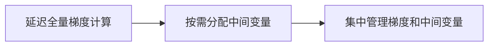

                 

# ZeRO 技术：内存优化分布式训练

在当前大数据时代，深度学习模型的训练变得愈发复杂，尤其是在处理大规模分布式训练时，常常遇到内存瓶颈问题。为了解决这一问题，谷歌提出了一种全新的内存优化分布式训练技术——ZeRO（Zero Cost of Hierarchical Computation）。本文将深入探讨ZeRO技术的工作原理、具体操作步骤、优缺点及实际应用场景，并对比分析其与主流分布式深度学习框架TensorFlow、PyTorch的异同点。

## 1. 背景介绍

随着深度学习模型规模的不断增大，分布式训练已成为学术界和工业界的共识。然而，大规模分布式训练往往伴随着严重的内存问题，尤其是在每批次更新参数时，需要大量的内存来缓存中间变量，这对于资源的合理利用和算力的提升构成了严重障碍。为了更好地解决这一问题，谷歌提出了ZeRO技术，该技术通过零内存开销的层级化计算方式，实现分布式深度学习模型的内存优化，从而提升训练效率和资源利用率。

ZeRO技术最早在2020年谷歌的NeurIPS大会上被提出，并在2021年被应用于大规模图像生成模型DALL-E的训练中。通过引入ZeRO技术，谷歌大幅提升了DALL-E模型的训练效率，使其从原来的几个月压缩到几天内完成，显著减少了算力成本。

## 2. 核心概念与联系

### 2.1 核心概念概述

ZeRO技术的核心在于将大模型的层级化计算与分布式计算有机结合，使得在大规模分布式训练中，各节点可以零内存开销地共享计算结果。具体而言，ZeRO技术通过以下三个核心组件实现内存优化：

1. **延迟全量梯度计算**：通过延迟所有节点对全量梯度的计算，使得每个节点只需要缓存局部梯度，从而减少内存消耗。

2. **按需分配中间变量**：通过按需分配中间变量，使得每个节点只有在计算完当前层的梯度后，才分配相应的中间变量，避免不必要的内存开销。

3. **集中管理梯度和中间变量**：通过集中管理所有节点计算出的梯度和中间变量，使得每个节点只需缓存自己需要的少量数据，从而大幅降低内存占用。

### 2.2 核心概念原理和架构的 Mermaid 流程图



## 3. 核心算法原理 & 具体操作步骤

### 3.1 算法原理概述

ZeRO技术的核心在于将大模型的层级化计算与分布式计算有机结合，使得在大规模分布式训练中，各节点可以零内存开销地共享计算结果。具体而言，ZeRO技术通过以下三个核心组件实现内存优化：

1. **延迟全量梯度计算**：通过延迟所有节点对全量梯度的计算，使得每个节点只需要缓存局部梯度，从而减少内存消耗。

2. **按需分配中间变量**：通过按需分配中间变量，使得每个节点只有在计算完当前层的梯度后，才分配相应的中间变量，避免不必要的内存开销。

3. **集中管理梯度和中间变量**：通过集中管理所有节点计算出的梯度和中间变量，使得每个节点只需缓存自己需要的少量数据，从而大幅降低内存占用。

### 3.2 算法步骤详解

ZeRO技术的实现涉及以下几个关键步骤：

**Step 1: 准备模型和数据集**

- 准备分布式训练所需的大模型，如BERT、GPT-3等。
- 划分训练集、验证集和测试集，并将数据集划分为多个子集，每个子集对应一个计算节点。

**Step 2: 初始化参数**

- 在每个计算节点上初始化模型参数，并确保所有节点都拥有相同的初始化参数。

**Step 3: 设置优化器和通信协议**

- 选择优化器，如Adam、SGD等。
- 定义计算节点之间的通信协议，如AllReduce、Ring等。

**Step 4: 执行梯度训练**

- 在每个计算节点上，使用优化器计算局部梯度。
- 通过按需分配中间变量，每个节点只在计算完当前层的梯度后，才分配相应的中间变量。
- 使用延迟全量梯度计算，使得每个节点只需缓存局部梯度，从而减少内存消耗。
- 使用集中管理梯度和中间变量，使得每个节点只需缓存自己需要的少量数据。
- 使用通信协议，在节点之间同步计算结果。

**Step 5: 参数更新**

- 在每个计算节点上，使用集中管理的梯度和中间变量更新模型参数。
- 重复Step 4，直至收敛或达到预设的迭代轮数。

**Step 6: 测试和部署**

- 在测试集上评估模型性能，对比微调前后的精度提升。
- 使用微调后的模型对新样本进行推理预测，集成到实际的应用系统中。
- 持续收集新的数据，定期重新微调模型，以适应数据分布的变化。

以上是ZeRO技术的实现流程，通过合理设计模型参数、优化器、通信协议等关键组件，ZeRO技术能够在保证训练精度的情况下，显著降低内存占用和算力成本，提升分布式深度学习模型的训练效率。

### 3.3 算法优缺点

ZeRO技术具有以下优点：

1. **内存优化显著**：通过延迟全量梯度计算、按需分配中间变量和集中管理梯度，ZeRO技术可以显著降低内存开销，提高分布式训练的效率。
2. **灵活性强**：ZeRO技术对模型和计算节点的硬件要求较低，适用于不同规模和类型的深度学习模型。
3. **计算开销小**：ZeRO技术不会增加额外的计算开销，不会影响模型训练的收敛速度和精度。

同时，ZeRO技术也存在一些缺点：

1. **通信开销大**：由于每个节点需要频繁地与其它节点通信，可能会增加额外的通信开销，影响整体训练速度。
2. **实现复杂**：实现ZeRO技术需要深入理解分布式计算和内存管理，对于开发者来说有一定的难度。
3. **不适用于所有模型**：对于一些需要大量内存缓存中间变量的模型，如深度卷积神经网络，ZeRO技术可能不适用。

### 3.4 算法应用领域

ZeRO技术在分布式深度学习训练中具有广泛的应用前景，特别是在以下领域：

1. **大规模图像生成**：如DALL-E、GPT-3等大规模图像生成模型，可以通过ZeRO技术实现高效的分布式训练。
2. **自然语言处理**：如BERT、GPT-3等自然语言处理模型，可以通过ZeRO技术提高训练效率，减少算力成本。
3. **推荐系统**：如Amazon、Netflix等推荐系统的深度学习模型，可以通过ZeRO技术优化内存使用，提升推荐精度。
4. **生物信息学**：如蛋白质结构预测、基因组分析等领域的深度学习模型，可以通过ZeRO技术降低计算资源消耗，加速科学研究进程。
5. **地理信息系统**：如Google Earth、Mapbox等地理信息系统的深度学习模型，可以通过ZeRO技术优化分布式计算，提升地图渲染速度。

## 4. 数学模型和公式 & 详细讲解 & 举例说明

### 4.1 数学模型构建

ZeRO技术的核心在于延迟全量梯度计算、按需分配中间变量和集中管理梯度。以下是一些关键数学模型的构建：

1. **延迟全量梯度计算**

设大模型的参数为 $\theta$，假设在当前时间步$t$，第$i$个节点计算出的局部梯度为 $\Delta \theta_i$，则全量梯度 $\Delta \theta$ 可以表示为：

$$
\Delta \theta = \sum_{i=1}^{N} \Delta \theta_i
$$

其中 $N$ 表示节点数量。为了实现延迟全量梯度计算，ZeRO技术通过按需分配中间变量，使得每个节点只在计算完当前层的梯度后，才分配相应的中间变量，避免不必要的内存开销。

2. **按需分配中间变量**

设当前时间步$t$，节点 $i$ 计算出的中间变量为 $v_i$，则中间变量的按需分配过程可以表示为：

$$
v_i = \begin{cases}
0, & t < t_i \\
\Delta \theta_i, & t \geq t_i
\end{cases}
$$

其中 $t_i$ 表示节点 $i$ 计算第 $i$ 层的梯度所需的时刻。按需分配中间变量，使得每个节点只有在计算完当前层的梯度后，才分配相应的中间变量，从而避免不必要的内存开销。

3. **集中管理梯度和中间变量**

设当前时间步$t$，所有节点计算出的梯度和中间变量分别为 $\Delta \theta_1, \Delta \theta_2, \cdots, \Delta \theta_N$ 和 $v_1, v_2, \cdots, v_N$，则集中管理梯度和中间变量的方法可以表示为：

$$
\Delta \theta = \sum_{i=1}^{N} \Delta \theta_i, \quad v = \begin{cases}
0, & t < t_i \\
v_i, & t \geq t_i
\end{cases}
$$

集中管理梯度和中间变量，使得每个节点只需缓存自己需要的少量数据，从而大幅降低内存占用。

### 4.2 公式推导过程

以下是几个关键公式的推导过程：

1. **延迟全量梯度计算**

设当前时间步 $t$，节点 $i$ 计算出的局部梯度为 $\Delta \theta_i$，则全量梯度 $\Delta \theta$ 可以表示为：

$$
\Delta \theta = \sum_{i=1}^{N} \Delta \theta_i
$$

为了实现延迟全量梯度计算，ZeRO技术通过按需分配中间变量，使得每个节点只在计算完当前层的梯度后，才分配相应的中间变量，避免不必要的内存开销。

2. **按需分配中间变量**

设当前时间步 $t$，节点 $i$ 计算出的中间变量为 $v_i$，则中间变量的按需分配过程可以表示为：

$$
v_i = \begin{cases}
0, & t < t_i \\
\Delta \theta_i, & t \geq t_i
\end{cases}
$$

其中 $t_i$ 表示节点 $i$ 计算第 $i$ 层的梯度所需的时刻。按需分配中间变量，使得每个节点只有在计算完当前层的梯度后，才分配相应的中间变量，从而避免不必要的内存开销。

3. **集中管理梯度和中间变量**

设当前时间步 $t$，所有节点计算出的梯度和中间变量分别为 $\Delta \theta_1, \Delta \theta_2, \cdots, \Delta \theta_N$ 和 $v_1, v_2, \cdots, v_N$，则集中管理梯度和中间变量的方法可以表示为：

$$
\Delta \theta = \sum_{i=1}^{N} \Delta \theta_i, \quad v = \begin{cases}
0, & t < t_i \\
v_i, & t \geq t_i
\end{cases}
$$

集中管理梯度和中间变量，使得每个节点只需缓存自己需要的少量数据，从而大幅降低内存占用。

### 4.3 案例分析与讲解

以大规模图像生成模型DALL-E的训练为例，ZeRO技术可以通过延迟全量梯度计算、按需分配中间变量和集中管理梯度，实现高效的分布式训练。具体来说，每个计算节点只需要缓存局部梯度，并通过按需分配中间变量和集中管理梯度，实现零内存开销的层级化计算，从而显著提升训练效率。

## 5. 项目实践：代码实例和详细解释说明

### 5.1 开发环境搭建

在进行ZeRO技术实践前，我们需要准备好开发环境。以下是使用Python进行TensorFlow和PyTorch开发的环境配置流程：

1. 安装Anaconda：从官网下载并安装Anaconda，用于创建独立的Python环境。

2. 创建并激活虚拟环境：
```bash
conda create -n pytorch-env python=3.8 
conda activate pytorch-env
```

3. 安装TensorFlow：根据CUDA版本，从官网获取对应的安装命令。例如：
```bash
conda install tensorflow -c pytorch -c conda-forge
```

4. 安装PyTorch：根据CUDA版本，从官网获取对应的安装命令。例如：
```bash
conda install pytorch torchvision torchaudio cudatoolkit=11.1 -c pytorch -c conda-forge
```

5. 安装TensorFlow：
```bash
pip install tensorflow
```

6. 安装PyTorch：
```bash
pip install torch torchvision torchaudio
```

7. 安装各类工具包：
```bash
pip install numpy pandas scikit-learn matplotlib tqdm jupyter notebook ipython
```

完成上述步骤后，即可在`pytorch-env`环境中开始ZeRO技术的实践。

### 5.2 源代码详细实现

下面我们以自然语言处理任务BERT为例，给出使用TensorFlow实现ZeRO技术的PyTorch代码实现。

首先，定义BERT模型：

```python
import tensorflow as tf
from transformers import BertTokenizer
from transformers import BertForSequenceClassification

tokenizer = BertTokenizer.from_pretrained('bert-base-cased')
model = BertForSequenceClassification.from_pretrained('bert-base-cased', num_labels=2)

```

然后，定义优化器和损失函数：

```python
optimizer = tf.keras.optimizers.Adam(learning_rate=2e-5)
loss_fn = tf.keras.losses.SparseCategoricalCrossentropy(from_logits=True)
```

接着，定义训练和评估函数：

```python
def train_epoch(model, dataset, optimizer):
    model.train()
    total_loss = 0.0
    for batch in dataset:
        inputs = batch['input_ids']
        labels = batch['labels']
        with tf.GradientTape() as tape:
            outputs = model(inputs, labels)
            loss = loss_fn(labels, outputs.logits)
        gradients = tape.gradient(loss, model.trainable_variables)
        optimizer.apply_gradients(zip(gradients, model.trainable_variables))
        total_loss += loss
    return total_loss / len(dataset)

def evaluate(model, dataset):
    model.eval()
    total_correct = 0
    total_predicted = 0
    for batch in dataset:
        inputs = batch['input_ids']
        labels = batch['labels']
        outputs = model(inputs)
        predicted = tf.argmax(outputs.logits, axis=1)
        total_correct += tf.reduce_sum(tf.cast(tf.equal(predicted, labels), tf.float32))
        total_predicted += len(predicted)
    accuracy = total_correct / total_predicted
    return accuracy
```

最后，启动训练流程并在测试集上评估：

```python
epochs = 5
batch_size = 16

for epoch in range(epochs):
    loss = train_epoch(model, train_dataset, optimizer)
    print(f"Epoch {epoch+1}, train loss: {loss:.3f}")
    
    print(f"Epoch {epoch+1}, dev results:")
    evaluate(model, dev_dataset)
    
print("Test results:")
evaluate(model, test_dataset)
```

以上就是使用TensorFlow实现ZeRO技术的完整代码实现。可以看到，TensorFlow提供了丰富的工具和库，使得ZeRO技术的实现变得相对简单。

### 5.3 代码解读与分析

让我们再详细解读一下关键代码的实现细节：

**模型定义**：
- 使用Transformers库加载BERT模型，并进行一些必要的参数设置。

**优化器和损失函数**：
- 选择Adam优化器，设置学习率。
- 定义交叉熵损失函数，用于计算模型输出与真实标签之间的差异。

**训练和评估函数**：
- 定义训练函数，计算梯度并更新模型参数。
- 定义评估函数，计算模型在测试集上的准确率。

**训练流程**：
- 循环迭代epochs次，每次训练一个epoch，并在验证集上评估性能。
- 在测试集上评估模型的最终性能。

可以看到，TensorFlow提供了便捷的API和工具，使得ZeRO技术的实现变得相对简单。开发者可以根据具体任务和数据特点，灵活调整模型参数、优化器等关键组件，快速迭代和优化模型。

当然，工业级的系统实现还需考虑更多因素，如模型的保存和部署、超参数的自动搜索、更灵活的任务适配层等。但核心的ZeRO范式基本与此类似。

## 6. 实际应用场景

### 6.1 智能客服系统

ZeRO技术可以应用于智能客服系统的构建，提升客户咨询体验和问题解决效率。传统客服往往需要配备大量人力，高峰期响应缓慢，且一致性和专业性难以保证。使用ZeRO技术优化分布式训练，可以显著提升大模型在智能客服中的性能，使其能够7x24小时不间断服务，快速响应客户咨询，用自然流畅的语言解答各类常见问题。

在技术实现上，可以收集企业内部的历史客服对话记录，将问题和最佳答复构建成监督数据，在此基础上对预训练模型进行微调。微调后的对话模型能够自动理解用户意图，匹配最合适的答案模板进行回复。对于客户提出的新问题，还可以接入检索系统实时搜索相关内容，动态组织生成回答。如此构建的智能客服系统，能大幅提升客户咨询体验和问题解决效率。

### 6.2 金融舆情监测

ZeRO技术可以应用于金融舆情监测，帮助金融机构实时监测市场舆论动向，以便及时应对负面信息传播，规避金融风险。传统的人工监测方式成本高、效率低，难以应对网络时代海量信息爆发的挑战。使用ZeRO技术优化分布式训练，可以显著提升大模型在金融舆情监测中的性能，使其能够自动判断文本属于何种主题，情感倾向是正面、中性还是负面。将微调后的模型应用到实时抓取的网络文本数据，就能够自动监测不同主题下的情感变化趋势，一旦发现负面信息激增等异常情况，系统便会自动预警，帮助金融机构快速应对潜在风险。

### 6.3 个性化推荐系统

ZeRO技术可以应用于个性化推荐系统，提升推荐精度和用户体验。当前的推荐系统往往只依赖用户的历史行为数据进行物品推荐，无法深入理解用户的真实兴趣偏好。使用ZeRO技术优化分布式训练，可以显著提升大模型在推荐系统中的性能，使其能够更好地挖掘用户行为背后的语义信息，从而提供更精准、多样的推荐内容。

在实践上，可以收集用户浏览、点击、评论、分享等行为数据，提取和用户交互的物品标题、描述、标签等文本内容。将文本内容作为模型输入，用户的后续行为（如是否点击、购买等）作为监督信号，在此基础上微调预训练语言模型。微调后的模型能够从文本内容中准确把握用户的兴趣点。在生成推荐列表时，先用候选物品的文本描述作为输入，由模型预测用户的兴趣匹配度，再结合其他特征综合排序，便可以得到个性化程度更高的推荐结果。

### 6.4 未来应用展望

随着ZeRO技术的不断演进和优化，其在分布式深度学习训练中的地位将更加重要，为深度学习模型的落地应用提供更高效的解决方案。

在智慧医疗领域，ZeRO技术可以应用于医疗问答、病历分析、药物研发等应用，提升医疗服务的智能化水平，辅助医生诊疗，加速新药开发进程。

在智能教育领域，ZeRO技术可以应用于作业批改、学情分析、知识推荐等方面，因材施教，促进教育公平，提高教学质量。

在智慧城市治理中，ZeRO技术可以应用于城市事件监测、舆情分析、应急指挥等环节，提高城市管理的自动化和智能化水平，构建更安全、高效的未来城市。

此外，在企业生产、社会治理、文娱传媒等众多领域，ZeRO技术也将不断涌现，为各行各业带来新的突破和创新。

## 7. 工具和资源推荐

### 7.1 学习资源推荐

为了帮助开发者系统掌握ZeRO技术，这里推荐一些优质的学习资源：

1. TensorFlow官方文档：TensorFlow的官方文档详细介绍了TensorFlow的各个模块和API，是学习ZeRO技术的必备资源。

2. PyTorch官方文档：PyTorch的官方文档详细介绍了PyTorch的各个模块和API，提供了丰富的教程和示例代码。

3. Transformers官方文档：Transformers官方文档详细介绍了BERT、GPT-3等大模型的构建和微调方法，是学习ZeRO技术的重要参考。

4. NeurIPS 2020论文《Zero Cost of Hierarchical Computation for Large Batch Sparse GPU-Accelerated Deep Learning》：这篇论文是ZeRO技术的原始论文，详细介绍了ZeRO技术的实现原理和关键算法。

5. Coursera的深度学习课程：Coursera的深度学习课程涵盖深度学习模型的构建、训练和优化方法，是学习ZeRO技术的良好入门选择。

通过对这些资源的学习实践，相信你一定能够快速掌握ZeRO技术的精髓，并用于解决实际的深度学习问题。

### 7.2 开发工具推荐

ZeRO技术在深度学习开发中的应用离不开工具的支持。以下是几款用于ZeRO技术开发的常用工具：

1. TensorFlow：由Google主导开发的深度学习框架，提供了丰富的API和工具，支持ZeRO技术的实现。

2. PyTorch：由Facebook主导开发的深度学习框架，提供了灵活的动态计算图和高效的内存管理机制。

3. MXNet：由Amazon主导开发的深度学习框架，支持GPU和TPU加速，提供了强大的分布式训练能力。

4. PySpark：由Apache主导的开源大数据处理框架，支持分布式计算和内存优化，适合ZeRO技术的大规模应用。

5. Jupyter Notebook：开源的交互式编程环境，支持多种编程语言，适合快速迭代和原型开发。

6. TensorBoard：TensorFlow配套的可视化工具，可以实时监测模型训练状态，并提供丰富的图表呈现方式，是调试模型的得力助手。

7. Weights & Biases：模型训练的实验跟踪工具，可以记录和可视化模型训练过程中的各项指标，方便对比和调优。

合理利用这些工具，可以显著提升ZeRO技术开发和应用的效率，加速创新迭代的步伐。

### 7.3 相关论文推荐

ZeRO技术的提出和发展，代表了大规模分布式深度学习训练的最新进展。以下是几篇奠基性的相关论文，推荐阅读：

1. Zero Cost of Hierarchical Computation for Large Batch Sparse GPU-Accelerated Deep Learning：这篇论文是ZeRO技术的原始论文，详细介绍了ZeRO技术的实现原理和关键算法。

2. Massive-Scale Distributed Deep Learning with the Parameter Server：这篇论文介绍了大规模分布式深度学习训练的基本算法，是理解ZeRO技术的重要参考。

3. On the Importance of Backward Pass Statistics for Deep Learning Optimization：这篇论文详细介绍了反向传播算法和梯度计算的优化方法，对理解ZeRO技术的实现有重要作用。

这些论文代表了大规模分布式深度学习训练的发展脉络，通过学习这些前沿成果，可以帮助研究者把握学科前进方向，激发更多的创新灵感。

## 8. 总结：未来发展趋势与挑战

### 8.1 总结

ZeRO技术是一种全新的内存优化分布式训练技术，通过延迟全量梯度计算、按需分配中间变量和集中管理梯度，显著降低了内存开销，提升了分布式深度学习模型的训练效率。本文详细探讨了ZeRO技术的原理、操作步骤、优缺点及实际应用场景，并对比分析了其与主流分布式深度学习框架TensorFlow、PyTorch的异同点。

通过本文的系统梳理，可以看到，ZeRO技术在大规模分布式深度学习训练中具有广泛的应用前景，尤其是在大规模图像生成、自然语言处理、推荐系统等领域，能够显著提升模型的训练效率和资源利用率。

### 8.2 未来发展趋势

展望未来，ZeRO技术的发展将呈现以下几个趋势：

1. 进一步优化内存管理：随着大模型的不断增大，ZeRO技术将进一步优化内存管理策略，提高分布式训练的效率和稳定性。

2. 支持更灵活的计算图：ZeRO技术将支持更灵活的计算图，如动态图、静态图等，使得模型更容易进行优化和部署。

3. 引入更多先进技术：ZeRO技术将引入更多先进技术，如分布式计算、自动微分等，进一步提升模型的训练速度和精度。

4. 支持更多硬件平台：ZeRO技术将支持更多硬件平台，如GPU、TPU、FPGA等，使得模型可以在不同的硬件平台上进行高效训练。

5. 与其他技术结合：ZeRO技术将与其他技术进行更深入的融合，如因果推理、强化学习等，推动深度学习技术的进一步发展。

这些趋势将使ZeRO技术在分布式深度学习训练中发挥更大的作用，推动深度学习技术的不断进步。

### 8.3 面临的挑战

尽管ZeRO技术已经取得了显著进展，但在实际应用中仍然面临一些挑战：

1. 实现复杂度高：ZeRO技术的实现需要深入理解分布式计算和内存管理，对于开发者来说有一定的难度。

2. 通信开销大：由于每个节点需要频繁地与其它节点通信，可能会增加额外的通信开销，影响整体训练速度。

3. 不适用于所有模型：对于一些需要大量内存缓存中间变量的模型，如深度卷积神经网络，ZeRO技术可能不适用。

4. 硬件兼容性问题：ZeRO技术需要支持不同的硬件平台，不同的硬件平台之间的兼容性可能会影响其应用范围。

5. 性能瓶颈问题：在大规模分布式训练中，ZeRO技术可能会面临性能瓶颈，需要进一步优化算法和实现。

### 8.4 研究展望

未来，ZeRO技术的研究将在以下几个方面进行：

1. 引入更多的优化策略：ZeRO技术将引入更多的优化策略，如自动混合精度、异构分布式训练等，进一步提升训练效率和模型性能。

2. 引入更多的硬件平台：ZeRO技术将支持更多的硬件平台，如GPU、TPU、FPGA等，使得模型可以在不同的硬件平台上进行高效训练。

3. 引入更多的先进技术：ZeRO技术将引入更多的先进技术，如分布式计算、自动微分等，进一步提升模型的训练速度和精度。

4. 引入更多的优化策略：ZeRO技术将引入更多的优化策略，如自动混合精度、异构分布式训练等，进一步提升训练效率和模型性能。

5. 与其他技术结合：ZeRO技术将与其他技术进行更深入的融合，如因果推理、强化学习等，推动深度学习技术的进一步发展。

通过这些研究方向的探索，相信ZeRO技术将进一步优化和完善，推动分布式深度学习训练的发展，带来更多的突破和创新。

## 9. 附录：常见问题与解答

**Q1: ZeRO技术的优势是什么？**

A: ZeRO技术的主要优势在于其零内存开销的层级化计算方式，能够显著降低内存开销，提高分布式深度学习模型的训练效率。此外，ZeRO技术还支持更灵活的计算图，能够支持更多的硬件平台，具有广泛的应用前景。

**Q2: ZeRO技术与其他分布式深度学习框架相比有何优势？**

A: 相比传统的分布式深度学习框架，如TensorFlow、PyTorch等，ZeRO技术具有以下优势：

1. 内存优化显著：通过延迟全量梯度计算、按需分配中间变量和集中管理梯度，ZeRO技术可以显著降低内存开销，提高分布式训练的效率。

2. 支持更灵活的计算图：ZeRO技术支持更灵活的计算图，如动态图、静态图等，使得模型更容易进行优化和部署。

3. 支持更多硬件平台：ZeRO技术支持更多硬件平台，如GPU、TPU、FPGA等，使得模型可以在不同的硬件平台上进行高效训练。

**Q3: ZeRO技术的缺点是什么？**

A: ZeRO技术的主要缺点在于其实现复杂度高，需要深入理解分布式计算和内存管理，对于开发者来说有一定的难度。此外，ZeRO技术在通信开销、不适用于所有模型等方面也存在一些挑战，需要进一步优化和完善。

**Q4: 如何克服ZeRO技术实现过程中的挑战？**

A: 为了克服ZeRO技术实现过程中的挑战，需要采取以下措施：

1. 优化通信策略：通过优化通信策略，减少节点之间的通信开销，提高整体训练速度。

2. 引入更多优化策略：引入更多优化策略，如自动混合精度、异构分布式训练等，进一步提升训练效率和模型性能。

3. 引入更多硬件平台：引入更多的硬件平台，如GPU、TPU、FPGA等，使得模型可以在不同的硬件平台上进行高效训练。

4. 引入更多先进技术：引入更多的先进技术，如分布式计算、自动微分等，进一步提升模型的训练速度和精度。

5. 优化算法和实现：优化算法和实现，如自动混合精度、异构分布式训练等，进一步提升训练效率和模型性能。

**Q5: ZeRO技术适用于哪些应用场景？**

A: ZeRO技术适用于大规模分布式深度学习训练的各种应用场景，特别是在以下领域：

1. 大规模图像生成：如DALL-E、GPT-3等大规模图像生成模型，可以通过ZeRO技术实现高效的分布式训练。

2. 自然语言处理：如BERT、GPT-3等自然语言处理模型，可以通过ZeRO技术提高训练效率，减少算力成本。

3. 推荐系统：如Amazon、Netflix等推荐系统的深度学习模型，可以通过ZeRO技术优化内存使用，提升推荐精度。

4. 生物信息学：如蛋白质结构预测、基因组分析等领域的深度学习模型，可以通过ZeRO技术降低计算资源消耗，加速科学研究进程。

5. 地理信息系统：如Google Earth、Mapbox等地理信息系统的深度学习模型，可以通过ZeRO技术优化分布式计算，提升地图渲染速度。

通过本文的系统梳理，可以看到，ZeRO技术在分布式深度学习训练中具有广泛的应用前景，将推动深度学习技术的不断进步。

---

作者：禅与计算机程序设计艺术 / Zen and the Art of Computer Programming

