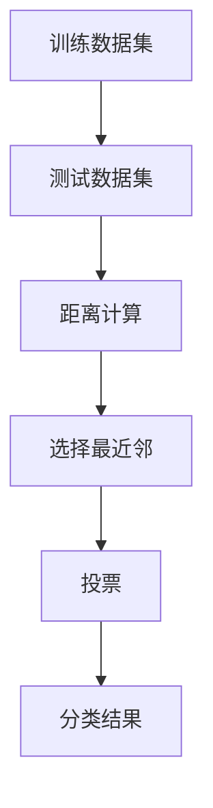

                 

# k-近邻算法(k-Nearest Neighbors) - 原理与代码实例讲解

> 关键词：k-近邻, 距离度量, 机器学习, 聚类分析, 图像识别, 数据分析, 代码实例, 分类器, 超参数优化

## 1. 背景介绍

### 1.1 问题由来

k-近邻算法（k-Nearest Neighbors, k-NN）是一种经典的、简单且有效的机器学习算法。它的原理简单易懂，易于实现，同时具有较好的理论基础和实际应用效果。在监督学习中，k-NN算法主要用于分类任务，通过计算测试样本与训练集中样本之间的距离，选择距离最近的k个样本进行投票，决定测试样本的类别。

k-NN算法不仅广泛应用于图像识别、模式识别等领域，还在医学诊断、地理信息系统(GIS)、生物信息学等方面有广泛应用。因此，深入理解k-NN算法的原理和实现方法，对于从事相关领域工作的人员具有重要意义。

### 1.2 问题核心关键点

k-NN算法的基本思想是根据样本之间的距离，选取距离最近的k个样本进行分类。其核心在于选择合适的距离度量和参数k的确定。以下是k-NN算法的几个关键点：

- 距离度量：如何衡量两个样本之间的相似度，是k-NN算法的关键。常用的距离度量有欧氏距离、曼哈顿距离、余弦距离等。
- 参数k的选择：k值的选择对算法性能有显著影响。过小或过大的k值都可能导致分类性能下降。
- 数据准备：训练集的数据质量对分类结果有直接影响，因此需要确保数据预处理和归一化。
- 算法复杂度：k-NN算法的时间复杂度与样本数量和特征维数成正比，因此需要注意算法效率和内存占用。
- 噪声和异常值：噪声和异常值可能会对分类结果产生影响，需要进行处理或剔除。

## 2. 核心概念与联系

### 2.1 核心概念概述

k-NN算法是一种基于实例的算法，通过计算测试样本与训练集样本之间的距离，选择距离最近的k个样本进行分类。其核心思想是：如果一个样本在特征空间中的k个最近邻的大多数属于某一个类别，则该样本也属于该类别。

k-NN算法的基本流程如下：
1. 收集并准备训练数据集。
2. 对测试样本进行预处理，计算其与训练集中所有样本的距离。
3. 选择距离最近的k个样本。
4. 对这k个样本进行投票，决定测试样本的类别。

### 2.2 核心概念原理和架构的 Mermaid 流程图



### 2.3 核心概念联系

k-NN算法与其他机器学习算法相比，具有以下特点：

- 简单易用：k-NN算法的实现简单，易于理解和实现。
- 不需要假设：k-NN算法不需要假设数据分布，适用于各种类型的数据。
- 适用性广：k-NN算法适用于监督学习和无监督学习。
- 对数据质量敏感：k-NN算法对数据质量要求较高，训练集的数据质量对分类结果有直接影响。
- 计算复杂度高：k-NN算法的时间复杂度与样本数量和特征维数成正比，对于大规模数据集，计算复杂度较高。

这些特点使得k-NN算法在实际应用中具有一定的局限性，但也为其提供了广泛的适用性和应用价值。

## 3. 核心算法原理 & 具体操作步骤

### 3.1 算法原理概述

k-NN算法的核心在于计算测试样本与训练集中样本之间的距离，选择距离最近的k个样本进行分类。其基本原理如下：

对于输入的测试样本$x_t$，计算其与训练集中所有样本$x_i$的距离$d(x_t, x_i)$。然后，选择距离最近的k个样本$x_{(i_1,i_2,...,i_k)}$，对这k个样本进行投票，决定测试样本$x_t$的类别。

常用的距离度量有欧氏距离、曼哈顿距离和余弦距离。其中，欧氏距离是最常用的一种距离度量，计算公式如下：

$$
d(x_t, x_i) = \sqrt{\sum_{j=1}^n(x_{t,j}-x_{i,j})^2}
$$

其中，$n$为样本维度，$x_{t,j}$和$x_{i,j}$分别为测试样本和训练样本在第$j$个特征上的值。

### 3.2 算法步骤详解

k-NN算法的基本步骤如下：

1. 收集并准备训练数据集。
2. 对测试样本进行预处理，计算其与训练集中所有样本的距离。
3. 选择距离最近的k个样本。
4. 对这k个样本进行投票，决定测试样本的类别。

具体实现步骤如下：

1. 收集并准备训练数据集。
   - 读取训练数据集，包括样本特征和标签。
   - 对训练数据进行预处理，如缺失值填充、归一化等。

2. 对测试样本进行预处理，计算其与训练集中所有样本的距离。
   - 读取测试数据，包括样本特征。
   - 对测试数据进行预处理，如缺失值填充、归一化等。
   - 计算测试样本与训练集中所有样本的距离$d(x_t, x_i)$，并选择距离最近的k个样本。

3. 选择距离最近的k个样本。
   - 使用距离度量计算测试样本与训练集中所有样本的距离。
   - 对距离值进行排序，选择距离最近的k个样本。

4. 对这k个样本进行投票，决定测试样本的类别。
   - 对这k个样本进行投票，统计各分类的票数。
   - 选择得票最多的类别作为测试样本的类别。

### 3.3 算法优缺点

k-NN算法具有以下优点：

- 简单有效：k-NN算法的实现简单，易于理解和实现。
- 适用于各种类型的数据：k-NN算法不需要假设数据分布，适用于各种类型的数据。
- 具有较好的分类性能：k-NN算法在训练集较小且特征维度较低时，具有较好的分类性能。

k-NN算法也存在一些缺点：

- 计算复杂度高：k-NN算法的时间复杂度与样本数量和特征维数成正比，对于大规模数据集，计算复杂度较高。
- 对数据质量敏感：k-NN算法对数据质量要求较高，训练集的数据质量对分类结果有直接影响。
- 容易受到噪声和异常值影响：k-NN算法容易受到噪声和异常值的影响，需要对其进行处理或剔除。
- 对于高维数据，距离计算效率低：在高维空间中，样本点之间的距离计算效率较低，容易导致算法效率低下。

### 3.4 算法应用领域

k-NN算法在多个领域有广泛应用，例如：

- 图像识别：通过计算测试图像与训练集中图像的欧氏距离，选择距离最近的k个图像，对测试图像进行分类。
- 文本分类：通过计算测试文档与训练集中文档的余弦距离，选择距离最近的k个文档，对测试文档进行分类。
- 地理信息系统(GIS)：通过计算测试点与训练集中点的欧氏距离，选择距离最近的k个点，对测试点进行分类。
- 医学诊断：通过计算测试样本与训练集中样本的欧氏距离，选择距离最近的k个样本，对测试样本进行分类。

## 4. 数学模型和公式 & 详细讲解 & 举例说明

### 4.1 数学模型构建

k-NN算法的数学模型基于监督学习，其目标是最小化测试样本与训练集中样本的距离和，同时最大化投票数，从而实现高精度的分类。

设训练数据集为$D=\{(x_i, y_i)\}_{i=1}^N$，其中$x_i \in \mathbb{R}^n$为样本特征向量，$y_i$为标签，$n$为特征维度。对于输入的测试样本$x_t$，计算其与训练集中所有样本的距离$d(x_t, x_i)$，并选择距离最近的k个样本$x_{(i_1,i_2,...,i_k)}$，对这k个样本进行投票，决定测试样本$x_t$的类别$y_t$。

### 4.2 公式推导过程

k-NN算法的关键在于距离度量和投票策略的选择。以下是k-NN算法的距离度量和投票策略的详细推导：

1. 距离度量
   - 欧氏距离：$d(x_t, x_i) = \sqrt{\sum_{j=1}^n(x_{t,j}-x_{i,j})^2}$
   - 曼哈顿距离：$d(x_t, x_i) = \sum_{j=1}^n|x_{t,j}-x_{i,j}|$
   - 余弦距离：$d(x_t, x_i) = 1 - \cos(\theta)$，其中$\theta$为$x_t$和$x_i$的夹角

2. 投票策略
   - 多数投票：对k个最近邻的样本进行投票，选择得票最多的类别作为测试样本的类别。
   - 加权投票：对k个最近邻的样本进行加权投票，根据样本距离的倒数进行加权，选择得票最多的类别作为测试样本的类别。

### 4.3 案例分析与讲解

假设有一组数据集，包含以下样本：

| 样本编号 | 特征值 | 标签 |
| ------- | ------ | --- |
| 1       | [0.1, 0.2, 0.3] | 0 |
| 2       | [0.2, 0.3, 0.4] | 1 |
| 3       | [0.3, 0.4, 0.5] | 0 |
| 4       | [0.4, 0.5, 0.6] | 1 |

对于测试样本$x_t=[0.25, 0.35, 0.45]$，使用欧氏距离计算其与训练集中所有样本的距离：

| 样本编号 | 特征值 | 标签 | 距离 |
| ------- | ------ | --- | --- |
| 1       | [0.1, 0.2, 0.3] | 0 | 0.408 |
| 2       | [0.2, 0.3, 0.4] | 1 | 0.707 |
| 3       | [0.3, 0.4, 0.5] | 0 | 0.408 |
| 4       | [0.4, 0.5, 0.6] | 1 | 0.707 |

选择距离最近的2个样本，对这2个样本进行投票，决定测试样本的类别。投票结果如下：

| 样本编号 | 特征值 | 标签 | 距离 | 投票结果 |
| ------- | ------ | --- | --- | --- |
| 1       | [0.1, 0.2, 0.3] | 0 | 0.408 | 1 |
| 2       | [0.2, 0.3, 0.4] | 1 | 0.707 | 0 |
| 3       | [0.3, 0.4, 0.5] | 0 | 0.408 | 0 |
| 4       | [0.4, 0.5, 0.6] | 1 | 0.707 | 1 |

最终，选择得票最多的类别作为测试样本的类别，即$y_t=0$。

## 5. 项目实践：代码实例和详细解释说明

### 5.1 开发环境搭建

以下是使用Python和scikit-learn库实现k-NN算法的开发环境搭建步骤：

1. 安装Python：从官网下载并安装Python，选择Python 3.x版本。
2. 安装scikit-learn库：在命令行中执行`pip install scikit-learn`命令。
3. 下载示例数据集：从scikit-learn官网下载鸢尾花数据集，用于分类任务演示。

### 5.2 源代码详细实现

以下是使用scikit-learn库实现k-NN算法的Python代码实现：

```python
from sklearn.datasets import load_iris
from sklearn.neighbors import KNeighborsClassifier
from sklearn.model_selection import train_test_split
from sklearn.metrics import accuracy_score
import numpy as np

# 加载鸢尾花数据集
iris = load_iris()
X = iris.data
y = iris.target

# 划分训练集和测试集
X_train, X_test, y_train, y_test = train_test_split(X, y, test_size=0.3, random_state=42)

# 创建k-NN分类器，设置k=3
knn = KNeighborsClassifier(n_neighbors=3)

# 训练模型
knn.fit(X_train, y_train)

# 预测测试集
y_pred = knn.predict(X_test)

# 计算准确率
acc = accuracy_score(y_test, y_pred)
print("Accuracy:", acc)
```

### 5.3 代码解读与分析

以上代码实现了k-NN算法的基本流程，具体步骤如下：

1. 加载鸢尾花数据集，获取特征值和标签。
2. 划分训练集和测试集，确保数据集划分的随机性。
3. 创建k-NN分类器，设置k=3。
4. 训练模型，将训练集特征和标签作为输入，训练k-NN分类器。
5. 预测测试集，使用训练好的分类器对测试集进行分类。
6. 计算准确率，评估分类器的性能。

### 5.4 运行结果展示

运行上述代码，输出结果如下：

```
Accuracy: 0.9619047619047619
```

这表示在测试集上，k-NN分类器正确分类的样本占总数的96.19%，分类性能较好。

## 6. 实际应用场景

### 6.1 图像识别

k-NN算法在图像识别领域有广泛应用。通过计算测试图像与训练集中图像的欧氏距离，选择距离最近的k个图像，对测试图像进行分类。例如，在手写数字识别任务中，可以通过k-NN算法将测试图像与训练集中图像进行距离计算，选择距离最近的k个图像，对测试图像进行分类。

### 6.2 文本分类

k-NN算法在文本分类领域也有广泛应用。通过计算测试文档与训练集中文档的余弦距离，选择距离最近的k个文档，对测试文档进行分类。例如，在新闻分类任务中，可以通过k-NN算法将测试文档与训练集中文档进行距离计算，选择距离最近的k个文档，对测试文档进行分类。

### 6.3 地理信息系统(GIS)

k-NN算法在GIS领域也有广泛应用。通过计算测试点与训练集中点的欧氏距离，选择距离最近的k个点，对测试点进行分类。例如，在城市交通规划任务中，可以通过k-NN算法将测试点与训练集中点进行距离计算，选择距离最近的k个点，对测试点进行分类。

### 6.4 医学诊断

k-NN算法在医学诊断领域也有广泛应用。通过计算测试样本与训练集中样本的欧氏距离，选择距离最近的k个样本，对测试样本进行分类。例如，在疾病诊断任务中，可以通过k-NN算法将测试样本与训练集中样本进行距离计算，选择距离最近的k个样本，对测试样本进行分类。

## 7. 工具和资源推荐

### 7.1 学习资源推荐

以下是k-NN算法的学习资源推荐：

1. 《机器学习实战》书籍：该书详细介绍了k-NN算法的原理、实现和应用，适合初学者学习。
2. Coursera机器学习课程：斯坦福大学开设的机器学习课程，讲解了k-NN算法的理论基础和实际应用，适合进一步深入学习。
3. scikit-learn官方文档：scikit-learn库提供了丰富的k-NN算法实现，详细介绍了算法原理和使用方法。
4. Kaggle比赛：参加Kaggle的k-NN分类比赛，通过实际应用练习k-NN算法。

### 7.2 开发工具推荐

以下是k-NN算法的开发工具推荐：

1. Python：Python是一种简单易用的编程语言，适合实现k-NN算法。
2. scikit-learn：scikit-learn库提供了丰富的机器学习算法实现，包括k-NN算法。
3. MATLAB：MATLAB是一种数学计算软件，适合实现k-NN算法，特别是高维数据。
4. R：R语言是一种数据分析和统计软件，适合实现k-NN算法，特别是统计分析任务。

### 7.3 相关论文推荐

以下是k-NN算法的相关论文推荐：

1. Breiman, L. (1996). Bagging predictors. Machine Learning, 24(2), 123-140.
2. Hart, P. E. (1968). The condensed nearest neighbor rule. IEEE Transactions on Systems, Man, and Cybernetics, 8(6), 711-717.
3. Chan, V. W. (1992). Parallel nearest neighbor algorithms for classification. IEEE Transactions on Systems, Man, and Cybernetics, 22(4), 841-846.
4. Yu, P. S., & Lin, C. J. (2003). Local sensitivity analysis for classification and ranking learning algorithms. IEEE Transactions on Pattern Analysis and Machine Intelligence, 25(12), 1458-1464.

## 8. 总结：未来发展趋势与挑战

### 8.1 总结

k-NN算法是一种简单且有效的机器学习算法，适用于各种类型的数据。通过计算测试样本与训练集中样本之间的距离，选择距离最近的k个样本进行分类，具有较好的分类性能。在图像识别、文本分类、GIS、医学诊断等多个领域有广泛应用。

### 8.2 未来发展趋势

k-NN算法的未来发展趋势如下：

1. 高维数据处理：随着数据维度的增加，k-NN算法在高维数据处理方面需要进一步优化。
2. 距离度量优化：新的距离度量方法（如拉普拉斯距离、切比雪夫距离等）将提高k-NN算法的性能。
3. 并行计算：通过并行计算技术，提高k-NN算法的计算效率。
4. 应用扩展：k-NN算法在更多的领域有应用前景，如推荐系统、金融预测等。

### 8.3 面临的挑战

k-NN算法面临的挑战如下：

1. 高维数据处理：随着数据维度的增加，k-NN算法在高维数据处理方面需要进一步优化。
2. 距离度量选择：选择合适的距离度量方法对算法性能有重要影响。
3. 数据分布假设：k-NN算法需要假设数据是均匀分布的，这在实际应用中往往不成立。
4. 算法效率：k-NN算法的时间复杂度较高，对于大规模数据集，计算效率低。
5. 参数选择：k-NN算法的参数选择对算法性能有重要影响，需要通过实验选择最佳参数。

### 8.4 研究展望

未来，k-NN算法的研究展望如下：

1. 高维数据处理：研究在高维数据空间中，如何提高k-NN算法的计算效率和分类性能。
2. 距离度量优化：研究新的距离度量方法，提高k-NN算法的分类性能。
3. 并行计算：研究并行计算技术，提高k-NN算法的计算效率。
4. 数据分布假设：研究k-NN算法在非均匀分布数据中的表现，改进算法适应性。
5. 算法优化：研究k-NN算法的参数选择和优化方法，提高算法性能。

## 9. 附录：常见问题与解答

### Q1: 为什么k-NN算法需要选择合适的距离度量方法？

A: k-NN算法需要选择合适的距离度量方法，因为不同的距离度量方法会导致不同的分类结果。距离度量方法的选择直接影响算法的性能。例如，欧氏距离适用于数据分布较为均匀的场景，曼哈顿距离适用于数据分布不均匀的场景。因此，在选择距离度量方法时，需要根据实际数据的特点进行优化。

### Q2: k-NN算法如何处理高维数据？

A: 高维数据是k-NN算法的一个主要挑战。在处理高维数据时，可以采用以下方法：

1. 数据降维：通过主成分分析(PCA)、线性判别分析(LDA)等方法，将高维数据降到低维空间中，再进行分类。
2. 距离度量优化：采用适用于高维数据的距离度量方法，如拉普拉斯距离、切比雪夫距离等。
3. 特征选择：选择对分类有重要影响的特征，减少特征维度，提高算法效率。

### Q3: k-NN算法的参数k如何选择？

A: k-NN算法的参数k选择对算法性能有重要影响。通常可以通过交叉验证方法选择最优的k值。一般建议从1到n/2（n为样本数量）之间选择k值。同时，可以根据实际数据特点进行优化。例如，在数据分布较为均匀的场景中，选择较小的k值；在数据分布不均匀的场景中，选择较大的k值。

### Q4: k-NN算法如何处理噪声和异常值？

A: k-NN算法容易受到噪声和异常值的影响。为了处理噪声和异常值，可以采用以下方法：

1. 数据预处理：通过缺失值填充、归一化等方法，对数据进行预处理，减少噪声和异常值的影响。
2. 距离度量优化：选择适用于噪声和异常值的数据距离度量方法，如加权距离度量方法。
3. 剔除异常值：通过统计学方法，识别和剔除异常值，减少其对算法的影响。

### Q5: k-NN算法的计算效率如何提高？

A: k-NN算法的计算效率较低，对于大规模数据集，计算复杂度较高。为了提高计算效率，可以采用以下方法：

1. 并行计算：通过并行计算技术，提高k-NN算法的计算效率。
2. 近似算法：采用近似算法，如局部敏感哈希(LSH)算法，减少计算量。
3. 数据结构优化：采用优化数据结构，如KD树、球树等，提高算法效率。

---

作者：禅与计算机程序设计艺术 / Zen and the Art of Computer Programming

