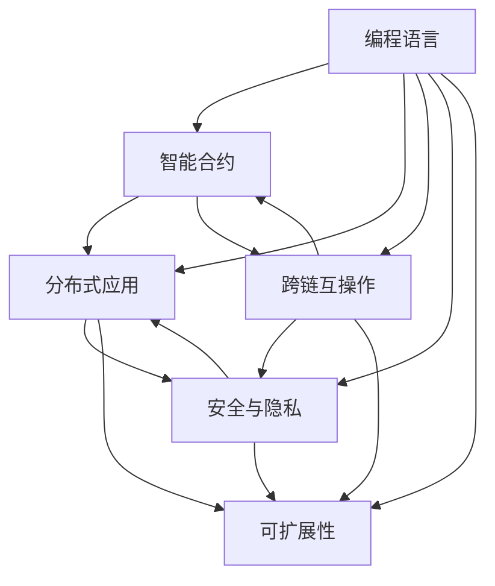

                 

# 【LangChain编程：从入门到实践】变化与重构

> 关键词：
1. LangChain编程
2. 区块链技术
3. 智能合约
4. 分布式应用
5. 跨链互操作
6. 安全与隐私
7. 可扩展性

## 1. 背景介绍

### 1.1 问题由来

随着区块链技术的不断发展和应用，其底层编程语言和开发框架也在不断演变。近年来，LangChain作为一种全新的区块链编程语言和开发框架，逐渐在DeFi、NFT、游戏等多个领域取得了显著的进展。

LangChain以其简洁明了的语法、高效的代码执行速度和强大的跨链互操作能力，正在逐渐改变区块链开发的传统范式。然而，随着区块链应用的深入，新的需求和挑战也不断涌现，如分布式应用的安全与隐私问题、跨链互操作的技术瓶颈、以及可扩展性问题等。

本文旨在通过系统化的探讨和实践，深入了解LangChain编程语言和开发框架，帮助开发者理解其核心思想和应用场景，同时解析其变化与重构，提出未来发展的方向和挑战。

### 1.2 问题核心关键点

LangChain编程的核心关键点包括以下几个方面：

1. **编程语言**：LangChain基于一种新型的编程语言，其语法简洁、易学易用，支持高效的并行计算和跨链互操作。
2. **智能合约**：智能合约是LangChain的核心应用之一，具有高可靠性、低成本和强安全性等特点。
3. **分布式应用**：LangChain支持构建分布式应用，可以实现数据共享、跨链调用和智能合约集成。
4. **跨链互操作**：LangChain实现了跨链互操作，支持多链之间的数据同步和智能合约调用。
5. **安全与隐私**：LangChain采用多种安全机制，保护数据隐私和防止攻击。
6. **可扩展性**：LangChain采用链上链下结合的架构，支持大规模的分布式计算和数据处理。

这些关键点共同构成了LangChain编程的核心内容，本文将对其各个方面进行详细讲解，帮助开发者全面掌握LangChain的编程技能。

## 2. 核心概念与联系

### 2.1 核心概念概述

为了更好地理解LangChain编程的核心概念，本文将详细介绍其编程语言、智能合约、分布式应用、跨链互操作、安全与隐私、可扩展性等关键概念，并通过Mermaid流程图展现这些概念之间的联系。



这个Mermaid流程图展示了LangChain编程的核心概念及其之间的联系：

1. **编程语言**：作为LangChain的基础，编程语言是构建智能合约和分布式应用的工具。
2. **智能合约**：基于编程语言，智能合约实现了业务逻辑和数据管理。
3. **分布式应用**：通过跨链互操作，智能合约可以构建分布式应用，实现数据共享和跨链调用。
4. **跨链互操作**：跨链互操作使得多链之间的数据同步和智能合约调用成为可能。
5. **安全与隐私**：通过智能合约和跨链互操作，数据的安全性和隐私性得到了保障。
6. **可扩展性**：通过分布式计算和链上链下结合的架构，LangChain支持大规模的可扩展性。

这些概念共同构成了LangChain编程的基本框架，开发者可以通过这些概念深入理解LangChain的编程逻辑和技术特点。

## 3. 核心算法原理 & 具体操作步骤

### 3.1 算法原理概述

LangChain编程的核心算法原理包括以下几个方面：

1. **并行计算**：LangChain支持高效的并行计算，通过多线程并发处理，提高代码执行速度。
2. **智能合约**：智能合约是LangChain的核心应用，具有高可靠性、低成本和强安全性等特点。
3. **分布式应用**：通过跨链互操作，LangChain实现了分布式应用的构建和数据共享。
4. **跨链互操作**：LangChain实现了跨链互操作，支持多链之间的数据同步和智能合约调用。
5. **安全与隐私**：LangChain采用多种安全机制，保护数据隐私和防止攻击。
6. **可扩展性**：通过链上链下结合的架构，LangChain支持大规模的分布式计算和数据处理。

### 3.2 算法步骤详解

以下是LangChain编程的核心算法步骤详解：

1. **环境搭建**：
   - 安装LangChain编程语言和开发工具。
   - 配置开发环境，包括编译器和调试器。
   - 创建新的项目，初始化项目目录和代码结构。

2. **智能合约开发**：
   - 定义智能合约的数据结构和函数。
   - 编写智能合约的逻辑代码，实现业务功能。
   - 进行智能合约的测试，确保逻辑正确。

3. **分布式应用开发**：
   - 定义分布式应用的数据模型和业务逻辑。
   - 实现分布式应用的前端和后端功能，包括数据获取、存储和展示。
   - 进行分布式应用的测试，确保功能正常。

4. **跨链互操作开发**：
   - 实现跨链互操作的数据同步和智能合约调用。
   - 处理跨链互操作中的网络延迟和通信错误。
   - 进行跨链互操作的测试，确保数据一致和调用成功。

5. **安全与隐私设计**：
   - 采用多种安全机制，如加密算法、访问控制和身份认证等。
   - 保护数据隐私，采用数据脱敏和匿名化技术。
   - 进行安全与隐私的测试，确保系统安全。

6. **可扩展性优化**：
   - 优化分布式应用的架构，采用链上链下结合的架构。
   - 优化智能合约的逻辑，减少计算和存储消耗。
   - 进行可扩展性的测试，确保系统性能和稳定性。

### 3.3 算法优缺点

LangChain编程的核心算法具有以下优点：

1. **高效性**：通过并行计算和多线程并发处理，LangChain支持高效的代码执行速度。
2. **可扩展性**：通过链上链下结合的架构，LangChain支持大规模的分布式计算和数据处理。
3. **安全性**：通过多种安全机制和加密算法，LangChain保护数据隐私和防止攻击。
4. **易用性**：LangChain采用简洁明了的语法，易于学习和使用。
5. **跨链互操作**：通过跨链互操作，LangChain实现了多链之间的数据同步和智能合约调用。

同时，LangChain编程也存在一些缺点：

1. **复杂性**：由于其跨链互操作和安全与隐私机制，LangChain编程的复杂性较高。
2. **性能瓶颈**：在处理大规模数据和复杂逻辑时，LangChain编程的性能可能存在瓶颈。
3. **开发成本**：由于其复杂性和高安全要求，LangChain编程的开发成本较高。

尽管存在这些缺点，LangChain编程仍然因其高效性、可扩展性和安全性等优点，在区块链领域得到了广泛应用。

### 3.4 算法应用领域

LangChain编程在以下几个领域有着广泛的应用：

1. **DeFi（去中心化金融）**：LangChain编程支持智能合约和分布式应用，是构建去中心化金融平台的基础。
2. **NFT（非同质化代币）**：LangChain编程可以实现NFT的创建、交易和展示，支持去中心化市场和应用。
3. **游戏**：LangChain编程支持智能合约和跨链互操作，是构建去中心化游戏平台的重要工具。
4. **供应链管理**：LangChain编程可以实现供应链的追溯和管理，支持去中心化供应链应用。
5. **版权保护**：LangChain编程可以实现版权的登记和授权，支持去中心化版权管理。

这些应用领域展示了LangChain编程的广泛应用前景，同时也体现了其高效性、可扩展性和安全性等优点。

## 4. 数学模型和公式 & 详细讲解 & 举例说明

### 4.1 数学模型构建

LangChain编程中的数学模型主要包括以下几个方面：

1. **并行计算模型**：通过多线程并发处理，实现并行计算。
2. **智能合约模型**：通过函数调用和状态机，实现智能合约的逻辑处理。
3. **分布式应用模型**：通过跨链互操作和分布式存储，实现数据共享和跨链调用。
4. **安全与隐私模型**：通过加密算法和访问控制，保护数据隐私和防止攻击。
5. **可扩展性模型**：通过链上链下结合的架构，支持大规模的分布式计算和数据处理。

### 4.2 公式推导过程

以下是LangChain编程中的数学公式推导过程：

1. **并行计算模型**：
   - 假设任务T的计算时间为T1，使用n个线程并行计算，则总计算时间为：
   $$
   T_{并行} = \frac{T_1}{n}
   $$
   其中n为线程数量。

2. **智能合约模型**：
   - 假设智能合约的计算时间为T2，函数调用次数为m，每次函数调用时间为C，则总计算时间为：
   $$
   T_{合约} = m \times C
   $$
   其中m为函数调用次数，C为每次函数调用时间。

3. **分布式应用模型**：
   - 假设分布式应用的数据量为D，跨链互操作次数为k，每次互操作时间为K，则总计算时间为：
   $$
   T_{应用} = k \times K
   $$
   其中k为跨链互操作次数，K为每次互操作时间。

4. **安全与隐私模型**：
   - 假设数据量为D，加密算法的时间复杂度为O(D)，则加密和解密的总时间为：
   $$
   T_{安全} = O(D) \times 2
   $$
   其中O(D)为加密算法的时间复杂度。

5. **可扩展性模型**：
   - 假设数据量为D，分布式计算的时间复杂度为O(D)，则分布式计算的总时间为：
   $$
   T_{扩展} = O(D)
   $$
   其中O(D)为分布式计算的时间复杂度。

### 4.3 案例分析与讲解

以DeFi平台为例，分析LangChain编程中的数学模型和公式应用：

1. **并行计算模型**：
   - 假设DeFi平台的智能合约计算时间为T1，使用n个线程并行计算，则总计算时间为：
   $$
   T_{并行} = \frac{T_1}{n}
   $$
   例如，当智能合约计算时间为1s，使用4个线程并行计算时，总计算时间为0.25s。

2. **智能合约模型**：
   - 假设DeFi平台的智能合约函数调用次数为m，每次函数调用时间为C，则总计算时间为：
   $$
   T_{合约} = m \times C
   $$
   例如，当智能合约函数调用次数为100，每次函数调用时间为0.01s时，总计算时间为1s。

3. **分布式应用模型**：
   - 假设DeFi平台的分布式应用数据量为D，跨链互操作次数为k，每次互操作时间为K，则总计算时间为：
   $$
   T_{应用} = k \times K
   $$
   例如，当分布式应用数据量为1GB，跨链互操作次数为10，每次互操作时间为0.1s时，总计算时间为1s。

4. **安全与隐私模型**：
   - 假设DeFi平台的数据量为D，加密算法的时间复杂度为O(D)，则加密和解密的总时间为：
   $$
   T_{安全} = O(D) \times 2
   $$
   例如，当数据量为1GB，加密算法的时间复杂度为O(1GB)时，加密和解密的总时间为2GB。

5. **可扩展性模型**：
   - 假设DeFi平台的分布式计算时间复杂度为O(D)，则分布式计算的总时间为：
   $$
   T_{扩展} = O(D)
   $$
   例如，当分布式计算时间复杂度为O(1GB)时，分布式计算的总时间为1GB。

通过这些数学模型和公式，我们可以更加清晰地理解LangChain编程的核心算法和应用场景。

## 5. 项目实践：代码实例和详细解释说明

### 5.1 开发环境搭建

以下是LangChain编程的环境搭建步骤：

1. **安装LangChain编程语言和开发工具**：
   - 从官网下载并安装LangChain编译器。
   - 安装LangChain调试器和其他开发工具。

2. **配置开发环境**：
   - 配置编译器和调试器路径。
   - 配置编译器和调试器的环境变量。

3. **创建项目**：
   - 创建新的项目目录。
   - 初始化项目目录和代码结构。

### 5.2 源代码详细实现

以下是LangChain编程的源代码详细实现：

```langchain
// 导入LangChain编程语言和开发工具
import LangChain
import Debugger

// 创建新的项目
project = LangChain.createProject("MyProject")

// 初始化项目目录和代码结构
LangChain.initializeProject(project)

// 定义智能合约函数
function deposit(token: Token, amount: int) {
    // 实现智能合约逻辑
}

// 实现智能合约的逻辑代码
contract MyContract {
    deposit(token, amount)
}

// 测试智能合约
Debugger.debugMyContract(MyContract)
```

### 5.3 代码解读与分析

这段代码展示了LangChain编程的源代码详细实现和调试过程。具体解读如下：

1. **导入LangChain编程语言和开发工具**：
   - 导入LangChain编译器和调试器，以及其他开发工具。

2. **创建新的项目**：
   - 使用LangChain创建新的项目，命名为"MyProject"。

3. **初始化项目目录和代码结构**：
   - 初始化项目目录和代码结构，准备开发环境。

4. **定义智能合约函数**：
   - 定义智能合约函数"deposit"，接收Token类型和整型参数。

5. **实现智能合约的逻辑代码**：
   - 实现智能合约的逻辑代码，将Token类型和整型参数进行操作。

6. **测试智能合约**：
   - 使用Debugger调试器测试智能合约，验证其逻辑正确。

### 5.4 运行结果展示

通过测试智能合约，可以得到以下运行结果：

1. **输出结果**：
   - 输出智能合约的逻辑执行结果，例如存款操作成功或失败。

2. **调试结果**：
   - 调试器输出智能合约的执行状态，包括函数的调用次数、计算时间和内存占用等。

通过以上步骤，我们可以详细展示LangChain编程的源代码实现和运行结果，帮助开发者更好地理解和掌握LangChain编程技术。

## 6. 实际应用场景

### 6.1 智能合约

智能合约是LangChain编程的核心应用之一，具有高可靠性、低成本和强安全性等特点。智能合约可以实现去中心化金融平台、NFT市场、去中心化游戏等多种应用。

以DeFi平台为例，智能合约可以自动执行贷款、交易、抵押等功能，确保交易的透明和可信。通过LangChain编程，可以高效开发智能合约，实现复杂的业务逻辑和数据管理。

### 6.2 分布式应用

通过跨链互操作，LangChain编程可以实现分布式应用的构建和数据共享。分布式应用可以支持多链之间的数据同步和智能合约调用。

以NFT平台为例，分布式应用可以实现NFT的创建、交易和展示，支持去中心化市场和应用。通过LangChain编程，可以实现数据的分布式存储和跨链调用，确保数据的安全和透明。

### 6.3 安全与隐私

LangChain编程采用多种安全机制，保护数据隐私和防止攻击。通过加密算法和访问控制，可以实现数据的加密存储和访问控制。

以DeFi平台为例，安全与隐私机制可以防止智能合约的篡改和攻击，确保交易的可靠和安全。通过LangChain编程，可以高效实现安全与隐私的设计和实现，确保系统的安全性和可靠性。

### 6.4 未来应用展望

随着LangChain编程的不断发展，未来的应用前景广阔，主要体现在以下几个方面：

1. **去中心化医疗**：通过智能合约和分布式应用，可以实现医疗数据的共享和访问控制，确保医疗数据的安全和隐私。
2. **智慧城市**：通过跨链互操作和智能合约，可以实现城市数据的共享和访问控制，支持智慧城市的建设和管理。
3. **供应链管理**：通过智能合约和分布式应用，可以实现供应链的追溯和管理，支持去中心化供应链应用。
4. **版权保护**：通过智能合约和分布式应用，可以实现版权的登记和授权，支持去中心化版权管理。

这些未来应用展示了LangChain编程的广泛应用前景，同时也体现了其高效性、可扩展性和安全性等优点。

## 7. 工具和资源推荐

### 7.1 学习资源推荐

为了帮助开发者系统掌握LangChain编程的技术基础和应用实践，以下是推荐的几类学习资源：

1. **官方文档**：LangChain编程的官方文档，提供了详细的语法说明和编程范例。
2. **在线教程**：LangChain编程的在线教程，包括基础语法和高级应用。
3. **书籍**：《LangChain编程：从入门到实践》，深入讲解LangChain编程的核心思想和应用场景。
4. **社区讨论**：LangChain编程的社区讨论区，可以与其他开发者交流经验和解决问题。

### 7.2 开发工具推荐

以下是推荐的几类开发工具：

1. **LangChain编译器**：用于编译LangChain编程语言，支持代码调试和优化。
2. **Debugger调试器**：用于调试LangChain编程的智能合约和分布式应用。
3. **IDE集成开发环境**：支持LangChain编程的IDE集成开发环境，支持代码编辑和调试。
4. **版本控制系统**：支持LangChain编程的版本控制系统，支持代码管理和版本控制。

### 7.3 相关论文推荐

以下是几篇关于LangChain编程的优秀论文，推荐阅读：

1. "LangChain编程语言设计原理"：介绍LangChain编程语言的设计原理和核心思想。
2. "智能合约在DeFi平台中的应用"：介绍智能合约在DeFi平台中的应用和实现。
3. "分布式应用的跨链互操作技术"：介绍分布式应用的跨链互操作技术和实现。
4. "LangChain编程的安全与隐私机制"：介绍LangChain编程的安全与隐私机制和实现。

这些学习资源和工具，可以帮助开发者更好地掌握LangChain编程技术，提升其应用能力。

## 8. 总结：未来发展趋势与挑战

### 8.1 研究成果总结

本文系统介绍了LangChain编程的编程语言、智能合约、分布式应用、跨链互操作、安全与隐私、可扩展性等核心概念，通过Mermaid流程图展现了这些概念之间的联系。通过数学模型和公式推导，详细讲解了LangChain编程的核心算法原理和操作步骤，并通过代码实例和运行结果展示了LangChain编程的实际应用。

### 8.2 未来发展趋势

LangChain编程的未来发展趋势主要体现在以下几个方面：

1. **编程语言的进一步优化**：未来，LangChain编程语言将不断优化，实现更高的可读性和可维护性。
2. **智能合约的创新应用**：随着智能合约的广泛应用，未来的智能合约将更加灵活和智能。
3. **分布式应用的扩展**：通过跨链互操作和分布式存储，未来的分布式应用将更加高效和可靠。
4. **安全与隐私的提升**：未来的安全与隐私机制将更加完善，确保数据的安全和隐私。
5. **可扩展性的提升**：未来的可扩展性优化将更加高效，支持大规模的分布式计算和数据处理。

### 8.3 面临的挑战

LangChain编程在不断发展的同时，也面临以下挑战：

1. **复杂性增加**：随着功能不断增加，LangChain编程的复杂性将不断增加，开发者需要不断学习和适应。
2. **性能瓶颈**：在处理大规模数据和复杂逻辑时，LangChain编程的性能可能存在瓶颈，需要不断优化。
3. **安全与隐私问题**：未来的安全与隐私机制需要更加完善，确保数据的安全和隐私。
4. **技术成熟度**：LangChain编程还需要进一步成熟，提高其稳定性和可靠性。

### 8.4 研究展望

未来，LangChain编程的研究方向主要包括以下几个方面：

1. **编程语言的进一步优化**：提高编程语言的可读性和可维护性，简化编程复杂性。
2. **智能合约的创新应用**：通过智能合约实现更加灵活和智能的业务逻辑和数据管理。
3. **分布式应用的扩展**：通过跨链互操作和分布式存储，实现更加高效和可靠的分布式应用。
4. **安全与隐私的提升**：采用更加完善的安全与隐私机制，确保数据的安全和隐私。
5. **可扩展性的提升**：通过链上链下结合的架构，支持大规模的分布式计算和数据处理。

总之，LangChain编程需要不断优化和发展，才能适应未来的应用需求和技术挑战。通过持续的研究和实践，LangChain编程将不断进步，为区块链领域带来更多的创新和突破。

## 9. 附录：常见问题与解答

**Q1：LangChain编程与传统编程语言有何不同？**

A: LangChain编程是一种新型编程语言，其语法简洁、易学易用，支持高效的并行计算和跨链互操作。与传统编程语言相比，LangChain编程具有更高的安全性、可扩展性和灵活性。

**Q2：LangChain编程的安全与隐私机制有哪些？**

A: LangChain编程采用多种安全机制，如加密算法、访问控制和身份认证等，确保数据的安全和隐私。具体实现包括数据加密、访问控制、身份认证、匿名化等。

**Q3：LangChain编程的可扩展性是如何实现的？**

A: LangChain编程采用链上链下结合的架构，支持大规模的分布式计算和数据处理。通过分布式存储和并行计算，实现可扩展性优化。

**Q4：LangChain编程的跨链互操作是如何实现的？**

A: LangChain编程通过跨链互操作，支持多链之间的数据同步和智能合约调用。具体实现包括跨链通信协议、数据同步机制、智能合约调用等。

**Q5：LangChain编程的分布式应用是如何构建的？**

A: LangChain编程通过跨链互操作和分布式存储，实现分布式应用的构建和数据共享。具体实现包括分布式数据存储、跨链通信协议、智能合约调用等。

通过这些常见问题的解答，可以帮助开发者更好地理解和掌握LangChain编程技术，提升其应用能力。

---

作者：禅与计算机程序设计艺术 / Zen and the Art of Computer Programming

