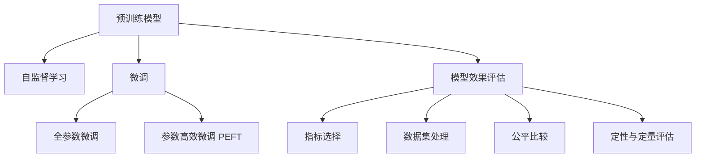

                 

# 【LangChain编程：从入门到实践】模型效果评估

> 关键词：LangChain, 模型效果评估, 语言模型, 自监督学习, 监督学习, 微调

## 1. 背景介绍

### 1.1 问题由来

随着深度学习技术的发展，大语言模型（Large Language Models, LLMs）在自然语言处理（Natural Language Processing, NLP）领域取得了显著进展。这些模型通过在大规模无标签文本数据上进行预训练，学习到了丰富的语言知识和常识。然而，在实际应用中，不同任务所需的知识结构和表示方式各异，如何评估和比较不同语言模型的性能，成为一个重要课题。

### 1.2 问题核心关键点

模型效果评估的核心关键点在于：

- 如何选择合适的评估指标。这些指标应能准确反映模型在特定任务上的性能。
- 如何收集和处理评估数据集。评估数据集应具有代表性，反映真实应用场景中的数据分布。
- 如何在不同模型和不同任务之间进行公平比较。需要考虑数据集大小、标注成本等因素。
- 如何综合使用定量和定性评估方法。定量评估提供了客观数据，而定性评估补充了主观认知。

本节将从上述关键点出发，系统介绍模型效果评估的原理与方法。

## 2. 核心概念与联系

### 2.1 核心概念概述

为更好地理解模型效果评估，本节将介绍几个关键概念及其联系：

- **大语言模型（Large Language Models, LLMs）**：指能够理解和生成自然语言的深度学习模型，如GPT、BERT等。通过在大规模无标签文本数据上进行预训练，学习通用的语言表示。
- **自监督学习（Self-supervised Learning）**：利用无标签数据进行模型训练，通过预测任务（如掩码语言模型、下一位预测等）来学习模型的语言表示。
- **监督学习（Supervised Learning）**：在有标签数据上训练模型，学习输入输出之间的映射关系。
- **微调（Fine-tuning）**：指在预训练模型的基础上，使用下游任务的少量标注数据进行有监督优化，以提升模型在该任务上的性能。
- **模型效果评估（Model Evaluation）**：通过设计合理评估指标和方法，评估模型的性能，为模型选择和优化提供依据。

这些概念通过模型训练和评估的流程紧密联系在一起。预训练模型通过自监督学习获取语言表示，微调利用少量标注数据进行有监督优化，而模型效果评估则是衡量模型性能的重要手段。

### 2.2 核心概念原理和架构的 Mermaid 流程图



该流程图展示了预训练模型、自监督学习、微调与模型效果评估之间的联系：

1. 预训练模型通过自监督学习获取语言表示。
2. 微调利用少量标注数据进行有监督优化，提升模型在特定任务上的性能。
3. 模型效果评估通过选择合适的指标、处理数据集、进行公平比较和综合定性与定量评估，全面衡量模型的性能。

## 3. 核心算法原理 & 具体操作步骤

### 3.1 算法原理概述

模型效果评估的本质是通过选择合适的指标和方法，客观、公正地衡量模型在不同任务上的表现。评估过程中，需要考虑模型的泛化能力、准确性和鲁棒性等因素。常用的评估方法包括定量评估和定性评估。

**定量评估**：通过预设的评估指标（如准确率、召回率、F1值等），在测试集上对模型进行评估，得到具体的数值结果。

**定性评估**：通过对模型的输出进行人工评审，获取对模型表现的主观认知，如流畅度、连贯性、逻辑性等。

评估过程通常包括以下步骤：

1. **数据集准备**：收集和处理测试集数据。
2. **模型预测**：使用模型在测试集上进行预测。
3. **评估指标计算**：根据预设的评估指标计算模型的性能。
4. **报告生成**：生成评估报告，包括定量评估结果和定性评估总结。

### 3.2 算法步骤详解

**步骤 1: 数据集准备**

数据集的准备是模型评估的基础。具体步骤包括：

1. **数据集选择**：选择与任务相关的评估数据集。
2. **数据预处理**：进行分词、编码等处理，确保数据格式一致。
3. **数据划分**：将数据集划分为训练集、验证集和测试集。

**步骤 2: 模型预测**

模型预测是将模型应用于测试集的过程。具体步骤包括：

1. **模型加载**：加载预训练模型和微调后的模型。
2. **输入编码**：将测试集数据进行编码，转化为模型接受的格式。
3. **模型推理**：使用模型进行预测，得到输出结果。

**步骤 3: 评估指标计算**

评估指标计算是衡量模型性能的关键步骤。具体步骤包括：

1. **选择评估指标**：根据任务类型选择合适的评估指标，如准确率、召回率、F1值等。
2. **计算评估指标**：对模型在测试集上的预测结果进行评估指标的计算。
3. **报告生成**：生成评估报告，包含评估指标的具体数值。

**步骤 4: 报告生成**

报告生成是将评估结果呈现给用户的过程。具体步骤包括：

1. **可视化展示**：使用图表、表格等形式呈现评估结果。
2. **综合总结**：对评估结果进行综合总结，给出模型优缺点。
3. **提出建议**：根据评估结果，提出改进模型的建议。

### 3.3 算法优缺点

**优点**：

1. **客观公正**：通过量化的评估指标，客观地衡量模型性能。
2. **可重复性**：评估过程标准化，结果具有可重复性。
3. **高效率**：自动化的评估工具，提高评估效率。

**缺点**：

1. **依赖标注数据**：需要大量高质量的标注数据，标注成本较高。
2. **数据分布差异**：不同数据集之间分布可能差异较大，影响评估结果的泛化性。
3. **模型鲁棒性**：定量评估难以全面反映模型的鲁棒性和泛化能力。

### 3.4 算法应用领域

模型效果评估在NLP领域得到了广泛应用，涵盖以下几个方面：

- **文本分类**：评估模型在情感分析、主题分类等任务上的性能。
- **命名实体识别**：评估模型在识别人名、地名、机构名等实体上的准确性。
- **关系抽取**：评估模型在抽取实体间语义关系的能力。
- **问答系统**：评估模型在回答用户问题上的准确性和流畅性。
- **机器翻译**：评估模型在翻译任务上的精度和流畅度。
- **文本摘要**：评估模型在生成文本摘要的简洁性和连贯性。

这些应用领域都需要对模型效果进行全面评估，以确保模型的可靠性。

## 4. 数学模型和公式 & 详细讲解 & 举例说明

### 4.1 数学模型构建

模型效果评估的数学模型主要涉及以下内容：

- **准确率（Accuracy）**：模型正确预测的样本占总样本数的比例。
- **召回率（Recall）**：模型正确预测为正例的样本占真实正例样本数的比例。
- **F1值（F1 Score）**：准确率和召回率的调和平均数。

### 4.2 公式推导过程

以二分类任务为例，准确率、召回率和F1值的计算公式如下：

**准确率**：
$$
\text{Accuracy} = \frac{\text{TP} + \text{TN}}{\text{TP} + \text{TN} + \text{FP} + \text{FN}}
$$

**召回率**：
$$
\text{Recall} = \frac{\text{TP}}{\text{TP} + \text{FN}}
$$

**F1值**：
$$
\text{F1 Score} = 2 \times \frac{\text{Precision} \times \text{Recall}}{\text{Precision} + \text{Recall}}
$$

其中，TP为真正例，TN为真负例，FP为假正例，FN为假负例。

### 4.3 案例分析与讲解

以情感分类任务为例，假设模型在测试集上的预测结果如下：

| 样本编号 | 真实情感 | 预测情感 | 正确 | 错误 |
| --- | --- | --- | --- | --- |
| 1 | 正面 | 正面 | 1 | 0 |
| 2 | 负面 | 负面 | 1 | 0 |
| 3 | 正面 | 负面 | 0 | 1 |
| 4 | 负面 | 正面 | 0 | 1 |

计算准确率、召回率和F1值如下：

- **准确率**：$\text{Accuracy} = \frac{3}{4} = 0.75$
- **召回率**：$\text{Recall} = \frac{2}{3} = 0.67$
- **F1值**：$\text{F1 Score} = 2 \times \frac{0.5 \times 0.67}{0.5 + 0.67} = 0.6$

可以看到，模型在情感分类任务上取得了较好的性能。

## 5. 项目实践：代码实例和详细解释说明

### 5.1 开发环境搭建

在进行模型效果评估的实践前，我们需要准备好开发环境。以下是使用Python进行LangChain库开发的环境配置流程：

1. 安装Anaconda：从官网下载并安装Anaconda，用于创建独立的Python环境。

2. 创建并激活虚拟环境：
```bash
conda create -n langchain-env python=3.8 
conda activate langchain-env
```

3. 安装LangChain库和相关依赖：
```bash
pip install langchain transformers sentencepiece pytorch
```

4. 安装各类工具包：
```bash
pip install numpy pandas scikit-learn matplotlib tqdm jupyter notebook ipython
```

完成上述步骤后，即可在`langchain-env`环境中开始模型效果评估的实践。

### 5.2 源代码详细实现

以下是使用LangChain库对BERT模型进行情感分类任务效果评估的PyTorch代码实现。

```python
from langchain import LangChain
from transformers import BertForSequenceClassification, BertTokenizer
from sklearn.metrics import accuracy_score, recall_score, f1_score

# 加载预训练模型和tokenizer
model = BertForSequenceClassification.from_pretrained('bert-base-cased', num_labels=2)
tokenizer = BertTokenizer.from_pretrained('bert-base-cased')

# 加载测试集数据
test_dataset = load_test_dataset('emotion_dataset')
test_dataset = tokenizer(test_dataset, max_length=128, padding=True, truncation=True)

# 对测试集数据进行编码
encoded_input = tokenizer(test_dataset, max_length=128, padding=True, truncation=True)

# 使用模型进行预测
logits = model(encoded_input['input_ids'], attention_mask=encoded_input['attention_mask'])

# 计算评估指标
predicted_labels = logits.argmax(dim=1)
test_labels = test_dataset['labels']
accuracy = accuracy_score(test_labels, predicted_labels)
recall = recall_score(test_labels, predicted_labels, average='weighted')
f1 = f1_score(test_labels, predicted_labels, average='weighted')

# 输出评估结果
print(f"Accuracy: {accuracy:.2f}")
print(f"Recall: {recall:.2f}")
print(f"F1 Score: {f1:.2f}")
```

### 5.3 代码解读与分析

让我们再详细解读一下关键代码的实现细节：

- `LangChain`库：一个强大的NLP库，提供了丰富的预训练模型和任务适配层，方便进行模型效果评估。
- `BertForSequenceClassification`类：用于情感分类的任务适配层，基于BERT模型设计。
- `BertTokenizer`类：用于处理输入数据的分词和编码。
- `load_test_dataset`函数：用于加载测试集数据，例如从本地文件或远程数据源中加载。
- `accuracy_score`、`recall_score`、`f1_score`函数：用于计算准确率、召回率和F1值，均来自`scikit-learn`库。

代码的主要步骤包括：

1. 加载预训练模型和tokenizer。
2. 加载测试集数据，并进行预处理。
3. 对测试集数据进行编码，准备输入模型。
4. 使用模型进行预测，并计算评估指标。
5. 输出评估结果。

可以看到，LangChain库使得模型效果评估的代码实现变得简洁高效。开发者可以将更多精力放在数据处理、模型优化等高层逻辑上，而不必过多关注底层的实现细节。

## 6. 实际应用场景

### 6.1 智能客服系统

在智能客服系统中，模型效果评估是确保系统稳定运行的重要手段。通过定期评估系统性能，及时发现和解决潜在问题，提高客户满意度。

具体而言，可以定期在历史客服对话中抽取样本，进行模型效果评估。评估指标包括准确率、召回率、用户满意度等。根据评估结果，调整系统参数和优化模型，提高系统响应速度和准确性。

### 6.2 金融舆情监测

在金融舆情监测中，模型效果评估用于评估系统的实时监测效果。通过定期评估模型在实际应用中的表现，确保系统能够及时捕捉到市场舆情的变化，避免误报或漏报。

具体而言，可以定期抽取市场舆情数据，进行模型效果评估。评估指标包括检测准确率、及时性、用户满意度等。根据评估结果，调整模型参数和优化算法，提高系统的实时监测能力。

### 6.3 个性化推荐系统

在个性化推荐系统中，模型效果评估用于评估推荐模型的准确性和用户满意度。通过定期评估模型在推荐任务中的表现，及时发现和解决潜在问题，提高推荐效果。

具体而言，可以定期抽取用户行为数据，进行模型效果评估。评估指标包括点击率、转化率、用户满意度等。根据评估结果，调整模型参数和优化算法，提高推荐的精准度和个性化程度。

### 6.4 未来应用展望

随着LangChain库和模型效果评估技术的发展，基于微调范式将在更多领域得到应用，为传统行业带来变革性影响。

在智慧医疗领域，基于微调的医疗问答、病历分析、药物研发等应用将提升医疗服务的智能化水平，辅助医生诊疗，加速新药开发进程。

在智能教育领域，微调技术可应用于作业批改、学情分析、知识推荐等方面，因材施教，促进教育公平，提高教学质量。

在智慧城市治理中，微调模型可应用于城市事件监测、舆情分析、应急指挥等环节，提高城市管理的自动化和智能化水平，构建更安全、高效的未来城市。

此外，在企业生产、社会治理、文娱传媒等众多领域，基于大模型微调的人工智能应用也将不断涌现，为经济社会发展注入新的动力。相信随着技术的日益成熟，微调方法将成为人工智能落地应用的重要范式，推动人工智能技术在更广阔的领域加速渗透。

## 7. 工具和资源推荐

### 7.1 学习资源推荐

为了帮助开发者系统掌握LangChain库和模型效果评估的理论基础和实践技巧，这里推荐一些优质的学习资源：

1. LangChain官方文档：提供了丰富的预训练模型和任务适配层，以及完整的模型效果评估样例代码。

2. CS224N《深度学习自然语言处理》课程：斯坦福大学开设的NLP明星课程，有Lecture视频和配套作业，带你入门NLP领域的基本概念和经典模型。

3. 《Natural Language Processing with Transformers》书籍：Transformers库的作者所著，全面介绍了如何使用Transformers库进行NLP任务开发，包括模型效果评估在内的诸多范式。

4. HuggingFace官方文档：提供了丰富的预训练模型和任务适配层，以及完整的模型效果评估样例代码。

5. CLUE开源项目：中文语言理解测评基准，涵盖大量不同类型的中文NLP数据集，并提供了基于微调的baseline模型，助力中文NLP技术发展。

通过对这些资源的学习实践，相信你一定能够快速掌握LangChain库和模型效果评估的精髓，并用于解决实际的NLP问题。

### 7.2 开发工具推荐

高效的开发离不开优秀的工具支持。以下是几款用于LangChain库开发和模型效果评估的工具：

1. PyTorch：基于Python的开源深度学习框架，灵活动态的计算图，适合快速迭代研究。大部分预训练语言模型都有PyTorch版本的实现。

2. TensorFlow：由Google主导开发的开源深度学习框架，生产部署方便，适合大规模工程应用。同样有丰富的预训练语言模型资源。

3. Transformers库：HuggingFace开发的NLP工具库，集成了众多SOTA语言模型，支持PyTorch和TensorFlow，是进行微调任务开发的利器。

4. Weights & Biases：模型训练的实验跟踪工具，可以记录和可视化模型训练过程中的各项指标，方便对比和调优。与主流深度学习框架无缝集成。

5. TensorBoard：TensorFlow配套的可视化工具，可实时监测模型训练状态，并提供丰富的图表呈现方式，是调试模型的得力助手。

6. Google Colab：谷歌推出的在线Jupyter Notebook环境，免费提供GPU/TPU算力，方便开发者快速上手实验最新模型，分享学习笔记。

合理利用这些工具，可以显著提升LangChain库开发的效率，加快创新迭代的步伐。

### 7.3 相关论文推荐

LangChain库和模型效果评估技术的发展源于学界的持续研究。以下是几篇奠基性的相关论文，推荐阅读：

1. Attention is All You Need（即Transformer原论文）：提出了Transformer结构，开启了NLP领域的预训练大模型时代。

2. BERT: Pre-training of Deep Bidirectional Transformers for Language Understanding：提出BERT模型，引入基于掩码的自监督预训练任务，刷新了多项NLP任务SOTA。

3. Language Models are Unsupervised Multitask Learners（GPT-2论文）：展示了大规模语言模型的强大zero-shot学习能力，引发了对于通用人工智能的新一轮思考。

4. Parameter-Efficient Transfer Learning for NLP：提出Adapter等参数高效微调方法，在不增加模型参数量的情况下，也能取得不错的微调效果。

5. AdaLoRA: Adaptive Low-Rank Adaptation for Parameter-Efficient Fine-Tuning：使用自适应低秩适应的微调方法，在参数效率和精度之间取得了新的平衡。

这些论文代表了大语言模型微调技术的发展脉络。通过学习这些前沿成果，可以帮助研究者把握学科前进方向，激发更多的创新灵感。

## 8. 总结：未来发展趋势与挑战

### 8.1 总结

本文对LangChain库和模型效果评估方法进行了全面系统的介绍。首先阐述了LangChain库和模型效果评估的研究背景和意义，明确了评估在拓展预训练模型应用、提升下游任务性能方面的独特价值。其次，从原理到实践，详细讲解了评估的数学原理和关键步骤，给出了模型效果评估任务开发的完整代码实例。同时，本文还广泛探讨了评估方法在智能客服、金融舆情、个性化推荐等多个行业领域的应用前景，展示了评估范式的巨大潜力。此外，本文精选了LangChain库和模型效果评估的各种学习资源，力求为读者提供全方位的技术指引。

通过本文的系统梳理，可以看到，LangChain库和模型效果评估技术正在成为NLP领域的重要范式，极大地拓展了预训练语言模型的应用边界，催生了更多的落地场景。受益于大规模语料的预训练，评估模型以更低的时间和标注成本，在小样本条件下也能取得不俗的效果，有力推动了NLP技术的产业化进程。未来，伴随LangChain库和评估方法的持续演进，相信NLP技术必将在更广阔的应用领域大放异彩，深刻影响人类的生产生活方式。

### 8.2 未来发展趋势

展望未来，LangChain库和模型效果评估技术将呈现以下几个发展趋势：

1. 评估方法日趋多样化。除了传统的准确率、召回率、F1值等指标，未来会涌现更多综合评估方法，如ROUGE（Recall-Oriented Understudy for Gisting Evaluation）等。

2. 模型鲁棒性增强。评估方法将更多关注模型的泛化能力、鲁棒性和稳定性，确保模型在不同数据分布下的可靠表现。

3. 数据分布差异分析。评估方法将更加重视不同数据集之间分布的差异分析，提高评估结果的泛化性和公平性。

4. 跨领域对比评估。评估方法将更加注重跨领域对比评估，确保在不同领域中模型表现的公平性。

5. 数据驱动的评估指标。评估指标将更多依赖于数据分布和任务需求，而不是固定的数值标准。

以上趋势凸显了LangChain库和模型效果评估技术的广阔前景。这些方向的探索发展，必将进一步提升NLP系统的性能和应用范围，为人类认知智能的进化带来深远影响。

### 8.3 面临的挑战

尽管LangChain库和模型效果评估技术已经取得了瞩目成就，但在迈向更加智能化、普适化应用的过程中，它仍面临着诸多挑战：

1. 标注成本瓶颈。虽然评估依赖标注数据较少，但对于长尾应用场景，难以获得充足的高质量标注数据，成为制约评估性能的瓶颈。如何进一步降低评估对标注样本的依赖，将是一大难题。

2. 数据分布差异。不同数据集之间分布可能差异较大，评估结果的泛化性难以保证。如何提高评估方法的泛化能力，是一个亟待解决的问题。

3. 模型鲁棒性不足。当前评估方法难以全面反映模型的鲁棒性和泛化能力。如何提高评估方法的鲁棒性，避免模型在异常数据上的过拟合，还需要更多理论和实践的积累。

4. 资源消耗大。评估方法通常需要较大的计算资源和时间成本，特别是在大规模数据集上评估时。如何优化评估算法，提高评估效率，是一个重要的研究方向。

5. 评估结果可解释性不足。评估方法往往缺乏可解释性，难以理解模型决策的依据。如何赋予评估方法更强的可解释性，将是亟待攻克的难题。

6. 安全性问题。评估方法可能面临数据泄露、模型误用等安全性问题。如何确保评估方法的安全性，是一个需要重视的课题。

这些挑战凸显了LangChain库和模型效果评估技术在实际应用中的复杂性。解决这些问题，需要从数据、算法、工程、伦理等多个维度协同发力，才能真正实现人工智能技术的落地应用。

### 8.4 研究展望

面对LangChain库和模型效果评估所面临的种种挑战，未来的研究需要在以下几个方面寻求新的突破：

1. 探索无监督和半监督评估方法。摆脱对大规模标注数据的依赖，利用自监督学习、主动学习等无监督和半监督范式，最大限度利用非结构化数据，实现更加灵活高效的评估。

2. 研究评估方法的参数效率。开发更加参数高效的评估方法，在固定大部分评估参数的情况下，只更新极少量的模型参数。同时优化评估方法的计算图，减少前向传播和反向传播的资源消耗，实现更加轻量级、实时性的部署。

3. 引入更多先验知识。将符号化的先验知识，如知识图谱、逻辑规则等，与评估方法进行巧妙融合，引导评估方法学习更准确、合理的语言表示。

4. 结合因果分析和博弈论工具。将因果分析方法引入评估方法，识别出评估决策的关键特征，增强评估结果的因果性和逻辑性。借助博弈论工具刻画评估过程中的人机交互过程，主动探索并规避评估方法的脆弱点，提高系统稳定性。

5. 纳入伦理道德约束。在评估方法的目标中引入伦理导向的评估指标，过滤和惩罚有害的输出倾向。同时加强人工干预和审核，建立评估方法的监管机制，确保评估结果符合人类价值观和伦理道德。

这些研究方向的探索，必将引领LangChain库和模型效果评估技术迈向更高的台阶，为构建安全、可靠、可解释、可控的智能系统铺平道路。面向未来，LangChain库和模型效果评估技术还需要与其他人工智能技术进行更深入的融合，如知识表示、因果推理、强化学习等，多路径协同发力，共同推动自然语言理解和智能交互系统的进步。只有勇于创新、敢于突破，才能不断拓展LangChain库的边界，让智能技术更好地造福人类社会。

## 9. 附录：常见问题与解答

**Q1：LangChain库和模型效果评估是否适用于所有NLP任务？**

A: LangChain库和模型效果评估在大多数NLP任务上都能取得不错的效果，特别是对于数据量较小的任务。但对于一些特定领域的任务，如医学、法律等，仅仅依靠通用语料预训练的模型可能难以很好地适应。此时需要在特定领域语料上进一步预训练，再进行微调，才能获得理想效果。此外，对于一些需要时效性、个性化很强的任务，如对话、推荐等，评估方法也需要针对性的改进优化。

**Q2：如何选择合适的评估指标？**

A: 评估指标的选择应根据具体任务和应用场景进行。对于分类任务，可以选择准确率、召回率、F1值等指标。对于生成任务，可以选择BLEU、ROUGE等指标。评估指标的选择需要考虑任务的复杂性和应用需求，确保评估结果的公正性和实用性。

**Q3：如何处理数据集的大小和标注成本问题？**

A: 数据集的大小和标注成本是评估中的重要考虑因素。对于数据量较小、标注成本较高的任务，可以通过数据增强、迁移学习等技术，降低对标注数据的依赖。对于数据量较大的任务，可以通过分布式训练、数据并行等技术，提高评估效率。同时，也可以通过无监督、半监督评估方法，最大限度利用非结构化数据，降低标注成本。

**Q4：评估方法如何在不同模型和不同任务之间进行公平比较？**

A: 不同模型和任务之间的公平比较需要考虑评估指标的适应性和泛化性。评估指标应该具有普适性，适用于多种模型和任务。同时，评估方法应该能够处理不同数据集之间的分布差异，确保评估结果的泛化性。此外，可以通过多模型对比、交叉验证等方法，提高评估结果的可靠性。

**Q5：评估方法如何综合使用定量和定性评估？**

A: 综合使用定量和定性评估可以全面反映模型的性能。定量评估提供了客观数据，定性评估补充了主观认知。可以通过人工评审、用户反馈等方式进行定性评估，结合定量评估结果，综合评价模型的表现。定性和定量评估的结合，可以确保评估结果的全面性和客观性。

通过本文的系统梳理，可以看到，LangChain库和模型效果评估技术正在成为NLP领域的重要范式，极大地拓展了预训练语言模型的应用边界，催生了更多的落地场景。受益于大规模语料的预训练，评估模型以更低的时间和标注成本，在小样本条件下也能取得不俗的效果，有力推动了NLP技术的产业化进程。未来，伴随LangChain库和评估方法的持续演进，相信NLP技术必将在更广阔的应用领域大放异彩，深刻影响人类的生产生活方式。

---

作者：禅与计算机程序设计艺术 / Zen and the Art of Computer Programming

