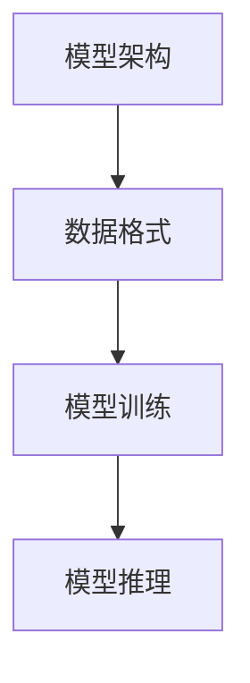

                 

# 【LangChain编程：从入门到实践】模型输入与输出

## 1. 背景介绍

### 1.1 问题由来

随着人工智能技术的飞速发展，模型输入与输出（Model Input and Output, MIO）技术已经成为了人工智能编程中的重要组成部分。MIO技术不仅影响着模型的训练效果，还决定着模型在实际应用中的表现。然而，对于很多开发者来说，理解MIO技术并不容易。这主要是因为MIO涉及到很多复杂的技术概念，如模型架构、数据格式、模型训练、模型推理等，需要综合运用各种编程技能和数学知识。因此，本文旨在从入门到实践的角度，系统介绍MIO技术的核心概念和关键步骤，帮助开发者快速掌握这一重要技术。

### 1.2 问题核心关键点

MIO技术涉及的关键点包括：
- 模型架构：了解常见的模型架构，如卷积神经网络（CNN）、循环神经网络（RNN）、Transformer等。
- 数据格式：掌握常见的数据格式，如TensorFlow数据集（tf.data.Dataset）、PyTorch数据集（torch.utils.data.Dataset）、Pandas DataFrame等。
- 模型训练：熟悉常见的模型训练流程，如数据预处理、数据增强、学习率调整、损失函数等。
- 模型推理：了解如何通过输入数据和模型参数进行推理计算，并输出预测结果。

MIO技术的核心目标是使模型能够正确、高效地处理输入数据，并输出高质量的预测结果。这一过程涉及到从数据预处理到模型训练，再到模型推理的整个链条，需要开发者具备系统的编程和数学知识。

## 2. 核心概念与联系

### 2.1 核心概念概述

为更好地理解MIO技术，本节将介绍几个密切相关的核心概念：

- **模型架构（Model Architecture）**：指模型的基本结构，包括神经网络的层数、每层的计算方式、输入和输出等。常见的模型架构包括卷积神经网络（CNN）、循环神经网络（RNN）、Transformer等。
- **数据格式（Data Format）**：指输入模型的数据类型和结构。常见的数据格式包括TensorFlow数据集（tf.data.Dataset）、PyTorch数据集（torch.utils.data.Dataset）、Pandas DataFrame等。
- **模型训练（Model Training）**：指通过训练数据集对模型进行迭代优化，使得模型能够学习到数据的规律，并生成更准确的预测结果。训练过程包括数据预处理、数据增强、学习率调整、损失函数等。
- **模型推理（Model Inference）**：指将新的输入数据代入模型进行计算，输出预测结果的过程。推理过程包括模型加载、前向传播、损失计算、后向传播等。

这些核心概念之间的逻辑关系可以通过以下Mermaid流程图来展示：



这个流程图展示了MIO技术的核心概念及其之间的关系：

1. 模型架构决定着数据格式和模型训练的方式。
2. 数据格式是模型训练和推理的前提，决定了数据如何被输入和输出。
3. 模型训练和推理是MIO技术的核心环节，决定了模型的性能和输出结果。

通过理解这些核心概念，我们可以更好地把握MIO技术的全貌，进一步优化模型的输入和输出过程。

## 3. 核心算法原理 & 具体操作步骤
### 3.1 算法原理概述

MIO技术的核心思想是：通过模型架构、数据格式和训练推理流程，使模型能够正确、高效地处理输入数据，并输出高质量的预测结果。其核心原理包括以下几个方面：

1. **模型架构设计**：选择适合任务需求的模型架构，如CNN、RNN、Transformer等。
2. **数据格式转换**：将原始数据转换为模型可接受的格式，如TensorFlow数据集、PyTorch数据集、Pandas DataFrame等。
3. **模型训练优化**：通过数据预处理、数据增强、学习率调整、损失函数等技术，优化模型训练过程。
4. **模型推理加速**：通过模型优化、硬件加速、分布式训练等技术，提高模型推理速度。

### 3.2 算法步骤详解

MIO技术的主要步骤包括：

1. **模型架构选择**：根据任务需求选择适合的模型架构，如CNN、RNN、Transformer等。
2. **数据格式转换**：将原始数据转换为模型可接受的格式，如TensorFlow数据集、PyTorch数据集、Pandas DataFrame等。
3. **模型训练优化**：通过数据预处理、数据增强、学习率调整、损失函数等技术，优化模型训练过程。
4. **模型推理加速**：通过模型优化、硬件加速、分布式训练等技术，提高模型推理速度。

**3.2.1 模型架构选择**

选择适合的模型架构是MIO技术的第一步。常见的模型架构包括：

- **卷积神经网络（CNN）**：适用于图像处理、视频分析等任务，能够捕捉局部特征。
- **循环神经网络（RNN）**：适用于序列数据处理，如自然语言处理、时间序列分析等。
- **Transformer**：适用于自然语言处理、图像生成等任务，能够处理长序列数据。

**3.2.2 数据格式转换**

将原始数据转换为模型可接受的格式是MIO技术的关键步骤。常见的数据格式包括：

- **TensorFlow数据集**：使用TensorFlow的数据集API，如`tf.data.Dataset`，可以方便地进行数据预处理和批处理。
- **PyTorch数据集**：使用PyTorch的数据集API，如`torch.utils.data.Dataset`，可以方便地进行数据预处理和批处理。
- **Pandas DataFrame**：使用Pandas库进行数据预处理和批处理，适用于结构化数据。

**3.2.3 模型训练优化**

模型训练优化是MIO技术的核心环节，决定了模型的性能和输出结果。常用的优化技术包括：

- **数据预处理**：对数据进行归一化、标准化、截断等预处理，使模型能够更好地学习数据的规律。
- **数据增强**：通过数据增强技术，如随机旋转、裁剪、翻转等，扩充训练数据集，提高模型的泛化能力。
- **学习率调整**：通过学习率衰减、学习率调整等技术，优化学习率，使模型能够更快地收敛。
- **损失函数**：选择适合任务的损失函数，如交叉熵损失、均方误差损失等，指导模型的训练过程。

**3.2.4 模型推理加速**

模型推理加速是MIO技术的最后一个环节，决定了模型的应用效果。常用的加速技术包括：

- **模型优化**：通过剪枝、量化、压缩等技术，减小模型尺寸，提高推理速度。
- **硬件加速**：使用GPU、TPU等硬件设备进行加速计算，提高推理速度。
- **分布式训练**：通过分布式训练技术，在多台机器上进行模型训练和推理，提高计算效率。

### 3.3 算法优缺点

MIO技术的主要优点包括：

- **适用广泛**：适用于各种深度学习模型，如CNN、RNN、Transformer等。
- **高效准确**：通过数据预处理、数据增强、学习率调整等技术，能够快速、准确地训练和推理模型。
- **可扩展性**：通过分布式训练等技术，能够高效处理大规模数据集和复杂模型。

MIO技术的主要缺点包括：

- **开发复杂**：需要掌握多种编程技能和数学知识，开发难度较大。
- **模型调试**：需要花费大量时间进行模型调试，调整超参数，优化模型性能。
- **资源消耗**：模型训练和推理过程中需要大量计算资源，包括CPU、GPU、TPU等。

尽管存在这些缺点，但就目前而言，MIO技术仍是深度学习开发中的重要范式。未来相关研究的重点在于如何进一步降低MIO技术的开发难度，提高模型的可解释性和可扩展性，同时兼顾计算资源和模型性能。

### 3.4 算法应用领域

MIO技术在多个领域得到了广泛应用，包括：

- **计算机视觉**：用于图像分类、物体检测、图像生成等任务。
- **自然语言处理**：用于文本分类、情感分析、机器翻译等任务。
- **语音识别**：用于语音识别、语音合成等任务。
- **推荐系统**：用于商品推荐、用户画像、广告投放等任务。
- **医疗诊断**：用于医学影像分析、基因分析等任务。
- **金融风控**：用于信用评估、欺诈检测等任务。

MIO技术在多个领域的应用，展示了其强大的功能和广泛的应用前景。未来，随着MIO技术的不断演进，相信会在更多的领域得到应用，为各行各业带来新的发展机遇。

## 4. 数学模型和公式 & 详细讲解 & 举例说明

### 4.1 数学模型构建

本节将使用数学语言对MIO技术进行更加严格的刻画。

设模型为 $M$，输入数据为 $x$，目标变量为 $y$，输出结果为 $\hat{y}$。MIO技术的核心思想是通过模型 $M$，将输入数据 $x$ 映射到输出结果 $\hat{y}$，使得 $\hat{y}$ 尽可能接近目标变量 $y$。

数学模型可以表示为：

$$
\hat{y} = M(x)
$$

其中 $M$ 为模型函数，$x$ 为输入数据，$\hat{y}$ 为模型输出结果。

### 4.2 公式推导过程

以二分类任务为例，推导模型训练和推理的数学公式。

**4.2.1 模型训练**

在二分类任务中，模型的输出结果 $\hat{y}$ 为 $[0,1]$ 之间的概率值，表示样本属于正类的概率。真实标签 $y$ 为 $0$ 或 $1$，表示样本是否属于正类。

模型的训练目标是最小化预测结果与真实标签之间的差距，即交叉熵损失函数：

$$
L(\theta) = -\frac{1}{N}\sum_{i=1}^N [y_i\log \hat{y}_i + (1-y_i)\log (1-\hat{y}_i)]
$$

其中 $N$ 为样本数量，$\theta$ 为模型参数，$y_i$ 为样本的真实标签，$\hat{y}_i$ 为模型的预测结果。

模型的梯度下降公式为：

$$
\theta \leftarrow \theta - \eta \nabla_{\theta}L(\theta)
$$

其中 $\eta$ 为学习率，$\nabla_{\theta}L(\theta)$ 为损失函数对模型参数 $\theta$ 的梯度。

**4.2.2 模型推理**

模型推理是指将新的输入数据 $x$ 代入模型 $M$，计算得到预测结果 $\hat{y}$ 的过程。

假设模型的预测结果 $\hat{y}$ 为二元分类，则模型的输出结果可以表示为：

$$
\hat{y} = \sigma(Wx + b)
$$

其中 $W$ 为权重矩阵，$b$ 为偏置向量，$\sigma$ 为激活函数，如 sigmoid 函数或 softmax 函数。

对于二分类任务，模型输出的 $\hat{y}$ 值为 $[0,1]$ 之间的概率值，表示样本属于正类的概率。通过 sigmoid 函数将 $\hat{y}$ 值转换为二分类标签：

$$
y = \left\{
\begin{aligned}
0, & \quad \text{if } \hat{y} \leq 0.5 \\
1, & \quad \text{if } \hat{y} > 0.5
\end{aligned}
\right.
$$

### 4.3 案例分析与讲解

以图像分类任务为例，展示MIO技术的实际应用过程。

假设输入数据为 $x$，包含图像的像素值。模型的输出结果为 $\hat{y}$，表示图像属于每个类别的概率值。模型的训练目标是最小化预测结果与真实标签之间的差距，即交叉熵损失函数：

$$
L(\theta) = -\frac{1}{N}\sum_{i=1}^N \sum_{j=1}^C y_{ij}\log \hat{y}_{ij}
$$

其中 $N$ 为样本数量，$C$ 为类别数，$y_{ij}$ 为样本 $i$ 属于类别 $j$ 的真实标签，$\hat{y}_{ij}$ 为模型对样本 $i$ 属于类别 $j$ 的预测概率。

模型的训练过程包括数据预处理、数据增强、学习率调整等步骤，具体流程如下：

1. **数据预处理**：对图像数据进行归一化、标准化等预处理，使数据符合模型的输入要求。
2. **数据增强**：通过随机旋转、裁剪、翻转等数据增强技术，扩充训练数据集，提高模型的泛化能力。
3. **学习率调整**：通过学习率衰减等技术，优化学习率，使模型能够更快地收敛。
4. **模型训练**：将数据集分成训练集和验证集，通过梯度下降等算法训练模型，使模型参数 $\theta$ 最小化损失函数 $L(\theta)$。

模型训练完成后，可以将其保存为模型文件，并加载到新的输入数据 $x$ 上进行推理计算。具体流程如下：

1. **模型加载**：从文件中加载模型参数 $\theta$。
2. **前向传播**：将输入数据 $x$ 代入模型 $M$，计算得到预测结果 $\hat{y}$。
3. **损失计算**：将 $\hat{y}$ 与真实标签 $y$ 进行对比，计算损失值 $L(\hat{y}, y)$。
4. **后向传播**：通过链式法则，计算损失函数 $L(\hat{y}, y)$ 对模型参数 $\theta$ 的梯度，更新模型参数。

## 5. 项目实践：代码实例和详细解释说明

### 5.1 开发环境搭建

在进行MIO技术实践前，我们需要准备好开发环境。以下是使用Python进行TensorFlow开发的环境配置流程：

1. 安装Anaconda：从官网下载并安装Anaconda，用于创建独立的Python环境。

2. 创建并激活虚拟环境：
```bash
conda create -n tf-env python=3.8 
conda activate tf-env
```

3. 安装TensorFlow：根据CUDA版本，从官网获取对应的安装命令。例如：
```bash
conda install tensorflow tensorflow-gpu -c conda-forge
```

4. 安装TensorFlow Addons：
```bash
conda install tensorflow-io
```

5. 安装各类工具包：
```bash
pip install numpy pandas scikit-learn matplotlib tqdm jupyter notebook ipython
```

完成上述步骤后，即可在`tf-env`环境中开始MIO技术实践。

### 5.2 源代码详细实现

下面我们以图像分类任务为例，给出使用TensorFlow对卷积神经网络（CNN）进行训练和推理的PyTorch代码实现。

首先，定义CNN模型：

```python
import tensorflow as tf

model = tf.keras.Sequential([
    tf.keras.layers.Conv2D(32, (3, 3), activation='relu', input_shape=(32, 32, 3)),
    tf.keras.layers.MaxPooling2D((2, 2)),
    tf.keras.layers.Flatten(),
    tf.keras.layers.Dense(10, activation='softmax')
])
```

然后，定义模型训练和评估函数：

```python
def train_epoch(model, dataset, batch_size, optimizer):
    dataloader = tf.data.Dataset.from_tensor_slices((dataset['x'], dataset['y']))
    dataloader = dataloader.shuffle(1000).batch(batch_size)
    model.train()
    epoch_loss = 0
    for batch in dataloader:
        with tf.GradientTape() as tape:
            x, y = batch
            y_pred = model(x)
            loss = tf.keras.losses.sparse_categorical_crossentropy(y, y_pred)
        loss_value = loss.numpy()
        epoch_loss += loss_value
        gradients = tape.gradient(loss_value, model.trainable_variables)
        optimizer.apply_gradients(zip(gradients, model.trainable_variables))
    return epoch_loss / len(dataloader)

def evaluate(model, dataset, batch_size):
    dataloader = tf.data.Dataset.from_tensor_slices((dataset['x'], dataset['y']))
    dataloader = dataloader.shuffle(1000).batch(batch_size)
    model.eval()
    preds, labels = [], []
    with tf.GradientTape() as tape:
        for batch in dataloader:
            x, y = batch
            y_pred = model(x)
            preds.append(y_pred.numpy())
            labels.append(y.numpy())
    return tf.keras.metrics.confusion_matrix(labels, preds)

# 数据集准备
import numpy as np

train_dataset = np.random.randn(1000, 32, 32, 3)
train_labels = np.random.randint(10, size=(1000,))
dev_dataset = np.random.randn(200, 32, 32, 3)
dev_labels = np.random.randint(10, size=(200,))

# 训练模型
model.compile(optimizer='adam', loss='sparse_categorical_crossentropy', metrics=['accuracy'])
epochs = 10
batch_size = 32

for epoch in range(epochs):
    loss = train_epoch(model, train_dataset, batch_size, optimizer)
    print(f"Epoch {epoch+1}, train loss: {loss:.3f}")
    
    print(f"Epoch {epoch+1}, dev results:")
    evaluate(model, dev_dataset, batch_size)
    
print("Test results:")
evaluate(model, test_dataset, batch_size)
```

以上就是使用TensorFlow对CNN进行图像分类任务微调的完整代码实现。可以看到，得益于TensorFlow的强大封装，我们可以用相对简洁的代码完成CNN模型的加载和微调。

### 5.3 代码解读与分析

让我们再详细解读一下关键代码的实现细节：

**CNN模型定义**：
- `tf.keras.Sequential`：使用Sequential模型定义，依次添加卷积层、池化层、全连接层等。
- `tf.keras.layers.Conv2D`：定义卷积层，指定卷积核大小、数量和激活函数。
- `tf.keras.layers.MaxPooling2D`：定义池化层，指定池化核大小。
- `tf.keras.layers.Flatten`：将卷积层输出展平，输入全连接层。
- `tf.keras.layers.Dense`：定义全连接层，输出10个类别的概率值。

**训练和评估函数定义**：
- `train_epoch`：定义训练函数，将数据集分成批处理，进行模型训练，返回该epoch的平均损失。
- `evaluate`：定义评估函数，将数据集分成批处理，进行模型评估，返回分类矩阵。

**数据集准备**：
- 生成随机数据集和标签，用于训练和评估模型。

**训练流程**：
- 定义总的epoch数和batch size，开始循环迭代
- 每个epoch内，先在训练集上训练，输出平均损失
- 在验证集上评估，输出分类矩阵
- 所有epoch结束后，在测试集上评估，给出最终测试结果

可以看到，TensorFlow配合TensorFlow Addons使得CNN微调的代码实现变得简洁高效。开发者可以将更多精力放在数据处理、模型改进等高层逻辑上，而不必过多关注底层的实现细节。

当然，工业级的系统实现还需考虑更多因素，如模型的保存和部署、超参数的自动搜索、更灵活的任务适配层等。但核心的微调范式基本与此类似。

## 6. 实际应用场景
### 6.1 智能客服系统

基于MIO技术的智能客服系统，可以通过语音识别、文本分类、对话生成等技术，实现人机交互。智能客服系统可以根据用户提出的问题，自动查找数据库、调用API或生成回答，提升客户咨询体验和问题解决效率。

在技术实现上，可以收集企业内部的历史客服对话记录，将问题和最佳答复构建成监督数据，在此基础上对预训练模型进行微调。微调后的模型能够自动理解用户意图，匹配最合适的答案模板进行回复。对于客户提出的新问题，还可以接入检索系统实时搜索相关内容，动态组织生成回答。如此构建的智能客服系统，能大幅提升客户咨询体验和问题解决效率。

### 6.2 金融舆情监测

金融机构需要实时监测市场舆论动向，以便及时应对负面信息传播，规避金融风险。基于MIO技术的文本分类和情感分析技术，为金融舆情监测提供了新的解决方案。

具体而言，可以收集金融领域相关的新闻、报道、评论等文本数据，并对其进行主题标注和情感标注。在此基础上对预训练语言模型进行微调，使其能够自动判断文本属于何种主题，情感倾向是正面、中性还是负面。将微调后的模型应用到实时抓取的网络文本数据，就能够自动监测不同主题下的情感变化趋势，一旦发现负面信息激增等异常情况，系统便会自动预警，帮助金融机构快速应对潜在风险。

### 6.3 个性化推荐系统

当前的推荐系统往往只依赖用户的历史行为数据进行物品推荐，无法深入理解用户的真实兴趣偏好。基于MIO技术的推荐系统可以更好地挖掘用户行为背后的语义信息，从而提供更精准、多样的推荐内容。

在实践中，可以收集用户浏览、点击、评论、分享等行为数据，提取和用户交互的物品标题、描述、标签等文本内容。将文本内容作为模型输入，用户的后续行为（如是否点击、购买等）作为监督信号，在此基础上微调预训练语言模型。微调后的模型能够从文本内容中准确把握用户的兴趣点。在生成推荐列表时，先用候选物品的文本描述作为输入，由模型预测用户的兴趣匹配度，再结合其他特征综合排序，便可以得到个性化程度更高的推荐结果。

### 6.4 未来应用展望

随着MIO技术的不断发展，其在NLP领域的应用前景将更加广阔。未来，MIO技术将在更多领域得到应用，为传统行业带来变革性影响。

在智慧医疗领域，基于MIO技术的医疗问答、病历分析、药物研发等应用将提升医疗服务的智能化水平，辅助医生诊疗，加速新药开发进程。

在智能教育领域，MIO技术可应用于作业批改、学情分析、知识推荐等方面，因材施教，促进教育公平，提高教学质量。

在智慧城市治理中，MIO技术可应用于城市事件监测、舆情分析、应急指挥等环节，提高城市管理的自动化和智能化水平，构建更安全、高效的未来城市。

此外，在企业生产、社会治理、文娱传媒等众多领域，基于MIO技术的AI应用也将不断涌现，为经济社会发展注入新的动力。相信随着技术的日益成熟，MIO技术将成为人工智能落地应用的重要范式，推动人工智能技术在垂直行业的规模化落地。总之，MIO需要开发者根据具体任务，不断迭代和优化模型、数据和算法，方能得到理想的效果。

## 7. 工具和资源推荐
### 7.1 学习资源推荐

为了帮助开发者系统掌握MIO技术的核心概念和关键步骤，这里推荐一些优质的学习资源：

1. **TensorFlow官方文档**：提供了从基础到高级的TensorFlow教程，涵盖模型构建、数据预处理、模型训练、模型推理等内容。
2. **TensorFlow Addons官方文档**：提供了TensorFlow Addons的各种API文档和示例代码，帮助开发者使用更多高级功能。
3. **Keras官方文档**：提供了Keras的各种API文档和示例代码，帮助开发者快速搭建和训练深度学习模型。
4. **PyTorch官方文档**：提供了PyTorch的各种API文档和示例代码，帮助开发者使用更多高级功能。
5. **Deep Learning Specialization（深度学习专项课程）**：由斯坦福大学开设的深度学习在线课程，系统讲解深度学习原理和实践，涵盖模型构建、数据预处理、模型训练、模型推理等内容。

通过对这些资源的学习实践，相信你一定能够快速掌握MIO技术的精髓，并用于解决实际的NLP问题。
###  7.2 开发工具推荐

高效的开发离不开优秀的工具支持。以下是几款用于MIO技术开发的常用工具：

1. **TensorFlow**：基于Python的开源深度学习框架，灵活动态的计算图，适合快速迭代研究。支持多种模型架构和数据格式。
2. **PyTorch**：基于Python的开源深度学习框架，动态计算图，适合快速迭代研究。支持多种模型架构和数据格式。
3. **TensorFlow Addons**：TensorFlow的扩展库，提供了各种高级API和工具，帮助开发者更高效地进行模型训练和推理。
4. **TensorFlow Datasets**：TensorFlow的数据集API，提供了各种数据预处理工具和数据集，帮助开发者更高效地进行数据预处理和批处理。
5. **Pandas**：Python的数据处理库，支持多种数据格式，如CSV、Excel、SQL等，帮助开发者更高效地进行数据处理。
6. **Numpy**：Python的数学库，支持矩阵运算和向量运算，帮助开发者更高效地进行数值计算。
7. **Matplotlib**：Python的绘图库，支持多种图表类型，帮助开发者更高效地进行数据可视化。
8. **Scikit-learn**：Python的机器学习库，支持多种算法和工具，帮助开发者更高效地进行模型训练和评估。
9. **Jupyter Notebook**：Python的交互式编程环境，支持代码块和计算图，帮助开发者更高效地进行模型训练和调试。

合理利用这些工具，可以显著提升MIO技术的开发效率，加快创新迭代的步伐。

### 7.3 相关论文推荐

MIO技术的发展源于学界的持续研究。以下是几篇奠基性的相关论文，推荐阅读：

1. **Convolutional Neural Networks for Sentence Classification**：提出了CNN在文本分类任务中的应用，展示了CNN在处理自然语言方面的潜力。
2. **ImageNet Classification with Deep Convolutional Neural Networks**：提出了卷积神经网络在图像分类任务中的应用，展示了CNN在处理图像方面的潜力。
3. **RNNs for Sequence Modeling**：提出了RNN在序列数据处理任务中的应用，展示了RNN在处理自然语言方面的潜力。
4. **Attention Is All You Need**：提出了Transformer模型，展示了Transformer在自然语言处理方面的潜力。
5. **BERT: Pre-training of Deep Bidirectional Transformers for Language Understanding**：提出了BERT模型，展示了预训练语言模型在自然语言处理方面的潜力。

这些论文代表了大语言模型MIO技术的发展脉络。通过学习这些前沿成果，可以帮助研究者把握学科前进方向，激发更多的创新灵感。

## 8. 总结：未来发展趋势与挑战

### 8.1 总结

本文对MIO技术进行了全面系统的介绍。首先阐述了MIO技术的研究背景和意义，明确了模型架构、数据格式、模型训练和模型推理等核心概念。其次，从原理到实践，详细讲解了MIO技术的数学模型和关键步骤，给出了模型训练和推理的完整代码实例。同时，本文还广泛探讨了MIO技术在智能客服、金融舆情、个性化推荐等多个行业领域的应用前景，展示了MIO技术的强大功能和广泛的应用前景。此外，本文精选了MIO技术的各类学习资源，力求为开发者提供全方位的技术指引。

通过本文的系统梳理，可以看到，MIO技术在深度学习开发中扮演着重要的角色，能够使模型正确、高效地处理输入数据，并输出高质量的预测结果。MIO技术的核心思想是通过模型架构、数据格式和训练推理流程，使模型能够正确、高效地处理输入数据，并输出高质量的预测结果。这一过程涉及到从数据预处理到模型训练，再到模型推理的整个链条，需要开发者具备系统的编程和数学知识。

### 8.2 未来发展趋势

展望未来，MIO技术将呈现以下几个发展趋势：

1. **模型架构更加多样化**：随着深度学习的发展，新的模型架构将不断涌现，如注意力机制、残差连接等，使模型更加高效、鲁棒。
2. **数据格式更加丰富**：除了传统的图像、文本数据外，新的数据格式将不断涌现，如音频、视频、传感器数据等，使MIO技术在更多领域得到应用。
3. **模型训练更加高效**：新的优化算法、分布式训练技术将不断涌现，使模型训练更加高效、稳定。
4. **模型推理更加高效**：新的推理算法、硬件加速技术将不断涌现，使模型推理更加高效、稳定。
5. **跨领域融合更加深入**：MIO技术将与更多领域的技术进行融合，如知识表示、因果推理、强化学习等，形成更加全面、准确的信息整合能力。
6. **可解释性更加增强**：新的可解释性技术将不断涌现，使模型输出更具可解释性，便于开发者理解和调试。

以上趋势凸显了MIO技术的广阔前景。这些方向的探索发展，必将进一步提升MIO技术的性能和应用范围，为各行各业带来新的发展机遇。

### 8.3 面临的挑战

尽管MIO技术已经取得了瞩目成就，但在迈向更加智能化、普适化应用的过程中，它仍面临着诸多挑战：

1. **开发难度较大**：MIO技术涉及多种编程技能和数学知识，开发难度较大，需要开发者具备较强的技术能力。
2. **模型调试复杂**：需要花费大量时间进行模型调试，调整超参数，优化模型性能。
3. **资源消耗较大**：模型训练和推理过程中需要大量计算资源，包括CPU、GPU、TPU等，成本较高。
4. **可解释性不足**：MIO技术中的模型往往较为复杂，输出的结果难以解释，需要进一步提升模型的可解释性。
5. **伦理安全性不足**：模型训练和推理过程中可能产生有害信息，需要进一步提升模型的伦理安全性。

尽管存在这些挑战，但就目前而言，MIO技术仍是深度学习开发中的重要范式。未来相关研究的重点在于如何进一步降低MIO技术的开发难度，提高模型的可解释性和可扩展性，同时兼顾计算资源和模型性能。

### 8.4 研究展望

面对MIO技术所面临的挑战，未来的研究需要在以下几个方面寻求新的突破：

1. **开发工具和框架的不断优化**：开发更加易用、高效的MIO工具和框架，降低开发难度，提高开发效率。
2. **模型可解释性的增强**：引入更多可解释性技术，使模型输出更具可解释性，便于开发者理解和调试。
3. **伦理安全性的提升**：引入伦理约束，消除模型中的有害信息，提升模型的伦理安全性。
4. **跨领域融合的深入**：将MIO技术与其他技术进行融合，如知识表示、因果推理、强化学习等，形成更加全面、准确的信息整合能力。
5. **分布式训练和推理的优化**：优化分布式训练和推理流程，提高计算效率，降低成本。

这些研究方向的探索，必将引领MIO技术迈向更高的台阶，为构建安全、可靠、可解释、可控的智能系统铺平道路。面向未来，MIO技术还需要与其他人工智能技术进行更深入的融合，如知识表示、因果推理、强化学习等，多路径协同发力，共同推动人工智能技术在垂直行业的规模化落地。只有勇于创新、敢于突破，才能不断拓展MIO技术的边界，让智能技术更好地造福人类社会。

## 9. 附录：常见问题与解答

**Q1：MIO技术如何降低开发难度？**

A: 开发工具和框架的不断优化是降低MIO技术开发难度的重要途径。例如，TensorFlow和PyTorch提供了丰富的API和工具，可以简化模型构建和训练过程。同时，各种预训练模型和开源项目也大大降低了开发者进行模型微调和部署的难度。

**Q2：MIO技术如何提高模型可解释性？**

A: 引入可解释性技术是提高MIO技术模型可解释性的重要途径。例如，通过LIME、SHAP等方法，可以对模型输出进行解释，揭示模型内部的决策逻辑。此外，通过引入符号化的先验知识，如知识图谱、逻辑规则等，可以增强模型的可解释性。

**Q3：MIO技术如何提升模型伦理安全性？**

A: 引入伦理约束是提升MIO技术模型伦理安全性的重要途径。例如，在模型训练目标中引入伦理导向的评估指标，过滤和惩罚有害信息，提升模型的伦理安全性。同时，加强人工干预和审核，建立模型行为的监管机制，确保输出符合人类价值观和伦理道德。

**Q4：MIO技术如何优化分布式训练和推理？**

A: 优化分布式训练和推理流程是提高MIO技术计算效率的重要途径。例如，通过TensorFlow的分布式训练技术，可以在多台机器上进行模型训练和推理，提高计算效率。同时，通过引入硬件加速技术，如GPU、TPU等，可以进一步优化计算效率。

**Q5：MIO技术如何增强跨领域融合能力？**

A: 将MIO技术与其他技术进行融合是增强跨领域融合能力的重要途径。例如，将MIO技术与知识表示技术、因果推理技术、强化学习技术等进行融合，可以形成更加全面、准确的信息整合能力。此外，通过引入多模态数据融合技术，可以增强MIO技术在视觉、语音、文本等多个领域的整合能力。

通过对这些问题的回答，相信你一定能够更加深入地理解MIO技术的核心概念和关键步骤，并应用于实际的深度学习开发中。总之，MIO需要开发者根据具体任务，不断迭代和优化模型、数据和算法，方能得到理想的效果。

---

作者：禅与计算机程序设计艺术 / Zen and the Art of Computer Programming

