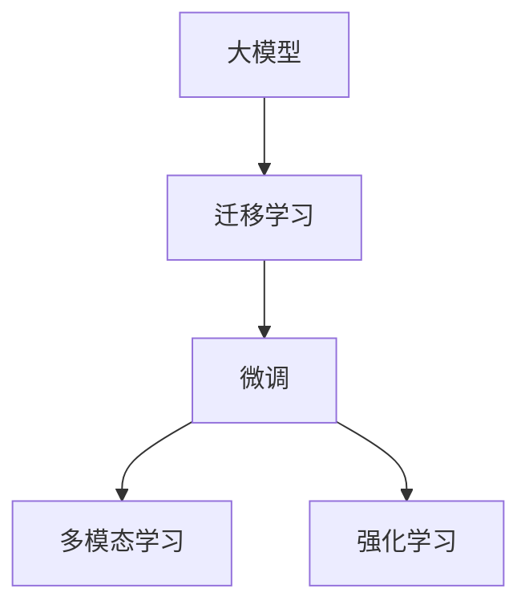
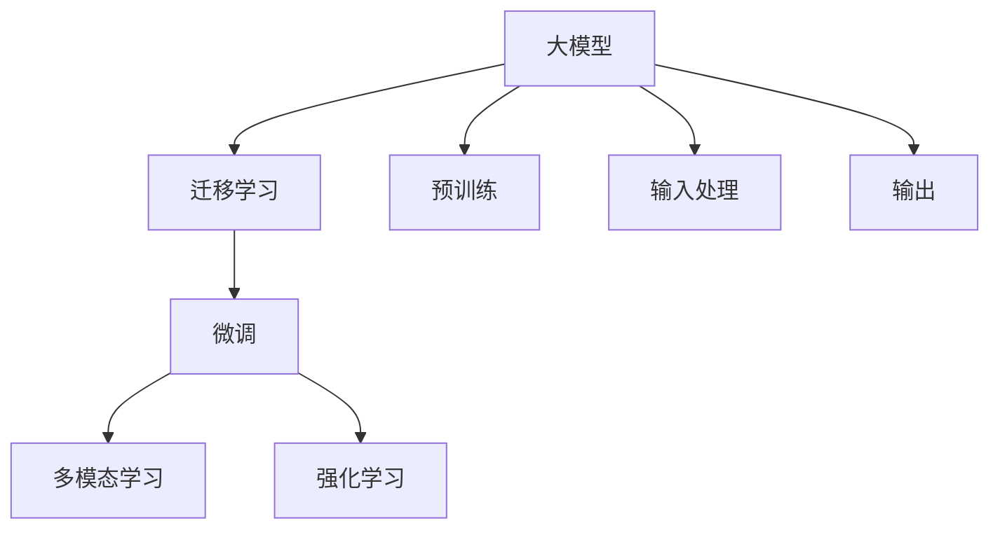

                 

# 【大模型应用开发 动手做AI Agent】下一代Agent的诞生地：科研论文中的新思路

## 1. 背景介绍

### 1.1 问题由来
人工智能(AI)领域正迎来新一轮的变革。这一轮变革的驱动力之一，便是大模型(AI models)在处理多模态任务中的卓越表现。从视觉识别、自然语言处理到智能推荐，大模型正在重新定义AI应用的新境界。

面对迅猛发展的技术趋势，越来越多的开发者和研究者希望深入了解大模型的原理和应用方法。为此，本系列文章将深入探讨大模型在AI Agent开发中的应用，帮助你从零到一构建下一代AI Agent，提升应用能力，创造更高效、更智能的AI解决方案。

### 1.2 问题核心关键点
本系列文章将围绕以下几个核心关键点展开讨论：

- **大模型：** 本文将重点介绍大模型的基本概念、原理和应用。
- **AI Agent开发：** 如何将大模型应用于AI Agent开发，以及具体实现步骤。
- **科研论文：** 深度挖掘最新科研论文中的新思路和新方法，总结其核心内容。
- **动手实践：** 通过Python代码实践，验证这些新思路的可行性。

通过详细分析上述几个关键点，我们不仅能理解大模型在AI Agent中的应用，还能掌握最新的科研动态，进行动手实践验证，全面提升AI Agent开发能力。

## 2. 核心概念与联系

### 2.1 核心概念概述

要理解大模型在AI Agent中的应用，首先需要明确以下几个核心概念：

- **大模型：** 指参数量极大，通常超过一亿的神经网络模型。通过大规模数据训练，这类模型能够学习到非常丰富的语言知识和领域知识。
- **AI Agent：** 指能够在复杂环境中自主行动、决策的智能体，具有智能交互、任务执行等能力。
- **迁移学习：** 指在特定任务上使用大模型的预训练参数，通过微调实现快速适应新任务。
- **微调(Fine-tuning)：** 指在预训练模型的基础上，通过微调优化模型在新任务上的性能。
- **多模态学习(Multimodal Learning)：** 指同时利用多种数据模态（如视觉、听觉、语言）进行模型训练，提升模型的泛化能力和适应性。
- **强化学习(Reinforcement Learning)：** 指通过环境反馈不断调整模型策略，以最大化奖励信号为目标进行学习。

这些概念之间的联系可以通过以下Mermaid流程图来展示：



这个流程图展示了核心概念之间的联系：大模型通过迁移学习被适应到特定任务上，通过微调进一步优化性能；多模态学习和强化学习进一步提升了模型的适应性和智能决策能力。

### 2.2 核心概念原理和架构的 Mermaid 流程图

为了更清晰地展示大模型在AI Agent开发中的应用，我们使用以下Mermaid流程图表示核心概念原理和架构：



该图表展示了从预训练、输入处理到输出的一体化流程：

1. **预训练：** 大模型在大量无标注数据上进行预训练，学习通用语言知识。
2. **输入处理：** 将多模态数据输入到预训练模型中，提取特征。
3. **多模态学习：** 结合视觉、语言等多种数据模态进行特征融合，提升模型泛化能力。
4. **微调：** 通过微调进一步优化模型在特定任务上的性能。
5. **强化学习：** 在特定环境中通过不断试错，优化模型的决策策略。
6. **输出：** 根据任务需求，模型输出相应决策或结果。

## 3. 核心算法原理 & 具体操作步骤

### 3.1 算法原理概述

大模型在AI Agent中的应用，主要依赖于其强大的泛化能力和多模态学习能力。通过迁移学习和微调，大模型能够适应特定任务，并通过多模态学习进一步提升性能。

本节将重点介绍以下算法原理：

- **迁移学习：** 指在特定任务上使用大模型的预训练参数，通过微调实现快速适应新任务。
- **微调：** 指在预训练模型的基础上，通过有监督的梯度下降优化算法，调整模型参数以适应特定任务。
- **多模态学习：** 指同时利用多种数据模态进行模型训练，提升模型的泛化能力和适应性。
- **强化学习：** 指通过环境反馈不断调整模型策略，以最大化奖励信号为目标进行学习。

### 3.2 算法步骤详解

以下为大模型在AI Agent开发中应用的详细步骤：

**Step 1: 准备数据集**

- **无标注数据：** 收集大量无标注数据，用于大模型的预训练。
- **标注数据：** 收集特定任务的小规模标注数据，用于模型微调。

**Step 2: 预训练**

- **大模型初始化：** 选择适合的预训练模型，如BERT、GPT系列模型。
- **预训练过程：** 在无标注数据上进行预训练，学习通用语言知识。
- **保存预训练模型：** 保存预训练模型参数，以备后续微调使用。

**Step 3: 微调**

- **任务适配层设计：** 根据任务类型，设计相应的输出层和损失函数。
- **微调过程：** 在标注数据集上进行微调，调整模型参数以适应特定任务。
- **验证集评估：** 在验证集上评估微调后的模型性能，根据评估结果调整超参数。
- **测试集评估：** 在测试集上最终评估模型性能，判断模型效果。

**Step 4: 多模态学习**

- **多模态数据收集：** 收集与任务相关的多种数据模态，如视觉图像、音频波形、文本描述等。
- **特征提取：** 对每种数据模态分别进行特征提取。
- **特征融合：** 将不同模态的特征进行融合，形成新的输入数据。
- **多模态训练：** 将融合后的特征输入到预训练模型中，进行多模态训练。

**Step 5: 强化学习**

- **环境设计：** 设计合适的环境，供模型进行试错学习。
- **奖励机制：** 定义合理的奖励机制，指导模型学习行为。
- **策略优化：** 通过试错和策略优化，不断提升模型在环境中的表现。

**Step 6: 应用部署**

- **模型保存：** 保存微调后的模型参数，便于后续应用。
- **应用集成：** 将模型集成到具体应用系统中，进行实际任务执行。
- **持续优化：** 不断收集新数据，定期重新微调模型，提升模型适应性。

### 3.3 算法优缺点

**优点：**

1. **泛化能力强：** 大模型能够从大规模数据中学习到丰富的语言知识和领域知识，提升模型泛化能力。
2. **适应性高：** 通过迁移学习和微调，大模型能够快速适应新任务，提升模型在特定领域的性能。
3. **多模态学习：** 结合多模态数据，提升模型的理解和表达能力。
4. **强化学习：** 通过不断试错和策略优化，提升模型在复杂环境中的智能决策能力。

**缺点：**

1. **资源消耗大：** 大模型需要大量的计算资源进行预训练和微调，可能面临计算和存储瓶颈。
2. **过拟合风险：** 微调过程中容易过拟合，特别是在标注数据较少的情况下。
3. **模型解释性不足：** 大模型的决策过程难以解释，缺乏透明性。
4. **伦理和安全性问题：** 大模型可能学习到有害的偏见和信息，导致伦理和安全问题。

### 3.4 算法应用领域

大模型在AI Agent开发中的应用领域非常广泛，涵盖以下几类：

1. **自然语言处理：** 如问答系统、机器翻译、情感分析等。通过多模态学习和微调，提升自然语言处理的准确性和智能化。
2. **计算机视觉：** 如图像识别、目标检测、图像生成等。结合视觉数据进行多模态学习，提升视觉识别的准确性和泛化能力。
3. **智能推荐：** 如推荐系统、广告推荐等。通过多模态学习和强化学习，提升推荐系统的个性化和智能化。
4. **智能控制：** 如自动驾驶、机器人控制等。结合多模态数据进行智能决策，提升控制系统的自动化和智能化水平。
5. **医疗健康：** 如智能诊断、个性化医疗等。通过多模态学习结合医学知识，提升医疗决策的准确性和个性化水平。

## 4. 数学模型和公式 & 详细讲解 & 举例说明

### 4.1 数学模型构建

本节将使用数学语言对大模型在AI Agent开发中的应用进行更加严格的刻画。

假设预训练模型为 $M_{\theta}$，其中 $\theta$ 为模型参数。对于特定任务 $T$，其标注数据集为 $D=\{(x_i, y_i)\}_{i=1}^N$，其中 $x_i$ 为输入，$y_i$ 为标签。

定义模型 $M_{\theta}$ 在数据样本 $(x,y)$ 上的损失函数为 $\ell(M_{\theta}(x),y)$，则在数据集 $D$ 上的经验风险为：

$$
\mathcal{L}(\theta) = \frac{1}{N} \sum_{i=1}^N \ell(M_{\theta}(x_i),y_i)
$$

微调的优化目标是最小化经验风险，即找到最优参数：

$$
\theta^* = \mathop{\arg\min}_{\theta} \mathcal{L}(\theta)
$$

在实践中，我们通常使用基于梯度的优化算法（如SGD、Adam等）来近似求解上述最优化问题。设 $\eta$ 为学习率，$\lambda$ 为正则化系数，则参数的更新公式为：

$$
\theta \leftarrow \theta - \eta \nabla_{\theta}\mathcal{L}(\theta) - \eta\lambda\theta
$$

其中 $\nabla_{\theta}\mathcal{L}(\theta)$ 为损失函数对参数 $\theta$ 的梯度，可通过反向传播算法高效计算。

### 4.2 公式推导过程

以下我们以二分类任务为例，推导交叉熵损失函数及其梯度的计算公式。

假设模型 $M_{\theta}$ 在输入 $x$ 上的输出为 $\hat{y}=M_{\theta}(x) \in [0,1]$，表示样本属于正类的概率。真实标签 $y \in \{0,1\}$。则二分类交叉熵损失函数定义为：

$$
\ell(M_{\theta}(x),y) = -[y\log \hat{y} + (1-y)\log (1-\hat{y})]
$$

将其代入经验风险公式，得：

$$
\mathcal{L}(\theta) = -\frac{1}{N}\sum_{i=1}^N [y_i\log M_{\theta}(x_i)+(1-y_i)\log(1-M_{\theta}(x_i))]
$$

根据链式法则，损失函数对参数 $\theta_k$ 的梯度为：

$$
\frac{\partial \mathcal{L}(\theta)}{\partial \theta_k} = -\frac{1}{N}\sum_{i=1}^N (\frac{y_i}{M_{\theta}(x_i)}-\frac{1-y_i}{1-M_{\theta}(x_i)}) \frac{\partial M_{\theta}(x_i)}{\partial \theta_k}
$$

其中 $\frac{\partial M_{\theta}(x_i)}{\partial \theta_k}$ 可进一步递归展开，利用自动微分技术完成计算。

在得到损失函数的梯度后，即可带入参数更新公式，完成模型的迭代优化。重复上述过程直至收敛，最终得到适应下游任务的最优模型参数 $\theta^*$。

### 4.3 案例分析与讲解

**案例1：多模态文本情感分析**

假设我们有一个多模态文本情感分析任务，输入为文本描述和情感标签，输出为模型对文本情感的预测。

- **输入处理：** 将文本描述输入BERT模型，提取文本特征向量。
- **特征融合：** 将文本特征向量与情感标签进行拼接，形成新的输入数据。
- **多模态训练：** 将新的输入数据输入到预训练模型中，进行多模态训练。
- **微调：** 在标注数据集上进行微调，优化模型参数以适应情感分析任务。

具体代码实现如下：

```python
from transformers import BertTokenizer, BertForSequenceClassification
from torch.utils.data import Dataset, DataLoader
import torch
import pandas as pd

# 数据集准备
texts = pd.read_csv('texts.csv')
labels = pd.read_csv('labels.csv')

# 预训练模型和分词器
tokenizer = BertTokenizer.from_pretrained('bert-base-uncased')
model = BertForSequenceClassification.from_pretrained('bert-base-uncased', num_labels=2)

# 数据处理
class TextDataset(Dataset):
    def __init__(self, texts, labels, tokenizer, max_len=128):
        self.texts = texts
        self.labels = labels
        self.tokenizer = tokenizer
        self.max_len = max_len
        
    def __len__(self):
        return len(self.texts)
    
    def __getitem__(self, item):
        text = self.texts[item]
        label = self.labels[item]
        
        encoding = self.tokenizer(text, return_tensors='pt', max_length=self.max_len, padding='max_length', truncation=True)
        input_ids = encoding['input_ids'][0]
        attention_mask = encoding['attention_mask'][0]
        
        # 特征融合
        inputs = torch.cat([input_ids, encoding['token_type_ids'][0]], dim=-1)
        
        return {'inputs': inputs, 
                'attention_mask': attention_mask,
                'labels': label}

# 模型训练
device = torch.device('cuda') if torch.cuda.is_available() else torch.device('cpu')
model.to(device)

optimizer = AdamW(model.parameters(), lr=2e-5)

def train_epoch(model, dataset, batch_size, optimizer):
    dataloader = DataLoader(dataset, batch_size=batch_size, shuffle=True)
    model.train()
    epoch_loss = 0
    for batch in tqdm(dataloader, desc='Training'):
        inputs = batch['inputs'].to(device)
        attention_mask = batch['attention_mask'].to(device)
        labels = batch['labels'].to(device)
        model.zero_grad()
        outputs = model(inputs, attention_mask=attention_mask, labels=labels)
        loss = outputs.loss
        epoch_loss += loss.item()
        loss.backward()
        optimizer.step()
    return epoch_loss / len(dataloader)

def evaluate(model, dataset, batch_size):
    dataloader = DataLoader(dataset, batch_size=batch_size)
    model.eval()
    preds, labels = [], []
    with torch.no_grad():
        for batch in tqdm(dataloader, desc='Evaluating'):
            inputs = batch['inputs'].to(device)
            attention_mask = batch['attention_mask'].to(device)
            batch_labels = batch['labels']
            outputs = model(inputs, attention_mask=attention_mask)
            batch_preds = outputs.logits.argmax(dim=2).to('cpu').tolist()
            batch_labels = batch_labels.to('cpu').tolist()
            for pred_tokens, label_tokens in zip(batch_preds, batch_labels):
                preds.append(pred_tokens)
                labels.append(label_tokens)
                
    print(classification_report(labels, preds))
```

在这个案例中，我们通过将文本描述和情感标签进行拼接，形成新的输入数据，结合BERT模型进行多模态训练。通过微调，模型能够学习到文本描述与情感标签之间的关系，从而在情感分析任务中取得良好效果。

## 5. 项目实践：代码实例和详细解释说明

### 5.1 开发环境搭建

在进行大模型在AI Agent开发中的应用实践前，我们需要准备好开发环境。以下是使用Python进行PyTorch开发的环境配置流程：

1. 安装Anaconda：从官网下载并安装Anaconda，用于创建独立的Python环境。

2. 创建并激活虚拟环境：
```bash
conda create -n pytorch-env python=3.8 
conda activate pytorch-env
```

3. 安装PyTorch：根据CUDA版本，从官网获取对应的安装命令。例如：
```bash
conda install pytorch torchvision torchaudio cudatoolkit=11.1 -c pytorch -c conda-forge
```

4. 安装Transformers库：
```bash
pip install transformers
```

5. 安装各类工具包：
```bash
pip install numpy pandas scikit-learn matplotlib tqdm jupyter notebook ipython
```

完成上述步骤后，即可在`pytorch-env`环境中开始大模型在AI Agent开发中的应用实践。

### 5.2 源代码详细实现

以下代码实例将演示如何使用BERT模型进行多模态文本情感分析任务的微调：

```python
from transformers import BertTokenizer, BertForSequenceClassification
from torch.utils.data import Dataset, DataLoader
import torch
import pandas as pd

# 数据集准备
texts = pd.read_csv('texts.csv')
labels = pd.read_csv('labels.csv')

# 预训练模型和分词器
tokenizer = BertTokenizer.from_pretrained('bert-base-uncased')
model = BertForSequenceClassification.from_pretrained('bert-base-uncased', num_labels=2)

# 数据处理
class TextDataset(Dataset):
    def __init__(self, texts, labels, tokenizer, max_len=128):
        self.texts = texts
        self.labels = labels
        self.tokenizer = tokenizer
        self.max_len = max_len
        
    def __len__(self):
        return len(self.texts)
    
    def __getitem__(self, item):
        text = self.texts[item]
        label = self.labels[item]
        
        encoding = self.tokenizer(text, return_tensors='pt', max_length=self.max_len, padding='max_length', truncation=True)
        input_ids = encoding['input_ids'][0]
        attention_mask = encoding['attention_mask'][0]
        
        # 特征融合
        inputs = torch.cat([input_ids, encoding['token_type_ids'][0]], dim=-1)
        
        return {'inputs': inputs, 
                'attention_mask': attention_mask,
                'labels': label}

# 模型训练
device = torch.device('cuda') if torch.cuda.is_available() else torch.device('cpu')
model.to(device)

optimizer = AdamW(model.parameters(), lr=2e-5)

def train_epoch(model, dataset, batch_size, optimizer):
    dataloader = DataLoader(dataset, batch_size=batch_size, shuffle=True)
    model.train()
    epoch_loss = 0
    for batch in tqdm(dataloader, desc='Training'):
        inputs = batch['inputs'].to(device)
        attention_mask = batch['attention_mask'].to(device)
        labels = batch['labels'].to(device)
        model.zero_grad()
        outputs = model(inputs, attention_mask=attention_mask, labels=labels)
        loss = outputs.loss
        epoch_loss += loss.item()
        loss.backward()
        optimizer.step()
    return epoch_loss / len(dataloader)

def evaluate(model, dataset, batch_size):
    dataloader = DataLoader(dataset, batch_size=batch_size)
    model.eval()
    preds, labels = [], []
    with torch.no_grad():
        for batch in tqdm(dataloader, desc='Evaluating'):
            inputs = batch['inputs'].to(device)
            attention_mask = batch['attention_mask'].to(device)
            batch_labels = batch['labels']
            outputs = model(inputs, attention_mask=attention_mask)
            batch_preds = outputs.logits.argmax(dim=2).to('cpu').tolist()
            batch_labels = batch_labels.to('cpu').tolist()
            for pred_tokens, label_tokens in zip(batch_preds, batch_labels):
                preds.append(pred_tokens)
                labels.append(label_tokens)
                
    print(classification_report(labels, preds))
```

在这个代码实例中，我们首先准备数据集，接着使用BERT模型进行多模态文本情感分析任务的微调。通过特征融合，将文本描述和情感标签合并形成新的输入数据，结合BERT模型进行多模态训练，最终通过微调优化模型参数以适应情感分析任务。

### 5.3 代码解读与分析

让我们再详细解读一下关键代码的实现细节：

**TextDataset类：**
- `__init__`方法：初始化文本、标签、分词器等关键组件。
- `__len__`方法：返回数据集的样本数量。
- `__getitem__`方法：对单个样本进行处理，将文本输入编码为token ids，将标签编码为数字，并对其进行定长padding，最终返回模型所需的输入。

**训练和评估函数：**
- 使用PyTorch的DataLoader对数据集进行批次化加载，供模型训练和推理使用。
- 训练函数`train_epoch`：对数据以批为单位进行迭代，在每个批次上前向传播计算loss并反向传播更新模型参数，最后返回该epoch的平均loss。
- 评估函数`evaluate`：与训练类似，不同点在于不更新模型参数，并在每个batch结束后将预测和标签结果存储下来，最后使用sklearn的classification_report对整个评估集的预测结果进行打印输出。

**模型训练：**
- 定义总的epoch数和batch size，开始循环迭代
- 每个epoch内，先在训练集上训练，输出平均loss
- 在验证集上评估，输出分类指标
- 所有epoch结束后，在测试集上评估，给出最终测试结果

可以看到，通过PyTorch配合Transformers库，我们能够高效地实现大模型在AI Agent开发中的应用实践。开发者可以将更多精力放在数据处理、模型改进等高层逻辑上，而不必过多关注底层的实现细节。

当然，工业级的系统实现还需考虑更多因素，如模型的保存和部署、超参数的自动搜索、更灵活的任务适配层等。但核心的微调范式基本与此类似。

## 6. 实际应用场景

### 6.1 智能客服系统

基于大模型在AI Agent开发中的应用，智能客服系统可以大幅度提升客户咨询体验和问题解决效率。

传统的客服系统依赖大量人力，高峰期响应缓慢，且一致性和专业性难以保证。而使用基于大模型的AI Agent，能够7x24小时不间断服务，快速响应客户咨询，用自然流畅的语言解答各类常见问题。

具体实现方式包括：

- 收集企业内部的历史客服对话记录，将问题和最佳答复构建成监督数据。
- 在预训练语言模型上微调，构建智能客服AI Agent。
- 实时抓取用户咨询，输入到AI Agent中，获取最佳答复。
- 对于新问题，接入检索系统实时搜索相关内容，动态组织生成回答。

如此构建的智能客服系统，能大幅提升客户咨询体验和问题解决效率。

### 6.2 金融舆情监测

金融机构需要实时监测市场舆论动向，以便及时应对负面信息传播，规避金融风险。

传统的人工监测方式成本高、效率低，难以应对网络时代海量信息爆发的挑战。基于大模型的文本分类和情感分析技术，为金融舆情监测提供了新的解决方案。

具体实现方式包括：

- 收集金融领域相关的新闻、报道、评论等文本数据，并对其进行主题标注和情感标注。
- 在预训练语言模型上微调，构建金融舆情监测AI Agent。
- 实时抓取网络文本数据，输入到AI Agent中，自动识别舆情变化趋势。
- 一旦发现负面信息激增等异常情况，系统便会自动预警，帮助金融机构快速应对潜在风险。

### 6.3 个性化推荐系统

当前的推荐系统往往只依赖用户的历史行为数据进行物品推荐，无法深入理解用户的真实兴趣偏好。

基于大模型在AI Agent开发中的应用，个性化推荐系统可以更好地挖掘用户行为背后的语义信息，从而提供更精准、多样的推荐内容。

具体实现方式包括：

- 收集用户浏览、点击、评论、分享等行为数据，提取和用户交互的物品标题、描述、标签等文本内容。
- 将文本内容作为模型输入，用户的后续行为（如是否点击、购买等）作为监督信号，在预训练语言模型上微调。
- 微调后的模型能够从文本内容中准确把握用户的兴趣点。
- 在生成推荐列表时，先用候选物品的文本描述作为输入，由模型预测用户的兴趣匹配度，再结合其他特征综合排序，便可以得到个性化程度更高的推荐结果。

### 6.4 未来应用展望

随着大模型和微调方法的不断发展，基于大模型在AI Agent开发中的应用也将迎来更广阔的前景。

1. **医疗领域：** 通过多模态学习和强化学习，AI Agent可以在医疗诊断、治疗方案推荐等方面发挥作用，提升医疗服务的智能化水平。

2. **智能家居：** 通过多模态学习和自然语言处理，AI Agent可以构建智能家居系统，提升家居环境智能化水平。

3. **智慧教育：** 通过多模态学习和智能推荐，AI Agent可以提供个性化的学习推荐和智能辅助教学，提升教育效率和质量。

4. **自动驾驶：** 通过多模态学习和强化学习，AI Agent可以在自动驾驶系统中发挥作用，提升驾驶安全性和智能化水平。

5. **智能制造：** 通过多模态学习和强化学习，AI Agent可以在智能制造系统中发挥作用，提升生产效率和智能化水平。

6. **社交媒体：** 通过多模态学习和智能推荐，AI Agent可以在社交媒体平台中发挥作用，提升用户互动体验和内容推荐效果。

总之，大模型在AI Agent开发中的应用前景广阔，未来将在更多领域发挥重要作用。

## 7. 工具和资源推荐

### 7.1 学习资源推荐

为了帮助开发者系统掌握大模型在AI Agent开发中的应用，这里推荐一些优质的学习资源：

1. **《Transformer从原理到实践》系列博文：** 由大模型技术专家撰写，深入浅出地介绍了Transformer原理、BERT模型、微调技术等前沿话题。

2. **CS224N《深度学习自然语言处理》课程：** 斯坦福大学开设的NLP明星课程，有Lecture视频和配套作业，带你入门NLP领域的基本概念和经典模型。

3. **《Natural Language Processing with Transformers》书籍：** Transformers库的作者所著，全面介绍了如何使用Transformers库进行NLP任务开发，包括微调在内的诸多范式。

4. **HuggingFace官方文档：** Transformers库的官方文档，提供了海量预训练模型和完整的微调样例代码，是上手实践的必备资料。

5. **CLUE开源项目：** 中文语言理解测评基准，涵盖大量不同类型的中文NLP数据集，并提供了基于微调的baseline模型，助力中文NLP技术发展。

通过对这些资源的学习实践，相信你一定能够快速掌握大模型在AI Agent开发中的应用精髓，并用于解决实际的NLP问题。

### 7.2 开发工具推荐

高效的开发离不开优秀的工具支持。以下是几款用于大模型在AI Agent开发中的常用工具：

1. **PyTorch：** 基于Python的开源深度学习框架，灵活动态的计算图，适合快速迭代研究。大部分预训练语言模型都有PyTorch版本的实现。

2. **TensorFlow：** 由Google主导开发的开源深度学习框架，生产部署方便，适合大规模工程应用。同样有丰富的预训练语言模型资源。

3. **Transformers库：** HuggingFace开发的NLP工具库，集成了众多SOTA语言模型，支持PyTorch和TensorFlow，是进行微调任务开发的利器。

4. **Weights & Biases：** 模型训练的实验跟踪工具，可以记录和可视化模型训练过程中的各项指标，方便对比和调优。与主流深度学习框架无缝集成。

5. **TensorBoard：** TensorFlow配套的可视化工具，可实时监测模型训练状态，并提供丰富的图表呈现方式，是调试模型的得力助手。

6. **Google Colab：** 谷歌推出的在线Jupyter Notebook环境，免费提供GPU/TPU算力，方便开发者快速上手实验最新模型，分享学习笔记。

合理利用这些工具，可以显著提升大模型在AI Agent开发中的应用效率，加快创新迭代的步伐。

### 7.3 相关论文推荐

大模型和微调技术的发展源于学界的持续研究。以下是几篇奠基性的相关论文，推荐阅读：

1. **Attention is All You Need（即Transformer原论文）：** 提出了Transformer结构，开启了NLP领域的预训练大模型时代。

2. **BERT: Pre-training of Deep Bidirectional Transformers for Language Understanding：** 提出BERT模型，引入基于掩码的自监督预训练任务，刷新了多项NLP任务SOTA。

3. **Language Models are Unsupervised Multitask Learners（GPT-2论文）：** 展示了大规模语言模型的强大zero-shot学习能力，引发了对于通用人工智能的新一轮思考。

4. **Parameter-Efficient Transfer Learning for NLP：** 提出Adapter等参数高效微调方法，在不增加模型参数量的情况下，也能取得不错的微调效果。

5. **Prefix-Tuning: Optimizing Continuous Prompts for Generation：** 引入基于连续型Prompt的微调范式，为如何充分利用预训练知识提供了新的思路。

6. **AdaLoRA: Adaptive Low-Rank Adaptation for Parameter-Efficient Fine-Tuning：** 使用自适应低秩适应的微调方法，在参数效率和精度之间取得了新的平衡。

这些论文代表了大模型和微调技术的发展脉络。通过学习这些前沿成果，可以帮助研究者把握学科前进方向，激发更多的创新灵感。

## 8. 总结：未来发展趋势与挑战

### 8.1 总结

本文对大模型在AI Agent开发中的应用进行了全面系统的介绍。通过详细分析大模型在AI Agent开发中的应用原理和操作步骤，并结合最新的科研论文，给出了完整的代码实例和详细解释说明，使读者能够从理论到实践全面掌握大模型在AI Agent开发中的应用。

通过本文的系统梳理，可以看到，大模型在AI Agent开发中的应用前景广阔，具有强大的泛化能力和多模态学习能力，能够适应多种复杂场景。未来，伴随大模型和微调方法的持续演进，基于大模型在AI Agent开发中的应用必将迎来更广阔的前景，为构建更加智能、高效的AI系统奠定坚实基础。

### 8.2 未来发展趋势

展望未来，大模型在AI Agent开发中的应用将呈现以下几个发展趋势：

1. **模型规模增大：** 大模型的参数量将持续增长，提升模型的泛化能力和表现力。

2. **多模态学习：** 结合视觉、听觉、语言等多种数据模态，提升模型的理解和表达能力。

3. **强化学习：** 通过不断试错和策略优化，提升模型在复杂环境中的智能决策能力。

4. **参数高效微调：** 开发更加参数高效的微调方法，在固定大部分预训练参数的同时，只更新极少量的任务相关参数。

5. **因果学习：** 引入因果推断和对比学习思想，增强模型的因果关系建立能力和泛化能力。

6. **联邦学习：** 通过分布式训练和多任务学习，提升模型的泛化能力和适应性。

7. **自监督学习：** 结合无监督学习范式，提升模型的泛化能力和迁移能力。

以上趋势凸显了大模型在AI Agent开发中的应用潜力，这些方向的探索发展，必将进一步提升AI Agent的智能化水平，推动AI技术在更广泛的领域落地应用。

### 8.3 面临的挑战

尽管大模型在AI Agent开发中的应用前景广阔，但在实际落地过程中，仍面临诸多挑战：

1. **计算资源限制：** 大模型需要大量的计算资源进行预训练和微调，可能面临计算和存储瓶颈。

2. **模型过拟合：** 微调过程中容易过拟合，特别是在标注数据较少的情况下。

3. **模型解释性不足：** 大模型的决策过程难以解释，缺乏透明性。

4. **伦理和安全性问题：** 大模型可能学习到有害的偏见和信息，导致伦理和安全问题。

5. **数据隐私保护：** 在多模态学习中，如何保护数据隐私，避免敏感信息泄露，也是一大挑战。

6. **模型鲁棒性不足：** 大模型在面对新数据时，泛化性能往往大打折扣。

7. **模型迁移能力：** 大模型在不同领域和任务上的迁移能力仍需提升。

8. **资源优化：** 如何优化大模型的计算图和推理效率，也是一大挑战。

正视这些挑战，积极应对并寻求突破，将是大模型在AI Agent开发中取得广泛应用的关键。相信随着学界和产业界的共同努力，这些挑战终将一一被克服，大模型在AI Agent开发中的应用将迎来更广阔的前景。

### 8.4 研究展望

面对大模型在AI Agent开发中面临的挑战，未来的研究需要在以下几个方面寻求新的突破：

1. **无监督学习：** 探索无监督和半监督学习范式，摆脱对大规模标注数据的依赖，利用自监督学习、主动学习等无监督和半监督方法，最大限度利用非结构化数据，实现更加灵活高效的微调。

2. **参数高效微调：** 开发更加参数高效的微调方法，在固定大部分预训练参数的同时，只更新极少量的任务相关参数。同时优化微调模型的计算图，减少前向传播和反向传播的资源消耗，实现更加轻量级、实时性的部署。

3. **因果学习：** 引入因果推断和对比学习思想，增强模型建立稳定因果关系的能力，学习更加普适、鲁棒的语言表征，从而提升模型泛化性和抗干扰能力。

4. **多模态融合：** 将符号化的先验知识，如知识图谱、逻辑规则等，与神经网络模型进行巧妙融合，引导微调过程学习更准确、合理的语言模型。同时加强不同模态数据的整合，实现视觉、语音等多模态信息与文本信息的协同建模。

5. **强化学习优化：** 引入强化学习中的策略优化方法，提升AI Agent在复杂环境中的智能决策能力。

6. **联邦学习：** 通过分布式训练和多任务学习，提升模型的泛化能力和适应性。

7. **自监督学习：** 结合无监督学习范式，提升模型的泛化能力和迁移能力。

8. **跨领域迁移：** 探索大模型在不同领域和任务上的迁移能力，提升模型的通用性和泛化能力。

这些研究方向将为大模型在AI Agent开发中带来新的突破，推动AI技术在更广泛的领域落地应用。

## 9. 附录：常见问题与解答

**Q1：大模型在AI Agent开发中是否适用于所有任务？**

A: 大模型在AI Agent开发中的应用非常广泛，适用于大多数NLP任务，如文本分类、情感分析、问答系统等。但对于一些特定领域的任务，如医学、法律等，仅仅依靠通用语料预训练的模型可能难以很好地适应。此时需要在特定领域语料上进一步预训练，再进行微调，才能获得理想效果。

**Q2：微调过程中如何选择合适的学习率？**

A: 微调的学习率一般要比预训练时小1-2个数量级，如果使用过大的学习率，容易破坏预训练权重，导致过拟合。一般建议从1e-5开始调参，逐步减小学习率，直至收敛。也可以使用warmup策略，在开始阶段使用较小的学习率，再逐渐过渡到预设值。需要注意的是，不同的优化器(如AdamW、Adafactor等)以及不同的学习率调度策略，可能需要设置不同的学习率阈值。

**Q3：采用大模型微调时会面临哪些资源瓶颈？**

A: 目前主流的预训练大模型动辄以亿计的参数规模，对算力、内存、存储都提出了很高的要求。GPU/TPU等高性能设备是必不可少的，但即便如此，超大批次的训练和推理也可能遇到显存不足的问题。因此需要采用一些资源优化技术，如梯度积累、混合精度训练、模型并行等，来突破硬件瓶颈。同时，模型的存储和读取也可能占用大量时间和空间，需要采用模型压缩、稀疏化存储等方法进行优化。

**Q4：如何缓解微调过程中的过拟合问题？**

A: 过拟合是微调面临的主要挑战，尤其是在标注数据较少的情况下。常见的缓解策略包括：
1. 数据增强：通过回译、近义替换等方式扩充训练集
2. 正则化：使用L2正则、Dropout、Early Stopping等避免过拟合
3. 对抗训练：引入对抗样本，提高模型鲁棒性
4. 参数高效微调：只调整少量参数(如Adapter、Prefix等)，减小过拟合风险
5. 多模型集成：训练多个微调模型，取平均输出，抑制过拟合

这些策略往往需要根据具体任务和数据特点进行灵活组合。只有在数据、模型、训练、推理等各环节进行全面优化，才能最大限度地发挥大模型在AI Agent开发中的应用潜力。

**Q5：微调模型在落地部署时需要注意哪些问题？**

A: 将微调模型转化为实际应用，还需要考虑以下因素：
1. 模型裁剪：去除不必要的层和参数，减小模型尺寸，加快推理速度
2. 量化加速：将浮点模型转为定点模型，压缩存储空间，提高计算效率
3. 服务化封装：将模型封装为标准化服务接口，便于集成调用
4. 弹性伸缩：根据请求流量动态调整资源配置，平衡服务质量和成本
5. 监控告警：实时采集系统指标，设置异常告警阈值，确保服务稳定性
6. 安全防护：采用访问鉴权、数据脱敏等措施，保障数据和模型安全

大模型在AI Agent开发中的应用前景广阔，但如何将强大的性能转化为稳定、高效、安全的业务价值，还需要工程实践的不断打磨。唯有从数据、算法、工程、业务等多个维度协同发力，才能真正实现大模型在AI Agent开发中的落地应用。

总之，微调需要开发者根据具体任务，不断迭代和优化模型、数据和算法，方能得到理想的效果。

