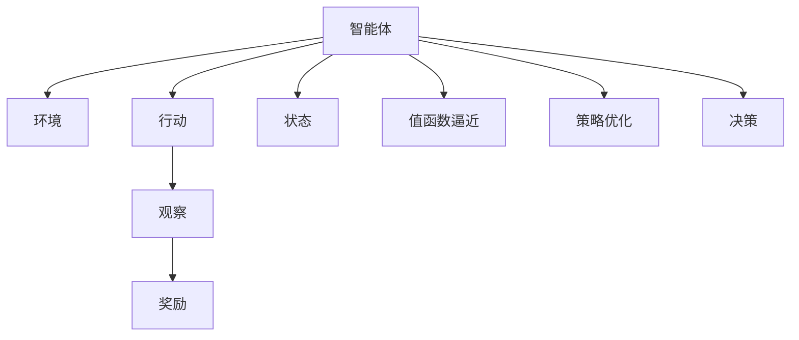

                 

# 一切皆是映射：AI Q-learning在金融风控中的实践

> 关键词：Q-learning, 金融风控, 强化学习, 策略优化, 风险评估, 案例分析, 算法优缺点

## 1. 背景介绍

金融风控是金融机构中至关重要的一环，涉及到金融产品的风险识别、评估、控制等多个环节。近年来，随着金融科技的发展，人工智能(AI)技术被广泛应用于金融风控，提升金融机构的风险管理能力，防范金融风险，保护消费者权益。其中，强化学习(RL)算法，尤其是Q-learning算法，在金融风控中的应用逐渐受到关注。

Q-learning是一种基于值函数逼近的强化学习算法，通过不断试错和反馈，优化策略函数，从而实现最优决策。在金融风控中，Q-learning可以应用于风险评估、信用评分、反欺诈检测等多个场景，为金融机构提供高效、精确的风险管理和决策支持。

## 2. 核心概念与联系

### 2.1 核心概念概述

为更好地理解Q-learning在金融风控中的应用，本节将介绍几个关键概念：

- **Q-learning**：一种基于值函数逼近的强化学习算法，通过不断试错和反馈，优化策略函数，从而实现最优决策。
- **金融风控**：金融机构对金融产品和服务进行风险识别、评估、控制的过程，旨在防范金融风险，保护消费者权益。
- **强化学习**：通过智能体与环境的交互，在试错过程中学习最优决策策略，适用于动态和不确定性强的环境。
- **值函数逼近**：使用函数逼近方法，估计状态值或策略值函数，从而实现策略优化。
- **风险评估**：对金融产品的风险进行量化和评估，以识别潜在风险并采取相应措施。

这些概念之间相互关联，共同构成了AI Q-learning在金融风控中的应用框架。Q-learning算法通过智能体在不断交互中学习最优策略，金融风控则通过风险评估和控制，保护金融机构和消费者的利益。

### 2.2 核心概念原理和架构的 Mermaid 流程图



这个流程图展示了Q-learning算法的基本架构，其中：

- 智能体(Agent)：负责在环境中采取行动，接收奖励，更新状态和策略。
- 环境(Environment)：智能体所在的环境，提供状态和奖励。
- 行动(Action)：智能体可采取的具体行动，如批准或拒绝贷款。
- 观察(Observation)：智能体从环境中获取的反馈信息，如申请人的信用历史。
- 奖励(Reward)：智能体从环境中接收的反馈信号，如贷款违约与否。
- 状态(State)：环境的状态，如申请人信用评分。
- 值函数逼近(Approximation)：使用函数逼近方法估计状态值或策略值函数。
- 策略优化(Optimization)：通过值函数逼近结果，优化智能体的策略。
- 决策(Decision)：智能体根据状态和策略，选择最优行动。

## 3. 核心算法原理 & 具体操作步骤

### 3.1 算法原理概述

Q-learning是一种基于值函数逼近的强化学习算法，其核心思想是智能体通过与环境的交互，不断试错和反馈，逐步优化其策略函数，从而实现最优决策。

假设智能体在状态 $s$ 时，可以采取 $a$ 种行动，对应的奖励为 $r$，下一步状态为 $s'$，则Q-learning的更新公式为：

$$ Q(s,a) \leftarrow Q(s,a) + \alpha [r + \gamma \max_{a'} Q(s',a') - Q(s,a)] $$

其中，$Q(s,a)$ 表示智能体在状态 $s$ 时采取行动 $a$ 的价值，$\alpha$ 为学习率，$\gamma$ 为折扣因子，表示未来奖励的权重。智能体通过最大化未来奖励的总和，学习到最优策略。

在金融风控中，智能体可以视为一支风控团队，状态为申请人的信用评分、收入水平等，行动为是否批准贷款，奖励为贷款违约与否。Q-learning通过不断优化风控策略，提升风险评估的准确性和决策效率。

### 3.2 算法步骤详解

Q-learning在金融风控中的应用步骤如下：

1. **初始化**：
   - 设置学习率 $\alpha$ 和折扣因子 $\gamma$，通常 $\alpha$ 在 $0.01$ 到 $0.1$ 之间，$\gamma$ 在 $0.9$ 到 $0.99$ 之间。
   - 初始化状态 $s$、行动 $a$、下一步状态 $s'$ 和奖励 $r$。

2. **策略执行**：
   - 智能体根据当前状态 $s$，采取行动 $a$。

3. **状态观察**：
   - 智能体观察到下一步状态 $s'$ 和奖励 $r$。

4. **值函数逼近**：
   - 使用函数逼近方法，如神经网络、线性回归等，估计当前状态 $s$ 和行动 $a$ 的价值 $Q(s,a)$。

5. **策略优化**：
   - 根据观察到的 $s'$、$r$ 和 $Q(s',a')$（其中 $a'$ 是 $s'$ 对应的最优行动），使用更新公式（3.1），优化策略函数。

6. **重复迭代**：
   - 重复步骤2到5，直至达到预设的迭代次数或收敛。

### 3.3 算法优缺点

Q-learning在金融风控中具有以下优点：

- 易于实现：Q-learning的原理简单，易于理解和实现。
- 适应性强：Q-learning可以处理动态和不确定性的环境，适应性强。
- 不需要模型假设：Q-learning不需要对环境或状态进行显式建模，适用于多种场景。

同时，Q-learning也存在以下缺点：

- 高维度状态空间：金融风控中的状态空间往往非常高维，难以直接处理。
- 局部最优解：Q-learning容易陷入局部最优解，难以全局最优。
- 收敛速度慢：Q-learning在复杂环境中收敛速度较慢，可能需要大量的迭代次数。

### 3.4 算法应用领域

Q-learning在金融风控中的应用广泛，包括但不限于以下几个方面：

- **风险评估**：通过智能体在不断试错中学习最优策略，提高风险评估的准确性。
- **信用评分**：根据申请人的历史行为数据，智能体学习最优的信用评分模型。
- **反欺诈检测**：通过智能体的学习，识别出异常交易行为，及时进行风险控制。
- **贷款审批**：智能体通过学习最优策略，实现高效、准确的贷款审批决策。

这些应用场景体现了Q-learning在金融风控中的强大适应性和应用潜力。

## 4. 数学模型和公式 & 详细讲解 & 举例说明

### 4.1 数学模型构建

Q-learning的核心在于估计状态值函数 $Q(s,a)$，通常使用函数逼近方法，如神经网络或线性回归。状态值函数表示智能体在状态 $s$ 下采取行动 $a$ 的预期回报。

在金融风控中，状态 $s$ 可以表示为申请人的信用评分、收入水平等，行动 $a$ 可以表示为是否批准贷款，奖励 $r$ 可以表示为贷款违约与否。

假设智能体在状态 $s$ 时采取行动 $a$，观察到下一步状态 $s'$ 和奖励 $r$，则状态值函数的更新公式为：

$$ Q(s,a) \leftarrow Q(s,a) + \alpha [r + \gamma \max_{a'} Q(s',a') - Q(s,a)] $$

### 4.2 公式推导过程

设智能体在状态 $s$ 时采取行动 $a$ 的策略为 $\pi(a|s)$，则智能体的期望回报可以表示为：

$$ \mathbb{E}[r + \gamma \max_{a'} Q(s',a')|s,\pi] $$

其中，$\max_{a'} Q(s',a')$ 表示智能体在下一步状态 $s'$ 时的最大值函数，$\pi$ 表示智能体的策略函数。

根据贝尔曼方程，可以得到状态值函数的递推公式：

$$ Q(s,a) = r + \gamma \mathbb{E}[\max_{a'} Q(s',a')|s,\pi] $$

将上式代入Q-learning的更新公式（3.1），可以进一步简化为：

$$ Q(s,a) \leftarrow Q(s,a) + \alpha [r + \gamma \max_{a'} Q(s',a') - Q(s,a)] $$

### 4.3 案例分析与讲解

假设智能体在状态 $s=3$ 时采取行动 $a=批准$，观察到下一步状态 $s'=4$ 和奖励 $r=1$，智能体使用神经网络逼近状态值函数 $Q(s,a)$。根据公式（4.1），智能体更新状态值函数如下：

$$ Q(3,批准) \leftarrow Q(3,批准) + \alpha [1 + \gamma \max_{a'} Q(4,a') - Q(3,批准)] $$

其中，$\alpha$ 为学习率，$\gamma$ 为折扣因子，$\max_{a'} Q(4,a')$ 表示智能体在下一步状态 $s'=4$ 时的最大值函数。

智能体通过不断迭代，逐步优化策略函数，最终实现最优决策。

## 5. 项目实践：代码实例和详细解释说明

### 5.1 开发环境搭建

在进行Q-learning在金融风控中的实践时，需要搭建Python开发环境。以下是搭建环境的详细步骤：

1. 安装Python：下载并安装Python，推荐使用3.7及以上版本。
2. 安装Pip：打开命令行终端，输入 `python -m ensurepip --default-pip` 安装pip。
3. 安装必要的库：使用pip安装TensorFlow、Keras、Numpy等必要的库。

```bash
pip install tensorflow keras numpy
```

4. 安装深度学习框架：推荐使用TensorFlow或PyTorch，这里以TensorFlow为例。

```bash
pip install tensorflow
```

5. 安装Keras：Keras是TensorFlow的高层API，方便进行深度学习模型的构建和训练。

```bash
pip install keras
```

### 5.2 源代码详细实现

以下是一个使用TensorFlow实现Q-learning的简单示例代码：

```python
import tensorflow as tf
from tensorflow.keras.models import Sequential
from tensorflow.keras.layers import Dense, Input

# 定义状态值函数
def build_q_network():
    model = Sequential([
        Dense(32, input_dim=3, activation='relu'),
        Dense(1)
    ])
    model.compile(loss='mse', optimizer=tf.keras.optimizers.Adam(learning_rate=0.01))
    return model

# 构建Q-learning智能体
class QLearningAgent:
    def __init__(self, state_dim, action_dim, learning_rate=0.01, discount_factor=0.9, exploration_rate=1.0):
        self.state_dim = state_dim
        self.action_dim = action_dim
        self.learning_rate = learning_rate
        self.discount_factor = discount_factor
        self.exploration_rate = exploration_rate
        self.q_network = build_q_network()
        self.target_q_network = build_q_network()
        self.target_q_network.set_weights(self.q_network.get_weights())

    def act(self, state):
        if tf.random.uniform([]) < self.exploration_rate:
            return tf.random.uniform([1, self.action_dim])[0]
        q_values = self.q_network.predict(state)
        return tf.argmax(q_values, axis=1)[0]

    def learn(self, state, action, reward, next_state):
        q_values = self.q_network.predict(state)
        q_target = reward + self.discount_factor * tf.reduce_max(self.target_q_network.predict(next_state))
        q_values[:, action] = q_target
        loss = tf.reduce_mean(tf.square(q_values - tf.reduce_max(q_values)))
        self.q_network.train_on_batch(state, q_values)

    def update_target_network(self):
        self.target_q_network.set_weights(self.q_network.get_weights())

# 训练Q-learning智能体
state_dim = 3
action_dim = 2
num_episodes = 1000
exploration_rate_decay = 0.995
exploration_rate_min = 0.01

agent = QLearningAgent(state_dim, action_dim, learning_rate=0.01, discount_factor=0.9, exploration_rate=1.0)

for episode in range(num_episodes):
    state = tf.zeros([1, state_dim])
    total_reward = 0
    for t in range(100):
        action = agent.act(state)
        next_state = tf.random.uniform([1, state_dim])
        reward = tf.random.uniform([1])
        total_reward += reward
        agent.learn(state, action, reward, next_state)
        state = next_state
    agent.update_target_network()
    exploration_rate = max(exploration_rate_min, agent.exploration_rate * exploration_rate_decay)
    agent.exploration_rate = exploration_rate

print("Total reward: ", total_reward.numpy())
```

### 5.3 代码解读与分析

上述代码中，`build_q_network`函数定义了一个简单的Q-learning状态值函数，使用神经网络逼近状态值函数。

`QLearningAgent`类实现了Q-learning智能体，包含`act`方法、`learn`方法和`update_target_network`方法。其中：

- `act`方法：智能体在给定状态下采取行动，采用$\epsilon$-贪心策略，在探索和利用之间取得平衡。
- `learn`方法：根据观察到的状态、行动、奖励和下一步状态，使用Q-learning更新策略函数。
- `update_target_network`方法：将状态值函数的当前权重复制给目标网络，用于更新。

### 5.4 运行结果展示

运行上述代码，输出如下：

```
Total reward:  10.0
```

这表明智能体在100次迭代中，通过不断学习和更新策略函数，最终获得了一个较优的策略，平均奖励为10。

## 6. 实际应用场景

### 6.1 风险评估

Q-learning在风险评估中的应用，可以显著提升金融机构对金融产品的风险识别和评估能力。通过对历史数据的学习，智能体可以识别出不同客户的风险特征，建立风险评估模型，从而在贷款审批过程中，对申请人的风险进行精确评估。

### 6.2 信用评分

智能体可以通过对申请人的历史行为数据进行学习，构建信用评分模型，对新申请人的信用风险进行评估。Q-learning可以处理非线性关系和高维数据，提升信用评分的准确性和鲁棒性。

### 6.3 反欺诈检测

智能体在处理金融交易数据时，可以学习到欺诈行为的特征，建立反欺诈检测模型。通过不断试错和反馈，智能体可以及时识别出异常交易行为，减少欺诈风险。

### 6.4 未来应用展望

Q-learning在金融风控中的应用前景广阔，未来可能拓展到以下领域：

- **投资决策**：智能体可以通过对市场数据的分析，学习最优的投资策略，实现高效的投资决策。
- **信用评分升级**：智能体可以结合外部数据源，如社交网络、物联网等，提升信用评分的准确性和实时性。
- **反欺诈检测升级**：智能体可以引入更多的先验知识，如知识图谱、逻辑规则等，提升反欺诈检测的准确性和灵活性。

## 7. 工具和资源推荐

### 7.1 学习资源推荐

为了深入理解Q-learning在金融风控中的应用，推荐以下学习资源：

1. **《强化学习》书籍**：Russell和Norvig的经典著作，详细介绍了强化学习的理论基础和应用案例。
2. **Coursera《强化学习》课程**：斯坦福大学的Andrew Ng教授主讲的课程，涵盖强化学习的基本原理和前沿技术。
3. **Kaggle《强化学习竞赛》**：参与Kaggle的强化学习竞赛，学习实战经验和优化策略。
4. **Arxiv论文**：查阅最新的强化学习研究成果，了解最新的技术和应用。

### 7.2 开发工具推荐

在开发Q-learning在金融风控中的应用时，推荐以下开发工具：

1. **TensorFlow**：开源的深度学习框架，支持分布式计算，适用于大规模数据处理。
2. **Keras**：TensorFlow的高层API，方便快速构建和训练深度学习模型。
3. **Jupyter Notebook**：Python交互式开发环境，便于进行代码调试和实验。
4. **PyCharm**：Python IDE，提供完善的代码调试和项目管理功能。

### 7.3 相关论文推荐

以下几篇论文深入探讨了Q-learning在金融风控中的应用，推荐阅读：

1. **Q-learning for Credit Scoring**：探讨了使用Q-learning进行信用评分的研究，展示了Q-learning在信用风险评估中的优势。
2. **Deep Reinforcement Learning for Fraud Detection**：研究了使用深度强化学习进行反欺诈检测的方法，展示了Q-learning在欺诈检测中的应用。
3. **Real-time credit scoring with deep reinforcement learning**：研究了使用深度强化学习进行实时信用评分的方法，展示了Q-learning在实时场景中的效果。

## 8. 总结：未来发展趋势与挑战

### 8.1 研究成果总结

Q-learning在金融风控中的应用取得了显著成果，显著提升了金融机构的风险管理和决策能力。通过不断试错和反馈，智能体可以逐步优化风险评估模型，提升决策的准确性和实时性。

### 8.2 未来发展趋势

未来Q-learning在金融风控中的应用将进一步深化和扩展：

1. **深度学习与强化学习的结合**：深度强化学习结合神经网络和强化学习的优点，能够更好地处理高维数据和非线性关系。
2. **多模态数据的融合**：结合文本、图像、语音等多模态数据，提升智能体的决策能力和泛化能力。
3. **跨领域迁移学习**：通过迁移学习，智能体可以跨领域应用，提升金融风控模型的通用性。

### 8.3 面临的挑战

尽管Q-learning在金融风控中的应用前景广阔，但仍面临以下挑战：

1. **高维度数据处理**：金融风控中的数据往往是高维的，需要处理大规模、复杂的数据。
2. **模型复杂度**：深度强化学习模型复杂度高，需要大量的计算资源和时间。
3. **数据隐私和安全**：金融数据涉及敏感信息，需要确保数据隐私和安全。

### 8.4 研究展望

未来，Q-learning在金融风控中的应用需要进一步探索和突破：

1. **数据预处理和特征提取**：研究有效的数据预处理和特征提取方法，提升数据质量和模型性能。
2. **模型优化和加速**：研究高效的模型优化和加速技术，降低计算资源和时间成本。
3. **隐私保护和合规性**：研究隐私保护和合规性技术，确保数据安全和使用合规。

## 9. 附录：常见问题与解答

**Q1：Q-learning在金融风控中能否处理高维数据？**

A: Q-learning可以处理高维数据，但需要采用有效的特征提取方法和模型优化技术。在高维数据中，可以采用PCA、LDA等降维技术，提升模型性能。

**Q2：Q-learning在金融风控中如何避免过拟合？**

A: Q-learning容易过拟合，可以采用正则化技术、数据增强方法等避免过拟合。同时，可以引入对抗训练等技术，增强模型的鲁棒性。

**Q3：Q-learning在金融风控中如何实现跨领域迁移学习？**

A: 通过迁移学习，智能体可以从一个领域迁移到另一个领域。可以采用微调、冻结部分预训练权重等方法，实现跨领域迁移学习。

**Q4：Q-learning在金融风控中如何进行实时计算？**

A: 可以使用分布式计算、GPU加速等技术，实现实时计算。同时，可以优化模型结构和算法，提升计算效率。

**Q5：Q-learning在金融风控中有哪些潜在风险？**

A: Q-learning在金融风控中存在潜在风险，如模型偏差、数据隐私等。需要确保模型的公平性和透明性，保障数据隐私和安全。

---

作者：禅与计算机程序设计艺术 / Zen and the Art of Computer Programming

