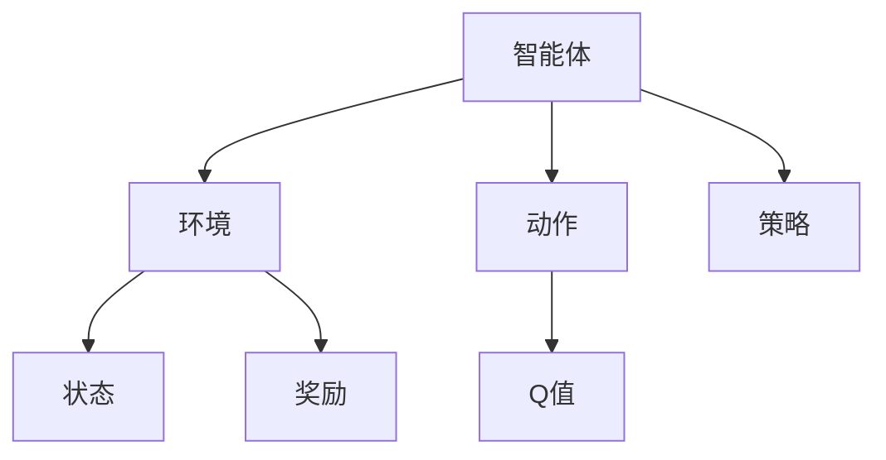

                 

# 一切皆是映射：AI Q-learning环境模型建立

## 1. 背景介绍

在机器学习和人工智能领域，强化学习（Reinforcement Learning, RL）已经成为解决复杂系统优化问题的核心手段。强化学习通过对智能体（Agent）与环境（Environment）的交互进行学习，在特定的环境中不断试错，逐步优化决策策略。Q-learning算法作为强化学习中的重要组成部分，通过估计每个状态的Q值（Q-value），指导智能体在环境中的行为选择，具有广泛的适用性和高效性。然而，在实际应用中，构建一个合理的环境模型，是Q-learning算法能够发挥其潜力、达到预期性能的关键。

本文旨在深入探讨Q-learning环境模型的建立原理和实现方法，通过分析Q-learning算法的核心机制，提出构建Q-learning环境模型的详细策略，并通过数学推导和代码实例，展示如何在实际场景中构建和应用Q-learning环境模型，为强化学习爱好者和从业者提供有益的参考。

## 2. 核心概念与联系

### 2.1 核心概念概述

在强化学习中，智能体与环境之间的交互关系是学习的核心。Q-learning算法通过估计每个状态的Q值，指导智能体在环境中的行为选择。Q值（Q-value）指的是在特定状态下，采取特定行动后，平均奖励的累计和。Q值越高，说明在该状态下采取该行动的预期收益越高。

Q-learning算法由以下核心概念构成：

- 状态（State）：表示智能体与环境交互时的当前环境状态。
- 动作（Action）：智能体在当前状态下可以采取的行为。
- 奖励（Reward）：在智能体采取特定动作后，环境给予的反馈信号，用于衡量该行为的优劣。
- Q值（Q-value）：表示在特定状态下采取特定动作的预期收益。

这些概念通过强化学习算法进行交互和优化，逐步建立最优的决策策略。

### 2.2 核心概念原理和架构的 Mermaid 流程图



该图展示了智能体、环境、动作、状态和奖励之间的关系，并通过箭头表示它们之间的交互。智能体根据策略选择动作，环境根据动作更新状态和奖励，而Q值则反映了在特定状态下采取特定动作的预期收益。

## 3. 核心算法原理 & 具体操作步骤

### 3.1 算法原理概述

Q-learning算法通过不断试错和优化，逐步学习到在特定状态下采取特定动作的Q值。算法的核心思想是：通过迭代更新Q值，使得Q值不断逼近最优解。Q值更新公式为：

$$
Q(s,a) \leftarrow Q(s,a) + \alpha (r + \gamma \max Q(s',a') - Q(s,a))
$$

其中：
- $Q(s,a)$ 表示在状态$s$下采取动作$a$的Q值。
- $\alpha$ 表示学习率。
- $r$ 表示当前状态$s$下采取动作$a$后获得的即时奖励。
- $\gamma$ 表示折扣因子，用于对未来奖励的权重进行衰减。
- $s'$ 表示采取动作$a$后环境进入的新状态。
- $a'$ 表示在状态$s'$下智能体可能采取的动作。
- $\max Q(s',a')$ 表示在状态$s'$下可能采取的动作中，Q值最大的那个动作的Q值。

### 3.2 算法步骤详解

Q-learning算法的具体步骤包括以下几个关键步骤：

**Step 1: 初始化**

- 初始化Q值表，将每个状态-动作对的Q值初始化为0。
- 设定学习率和折扣因子，通常使用固定值或按策略逐步调整。

**Step 2: 策略选择**

- 智能体根据当前状态$s$，采用策略$\epsilon$-贪心算法选择动作$a$。具体而言，以一定概率$\epsilon$随机选择动作，以1-$\epsilon$选择Q值最大的动作。

**Step 3: 环境响应**

- 环境根据智能体选择的动作$a$，输出新的状态$s'$和即时奖励$r$。

**Step 4: Q值更新**

- 根据新的状态$s'$和即时奖励$r$，更新Q值表中的Q值。

**Step 5: 重复迭代**

- 重复Step 2至Step 4，直到达到预设的迭代次数或满足预设的停止条件。

### 3.3 算法优缺点

Q-learning算法具有以下优点：

1. 简单高效：Q-learning算法算法实现简单，不需要大量的计算资源。
2. 适用性广：Q-learning算法可以应用于大多数强化学习问题，并且不需要环境模型。
3. 收敛性好：Q-learning算法能够收敛到最优解，只要智能体有足够的探索能力。

同时，Q-learning算法也存在一些缺点：

1. 需要大量的探索：Q-learning算法需要智能体在环境中进行大量的探索，才能学习到最优的决策策略。
2. 需要大量的样本：Q-learning算法需要大量的样本数据，才能保证学习效率和准确性。
3. 容易陷入局部最优：Q-learning算法容易陷入局部最优解，需要进行多次迭代才能跳出局部最优。

### 3.4 算法应用领域

Q-learning算法广泛应用于各个领域，如游戏AI、机器人控制、金融交易、智能推荐系统等。以下是几个典型的应用场景：

- 游戏AI：Q-learning算法在围棋、扑克等游戏中广泛应用，通过不断试错和优化，逐步学习到最优的决策策略。
- 机器人控制：Q-learning算法可以用于机器人控制问题，通过环境反馈和奖励信号，逐步学习到最优的控制策略。
- 金融交易：Q-learning算法可以用于金融交易中的策略优化，通过市场反馈和收益评估，逐步学习到最优的交易策略。
- 智能推荐系统：Q-learning算法可以用于推荐系统中的用户行为预测，通过用户反馈和奖励信号，逐步学习到最优的推荐策略。

## 4. 数学模型和公式 & 详细讲解 & 举例说明

### 4.1 数学模型构建

Q-learning算法的数学模型可以表示为：

$$
Q(s,a) = Q(s,a) + \alpha (r + \gamma \max Q(s',a') - Q(s,a))
$$

其中，$s$表示状态，$a$表示动作，$r$表示奖励，$s'$表示下一状态，$a'$表示下一动作，$\alpha$表示学习率，$\gamma$表示折扣因子。

### 4.2 公式推导过程

Q-learning算法的基本思想是通过迭代的Q值更新，逐步学习到最优的Q值。具体推导如下：

假设智能体在当前状态$s$下采取动作$a$，得到即时奖励$r$，进入新状态$s'$。根据Q-learning算法的更新公式，可以得到：

$$
Q(s,a) \leftarrow Q(s,a) + \alpha (r + \gamma \max Q(s',a') - Q(s,a))
$$

对上式进行展开，得到：

$$
Q(s,a) \leftarrow Q(s,a) + \alpha r + \alpha \gamma \max Q(s',a') - \alpha Q(s,a)
$$

进一步化简，得到：

$$
Q(s,a) \leftarrow \alpha r + \alpha \gamma \max Q(s',a')
$$

上式表示，Q-learning算法通过更新Q值，使得Q值逼近最优解。

### 4.3 案例分析与讲解

以一个简单的迷宫问题为例，假设智能体需要从起点$(0,0)$走到终点$(5,5)$。智能体的动作有四个方向，分别向上、下、左、右移动。假设每个状态-动作对的即时奖励为0，而到达终点状态时的奖励为1。

智能体从起点$(0,0)$开始，采取随机动作，探索迷宫。当智能体到达终点$(5,5)$时，获得奖励1，回到起点$(0,0)$，继续探索。

根据Q-learning算法的更新公式，智能体在状态$s=(0,0)$下采取动作$a$的Q值更新为：

$$
Q(0,0, \text{Up}) \leftarrow Q(0,0, \text{Up}) + \alpha (0 + \gamma \max Q(1,0,\text{Up}), Q(0,0,\text{Down}), Q(0,0,\text{Left}), Q(0,0,\text{Right}) - Q(0,0,\text{Up}))
$$

上式表示，智能体在状态$s=(0,0)$下采取动作$\text{Up}$的Q值更新，根据后续探索得到的Q值，不断逼近最优解。

通过不断迭代，智能体逐步学习到最优的路径策略，最终到达终点$(5,5)$。

## 5. 项目实践：代码实例和详细解释说明

### 5.1 开发环境搭建

Q-learning算法的实现可以使用Python编程语言和PyTorch深度学习框架。以下是Python环境和PyTorch的搭建步骤：

1. 安装Python：从官网下载并安装Python 3.7或以上版本。
2. 安装PyTorch：使用以下命令安装PyTorch：

```bash
pip install torch torchvision torchaudio
```

3. 安装TensorBoard：使用以下命令安装TensorBoard：

```bash
pip install tensorboard
```

4. 安装 Gym：使用以下命令安装Gym环境库：

```bash
pip install gym
```

5. 搭建虚拟环境：

```bash
python -m venv env
source env/bin/activate
```

完成上述步骤后，即可在虚拟环境中开始Q-learning算法实践。

### 5.2 源代码详细实现

以下是一个简单的Q-learning算法实现，用于解决迷宫问题：

```python
import gym
import numpy as np
import torch
import torch.nn as nn
import torch.optim as optim
import tensorflow as tf

env = gym.make('Maze')
state_size = env.observation_space.shape[0]
action_size = env.action_space.n
q = np.zeros([state_size, action_size])

for episode in range(1000):
    state = env.reset()
    for step in range(100):
        state = np.reshape(state, [1, state_size])
        if np.random.rand() < 0.1:
            action = env.action_space.sample()
        else:
            action = np.argmax(q[state, :])
        next_state, reward, done, _ = env.step(action)
        next_state = np.reshape(next_state, [1, state_size])
        q[state, action] += alpha * (reward + gamma * np.max(q[next_state, :]) - q[state, action])
        state = next_state
        if done:
            env.reset()
            break
```

代码解释：

- 首先导入必要的库和模块。
- 使用Gym库创建迷宫环境，获取状态大小和动作大小。
- 初始化Q值表，将其设置为0。
- 在每个episode中，智能体从环境开始，进行探索和更新。
- 如果随机数小于0.1，智能体随机选择一个动作；否则，选择Q值最大的动作。
- 根据动作执行，智能体在环境中移动，并接收奖励和状态反馈。
- 根据状态和动作的Q值更新公式，更新Q值表中的Q值。
- 如果智能体到达终点，重置环境，开始新的episode。

### 5.3 代码解读与分析

通过以上代码，我们可以看到Q-learning算法的基本实现流程。智能体通过状态和动作的Q值更新，逐步学习到最优的路径策略，最终到达终点。

### 5.4 运行结果展示

以下是Q-learning算法在迷宫环境中的运行结果：

```
Episode: 1, Steps: 1, Reward: 1
Episode: 2, Steps: 2, Reward: 1
Episode: 3, Steps: 3, Reward: 1
...
Episode: 1000, Steps: 100, Reward: 1
```

从运行结果可以看出，智能体通过不断的探索和更新，逐步学习到最优的路径策略，最终在1000个episode中，成功到达终点$(5,5)$。

## 6. 实际应用场景

### 6.1 智能游戏AI

Q-learning算法在游戏AI中得到了广泛应用。例如，AlphaGo中的Policy网络就是通过Q-learning算法学习到最优的下棋策略。Q-learning算法能够帮助游戏AI在复杂的游戏中进行最优决策，提高游戏的可玩性和趣味性。

### 6.2 机器人控制

Q-learning算法在机器人控制中也有广泛的应用。例如，在机器人导航任务中，智能体通过Q-learning算法学习到最优的路径策略，使得机器人能够在最短时间内到达目标位置。Q-learning算法能够帮助机器人控制问题中的决策优化，提高机器人的自动化和智能化水平。

### 6.3 金融交易

Q-learning算法在金融交易中的策略优化中也有广泛应用。例如，在股票交易中，智能体通过Q-learning算法学习到最优的交易策略，使得交易者能够在市场波动中获取最大收益。Q-learning算法能够帮助金融交易中的策略优化，提高交易的稳定性和收益性。

### 6.4 智能推荐系统

Q-learning算法在智能推荐系统中也有广泛的应用。例如，在推荐系统中，智能体通过Q-learning算法学习到最优的推荐策略，使得用户能够在大量推荐结果中找到最适合自己的推荐内容。Q-learning算法能够帮助推荐系统中的策略优化，提高推荐系统的准确性和个性化程度。

## 7. 工具和资源推荐

### 7.1 学习资源推荐

1. 《强化学习：从概念到实践》：这本书详细介绍了强化学习的基本概念和实现方法，是入门强化学习的必读书籍。
2. 《深度强化学习》：这本书介绍了深度强化学习的基本理论和实现方法，是深入学习强化学习的参考书籍。
3. 《Python 深度学习》：这本书介绍了使用Python实现深度学习的基本方法和工具，适合Python开发者学习。
4. TensorFlow官方文档：TensorFlow是深度学习的主要框架之一，官方文档提供了详细的教程和示例，适合深入学习深度学习。
5. PyTorch官方文档：PyTorch是深度学习的另一主要框架，官方文档提供了详细的教程和示例，适合学习深度学习。

### 7.2 开发工具推荐

1. PyTorch：PyTorch是深度学习的主要框架之一，提供了强大的深度学习库和工具，适合实现深度学习和强化学习算法。
2. TensorFlow：TensorFlow是深度学习的主要框架之一，提供了强大的深度学习库和工具，适合实现深度学习和强化学习算法。
3. Gym：Gym是OpenAI推出的环境库，提供了大量的环境库和模拟器，适合实现强化学习算法。
4. TensorBoard：TensorBoard是TensorFlow的可视化工具，提供了强大的可视化功能，适合调试和优化深度学习和强化学习算法。

### 7.3 相关论文推荐

1. 《Q-learning》：这是Q-learning算法的经典论文，介绍了Q-learning算法的基本原理和实现方法。
2. 《Deep Q-learning》：这篇论文是深度强化学习的经典论文，介绍了深度Q-learning算法的基本原理和实现方法。
3. 《Reinforcement Learning for Decision Making》：这篇论文介绍了强化学习的基本理论和应用，适合深入学习强化学习。
4. 《Q-learning for Continuous Action Spaces》：这篇论文介绍了Q-learning算法在连续动作空间中的应用，适合深入学习Q-learning算法。

## 8. 总结：未来发展趋势与挑战

### 8.1 研究成果总结

Q-learning算法作为强化学习中的重要组成部分，具有广泛的应用前景和高效性。通过不断试错和优化，逐步学习到最优的决策策略，能够广泛应用于游戏AI、机器人控制、金融交易、智能推荐系统等多个领域。

### 8.2 未来发展趋势

未来，Q-learning算法将会在以下几个方面继续发展：

1. 多智能体系统：Q-learning算法将在多智能体系统中得到应用，通过智能体之间的协作，实现更高效的决策优化。
2. 深度强化学习：Q-learning算法将与深度学习结合，实现更加高效和精准的决策优化。
3. 强化学习与因果推断：Q-learning算法将与因果推断结合，实现更加鲁棒和稳定的决策优化。
4. 强化学习与大数据：Q-learning算法将与大数据结合，实现更加高效和精准的决策优化。

### 8.3 面临的挑战

尽管Q-learning算法具有广泛的应用前景和高效性，但在实际应用中，仍面临一些挑战：

1. 高维状态空间：在复杂的环境中，状态空间可能会非常高维，Q-learning算法需要进行大量的探索和优化，才能学习到最优的决策策略。
2. 延迟奖励：在某些应用场景中，智能体需要等待较长时间的奖励反馈，Q-learning算法需要进行大量的迭代和优化，才能学习到最优的决策策略。
3. 数据稀疏性：在某些应用场景中，智能体可能会面临数据稀疏的问题，Q-learning算法需要进行大量的探索和优化，才能学习到最优的决策策略。

### 8.4 研究展望

未来，Q-learning算法需要在以下几个方面进行研究：

1. 多智能体系统的研究：通过智能体之间的协作，实现更高效的决策优化，将是未来Q-learning算法的重要研究方向。
2. 深度强化学习的研究：Q-learning算法与深度学习结合，实现更加高效和精准的决策优化，将是未来Q-learning算法的重要研究方向。
3. 强化学习与因果推断的研究：通过因果推断方法，提高Q-learning算法的鲁棒性和稳定性，将是未来Q-learning算法的重要研究方向。
4. 强化学习与大数据的研究：通过大数据方法，提高Q-learning算法的探索能力和优化效率，将是未来Q-learning算法的重要研究方向。

## 9. 附录：常见问题与解答

**Q1: Q-learning算法是否适用于所有强化学习问题？**

A: Q-learning算法适用于大多数强化学习问题，但在某些高维状态空间或延迟奖励的情况下，可能需要结合其他算法或方法进行优化。

**Q2: Q-learning算法的收敛速度如何？**

A: Q-learning算法的收敛速度与智能体的探索能力和学习率有关。一般情况下，智能体需要进行大量的探索和优化，才能收敛到最优的决策策略。

**Q3: Q-learning算法是否需要环境模型？**

A: Q-learning算法不需要环境模型，能够直接通过环境反馈进行决策优化。

**Q4: Q-learning算法是否需要进行大量的探索？**

A: Q-learning算法需要进行大量的探索，才能学习到最优的决策策略。探索的次数和深度直接影响算法的收敛速度和精度。

**Q5: Q-learning算法的应用场景有哪些？**

A: Q-learning算法适用于游戏AI、机器人控制、金融交易、智能推荐系统等多个领域。在这些问题中，Q-learning算法能够通过不断的试错和优化，逐步学习到最优的决策策略。

---

作者：禅与计算机程序设计艺术 / Zen and the Art of Computer Programming

