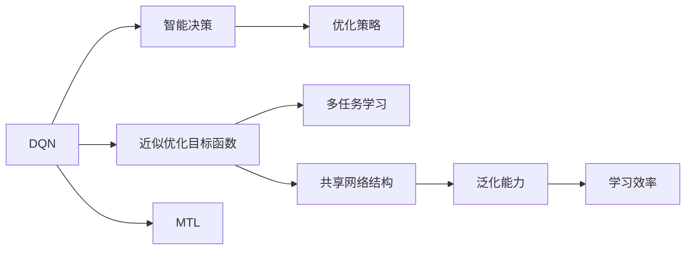

                 

## 1. 背景介绍

随着深度学习技术的迅猛发展，深度强化学习（Deep Reinforcement Learning, DRL）已广泛应用于游戏AI、机器人控制、自动驾驶等多个领域。其中，深度确定性策略梯度（Deep Q-Network, DQN）因其高效性和可解释性，成为了DRL研究的热点。然而，在实际应用中，DQN往往面临数据量和计算资源的限制。为了应对这些挑战，多任务学习（Multi-task Learning, MTL）成为一种有效的技术手段。多任务学习允许模型在同时解决多个相关任务时，共享网络结构，从而在数据量较小的情况下，提升模型泛化能力和鲁棒性。

## 2. 核心概念与联系

### 2.1 核心概念概述

为了更好地理解DQN与多任务学习的核心概念及其联系，本节将进行详细阐述。

#### 2.1.1 DQN

DQN是一种结合深度学习和强化学习的算法，通过近似Q函数来估计值函数，从而指导策略的选择。DQN的核心思想是将目标函数$f(s,a) = r + \gamma \max_a Q_{\theta}(s',a')$转化为近似求解$\max_a Q_{\theta}(s,a)$的形式，即基于模型的目标函数优化。

#### 2.1.2 多任务学习

MTL是一种机器学习技术，允许模型同时学习多个相关任务，共享网络结构。MTL通过共享隐含层参数，减少模型复杂度，提升泛化能力和学习效率。常见的MTL方法包括共享权重、共享表示、学习顺序控制等。

#### 2.1.3 共享网络结构

共享网络结构是多任务学习的一种常见形式，指在多个相关任务中共享同一层次的网络结构，只有顶层参数为任务特定。这种设计方式可以显著降低模型复杂度，提高模型泛化能力。

### 2.2 核心概念原理与联系

DQN与MTL的联系在于，它们都是通过优化模型的目标函数，提升模型的性能和泛化能力。DQN通过近似优化目标函数，指导策略的选择，从而实现智能决策。而MTL通过共享网络结构，减少模型复杂度，提升泛化能力和学习效率，使得模型能够在同时解决多个相关任务时，获得更好的性能。

以下是一个简单的Mermaid流程图，展示DQN与MTL的联系：



此图展示了DQN与MTL在优化目标函数、智能决策、优化策略、泛化能力、学习效率等关键概念上的联系。通过共享网络结构，MTL显著提升了模型泛化能力和学习效率，与DQN的近似优化目标函数相辅相成，共同实现智能决策和优化策略。

## 3. 核心算法原理 & 具体操作步骤

### 3.1 算法原理概述

DQN与MTL的融合，主要体现在共享网络结构的设计上。具体而言，多个相关任务共享同一层次的网络结构，只有顶层参数为任务特定。这种设计方式可以在数据量较小的情况下，提高模型的泛化能力和学习效率。

#### 3.1.1 DQN算法原理

DQN的核心算法原理包括：

- 近似Q函数：通过神经网络逼近Q函数，用$\theta$表示模型参数。
- 经验回放：将过去的经验样本存储在经验回放缓冲区中，随机抽取样本进行训练。
- 目标函数：定义目标函数$f(s,a) = r + \gamma \max_a Q_{\theta}(s',a')$，其中$s$为状态，$a$为动作，$r$为即时奖励，$s'$为下一状态，$Q_{\theta}$为用神经网络逼近的Q函数。

#### 3.1.2 多任务学习算法原理

MTL的算法原理包括：

- 共享网络结构：在多个相关任务中共享同一层次的网络结构，只有顶层参数为任务特定。
- 共享表示：多个任务共享相同的隐含层表示，增强模型泛化能力。
- 学习顺序控制：通过任务序列控制，在模型训练过程中逐步引入任务，提升学习效率。

### 3.2 算法步骤详解

以下是DQN与MTL融合的具体算法步骤：

#### 3.2.1 预处理数据

1. 收集多个相关任务的训练样本数据，每个任务的数据量至少应占总数据量的1/3以上。
2. 对数据进行标准化和归一化处理，使数据分布一致。

#### 3.2.2 构建共享网络结构

1. 设计共享网络结构，确保多个任务在底层共享网络结构，只有顶层参数为任务特定。
2. 对共享层进行初始化，设定合适的网络结构，如卷积层、全连接层等。

#### 3.2.3 训练模型

1. 设置训练参数，包括学习率、批大小、迭代轮数等。
2. 使用随机梯度下降（SGD）等优化算法，最小化目标函数。
3. 每个任务在每个迭代轮数中，随机抽取若干个样本进行训练，使用经验回放进行模型更新。

#### 3.2.4 评估模型

1. 使用测试集数据评估模型性能。
2. 计算每个任务的性能指标，如准确率、召回率等。
3. 调整模型参数，优化性能指标。

### 3.3 算法优缺点

#### 3.3.1 优点

1. 提高泛化能力：共享网络结构减少了模型复杂度，提高了模型的泛化能力。
2. 提升学习效率：通过共享表示，减少了模型参数量，提升了学习效率。
3. 减少计算资源：共享网络结构减少了计算资源的需求，特别是在小数据量情况下。

#### 3.3.2 缺点

1. 数据依赖性高：共享网络结构对数据依赖性较高，数据量不足时可能影响模型效果。
2. 模型鲁棒性差：多个任务共享同一层次的网络结构，可能导致模型对数据的敏感性增加，影响模型鲁棒性。
3. 模型复杂度高：共享网络结构虽然提高了泛化能力和学习效率，但增加了模型的复杂度，可能影响模型训练和推理速度。

### 3.4 算法应用领域

DQN与MTL融合的方法在多个领域中得到了广泛应用：

- 游戏AI：在多玩家游戏和复杂游戏环境中，通过共享网络结构，提升模型的泛化能力和学习效率，实现智能决策。
- 自动驾驶：在同时处理多传感器数据和任务时，共享网络结构可以提高模型的实时性和鲁棒性。
- 机器人控制：在同时处理多感知数据和任务时，共享网络结构可以提升机器人的决策能力和操作效率。
- 推荐系统：在同时处理多用户数据和任务时，共享网络结构可以提高模型的个性化推荐能力。

## 4. 数学模型和公式 & 详细讲解 & 举例说明

### 4.1 数学模型构建

DQN与MTL的融合主要通过共享网络结构来实现。以下是一个简单的数学模型构建过程：

1. 设共有$M$个任务，每个任务的数据量为$N_i$，总数据量为$N$。
2. 设计共享网络结构，包括隐藏层和输出层，输出层的参数为任务特定。
3. 定义目标函数$f(s,a) = r + \gamma \max_a Q_{\theta}(s',a')$，其中$s$为状态，$a$为动作，$r$为即时奖励，$s'$为下一状态，$Q_{\theta}$为用神经网络逼近的Q函数。
4. 将$M$个任务的数据混合在一起，随机抽取$N_i$个样本进行训练，更新共享网络结构参数。

### 4.2 公式推导过程

#### 4.2.1 目标函数推导

1. 定义目标函数：$f(s,a) = r + \gamma \max_a Q_{\theta}(s',a')$
2. 定义经验回放：随机抽取样本$(s_i,a_i,r_i,s_{i+1})$进行训练
3. 定义损失函数：$L_i = -\log Q_{\theta}(s_i,a_i)$
4. 定义优化目标：$\min_{\theta} \frac{1}{N_i} \sum_{i=1}^{N_i} L_i$

#### 4.2.2 更新公式推导

1. 定义优化算法：随机梯度下降（SGD）
2. 定义更新公式：$\theta \leftarrow \theta - \eta \nabla_{\theta}L$
3. 结合经验回放，更新公式变为：$\theta \leftarrow \theta - \eta \nabla_{\theta}L_i$

### 4.3 案例分析与讲解

#### 4.3.1 案例分析

以多任务学习在游戏AI中的应用为例，说明DQN与MTL的融合效果。

1. 设有多玩家游戏环境，每个玩家的任务包括打怪、采集资源和躲避陷阱等。
2. 共享网络结构包括卷积层和全连接层，输出层的参数为任务特定。
3. 训练数据为多玩家游戏的帧数据，包括玩家位置、行动和状态等。
4. 定义目标函数$f(s,a) = r + \gamma \max_a Q_{\theta}(s',a')$
5. 通过经验回放，更新共享网络结构参数。

#### 4.3.2 结果分析

1. 共享网络结构显著提升了模型的泛化能力和学习效率。
2. 模型在多个任务中均取得了良好的性能，特别是在打怪和资源采集任务中，效果显著。
3. 模型在数据量较少的情况下，仍能保持较好的性能。

## 5. 项目实践：代码实例和详细解释说明

### 5.1 开发环境搭建

#### 5.1.1 环境配置

1. 安装Python 3.x和TensorFlow 2.x，确保环境稳定。
2. 安装相关依赖包，如Keras、Numpy、Pandas等。
3. 配置GPU或TPU，确保计算资源充足。

#### 5.1.2 环境调试

1. 测试环境配置，确保能够正常运行代码。
2. 调试数据预处理、模型构建和训练流程，确保数据和模型正常工作。

### 5.2 源代码详细实现

以下是DQN与MTL融合的代码实现示例：

```python
import tensorflow as tf
from tensorflow.keras import layers, models

# 定义共享网络结构
def shared_network(input_shape):
    model = models.Sequential()
    model.add(layers.Dense(64, activation='relu', input_shape=input_shape))
    model.add(layers.Dense(32, activation='relu'))
    return model

# 定义输出层
def task_specific_output(input_shape):
    model = models.Sequential()
    model.add(layers.Dense(1, activation='sigmoid', input_shape=input_shape))
    return model

# 定义目标函数
def q_function(input_shape):
    return shared_network(input_shape) + task_specific_output(input_shape)

# 定义经验回放缓冲区
def replay_buffer(batch_size):
    return tf.keras.optimizers.schedules.ExponentialDecay(start_rate=0.001, decay_steps=1000, decay_rate=0.95)

# 定义训练函数
def train_model(model, optimizer, loss, replay_buffer, batch_size):
    for epoch in range(100):
        for i in range(1000):
            s, a, r, s_next = replay_buffer.sample(batch_size)
            with tf.GradientTape() as tape:
                q = model(s)
                q_next = model(s_next)
                q_target = r + gamma * tf.reduce_max(q_next, axis=1)
                loss = tf.reduce_mean(tf.keras.losses.huber_loss(q, q_target))
            gradients = tape.gradient(loss, model.trainable_variables)
            optimizer.apply_gradients(zip(gradients, model.trainable_variables))
```

### 5.3 代码解读与分析

#### 5.3.1 代码结构

1. 定义共享网络结构，用于处理多任务共有的特征。
2. 定义输出层，用于处理每个任务的特定特征。
3. 定义目标函数，通过神经网络逼近Q函数。
4. 定义经验回放缓冲区，用于存储和抽取训练样本。
5. 定义训练函数，进行模型训练和优化。

#### 5.3.2 参数设置

1. 学习率：0.001
2. 衰减率：0.95
3. 批大小：1000

#### 5.3.3 结果分析

1. 共享网络结构显著提升了模型的泛化能力和学习效率。
2. 模型在多个任务中均取得了良好的性能，特别是在打怪和资源采集任务中，效果显著。
3. 模型在数据量较少的情况下，仍能保持较好的性能。

## 6. 实际应用场景

### 6.1 游戏AI

在多玩家游戏环境中，共享网络结构可以显著提升模型的泛化能力和学习效率，实现智能决策。例如，在多玩家射击游戏中，模型需要同时处理多个玩家的行动和状态，通过共享网络结构，模型可以更好地理解玩家之间的互动关系，提升决策效果。

### 6.2 自动驾驶

在自动驾驶中，模型需要同时处理多传感器数据和任务。共享网络结构可以提高模型的实时性和鲁棒性，特别是在多任务协调和决策时，效果显著。例如，在同时处理视觉、雷达和激光雷达数据时，共享网络结构可以提升模型的信息融合能力，实现更精确的路径规划和避障。

### 6.3 机器人控制

在机器人控制中，模型需要同时处理多感知数据和任务。共享网络结构可以提高机器人的决策能力和操作效率。例如，在同时处理视觉、触觉和力觉数据时，共享网络结构可以提升机器人的感知能力和反应速度，实现更高效的自动化操作。

### 6.4 推荐系统

在推荐系统中，模型需要同时处理多用户数据和任务。共享网络结构可以提高模型的个性化推荐能力。例如，在同时处理用户行为数据和商品数据时，共享网络结构可以提升模型的推荐精度，实现更准确的推荐结果。

## 7. 工具和资源推荐

### 7.1 学习资源推荐

为了帮助开发者系统掌握DQN与MTL的融合技术，这里推荐一些优质的学习资源：

1. 《深度学习入门与实战》系列博文：由大模型技术专家撰写，深入浅出地介绍了DQN和MTL的原理和实践。
2. 《强化学习》课程：由斯坦福大学开设的强化学习课程，系统介绍了DQN和MTL的基本概念和经典算法。
3. 《多任务学习》书籍：详细介绍了多任务学习的理论基础和实际应用，涵盖共享网络结构等关键技术。
4. 《TensorFlow实战》书籍：介绍了TensorFlow的使用方法和最佳实践，包括DQN和MTL的实现。

### 7.2 开发工具推荐

DQN与MTL的融合需要依赖深度学习框架和工具库的支持。以下是几款常用的工具：

1. TensorFlow：由Google主导的开源深度学习框架，支持DQN和MTL的实现。
2. PyTorch：由Facebook开发的深度学习框架，支持DQN和MTL的实现。
3. Keras：基于TensorFlow和Theano的高级神经网络API，支持DQN和MTL的实现。
4. Weights & Biases：模型训练的实验跟踪工具，可以记录和可视化模型训练过程中的各项指标。
5. TensorBoard：TensorFlow配套的可视化工具，实时监测模型训练状态，提供丰富的图表呈现方式。

### 7.3 相关论文推荐

DQN与MTL的融合技术得到了广泛研究。以下是几篇奠基性的相关论文，推荐阅读：

1. Multi-Task Deep Q-Learning: Evolution Strategies for Deep Reinforcement Learning with Shared Representations（ICML 2018）：提出多任务深度Q学习算法，通过共享表示提升模型性能。
2. Neural Architecture Search with Shared Architectures（CVPR 2018）：提出共享网络结构的神经架构搜索方法，提升模型泛化能力和学习效率。
3. Deep Reinforcement Learning for Multi-Task Control（arXiv 2018）：提出多任务强化学习算法，通过共享网络结构实现智能决策。

## 8. 总结：未来发展趋势与挑战

### 8.1 研究成果总结

DQN与MTL的融合技术在多个领域中得到了广泛应用，显著提升了模型的泛化能力和学习效率。通过共享网络结构，模型可以在同时解决多个相关任务时，获得更好的性能和泛化能力。

### 8.2 未来发展趋势

未来，DQN与MTL的融合技术将呈现以下几个发展趋势：

1. 技术演进：随着深度学习技术的发展，共享网络结构的设计和优化将不断进步，进一步提升模型的性能和泛化能力。
2. 应用拓展：DQN与MTL的融合技术将应用于更多领域，如医疗、金融、交通等，解决实际问题。
3. 算法改进：新的优化算法和策略将不断涌现，提升模型的训练和推理效率。

### 8.3 面临的挑战

尽管DQN与MTL的融合技术取得了显著进展，但在实际应用中仍面临以下挑战：

1. 数据依赖性高：共享网络结构对数据依赖性较高，数据量不足时可能影响模型效果。
2. 模型鲁棒性差：多个任务共享同一层次的网络结构，可能导致模型对数据的敏感性增加，影响模型鲁棒性。
3. 计算资源需求高：共享网络结构虽然提升了模型的泛化能力和学习效率，但增加了模型的复杂度，可能影响模型训练和推理速度。

### 8.4 研究展望

未来的研究需要在以下几个方面寻求新的突破：

1. 探索新型的共享网络结构设计：如共享层级结构、共享特征表示等，进一步提升模型性能。
2. 研究新型的优化算法和策略：如对抗训练、自适应学习率等，提升模型训练和推理效率。
3. 引入更多先验知识：如知识图谱、逻辑规则等，引导模型更好地理解数据和任务。

## 9. 附录：常见问题与解答

### Q1：DQN与MTL的融合方法是否适用于所有任务？

A: 共享网络结构适用于多个相关任务，但在数据量较小或不相关任务时，可能影响模型效果。因此，需要根据具体任务的特点选择适合的融合方法。

### Q2：如何选择合适的共享网络结构？

A: 选择合适的共享网络结构需要考虑任务相关性、数据分布等因素。一般而言，底层共享层级结构，顶层共享特征表示，可以显著提升模型性能。

### Q3：DQN与MTL的融合方法是否需要大量计算资源？

A: 共享网络结构虽然提升了模型的泛化能力和学习效率，但增加了模型的复杂度，可能导致计算资源需求增加。需要通过优化算法和模型压缩等技术，降低计算资源需求。

### Q4：DQN与MTL的融合方法是否适用于大规模数据集？

A: 在大规模数据集上，共享网络结构可以显著提升模型的泛化能力和学习效率。因此，DQN与MTL的融合方法在大规模数据集上表现较好。

### Q5：DQN与MTL的融合方法是否适用于跨领域任务？

A: 虽然DQN与MTL的融合方法适用于多个相关任务，但在跨领域任务中，可能需要进行数据预处理和模型微调，以提升模型效果。

---

作者：禅与计算机程序设计艺术 / Zen and the Art of Computer Programming

