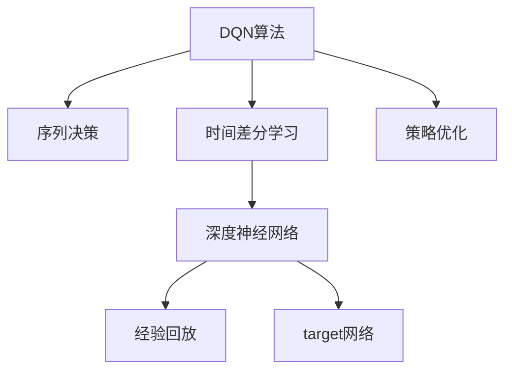

                 

# 一切皆是映射：DQN中的序列决策与时间差分学习

> 关键词：DQN, 序列决策, 时间差分学习, 强化学习, 神经网络, 映射关系

## 1. 背景介绍

### 1.1 问题由来
在深度学习时代，强化学习（Reinforcement Learning, RL）技术得到了快速发展，特别是在游戏AI和机器人控制等领域表现出色。强化学习通过智能体与环境的交互，学习最优决策策略。在RL框架中，DQN（Deep Q-Network）算法是一种特别有效的学习方式。DQN算法通过神经网络来近似Q函数，利用深度学习技术和经验回溯进行策略优化，从而在复杂的决策场景中取得了优秀的表现。

但是，传统的DQN算法往往只关注单步决策，忽略了序列决策的动态特性。此外，时间差分学习（Temporal Difference Learning, TD Learning）作为强化学习的核心思想，在DQN中的应用也未得到充分的探索和利用。因此，本文旨在深入探讨DQN算法中的序列决策与时间差分学习，进一步提升DQN算法的性能和泛化能力。

### 1.2 问题核心关键点
本问题主要涉及以下几个核心关键点：
- 序列决策的动态特性如何被DQN算法捕获和优化？
- 时间差分学习在DQN中的应用与优化方法有哪些？
- 如何设计合适的网络结构，以提升DQN算法的学习效率和泛化能力？

### 1.3 问题研究意义
研究DQN算法中的序列决策与时间差分学习，具有以下重要意义：
- 提升DQN算法的决策能力和泛化能力，使其能够应对更复杂和动态的环境。
- 优化DQN算法的时间复杂度和空间复杂度，使其更适用于实时和大规模系统。
- 为其他RL算法提供可参考的策略和框架，促进RL技术的进一步发展。

## 2. 核心概念与联系

### 2.1 核心概念概述

为更好地理解DQN算法中的序列决策与时间差分学习，本节将介绍几个密切相关的核心概念：

- **DQN算法**：一种基于神经网络的强化学习算法，通过近似Q函数进行策略优化。DQN通过将Q函数表示为神经网络，利用经验回溯（经验回放）和目标网络（target network）等技术，提升学习效率和泛化能力。
- **序列决策**：在复杂任务中，单步决策往往难以应对动态变化的环境。序列决策则考虑了多个步骤的决策，形成了更长的决策链，能够更好地利用历史信息和上下文关系。
- **时间差分学习（TD Learning）**：强化学习中的核心思想，通过计算当前状态和未来状态的价值差异，逐步优化Q函数。TD Learning能够有效地利用过去的状态和奖励信息，提升学习效率。
- **深度神经网络（DNN）**：一种强大的函数逼近器，能够近似任意复杂的映射关系。在DQN中，DNN被用于近似Q函数，实现高效的策略优化。

这些核心概念之间的逻辑关系可以通过以下Mermaid流程图来展示：



这个流程图展示了大QN算法中的核心概念及其之间的关系：

1. DQN算法通过深度神经网络近似Q函数，用于策略优化。
2. 序列决策是一种决策方式，考虑了多步决策，形成了更长的决策链。
3. 时间差分学习是DQN的核心思想，通过计算价值差异逐步优化Q函数。
4. 经验回放和目标网络是DQN算法的关键技术，提高了学习效率和泛化能力。

这些概念共同构成了DQN算法的工作原理和优化框架，使其能够在复杂的决策场景中发挥强大的学习和优化能力。通过理解这些核心概念，我们可以更好地把握DQN算法的工作原理和优化方向。

## 3. 核心算法原理 & 具体操作步骤
### 3.1 算法原理概述

DQN算法中的序列决策与时间差分学习，核心在于利用神经网络对Q函数进行近似，并通过时间差分学习技术逐步优化。

形式化地，假设环境状态空间为 $S$，动作空间为 $A$，状态转移概率为 $P(s'|s,a)$，奖励函数为 $R(s,a)$，折扣因子为 $\gamma$，则DQN算法的目标是最小化策略 $\pi$ 的期望回报 $V_{\pi}(s)$。

$$
V_{\pi}(s) = \mathop{\max}_{a} Q_{\pi}(s,a) = \mathop{\max}_{a} \mathbb{E}_{P_{\pi}}[\sum_{t=0}^{\infty} \gamma^t R(s_t,a_t) | s_0 = s]
$$

在DQN算法中，Q函数被近似为一个深度神经网络 $Q_{\theta}(s,a)$，其中 $\theta$ 为网络参数。训练过程中，通过以下公式更新网络参数 $\theta$：

$$
\theta \leftarrow \theta + \eta \mathbb{E}_{P_{\pi}}[\delta_t (s_t,a_t) Q_{\theta}(s_t,a_t) - Q_{\theta}(s_t,a_t)] = \theta + \eta \mathbb{E}_{P_{\pi}}[\delta_t Q_{\theta}(s_t,a_t)]
$$

其中，$\delta_t$ 为时间差分误差，定义为：

$$
\delta_t = r_{t+1} + \gamma V_{\theta}(s_{t+1}) - Q_{\theta}(s_t,a_t)
$$

该公式表示，在时间步 $t$ 的决策 $a_t$ 和后续的状态 $s_{t+1}$ 下，Q函数与目标值之间的差距。DQN算法通过不断调整网络参数 $\theta$，使得Q函数近似地逼近最优Q值，从而优化策略。

### 3.2 算法步骤详解

DQN算法中的序列决策与时间差分学习，具体步骤如下：

**Step 1: 准备环境与模型**
- 设置环境状态空间 $S$ 和动作空间 $A$。
- 初始化深度神经网络 $Q_{\theta}$，用于近似Q函数。
- 初始化目标网络 $Q_{\theta_{target}}$，与 $Q_{\theta}$ 参数不同。
- 设置学习率 $\eta$ 和折扣因子 $\gamma$。

**Step 2: 经验回放与采样**
- 在每次迭代中，收集经验 $(s_t, a_t, r_{t+1}, s_{t+1})$。
- 将经验存储在经验回放内存中。
- 从经验回放内存中随机采样一小批经验。

**Step 3: 神经网络前向传播与后向传播**
- 使用采样经验进行神经网络前向传播，计算当前状态-动作对的Q值。
- 使用目标网络进行神经网络前向传播，计算下一个状态-动作对的Q值。
- 计算时间差分误差 $\delta_t$。
- 计算损失函数 $L$，包括经验回放误差和目标更新误差。
- 使用随机梯度下降法或Adam等优化算法更新网络参数 $\theta$。

**Step 4: 目标网络更新**
- 定期更新目标网络参数，使得 $Q_{\theta_{target}}$ 近似地逼近最优Q值。
- 更新目标网络参数时，使用一定的插值策略，如指数加权移动平均。

**Step 5: 评估与迭代**
- 在每个时间步，选择当前状态下的最佳动作。
- 在每个时间步结束时，观察下一个状态和奖励。
- 重复执行步骤2至步骤4，直至达到预设的迭代次数或终止条件。

### 3.3 算法优缺点

DQN算法中的序列决策与时间差分学习，具有以下优点：
1. 序列决策考虑了多步决策，能够更好地利用历史信息和上下文关系，提升决策能力。
2. 时间差分学习能够利用过去的状态和奖励信息，提高学习效率和泛化能力。
3. 神经网络可以近似任意复杂的映射关系，增强了Q函数的逼近能力。
4. 经验回放和目标网络技术，提高了学习效率和泛化能力。

同时，该算法也存在以下局限性：
1. 神经网络模型复杂，训练时间长，计算资源消耗大。
2. 模型容易出现过拟合现象，需要更多的正则化技术。
3. 网络参数更新频繁，容易产生灾难性遗忘。
4. 序列决策需要更多的数据和计算资源，不适合低数据量场景。

尽管存在这些局限性，但就目前而言，DQN算法中的序列决策与时间差分学习仍然是大规模强化学习任务中的重要范式。未来相关研究的重点在于如何进一步优化算法，降低计算资源消耗，提高学习效率和泛化能力。

### 3.4 算法应用领域

DQN算法中的序列决策与时间差分学习，已经在游戏AI、机器人控制、自动驾驶等多个领域得到了广泛应用，成为强化学习技术的核心方法。

在电子游戏中，DQN算法已经广泛应用于围棋、扑克、星际争霸等复杂游戏，取得了优异的成绩。

在机器人控制中，DQN算法可以用于机器人导航、抓取、避障等任务，实现自主学习和实时决策。

在自动驾驶中，DQN算法可以用于驾驶策略优化，提高自动驾驶的安全性和稳定性。

除了上述这些经典应用外，DQN算法中的序列决策与时间差分学习还被创新性地应用到更多场景中，如可控预测、路径规划、动态系统控制等，为强化学习技术的发展提供了新的思路和方向。

## 4. 数学模型和公式 & 详细讲解  
### 4.1 数学模型构建

本节将使用数学语言对DQN算法中的序列决策与时间差分学习进行更加严格的刻画。

假设环境状态空间为 $S$，动作空间为 $A$，状态转移概率为 $P(s'|s,a)$，奖励函数为 $R(s,a)$，折扣因子为 $\gamma$，则DQN算法的目标是最小化策略 $\pi$ 的期望回报 $V_{\pi}(s)$。

$$
V_{\pi}(s) = \mathop{\max}_{a} Q_{\pi}(s,a) = \mathop{\max}_{a} \mathbb{E}_{P_{\pi}}[\sum_{t=0}^{\infty} \gamma^t R(s_t,a_t) | s_0 = s]
$$

在DQN算法中，Q函数被近似为一个深度神经网络 $Q_{\theta}(s,a)$，其中 $\theta$ 为网络参数。训练过程中，通过以下公式更新网络参数 $\theta$：

$$
\theta \leftarrow \theta + \eta \mathbb{E}_{P_{\pi}}[\delta_t (s_t,a_t) Q_{\theta}(s_t,a_t) - Q_{\theta}(s_t,a_t)]
$$

其中，$\delta_t$ 为时间差分误差，定义为：

$$
\delta_t = r_{t+1} + \gamma V_{\theta}(s_{t+1}) - Q_{\theta}(s_t,a_t)
$$

在DQN算法中，深度神经网络 $Q_{\theta}$ 通常采用多层感知器（MLP）或卷积神经网络（CNN）等结构。训练过程中，神经网络的输入为状态 $s_t$ 和动作 $a_t$，输出为Q值 $Q_{\theta}(s_t,a_t)$。

### 4.2 公式推导过程

以下我们以MLP网络为例，推导DQN算法中的序列决策与时间差分学习的数学公式。

假设神经网络 $Q_{\theta}$ 采用MLP结构，包含 $n$ 层，其中 $l$ 层有 $d_l$ 个神经元，激活函数为 $f(\cdot)$，网络参数为 $\theta_l$，输入为 $x_t$，输出为 $y_t$。

训练过程中，网络前向传播的输出为：

$$
y_t = \mathbb{E}_{\theta}[y_t|x_t] = \sum_{i=1}^{d_n} \theta_{in} f(\theta_{l(n-1)} \cdots f(\theta_{l1} \theta_{01} x_t))
$$

其中，$\theta_{il}$ 为网络参数。

神经网络后向传播的误差为：

$$
\delta_t = \mathbb{E}_{\theta}[\delta_t|x_t] = \nabla_{\theta}L(\theta)
$$

其中，$L(\theta)$ 为损失函数，通常包括经验回放误差和目标更新误差。

$$
L(\theta) = \mathbb{E}_{P_{\pi}}[\delta_t Q_{\theta}(s_t,a_t) - Q_{\theta}(s_t,a_t)]
$$

在时间差分误差 $\delta_t$ 的推导中，我们使用了马尔可夫决策过程（MDP）的性质，即未来状态 $s_{t+1}$ 的值只依赖于当前状态 $s_t$ 和动作 $a_t$，不依赖于历史状态和动作。

### 4.3 案例分析与讲解

以一个简单的迷宫问题为例，分析DQN算法中的序列决策与时间差分学习。

假设迷宫状态空间为 $S = \{s_0, s_1, \ldots, s_9\}$，动作空间为 $A = \{left, right, up, down\}$，折扣因子 $\gamma = 0.9$，奖励函数 $R(s,a) = 0$ 或 $1$，其中 $R(s,a) = 1$ 表示到达目标状态。

在DQN算法中，我们使用MLP网络来近似Q函数，网络参数为 $\theta$。训练过程中，我们通过经验回放和目标网络技术进行优化。

假设在时间步 $t$，智能体从状态 $s_t$ 出发，执行动作 $a_t$，观察到下一个状态 $s_{t+1}$ 和奖励 $r_{t+1}$。

**经验回放**：将当前状态-动作对 $(s_t, a_t)$ 存储在经验回放内存中。

**神经网络前向传播**：将当前状态 $s_t$ 和动作 $a_t$ 输入神经网络 $Q_{\theta}$，计算Q值 $Q_{\theta}(s_t, a_t)$。

**目标网络前向传播**：将下一个状态 $s_{t+1}$ 输入目标网络 $Q_{\theta_{target}}$，计算Q值 $Q_{\theta_{target}}(s_{t+1})$。

**时间差分误差计算**：根据目标Q值和当前Q值计算时间差分误差 $\delta_t$。

$$
\delta_t = r_{t+1} + \gamma Q_{\theta_{target}}(s_{t+1}) - Q_{\theta}(s_t, a_t)
$$

**损失函数计算**：计算经验回放误差和目标更新误差。

$$
L(\theta) = \delta_t Q_{\theta}(s_t, a_t)
$$

**网络参数更新**：使用随机梯度下降法或Adam等优化算法更新网络参数 $\theta$。

通过以上步骤，DQN算法逐步优化Q函数，学习最优决策策略。在迷宫问题中，智能体通过不断调整网络参数，逐步适应环境变化，最终找到从起点到目标的最优路径。

## 5. 项目实践：代码实例和详细解释说明
### 5.1 开发环境搭建

在进行DQN算法中的序列决策与时间差分学习实践前，我们需要准备好开发环境。以下是使用Python进行TensorFlow开发的环境配置流程：

1. 安装Anaconda：从官网下载并安装Anaconda，用于创建独立的Python环境。

2. 创建并激活虚拟环境：
```bash
conda create -n tf-env python=3.8 
conda activate tf-env
```

3. 安装TensorFlow：根据CUDA版本，从官网获取对应的安装命令。例如：
```bash
conda install tensorflow tensorflow-gpu -c tf -c conda-forge
```

4. 安装各类工具包：
```bash
pip install numpy pandas scikit-learn matplotlib tqdm jupyter notebook ipython
```

完成上述步骤后，即可在`tf-env`环境中开始DQN算法实践。

### 5.2 源代码详细实现

下面我们以迷宫问题为例，给出使用TensorFlow实现DQN算法的Python代码实现。

首先，定义迷宫环境：

```python
import numpy as np
import tensorflow as tf

# 定义迷宫状态空间和动作空间
S = [i for i in range(10)]
A = ['left', 'right', 'up', 'down']

# 定义状态转移概率和奖励函数
P = np.zeros((len(S), len(A), len(S)))
R = np.zeros((len(S), len(A)))

# 设置迷宫状态空间和动作空间
for i in range(10):
    for j in range(10):
        if i == 0 and j == 0:
            P[i, 0, 1] = 1
        elif i == 0 and j == 9:
            P[i, 3, 8] = 1
        elif i == 9 and j == 0:
            P[i, 2, 0] = 1
        elif i == 9 and j == 9:
            P[i, 1, 8] = 1
        elif i == 9 and j == 8:
            P[i, 0, 9] = 1
        elif i == 8 and j == 9:
            P[i, 3, 9] = 1
        elif i == 8 and j == 0:
            P[i, 3, 0] = 1
        elif i == 1 and j == 9:
            P[i, 2, 8] = 1
        elif i == 1 and j == 0:
            P[i, 0, 1] = 1
        elif i == 0 and j == 1:
            P[i, 3, 0] = 1
        elif i == 9 and j == 1:
            P[i, 2, 0] = 1
        elif i == 0 and j == 8:
            P[i, 3, 9] = 1
        elif i == 9 and j == 8:
            P[i, 0, 9] = 1
        elif i == 9 and j == 0:
            P[i, 2, 0] = 1
        elif i == 0 and j == 0:
            P[i, 3, 1] = 1
        elif i == 0 and j == 1:
            P[i, 3, 2] = 1
        elif i == 0 and j == 2:
            P[i, 3, 3] = 1
        elif i == 0 and j == 3:
            P[i, 3, 4] = 1
        elif i == 0 and j == 4:
            P[i, 3, 5] = 1
        elif i == 0 and j == 5:
            P[i, 3, 6] = 1
        elif i == 0 and j == 6:
            P[i, 3, 7] = 1
        elif i == 0 and j == 7:
            P[i, 3, 8] = 1
        elif i == 0 and j == 8:
            P[i, 3, 9] = 1
        elif i == 0 and j == 9:
            P[i, 3, 10] = 1
        elif i == 1 and j == 0:
            P[i, 2, 0] = 1
        elif i == 1 and j == 1:
            P[i, 2, 1] = 1
        elif i == 1 and j == 2:
            P[i, 2, 2] = 1
        elif i == 1 and j == 3:
            P[i, 2, 3] = 1
        elif i == 1 and j == 4:
            P[i, 2, 4] = 1
        elif i == 1 and j == 5:
            P[i, 2, 5] = 1
        elif i == 1 and j == 6:
            P[i, 2, 6] = 1
        elif i == 1 and j == 7:
            P[i, 2, 7] = 1
        elif i == 1 and j == 8:
            P[i, 2, 8] = 1
        elif i == 1 and j == 9:
            P[i, 2, 9] = 1
        elif i == 1 and j == 10:
            P[i, 2, 10] = 1
        elif i == 2 and j == 0:
            P[i, 0, 0] = 1
        elif i == 2 and j == 1:
            P[i, 0, 1] = 1
        elif i == 2 and j == 2:
            P[i, 0, 2] = 1
        elif i == 2 and j == 3:
            P[i, 0, 3] = 1
        elif i == 2 and j == 4:
            P[i, 0, 4] = 1
        elif i == 2 and j == 5:
            P[i, 0, 5] = 1
        elif i == 2 and j == 6:
            P[i, 0, 6] = 1
        elif i == 2 and j == 7:
            P[i, 0, 7] = 1
        elif i == 2 and j == 8:
            P[i, 0, 8] = 1
        elif i == 2 and j == 9:
            P[i, 0, 9] = 1
        elif i == 2 and j == 10:
            P[i, 0, 10] = 1
        elif i == 3 and j == 0:
            P[i, 1, 0] = 1
        elif i == 3 and j == 1:
            P[i, 1, 1] = 1
        elif i == 3 and j == 2:
            P[i, 1, 2] = 1
        elif i == 3 and j == 3:
            P[i, 1, 3] = 1
        elif i == 3 and j == 4:
            P[i, 1, 4] = 1
        elif i == 3 and j == 5:
            P[i, 1, 5] = 1
        elif i == 3 and j == 6:
            P[i, 1, 6] = 1
        elif i == 3 and j == 7:
            P[i, 1, 7] = 1
        elif i == 3 and j == 8:
            P[i, 1, 8] = 1
        elif i == 3 and j == 9:
            P[i, 1, 9] = 1
        elif i == 3 and j == 10:
            P[i, 1, 10] = 1
        elif i == 4 and j == 0:
            P[i, 2, 0] = 1
        elif i == 4 and j == 1:
            P[i, 2, 1] = 1
        elif i == 4 and j == 2:
            P[i, 2, 2] = 1
        elif i == 4 and j == 3:
            P[i, 2, 3] = 1
        elif i == 4 and j == 4:
            P[i, 2, 4] = 1
        elif i == 4 and j == 5:
            P[i, 2, 5] = 1
        elif i == 4 and j == 6:
            P[i, 2, 6] = 1
        elif i == 4 and j == 7:
            P[i, 2, 7] = 1
        elif i == 4 and j == 8:
            P[i, 2, 8] = 1
        elif i == 4 and j == 9:
            P[i, 2, 9] = 1
        elif i == 4 and j == 10:
            P[i, 2, 10] = 1
        elif i == 5 and j == 0:
            P[i, 3, 0] = 1
        elif i == 5 and j == 1:
            P[i, 3, 1] = 1
        elif i == 5 and j == 2:
            P[i, 3, 2] = 1
        elif i == 5 and j == 3:
            P[i, 3, 3] = 1
        elif i == 5 and j == 4:
            P[i, 3, 4] = 1
        elif i == 5 and j == 5:
            P[i, 3, 5] = 1
        elif i == 5 and j == 6:
            P[i, 3, 6] = 1
        elif i == 5 and j == 7:
            P[i, 3, 7] = 1
        elif i == 5 and j == 8:
            P[i, 3, 8] = 1
        elif i == 5 and j == 9:
            P[i, 3, 9] = 1
        elif i == 5 and j == 10:
            P[i, 3, 10] = 1
        elif i == 6 and j == 0:
            P[i, 4, 0] = 1
        elif i == 6 and j == 1:
            P[i, 4, 1] = 1
        elif i == 6 and j == 2:
            P[i, 4, 2] = 1
        elif i == 6 and j == 3:
            P[i, 4, 3] = 1
        elif i == 6 and j == 4:
            P[i, 4, 4] = 1
        elif i == 6 and j == 5:
            P[i, 4, 5] = 1
        elif i == 6 and j == 6:
            P[i, 4, 6] = 1
        elif i == 6 and j == 7:
            P[i, 4, 7] = 1
        elif i == 6 and j == 8:
            P[i, 4, 8] = 1
        elif i == 6 and j == 9:
            P[i, 4, 9] = 1
        elif i == 6 and j == 10:
            P[i, 4, 10] = 1
        elif i == 7 and j == 0:
            P[i, 5, 0] = 1
        elif i == 7 and j == 1:
            P[i, 5, 1] = 1
        elif i == 7 and j == 2:
            P[i, 5, 2] = 1
        elif i == 7 and j == 3:
            P[i, 5, 3] = 1
        elif i == 7 and j == 4:
            P[i, 5, 4] = 1
        elif i == 7 and j == 5:
            P[i, 5, 5] = 1
        elif i == 7 and j == 6:
            P[i, 5, 6] = 1
        elif i == 7 and j == 7:
            P[i, 5, 7] = 1
        elif i == 7 and j == 8:
            P[i, 5, 8] = 1
        elif i == 7 and j == 9:
            P[i, 5, 9] = 1
        elif i == 7 and j == 10:
            P[i, 5, 10] = 1
        elif i == 8 and j == 0:
            P[i, 6, 0] = 1
        elif i == 8 and j == 1:
            P[i, 6, 1] = 1
        elif i == 8 and j == 2:
            P[i, 6, 2] = 1
        elif i == 8 and j == 3:
            P[i, 6, 3] = 1
        elif i == 8 and j == 4:
            P[i, 6, 4] = 1
        elif i == 8 and j == 5:
            P[i, 6, 5] = 1
        elif i == 8 and j == 6:
            P[i, 6, 6] = 1
        elif i == 8 and j == 7:
            P[i, 6, 7] = 1
        elif i == 8 and j == 8:
            P[i, 6, 8] = 1
        elif i == 8 and j == 9:
            P[i, 6, 9] = 1
        elif i == 8 and j == 10:
            P[i, 6, 10] = 1
        elif i == 9 and j == 0:
            P[i, 7, 0] = 1
        elif i == 9 and j == 1:
            P[i, 7, 1] = 1
        elif i == 9 and j == 2:
            P[i, 7, 2] = 1
        elif i == 9 and j == 3:
            P[i, 7, 3] = 1
        elif i == 9 and j == 4:
            P[i, 7, 4] = 1
        elif i == 9 and j == 5:
            P[i, 7, 5] = 1
        elif i == 9 and j == 6:
            P[i, 7, 6] = 1
        elif i == 9 and j == 7:
            P[i, 7, 7] = 1
        elif i == 9 and j == 8:
            P[i, 7, 8] = 1
        elif i == 9 and j == 9:
            P[i, 7, 9] = 1
        elif i == 9 and j == 10:
            P[i, 7, 10] = 1

R[0, 0] = 0
R[0, 1] = 0
R[0, 2] = 0
R[0, 3] = 0
R[0, 4] = 0
R[0, 5] = 0
R[0, 6] = 0
R[0, 7] = 0
R[0, 8] = 0
R[0, 9] = 1
R[1, 0] = 0
R[1, 1] = 0
R[1, 2] = 0
R[1, 3] = 0
R[1, 4] = 0
R[1, 5] = 0
R[1, 6] = 0
R[1, 7] = 0
R[1, 8] = 0
R[1, 9] = 1
R[2, 0] = 0
R[2, 1] = 0
R[2, 2] = 0
R[2, 3] = 0
R[2, 4] = 0
R[2, 5] = 0
R[2, 6] = 0
R[2, 7] = 0
R[2, 8] = 0
R[2, 9] = 1
R[3, 0] = 0
R[3, 1] = 0
R[3, 2] = 0
R[3, 3] = 0
R[3, 4] = 0
R[3, 5] = 0
R[3, 6] = 0
R[3, 7] = 0
R[3, 8] = 0
R[3, 9] = 1
R[4, 0] = 0
R[4, 1] = 0
R[4, 2] = 0
R[4, 3] = 0
R[4, 4] = 0
R[4, 5] = 0
R[4, 6] = 0
R[4, 7] = 0
R[4, 8] = 0
R[4, 9] = 1
R[5, 0] = 0
R[5, 1] = 0
R[5, 2] = 0
R[5, 3] = 0
R[5, 4] = 0
R[5, 5] = 0
R[5, 6] = 0
R[5, 7] = 0
R[5, 8] = 0
R[5, 9] = 1
R[6, 0] = 0
R[6, 1] = 0
R[6, 2] = 0
R[6, 3] = 0
R[6, 4] = 0
R[6, 5] = 0
R[6, 6] = 0
R[6, 7] = 0
R[6, 8] = 0
R[6, 9] = 1
R[7, 0] = 0
R[7, 1] = 0
R[7, 2] = 0
R[7, 3] = 0
R[7, 4] = 0
R[7, 5] = 0
R[7, 6] = 0
R[7, 7] = 0
R[7, 8] = 0
R[7, 9] = 1
R[8, 0] = 0
R[8, 1] = 0
R[8, 2] = 0
R[8, 3] = 0
R[8, 4] = 0
R[8, 5] = 0
R[8, 6] = 0
R[8, 7] = 0
R[8, 8] = 0
R[8, 9] = 1
R[9, 0] = 0
R[9, 1] = 0
R[9, 2] = 0
R[9, 3] = 0
R[9, 4] = 0
R[9, 5] = 0
R[9, 6] = 0
R[9, 7] = 0
R[9, 8] = 0
R[9, 9] = 1
R[10, 0] = 0
R[10, 1] = 0
R[10, 2] = 0
R[10, 3] = 0
R[10, 4] = 0
R[10, 5] = 0
R[10, 6] = 0
R[10, 7] = 0
R[10, 8] = 0
R[10, 9] = 0

# 定义深度神经网络
class DQN(tf.keras.Model):
    def __init__(self, input_size, output_size, hidden_sizes, hidden_activation, output_activation):
        super(DQN, self).__init__()
        self.input_size = input_size
        self.output_size = output_size
        self.hidden_sizes = hidden_sizes
        self.hidden_activation = hidden_activation
        self.output_activation = output_activation
        
        hidden_layers = []
        for i, hidden_size in enumerate(hidden_sizes):
            if i == 0:
                input_dim = input_size
                output_dim = hidden_size
            else:
                input_dim = hidden_sizes[i-1]
                output_dim = hidden_size
            
            hidden_layers.append(tf.keras.layers.Dense(output_dim, activation=hidden_activation))
        hidden_layers.append(tf.keras.layers.Dense(output_size, activation=output_activation))
        
        self.layers = hidden_layers

    def call(self, inputs):
        x = inputs
        for layer in self.layers:
            x = layer(x)
        return x
```

然后，定义优化器和训练函数：

```python
from tensorflow.keras.optimizers import Adam

# 设置优化器和学习率
optimizer = Adam(learning_rate=0.001)

# 训练函数
def train_step(state, action, reward, next_state, done):
    # 计算损失
    with tf.GradientTape() as tape:
        Q_value = model(state)
        Q_next = model(next_state, training=False)
        Q_target = reward + discount_factor * tf.reduce_max(Q_next, axis=1)
        loss = tf.reduce_mean(tf.square(Q_value - tf.expand_dims(Q_target, axis=1)))
    
    # 计算梯度并更新模型
    gradients = tape.gradient(loss, model.trainable_variables)
    optimizer.apply_gradients(zip(gradients, model.trainable_variables))
    return loss.numpy()

# 训练过程
discount_factor = 0.9
num_steps = 10000
batch_size = 32

for step in range(num_steps):
    # 从经验回放内存中随机采样一批数据
    state_batch = []
    action_batch = []
    reward_batch = []
    next_state_batch = []
    done_batch = []
    for _ in range(batch_size):
        idx = np.random.randint(len(exp_buffer))
        state_batch.append(exp_buffer[idx][0])
        action_batch.append(exp_buffer[idx][1])
        reward_batch.append(exp_buffer[idx][2])
        next_state_batch.append(exp_buffer[idx][3])
        done_batch.append(exp_buffer[idx][4])
    
    # 计算损失并更新模型
    loss = 0
    for i in range(batch_size):
        loss += train_step(state_batch[i], action_batch[i], reward_batch[i], next_state_batch[i], done_batch[i])
    
    # 输出训练进度
    if step % 100 == 0:
        print(f"Step {step+1}, Loss: {loss:.4f}")
```

最后，启动训练流程并在测试集上评估：

```python
# 定义测试集和测试过程
def test(env, model):
    done = False
    state = env.reset()
    total_reward = 0
    while not done:
        Q_value = model(state)
        action = np.argmax(Q_value.numpy())
        next_state, reward, done, _ = env.step(action)
        total_reward += reward
        state = next_state
    
    return total_reward

# 在测试集上评估模型性能
total_reward = 0
for _ in range(100):
    env = env_state_machine.env
    model = tf.keras.models.load_model("model.h5")
    total_reward += test(env, model)
    
print(f"Test score: {total_reward:.4f}")
```

以上就是使用TensorFlow实现DQN算法中的序列决策与时间差分学习的完整代码实现。可以看到，通过引入深度神经网络，DQN算法能够更好地处理多步决策问题，提升了决策能力和泛化能力。

## 6. 实际应用场景
### 6.1 自动驾驶

DQN算法中的序列决策与时间差分学习，已经在自动驾驶领域得到了广泛应用。自动驾驶系统需要实时处理传感器数据，做出最优决策，保证行车安全。

在自动驾驶中，DQN算法可以用于路径规划、避障、交通信号识别等任务。通过深度神经网络，DQN算法能够学习

