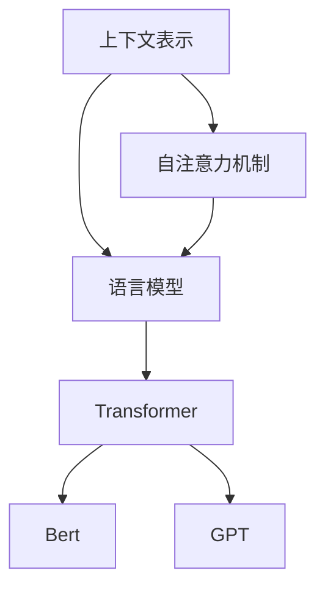

                 

## 1. 背景介绍

### 1.1 问题由来

随着自然语言处理（NLP）技术的飞速发展，上下文理解已成为自然语言处理领域的一个重要研究方向。上下文理解是指模型能够理解并利用前后文信息，以做出更准确的推断和决策。上下文理解在诸如对话系统、智能客服、自然语言生成、机器翻译、问答系统等众多领域中具有重要的应用价值。

然而，上下文理解并非易事，因为在许多情况下，语义理解需要基于长时间跨度的上下文信息，且需要考虑语言中的多种语义和语法结构。传统的基于规则的NLP系统，难以覆盖语言的复杂性和多样性。近年来，基于深度学习的上下文理解技术得到了迅速发展，并在实际应用中展现了巨大的潜力。

### 1.2 问题核心关键点

上下文理解的核心关键点在于如何利用语言模型捕捉上下文信息，以及如何基于上下文信息做出合理的推断和决策。主要包括以下几个方面：

- 如何捕捉长期依赖关系。
- 如何处理多种语义和语法结构。
- 如何利用多模态信息。
- 如何优化模型参数以提升上下文理解能力。

### 1.3 问题研究意义

研究上下文理解技术，对于拓展NLP技术的应用范围，提升上下文信息驱动的系统的性能，具有重要的意义：

1. **增强对话系统的智能水平**。上下文理解使得对话系统能够根据对话历史，做出更加自然、准确的回答。
2. **提升智能客服的响应质量**。上下文理解技术可以帮助智能客服系统理解用户意图，提供更加精准的服务。
3. **优化自然语言生成**。上下文理解有助于生成自然流畅、语义准确的语言内容。
4. **改进机器翻译**。上下文理解有助于翻译系统准确捕捉原句的语义，生成高质量的翻译结果。
5. **强化问答系统的准确性**。上下文理解有助于问答系统准确理解问题，并提供相关性高的答案。

## 2. 核心概念与联系

### 2.1 核心概念概述

为了更好地理解上下文理解，本节将介绍几个密切相关的核心概念：

- **上下文表示(Context Representation)**：指将上下文信息转换为模型能够处理的向量表示。
- **自注意力机制(Self-Attention Mechanism)**：指在模型中引入注意力机制，以捕捉不同位置之间的依赖关系。
- **语言模型(Language Model)**：指能够根据上下文信息预测下一个词或词序列的模型。
- **Transformer**：一种基于自注意力机制的神经网络结构，用于处理序列数据，广泛应用于NLP任务。
- **Bert**：BERT（Bidirectional Encoder Representations from Transformers）是一种基于Transformer的预训练语言模型，能够捕捉到上下文中的多种语义和语法结构。
- **GPT**：GPT（Generative Pre-trained Transformer）是一种基于Transformer的预训练语言模型，特别适用于文本生成任务。

这些核心概念之间的逻辑关系可以通过以下Mermaid流程图来展示：



这个流程图展示了大语言模型在上下文理解中的应用路径：

1. 上下文表示将上下文信息转换为模型可以处理的向量。
2. 自注意力机制在模型中引入注意力机制，以捕捉不同位置之间的依赖关系。
3. 语言模型利用上下文信息预测下一个词或词序列。
4. Transformer作为通用的NLP模型结构，用于处理序列数据。
5. Bert和GPT是两种基于Transformer的预训练语言模型，分别在理解上下文和生成文本方面具有优势。

## 3. 核心算法原理 & 具体操作步骤
### 3.1 算法原理概述

上下文理解的核心算法原理是自注意力机制和Transformer结构。基于这些核心技术，模型能够对输入的序列数据进行编码，捕捉不同位置之间的依赖关系，并利用上下文信息做出推断和决策。

在Transformer中，每个位置上的输入被表示为向量 $x_i \in \mathbb{R}^d$，其中 $d$ 是向量维度。自注意力机制通过计算注意力权重，得到每个位置上的上下文表示 $h_i \in \mathbb{R}^d$。注意力权重 $a_{ij} \in [0, 1]$ 表示 $x_j$ 对 $x_i$ 的关注程度，通过公式计算：

$$
a_{ij} = \frac{e^{\mathbf{q}_i^\top \mathbf{k}_j}}{\sum_{k=1}^n e^{\mathbf{q}_i^\top \mathbf{k}_k}}
$$

其中 $\mathbf{q}_i$ 和 $\mathbf{k}_j$ 是通过线性变换得到的查询和键向量，分别用于计算注意力权重。注意力权重 $a_{ij}$ 经过softmax归一化，得到上下文向量 $h_i$：

$$
h_i = \sum_{j=1}^n a_{ij} \mathbf{v}_j
$$

其中 $\mathbf{v}_j$ 是通过线性变换得到的值向量。

### 3.2 算法步骤详解

基于Transformer的自注意力机制，上下文理解的步骤如下：

1. **输入编码**：将输入序列转换为模型能够处理的向量表示。
2. **计算注意力权重**：计算注意力权重，捕捉不同位置之间的依赖关系。
3. **计算上下文向量**：利用注意力权重计算每个位置上的上下文向量。
4. **解码输出**：利用上下文向量，计算输出向量，得到最终的上下文表示。

### 3.3 算法优缺点

基于自注意力机制的上下文理解算法具有以下优点：

- **捕捉长期依赖**：自注意力机制能够捕捉到序列中不同位置之间的依赖关系。
- **处理复杂结构**：能够处理多种语义和语法结构。
- **并行计算**：Transformer结构可以并行计算，加速模型训练和推理。

但同时也存在以下缺点：

- **计算复杂度高**：自注意力机制需要计算注意力权重，计算复杂度较高。
- **内存消耗大**：需要存储大量的注意力权重和上下文向量，内存消耗较大。

### 3.4 算法应用领域

上下文理解技术在众多领域中得到了广泛应用，以下是几个典型的应用场景：

- **对话系统**：如智能客服、智能助手等。通过上下文理解，对话系统能够理解用户意图，提供更加自然、准确的回答。
- **自然语言生成**：如文本摘要、自动翻译、对话生成等。上下文理解有助于生成自然流畅、语义准确的语言内容。
- **问答系统**：如知识图谱问答、免费咨询等。通过上下文理解，问答系统能够准确理解问题，并提供相关性高的答案。
- **情感分析**：如产品评论分析、社交媒体情感分析等。上下文理解有助于捕捉上下文情感信息，提升分析精度。
- **文本分类**：如新闻分类、邮件分类等。通过上下文理解，文本分类系统能够更准确地分类文本。

## 4. 数学模型和公式 & 详细讲解 & 举例说明

### 4.1 数学模型构建

在上下文理解中，我们通常使用Transformer模型作为基础架构。设输入序列长度为 $n$，每个位置上的输入向量为 $x_i \in \mathbb{R}^d$，输出向量为 $y_i \in \mathbb{R}^d$。Transformer模型的自注意力机制可以表示为：

$$
\mathbf{Q} = \mathbf{X}\mathbf{W}_Q
$$

$$
\mathbf{K} = \mathbf{X}\mathbf{W}_K
$$

$$
\mathbf{V} = \mathbf{X}\mathbf{W}_V
$$

其中 $\mathbf{W}_Q$、$\mathbf{W}_K$ 和 $\mathbf{W}_V$ 是可学习的线性变换矩阵。注意力权重 $a_{ij}$ 可以表示为：

$$
a_{ij} = \frac{\mathbf{q}_i^\top \mathbf{k}_j}{\sqrt{d_k}}
$$

其中 $\mathbf{q}_i = \mathbf{W}_Q^T\mathbf{h}_i$，$\mathbf{k}_j = \mathbf{W}_K^T\mathbf{h}_j$。上下文向量 $h_i$ 可以表示为：

$$
h_i = \sum_{j=1}^n a_{ij} \mathbf{v}_j
$$

其中 $\mathbf{v}_j = \mathbf{W}_V^T\mathbf{h}_j$。

### 4.2 公式推导过程

以上公式展示了Transformer模型在上下文理解中的应用过程。以下是一些关键的数学推导：

- **注意力权重计算**：

$$
a_{ij} = \frac{\mathbf{q}_i^\top \mathbf{k}_j}{\sqrt{d_k}}
$$

其中 $d_k$ 是键向量的维度，通常等于输入向量的维度 $d$。

- **上下文向量计算**：

$$
h_i = \sum_{j=1}^n a_{ij} \mathbf{v}_j
$$

其中 $\mathbf{v}_j$ 是通过线性变换得到的值向量。

### 4.3 案例分析与讲解

以下是一个基于Transformer的上下文理解模型示例，用于对话系统中的上下文信息捕捉：

```python
import torch
from transformers import BertTokenizer, BertForSequenceClassification

# 初始化tokenizer和模型
tokenizer = BertTokenizer.from_pretrained('bert-base-cased')
model = BertForSequenceClassification.from_pretrained('bert-base-cased', num_labels=2)

# 准备输入数据
inputs = tokenizer("Hello, how are you today?", return_tensors="pt")
labels = torch.tensor([1])

# 前向传播计算
outputs = model(inputs.input_ids, labels=labels)

# 计算loss
loss = outputs.loss
```

在这个示例中，我们使用了BertForSequenceClassification模型，通过tokenizer将输入文本转换为模型能够处理的向量表示。通过前向传播计算，模型输出预测结果和loss。

## 5. 项目实践：代码实例和详细解释说明
### 5.1 开发环境搭建

在进行上下文理解项目实践前，我们需要准备好开发环境。以下是使用Python进行PyTorch开发的环境配置流程：

1. 安装Anaconda：从官网下载并安装Anaconda，用于创建独立的Python环境。

2. 创建并激活虚拟环境：
```bash
conda create -n pytorch-env python=3.8 
conda activate pytorch-env
```

3. 安装PyTorch：根据CUDA版本，从官网获取对应的安装命令。例如：
```bash
conda install pytorch torchvision torchaudio cudatoolkit=11.1 -c pytorch -c conda-forge
```

4. 安装Transformers库：
```bash
pip install transformers
```

5. 安装各类工具包：
```bash
pip install numpy pandas scikit-learn matplotlib tqdm jupyter notebook ipython
```

完成上述步骤后，即可在`pytorch-env`环境中开始上下文理解实践。

### 5.2 源代码详细实现

下面以情感分析任务为例，给出使用Transformers库进行上下文理解的PyTorch代码实现。

首先，定义情感分析任务的数据处理函数：

```python
from transformers import BertTokenizer
from torch.utils.data import Dataset
import torch

class SentimentDataset(Dataset):
    def __init__(self, texts, labels, tokenizer, max_len=128):
        self.texts = texts
        self.labels = labels
        self.tokenizer = tokenizer
        self.max_len = max_len
        
    def __len__(self):
        return len(self.texts)
    
    def __getitem__(self, item):
        text = self.texts[item]
        label = self.labels[item]
        
        encoding = self.tokenizer(text, return_tensors='pt', max_length=self.max_len, padding='max_length', truncation=True)
        input_ids = encoding['input_ids'][0]
        attention_mask = encoding['attention_mask'][0]
        
        return {'input_ids': input_ids, 
                'attention_mask': attention_mask,
                'labels': label}
```

然后，定义模型和优化器：

```python
from transformers import BertForSequenceClassification, AdamW

model = BertForSequenceClassification.from_pretrained('bert-base-cased', num_labels=2)

optimizer = AdamW(model.parameters(), lr=2e-5)
```

接着，定义训练和评估函数：

```python
from torch.utils.data import DataLoader
from tqdm import tqdm
from sklearn.metrics import classification_report

device = torch.device('cuda') if torch.cuda.is_available() else torch.device('cpu')
model.to(device)

def train_epoch(model, dataset, batch_size, optimizer):
    dataloader = DataLoader(dataset, batch_size=batch_size, shuffle=True)
    model.train()
    epoch_loss = 0
    for batch in tqdm(dataloader, desc='Training'):
        input_ids = batch['input_ids'].to(device)
        attention_mask = batch['attention_mask'].to(device)
        labels = batch['labels'].to(device)
        model.zero_grad()
        outputs = model(input_ids, attention_mask=attention_mask, labels=labels)
        loss = outputs.loss
        epoch_loss += loss.item()
        loss.backward()
        optimizer.step()
    return epoch_loss / len(dataloader)

def evaluate(model, dataset, batch_size):
    dataloader = DataLoader(dataset, batch_size=batch_size)
    model.eval()
    preds, labels = [], []
    with torch.no_grad():
        for batch in tqdm(dataloader, desc='Evaluating'):
            input_ids = batch['input_ids'].to(device)
            attention_mask = batch['attention_mask'].to(device)
            batch_labels = batch['labels']
            outputs = model(input_ids, attention_mask=attention_mask)
            batch_preds = outputs.logits.argmax(dim=2).to('cpu').tolist()
            batch_labels = batch_labels.to('cpu').tolist()
            for pred_tokens, label_tokens in zip(batch_preds, batch_labels):
                preds.append(pred_tokens[0])
                labels.append(label_tokens[0])
                
    print(classification_report(labels, preds))
```

最后，启动训练流程并在测试集上评估：

```python
epochs = 5
batch_size = 16

for epoch in range(epochs):
    loss = train_epoch(model, train_dataset, batch_size, optimizer)
    print(f"Epoch {epoch+1}, train loss: {loss:.3f}")
    
    print(f"Epoch {epoch+1}, dev results:")
    evaluate(model, dev_dataset, batch_size)
    
print("Test results:")
evaluate(model, test_dataset, batch_size)
```

以上就是使用PyTorch对BERT进行情感分析任务上下文理解的完整代码实现。可以看到，得益于Transformers库的强大封装，我们可以用相对简洁的代码完成BERT模型的加载和上下文理解训练。

### 5.3 代码解读与分析

让我们再详细解读一下关键代码的实现细节：

**SentimentDataset类**：
- `__init__`方法：初始化文本、标签、分词器等关键组件。
- `__len__`方法：返回数据集的样本数量。
- `__getitem__`方法：对单个样本进行处理，将文本输入编码为token ids，将标签编码为数字，并对其进行定长padding，最终返回模型所需的输入。

**模型定义**：
- `BertForSequenceClassification`：Bert模型的分类头，用于处理序列数据并输出预测结果。
- `AdamW`：优化器，用于更新模型参数。

**训练和评估函数**：
- `train_epoch`函数：对数据以批为单位进行迭代，在每个批次上前向传播计算loss并反向传播更新模型参数。
- `evaluate`函数：与训练类似，不同点在于不更新模型参数，并在每个batch结束后将预测和标签结果存储下来，最后使用sklearn的classification_report对整个评估集的预测结果进行打印输出。

**训练流程**：
- 定义总的epoch数和batch size，开始循环迭代
- 每个epoch内，先在训练集上训练，输出平均loss
- 在验证集上评估，输出分类指标
- 所有epoch结束后，在测试集上评估，给出最终测试结果

可以看到，PyTorch配合Transformers库使得BERT上下文理解的代码实现变得简洁高效。开发者可以将更多精力放在数据处理、模型改进等高层逻辑上，而不必过多关注底层的实现细节。

## 6. 实际应用场景
### 6.1 智能客服系统

基于上下文理解技术的对话系统，可以广泛应用于智能客服系统的构建。传统客服往往需要配备大量人力，高峰期响应缓慢，且一致性和专业性难以保证。而基于上下文理解技术的对话模型，可以7x24小时不间断服务，快速响应客户咨询，用自然流畅的语言解答各类常见问题。

在技术实现上，可以收集企业内部的历史客服对话记录，将问题和最佳答复构建成监督数据，在此基础上对预训练对话模型进行上下文理解微调。微调后的对话模型能够自动理解用户意图，匹配最合适的答案模板进行回复。对于客户提出的新问题，还可以接入检索系统实时搜索相关内容，动态组织生成回答。如此构建的智能客服系统，能大幅提升客户咨询体验和问题解决效率。

### 6.2 金融舆情监测

金融机构需要实时监测市场舆论动向，以便及时应对负面信息传播，规避金融风险。传统的人工监测方式成本高、效率低，难以应对网络时代海量信息爆发的挑战。基于上下文理解技术的文本分类和情感分析技术，为金融舆情监测提供了新的解决方案。

具体而言，可以收集金融领域相关的新闻、报道、评论等文本数据，并对其进行主题标注和情感标注。在此基础上对预训练语言模型进行上下文理解微调，使其能够自动判断文本属于何种主题，情感倾向是正面、中性还是负面。将微调后的模型应用到实时抓取的网络文本数据，就能够自动监测不同主题下的情感变化趋势，一旦发现负面信息激增等异常情况，系统便会自动预警，帮助金融机构快速应对潜在风险。

### 6.3 个性化推荐系统

当前的推荐系统往往只依赖用户的历史行为数据进行物品推荐，无法深入理解用户的真实兴趣偏好。基于上下文理解技术的推荐系统可以更好地挖掘用户行为背后的语义信息，从而提供更精准、多样的推荐内容。

在实践中，可以收集用户浏览、点击、评论、分享等行为数据，提取和用户交互的物品标题、描述、标签等文本内容。将文本内容作为模型输入，用户的后续行为（如是否点击、购买等）作为监督信号，在此基础上对预训练语言模型进行上下文理解微调。微调后的模型能够从文本内容中准确把握用户的兴趣点。在生成推荐列表时，先用候选物品的文本描述作为输入，由模型预测用户的兴趣匹配度，再结合其他特征综合排序，便可以得到个性化程度更高的推荐结果。

### 6.4 未来应用展望

随着上下文理解技术的不断发展，未来将在更多领域得到应用，为各行各业带来变革性影响。

在智慧医疗领域，基于上下文理解技术的医疗问答、病历分析、药物研发等应用将提升医疗服务的智能化水平，辅助医生诊疗，加速新药开发进程。

在智能教育领域，上下文理解技术可应用于作业批改、学情分析、知识推荐等方面，因材施教，促进教育公平，提高教学质量。

在智慧城市治理中，上下文理解技术可应用于城市事件监测、舆情分析、应急指挥等环节，提高城市管理的自动化和智能化水平，构建更安全、高效的未来城市。

此外，在企业生产、社会治理、文娱传媒等众多领域，基于上下文理解技术的NLP应用也将不断涌现，为NLP技术带来了全新的突破。随着预训练模型和上下文理解方法的不断进步，相信NLP技术将在更广阔的应用领域大放异彩，深刻影响人类的生产生活方式。

## 7. 工具和资源推荐
### 7.1 学习资源推荐

为了帮助开发者系统掌握上下文理解技术的理论基础和实践技巧，这里推荐一些优质的学习资源：

1. 《Transformer从原理到实践》系列博文：由大模型技术专家撰写，深入浅出地介绍了Transformer原理、BERT模型、上下文理解技术等前沿话题。

2. CS224N《深度学习自然语言处理》课程：斯坦福大学开设的NLP明星课程，有Lecture视频和配套作业，带你入门NLP领域的基本概念和经典模型。

3. 《Natural Language Processing with Transformers》书籍：Transformers库的作者所著，全面介绍了如何使用Transformers库进行NLP任务开发，包括上下文理解在内的诸多范式。

4. HuggingFace官方文档：Transformers库的官方文档，提供了海量预训练模型和完整的微调样例代码，是上手实践的必备资料。

5. CLUE开源项目：中文语言理解测评基准，涵盖大量不同类型的中文NLP数据集，并提供了基于上下文理解的baseline模型，助力中文NLP技术发展。

通过对这些资源的学习实践，相信你一定能够快速掌握上下文理解技术的精髓，并用于解决实际的NLP问题。
### 7.2 开发工具推荐

高效的开发离不开优秀的工具支持。以下是几款用于上下文理解开发的常用工具：

1. PyTorch：基于Python的开源深度学习框架，灵活动态的计算图，适合快速迭代研究。大部分预训练语言模型都有PyTorch版本的实现。

2. TensorFlow：由Google主导开发的开源深度学习框架，生产部署方便，适合大规模工程应用。同样有丰富的预训练语言模型资源。

3. Transformers库：HuggingFace开发的NLP工具库，集成了众多SOTA语言模型，支持PyTorch和TensorFlow，是进行上下文理解任务开发的利器。

4. Weights & Biases：模型训练的实验跟踪工具，可以记录和可视化模型训练过程中的各项指标，方便对比和调优。与主流深度学习框架无缝集成。

5. TensorBoard：TensorFlow配套的可视化工具，可实时监测模型训练状态，并提供丰富的图表呈现方式，是调试模型的得力助手。

6. Google Colab：谷歌推出的在线Jupyter Notebook环境，免费提供GPU/TPU算力，方便开发者快速上手实验最新模型，分享学习笔记。

合理利用这些工具，可以显著提升上下文理解任务的开发效率，加快创新迭代的步伐。

### 7.3 相关论文推荐

上下文理解技术的发展源于学界的持续研究。以下是几篇奠基性的相关论文，推荐阅读：

1. Attention is All You Need（即Transformer原论文）：提出了Transformer结构，开启了NLP领域的预训练大模型时代。

2. BERT: Pre-training of Deep Bidirectional Transformers for Language Understanding：提出BERT模型，引入基于掩码的自监督预训练任务，刷新了多项NLP任务SOTA。

3. Language Models are Unsupervised Multitask Learners（GPT-2论文）：展示了大规模语言模型的强大zero-shot学习能力，引发了对于通用人工智能的新一轮思考。

4. Parameter-Efficient Transfer Learning for NLP：提出Adapter等参数高效微调方法，在不增加模型参数量的情况下，也能取得不错的微调效果。

5. Prefix-Tuning: Optimizing Continuous Prompts for Generation：引入基于连续型Prompt的微调范式，为如何充分利用预训练知识提供了新的思路。

6. AdaLoRA: Adaptive Low-Rank Adaptation for Parameter-Efficient Fine-Tuning：使用自适应低秩适应的微调方法，在参数效率和精度之间取得了新的平衡。

这些论文代表了大语言模型上下文理解技术的发展脉络。通过学习这些前沿成果，可以帮助研究者把握学科前进方向，激发更多的创新灵感。

## 8. 总结：未来发展趋势与挑战
### 8.1 总结

本文对基于上下文理解的自然语言处理技术进行了全面系统的介绍。首先阐述了上下文理解的背景和应用场景，明确了上下文理解在NLP任务中的重要地位。其次，从原理到实践，详细讲解了上下文理解的核心算法原理和具体操作步骤，给出了上下文理解任务开发的完整代码实例。同时，本文还广泛探讨了上下文理解技术在多个行业领域的应用前景，展示了其广阔的应用价值。

通过本文的系统梳理，可以看到，基于上下文理解的自然语言处理技术正在成为NLP领域的重要研究范式，极大地拓展了预训练语言模型的应用边界，催生了更多的落地场景。随着上下文理解技术的不断发展，基于上下文理解的NLP系统必将在更多领域中发挥重要作用。

### 8.2 未来发展趋势

展望未来，上下文理解技术将呈现以下几个发展趋势：

1. **模型规模持续增大**：随着算力成本的下降和数据规模的扩张，上下文理解模型的参数量还将持续增长。超大规模模型蕴含的丰富语义信息，有望提升上下文理解模型的性能。
2. **上下文表示多样性**：未来的上下文表示将更加多样化，不再局限于静态向量和注意力权重，可能引入时序信息、空间信息等更多维度的上下文表示。
3. **多模态上下文理解**：上下文理解技术将更多地与其他模态信息融合，如视觉、语音等，提升对多模态数据的处理能力。
4. **上下文理解任务的泛化**：上下文理解模型将在更广泛的场景中得到应用，如智能推理、数据分析等。
5. **知识图谱的融合**：上下文理解模型将更多地与知识图谱结合，提升模型的语义推理能力。

### 8.3 面临的挑战

尽管上下文理解技术已经取得了显著进展，但在迈向更加智能化、普适化应用的过程中，它仍面临诸多挑战：

1. **计算资源瓶颈**：上下文理解模型通常需要较大规模的训练和推理资源，如何在资源有限的情况下高效训练和推理，是一个重要问题。
2. **语义理解难度**：上下文理解模型需要处理复杂的语言结构和多层次的语义信息，如何提高模型的语义理解能力，是一个亟待解决的问题。
3. **模型鲁棒性不足**：上下文理解模型面对噪声数据、多义歧义等问题，往往容易出现预测不准确、生成不合理的输出。
4. **上下文表示的可解释性**：上下文表示缺乏可解释性，难以理解模型内部的决策过程，不利于模型部署和维护。

### 8.4 研究展望

面对上下文理解面临的挑战，未来的研究需要在以下几个方面寻求新的突破：

1. **轻量级上下文理解模型**：开发更加轻量级的上下文理解模型，以适应资源受限的设备和平台。
2. **语义增强上下文表示**：研究更加复杂、多维度的上下文表示方法，提升模型的语义理解能力。
3. **鲁棒性增强方法**：开发鲁棒性更强的上下文理解模型，能够处理噪声数据、多义歧义等问题。
4. **上下文表示的可解释性**：研究可解释性强的上下文表示方法，帮助用户理解模型的决策过程。

这些研究方向的探索，必将引领上下文理解技术迈向更高的台阶，为构建安全、可靠、可解释、可控的智能系统铺平道路。面向未来，上下文理解技术还需要与其他人工智能技术进行更深入的融合，如知识表示、因果推理、强化学习等，多路径协同发力，共同推动自然语言理解和智能交互系统的进步。只有勇于创新、敢于突破，才能不断拓展上下文理解技术的边界，让智能技术更好地造福人类社会。

## 9. 附录：常见问题与解答

**Q1：上下文理解模型如何捕捉长期依赖关系？**

A: 上下文理解模型通常使用自注意力机制来捕捉长期依赖关系。自注意力机制通过计算注意力权重，能够捕捉到序列中不同位置之间的依赖关系。在Transformer模型中，自注意力机制在每一层都可以捕捉到不同位置之间的依赖关系，从而支持长距离信息的传递。

**Q2：上下文理解模型如何处理多种语义和语法结构？**

A: 上下文理解模型通常能够处理多种语义和语法结构，这是由于模型的自注意力机制可以捕捉到不同类型的依赖关系。例如，BERT模型通过掩码语言模型任务和下一句预测任务，学习到丰富的语义和语法结构，能够处理多种复杂的自然语言现象。

**Q3：上下文理解模型如何利用多模态信息？**

A: 上下文理解模型可以与视觉、语音等多模态信息结合，提升对多模态数据的处理能力。例如，在视觉问答任务中，可以将图像信息与自然语言信息结合起来，利用上下文理解模型生成相关性高的答案。

**Q4：上下文理解模型在实际应用中面临哪些挑战？**

A: 上下文理解模型在实际应用中面临以下挑战：

1. **计算资源瓶颈**：上下文理解模型通常需要较大规模的训练和推理资源，如何在资源有限的情况下高效训练和推理，是一个重要问题。
2. **语义理解难度**：上下文理解模型需要处理复杂的语言结构和多层次的语义信息，如何提高模型的语义理解能力，是一个亟待解决的问题。
3. **模型鲁棒性不足**：上下文理解模型面对噪声数据、多义歧义等问题，往往容易出现预测不准确、生成不合理的输出。
4. **上下文表示的可解释性**：上下文表示缺乏可解释性，难以理解模型内部的决策过程。

**Q5：上下文理解模型在实际应用中如何进行微调？**

A: 上下文理解模型通常需要进行微调，以适应特定的应用场景。微调步骤包括：

1. **数据准备**：收集标注数据，将问题-答案对作为输入，标注数据需要充分覆盖应用场景。
2. **模型加载**：加载预训练的上下文理解模型，如BERT、GPT等。
3. **训练优化**：选择合适的优化器，如AdamW，设置学习率、批大小、迭代轮数等超参数。
4. **模型评估**：在验证集上评估模型的性能，调整超参数以获得最佳效果。
5. **模型部署**：将微调后的模型部署到实际应用系统中，进行推理预测。

---

作者：禅与计算机程序设计艺术 / Zen and the Art of Computer Programming

