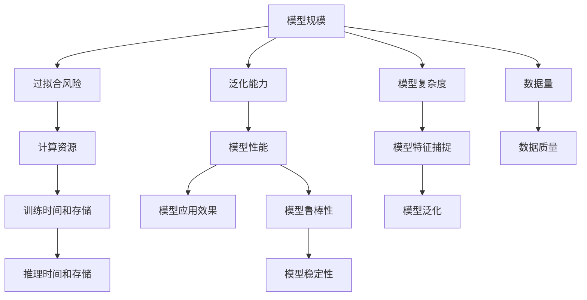

                 

## 1. 背景介绍

在人工智能(AI)模型开发过程中，选择合适的模型规模是至关重要的。模型规模决定了模型的复杂度和能力，对训练、推理效率和应用效果都有着深远的影响。但选择过于庞大的模型可能会导致过拟合和计算资源的浪费，而选择过小的模型则可能导致欠拟合和精度不足。因此，本文将探讨不同应用场景下AI模型规模选择策略，通过理论分析与实践案例，帮助读者全面理解模型规模选择的复杂性，从而做出更明智的决策。

## 2. 核心概念与联系

### 2.1 核心概念概述

在讨论模型规模选择之前，需要先明确几个核心概念：

- **模型规模**：指模型的参数数量，通常用百万（M）或十亿（B）作为单位。
- **过拟合（Overfitting）**：模型在训练集上表现良好，但在测试集或实际应用中表现不佳的现象。
- **欠拟合（Underfitting）**：模型无法捕捉数据中复杂的模式，导致在训练集和测试集上均表现不佳。
- **泛化能力（Generalization）**：模型在新数据上的表现，是评估模型效果的重要指标。
- **计算资源**：包括CPU/GPU内存、计算速度和存储能力，对模型规模有直接影响。

这些概念之间存在密切的联系。模型规模越大，通常意味着模型越复杂，能够学习到的特征越丰富，但同时也会增加过拟合风险和计算成本。泛化能力则反映了模型在未知数据上的表现，是衡量模型质量的重要指标。计算资源则是选择模型规模的物质基础，需要在模型规模和资源成本之间进行平衡。

### 2.2 核心概念原理和架构的 Mermaid 流程图



## 3. 核心算法原理 & 具体操作步骤

### 3.1 算法原理概述

选择模型规模的算法原理主要基于模型的泛化能力、过拟合风险和计算资源的综合考量。泛化能力通常与模型规模正相关，但随着模型规模的增大，过拟合风险也会增加，特别是在数据量不足或数据质量不高的情况下。因此，模型规模选择是一个需要在模型复杂度和计算资源之间进行权衡的过程。

### 3.2 算法步骤详解

1. **数据量与质量评估**：首先，需要评估可用数据的数量和质量。数据量越大、质量越高，通常能够支撑更大规模的模型。

2. **任务需求分析**：明确应用场景和任务需求，如分类、回归、生成等，不同任务对模型规模的需求也不同。

3. **计算资源预算**：根据可用计算资源（CPU/GPU内存、计算速度和存储能力）确定模型规模的上线。

4. **模型规模选择**：在上述评估的基础上，选择最适合的模型规模，并进行初步的模型设计。

5. **模型训练与调参**：使用选定的模型规模进行训练，并进行超参数调优，以平衡模型复杂度和泛化能力。

6. **模型评估与测试**：在训练集和验证集上评估模型性能，并根据评估结果进行微调。

### 3.3 算法优缺点

#### 优点

- **提升泛化能力**：适当的模型规模能够提升模型的泛化能力，从而提高模型在新数据上的表现。
- **灵活调整**：模型规模可以根据任务需求和计算资源进行调整，灵活性较高。
- **支持复杂任务**：对于复杂的多模态任务，如自然语言理解、计算机视觉等，较大规模的模型能够更好地捕捉数据中的复杂模式。

#### 缺点

- **计算成本高**：大模型需要更多的计算资源，训练和推理效率较低，成本较高。
- **过拟合风险**：大模型容易过拟合，特别是在数据量不足或数据质量不高的情况下。
- **模型复杂度**：大模型需要更多的超参数调优，模型的复杂度增加，维护和解释难度较大。

### 3.4 算法应用领域

- **计算机视觉**：如图像分类、目标检测、图像生成等任务，大模型通常表现更好。
- **自然语言处理**：如机器翻译、情感分析、文本生成等任务，大模型能够处理更复杂的语言模式。
- **语音识别**：如语音转文本、语音情感分析等任务，大模型能够更好地捕捉语音中的语调、语速等信息。
- **推荐系统**：如个性化推荐、广告推荐等任务，大模型能够更好地学习用户行为和兴趣。
- **医疗诊断**：如医学图像分析、疾病诊断等任务，大模型能够更好地处理医学图像和文本数据。

## 4. 数学模型和公式 & 详细讲解

### 4.1 数学模型构建

我们以一个简单的线性回归模型为例，来理解模型规模选择的基本原理。假设线性回归模型的参数为 $\theta$，训练数据集为 $\{(x_i, y_i)\}_{i=1}^N$，目标是最小化均方误差损失：

$$
\min_{\theta} \frac{1}{N}\sum_{i=1}^N (y_i - \theta x_i)^2
$$

### 4.2 公式推导过程

通过梯度下降算法，可以得到模型参数 $\theta$ 的更新公式：

$$
\theta \leftarrow \theta - \eta \nabla_{\theta}\mathcal{L}(\theta) = \theta - \eta \frac{1}{N}\sum_{i=1}^N 2(y_i - \theta x_i)x_i
$$

其中，$\eta$ 为学习率，$\nabla_{\theta}\mathcal{L}(\theta)$ 为损失函数对参数 $\theta$ 的梯度。

### 4.3 案例分析与讲解

假设我们有一个包含1000个样本的数据集，每个样本有5个特征。我们使用一个包含500个参数的线性模型进行训练，训练100个epoch后，得到的模型参数 $\theta$。在这个例子中，模型规模（500）和数据量（1000）是平衡的，模型能够较好地学习数据中的模式，泛化能力也较强。

然而，如果我们使用一个包含10000个参数的线性模型进行训练，由于模型规模过大，很容易发生过拟合，导致模型在训练集上表现很好，但在测试集或新数据上表现不佳。因此，我们需要根据数据量和计算资源，合理选择模型规模。

## 5. 项目实践：代码实例和详细解释说明

### 5.1 开发环境搭建

1. 安装Python环境：使用Anaconda或Miniconda，确保Python版本为3.6或以上。

2. 安装深度学习框架：如TensorFlow或PyTorch，确保安装最新的稳定版本。

3. 安装依赖包：如NumPy、Pandas、Scikit-learn等，这些是数据处理和模型训练的基本工具。

4. 配置GPU：确保你的机器有NVIDIA GPU，并安装CUDA和cuDNN库。

### 5.2 源代码详细实现

以下是一个简单的TensorFlow线性回归模型的实现代码：

```python
import tensorflow as tf
import numpy as np

# 定义训练数据
x_train = np.random.randn(1000, 5)
y_train = np.dot(x_train, [1.0, 2.0, 3.0, 4.0, 5.0]) + np.random.randn(1000, 1)

# 定义模型
model = tf.keras.Sequential([
    tf.keras.layers.Dense(500, activation='relu', input_shape=[5]),
    tf.keras.layers.Dense(1)
])

# 编译模型
model.compile(optimizer=tf.keras.optimizers.Adam(learning_rate=0.01), loss='mse')

# 训练模型
model.fit(x_train, y_train, epochs=100, batch_size=32)

# 评估模型
mse_loss = model.evaluate(x_train, y_train, batch_size=32)
print("MSE Loss:", mse_loss)
```

### 5.3 代码解读与分析

这段代码首先定义了1000个样本的训练数据，其中每个样本有5个特征。然后，我们使用一个包含500个参数的线性模型进行训练，并使用Adam优化器进行参数更新。训练100个epoch后，我们评估模型的均方误差损失。

### 5.4 运行结果展示

通过运行上述代码，可以得到模型在训练集上的均方误差损失。通过观察这个损失值，可以初步判断模型是否出现过拟合或欠拟合。

## 6. 实际应用场景

### 6.1 推荐系统

在推荐系统中，大模型可以更好地学习用户行为和兴趣，从而提供更个性化的推荐。例如，使用DeepFM模型（即深度神经网络与因子分解机的组合）可以显著提升推荐效果，其参数规模通常达到数十亿级别。

### 6.2 自然语言处理

在自然语言处理中，大模型如BERT和GPT-3已经展示了其强大的语言理解和生成能力。例如，BERT模型在各种自然语言处理任务中取得了SOTA性能，其参数规模达1.1亿。

### 6.3 计算机视觉

在计算机视觉中，大模型如ResNet和VGGNet已经被广泛应用，这些模型的参数规模通常在数百万到十亿级别。例如，ResNet50模型包含5600万个参数，VGG16模型包含1.38亿个参数。

## 7. 工具和资源推荐

### 7.1 学习资源推荐

1. **《深度学习》课程**：由吴恩达教授主讲的Coursera深度学习课程，涵盖了深度学习的基础知识和前沿技术。
2. **《TensorFlow官方文档》**：TensorFlow的官方文档，提供了丰富的API参考和示例代码，是学习和实践深度学习的必备资源。
3. **《动手学深度学习》**：由李沐等作者编写的深度学习教材，内容全面、实用，适合动手实践。
4. **Kaggle平台**：Kaggle是一个数据科学竞赛平台，提供了大量的数据集和竞赛任务，是学习和实践深度学习的好地方。

### 7.2 开发工具推荐

1. **TensorFlow**：由Google开发的深度学习框架，支持GPU加速，适用于大规模模型训练和推理。
2. **PyTorch**：由Facebook开发的深度学习框架，灵活性强，易于调试和扩展，适用于研究和实验。
3. **Jupyter Notebook**：一个交互式的Python笔记本环境，方便代码编写和调试，是数据科学家的标配。

### 7.3 相关论文推荐

1. **"Deep Architectures for Natural Language Processing"**：由Yoshua Bengio等人发表的论文，讨论了深度学习在自然语言处理中的应用。
2. **"Learning Phrases and the Open Vocabulary"**：由Andrej Karpathy等人发表的论文，讨论了大规模预训练语言模型的效果。
3. **"ImageNet Classification with Deep Convolutional Neural Networks"**：由Alex Krizhevsky等人发表的论文，讨论了深度卷积神经网络在计算机视觉中的应用。

## 8. 总结：未来发展趋势与挑战

### 8.1 研究成果总结

本文通过理论分析与实践案例，全面探讨了AI模型规模选择策略。我们分析了模型规模对泛化能力、过拟合风险和计算资源的影响，并通过实际案例展示了不同规模模型的应用效果。

### 8.2 未来发展趋势

- **更大规模的模型**：随着计算资源的不断提升，未来大模型的参数规模将继续增大，从而带来更强的泛化能力和更复杂的模式捕捉能力。
- **多模态融合**：未来的模型将支持多种数据模态（如文本、图像、语音）的融合，提升多模态任务的性能。
- **联邦学习**：联邦学习可以使得模型在保护用户隐私的前提下，利用分布式数据进行训练，从而更好地解决数据量不足的问题。
- **自适应模型**：自适应模型可以根据数据量动态调整模型规模，避免过拟合和计算资源的浪费。

### 8.3 面临的挑战

- **计算成本**：大模型的训练和推理需要大量的计算资源，成本较高，如何优化模型规模和计算资源的使用是一个重要问题。
- **过拟合风险**：大模型容易发生过拟合，特别是在数据量不足的情况下，如何平衡模型规模和泛化能力是一个难题。
- **模型复杂度**：大模型的复杂度增加，维护和解释难度较大，如何简化模型结构是一个挑战。

### 8.4 研究展望

未来的研究需要重点关注以下几个方面：

- **模型压缩**：研究如何通过剪枝、量化等技术压缩大模型，减小模型规模，降低计算成本。
- **模型蒸馏**：研究如何通过模型蒸馏技术，将大模型压缩为轻量级的小模型，实现快速推理和部署。
- **多任务学习**：研究如何将多个任务联合训练，提高模型的泛化能力和多任务处理能力。
- **自监督学习**：研究如何利用自监督学习，提升模型的泛化能力和数据利用效率。

## 9. 附录：常见问题与解答

**Q1：如何选择模型的参数数量？**

A: 模型的参数数量需要根据任务需求和数据量进行权衡。通常，较大的模型能够学习更多的特征，但也容易发生过拟合。需要根据数据的复杂度和计算资源进行合理选择。

**Q2：如何避免过拟合？**

A: 避免过拟合的方法包括正则化、数据增强、早停等。可以根据数据量和模型规模选择合适的方法。

**Q3：如何评估模型的泛化能力？**

A: 评估模型的泛化能力通常使用测试集或交叉验证集，评估模型在未知数据上的表现。

**Q4：如何选择计算资源？**

A: 计算资源的预算需要根据任务需求和数据量进行综合考量。需要权衡模型的规模和训练推理时间，合理选择CPU/GPU和存储资源。

**Q5：如何选择最优的超参数？**

A: 选择最优的超参数需要进行多次实验和调参。可以使用网格搜索、贝叶斯优化等方法，寻找最优的超参数组合。

---

作者：禅与计算机程序设计艺术 / Zen and the Art of Computer Programming

