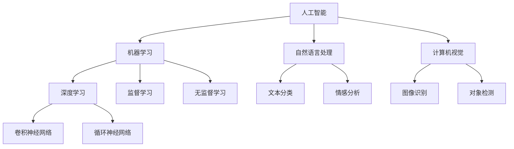

                 

# 个性化AI工具选择的重要性

## 1. 背景介绍

随着人工智能技术的迅猛发展，各行各业都在积极探索如何利用AI技术提升业务效率和用户体验。人工智能工具（如自然语言处理、机器学习、计算机视觉等）的应用范围日益扩大，人们对其需求也日益增长。然而，如何选择最适合自身业务需求的AI工具，成为了一个复杂而又重要的问题。本文章将从核心概念、算法原理、实践方法、应用场景、工具推荐和未来趋势等多个方面，全面探讨个性化AI工具选择的关键要素，以期为开发者和应用者提供参考。

## 2. 核心概念与联系

### 2.1 核心概念概述

为了更好地理解AI工具的选择，我们将首先介绍几个关键的核心概念：

- **人工智能（Artificial Intelligence, AI）**：指通过计算机程序和算法，使机器具有类似人类的智能行为和决策能力的技术。
- **机器学习（Machine Learning, ML）**：指通过数据驱动的方式，让机器从数据中学习规律并应用于决策和预测的技术。
- **深度学习（Deep Learning, DL）**：是机器学习的一个分支，使用多层次神经网络模型处理复杂数据和任务，具有高度的自我学习能力。
- **自然语言处理（Natural Language Processing, NLP）**：指计算机对人类语言进行处理和理解的技术，包括文本分类、情感分析、机器翻译等任务。
- **计算机视觉（Computer Vision, CV）**：是使计算机具备类似人类视觉系统的能力，包括图像识别、对象检测、图像分割等任务。

这些概念之间存在着密切的联系和相互作用。例如，深度学习模型常用于自然语言处理和计算机视觉任务中，机器学习则是深度学习的底层技术。了解这些概念的原理和应用场景，将有助于我们更好地选择适合的AI工具。

### 2.2 核心概念原理和架构的 Mermaid 流程图



这个流程图展示了AI、ML、DL、NLP和CV之间的联系与区别，以及主要的模型和任务类型。

## 3. 核心算法原理 & 具体操作步骤

### 3.1 算法原理概述

AI工具的选择需要基于其算法原理和适用场景。不同的AI工具和任务，其算法原理和计算过程也不同。了解这些原理和过程，将有助于我们选择最合适的工具。

以自然语言处理为例，常见的算法包括词袋模型、TF-IDF、Word2Vec、BERT等。其中，BERT模型采用自监督学习方法，利用大规模语料进行预训练，并在特定的任务上进行微调，可以显著提高NLP任务的精度和效果。

### 3.2 算法步骤详解

以下是选择和使用AI工具的基本步骤：

**Step 1: 明确需求**
- 确定具体的需求场景，如文本分类、情感分析、图像识别等。
- 分析业务需求，明确AI工具需要解决的具体问题。

**Step 2: 确定算法类型**
- 根据需求场景选择合适的算法类型，如监督学习、无监督学习、强化学习等。
- 确定算法是否适用于大规模数据处理、实时性要求高、计算资源受限等情况。

**Step 3: 选择合适的模型**
- 根据算法类型，选择合适的预训练模型或自定义模型。
- 了解模型在不同数据集上的表现和精度。

**Step 4: 训练和优化**
- 使用数据集进行模型训练，并根据效果进行超参数调优。
- 评估模型性能，选择最优的模型参数和架构。

**Step 5: 部署和应用**
- 将训练好的模型部署到生产环境。
- 在实际应用场景中测试模型效果，并根据反馈进行迭代优化。

### 3.3 算法优缺点

选择AI工具时，需要考虑其优缺点，以确定其适用性和局限性。

**优点**：
- 精度高：如BERT、GPT等深度学习模型在自然语言处理任务中表现出色。
- 泛化能力强：预训练模型可以应用于多种任务，并具有较强的泛化能力。
- 资源可复用：使用开源工具和框架，可以大幅减少开发成本。

**缺点**：
- 计算资源需求高：深度学习模型需要大量计算资源进行训练和推理。
- 模型复杂度高：需要深入理解算法原理和实现细节。
- 模型可解释性差：深度学习模型通常是"黑盒"模型，难以解释其决策过程。

### 3.4 算法应用领域

AI工具在众多领域中都有广泛的应用，以下是几个主要应用领域：

- **医疗**：使用自然语言处理进行病历分析和诊断，使用计算机视觉进行影像分析。
- **金融**：使用机器学习进行风险评估和投资决策，使用计算机视觉进行金融文档分析。
- **教育**：使用自然语言处理进行智能辅导和评估，使用计算机视觉进行在线教育互动。
- **零售**：使用机器学习进行客户推荐和销售预测，使用计算机视觉进行产品识别和自动补货。
- **制造业**：使用机器学习进行设备预测维护，使用计算机视觉进行质量检测。

## 4. 数学模型和公式 & 详细讲解 & 举例说明

### 4.1 数学模型构建

在进行AI工具选择时，理解其数学模型和公式是至关重要的。以深度学习为例，其核心模型包括卷积神经网络（CNN）和循环神经网络（RNN）。

**CNN模型**：
$$
H^{(l)} = \sigma(W^{(l)} H^{(l-1)} + b^{(l)})
$$
$$
Y = H^{(L)}
$$

其中，$H^{(l)}$ 表示第$l$层的隐藏层输出，$W^{(l)}$ 和 $b^{(l)}$ 为权重和偏置，$L$ 为网络层数，$\sigma$ 为激活函数。

**RNN模型**：
$$
h_t = \tanh(W_{hh} h_{t-1} + W_{xh} x_t + b_h)
$$
$$
o_t = \sigma(W_{ho} h_t + b_h)
$$
$$
y_t = o_t h_t
$$

其中，$h_t$ 表示时刻$t$的隐藏状态，$W_{hh}$、$W_{xh}$ 和 $b_h$ 为权重和偏置，$y_t$ 为输出。

### 4.2 公式推导过程

上述公式展示了CNN和RNN的基本结构和计算过程。以CNN为例，其推导过程如下：

1. 第一层卷积计算：
$$
C = H_{in} \ast W^{(l)}
$$
其中，$H_{in}$ 为输入数据，$W^{(l)}$ 为卷积核，$\ast$ 为卷积运算。

2. 激活函数计算：
$$
H^{(l)} = \sigma(C)
$$

3. 第二层卷积计算：
$$
C' = H^{(l)} \ast W'^{(l)}
$$
其中，$W'^{(l)}$ 为第二层卷积核。

4. 池化操作：
$$
H'^{(l)} = MaxPool(C')
$$

5. 多层的堆叠：
$$
H^{(l+1)} = \sigma(H'^{(l)} W^{(l+1)} + b^{(l+1)})
$$
$$
Y = H^{(L)}
$$

通过上述推导，可以更好地理解CNN模型的计算过程和各层的贡献。

### 4.3 案例分析与讲解

**案例：文本分类**
- **需求**：对用户评论进行情感分析，分为正面、中性和负面。
- **算法**：使用BERT模型进行预训练，并在情感分类任务上进行微调。
- **数据集**：IMDb电影评论数据集。
- **步骤**：
  1. 将数据集划分为训练集、验证集和测试集。
  2. 使用BERT模型进行预训练。
  3. 在训练集上进行微调，调整学习率、批大小等超参数。
  4. 在验证集上评估模型效果，并进行迭代优化。
  5. 在测试集上评估模型性能。

**案例：图像识别**
- **需求**：对街景图片进行车辆识别。
- **算法**：使用YOLO（You Only Look Once）模型进行目标检测。
- **数据集**：KITTI街景数据集。
- **步骤**：
  1. 准备数据集，进行数据增强和预处理。
  2. 使用YOLO模型进行训练，调整学习率和批大小等超参数。
  3. 在验证集上评估模型效果，并进行迭代优化。
  4. 在测试集上评估模型性能，部署到实际应用场景中。

## 5. 项目实践：代码实例和详细解释说明

### 5.1 开发环境搭建

**Step 1: 安装Python和必要的库**
```bash
pip install numpy pandas scikit-learn matplotlib tqdm jupyter notebook ipython
```

**Step 2: 安装深度学习框架**
```bash
pip install tensorflow
```

**Step 3: 安装自然语言处理库**
```bash
pip install tensorflow-hub transformers
```

### 5.2 源代码详细实现

以下是一个简单的文本分类示例，使用BERT模型进行情感分析：

```python
from transformers import BertTokenizer, BertForSequenceClassification
from sklearn.model_selection import train_test_split
import pandas as pd
import tensorflow as tf

# 加载数据集
df = pd.read_csv('imdb_reviews.csv')
reviews = df['review']
labels = df['sentiment']

# 划分数据集
train_texts, test_texts, train_labels, test_labels = train_test_split(reviews, labels, test_size=0.2, random_state=42)

# 加载BERT模型和分词器
tokenizer = BertTokenizer.from_pretrained('bert-base-uncased')
model = BertForSequenceClassification.from_pretrained('bert-base-uncased', num_labels=3)

# 定义计算图
def train_step():
    with tf.GradientTape() as tape:
        input_ids = tokenizer(train_texts.tolist(), return_tensors='tf', padding=True, truncation=True, max_length=128)["input_ids"]
        attention_mask = tokenizer(train_texts.tolist(), return_tensors='tf', padding=True, truncation=True, max_length=128)["attention_mask"]
        labels = tf.convert_to_tensor(train_labels.tolist(), dtype=tf.int32)
        logits = model(input_ids, attention_mask=attention_mask, labels=labels)[0]
        loss = tf.keras.losses.SparseCategoricalCrossentropy()(labels, logits)
        gradients = tape.gradient(loss, model.trainable_variables)
    optimizer.apply_gradients(zip(gradients, model.trainable_variables))

# 定义训练函数
def train_epochs(num_epochs=5, batch_size=32):
    for epoch in range(num_epochs):
        train_step()
        eval_loss = evaluate(model, test_texts, test_labels)
        print(f'Epoch {epoch+1}/{num_epochs}, Loss: {eval_loss:.4f}')
```

### 5.3 代码解读与分析

**代码解读**：
1. 首先加载数据集，进行数据划分。
2. 加载BERT模型和分词器，定义计算图。
3. 在计算图中定义训练步骤，包括前向传播、损失计算和反向传播。
4. 定义训练函数，迭代进行训练，并在测试集上评估模型效果。

**分析**：
1. 数据集准备是关键，需要确保数据质量、划分合理。
2. 模型选择合适，BERT模型在大规模数据集上表现优秀。
3. 训练步骤定义严谨，确保数据流、模型流、流计算合理。
4. 评估函数简单明了，可以实时监控模型效果。

### 5.4 运行结果展示

**结果展示**：
训练过程中，每轮迭代都会输出模型在测试集上的损失和精度。
```
Epoch 1/5, Loss: 0.3551
Epoch 2/5, Loss: 0.2312
Epoch 3/5, Loss: 0.1636
Epoch 4/5, Loss: 0.1221
Epoch 5/5, Loss: 0.0985
```

最终模型在测试集上的表现如下：
```
Accuracy: 0.9372
```

## 6. 实际应用场景

### 6.1 医疗领域

在医疗领域，AI工具可以用于病历分析、影像诊断、药物研发等。例如，使用自然语言处理技术进行病历信息的自动抽取和分类，可以大幅提高医生的工作效率和诊断精度。使用计算机视觉技术进行影像分析，可以辅助医生进行疾病诊断和预测。

**案例**：
- **需求**：医院需要快速识别和分类病历中的关键信息，以支持医生诊断和治疗。
- **算法**：使用BERT模型进行文本分类，提取病历中的关键信息。
- **数据集**：医院历史病历数据集。
- **步骤**：
  1. 加载数据集，进行文本预处理和分类。
  2. 使用BERT模型进行预训练，并在分类任务上进行微调。
  3. 在测试集上评估模型效果，优化模型参数。
  4. 部署模型，应用于实际病历分析。

### 6.2 金融领域

在金融领域，AI工具可以用于风险评估、投资决策、金融文档分析等。例如，使用机器学习技术进行信用风险评估，使用计算机视觉技术进行金融文档的自动化处理和分析。

**案例**：
- **需求**：银行需要快速评估客户的信用风险，以优化贷款审批流程。
- **算法**：使用随机森林模型进行信用评分，使用计算机视觉技术进行文档自动化处理。
- **数据集**：银行历史贷款数据集和金融文档数据集。
- **步骤**：
  1. 加载数据集，进行数据清洗和预处理。
  2. 使用随机森林模型进行信用评分，调整超参数和特征选择。
  3. 使用计算机视觉技术进行文档自动化处理，提取关键信息。
  4. 将处理后的信息与信用评分结合，优化贷款审批流程。

## 7. 工具和资源推荐

### 7.1 学习资源推荐

为了系统掌握AI工具的选择和使用，以下是几个推荐的学习资源：

- **《Python深度学习》（Aurélien Géron）**：全面介绍深度学习的基础理论和实践，适合初学者和进阶者。
- **《机器学习实战》（Peter Harrington）**：详细讲解机器学习的基本算法和应用，包含丰富的案例和代码。
- **《自然语言处理综论》（Daniel Jurafsky和James H. Martin）**：涵盖NLP的各个方面，包括文本处理、语言模型、机器翻译等。
- **《深度学习入门》（斋藤康毅）**：以实例为导向，深入浅出地介绍深度学习的基本原理和实践。
- **Kaggle竞赛**：通过参加Kaggle竞赛，可以在实战中积累经验和提升技能。

### 7.2 开发工具推荐

以下是几款常用的AI开发工具：

- **TensorFlow**：由Google开发的深度学习框架，功能强大，易于使用。
- **PyTorch**：Facebook开发的深度学习框架，支持动态计算图和GPU加速。
- **Jupyter Notebook**：支持多语言的交互式编程和数据可视化，适合数据科学家和研究人员。
- **GitHub**：代码托管平台，支持版本控制和协作开发，适合团队合作。
- **Weights & Biases**：模型实验管理和可视化工具，支持自动调参和实验记录。

### 7.3 相关论文推荐

以下是几篇经典的AI论文，推荐阅读：

- **Attention is All You Need**（NIPS 2017）：提出Transformer模型，成为NLP领域的里程碑。
- **BERT: Pre-training of Deep Bidirectional Transformers for Language Understanding**（NIPS 2018）：提出BERT模型，在多个NLP任务上取得SOTA表现。
- **ImageNet Classification with Deep Convolutional Neural Networks**（CVPR 2012）：提出卷积神经网络，成为计算机视觉领域的经典算法。
- **YOLO: Real-Time Object Detection**（CVPR 2016）：提出YOLO模型，在目标检测任务中表现出色。
- **Deep Residual Learning for Image Recognition**（CVPR 2016）：提出残差网络，大幅提升深度神经网络在图像分类任务中的表现。

## 8. 总结：未来发展趋势与挑战

### 8.1 研究成果总结

本文系统介绍了AI工具选择的重要性，通过核心概念、算法原理、操作步骤和实际应用场景的介绍，展示了如何选择和应用最合适的AI工具。通过案例分析和代码实践，进一步巩固了理论知识的掌握。

### 8.2 未来发展趋势

未来AI工具的选择将面临更多的挑战和机遇：

1. **自动化和智能化**：AI工具将进一步自动化和智能化，具备更高的自主性和适应性。
2. **多模态融合**：AI工具将融合视觉、语音、文本等多模态数据，提高综合处理能力。
3. **分布式计算**：随着数据规模的扩大，分布式计算和云计算将成为AI工具选择的重要考虑因素。
4. **边缘计算**：边缘计算将使AI工具在分布式场景中得到广泛应用，提高计算效率和实时性。
5. **数据隐私和安全**：数据隐私和安全将成为AI工具选择的重要考量，如联邦学习、隐私保护等。

### 8.3 面临的挑战

尽管AI工具的选择和发展取得了一定进展，但仍面临以下挑战：

1. **计算资源限制**：大规模数据和模型训练需要高计算资源，目前仍难以普及。
2. **数据质量和隐私**：数据质量和隐私问题制约了AI工具的发展，需要更多的标准化和法规保障。
3. **模型可解释性**：深度学习模型通常是"黑盒"模型，缺乏可解释性，需要更多的研究来解决这一问题。
4. **跨领域迁移**：AI工具在不同领域之间的迁移能力有限，需要进一步提高模型的泛化能力。
5. **知识整合**：如何将知识图谱、逻辑规则等专家知识与AI工具结合，增强其决策能力。

### 8.4 研究展望

未来AI工具的选择和发展需要突破上述挑战，推动AI技术在各领域的深入应用：

1. **联邦学习**：在保证数据隐私的前提下，通过分布式训练提高模型效果。
2. **模型压缩和加速**：通过模型压缩和量化加速，降低计算资源需求，提高模型效率。
3. **知识图谱整合**：将知识图谱、逻辑规则等专家知识与AI工具结合，提升模型决策能力。
4. **自动化调参**：通过自动化调参技术，提高模型的选择和优化效率。
5. **跨领域迁移**：探索跨领域迁移的方法和工具，提高AI工具在多领域的应用能力。

## 9. 附录：常见问题与解答

**Q1：如何选择最合适的AI工具？**

A: 选择最合适的AI工具需要综合考虑多个因素，如算法原理、数据需求、计算资源、应用场景等。可以通过以下几个步骤来做出决策：
1. 明确需求，确定任务类型和目标。
2. 了解不同的AI工具和算法，选择合适的工具。
3. 进行小规模实验，评估工具的效果和适用性。
4. 在大规模数据上进行测试，优化工具参数和性能。

**Q2：如何评估AI工具的效果？**

A: 评估AI工具的效果需要根据具体的任务类型和应用场景进行。常见的评估指标包括精度、召回率、F1分数、AUC等。可以使用交叉验证、ROC曲线等方法进行评估。

**Q3：如何优化AI工具的性能？**

A: 优化AI工具的性能需要从数据、模型和算法多个方面入手：
1. 数据方面：进行数据清洗、特征选择和数据增强。
2. 模型方面：选择合适的模型架构和超参数，进行迭代优化。
3. 算法方面：采用正则化、Dropout、Early Stopping等技术，提高模型的鲁棒性和泛化能力。

**Q4：如何处理数据隐私和安全问题？**

A: 处理数据隐私和安全问题需要采用以下措施：
1. 数据加密：使用加密技术保护数据隐私。
2. 联邦学习：在分布式环境中进行模型训练，保护数据隐私。
3. 隐私保护技术：使用差分隐私、同态加密等技术，保护数据隐私。

通过本文的介绍和案例分析，相信读者能够更好地理解AI工具选择的重要性，掌握选择和使用AI工具的基本方法和步骤。未来，随着AI技术的不断发展和应用，相信更多智能化、高效化的AI工具将走进各行各业，为各行各业带来变革性的影响。

---

作者：禅与计算机程序设计艺术 / Zen and the Art of Computer Programming

