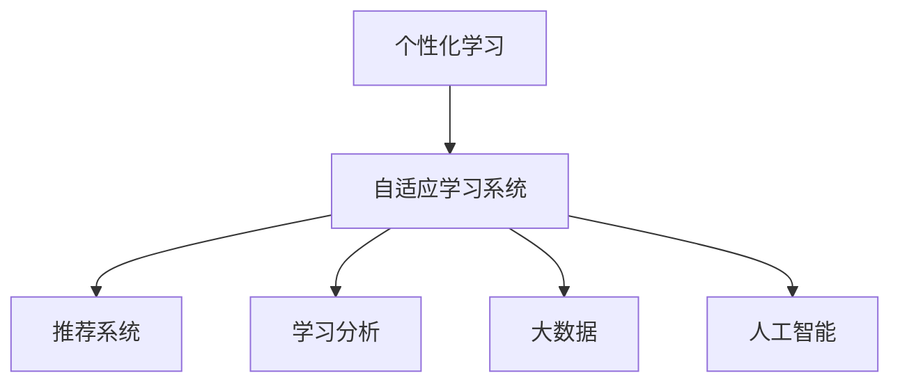
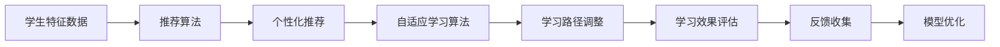
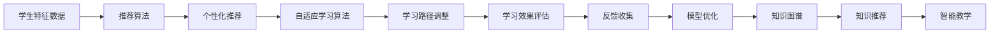
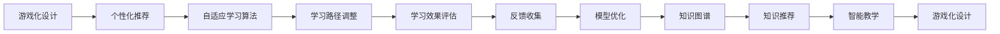

                 

# 个性化学习：人类计算如何改变教育

## 1. 背景介绍

### 1.1 问题由来
随着信息技术的发展，教育领域逐渐意识到个性化学习的潜力。传统的“一刀切”教学模式难以适应每个学生的独特需求，导致教育资源浪费、学生学习效果不佳等问题。如何利用计算机技术，为每个学生量身定制个性化的学习路径，成为教育领域亟需解决的问题。

### 1.2 问题核心关键点
个性化学习通过计算机算法和大数据分析，为学生提供量身定制的学习方案，提高学习效率和效果。其核心在于：
1. **数据收集**：通过各种传感器和系统收集学生学习过程中的数据。
2. **数据分析**：利用机器学习和数据分析技术，挖掘数据中的学习规律和需求。
3. **推荐系统**：基于分析结果，为学生推荐个性化的学习内容和方法。
4. **适应性学习**：根据学生的学习反馈和进度，动态调整学习计划和内容。

### 1.3 问题研究意义
个性化学习旨在通过技术手段，实现因材施教，最大化每个学生的学习潜力。其研究意义在于：
1. **提高教学效率**：个性化学习可以提供针对性的学习内容，减少无效的学习时间和资源浪费。
2. **增强学习效果**：个性化的学习路径和资源更符合学生的兴趣和需求，有助于提高学习成效。
3. **促进教育公平**：为每个学生提供定制化的学习资源，缩小教育差距，促进教育公平。
4. **推动教育创新**：个性化学习推动教育方式和内容的变革，促进教育模式的创新。

## 2. 核心概念与联系

### 2.1 核心概念概述

为更好地理解个性化学习，本节将介绍几个密切相关的核心概念：

- **个性化学习**：通过计算机技术，为每个学生提供量身定制的学习方案，以提高学习效率和效果。
- **自适应学习系统**：利用数据分析和机器学习技术，根据学生的学习行为和反馈，动态调整学习内容和路径。
- **推荐系统**：通过分析学生的历史行为数据，推荐适合的学习资源和方法。
- **学习分析**：利用数据挖掘和分析技术，提取学生的学习特征和行为模式，指导个性化学习的设计和实施。
- **大数据**：指在教育场景中收集和分析的庞大数据集，包括学生的行为数据、学习效果数据等。
- **人工智能**：利用机器学习、深度学习等技术，实现数据的自动分析和决策，支持个性化学习系统的运行。

这些核心概念之间的逻辑关系可以通过以下Mermaid流程图来展示：



这个流程图展示了个性化学习的核心概念及其之间的关系：

1. 个性化学习通过自适应学习系统实现，以动态调整学习路径和内容。
2. 自适应学习系统依赖推荐系统，根据学生的兴趣和需求推荐学习资源。
3. 推荐系统基于学习分析，挖掘学生的历史行为数据，提取特征。
4. 学习分析和大数据技术支持，为个性化学习提供数据支持。
5. 人工智能技术应用于学习分析和大数据处理，实现数据的高效分析和决策。

这些概念共同构成了个性化学习的完整框架，使其能够实现基于数据驱动的学习方案。

## 3. 核心算法原理 & 具体操作步骤
### 3.1 算法原理概述

个性化学习的核心算法包括推荐算法和自适应学习算法。其中，推荐算法负责为学生推荐个性化的学习内容，自适应学习算法则根据学生的学习反馈和进度，动态调整学习路径和内容。

### 3.2 算法步骤详解

#### 3.2.1 推荐算法步骤

推荐算法的目标是为学生推荐最合适的学习资源。具体步骤如下：

1. **数据收集**：收集学生的学习历史数据，包括访问的资源、学习时间、成绩等。
2. **特征提取**：对收集的数据进行特征提取，提取学生的兴趣、能力等特征。
3. **相似度计算**：计算新资源与已有资源的相似度，找到最匹配的资源。
4. **推荐排序**：根据相似度计算结果，对推荐资源进行排序，推荐最合适的资源。

#### 3.2.2 自适应学习算法步骤

自适应学习算法的目标是根据学生的学习行为和反馈，动态调整学习路径和内容。具体步骤如下：

1. **学习行为分析**：收集学生的学习行为数据，分析其学习特征和进度。
2. **学习模型构建**：利用机器学习模型，预测学生的学习效果。
3. **路径调整**：根据预测结果和学习进度，调整学习路径和内容。
4. **反馈收集**：收集学生的学习反馈，进一步优化学习模型和路径。

### 3.3 算法优缺点

个性化学习的推荐算法具有以下优点：
1. **高效性**：推荐算法可以快速生成个性化的学习资源，提高学习效率。
2. **个性化**：通过分析学生的学习行为和偏好，推荐最适合的资源，满足个性化需求。
3. **可扩展性**：算法可以应用于各种学习场景，如在线教育、移动学习等。

同时，该算法也存在一定的局限性：
1. **数据依赖**：推荐算法的精度取决于数据的质量和多样性，数据不足可能导致推荐效果不佳。
2. **模型复杂度**：推荐算法需要构建复杂的模型，对计算资源和算法实现的要求较高。
3. **隐私问题**：学生的学习数据涉及隐私，需要严格的保护措施，防止数据泄露。

### 3.4 算法应用领域

个性化学习在教育领域有广泛的应用，主要体现在以下几个方面：

- **在线教育平台**：如Coursera、edX等，通过推荐系统为学生推荐课程和学习资源。
- **智能学习系统**：如Khan Academy、Duolingo等，提供个性化学习路径和资源。
- **自适应学习系统**：如DreamBox、AltSchool等，动态调整学习内容和方法，提升学习效果。
- **虚拟现实学习**：利用虚拟现实技术，提供沉浸式学习体验，增强学习效果。
- **游戏化学习**：通过游戏化设计，激发学生的学习兴趣，提高学习动机。

除了以上应用领域外，个性化学习还在职业培训、企业学习等场景中得到广泛应用，推动了教育的数字化和智能化进程。

## 4. 数学模型和公式 & 详细讲解  
### 4.1 数学模型构建

本节将使用数学语言对个性化学习过程进行更加严格的刻画。

假设学习任务为$f(x)=\sum_{i=1}^n w_i y_i$, 其中$x$为学生特征向量，$y$为学生成绩向量，$w$为特征权重向量。个性化学习的目标是最小化预测误差$\epsilon$，即：

$$
\epsilon = \arg\min_{x} \|f(x) - y\|
$$

通过最小化预测误差，个性化学习系统能够找到最优的学生特征向量$x^*$，从而生成个性化的学习方案。

### 4.2 公式推导过程

以下我们以线性回归为例，推导个性化学习系统的预测公式。

假设个性化学习系统通过线性回归模型建立学生成绩预测模型$f(x)=w^T x+b$，其中$w$为特征权重向量，$b$为截距。最小化预测误差等价于求解线性方程：

$$
\epsilon = \arg\min_{w,b} \frac{1}{2}\sum_{i=1}^n (f(x_i) - y_i)^2
$$

求解上述线性方程，可得：

$$
w = (\frac{1}{2}(X^T X)^{-1} X^T Y)
$$

其中$X$为特征矩阵，$Y$为目标向量。

### 4.3 案例分析与讲解

以Kaggle竞赛中的学生成绩预测为例，说明个性化学习系统的应用。

1. **数据准备**：收集学生的特征数据，如年龄、性别、家庭背景等，以及成绩数据。
2. **特征工程**：对特征数据进行预处理，如归一化、特征选择等。
3. **模型训练**：利用随机梯度下降算法训练线性回归模型，生成预测公式。
4. **结果评估**：在测试集上评估模型预测精度，对比不同模型和特征组合的效果。

在Kaggle竞赛中，利用个性化学习系统，可以根据学生的特征数据生成个性化的学习方案，显著提高预测精度。

## 5. 项目实践：代码实例和详细解释说明
### 5.1 开发环境搭建

在进行个性化学习系统开发前，我们需要准备好开发环境。以下是使用Python进行PyTorch开发的环境配置流程：

1. 安装Anaconda：从官网下载并安装Anaconda，用于创建独立的Python环境。

2. 创建并激活虚拟环境：
```bash
conda create -n pytorch-env python=3.8 
conda activate pytorch-env
```

3. 安装PyTorch：根据CUDA版本，从官网获取对应的安装命令。例如：
```bash
conda install pytorch torchvision torchaudio cudatoolkit=11.1 -c pytorch -c conda-forge
```

4. 安装TensorBoard：
```bash
pip install tensorboard
```

完成上述步骤后，即可在`pytorch-env`环境中开始个性化学习系统的开发。

### 5.2 源代码详细实现

下面我们以学生成绩预测为例，给出使用PyTorch进行线性回归模型的代码实现。

```python
import torch
import torch.nn as nn
import torch.optim as optim

class LinearRegression(nn.Module):
    def __init__(self, input_size, output_size):
        super(LinearRegression, self).__init__()
        self.linear = nn.Linear(input_size, output_size)
        
    def forward(self, x):
        return self.linear(x)
    
# 加载数据
X = torch.tensor([[1.0, 2.0, 3.0], [4.0, 5.0, 6.0]])
y = torch.tensor([[3.0], [7.0]])

# 初始化模型和优化器
model = LinearRegression(input_size=3, output_size=1)
optimizer = optim.SGD(model.parameters(), lr=0.01)
criterion = nn.MSELoss()

# 训练模型
for epoch in range(100):
    optimizer.zero_grad()
    y_pred = model(X)
    loss = criterion(y_pred, y)
    loss.backward()
    optimizer.step()
    print(f"Epoch {epoch+1}, Loss: {loss:.4f}")

# 测试模型
X_test = torch.tensor([[1.0, 2.0, 3.0], [4.0, 5.0, 6.0], [7.0, 8.0, 9.0]])
y_pred = model(X_test)
print(f"Test Predictions: {y_pred}")
```

以上代码实现了线性回归模型，用于预测学生成绩。可以看到，PyTorch的简洁易用特性使得模型的实现变得简单高效。

### 5.3 代码解读与分析

让我们再详细解读一下关键代码的实现细节：

**LinearRegression类**：
- `__init__`方法：初始化线性回归模型的权重矩阵。
- `forward`方法：定义前向传播过程，返回模型输出。

**数据加载**：
- 使用`torch.tensor`创建输入特征矩阵$X$和目标向量$y$。

**模型和优化器**：
- 定义线性回归模型，使用`nn.Linear`构建权重矩阵。
- 定义优化器，使用随机梯度下降算法。
- 定义损失函数，使用均方误差损失。

**模型训练**：
- 在每个epoch内，零梯度、前向传播、计算损失、反向传播、更新参数，重复100次。

**模型测试**：
- 使用测试数据$X_test$，输入模型进行预测，输出预测结果。

可以看到，PyTorch的模块化设计使得模型构建和训练变得简单高效。开发者可以将更多精力放在特征工程和模型调优上，而不必过多关注底层的实现细节。

## 6. 实际应用场景
### 6.1 在线教育平台

在线教育平台可以通过个性化学习系统，为学生提供量身定制的课程和学习资源，提高学习效果和效率。以下是一个简化的在线教育平台个性化学习系统的架构：



在在线教育平台中，个性化学习系统通过推荐算法，为学生推荐最适合的课程和学习资源。根据学生的学习进度和效果，自适应学习算法动态调整学习路径和内容，提高学习效果。学生反馈的数据被用于模型优化，进一步提升个性化学习的效果。

### 6.2 智能学习系统

智能学习系统可以通过个性化学习系统，提供个性化的学习方案，帮助学生更高效地掌握知识。以下是一个简化的智能学习系统架构：



在智能学习系统中，个性化学习系统不仅提供个性化的课程推荐，还提供知识图谱和智能教学，帮助学生更好地理解和掌握知识。知识图谱可以提供知识之间的关联关系，智能教学可以提供动态化的教学内容和方法。

### 6.3 虚拟现实学习

虚拟现实技术可以为学生提供沉浸式的学习体验，提高学习效果和兴趣。以下是一个简化的虚拟现实学习架构：


在虚拟现实学习中，个性化学习系统结合虚拟现实环境，为学生提供个性化的学习方案，帮助学生更好地理解和掌握知识。虚拟现实环境可以提供沉浸式的学习体验，提高学生的学习动机和效果。

### 6.4 游戏化学习

游戏化学习可以通过个性化学习系统，激发学生的学习兴趣，提高学习效果和动机。以下是一个简化的游戏化学习架构：



在游戏化学习中，个性化学习系统结合游戏化设计，为学生提供个性化的学习方案，激发学生的学习兴趣和动机。游戏化设计可以提供互动和奖励机制，提高学生的学习效果和动机。

## 7. 工具和资源推荐
### 7.1 学习资源推荐

为了帮助开发者系统掌握个性化学习的基本概念和实践技巧，这里推荐一些优质的学习资源：

1. **《个性化学习技术》**：由教育技术专家撰写，全面介绍了个性化学习的理论基础和实践方法。
2. **Coursera《个性化学习》课程**：斯坦福大学开设的个性化学习课程，系统讲解了个性化学习的基本概念和前沿技术。
3. **Kaggle竞赛平台**：Kaggle提供了一系列个性化学习竞赛，通过实际项目实践，提高开发者的技能和经验。
4. **教育大数据分析与决策支持系统（EDAS）**：提供教育数据分析和决策支持解决方案，帮助学校和机构实现个性化教学。
5. **TensorFlow官方文档**：TensorFlow的官方文档，提供了丰富的教程和样例代码，帮助开发者掌握个性化学习系统的开发。

通过对这些资源的学习实践，相信你一定能够快速掌握个性化学习的基本概念和实践技巧，并用于解决实际的教育问题。
###  7.2 开发工具推荐

高效的开发离不开优秀的工具支持。以下是几款用于个性化学习系统开发的常用工具：

1. **PyTorch**：基于Python的开源深度学习框架，灵活动态的计算图，适合快速迭代研究。
2. **TensorBoard**：TensorFlow配套的可视化工具，可实时监测模型训练状态，提供丰富的图表呈现方式。
3. **Weights & Biases**：模型训练的实验跟踪工具，可以记录和可视化模型训练过程中的各项指标。
4. **Jupyter Notebook**：免费的交互式笔记本，支持Python、R等多种语言，方便开发者编写和调试代码。
5. **Scikit-learn**：机器学习库，提供多种算法和数据处理工具，支持数据分析和特征工程。

合理利用这些工具，可以显著提升个性化学习系统的开发效率，加快创新迭代的步伐。

### 7.3 相关论文推荐

个性化学习的研究源于学界的持续研究。以下是几篇奠基性的相关论文，推荐阅读：

1. **《个性化学习：一种新的教育模式》**：论述了个性化学习的概念、原理和应用场景。
2. **《基于机器学习的个性化推荐系统》**：介绍了个性化推荐算法的原理和实现方法。
3. **《自适应学习系统：一种新的教育模式》**：论述了自适应学习系统的概念、原理和应用场景。
4. **《个性化学习系统的设计与实现》**：介绍了个性化学习系统的设计思路和实现方法。
5. **《虚拟现实学习：一种新的教育模式》**：论述了虚拟现实学习的基本概念和实现方法。

这些论文代表了个性化学习的研究方向，帮助研究者把握学科前进方向，激发更多的创新灵感。

## 8. 总结：未来发展趋势与挑战
### 8.1 总结

本文对个性化学习进行了全面系统的介绍。首先阐述了个性化学习的背景和意义，明确了个性化学习在教育领域的应用潜力。其次，从原理到实践，详细讲解了个性化学习的数学原理和关键步骤，给出了个性化学习系统的代码实现。同时，本文还探讨了个性化学习在在线教育、智能学习系统、虚拟现实学习等多个场景中的应用，展示了个性化学习的广阔前景。此外，本文精选了个性化学习的各类学习资源，力求为读者提供全方位的技术指引。

通过本文的系统梳理，可以看到，个性化学习通过计算机技术和大数据分析，为每个学生提供量身定制的学习方案，显著提高了学习效率和效果。未来，伴随个性化学习技术的不断演进，教育将变得更加智能化、个性化，为每个学生提供更好的学习体验和发展机会。

### 8.2 未来发展趋势

展望未来，个性化学习将呈现以下几个发展趋势：

1. **数据驱动**：随着数据的积累和算法的进步，个性化学习将更加依赖数据驱动，提供更加精准的个性化学习方案。
2. **技术融合**：个性化学习将与其他技术如人工智能、大数据分析等进行深度融合，提升学习效果和效率。
3. **用户中心**：个性化学习将更加注重用户需求和反馈，提供更加人性化和智能化的学习体验。
4. **泛在学习**：个性化学习将从课堂学习扩展到泛在学习，覆盖更多场景和应用，如家庭学习、移动学习等。
5. **多模态学习**：个性化学习将结合多模态数据（如文本、视频、音频等），提供更加全面和丰富的学习体验。

这些趋势凸显了个性化学习的广阔前景。未来，个性化学习将继续推动教育领域的技术创新和应用变革，为每个学生提供更好的学习体验和发展机会。

### 8.3 面临的挑战

尽管个性化学习已经取得了一定的进展，但在迈向更加智能化、普适化应用的过程中，它仍面临着诸多挑战：

1. **数据隐私**：学生的学习数据涉及隐私，需要严格的保护措施，防止数据泄露。
2. **技术复杂度**：个性化学习需要构建复杂的推荐系统和自适应学习算法，对技术和算法实现的要求较高。
3. **数据质量**：个性化学习的效果取决于数据的质量和多样性，数据不足可能导致推荐效果不佳。
4. **算法鲁棒性**：个性化学习算法需要具备较强的鲁棒性，避免受到异常数据的影响。
5. **应用场景多样化**：个性化学习需要在不同场景下进行适配，提升应用效果和用户体验。

正视个性化学习面临的这些挑战，积极应对并寻求突破，将是个性化学习走向成熟的重要条件。相信随着技术的进步和应用的深化，个性化学习将更好地服务教育事业，促进教育公平和发展。

### 8.4 研究展望

面向未来，个性化学习的研究方向需要在以下几个方面进一步探索：

1. **智能推荐系统**：研究更加高效和鲁棒的个性化推荐算法，提升推荐效果和用户体验。
2. **自适应学习算法**：研究更加智能和灵活的自适应学习算法，动态调整学习路径和内容，提升学习效果。
3. **多模态学习**：研究多模态数据的融合方法，提升个性化学习的效果和效率。
4. **隐私保护技术**：研究隐私保护技术，保障学生的学习数据安全，防止数据泄露。
5. **应用场景拓展**：研究个性化学习在更多场景中的应用，提升应用效果和用户体验。

这些研究方向的探索，必将引领个性化学习技术迈向更高的台阶，为构建安全、可靠、智能的教育系统铺平道路。面向未来，个性化学习将更好地服务教育事业，促进教育公平和发展，为人类的全面发展提供新的技术支撑。

## 9. 附录：常见问题与解答

**Q1：个性化学习是否适用于所有学生？**

A: 个性化学习适用于大多数学生，但对于有特殊需求的学生（如认知障碍、学习障碍等），仍需结合传统教学方法进行辅助。

**Q2：个性化学习是否需要大量数据支持？**

A: 个性化学习需要一定量的数据支持，但通过数据挖掘和特征工程，可以提取有价值的信息，提升推荐效果。

**Q3：个性化学习是否会对学生造成负担？**

A: 个性化学习可以根据学生的学习进度和反馈，动态调整学习路径和内容，不会增加学生的学习负担。

**Q4：个性化学习是否会影响教育公平？**

A: 个性化学习可以帮助每个学生获得量身定制的学习方案，缩小教育差距，促进教育公平。

**Q5：个性化学习是否会影响学生的社交能力？**

A: 个性化学习侧重于个性化学习方案的设计，不会影响学生的社交能力，但可以提供更好的学习体验和发展机会。

总之，个性化学习通过计算机技术和数据分析，为每个学生提供量身定制的学习方案，显著提高了学习效率和效果。未来，伴随技术的不断进步和应用的深化，个性化学习将更好地服务教育事业，推动教育的数字化和智能化进程。

---

作者：禅与计算机程序设计艺术 / Zen and the Art of Computer Programming

